# Planning Commands: Getting Started (Lite)

A streamlined 10-command pipeline for feature planning and implementation. No infrastructure dependencies — just standard tools (grep, glob, view, bash).

---

## The Big Picture

```mermaid
flowchart TB
    subgraph specify["SPECIFY · Once per feature"]
        P1A["/plan-1a-explore"]
        P1B["/plan-1b-specify"]
        P2C["/plan-2c-workshop"]
        P3["/plan-3-architect"]
    end

    subgraph implement["IMPLEMENT · Per phase"]
        P5["/plan-5-phase-tasks"]
        P5B["/plan-5b-flightplan"]
        P6["/plan-6-implement"]
        P7["/plan-7-code-review"]
    end

    subgraph utilities["UTILITIES · Anytime"]
        DYK["/didyouknow"]
        DR["/deepresearch"]
    end

    P1A -.-> P1B
    P1B -.-> P2C
    P2C -.-> P3
    P1B --> P3

    P3 --> P5
    P5 -->|auto| P5B
    P5 --> P6
    P6 --> P7

    P7 -->|Next phase| P5
    P7 -.->|fixes| P6

    DYK -.-> P5
    DYK -.-> P6
    DR -.-> P1A
    DR -.-> P3

    style P1A fill:#fff3e0
    style P1B fill:#e3f2fd
    style P2C fill:#fff3e0
    style P3 fill:#fff9c4
    style P5 fill:#e8f5e9
    style P5B fill:#e8f5e9
    style P6 fill:#c8e6c9
    style P7 fill:#fce4ec
    style DYK fill:#e1f5fe
    style DR fill:#e1f5fe
```



**Solid lines** = required flow. **Dashed lines** = optional shortcuts.

---

## How It Works

### 1. Research the codebase *(optional)*

Run `/plan-1a-explore` to scan the codebase with parallel subagents. Produces a `research-dossier.md` with findings about patterns, conventions, and integration points. Skip this if you already know the codebase well.

### 2. Write a tech-free spec

Run `/plan-1b-specify` with a plain-language feature description. It generates a spec focused on **what** and **why** — no implementation details. The spec includes a complexity score (CS 1–5) and flags any topics that need deeper design work.

### 3. Deep-dive complex designs *(optional)*

If the spec flags Workshop Opportunities, run `/plan-2c-workshop` to produce detailed design documents before planning. Best for data models, state machines, or tricky algorithms.

### 4. Generate the plan

Run `/plan-3-architect`. It checks your spec, asks 2–3 inline questions (including your preferred **testing approach**: Standard, Lightweight, or None), launches 4 research subagents against the codebase, and produces a phased implementation plan with tasks and acceptance criteria.

### 5. Execute per phase (repeat)

For each phase in the plan:

1. **`/plan-5`** — generates a task table and alignment brief. Auto-calls `/plan-5b` to produce a flight plan summary.
2. **`/plan-6`** — implements the phase, writing code and tracking progress with 3-step inline updates per task.
3. **`/plan-7`** — reviews the diff. Verdict: **APPROVE** (advance) or **REQUEST_CHANGES** (back to `/plan-6`).

### 6. Use utilities anytime

- **`/didyouknow`** — surfaces 5 critical insights from any context. Best after generating a spec, plan, or task list.
- **`/deepresearch`** — crafts a structured prompt for external research when the codebase can't answer a question.

---

## Example Walkthrough

> **Scenario**: Adding a `POST /api/widgets` endpoint to an existing Express app.

```
1.  /plan-1a-explore
    → "Explore how API endpoints are structured in this project"
    → Produces: docs/plans/005-api-widgets/research-dossier.md

2.  /plan-1b-specify
    → "Add a POST endpoint for creating widgets with name and color fields"
    → Produces: api-widgets-spec.md (CS 2, no workshops needed)

3.  /plan-3-architect
    → Reads the spec, asks: "Testing approach?" → "Standard"
    → Launches 4 research subagents against codebase
    → Produces: api-widgets-plan.md (2 phases)

4.  /plan-5-phase-tasks-and-brief --phase "Phase 1: Route & Validation"
    → Produces: tasks.md with 3 tasks + flight plan

5.  /didyouknow
    → "Review the Phase 1 tasks" → surfaces 5 insights

6.  /plan-6-implement-phase --phase "Phase 1"
    → Implements route, validation, and tests
    → Updates task checkboxes, log anchors, execution.log.md

7.  /plan-7-code-review --plan "docs/plans/005-api-widgets/api-widgets-plan.md"
    → Reviews diff → ✅ APPROVE

8.  /plan-5-phase-tasks-and-brief --phase "Phase 2: Error Handling & Docs"
    → Generates tasks for phase 2

9.  /plan-6-implement-phase --phase "Phase 2"
    → Implements error handlers and API docs

10. /plan-7-code-review --plan "docs/plans/005-api-widgets/api-widgets-plan.md"
    → Reviews diff → ✅ APPROVE → Feature complete 🎉
```

---

## Quick Reference

| Command | Description | Produces | Next Step |
|---------|-------------|----------|-----------|
| `/plan-1a-explore` | Deep-dive codebase research | `research-dossier.md` | `/plan-1b-specify` |
| `/plan-1b-specify` | Tech-free feature spec (WHAT/WHY) | `<slug>-spec.md` | `/plan-3-architect` |
| `/plan-2c-workshop` | Detailed design for complex topics | `workshops/<topic>.md` | `/plan-3-architect` |
| `/plan-3-architect` | Phased implementation plan | `<slug>-plan.md` | `/plan-5` |
| `/plan-5` | Task table + alignment brief | `tasks.md` + `.fltplan.md` | `/plan-6` |
| `/plan-5b-flightplan` | Phase summary with diagrams | `.fltplan.md` | `/plan-6` |
| `/plan-6-implement-phase` | Write code + inline progress tracking | Code + `execution.log.md` | `/plan-7` |
| `/plan-7-code-review` | Diff review with structured verdict | `review.md` | `/plan-5` (next phase) |
| `/didyouknow` | 5 critical insights from any context | Conversational output | Continue working |
| `/deepresearch` | Structured prompt for external research | Research prompt | Feed into any step |

---

## Key Concepts

### Complexity Scoring (CS 1–5)

Assigned by `/plan-1b-specify` during spec generation. Guides how much planning is needed:

| CS | Scope | Typical Phases |
|----|-------|---------------|
| 1 | Trivial — config change, typo fix | 1 |
| 2 | Simple — single module, clear path | 1–2 |
| 3 | Moderate — multiple modules, some design | 2–3 |
| 4 | Complex — cross-cutting, new patterns | 3–5 |
| 5 | Major — architectural change, high risk | 5+ |

### Progress Tracking

`/plan-6` tracks progress with 3 inline steps per task — no separate delegation:

1. **Checkbox** — update `[ ]` → `[x]` in the task table
2. **Log anchor** — add `log#task-t001-slug` in the Notes column
3. **Exec log entry** — append `## Task T001` to `execution.log.md`

### Testing Approach

Chosen during `/plan-3-architect`'s entry gate. Three options:

| Approach | What it means | When to use |
|----------|--------------|-------------|
| **Standard** | Unit + integration tests per task | Production features, APIs |
| **Lightweight** | Core validation only | Internal tools, scripts |
| **None** | Manual verification | Docs, config, prototypes |

---

## Directory Structure

```
docs/plans/
└── 005-api-widgets/
    ├── research-dossier.md       ← /plan-1a (optional)
    ├── api-widgets-spec.md       ← /plan-1b
    ├── api-widgets-plan.md       ← /plan-3
    ├── execution.log.md          ← /plan-6
    ├── workshops/                ← /plan-2c (optional)
    │   └── data-model.md
    └── reviews/                  ← /plan-7
        └── review.md
```

3–6 files. 1–2 subdirectories. That's it.

---

## Need More?

See **[README.md](./README.md)** for the full command reference, flag documentation, and advanced usage patterns.
