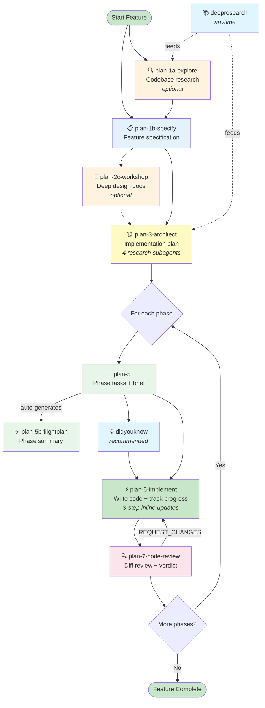

# /plan Commands Workflow Guide (Lite)

> **10 commands. Zero infrastructure dependencies. Standard tools only.**

## Overview

The **lite pipeline** is a streamlined version of the `/plan` agent workflow, purpose-built for LLM coding agents that use only standard tools (`grep`, `glob`, `view`, `bash`). It delivers the same structured planning-to-review cycle as the full pipeline but strips away every infrastructure dependency and optional ceremony.

**Who it's for:**
- Agents without specialized MCP integrations or advanced infrastructure
- Teams that want structured planning without heavyweight tooling
- Quick features (CS 1–3) where full-pipeline overhead isn't justified
- Any environment where `grep`, `glob`, `view`, and `bash` are the only available tools

**What's included:** 10 commands in 3 groups — Specify (4), Implement (4), Utilities (2).

**What's excluded:** No specialized MCP servers, no feature-folder file management, no ledger tracking system, no project constitution, no cross-branch ordinal numbering. Progress tracking is inline, not delegated.

---

## Core Philosophy


1. **Specify** — Understand the codebase, write a spec (WHAT/WHY only), optionally workshop complex topics, then generate the plan.
2. **Plan** — Break each phase into executable tasks with a flight plan summary.
3. **Implement** — Write code, track progress inline with a 3-step update per task.
4. **Review** — Diff-based code review producing APPROVE or REQUEST_CHANGES.

---

## Command Flow Diagram



---

## Quick Start

**Minimal path** — specify, plan, implement, review:

```bash
# 1. Write the feature spec
/plan-1b-specify "Add CSV export to the reports page"

# 2. Generate the implementation plan
/plan-3-architect --spec docs/plans/001-csv-export/csv-export-spec.md

# 3. Generate tasks for Phase 1
/plan-5 --phase "Phase 1" --plan docs/plans/001-csv-export/csv-export-plan.md

# 4. (Recommended) Surface insights before coding
/didyouknow --tasks docs/plans/001-csv-export/phase-1/tasks.md

# 5. Implement Phase 1
/plan-6-implement-phase --phase "Phase 1" --plan docs/plans/001-csv-export/csv-export-plan.md

# 6. Review Phase 1
/plan-7-code-review --plan docs/plans/001-csv-export/csv-export-plan.md

# 7. Repeat steps 3-6 for each remaining phase
```

**Full path** — add optional exploration and workshops:

```bash
# 0a. Research the codebase first
/plan-1a-explore "How does the reports page currently work?"

# 0b. Deep-dive a complex topic
/plan-2c-workshop 001-csv-export "streaming large CSV files"

# Then continue with steps 1-7 above
```

---

## Core Workflow Commands

### `/plan-1a-explore` — Codebase Research

> Deep-dive research into existing codebase functionality. Auto-detects plan context or creates new plan folder.

| | |
|---|---|
| **When** | Before writing a spec, or anytime you need to understand existing code |
| **Key flags** | `--plan <name>`, `--console` (output to console only) |
| **Produces** | `research-dossier.md` in the plan folder |
| **Next step** | `/plan-1b-specify` |

Launches research subagents using `grep`, `glob`, and `view` to survey the codebase. Findings are deduplicated and written to a structured dossier.

---

### `/plan-1b-specify` — Feature Specification

> Create or update the feature specification from a natural language feature description, focusing on user value (WHAT/WHY) without implementation details.

| | |
|---|---|
| **When** | Start of every feature — the first required command |
| **Key flags** | None — takes a natural-language feature description |
| **Produces** | `<slug>-spec.md` with acceptance criteria, CS score, workshop opportunities |
| **Next step** | `/plan-2c-workshop` (if workshops identified) or `/plan-3-architect` |

Reads any existing `research-dossier.md`, generates a spec focused on WHAT and WHY (no implementation details), and scores complexity (CS 1–5).

---

### `/plan-3-architect` — Implementation Plan

> Perform planning and architecture, generating a phase-based plan with success criteria before implementation.

| | |
|---|---|
| **When** | After the spec is written (and optionally workshopped) |
| **Key flags** | `--spec <path>` |
| **Produces** | `<slug>-plan.md` with phases, tasks, ACs, testing approach |
| **Next step** | `/plan-5` for the first phase |

Runs an entry gate (checks spec quality, asks 2–3 key questions inline), then launches 4 parallel research subagents (Codebase Pattern Analyst, Technical Investigator, Discovery Documenter, Dependency Mapper) using `grep`/`glob`/`view`. Synthesizes findings into a phased plan with inline task tables.

---

### `/plan-5` — Phase Tasks & Brief

> Generate a `tasks.md` dossier (tasks + alignment brief) for a phase or subtask under the plan tree; stop before making code changes. Use `--subtask` for mid-phase detours.

| | |
|---|---|
| **When** | Before implementing each phase |
| **Key flags** | `--phase "Phase N"`, `--plan <path>`, `--subtask` |
| **Produces** | `tasks.md` dossier with task table + alignment brief, auto-calls `/plan-5b-flightplan` |
| **Next step** | `/didyouknow` (recommended) then `/plan-6-implement-phase` |

Transforms high-level plan tasks into executable work items with full context. Includes a pre-implementation audit and automatically generates a flight plan.

---

### `/plan-5b-flightplan` — Phase Summary

> Generate a consumable Flight Plan (.fltplan.md) summarizing what a phase will do, with before/after architecture diagrams. Auto-called by plan-5 or run standalone.

| | |
|---|---|
| **When** | Auto-called by `/plan-5`; run standalone to regenerate after changes |
| **Key flags** | `--phase "Phase N"`, `--plan <path>` |
| **Produces** | `.fltplan.md` — a 30-second scannable summary with architecture diagrams |
| **Next step** | `/plan-6-implement-phase` |

The "boarding pass" for a phase — distills the plan and task dossier into a document anyone can scan quickly.

---

### `/plan-6-implement-phase` — Implementation

> Implement exactly one phase using the testing approach specified in the plan, recording progress inline.

| | |
|---|---|
| **When** | After tasks are generated for a phase |
| **Key flags** | `--phase "Phase N"`, `--plan <path>` |
| **Produces** | Code changes + `execution.log.md` with per-task entries |
| **Next step** | `/plan-7-code-review` |

Picks tasks from the plan, writes code, and performs the **3-step inline progress update** per task (see [Progress Tracking](#progress-tracking)). Logs discoveries immediately as they occur.

---

### `/plan-7-code-review` — Code Review

> Read-only per-phase code review that inspects diffs, verifies doctrine compliance, and produces structured findings without modifying code.

| | |
|---|---|
| **When** | After a phase is implemented |
| **Key flags** | `--plan <path>` |
| **Produces** | `review.md` with findings + verdict; `fix-tasks.md` if REQUEST_CHANGES |
| **Next step** | `/plan-5` for next phase (if APPROVE) or `/plan-6-implement-phase` (if REQUEST_CHANGES) |

Launches review subagents that validate: code quality & architecture alignment, test coverage & approach compliance, task↔log consistency, and log↔diff accuracy. Returns **APPROVE** or **REQUEST_CHANGES** with actionable fix-tasks.

---

## Standalone Utilities

These commands have no fixed pipeline position — use them anytime.

### `/didyouknow` — Build Understanding

> Universal clarity utility — deep think 5 critical insights and discuss conversationally to build shared understanding. Run after any spec/plan/tasks/code.

**Best after:** `/plan-5` (review tasks before coding), `/plan-1b-specify` (validate spec), or `/plan-6-implement-phase` (reflect on implementation).

```bash
/didyouknow --spec docs/plans/001-feature/feature-spec.md
/didyouknow --plan docs/plans/001-feature/feature-plan.md
/didyouknow --tasks docs/plans/001-feature/phase-1/tasks.md
```

### `/deepresearch` — External Knowledge

> A command for crafting structured research prompts to leverage deep research agents for solving coding challenges, including problem definition, context, and practical examples.

**Best for:** Gaps that codebase search can't answer — external APIs, best practices, library comparisons, unfamiliar domains.

```bash
/deepresearch "What's the best approach for streaming large CSV exports in Python?"
```

### `/plan-2c-workshop` — Deep Design Documents

> Create detailed design documents for complex concepts identified in the spec's Workshop Opportunities, or any topic needing deep exploration.

**Best before:** `/plan-3-architect` — resolve complex design questions so the plan is well-informed.

```bash
/plan-2c-workshop 001-csv-export "streaming large CSV files"
/plan-2c-workshop 001-csv-export --from-spec    # Pick from spec's Workshop Opportunities
/plan-2c-workshop 001-csv-export --list          # List existing workshops
```

---

## Complexity Scoring (CS 1–5)

The spec (`/plan-1b-specify`) and plan (`/plan-3-architect`) score feature complexity on a 1–5 scale across 6 dimensions:

| Dimension | 1 (Low) | 3 (Medium) | 5 (High) |
|-----------|---------|------------|----------|
| **Surface Area** | 1–2 files | 5–10 files | 15+ files, cross-cutting |
| **Integration** | Self-contained | 2–3 touch points | Deep integration across systems |
| **Data / State** | Stateless or trivial | Moderate state, 1 store | Complex state, migrations, caches |
| **Novelty** | Well-known pattern | Some unknowns | Greenfield or unfamiliar domain |
| **NFR** | None specified | Performance or security | Multiple NFRs, strict SLAs |
| **Testing** | Simple unit tests | Integration tests needed | E2E, load, or compliance tests |

**Final CS = average across dimensions, rounded to nearest integer.**

| CS | Label | Typical Phases | Guidance |
|----|-------|----------------|----------|
| 1 | Trivial | 1 | Single-phase, no workshops needed |
| 2 | Simple | 1–2 | Straightforward, minimal research |
| 3 | Moderate | 2–3 | Standard feature, workshops optional |
| 4 | Complex | 3–5 | Workshops recommended, careful phasing |
| 5 | Very Complex | 5+ | Workshops required, extensive research |

---

## Testing Philosophy

Three clear choices — decided during `/plan-3-architect`'s entry gate and encoded in the plan:

| Approach | When to Use | What plan-6 Does | What plan-7 Checks |
|----------|-------------|-------------------|---------------------|
| **Standard** | CS ≥ 3, or code with complex logic | Unit + integration tests per task | Test coverage, test quality, approach compliance |
| **Lightweight** | CS 1–2, config changes, simple features | Core validation only (smoke tests) | Tests exist for critical paths |
| **None** | Documentation, refactoring, trivial changes | Manual verification notes in exec log | Verification notes present |

Plan-3 asks "What testing approach?" during its entry gate, writes the answer into the plan, and both plan-6 and plan-7 respect it throughout implementation.

---

## Directory Structure

The lite pipeline produces a minimal, flat directory tree:

```
docs/plans/
└── 001-my-feature/
    ├── research-dossier.md          ← plan-1a (optional)
    ├── my-feature-spec.md           ← plan-1b
    ├── my-feature-plan.md           ← plan-3 (with inline tasks)
    ├── execution.log.md             ← plan-6 (progress record)
    ├── workshops/                   ← plan-2c (optional)
    │   ├── data-model.md
    │   └── cli-flows.md
    └── reviews/                     ← plan-7 (optional)
        ├── review.md
        └── fix-tasks.md
```

**3–6 files in 1–2 subdirectories.** No separate task folders, no ledger dossiers, no specialized artifacts.

---

## Progress Tracking

Progress is tracked **inline** during `/plan-6-implement-phase` — no separate delegation command, no subagents.

### The 3-Step Update (per task)

| Step | Action | Where |
|------|--------|-------|
| **1** | Update checkbox `[ ]` → `[x]` | Task table in the plan file |
| **2** | Add `log#task-t00N-slug` | Notes column of the same row |
| **3** | Append `## Task T00N` entry | `execution.log.md` (sibling to plan file) |

### Task Table States

| Checkbox | Meaning |
|----------|---------|
| `[ ]` | Pending — not started |
| `[~]` | In progress — work underway |
| `[x]` | Completed — code done + 3-step update applied |
| `[!]` | Blocked — dependency unresolved (reason in Notes) |

### Execution Log Entry Format

```markdown
## Task T001: Setup config
**Status**: Completed

### Changes Made:
- Created `src/config.py` with default loader
- Added `src/defaults.yaml` with default settings

### Test Results:
```
3 passed, 0 failed
```

### Notes:
Used YAML over JSON for readability.

---
```

---

## Traceability

Four-link chain — all plain text, no external dependencies:

```
Plan task table    →  Checkbox [x] proves completion
  └── Notes column →  log#anchor links to execution log
       └── Exec log →  Changes Made lists files modified
            └── Git diff →  Actual code changes (ground truth)
```

Plan-7 validates every link in this chain:

| Validator | Checks |
|-----------|--------|
| **Task↔Log Validator** | Every `[x]` has a matching `## Task` entry in `execution.log.md` |
| **Task↔Diff Validator** | Files listed in "Changes Made" appear in the actual git diff |
| **Diff Analyst** | Code quality, patterns, architecture alignment |
| **Test Validator** | Test coverage matches the chosen testing approach |

**No ledgers. No node IDs. No separate dossier.** The execution log IS the detailed record. The task table IS the index.

---

## Best Practices

1. **Always start with a spec.** Even for small features, `/plan-1b-specify` forces you to articulate WHAT and WHY before jumping to code.

2. **Run `/didyouknow` before coding.** Five minutes of insight review catches misunderstandings that would cost hours during implementation.

3. **Let plan-5 auto-generate the flight plan.** Don't skip it — the `.fltplan.md` is your 30-second sanity check before committing to a phase.

4. **Log discoveries immediately.** When something surprises you during `/plan-6-implement-phase`, write it in the execution log right then — not after the phase.

5. **Trust the 3-step update.** Checkbox → log anchor → exec log entry. Do all three for every task. Plan-7 will catch any gaps.

6. **Use workshops for CS ≥ 4.** Complex features benefit enormously from `/plan-2c-workshop` before planning — it resolves design ambiguity that would otherwise surface during implementation.

7. **Treat REQUEST_CHANGES as normal.** Plan-7 returning fixes isn't failure — it's the system working. Address the `fix-tasks.md` and re-review.

---

## Quick Reference Card

```
┌─────────────────────────────────────────────────────────────┐
│                    LITE PIPELINE CHEATSHEET                  │
├─────────────────────────────────────────────────────────────┤
│                                                             │
│  SPECIFY                                                    │
│    /plan-1a-explore          Research codebase (optional)   │
│    /plan-1b-specify          Write feature spec             │
│    /plan-2c-workshop         Deep design docs (optional)    │
│    /plan-3-architect         Generate implementation plan   │
│                                                             │
│  IMPLEMENT (repeat per phase)                               │
│    /plan-5                   Generate phase tasks            │
│    /plan-5b-flightplan       Phase summary (auto)           │
│    /plan-6-implement-phase   Write code + track progress    │
│    /plan-7-code-review       Review → APPROVE or FIX        │
│                                                             │
│  UTILITIES (anytime)                                        │
│    /didyouknow               5 insights from any context    │
│    /deepresearch             External research prompts      │
│                                                             │
├─────────────────────────────────────────────────────────────┤
│                                                             │
│  PROGRESS TRACKING (inline in plan-6, no delegation)        │
│    1. [x] checkbox in task table                            │
│    2. log#anchor in Notes column                            │
│    3. ## Task entry in execution.log.md                     │
│                                                             │
│  TESTING (chosen in plan-3 entry gate)                      │
│    Standard · Lightweight · None                            │
│                                                             │
│  FILES CREATED                                              │
│    docs/plans/<ord>-<slug>/                                 │
│      ├── research-dossier.md    (plan-1a)                   │
│      ├── <slug>-spec.md         (plan-1b)                   │
│      ├── <slug>-plan.md         (plan-3)                    │
│      ├── execution.log.md       (plan-6)                    │
│      ├── workshops/*.md         (plan-2c)                   │
│      └── reviews/*.md           (plan-7)                    │
│                                                             │
│  TOOLS REQUIRED                                             │
│    grep · glob · view · bash    (standard tools only)        │
│                                                             │
└─────────────────────────────────────────────────────────────┘
```
