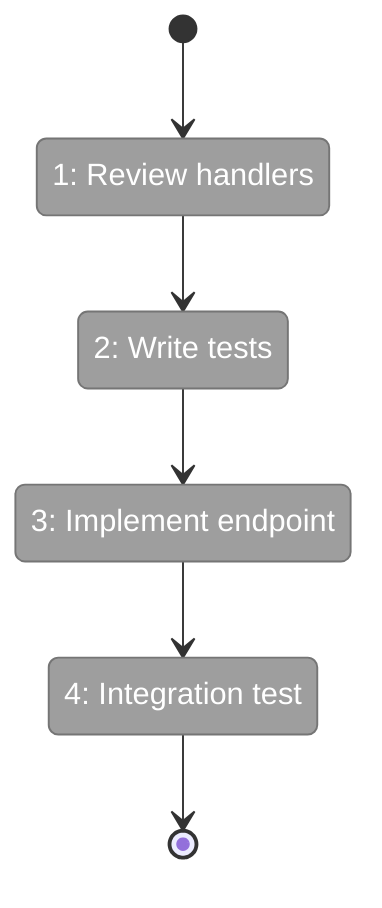
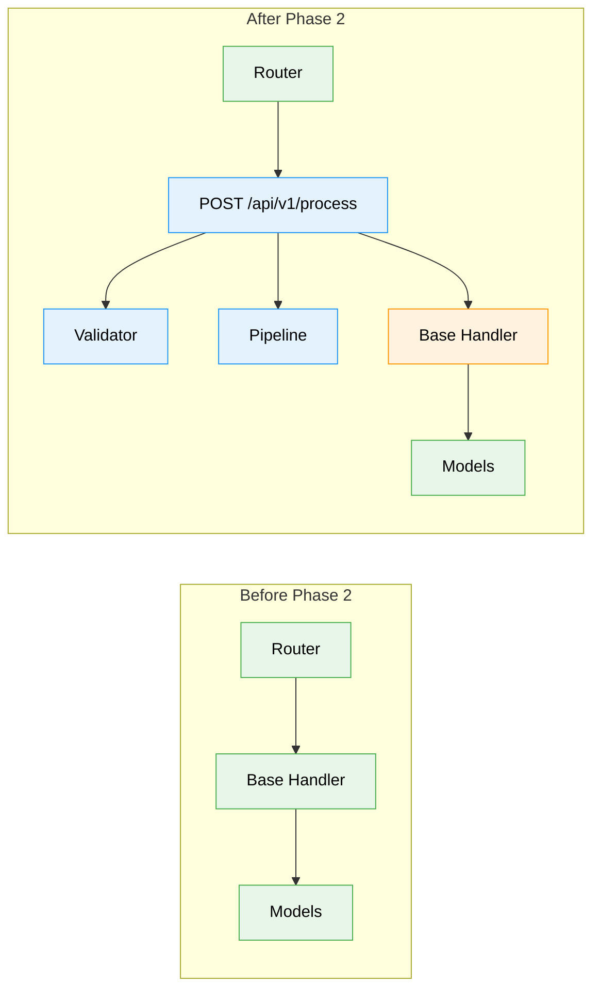

Please deep think / ultrathink as this requires synthesizing multiple sources into a clear, simple output.

# plan-5b-flightplan

## Executive Briefing

**What this command does**: Generates a short, highly readable Flight Plan (`.fltplan.md`) for a single phase — the "boarding pass" that tells you where you are, where you're going, and exactly what will happen along the way.

**When to use**: Automatically called at the end of `/plan-5`. Can also be run standalone to regenerate or update a Flight Plan after changes.

**Why it exists**: Plans and task dossiers are long. The Flight Plan distills everything into a document you can scan in 30 seconds and share with anyone.

### Input → Output

```
INPUT:
  --phase "Phase 2: Core Implementation"
  --plan "/abs/path/docs/plans/3-feature-x/feature-x-plan.md"

OUTPUT:
  docs/plans/3-feature-x/tasks/phase-2-core-implementation/tasks.fltplan.md
```

### Sample Output

```markdown
# Flight Plan: Phase 2 — Core Implementation

**Plan**: [feature-x-plan.md](../../feature-x-plan.md)
**Phase**: Phase 2: Core Implementation
**Generated**: 2024-01-15
**Status**: Ready for takeoff

---

## Departure → Destination

**Where we are**: The project has a basic scaffold with routing and models
from Phase 1, but no API endpoints exist yet.

**Where we're going**: By the end of this phase, the REST API will accept
JSON payloads, validate them, process data through the pipeline, and return
structured results. A developer can `POST /api/v1/process` and get back
processed data.

---

## Flight Status

<!-- Updated by /plan-6: pending → active → done. Use blocked for problems/input needed. -->



**Legend**: grey = pending | yellow = active | red = blocked/needs input | green = done

---

## Stages

<!-- Updated by /plan-6 during implementation: [ ] → [~] → [x] -->

- [ ] **Stage 1: Review existing handler structure** — understand the base
  patterns before extending them (`src/handlers/base.py`)
- [ ] **Stage 2: Write failing tests for the new API** — TDD approach, define
  the contract before implementation (`tests/test_api.py` — new file)
- [ ] **Stage 3: Implement the POST endpoint** — wire up validation, processing,
  and response formatting (`src/api/endpoint.py` — new file)
- [ ] **Stage 4: Integration test** — verify end-to-end flow works with real data

---

## Architecture: Before & After



**Legend**: existing (green, unchanged) | changed (orange, modified) | new (blue, created)

---

## Acceptance Criteria

- [ ] POST /api/v1/process accepts JSON payloads and returns structured results
- [ ] Invalid payloads return 400 with descriptive error messages
- [ ] All endpoints have integration test coverage

## Goals & Non-Goals

**Goals**:
- Create POST /api/v1/process endpoint
- Accept and validate JSON payloads
- Return structured results with status codes

**Non-Goals**:
- Authentication/authorization (Phase 3)
- Rate limiting (Phase 4)
- Batch processing (not in scope)

---

## Checklist

- [ ] T001: Review handler structure (CS-1)
- [ ] T002: Write failing API tests (CS-2)
- [ ] T003: Implement POST endpoint (CS-3)
- [ ] T004: Integration test (CS-2)

```

---

## Writing Guidelines

The Flight Plan must be **simple enough for anyone to read**. Follow these rules:

1. **No jargon** — write for a developer who hasn't read the plan or spec
2. **No task IDs in the Route** — use plain English descriptions with file paths in parentheses
3. **One sentence per route step** — if it takes two sentences, it's two steps
4. **Concrete outcomes** — "A developer can POST to /api/v1/process" not "The API layer will be implemented"
5. **Component-level diagrams** — show modules, services, classes — not individual files
6. **Color means something** — green = untouched, orange = modified, blue = new. No other colors.

---

## 🚫 CRITICAL PROHIBITION: NO TIME ESTIMATES

**NEVER** output time or duration estimates in **ANY FORM**. Use **Complexity Score (CS 1-5)** only in the Checklist section.

---

```md
User input:

$ARGUMENTS
# Expected flags:
# --phase "<Phase N: Title>"
# --plan "<abs path to docs/plans/<ordinal>-<slug>/<slug>-plan.md>"

1) Resolve paths:
   - PLAN      = provided --plan; abort if missing.
   - PLAN_DIR  = dirname(PLAN).
   - PHASE_SLUG from phase heading (same slug as plan-5 uses).
   - PHASE_DIR = PLAN_DIR/tasks/${PHASE_SLUG}; abort if missing.
   - FLTPLAN_FILE = ${PHASE_DIR}/tasks.fltplan.md
   - Locate SPEC file: look for *-spec.md in PLAN_DIR.

2) Read source materials:
   - Read `${PHASE_DIR}/tasks.md` — this is the primary source. Extract:
     * Executive Briefing (Purpose, What We're Building, User Value, Example)
     * Tasks table (all rows with Status, ID, Task, CS, Absolute Path(s))
     * Architecture Map (the existing Mermaid diagram and Task-to-Component Mapping)
     * Objectives & Scope (Goals and Non-Goals)
   - Read PLAN to understand:
     * Overall feature context (what the plan is about)
     * Phase sequence (where this phase sits in the journey)
     * § 8 Progress Tracking (what prior phases accomplished)
   - Read SPEC (if found) to understand:
     * Acceptance criteria (the destination — what "done" looks like)
   - If not Phase 1, scan prior phases' tasks.md Executive Briefings to understand "where we are" (the departure point).

3) Generate the Flight Plan:

   **Title**: `# Flight Plan: Phase N — <Title>`

   **Metadata block**: Plan link (relative), Phase name, today's date as Generated, Status = "Ready for takeoff" (initial).

   **## Departure → Destination**:
   - **Where we are**: Synthesize from prior phases' Executive Briefings and plan progress. For Phase 1, describe the project's current state before any plan work. Be concrete — mention specific components, APIs, or capabilities that exist.
   - **Where we're going**: Synthesize from this phase's Executive Briefing and spec acceptance criteria. State the concrete outcome a user or developer will experience. End with something tangible: "A developer can...", "The system will...", "Users will see...".

   **## Flight Status**:
   - Create a Mermaid `stateDiagram-v2` showing the flight path as a simple linear state diagram.
   - **Four class definitions** (always include all four):
     * `classDef pending fill:#9E9E9E,stroke:#757575,color:#fff` — not yet started (grey)
     * `classDef active fill:#FFC107,stroke:#FFA000,color:#000` — currently being worked on (yellow)
     * `classDef done fill:#4CAF50,stroke:#388E3C,color:#fff` — completed successfully (green)
     * `classDef blocked fill:#F44336,stroke:#D32F2F,color:#fff` — problem or user input required (red)
   - One state per stage, using short labels (3-5 words max). Format: `state "N: Short label" as SN`
   - Linear flow: `[*] --> S1 --> S2 --> ... --> SN --> [*]`
   - Initially all states get `class S1,S2,...,SN pending`
   - Plan-6 updates classes as it works: `pending` → `active` → `done`, or `blocked` if stuck.
   - Include legend line: `**Legend**: grey = pending | yellow = active | red = blocked/needs input | green = done`
   - Keep it **very simple** — this is a glanceable overview, not a detailed flowchart.

   **## Stages**:
   - Create a checkbox list from the tasks table — these are the stages of the flight.
   - Include an HTML comment: `<!-- Updated by /plan-6 during implementation: [ ] → [~] → [x] -->`
   - Each item: `- [ ] **Stage N: Bold action phrase** — one-sentence explanation (`affected file(s)` in parentheses, noting "new file" for Created files)`
   - Order follows task dependencies (not just table order).
   - Do NOT include task IDs (T001, etc.) in this list — keep it readable.
   - Do include file paths but keep them relative and short (strip common prefixes if all files share one).
   - All stages start as `[ ]`. Plan-6 updates them to `[~]` (in-progress) and `[x]` (complete) during implementation.

   **## Acceptance Criteria**:
   - Pull from the spec's acceptance criteria that this phase addresses.
   - Render as a checkbox list: `- [ ] <criterion>`.
   - Keep each criterion to one line — simple, testable statements.

   **## Goals & Non-Goals**:
   - Pull directly from tasks.md `## Objectives & Scope` section.
   - **Goals**: Bullet list of what this phase WILL deliver.
   - **Non-Goals**: Bullet list of what this phase is NOT doing (and why/when if applicable).
   - Keep each item to one line.

   **## Architecture: Before & After**:
   - Create a single Mermaid `flowchart LR` diagram with two subgraphs: "Before" and "After".
   - **Three class definitions** (always include all three):
     * `classDef existing fill:#E8F5E9,stroke:#4CAF50,color:#000` — components that exist and won't change
     * `classDef changed fill:#FFF3E0,stroke:#FF9800,color:#000` — components that will be modified
     * `classDef new fill:#E3F2FD,stroke:#2196F3,color:#000` — components being created
   - **Component level**: Show modules, services, classes, or major abstractions — NOT individual files. Group related files into one node (e.g., "Validation Layer" not "validator.py, schema.py, rules.py").
   - **Before subgraph**: Show the system as it exists now. All nodes use `:::existing`.
   - **After subgraph**: Show the system after this phase. Existing unchanged nodes use `:::existing`, modified nodes use `:::changed`, new nodes use `:::new`.
   - **Edges**: Show key relationships (data flow, dependencies, calls). Keep it clean — max ~10-15 nodes total across both subgraphs.
   - Include a legend line after the diagram: `**Legend**: existing (green, unchanged) | changed (orange, modified) | new (blue, created)`

   **## Checklist**:
   - One checkbox line per task from tasks.md.
   - Format: `- [ ] T<ID>: <Task description> (CS-<N>)`
   - If tasks.md has subtasks column populated, include those indented under the parent.
   - Mirror the status from tasks.md: `[ ]` for pending, `[x]` for complete, `[~]` for in-progress.

4) Write `${FLTPLAN_FILE}`:
   - Overwrite if exists (this is a regeneration-safe document).
   - Use clean markdown with horizontal rules between sections.

5) Report completion:
   - Print the path to the generated file.
   - Print a one-line summary: "Flight Plan ready: <Departure summary> → <Destination summary>"

STOP: The Flight Plan is a read-only summary document. Do not modify tasks.md or any other file.
```

This command produces a document designed to be read in 30 seconds. It answers three questions: Where are we? Where are we going? How do we get there?

---

## How /plan-6 Updates the Flight Plan

During implementation, `/plan-6` should update `tasks.fltplan.md` as it completes each task:

1. **When starting a task**:
   - Find the matching Stage in `## Stages` and change `[ ]` → `[~]`
   - In `## Flight Status` diagram: change that state's class from `pending` → `active`
2. **When completing a task**:
   - Change `[~]` → `[x]` for that Stage
   - In `## Flight Status` diagram: change that state's class from `active` → `done`
3. **When blocked/needs input**:
   - In `## Flight Status` diagram: change that state's class to `blocked`
   - (Change back to `active` when unblocked)
4. **Update the Checklist** similarly: `[ ]` → `[~]` → `[x]` for the matching T### row
5. **When all stages are complete**: Change the metadata `**Status**:` from `Ready for takeoff` → `Landed`

This keeps the Flight Plan as a live progress tracker the human can glance at any time.

---

Next step: The Flight Plan is auto-generated by `/plan-5`. To regenerate after changes, run `/plan-5b-flightplan` directly.
