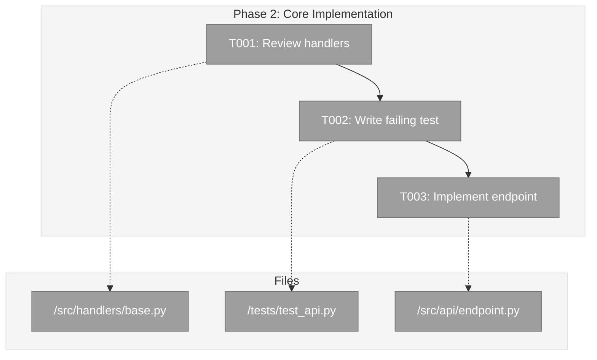

Please deep think / ultrathink as this is a complex task.

# plan-5-phase-tasks-and-brief

## Executive Briefing

**What this command does**: Generates a detailed implementation dossier for a single phase or subtask, transforming high-level plan tasks into executable work items with full context.

**When to use**: After plan-3 has created the architectural plan with phases. Run once per phase, in order. Use `--subtask` mode when mid-phase work needs its own structured planning.

### Phase Mode (default) — Input → Output

```
INPUT:
  --phase "Phase 2: Core Implementation"
  --plan "/abs/path/docs/plans/3-feature-x/feature-x-plan.md"

OUTPUT:
  docs/plans/3-feature-x/tasks/phase-2-core-implementation/tasks.md
```

### Subtask Mode (`--subtask`) — Input → Output

```
INPUT:
  --phase "Phase 2: Core Implementation"
  --plan "/abs/path/docs/plans/3-feature-x/feature-x-plan.md"
  --subtask "Generate integration fixtures for bulk API"
  --parent "T003"

OUTPUT:
  docs/plans/3-feature-x/tasks/phase-2-core-implementation/001-subtask-generate-integration-fixtures.md

  + Updates parent tasks.md (links subtask in Subtasks column)
  + Updates plan.md (adds entry to Subtasks Registry)
```

### When to Use Subtask Mode vs New Phase

| Scenario                                    | Use --subtask    | Use New Phase (plan-3) |
|---------------------------------------------|------------------|------------------------|
| Task blocked, needs focused breakdown       | Yes              | No                     |
| Work stays within current phase scope       | Yes              | No                     |
| Adds new acceptance criteria                | No               | Yes                    |
| Requires architectural changes              | No               | Yes                    |
| Multiple team members need coordination     | No               | Yes                    |

### Sample Output Structure

```markdown
# Phase 2: Core Implementation – Tasks & Alignment Brief

**Spec**: [feature-x-spec.md](../feature-x-spec.md)
**Plan**: [feature-x-plan.md](../feature-x-plan.md)
**Date**: 2024-01-15

## Executive Briefing

### Purpose
This phase implements the core API endpoint that enables clients to submit
and retrieve processed data. It's the foundation for all user-facing operations.

### What We're Building
A REST API endpoint (`POST /api/v1/process`) that:
- Accepts JSON payloads with validation
- Processes data through the transformation pipeline
- Returns structured results with status codes

### User Value
Users can programmatically submit data and receive processed results,
enabling automation and integration with external systems.

### Example
**Request**: `POST /api/v1/process { "input": "raw data" }`
**Response**: `{ "status": "success", "result": "processed data", "id": "abc123" }`

---

## Objectives & Scope

### Objective
Implement the core API endpoint as specified in the plan acceptance criteria.

### Goals

- ✅ Create POST /api/v1/process endpoint
- ✅ Accept and validate JSON payloads
- ✅ Process data through transformation pipeline
- ✅ Return structured results with appropriate status codes

### Non-Goals

- ❌ Authentication/authorization (Phase 3)
- ❌ Rate limiting (Phase 4)
- ❌ Caching layer (not needed for MVP)
- ❌ Batch processing (single requests only)

---

## Pre-Implementation Audit

### Summary
| File | Action | Origin | Modified By | Recommendation |
|------|--------|--------|-------------|----------------|
| /abs/path/src/handlers/base.py | Modify | Pre-plan | — | keep-as-is |
| /abs/path/tests/test_api.py | Create | New | — | keep-as-is |
| /abs/path/src/api/endpoint.py | Create | New | — | keep-as-is |

### Compliance Check
No violations found.

---

## Requirements Traceability

### Coverage Matrix
| AC | Description | Flow Summary | Files in Flow | Tasks | Status |
|----|-------------|-------------|---------------|-------|--------|
| AC1 | Create POST /api/v1/process endpoint | endpoint.py → base.py | 2 | T001,T002 | ✅ Complete |
| AC2 | Accept and validate JSON payloads | endpoint.py → base.py | 2 | T002 | ✅ Complete |
| AC3 | Return structured results | endpoint.py → base.py | 2 | T003 | ✅ Complete |

### Gaps Found
No gaps — all acceptance criteria have complete file coverage.

### Orphan Files
| File | Tasks | Assessment |
|------|-------|------------|
| /abs/path/tests/test_api.py | T004 | Test infrastructure — validates AC1-AC3 |

---

## Architecture Map

### Component Diagram
<!-- Status: grey=pending, orange=in-progress, green=completed, red=blocked -->
<!-- Updated by plan-6 during implementation -->



### Task-to-Component Mapping

<!-- Status: ⬜ Pending | 🟧 In Progress | ✅ Complete | 🔴 Blocked -->

| Task | Component(s) | Files | Status | Comment |
|------|-------------|-------|--------|---------|
| T001 | Handler Review | /src/handlers/ | ⬜ Pending | Understand existing patterns before modifying |
| T002 | Test Suite | /tests/test_api.py | ⬜ Pending | TDD: write failing test first |
| T003 | API Endpoint | /src/api/endpoint.py | ⬜ Pending | Core implementation to make tests pass |

---

## Tasks

| Status | ID   | Task                              | CS  | Type | Dependencies | Absolute Path(s)              | Validation                    | Subtasks | Notes              |
|--------|------|-----------------------------------|-----|------|--------------|-------------------------------|-------------------------------|----------|--------------------|
| [ ]    | T001 | Review existing handler structure | 1   | Setup| –            | /abs/path/src/handlers/       | Documented in brief           | –        | –                  |
| [ ]    | T002 | Write failing test for new API    | 2   | Test | T001         | /abs/path/tests/test_api.py   | Test fails with expected msg  | –        | –                  |
| [ ]    | T003 | Implement API endpoint            | 3   | Core | T002         | /abs/path/src/api/endpoint.py | Test passes, returns 200      | –        | Per Critical Disc 01|

## Alignment Brief
...

## Discoveries & Learnings

_Populated during implementation by plan-6. Log anything of interest to your future self._

| Date | Task | Type | Discovery | Resolution | References |
|------|------|------|-----------|------------|------------|
| | | | | | |

**Types**: `gotcha` | `research-needed` | `unexpected-behavior` | `workaround` | `decision` | `debt` | `insight`
```

---

**One phase at a time.** First use a **subagent to thoroughly review the previous phase** (if not Phase 1) including execution log, main plan, and critical findings. Then generate an actionable **tasks + alignment brief dossier** (`tasks.md`) for the chosen phase, plus the supporting directory structure, and stop before implementation. This merges your previous "tasks" generation with the pre-implementation walkthrough, scoped strictly to **one** phase. Treat the dossier as the shared contract between the human sponsor and the coding agent: lean on visual aids (e.g., Mermaid flow + sequence diagrams) to cement a cohesive understanding before touching code.

---

## 📝 CRITICAL REQUIREMENT: LOG DISCOVERIES & LEARNINGS

**During implementation, you MUST log discoveries to TWO places:**

1. **Execution Log** (`execution.log.md`) — Detailed narrative of what happened
2. **Discoveries Table** (bottom of `tasks.md` or plan file for Simple Mode) — Structured, searchable record

**What to log** (anything of interest to your future self):
- 🔴 Things that **didn't work as expected**
- 🔍 External **research that was required** (and what you learned)
- 🛠️ Implementation **troubles and how they were resolved**
- ⚠️ **Gotchas and edge cases** discovered
- 🎯 **Decisions made** during implementation (and why)
- 💳 **Technical debt introduced** (and justification)
- 💡 **Insights** that future phases should know about

**Why this matters**: Powerful tooling can surface these discoveries later. Your future self (and teammates) will thank you.

---

## 🚫 CRITICAL PROHIBITION: NO TIME ESTIMATES

**NEVER** output time or duration estimates in **ANY FORM**:
- ❌ Hours, minutes, days, weeks, months
- ❌ "Quick", "fast", "soon", "trivial duration"
- ❌ "ETA", "deadline", "timeline"
- ❌ "~4 hours", "2-3 days", "should take X time"
- ❌ "Total Estimated Effort: X hours/days"

**ONLY** use **Complexity Score (CS 1-5)** from constitution rubric:
- ✅ CS-1 (trivial): 0-2 complexity points
- ✅ CS-2 (small): 3-4 complexity points
- ✅ CS-3 (medium): 5-7 complexity points
- ✅ CS-4 (large): 8-9 complexity points
- ✅ CS-5 (epic): 10-12 complexity points

**Rubric factors** (each scored 0-2): Scope, Interconnections, Dependencies, Novelty, Fragility, Testing
Reference: `docs/project-rules/constitution.md` § 9

**Before outputting tasks.md, validate**: No time language present? All task estimates use CS 1-5 only?

---

```md
User input:

$ARGUMENTS
# Expected flags:
# --phase "<Phase N: Title>"
# --plan "<abs path to docs/plans/<ordinal>-<slug>/<slug>-plan.md>"
#
# Subtask mode flags (optional):
# --subtask "<summary>"    # activates subtask mode; value is the subtask description
# --parent "T003"          # required with --subtask: which parent task this subtask supports
# --ordinal "NNN"          # optional: override next subtask ordinal (zero-pad to 3 digits)

## MODE DETECTION

If `--subtask` is provided → **Subtask Mode** (jump to step S1 below).
Otherwise → **Phase Mode** (continue to step 1).

---

## PHASE MODE

1) Verify PLAN exists; set PLAN_DIR = dirname(PLAN); define `PHASE_DIR = PLAN_DIR/tasks/${PHASE_SLUG}` and create it if missing (mkdir -p).

1a) **Subagent Review of All Prior Phases** (skip if Phase 1):
   - **Determine all prior phases**: Extract phase number from $PHASE (e.g., "Phase 4: Data Flows" → review Phases 1, 2, 3)
   - **MANDATORY**: Use the Task tool to launch subagents for comprehensive review
   - **Strategy**: Launch subagents **in parallel** (single message with multiple Task tool calls) to maximize efficiency. One subagent per prior phase.

   **Parallel Subagent Structure** (one subagent per prior phase):

   For each prior phase (Phase 1 through Phase N-1), launch a dedicated subagent with this template:

   **Subagent Template for Phase X Review**:
     "Review Phase X to understand its complete implementation, learnings, and impact on subsequent phases.

     **Read**:
     - `PLAN_DIR/tasks/${PHASE_X_SLUG}/tasks.md` (complete task table)
     - `PLAN_DIR/tasks/${PHASE_X_SLUG}/execution.log.md` (full implementation log)
     - `${PLAN}` § 8 Progress Tracking for Phase X
     - `${PLAN}` § 12 Change Footnotes related to Phase X
     - `${PLAN}` § 3 Critical Findings addressed in Phase X

     **Report** (structured as Phase X Review):
     A. **Deliverables Created**: Files, modules, classes, functions, APIs with absolute paths
     B. **Lessons Learned**: Deviations, complexity discovered, approaches that worked/failed
     C. **Technical Discoveries**: Gotchas, limitations, edge cases, constraints encountered
     D. **Dependencies Exported**: What this phase provides for later phases (signatures, APIs, data structures)
     E. **Critical Findings Applied**: Which discoveries were addressed and how (file:line refs)
     F. **Incomplete/Blocked Items**: Tasks not completed, reasons, implications
     G. **Test Infrastructure**: Tests, fixtures, mocks, helpers created
     H. **Technical Debt**: Shortcuts, TODOs, temporary solutions, refactoring needs
     I. **Architectural Decisions**: Patterns established, rationale, anti-patterns to avoid
     J. **Scope Changes**: Requirements changes, features added/removed
     K. **Key Log References**: Deep links to critical decisions in execution.log.md"

   - **Launch Strategy**:
     * If reviewing Phases 1-3 → Call Task tool 3 times in a single message (parallel)
     * If reviewing Phases 1-2 → Call Task tool 2 times in a single message (parallel)
     * Each subagent uses subagent_type="general-purpose"
     * Each subagent focuses on ONE complete prior phase
   - **Wait for All Subagents**: Block until all prior phase reviews complete
   - **Synthesize Cross-Phase Insights**: Combine all subagent outputs into a comprehensive review with:
     * **Phase-by-Phase Summary**: Sequential narrative showing evolution (Phase 1 → 2 → 3 → ...)
     * **Cumulative Deliverables**: All files, APIs, modules available to current phase (organized by phase of origin)
     * **Cumulative Dependencies**: Complete dependency tree from all prior phases
     * **Pattern Evolution**: How approaches/patterns evolved across phases
     * **Recurring Issues**: Technical debt or challenges that persisted across phases
     * **Cross-Phase Learnings**: Insights from comparing different phase approaches
     * **Foundation for Current Phase**: What the current phase builds upon from each prior phase
     * **Reusable Infrastructure**: All test fixtures, mocks, helpers from any prior phase
     * **Architectural Continuity**: Patterns to maintain vs. anti-patterns to avoid
     * **Critical Findings Timeline**: How discoveries influenced each phase's implementation
   - **Use Synthesized Results**: Let the combined subagent findings inform:
     * Task breakdown (know complete landscape of what exists across all phases)
     * Dependencies column (reference ANY prior phase's deliverables)
     * Validation criteria (avoid ALL discovered gotchas from any phase)
     * Non-goals (don't re-solve problems solved in ANY phase)
     * Test plan (reuse fixtures from ANY phase)
     * Architectural consistency (maintain patterns from ALL phases)

2) **Read Critical Research Findings** from the PLAN document:
   - Locate section "## 3. Critical Research Findings" or similar heading in the plan
   - Study each numbered discovery (🚨 Critical Discovery 01, 02, 03...)
   - Note the structure: Problem, Root Cause, Solution, Impact on architecture/design
   - Identify which findings affect the current phase's implementation
   - These findings MUST inform task design, implementation approach, and validation strategies
   - Critical findings often reveal API limitations, framework requirements, or implementation constraints that change how tasks should be structured
   - Reference discoveries by number when applicable (e.g., "per Critical Discovery 02")

2a) **Read ADRs (if any)** from `docs/adr/` that reference this spec/plan:
   - Scan docs/adr/ for ADRs containing references to the current feature (by slug or spec path)
   - For each relevant ADR, extract:
     * ADR ID (NNNN) and title
     * Status (Proposed/Accepted/Rejected/Superseded)
     * The Decision (one-line summary)
     * Specific constraints that affect this phase
   - These ADR constraints MUST be incorporated into task design
   - Tag affected tasks in the Notes column with ADR IDs (e.g., "Per ADR-0007")

3) Locate the exact phase heading = $PHASE in PLAN. Abort if not found.
4) **Read plan-3's task table format** from the PLAN document:
   - plan-3 outputs tasks with columns: `#`, `Status`, `Task`, `Success Criteria`, `Log`, `Notes`
   - Example: `| 1.1 | [ ] | Add Copilot directory variables | Variables defined in agents.sh | - | |`
   - These are high-level tasks that need to be expanded into detailed implementation tasks.

5) **Transform and expand** plan-3 tasks into the canonical tasks format:
   - **Expansion**: Each high-level plan-3 task (e.g., "1.1") may become multiple detailed tasks (T001, T002, T003...)
   - **Apply Critical Findings**: Ensure tasks account for all relevant discoveries from step 2. Reference specific findings in task descriptions or Notes when applicable. Critical findings may require additional tasks (e.g., workarounds, validation tests, constraint handling).
   - **Mapping**:
     * `#` (e.g., "1.1") → `ID` (e.g., "T001") - Use T001… sequence; note plan task reference in comments
     * `Task` → `Task` (expand with specifics, add absolute paths inline or reference in Absolute Path(s) column)
     * `Success Criteria` → `Validation` (make more specific and measurable)
     * Add new `Type` column (Setup/Test/Core/Integration/Doc/etc.)
     * Add new `Dependencies` column (use T-IDs or "–" for none)
     * Add new `Absolute Path(s)` column (REQUIRED: list every impacted file/directory)
   - **Scope to this phase only**:
     * Setup (only what this phase needs)
     * Tests-first (contract/integration/unit) -> MUST FAIL initially
     * Core changes for this phase only
     * Integration & Polish limited to this phase
     * Every task includes **absolute paths**.

   **Example transformation (showing how Critical Findings affect task breakdown):**
   ```
   Critical Finding from plan.md § 3:
   🚨 Critical Discovery 01: Copilot File Extension Requirement
   Problem: GitHub Copilot ignores plain `.md` files in prompt directories
   Root Cause: Discovery logic explicitly filters on `*.prompt.md` pattern
   Solution: Always rename output files to include `.prompt.md` extension
   Impact: This enforces the file renaming requirement (FR3 in spec)

   Plan-3 input (from plan.md):
   | 2.1 | [ ] | Implement file copy loop | All .md files copied to global | - | |
   | 2.2 | [ ] | Add rename logic during copy | Files saved as `.prompt.md` | - | |

   Plan-5 output (for tasks.md) - EXPANDED with Critical Finding applied:
   | [ ] | T001 | Review existing copy loop in agents.sh | Setup | – | /abs/path/to/install/agents.sh | Understand extension handling | – |
   | [ ] | T002 | Implement copy loop for command files to Copilot global dir | Core | T001 | /abs/path/to/install/agents.sh | All .md files copied | – |
   | [ ] | T003 | Add .prompt.md extension during copy (per Critical Discovery 01) | Core | T002 | /abs/path/to/install/agents.sh | Files end with .prompt.md | Per Critical Discovery 01 |
   | [ ] | T004 | Write test verifying .prompt.md extension requirement | Test | T003 | /abs/path/to/tests/test_copilot_extensions.sh | Test confirms all files have .prompt.md | – |
   | [ ] | T005 | Add validation that source .md files exist before copy | Core | T002 | /abs/path/to/install/agents.sh | Error handling for missing sources | – |
   ```

   Notice how the Critical Finding:
   - Changed task T003 to explicitly reference the finding
   - Added task T004 to validate the finding's requirement
   - Informed the validation criteria (must end with .prompt.md)
   ```

   **Canonical tasks table layout** (all dossiers MUST follow this column order):
   | Status | ID | Task | CS | Type | Dependencies | Absolute Path(s) | Validation | Subtasks | Notes |
   - `Status` is a literal checkbox column; start each row with `[ ]` so later phases can update to `[~]` (in progress) or `[x]` (complete).
   - `ID` uses the T001… dossier sequence and should link back to the matching plan task when applicable (e.g., in notes or alignment brief).
   - `Task` summarizes the work item with sufficient detail for implementation.
   - `CS` is the Complexity Score (1-5) computed from constitution rubric: CS-1 (trivial), CS-2 (small), CS-3 (medium), CS-4 (large), CS-5 (epic). Score each task using S,I,D,N,F,T factors (0-2 each).
   - `Type` classifies it (Setup/Test/Core/Integration/Doc/etc.).
   - `Dependencies` lists prerequisite task IDs (e.g., "T001, T002") or "–" for none.
   - `Absolute Path(s)` must list every impacted file or directory using absolute paths (REQUIRED - no relative paths).
   - `Validation` captures how acceptance or readiness will be confirmed.
   - `Subtasks` lists spawned subtask dossiers (e.g., "001-subtask-fixtures, 003-subtask-bulk") or "–" for none. Updated by subtask mode (step S7) when subtask is created.
   - `Notes` include contextual references (e.g., ADR IDs, Critical Finding refs), but defer `[^N]` footnote tags until plan-6 updates the ledger.

   **PlanPak Path Rules** (if `File Management: PlanPak` active in spec or T000 exists in plan):
   - Plan-scoped files: `Absolute Path(s)` must point to `features/<ordinal>-<slug>/` folder
   - Cross-cutting files: `Absolute Path(s)` points to traditional shared location
   - Cross-plan edits: `Absolute Path(s)` points to the original plan's feature folder
   - `Notes` column must include classification tag: `plan-scoped`, `cross-cutting`, `cross-plan-edit`, or `shared-new`
   - If PlanPak NOT active: no classification tags, paths follow project conventions

5a) **Launch Pre-Implementation Audit subagent** to audit all files from the expanded task table:

   After step 5 completes, the full file list is known from the `Absolute Path(s)` column. Launch a single subagent to build the Pre-Implementation Audit — verifying provenance, checking for duplication, and validating compliance before any code is written.

   **FlowSpace Detection**: Try `flowspace.tree(pattern=".", max_depth=1)`.
   - If available: use `subagent_type="general-purpose"` with FlowSpace tool instructions
   - If unavailable: use `subagent_type="Explore"` (has Glob/Grep/Read access)

   **Subagent Prompt**:
   "Build a Pre-Implementation Audit for [PHASE_TITLE] of plan [PLAN_PATH].

   Files to investigate (from task table Absolute Path(s) column):
   [LIST EVERY UNIQUE FILE FROM THE EXPANDED TASK TABLE]

   For EACH file, determine:

   1. **ACTION**: Created (new) or Modified (exists)? Check if file exists on disk.

   2. **PROVENANCE** (Modified files):
      - Which plan created this file? Search:
        * `docs/plans/*/execution.log.md` for the file path (grep both absolute and relative forms; paths may be wrapped in backticks)
        * `docs/plans/*-plan.md` task tables for the path in Absolute Path(s) columns
        * If PlanPak active: check if file lives in `features/<ordinal>-<slug>/` — the ordinal IS the origin plan
        * `git log --follow --diff-filter=A -- <filepath>` for creation commit
      - Which OTHER plans modified it? Same sources, collect all plan references.

   3. **DUPLICATION CHECK** (Created files only):
      - Use `/code-concept-search "<concept>" --no-provenance` for each major concept
        the new file will introduce (class names, key functions, patterns).
        code-concept-search walks the codebase like a human engineer — it finds
        concepts even when named differently (e.g., finds "elementConnector" from
        a query of "connectNode"). It uses FlowSpace semantic search when available,
        falls back to codebase walk-through with Glob/Grep/Read when not.
      - If code-concept-search finds matches, include the match quality, file path,
        what it does, and its original intent paragraph — this lets the implementer
        judge whether to reuse, extend, or create new.
      - Report matches with file paths and one-line descriptions, or 'None found'

   4. **COMPLIANCE CHECK** (all files):
      - If `docs/adr/` exists: scan ADRs for constraints affecting this file's location, naming, or patterns
      - If `docs/project-rules/rules.md` exists: check planned changes against project rules
      - If `docs/project-rules/idioms.md` exists: check naming, patterns, conventions
      - If `docs/project-rules/architecture.md` exists: check layer boundaries, dependency direction
      - If PlanPak active: verify classification tag is correct per decision tree
      - Report violations as: SEVERITY (HIGH/MEDIUM/LOW) | Rule/ADR | What's wrong | Suggested fix
      - If none of these files exist, report 'No compliance sources found — skipped'

   5. **RECOMMENDATION** (one per file):
      - keep-as-is | reuse-existing | extract-to-shared | consider-moving | cross-plan-edit | compliance-warning

   **Output format** — return these sections:

   SUMMARY TABLE (one row per file):
   | File | Action | Origin | Modified By | Recommendation |
   |------|--------|--------|-------------|----------------|

   PER-FILE DETAIL (only for files with findings):
   ### <filepath>
   - **Duplication check**: [findings or 'None']
   - **Provenance**: [origin plan and modification history]
   - **Compliance**: [violations or 'No violations']

   COMPLIANCE SUMMARY (only if violations found):
   | Severity | File | Rule/ADR | Violation | Suggested Fix |
   |----------|------|----------|-----------|---------------|
   "

   - **Include subagent output** verbatim in the `## Pre-Implementation Audit` section of tasks.md
   - If `reuse-existing` recommendations found: flag prominently — task table may need revision
   - If HIGH compliance violations found: note that implementation should address these first

5b) **Launch Requirements Flow subagent** to verify every acceptance criterion has complete file coverage:

   After the Pre-Implementation Audit checks existing files (step 5a), verify that the task table doesn't have gaps — files that an AC needs but no task covers. This catches the common failure mode where the agent implements a backend handler but forgets the frontend event wiring, or adds a service method but doesn't update the route that calls it.

   **FlowSpace Detection**: Try `flowspace.tree(pattern=".", max_depth=1)`.
   - If available: use `subagent_type="general-purpose"` with FlowSpace tool instructions
   - If unavailable: use `subagent_type="Explore"` (has Glob/Grep/Read access)

   **Subagent Prompt**:
   "Run requirements flow tracing for [PHASE_TITLE] of plan [PLAN_PATH].

   Acceptance Criteria (from spec [SPEC_PATH]):
   [LIST ALL ACs FROM SPEC — numbered, full text]

   Task table files (from step 5 Absolute Path(s) column):
   [LIST ALL UNIQUE FILES FROM THE EXPANDED TASK TABLE]

   Full task table (for cross-referencing):
   [PASTE THE TASK TABLE WITH ID, Task, Absolute Path(s) COLUMNS]

   For each acceptance criterion:
   1. Identify the trigger — what user action or system event kicks this off?
   2. Trace the full execution flow through the codebase — follow imports, call chains, event wiring, data flow, error paths, and return paths layer by layer
   3. List every file in the flow that would need to change for this AC to work end-to-end
   4. Cross-reference against the task table — does every file appear in some task's Absolute Path(s)?
   5. Flag gaps: files in the flow but missing from the task table
   6. Flag orphan files: files in tasks that don't map to any AC (may be valid utilities or scope creep)

   Walk the codebase like a human engineer — read files, follow imports, trace call chains.
   Don't just grep for keywords. The goal is to find EVERY file that must change, not just the obvious ones.

   Common gaps to watch for:
   - Event/message wiring (backend exists, no frontend trigger)
   - Error paths (happy path covered, error display missing)
   - Configuration (new feature needs config entries)
   - UI state updates (API returns data, UI doesn't refresh)
   - Middleware/interceptor registration
   - Index/barrel file exports
   - Migration/schema changes

   Output format:
   COVERAGE MATRIX:
   | AC | Description | Flow Summary | Files in Flow | Tasks | Status |
   (Status: ✅ Complete | ⚠️ Gap: [files] | ❌ No tasks | ⏭️ Deferred)

   GAPS FOUND (for each gap):
   - AC, missing file, role in flow, why needed, suggested action

   ORPHAN FILES (if any):
   - File, tasks, assessment (utility | config | scope-creep | test-infrastructure)

   FLOW DETAILS (only for ACs with gaps or complex paths):
   - Numbered file chain with task coverage markers
   "

   - **Review subagent output for gaps**. If gaps are found:
     * Review each gap — is it a genuine missing file or a false positive?
     * For genuine gaps: **add new tasks** to the task table (step 5) to cover the missing files
     * For false positives: note why the file isn't needed in the Requirements Traceability section
     * **Do NOT proceed to step 6** until all gaps are resolved (either by adding tasks or documenting why they're not needed)
   - If no gaps found: proceed to step 6 with the Requirements Traceability section showing full coverage
   - Include subagent output in the `## Requirements Traceability` section of tasks.md

6) Write a single combined artifact `PHASE_DIR/tasks.md` containing:
   - Phase metadata (title, slug, links to SPEC and PLAN, today {{TODAY}}).
   - `## Executive Briefing` section at the TOP that explains **what this phase will accomplish and why** in human-readable form. This is NOT about how the dossier was generated—it's about the actual work to be done. Include:
     * **Purpose**: 2-3 sentence summary of what this phase delivers and why it matters
     * **What We're Building**: Concrete description of the feature/component/capability being added
     * **User Value**: How this benefits the end user or system
     * **Example** (when applicable): A before/after or input/output example showing the change in behavior

     Example Executive Briefing:
     ```markdown
     ## Executive Briefing

     ### Purpose
     This phase implements the rate-time-quantity converter that transforms user input
     into normalized calculation units. Without this, the calculator cannot process
     mixed-unit inputs like "5 hours at $120/day".

     ### What We're Building
     A `RateTimeQuantityConverter` class that:
     - Parses rate expressions (e.g., "$50/hour", "100/day")
     - Normalizes time units to a common base (minutes)
     - Handles quantity multipliers and validates input ranges

     ### User Value
     Users can enter rates in any time unit and the calculator automatically converts
     them for accurate billing calculations.

     ### Example
     **Input**: "Work 3.5 hours at $480/day rate"
     **Normalized**: { rate_per_minute: 1.0, duration_minutes: 210, total: 210.00 }
     ```
   - `## Objectives & Scope` section (BEFORE Tasks) that sets clear boundaries:
     * **Objective**: Recap the phase objective tied to PLAN acceptance criteria. Include behavior checklist items that must be satisfied.
     * **Goals**: Bullet list of what this phase WILL deliver (derived from plan)
     * **Non-Goals (Scope Boundaries)**: Explicitly call out what this phase is **NOT** doing to prevent scope creep and keep implementation focused. Include:
       - Features/functionality deliberately excluded from this phase (but might be in future phases)
       - Edge cases or scenarios being deferred
       - Optimizations or polish that can wait
       - Refactoring or cleanup not required for acceptance
       - Alternative approaches explicitly rejected and why
       Example format:
       ```markdown
       ## Objectives & Scope

       ### Objective
       Implement the rate-time-quantity converter as specified in the plan.

       ### Goals

       - ✅ Parse rate expressions in multiple formats
       - ✅ Normalize all time units to minutes
       - ✅ Validate input ranges and handle edge cases
       - ✅ Return structured result with rate_per_minute, duration, total

       ### Non-Goals

       - ❌ Performance optimization (defer to Phase 5)
       - ❌ User-facing error messages (using generic messages for now)
       - ❌ Support for currency conversion (out of scope)
       - ❌ Caching of parsed results (not needed yet)
       ```
   - `## Pre-Implementation Audit` section (generated by step 5a) containing the pre-implementation file audit:
     * **Summary Table**: One row per file with columns: File, Action, Origin, Modified By, Recommendation
     * **Per-File Detail**: Subsections only for files with findings (duplication matches, provenance chain, compliance issues)
     * **Compliance Check**: Table of any ADR/rules/idioms/architecture violations with severity (HIGH/MEDIUM/LOW)
     * If step 5a subagent returned no findings: include section with note "No findings — all files are new or have clean provenance"
     * If `reuse-existing` recommendations found: add prominent callout that task table may need revision before implementation
     * If HIGH compliance violations found: add note that these must be addressed before implementation proceeds
   - `## Requirements Traceability` section (generated by step 5b) verifying every acceptance criterion has complete file coverage:
     * **Coverage Matrix**: One row per AC with columns: AC, Description, Flow Summary, Files in Flow, Tasks, Status
     * **Gaps Found**: Per-gap detail with missing file, role in flow, why needed, suggested action — only if gaps exist
     * **Orphan Files**: Files in tasks that don't map to any AC, with assessment (utility, config, scope-creep) — only if orphans exist
     * **Flow Details**: Numbered file chains for ACs with gaps or complex paths — only for those ACs
     * If step 5b subagent returned no gaps: include section with note "All acceptance criteria have complete file coverage"
     * If gaps were found and resolved (tasks added): note what was added and which gaps they close
   - `## Architecture Map` section that provides a **visual component diagram** showing all system elements being modified. This diagram uses color-coded status tracking that updates as implementation progresses:

     **Status Colors**:
     - Grey (`:::pending`) = Not started
     - Orange (`:::inprogress`) = Actively working
     - Green (`:::completed`) = Done
     - Red (`:::blocked`) = Issues/blocked

     **Generation Rules**:
     1. Create a node for each task (T001, T002, T003...)
     2. Create a node for each file/directory from the Absolute Path(s) column
     3. Draw solid edges based on Dependencies column (task → task)
     4. Draw dotted edges from tasks to files they touch (task -.-> file)
     5. Use subgraphs to group related components (e.g., "Core", "Tests", "Config")
     6. ALL nodes start as `:::pending` (grey) — plan-6 updates colors during execution

     **Required structure**:
     ```markdown
     ## Architecture Map

     ### Component Diagram
     <!-- Status: grey=pending, orange=in-progress, green=completed, red=blocked -->
     <!-- Updated by plan-6 during implementation -->

     ```mermaid
     flowchart TD
         classDef pending fill:#9E9E9E,stroke:#757575,color:#fff
         classDef inprogress fill:#FF9800,stroke:#F57C00,color:#fff
         classDef completed fill:#4CAF50,stroke:#388E3C,color:#fff
         classDef blocked fill:#F44336,stroke:#D32F2F,color:#fff

         style Phase fill:#F5F5F5,stroke:#E0E0E0
         style Files fill:#F5F5F5,stroke:#E0E0E0

         subgraph Phase["Phase N: [Title]"]
             T001["T001: [Task description]"]:::pending
             T002["T002: [Task description]"]:::pending
             T003["T003: [Task description]"]:::pending

             T001 --> T002
             T002 --> T003
         end

         subgraph Files["Files"]
             F1["/path/to/file1.py"]:::pending
             F2["/path/to/file2.py"]:::pending
             F3["/path/to/test_file.py"]:::pending
         end

         T001 -.-> F1
         T002 -.-> F2
         T003 -.-> F3
     ```

     ### Task-to-Component Mapping

     <!-- Status: ⬜ Pending | 🟧 In Progress | ✅ Complete | 🔴 Blocked -->

     | Task | Component(s) | Files | Status | Comment |
     |------|-------------|-------|--------|---------|
     | T001 | [Component] | [paths] | ⬜ Pending | [one-liner about what this task does] |
     | T002 | [Component] | [paths] | ⬜ Pending | [one-liner about what this task does] |
     | T003 | [Component] | [paths] | ⬜ Pending | [one-liner about what this task does] |
     ```

     **Key principles**:
     - Diagram should show the **complete system architecture** for this phase
     - Every file/component touched must have a node
     - Individual test files get their own nodes (not grouped)
     - When a task completes, ALL file nodes it touches update together
     - Task-centric layout: tasks are primary, files are secondary

   - `## Tasks` section that renders the table exactly as defined above (Status checkbox first, then ID, Task, CS, Type, Dependencies, Absolute Path(s), Validation, Subtasks, Notes) with numbered items (T001...), complexity scores, dependencies, and validation checklist coverage.
   - `## Alignment Brief` section with:
     * **Prior Phases Review** (if not Phase 1):
       - Include the complete cross-phase synthesis from step 1a here
       - Ensure it covers:
         • Phase-by-phase summary showing evolution of the implementation
         • Cumulative deliverables from all prior phases (organized by phase of origin)
         • Complete dependency tree across all phases
         • Pattern evolution and architectural continuity
         • Recurring issues and cross-phase learnings
         • All reusable test infrastructure from any prior phase
         • Critical findings timeline showing how discoveries influenced each phase
       - For each prior phase, cover sections A-K: deliverables created, lessons learned, technical discoveries, dependencies exported, critical findings applied, incomplete items, test infrastructure, technical debt, architectural decisions, scope changes, and key log references
       - Include deep links to all prior phase execution logs for critical decisions
       - Reference specific footnotes from plan § 12 that affected architecture or design across phases
       - This section provides essential context for understanding the complete landscape of what exists and what the current phase builds upon
     * **Critical Findings Affecting This Phase**: List relevant discoveries from plan § 3 that impact this phase's implementation. For each, briefly note: the finding title, what it constrains/requires, and which tasks address it.
     * **ADR Decision Constraints** (if ADRs exist):
       - List each relevant ADR: `ADR-NNNN: [Title] – [Decision one-liner]`
       - Note specific constraints from the ADR that affect this phase
       - Map constraints to specific tasks: "Constrains: [items]; Addressed by: [T00X, T00Y]"
       - Tag affected task rows in the Notes column with "Per ADR-NNNN"
     * **PlanPak Placement Rules** (if PlanPak active):
       - Plan-scoped files → `features/<ordinal>-<slug>/` (flat, descriptive names)
       - Cross-cutting files → traditional shared location
       - Cross-plan edits → stay in original plan's folder
       - Dependency direction: plans → shared (allowed), shared → plans (never)
       - Test location: per project conventions (PlanPak doesn't prescribe)
     * Invariants & guardrails (perf/memory/security budgets if relevant)
     * Inputs to read (exact file paths)
     * Visual alignment aids: capture both a Mermaid flow diagram (system states) and a Mermaid sequence diagram (actor/interaction order). Treat these as shared-understanding checkpoints so the human sponsor and coding agent agree on the flow before implementation begins.
     * **Test Plan (TDD vs lightweight per spec, honor mock usage preference)**: enumerate named tests with rationale, fixtures, expected outputs
     * Step-by-step implementation outline mapped 1:1 to the tasks/tests
     * Commands to run (copy/paste): env setup, test runner, linters, type checks
     * Risks/unknowns (flag severity, mitigation steps)
     * **Ready Check** (checkboxes) -> await explicit GO/NO-GO
       - [ ] ADR constraints mapped to tasks (IDs noted in Notes column) - N/A if no ADRs exist
   - `## Phase Footnote Stubs` section: include the heading and an empty table shell (or explicit note) so plan-6 can add entries post-implementation; do **not** create footnote tags or stubs during planning.
   - `## Evidence Artifacts` describing where implementation will write the execution log (`PHASE_DIR/execution.log.md`) and any supporting files.
   - `## Discoveries & Learnings` section with empty table shell for plan-6 to populate during implementation. This captures gotchas, research, unexpected behaviors, decisions, and insights for future reference. Include the following structure:

     ```markdown
     ## Discoveries & Learnings

     _Populated during implementation by plan-6. Log anything of interest to your future self._

     | Date | Task | Type | Discovery | Resolution | References |
     |------|------|------|-----------|------------|------------|
     | | | | | | |

     **Types**: `gotcha` | `research-needed` | `unexpected-behavior` | `workaround` | `decision` | `debt` | `insight`

     **What to log**:
     - Things that didn't work as expected
     - External research that was required
     - Implementation troubles and how they were resolved
     - Gotchas and edge cases discovered
     - Decisions made during implementation
     - Technical debt introduced (and why)
     - Insights that future phases should know about

     _See also: `execution.log.md` for detailed narrative._
     ```

7) **Generate Flight Plan**: After writing tasks.md, run:
   `/plan-5b-flightplan --phase "${PHASE}" --plan "${PLAN}"`
   This produces `PHASE_DIR/tasks.fltplan.md` — a short, human-readable summary with checkable stages that plan-6 updates during implementation.

8) Capture a short directory layout at the end of `PHASE_DIR/tasks.md` so future phases know where to place logs and ancillary evidence inside `PHASE_DIR`.
   - Note that Plan 6 writes `execution.log.md` and any other evidence directly into `PHASE_DIR`.
   - **Simple Mode Note**: For Simple Mode plans (inline tasks in plan file), the `## Discoveries & Learnings` section goes at the bottom of the plan file itself, and `execution.log.md` is created as a sibling to the plan file in `PLAN_DIR`.
   - Example (adjust as files accumulate):
     ```
     docs/plans/2-feature-x/
       ├── feature-x-plan.md
       └── tasks/phase-2/
           ├── tasks.md
           ├── tasks.fltplan.md   # generated by /plan-5b (Flight Plan summary)
           └── execution.log.md   # created by /plan-6
     ```

Rules & Stack Patterns:
- Follow `docs/project-rules/{rules.md, idioms.md}` (TDD, tests-as-docs; apply the mock usage preference captured in the spec; use real data when required). :contentReference[oaicite:13]{index=13}
- Apply BridgeContext patterns when relevant: bounded `vscode.RelativePattern`, remote-safe `vscode.Uri`, Python debugging via `module: 'pytest'` with `--no-cov`. :contentReference[oaicite:14]{index=14}

STOP: Do **not** edit code. Output the combined `PHASE_DIR/tasks.md` and wait for human **GO**.

---

## SUBTASK MODE

Activated when `--subtask` is provided. Generates a focused subtask dossier alongside the parent phase's `tasks.md`. Use when a task needs deeper breakdown or a blocker requires separate tracked work that feeds back into the parent phase.

S1) Resolve paths & derive identifiers:
   - PLAN      = provided --plan; abort if missing.
   - PLAN_DIR  = dirname(PLAN).
   - If --phase supplied, match exact heading within PLAN; else infer:
     * scan PLAN_DIR/tasks/* for `tasks.md`; if exactly one `phase-*` contains the most recent GO, adopt it.
     * if multiple phases are eligible, stop and request explicit `--phase`.
   - PHASE_SLUG from phase heading (same slug as Phase Mode uses).
   - PHASE_DIR = PLAN_DIR/tasks/${PHASE_SLUG}; ensure exists (mkdir -p).
   - SUBTASK_SUMMARY = --subtask value trimmed; abort if empty.
   - PARENT_TASK = --parent value (e.g., "T003"); abort if missing.
   - SUBTASK_SLUG = kebab-case summary (`[^a-z0-9-]` → '-', collapse dups, trim dash).
   - Determine ordinal:
     * Existing files matching `${PHASE_DIR}/[0-9][0-9][0-9]-subtask-*.md` → take highest NNN.
     * ORD = --ordinal if provided else highest+1 (zero-pad to 3 digits; start at `001`).
   - SUBTASK_FILE = `${PHASE_DIR}/${ORD}-subtask-${SUBTASK_SLUG}.md`.
   - SUBTASK_KEY  = `${ORD}-subtask-${SUBTASK_SLUG}`.

S2) Parse parent context:
   - Load PLAN to review:
     * `## 3. Critical Research Findings` (same as Phase Mode step 2).
     * The chosen phase heading and its task table (plan-3 output).
   - Load `PHASE_DIR/tasks.md` (abort if missing; subtask requires existing phase dossier).
   - Locate PARENT_TASK row in the phase tasks table. Capture its Task description, Dependencies, Absolute Path(s), and current Status.
   - Read relevant ADRs from `docs/adr/` if any (same as Phase Mode step 2a).

S3) Define subtask tasks:
   - Break down the subtask summary into executable work items using `ST001`, `ST002`, … IDs.
   - Apply the same canonical tasks table layout as Phase Mode:
     | Status | ID | Task | CS | Type | Dependencies | Absolute Path(s) | Validation | Subtasks | Notes |
   - `Subtasks` column is always "–" (no recursive sub-subtasking).
   - Notes capture parent T-ID reference (e.g., "Supports T003").
   - Apply Critical Findings from step S2 — reference specific findings in task descriptions or Notes when applicable.

S4) Launch Pre-Implementation Audit and Requirements Flow subagents:
   - **Pre-Implementation Audit**: Same as Phase Mode step 5a, but scoped to the subtask's ST### file list.
   - **Requirements Flow**: Same as Phase Mode step 5b, but scoped narrower:
     * Only trace ACs that this subtask addresses (from parent task context and spec).
     * Parent task files count as "already covered" — only flag files missing from BOTH subtask and parent task tables.
   - If gaps are found in Requirements Flow: add new ST### tasks before proceeding.

S5) Write subtask dossier `${SUBTASK_FILE}` containing:
   - Front matter: title = `Subtask <ORD>: <Summary>`; include parent phase + plan links; record today as {{TODAY}}.
   - `## Parent Context` section:
     ```markdown
     ## Parent Context

     **Parent Plan:** [View Plan](../../<plan-filename>)
     **Parent Phase:** <Phase N: Title>
     **Parent Task(s):** [T<XXX>: <task summary>](../tasks.md#task-t<xxx>)

     **Why This Subtask:**
     <Reason captured from --subtask argument>

     ---
     ```
   - `## Executive Briefing` (same structure as Phase Mode but scoped to subtask; include **Unblocks** instead of **User Value**).
   - `## Objectives & Scope` (same structure: Objective, Goals, Non-Goals).
   - `## Pre-Implementation Audit` (from step S4).
   - `## Requirements Traceability` (from step S4, narrower scope).
   - `## Architecture Map` with:
     * Parent task node(s) in "Parent Context" subgraph (shown as `:::blocked`)
     * ST### nodes in "Subtask" subgraph
     * "unblocks" edge from final subtask to parent task
     * Same color classes as Phase Mode (pending/inprogress/completed/blocked)
   - `## Tasks` table (ST### rows from step S3).
   - `## Alignment Brief` tailored to subtask:
     * Objective recap referencing parent phase goal + targeted parent tasks
     * Critical Findings Affecting This Subtask
     * ADR Decision Constraints (if applicable)
     * Invariants/guardrails inherited from parent
     * Visual aids (Mermaid flow + sequence diagram for subtask slice)
     * Test Plan specific to this subtask
     * Implementation outline mapped 1:1 to ST tasks
     * Commands to run
     * Risks & unknowns
     * Ready Check gating `/plan-6-implement-phase --subtask ${SUBTASK_KEY}`
   - `## Phase Footnote Stubs` (empty shell for plan-6).
   - `## Evidence Artifacts` (execution log path = `${SUBTASK_KEY}.execution.log.md`).
   - `## Discoveries & Learnings` (same empty table shell as Phase Mode).
   - `## After Subtask Completion` section providing resumption guidance:
     ```markdown
     ## After Subtask Completion

     **This subtask resolves a blocker for:**
     - Parent Task: [T<XXX>: <summary>](../tasks.md#task-t<xxx>)

     **When all ST### tasks complete:**

     1. **Record completion** in parent execution log:
        ```
        ### Subtask <SUBTASK_KEY> Complete
        Resolved: <brief summary>
        See detailed log: [subtask execution log](./<SUBTASK_KEY>.execution.log.md)
        ```

     2. **Update parent task** (if it was blocked):
        - Open: [`tasks.md`](../tasks.md)
        - Find: T<XXX>
        - Update Status: `[!]` → `[ ]` (unblock)
        - Update Notes: Add "Subtask <SUBTASK_KEY> complete"

     3. **Resume parent phase work:**
        ```bash
        /plan-6-implement-phase --phase "<PHASE_HEADING>" \
          --plan "<PLAN_ABSOLUTE_PATH>"
        ```

     **Quick Links:**
     - Parent Dossier: [tasks.md](../tasks.md)
     - Parent Plan: [plan](../../<plan-filename>)
     - Parent Execution Log: [execution.log.md](../execution.log.md)
     ```

S6) **Generate Flight Plan** for the subtask: run `/plan-5b-flightplan --phase "${PHASE}" --plan "${PLAN}"`
   This regenerates `PHASE_DIR/tasks.fltplan.md` incorporating the subtask context.

S7) Register subtask in plan's Subtasks Registry:
   - Read PLAN and check for section `## Subtasks Registry`.
   - If section doesn't exist, append to bottom of PLAN:
     ```markdown
     ## Subtasks Registry

     Mid-implementation detours requiring structured tracking.

     | ID | Created | Phase | Parent Task | Reason | Status | Dossier |
     |----|---------|-------|-------------|--------|--------|---------|
     ```
   - Append new row with subtask details. Status starts as `[ ] Pending`.

S8) Update parent task's Subtasks column (bidirectional link):
   - Open `${PHASE_DIR}/tasks.md`
   - Locate PARENT_TASK row in the tasks table
   - Update the `Subtasks` column:
     * If currently "–", replace with: `${SUBTASK_KEY}`
     * If already has subtasks, append: `, ${SUBTASK_KEY}`

STOP: Do **not** edit code. Output the subtask dossier and wait for human **GO**.

Next step (when happy): Run **/plan-6-implement-phase --phase "<Phase N: Title>" --plan "<PLAN_PATH>" --subtask "${SUBTASK_KEY}"**.
```

Why this shape: it leverages your existing **tasks** template mechanics but restricts scope firmly to **one phase** (or one subtask within a phase), and carries forward the alignment without a separate heavy analysis pass.

Next step (when happy): Run **/plan-6-implement-phase --phase "<Phase N: Title>" --plan "<PLAN_PATH>"**.
