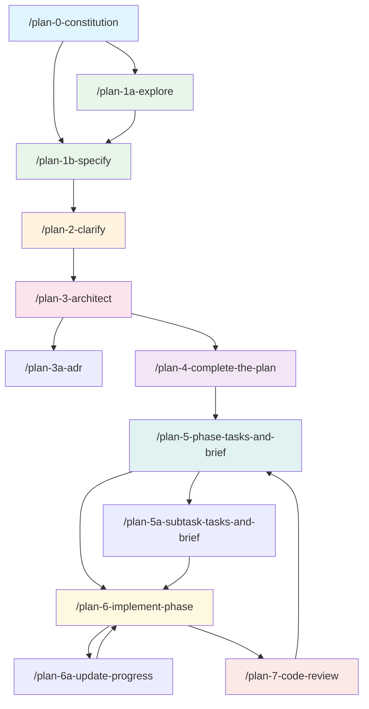

# Research Dossier: Agent Command Architecture for /8 Merge Command

**Generated**: 2026-01-01T00:00:00Z
**Research Query**: "Understand agent command flows, inter-command communication, and execution logs to design /8 merge command"
**Mode**: Plan-Associated
**Location**: docs/plans/003-merge-plans/research-dossier.md
**FlowSpace**: Not Available (used standard tools)
**Findings**: 70+ findings from 7 parallel subagents

---

## Executive Summary

### What It Does
The agent command system is a **file-system-based event streaming architecture** where commands form a linear pipeline (spec → plan → tasks → implementation → review), communicate through structured artifacts in `docs/plans/<ordinal>-<slug>/`, and maintain a **bidirectional provenance graph** via synchronized footnote ledgers that link tasks, logs, and source code.

### Business Purpose
A `/8` merge command must reconcile divergent plan states (incoming vs. local) while preserving this bidirectional graph integrity. The merge document must function as both a **research dossier** (understanding what changed) and an **implementation guide** (what to overwrite, keep, or manually resolve).

### Key Insights
1. **Atomic 3-location updates are non-negotiable** — Dossier, Plan, and both Footnote Ledgers must stay synchronized
2. **Parallel subagent pattern is the proven approach** — All complex commands use 4-7 specialized subagents launched in a single message
3. **Execution logs are the source of truth** — They contain timestamped evidence that cannot be reconstructed from other artifacts
4. **FlowSpace node IDs create code-to-plan traceability** — Merging must preserve or reconcile these bidirectional links

### Quick Stats
- **Commands Analyzed**: 14 planning commands + 8 utility commands
- **Critical Patterns Identified**: 12 (see below)
- **Subagent Archetypes**: 7 distinct roles discovered
- **Validation Gates**: 4-phase process with 9 checkpoints
- **Prior Learnings**: No directly applicable prior merge learnings (new capability)

---

## How It Currently Works

### Entry Points

| Entry Point | Type | Location | Purpose |
|------------|------|----------|---------|
| `/plan-0-constitution` | Foundation | `agents/commands/plan-0-constitution.md` | Establish project doctrine |
| `/plan-1a-explore` | Research | `agents/commands/plan-1a-explore.md` | Deep codebase exploration |
| `/plan-1b-specify` | Specification | `agents/commands/plan-1b-specify.md` | Create feature spec |
| `/plan-2-clarify` | Clarification | `agents/commands/plan-2-clarify.md` | Resolve ambiguities |
| `/plan-3-architect` | Planning | `agents/commands/plan-3-architect.md` | Generate implementation plan |
| `/plan-4-complete-the-plan` | Validation | `agents/commands/plan-4-complete-the-plan.md` | Readiness gate |
| `/plan-5-phase-tasks-and-brief` | Dossier | `agents/commands/plan-5-phase-tasks-and-brief.md` | Create task dossier |
| `/plan-5a-subtask-tasks-and-brief` | Subtask | `agents/commands/plan-5a-subtask-tasks-and-brief.md` | Create subtask dossier |
| `/plan-6-implement-phase` | Execution | `agents/commands/plan-6-implement-phase.md` | Execute with logging |
| `/plan-6a-update-progress` | Progress | `agents/commands/plan-6a-update-progress.md` | Atomic status updates |
| `/plan-7-code-review` | Review | `agents/commands/plan-7-code-review.md` | Per-phase code review |

### Core Execution Flow



### State Management: The Plan Folder

```
docs/plans/<ordinal>-<slug>/
├── <slug>-spec.md                 # Feature specification (WHAT/WHY)
├── <slug>-plan.md                 # Implementation plan (phases, tasks, footnotes)
├── research-dossier.md            # Optional: from /plan-1a-explore
├── external-research/             # Optional: /deepresearch results
│   └── topic-slug.md
└── tasks/                         # Phase execution directories
    ├── phase-1-<slug>/
    │   ├── tasks.md               # Dossier: tasks + alignment brief
    │   ├── execution.log.md       # Implementation evidence
    │   └── 001-subtask-*.md       # Optional subtask dossiers
    ├── phase-2-<slug>/
    │   ├── tasks.md
    │   └── execution.log.md
    └── reviews/
        └── review.phase-N.md      # Code review reports
```

### Data Flow Between Commands

```
/plan-1b-specify → spec.md (WHAT/WHY)
        ↓
/plan-2-clarify → spec.md § Clarifications (updated in-place)
        ↓
/plan-3-architect → plan.md (3-5 phases with tasks)
        ↓
/plan-5-phase-tasks-and-brief → tasks/phase-N/tasks.md (dossier per phase)
        ↓
/plan-6-implement-phase → execution.log.md + code changes + discoveries
        ↓
/plan-7-code-review → review report + validation
```

---

## Architecture & Design

### Component Map: Command File Structure

Each command file follows this template:

```markdown
---
description: [One-line summary for CLI listing]
---

# command-name (alias: alternative-name)

[Optional: Re-entrancy declaration, key features]

````md
User input:

$ARGUMENTS

## Execution Flow (deterministic)

1) [Step 1 with sub-bullets for logic]
2) [Step 2]
...

## [Major Section]
[Procedural guidance or subagent task definitions]

## Acceptance Criteria
- [ ] [Testable criterion]

## Output Format
[Expected output structure]
````

Next step: [Link to downstream command(s)]
```

### Design Patterns Identified

#### Pattern 1: YAML Frontmatter with Description
**Location**: All command files, lines 1-3
```yaml
---
description: Establish or refresh the project constitution...
---
```
Used by CLI to list available commands.

#### Pattern 2: $ARGUMENTS Placeholder
**Location**: All command files
```markdown
User input:

$ARGUMENTS
```
CLI injects user arguments into this placeholder.

#### Pattern 3: Numbered Deterministic Steps
**Location**: All complex commands
```markdown
## Execution Flow (deterministic)
1) Resolve repository paths and detect mode
   - If your environment supplies...
   - Set constants: CONST, RULES...
2) Launch parallel context gatherers
```

#### Pattern 4: Parallel Subagent Task Definitions
**Location**: `plan-1a-explore.md`, `plan-3-architect.md`, `plan-5-phase-tasks-and-brief.md`, `plan-7-code-review.md`
```markdown
**Subagent 1: [Role Name]**
"[Task description]

**Research Areas**:
- [Area 1]
- [Area 2]

**Output**: N findings numbered X1-01 through X1-0N"
```

#### Pattern 5: Synthesis Framework
**Location**: After subagent definitions
```markdown
After all N subagents complete:
1. Collect All Findings: Gather ~M findings from all subagents
2. Deduplicate: Merge overlapping (note sources)
3. Prioritize: Order by impact (Critical → High → Medium → Low)
4. Renumber: Assign final numbers 01, 02, 03...
```

#### Pattern 6: Discovery Output Format
**Location**: `plan-3-architect.md` lines 156-172
```markdown
### Discovery 01: [Title]
**Category**: Pattern | Integration | Convention
**Impact**: Critical | High | Medium | Low
**What**: [Concise description]
**Why It Matters**: [How this affects implementation]
**Example**:
```[language]
// ❌ WRONG
[counter-example]

// ✅ CORRECT
[good example]
```
**Action Required**: [What implementation must do]
```

### System Boundaries

#### Internal Boundaries
- Commands read/write to `docs/plans/` folder only
- Each command has defined inputs (--plan, --phase, --spec flags)
- Output artifacts have strict naming conventions

#### External Interfaces
- User input via $ARGUMENTS placeholder
- CLI tool provides command discovery and execution
- FlowSpace MCP (optional) for enhanced code exploration

#### Integration Points
- Git for version control of plan artifacts
- Source code files receive FlowSpace node ID comments
- ADR documents cross-link with plans

---

## Dependencies & Integration

### What Commands Depend On

#### Internal Dependencies
| Dependency | Type | Purpose | Risk if Changed |
|------------|------|---------|-----------------|
| `docs/plans/` folder structure | Required | State storage | All commands break |
| YAML frontmatter format | Required | CLI discovery | Commands not listed |
| Footnote ledger format | Required | Bidirectional linking | Graph integrity lost |
| Mermaid diagram syntax | Required | Visual tracking | Status unclear |

#### External Dependencies
| Service/Library | Version | Purpose | Criticality |
|-----------------|---------|---------|-------------|
| FlowSpace MCP | Optional | Enhanced code exploration | Medium (fallback exists) |
| Git | Any | Version control | High |
| Markdown renderer | CommonMark | Display formatting | Low |

### What Depends on Command Output

#### Direct Consumers
- **Subsequent commands**: Each command reads artifacts from prior commands
- **Human reviewers**: Read specs, plans, dossiers, logs
- **Code review tools**: May parse execution logs

#### Indirect Consumers
- **Future phases**: Prior phase discoveries inform later work
- **ADR system**: Architectural decisions link to plans
- **Codebase**: Receives FlowSpace comments

---

## Quality & Testing

### Current Test Coverage
- **Unit Tests**: None (commands are prompts, not code)
- **Integration Tests**: Manual validation via command execution
- **E2E Tests**: None
- **Gaps**: No automated validation of command output format

### Test Strategy Analysis
Commands rely on **validation gates** within execution:
- Pre-execution: Check required inputs exist
- During execution: Checkpoint after each phase
- Post-execution: Validate output structure

### Known Issues & Technical Debt
| Issue | Severity | Location | Impact |
|-------|----------|----------|--------|
| No automated format validation | Medium | All commands | Malformed output possible |
| FlowSpace dependency optional | Low | Exploration commands | Degraded experience |
| Simple vs Full mode complexity | Medium | plan-6, plan-6a | Conditional logic overhead |

---

## Modification Considerations

### Safe to Modify
Areas with low risk of breaking changes:
1. **Discovery output format**: Can add fields if numbered format preserved
2. **Mermaid diagram styling**: Color changes don't affect logic
3. **Help text and examples**: Documentation-only changes

### Modify with Caution
Areas requiring careful consideration:
1. **Footnote format**: Changes affect 4 synchronized locations
   - Risk: Graph integrity loss
   - Mitigation: Update all 4 locations atomically
2. **Task table columns**: Changes affect plan-6a parsing
   - Risk: Progress updates fail
   - Mitigation: Ensure all parsers updated

### Danger Zones
High-risk modification areas:
1. **Folder structure** (`docs/plans/<ordinal>-<slug>/`)
   - Dependencies: Every command uses this path pattern
   - Alternative: None (would require full system rewrite)
2. **3-location update pattern**
   - Dependencies: Bidirectional graph relies on this
   - Alternative: None (core architectural constraint)

### Extension Points
Designed for modification:
1. **New subagent roles**: Add to parallel launch pattern
2. **New discovery types**: Extend `gotcha | research-needed | ...` enum
3. **New validation gates**: Add to Phase D validators

---

## Critical Discoveries for Merge Command

### Discovery 01: Bidirectional Footnote Graph
**Category**: Architecture
**Impact**: Critical
**What**: Every code change is linked via `[^N]` footnotes appearing in 4 locations:
1. Source code comments: `# FlowSpace: [^3] [^7] function:path:name`
2. Plan § 12: Change Footnotes Ledger
3. Dossier § Phase Footnote Stubs
4. Execution log task entries

**Why It Matters**: Merging two plan states requires reconciling footnote numbers. Same `[^N]` with different content = conflict.

**Action Required**: Merge command must detect footnote conflicts and either reconcile or renumber sequentially.

---

### Discovery 02: Atomic 3-Location Updates
**Category**: Constraint
**Impact**: Critical
**What**: Status changes MUST update simultaneously:
- Dossier task table: `[ ]` → `[x]`
- Plan task table: `[ ]` → `[x]` + log link
- Both footnote ledgers: identical `[^N]` entries

**Why It Matters**: Partial updates break graph integrity. Merge cannot apply half-changes.

**Action Required**: Merge must validate 3-location consistency before AND after merge. Reject partial states.

---

### Discovery 03: Execution Log as Append-Only Truth
**Category**: Architecture
**Impact**: Critical
**What**: Logs contain timestamped task entries with evidence that cannot be reconstructed:
- What was done (with timestamps)
- Test results/evidence
- Files changed
- Discoveries logged
- Deep links to plan and dossier

**Why It Matters**: Incoming logs may contain work not reflected in local plan. This is non-reconstructible truth.

**Action Required**: Merge must preserve ALL log entries from both sources. Never discard log content.

---

### Discovery 04: Parallel Subagent Pattern
**Category**: Pattern
**Impact**: High
**What**: All complex commands use 4-7 specialized subagents launched in a single message:
```markdown
**Subagent 1: [Role]**
"[Task]
**Output**: N findings numbered X1-01..."
```
Then: Block until complete → Deduplicate → Renumber → Synthesize

**Why It Matters**: Proven pattern for comprehensive analysis. Merge should follow this.

**Action Required**: Design 6-8 parallel subagents for merge analysis.

---

### Discovery 05: Alignment Brief as Contract
**Category**: Pattern
**Impact**: High
**What**: The Alignment Brief section contains:
- Prior phases review (cross-phase synthesis)
- Critical findings affecting this phase
- ADR decision constraints
- Visual alignment aids (diagrams)
- Test plan and implementation outline
- Ready checklist (GO/NO-GO gate)

**Why It Matters**: This is the shared-understanding checkpoint before implementation.

**Action Required**: Merge plan must include similar sections showing resolved vs. conflicting items.

---

### Discovery 06: Simple vs. Full Mode
**Category**: Constraint
**Impact**: Medium
**What**: Plans can be:
- **Simple Mode**: Single phase, inline task table in plan.md
- **Full Mode**: Multi-phase with separate dossier directories

**Why It Matters**: Merge may encounter cross-mode scenarios (Simple merging with Full).

**Action Required**: Detect mode in both incoming and local. Handle cross-mode merges gracefully.

---

### Discovery 07: Validation Gates Pattern
**Category**: Pattern
**Impact**: High
**What**: Progress tracking has 4 phases with checkpoints:
- Phase A: Load State (3 parallel readers)
- Phase B: Capture Evidence
- Phase C: Atomic Updates (3 parallel updaters)
- Phase D: Validate (3 parallel validators)

**Why It Matters**: Ensures integrity at each step. Merge needs similar gates.

**Action Required**: Implement 4-phase validation: Pre-read → Compare → Apply → Validate.

---

### Discovery 08: FlowSpace Node ID Format
**Category**: Architecture
**Impact**: High
**What**: Code provenance uses structured IDs embedded in source:
```python
# FlowSpace: [^3] [^7] function:src/validators.py:validate_email
def validate_email(email: str) -> bool:
```
Formats:
- `class:src/path:ClassName`
- `method:src/path:ClassName.method`
- `function:src/path:func_name`
- `file:src/path`

**Why It Matters**: Source files have embedded plan references. Merge must preserve or update these.

**Action Required**: Track FlowSpace IDs in both versions. Update source comments if footnotes renumbered.

---

### Discovery 09: Discoveries & Learnings Table
**Category**: Pattern
**Impact**: Medium
**What**: Structured table capturing insights during implementation:
```markdown
| Date | Task | Type | Discovery | Resolution | References |
|------|------|------|-----------|------------|------------|
```
Types: `gotcha | research-needed | unexpected-behavior | workaround | decision | debt | insight`

**Why It Matters**: Institutional knowledge. Must be preserved across merge.

**Action Required**: Merge discovery tables without losing cross-references or creating duplicates.

---

### Discovery 10: Visual Status Tracking
**Category**: Pattern
**Impact**: Medium
**What**: Multiple synchronized visual indicators:
- Mermaid diagram nodes: `:::pending` → `:::inprogress` → `:::completed ✓`
- Task-to-Component table: ⬜ → 🟧 → ✅
- Tasks table checkbox: `[ ]` → `[~]` → `[x]`

**Why It Matters**: All indicators must reflect merged state.

**Action Required**: Update all visual indicators when merging status changes.

---

### Discovery 11: Next Step Handoff Pattern
**Category**: Pattern
**Impact**: Low
**What**: Every command ends with explicit next step:
```markdown
Next step: Run /plan-X to [action]
```

**Why It Matters**: Provides clear workflow guidance.

**Action Required**: Merge plan must include clear next steps for resolution.

---

### Discovery 12: Prior Phase Review Pattern
**Category**: Pattern
**Impact**: High
**What**: When generating phase N tasks, plan-5 launches parallel subagents to review ALL prior phases:
- Deliverables, Lessons, Discoveries, Dependencies, Test Infrastructure, Debt

**Why It Matters**: Same pattern should apply to merge: parallel review of incoming vs. local.

**Action Required**: Use similar parallel review pattern for merge analysis.

---

## Proposed Merge Command Architecture

### Recommended Subagent Structure (8 Parallel Subagents)

| ID | Role | Focus Area |
|----|------|------------|
| **M1** | Incoming Plan Analyst | Read incoming plan structure, phases, tasks, status |
| **M2** | Local Plan Analyst | Read local plan structure, phases, tasks, status |
| **M3** | Execution Log Comparator | Compare incoming vs. local execution logs, find divergence |
| **M4** | Footnote Reconciler | Analyze footnote ledgers for conflicts, propose renumbering |
| **M5** | Discovery Merger | Merge Discoveries & Learnings tables, deduplicate |
| **M6** | Visual Status Synchronizer | Reconcile diagrams and status indicators |
| **M7** | FlowSpace ID Tracker | Track code-embedded node IDs, identify conflicts |
| **M8** | Conflict Classifier | Classify all conflicts: auto-resolve vs. manual |

### Merge Plan Document Structure

```markdown
# Merge Plan: [Feature Name]

**Generated**: [timestamp]
**Incoming Source**: [branch/commit/PR]
**Local Source**: [branch/commit]
**Plan Folder**: docs/plans/<ordinal>-<slug>/merge/<date>/

## Executive Briefing

### Merge Summary
[2-3 sentence overview of what's being merged]

### Conflict Overview
- **Auto-Resolvable**: [count] items
- **Manual Resolution Required**: [count] items
- **Overwrite from Incoming**: [count] items
- **Keep Local**: [count] items

### Risk Assessment
[High/Medium/Low with explanation]

## Architecture Map: Incoming vs. Local

[Mermaid diagram showing both states with conflict highlighting]

## Task-to-Component Mapping

| Task | Component | Incoming Status | Local Status | Resolution | Notes |
|------|-----------|-----------------|--------------|------------|-------|

## Conflict Resolution Plan

### Category A: Auto-Resolvable (Incoming Wins)
[Tasks/changes where incoming should overwrite local]

### Category B: Auto-Resolvable (Local Wins)
[Tasks/changes where local should be preserved]

### Category C: Manual Resolution Required
[Conflicts requiring human decision]

### Category D: Merge (Both Contribute)
[Items that can be combined]

## Footnote Reconciliation

### Renumbering Required
[If footnote numbers conflict, show old → new mapping]

### FlowSpace ID Updates
[Source files needing comment updates]

## Execution Log Merge Strategy

[How to merge append-only logs - typically concatenate by timestamp]

## Discoveries Merge

[Combined Discoveries & Learnings table with deduplication]

## Validation Gates

### Pre-Merge Validation
- [ ] All 3 locations consistent in incoming
- [ ] All 3 locations consistent in local
- [ ] Footnote ledgers synchronized in each source

### Post-Merge Validation
- [ ] Merged plan has valid structure
- [ ] All footnotes renumbered correctly
- [ ] All deep links resolve
- [ ] Visual indicators consistent
- [ ] Execution logs preserved

## Tasks for Merge Execution

| ID | Task | Type | Resolution | Files | Notes |
|----|------|------|------------|-------|-------|
| M001 | Apply Category A overwrites | Auto | Incoming | [paths] | |
| M002 | Preserve Category B items | Auto | Local | [paths] | |
| M003 | Resolve conflict in T005 | Manual | TBD | [paths] | User decision needed |

## Next Steps

1. Review this merge plan
2. Resolve Category C conflicts manually
3. Execute merge tasks M001-M00N
4. Run post-merge validation
5. Resume normal planning workflow with /plan-5 or /plan-6
```

---

## Prior Learnings (From Previous Implementations)

No prior learnings found directly related to merge operations.

**Scanned**:
- 2 Discoveries & Learnings sections across 2 existing plans
- `docs/plans/001-ghcp-prompt-mirroring/` - GitHub Copilot prompt mirroring
- `docs/plans/002-adr-flow-integration/` - ADR flow integration

**Topics covered by existing discoveries**: File extension requirements (.prompt.md), directory variable naming, integration test strategies.

**Note**: This is a new capability. The patterns from `/plan-5-phase-tasks-and-brief` (prior phase review) and `/plan-6a-update-progress` (atomic updates) provide the architectural foundation.

---

## External Research Opportunities

### Research Opportunity 1: Git Merge Conflict Resolution Patterns

**Why Needed**: Understanding how git handles three-way merges could inform our approach to plan artifact merging.

**Impact on Plan**: Could provide proven algorithms for detecting and classifying conflicts.

**Source Findings**: DC-03, DC-07 (dependency patterns)

**Ready-to-use prompt:**
```
/deepresearch "Git three-way merge algorithms and conflict detection strategies.
Focus on:
1. How git identifies conflicting vs. auto-resolvable changes
2. Strategies for semantic merge vs. textual merge
3. Best practices for structured document merging (not just code)
4. Patterns from other tools that merge structured artifacts (e.g., database migrations, API specs)"
```

**Results location**: Save to `docs/plans/003-merge-plans/external-research/git-merge-patterns.md`

---

### Research Opportunity 2: Bidirectional Graph Reconciliation

**Why Needed**: The footnote system creates a graph. Standard graph merge algorithms may apply.

**Impact on Plan**: Could provide formal approach to detecting and resolving graph conflicts.

**Source Findings**: IA-01, IA-04 (footnote architecture)

**Ready-to-use prompt:**
```
/deepresearch "Graph merge and reconciliation algorithms for directed graphs with bidirectional references.
Focus on:
1. Techniques for merging two divergent versions of a graph
2. Detecting conflicting edges (same source, different targets)
3. Node renumbering strategies that preserve reference integrity
4. Applications in version control systems and document linking"
```

**Results location**: Save to `docs/plans/003-merge-plans/external-research/graph-reconciliation.md`

---

## Recommendations

### If Modifying This System
1. **Never break 3-location atomicity** — The bidirectional graph depends on it
2. **Preserve footnote format** — `[^N]` pattern is used everywhere
3. **Test with both Simple and Full mode** plans

### If Extending This System
1. **Follow the parallel subagent pattern** — Launch in single message, block, synthesize
2. **Use validation gates** — Pre/post checks catch errors early
3. **Include discovery logging** — Future phases benefit from captured insights

### If Creating the Merge Command
1. **Use 8 parallel subagents** for comprehensive analysis
2. **Create structured merge plan document** with conflict classification
3. **Implement 4-phase validation gates**
4. **Preserve all execution log content** (append-only truth)
5. **Handle footnote renumbering** with source code comment updates

---

## Appendix: File Inventory

### Core Command Files
| File | Purpose | Lines |
|------|---------|-------|
| `agents/commands/plan-0-constitution.md` | Project doctrine setup | ~380 |
| `agents/commands/plan-1a-explore.md` | Deep codebase research | ~450 |
| `agents/commands/plan-1b-specify.md` | Feature specification | ~300 |
| `agents/commands/plan-2-clarify.md` | Ambiguity resolution | ~150 |
| `agents/commands/plan-3-architect.md` | Implementation planning | ~400 |
| `agents/commands/plan-5-phase-tasks-and-brief.md` | Task dossier creation | ~600 |
| `agents/commands/plan-6-implement-phase.md` | Phase execution | ~450 |
| `agents/commands/plan-6a-update-progress.md` | Atomic progress updates | ~350 |
| `agents/commands/plan-7-code-review.md` | Code review | ~400 |

### Existing Plan Examples
| Folder | Status | Mode |
|--------|--------|------|
| `docs/plans/001-ghcp-prompt-mirroring/` | Complete | Full |
| `docs/plans/002-adr-flow-integration/` | In Progress | Full |

---

## Next Steps

**Research is complete.**

To proceed with the merge command:
1. **(Optional)** Run `/deepresearch` prompts above for external research
2. Run `/plan-1b-specify "Create /8 merge command for reconciling divergent plan states"` to create the formal specification
3. Continue through `/plan-3-architect` to design the implementation

---

**Research Complete**: 2026-01-01
**Report Location**: docs/plans/003-merge-plans/research-dossier.md
