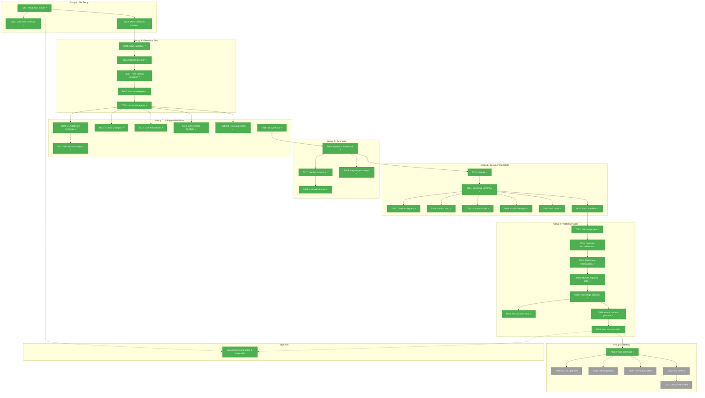
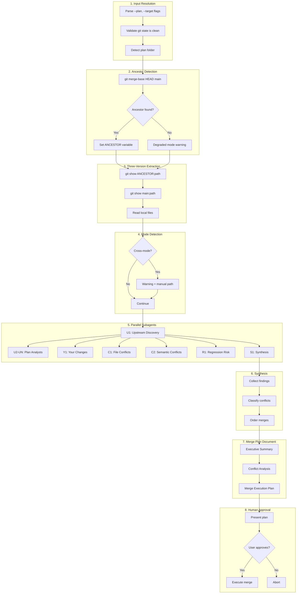
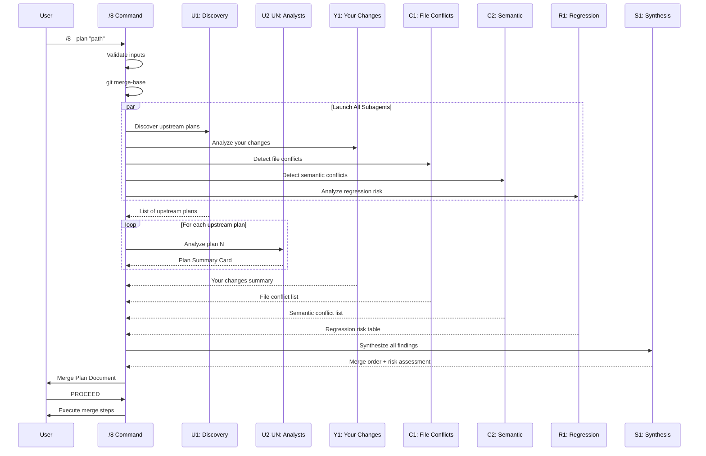

# Phase 1: Create plan-8-merge.md Command File – Tasks & Alignment Brief

**Spec**: [../../merge-plans-spec.md](../../merge-plans-spec.md)
**Plan**: [../../merge-plans-plan.md](../../merge-plans-plan.md)
**Research**: [../../research-dossier.md](../../research-dossier.md)
**Date**: 2026-01-01
**Phase Slug**: `phase-1-create-plan-8-merge-md-command-file`

---

## Executive Briefing

### Purpose
This phase creates the `/8` (alias: `/merge`) command that helps developers safely merge upstream changes from main into their feature branches. The command analyzes what plans landed while you were working, identifies conflicts, and generates a crystal-clear merge plan document before any merge execution.

### What We're Building
A single markdown command file (`agents/commands/plan-8-merge.md`, ~400-600 lines) that:
- Discovers all plans that landed in main since you branched (via `git merge-base`)
- Launches parallel subagents (6 fixed + 1 per upstream plan) to analyze changes
- Classifies conflicts as Complementary, Contradictory, Orthogonal, or Auto-Resolvable
- Generates a merge plan document with Mermaid diagrams, tables, and step-by-step instructions
- Requires explicit human approval before any merge execution

### User Value
When you've been working on a feature branch for days or weeks, main has moved on. Other developers merged their completed plans. This command gives you:
- **Understanding**: See exactly what changed upstream (which plans, which files, which components)
- **Safety**: Conflicts and regression risks identified before you touch anything
- **Control**: Human approval required; you decide when and how to merge
- **Clarity**: Merge plan document serves as shared understanding between you and the AI

### Example
**Input**: Run `/8` on your feature branch

**Output**: A merge plan document showing:
```
## What Happened While You Worked
| Plan | Merged | Purpose | Risk to You |
|------|--------|---------|-------------|
| 004-payments | 10 days ago | Stripe integration | Medium (User model) |
| 005-notifications | 7 days ago | Email service | Low (independent) |

## Conflict Summary
- Direct Conflicts: 2 files
- Semantic Conflicts: 1 (User API)
- Regression Risks: 3

## Recommended Approach
1. Merge 005-notifications first (no conflicts)
2. Merge 004-payments, resolve User model...
```

---

## Objectives & Scope

### Objective
Write the complete `/8` merge command file following established patterns from plan-3, plan-5, plan-7. The command must satisfy all 8 acceptance criteria from the spec (AC1-AC8).

### Goals

- ✅ Create valid YAML front matter and command header with aliases
- ✅ Define 6 fixed subagents + dynamic U2-UN template for plan analysis
- ✅ Implement three-way merge context using `git merge-base`
- ✅ Write complete merge plan document template with diagrams
- ✅ Include mandatory human approval gate (AC7)
- ✅ Add footnote reconciliation protocol (Finding 01)
- ✅ Implement anti-hallucination patterns (Finding 06)
- ✅ Include post-merge validation checklist (AC8)

### Non-Goals

- ❌ Automated test suite (Manual Only testing per spec)
- ❌ Separate documentation files (self-documenting command)
- ❌ Auto-execution of merge (human approval mandatory)
- ❌ FlowSpace MCP integration as requirement (must work without it)
- ❌ Historical pattern database (derive everything from git)
- ❌ Cross-plan footnote merging (analyze only; don't modify)
- ❌ Performance optimization (clarity over speed)

---

## Architecture Map

### Component Diagram
<!-- Status: grey=pending, orange=in-progress, green=completed, red=blocked -->
<!-- Updated by plan-6 during implementation -->



### Task-to-Component Mapping

<!-- Status: ⬜ Pending | 🟧 In Progress | ✅ Complete | 🔴 Blocked -->

| Task | Component(s) | Lines (est.) | Status | Comment |
|------|-------------|--------------|--------|---------|
| T001-T003 | Group A: File Setup | ~15 | ✅ Complete | YAML front matter, header, summary, arguments |
| T004-T008 | Group B: Execution Flow | ~80 | ✅ Complete | 5 numbered steps for input → subagent launch |
| T009-T015 | Group C: Subagent Definitions | ~150 | ✅ Complete | 6 fixed + 1 dynamic template |
| T016-T019 | Group D: Synthesis | ~60 | ✅ Complete | Conflict classification, anti-hallucination |
| T020-T027 | Group E: Document Template | ~120 | ✅ Complete | Merge plan output format |
| T028-T035 | Group F: Validation Gates | ~80 | ✅ Complete | Pre/post validation, human approval |
| T036-T041 | Group G: Testing | -- | 🟧 In Progress | T036 complete, T037-T041 pending manual testing |

**Total estimated file size**: ~500 lines (within 400-600 target)

---

## Tasks

| Status | ID | Task | CS | Type | Dependencies | Absolute Path(s) | Validation | Subtasks | Notes |
|--------|-----|------|----|------|--------------|------------------|------------|----------|-------|
| [x] | T001 | Create file with YAML front matter and command header | 1 | Setup | -- | /Users/jordanknight/github/tools/agents/commands/plan-8-merge.md | Front matter parses, title includes aliases `/8, /merge` | -- | Follow plan-7 pattern |
| [x] | T002 | Write executive summary (purpose, approach, key outputs) | 2 | Core | T001 | /Users/jordanknight/github/tools/agents/commands/plan-8-merge.md | 2-3 paragraphs explaining command purpose and merge plan document as primary output | -- | Reference spec Summary |
| [x] | T003 | Write $ARGUMENTS section with flag definitions | 1 | Core | T001 | /Users/jordanknight/github/tools/agents/commands/plan-8-merge.md | `--plan`, `--target` flags documented with defaults | -- | Target defaults to `main` |
| [x] | T004 | Write Execution Flow Step 1: Input resolution and validation | 2 | Core | T003 | /Users/jordanknight/github/tools/agents/commands/plan-8-merge.md | Path resolution logic, git state check, plan folder detection | -- | Include error messages |
| [x] | T005 | Write Execution Flow Step 2: Common ancestor detection | 2 | Core | T004 | /Users/jordanknight/github/tools/agents/commands/plan-8-merge.md | `git merge-base HEAD main` with error handling, no-ancestor fallback | -- | Per Finding 10 |
| [x] | T006 | Write Execution Flow Step 3: Three-version extraction | 2 | Core | T005 | /Users/jordanknight/github/tools/agents/commands/plan-8-merge.md | Git commands for ancestor/main/local versions | -- | `git show` patterns |
| [x] | T007 | Write Execution Flow Step 4: Cross-mode detection gate | 2 | Core | T006 | /Users/jordanknight/github/tools/agents/commands/plan-8-merge.md | Detect Simple vs Full mode, warn if cross-mode | -- | Per Finding 05 |
| [x] | T008 | Write Execution Flow Step 5: Launch parallel subagents | 1 | Core | T007 | /Users/jordanknight/github/tools/agents/commands/plan-8-merge.md | "Launch all subagents in single message" with blocking | -- | Follow plan-3 pattern |
| [x] | T009 | Write Subagent U1: Upstream Plans Discovery | 2 | Core | T008 | /Users/jordanknight/github/tools/agents/commands/plan-8-merge.md | Git log parsing, outputs list of plan ordinals | -- | `git log ${ANCESTOR}..main` |
| [x] | T010 | Write Subagent U2-UN: Plan Analyst (dynamic template) | 3 | Core | T009 | /Users/jordanknight/github/tools/agents/commands/plan-8-merge.md | One per upstream plan, outputs Plan Summary Card | -- | Card: Purpose, Files, Key Changes, Conflicts |
| [x] | T011 | Write Subagent Y1: Your Changes Analyst | 2 | Core | T008 | /Users/jordanknight/github/tools/agents/commands/plan-8-merge.md | Branch diff analysis, what you changed and why | -- | `git diff ${ANCESTOR}..HEAD` |
| [x] | T012 | Write Subagent C1: File Conflict Detector | 2 | Core | T008 | /Users/jordanknight/github/tools/agents/commands/plan-8-merge.md | File list comparison, direct conflicts | -- | `comm -12` pattern |
| [x] | T013 | Write Subagent C2: Semantic Conflict Detector | 3 | Core | T008 | /Users/jordanknight/github/tools/agents/commands/plan-8-merge.md | Cross-plan semantic analysis, flags for human review | -- | Higher CS: semantic complexity |
| [x] | T014 | Write Subagent R1: Regression Risk Analyst | 2 | Core | T008 | /Users/jordanknight/github/tools/agents/commands/plan-8-merge.md | Test impact analysis, outputs Regression Risk Table | -- | Bidirectional risk check |
| [x] | T015 | Write Subagent S1: Synthesis & Ordering | 3 | Core | T008 | /Users/jordanknight/github/tools/agents/commands/plan-8-merge.md | Merge order based on dependencies, risk synthesis | -- | Outputs ordered merge steps |
| [x] | T016 | Write Synthesis Framework section | 2 | Core | T015 | /Users/jordanknight/github/tools/agents/commands/plan-8-merge.md | "After all subagents complete..." with dedup/classify/prioritize | -- | Mirror plan-3 pattern |
| [x] | T017 | Write Conflict Classification taxonomy | 2 | Core | T016 | /Users/jordanknight/github/tools/agents/commands/plan-8-merge.md | 4 categories: Complementary, Contradictory, Orthogonal, Auto-Resolvable | -- | Per Finding 08 |
| [x] | T018 | Write Anti-Hallucination patterns section | 2 | Core | T017 | /Users/jordanknight/github/tools/agents/commands/plan-8-merge.md | Chain-of-verification, constrained output, uncertainty flagging | -- | Per Finding 06 |
| [x] | T019 | Write Execution Log Merge Strategy section | 2 | Core | T016 | /Users/jordanknight/github/tools/agents/commands/plan-8-merge.md | Append-only merge, interleave by timestamp, source attribution | -- | Per Finding 02 - CRITICAL |
| [x] | T020 | Write Merge Plan Document Template: Header | 1 | Core | T016 | /Users/jordanknight/github/tools/agents/commands/plan-8-merge.md | Generated timestamp, branches @ SHA, Common Ancestor | -- | Per spec AC4 |
| [x] | T021 | Write Merge Plan Document Template: Executive Summary | 2 | Core | T020 | /Users/jordanknight/github/tools/agents/commands/plan-8-merge.md | "What Happened" table, Conflict Summary, Recommended Approach | -- | |
| [x] | T022 | Write Merge Plan Document Template: Mermaid timeline | 2 | Core | T021 | /Users/jordanknight/github/tools/agents/commands/plan-8-merge.md | Timeline showing when each upstream plan merged | -- | Use `timeline` mermaid |
| [x] | T023 | Write Merge Plan Document Template: Mermaid conflict map | 2 | Core | T021 | /Users/jordanknight/github/tools/agents/commands/plan-8-merge.md | Graph showing Your Changes vs Upstream with edges | -- | Use `graph LR` subgraphs |
| [x] | T024 | Write Merge Plan Document Template: Plan Summary Card | 2 | Core | T021 | /Users/jordanknight/github/tools/agents/commands/plan-8-merge.md | Purpose, Files Changed, Key Changes, Tests Added, Conflicts | -- | Per spec AC2 |
| [x] | T025 | Write Merge Plan Document Template: Conflict Analysis | 2 | Core | T021 | /Users/jordanknight/github/tools/agents/commands/plan-8-merge.md | Per-conflict: Your Change, Upstream, Type, Resolution, Verification | -- | Include reasoning chain |
| [x] | T026 | Write Merge Plan Document Template: Regression Risk table | 2 | Core | T021 | /Users/jordanknight/github/tools/agents/commands/plan-8-merge.md | Risk, Upstream Plan, Your Change, Likelihood, Test Command | -- | Per spec AC5 |
| [x] | T027 | Write Merge Plan Document Template: Merge Execution Plan | 2 | Core | T021 | /Users/jordanknight/github/tools/agents/commands/plan-8-merge.md | Phased commands: Safe Merges, Conflicting Merges, Validation | -- | Per spec AC6 |
| [x] | T028 | Write Pre-Merge Validation Gate | 2 | Core | T027 | /Users/jordanknight/github/tools/agents/commands/plan-8-merge.md | Git state clean, ancestor found, backup created, mode compatible | -- | |
| [x] | T029 | Write Footnote Reconciliation Protocol | 3 | Core | T028 | /Users/jordanknight/github/tools/agents/commands/plan-8-merge.md | Detect conflicts, renumbering scheme, 4-location update list | -- | Per Finding 01 - CRITICAL |
| [x] | T030 | Write FlowSpace ID Reconciliation section | 2 | Core | T029 | /Users/jordanknight/github/tools/agents/commands/plan-8-merge.md | Source code update list for FlowSpace comment updates | -- | Per Finding 07 |
| [x] | T031 | Write Human Approval Gate | 2 | Core | T030 | /Users/jordanknight/github/tools/agents/commands/plan-8-merge.md | Summary review, Conflict review, Risk acknowledgment, "PROCEED?" | -- | Per AC7 - MANDATORY |
| [x] | T032 | Write Post-Merge Validation Checklist | 2 | Core | T031 | /Users/jordanknight/github/tools/agents/commands/plan-8-merge.md | Tests pass, no lint errors, app starts, footnotes valid | -- | Per spec AC8 |
| [x] | T033 | Write Visual Status Reconciliation section | 2 | Core | T032 | /Users/jordanknight/github/tools/agents/commands/plan-8-merge.md | Status precedence rules, 4-location sync checklist | -- | Per Finding 09 |
| [x] | T034 | Write Atomic Update Protocol with rollback | 2 | Core | T032 | /Users/jordanknight/github/tools/agents/commands/plan-8-merge.md | Backup branch, checkpoint phases, rollback procedure | -- | Per R1-08 |
| [x] | T035 | Write Next Step Handoff section | 1 | Core | T034 | /Users/jordanknight/github/tools/agents/commands/plan-8-merge.md | "Proceed?" handling, resume commands, verification suggestions | -- | |
| [x] | T036 | Run `./setup.sh` to sync and install command | 1 | Validation | T035 | /Users/jordanknight/github/tools/setup.sh | Command appears in `~/.claude/commands/plan-8-merge.md` | -- | |
| [ ] | T037 | Manual test: No upstream changes scenario | 2 | Validation | T036 | -- | Correct "no changes" message displayed | -- | Test scenario 1 |
| [ ] | T038 | Manual test: Single upstream plan scenario | 2 | Validation | T036 | -- | Valid merge plan with 1 summary card | -- | Test scenario 2 |
| [ ] | T039 | Manual test: Multiple upstream plans scenario | 2 | Validation | T036 | -- | Valid merge plan with N cards, ordered merge | -- | Test scenario 3 |
| [ ] | T040 | Manual test: Direct file conflict scenario | 2 | Validation | T036 | -- | Conflict classified with resolution | -- | Test scenario 4 |
| [ ] | T041 | Validate AC1-AC8 satisfaction | 2 | Validation | T040 | -- | All 8 acceptance criteria from spec pass | -- | Final validation |

---

## Alignment Brief

### Prior Phases Review
**N/A** - This is Phase 1. No prior phases to review.

---

### Critical Findings Affecting This Phase

The following discoveries from plan § Critical Research Findings directly impact implementation:

| # | Finding | Constraint/Requirement | Addressed By |
|---|---------|----------------------|--------------|
| 01 | **Bidirectional footnote graph** | Must include 4-location reconciliation protocol | T029 |
| 02 | **Execution logs append-only** | NEVER discard entries; interleave by timestamp | T019 |
| 03 | **Atomic 3-location updates** | Post-merge validation checks dossier + plan + ledgers | T032 |
| 04 | **Parallel subagents** | 6 fixed (U1, Y1, C1, C2, R1, S1) + dynamic U2-UN | T009-T015 |
| 05 | **Cross-mode complexity** | Mode detection gate with warning | T007 |
| 06 | **LLM hallucination risk** | Chain-of-verification, constrained classification | T018 |
| 07 | **FlowSpace IDs** | Track in subagent output, update list | T030 |
| 08 | **Three-way merge** | Use `git merge-base`, 4 conflict categories | T005, T017 |
| 09 | **Visual status sync** | Status precedence rules, 4-location sync | T033 |
| 10 | **No common ancestor** | Degraded mode fallback with warning | T005 |

---

### ADR Decision Constraints
**N/A** - No ADRs exist in `docs/adr/` that affect this feature.

---

### Invariants & Guardrails

- **Human approval mandatory**: No git operations without explicit user consent (AC7)
- **No auto-execution**: Command analyzes and documents; user executes
- **Git-only context**: All merge context derived from git history (no external files)
- **Graceful degradation**: Must work without FlowSpace MCP

---

### Inputs to Read

Reference these files during implementation:

| File | Purpose |
|------|---------|
| `/Users/jordanknight/github/tools/agents/commands/plan-3-architect.md` | Pattern: parallel subagent definitions |
| `/Users/jordanknight/github/tools/agents/commands/plan-5-phase-tasks-and-brief.md` | Pattern: synthesis framework, output templates |
| `/Users/jordanknight/github/tools/agents/commands/plan-7-code-review.md` | Pattern: validation gates, structured output |
| `/Users/jordanknight/github/tools/agents/commands/plan-6a-update-progress.md` | Pattern: footnote reconciliation |
| `/Users/jordanknight/github/tools/docs/plans/003-merge-plans/merge-plans-spec.md` | Requirements: AC1-AC8 |
| `/Users/jordanknight/github/tools/docs/plans/003-merge-plans/research-dossier.md` | Context: architectural discoveries |

---

### Visual Alignment Aids

#### System Flow Diagram



#### Subagent Interaction Sequence



---

### Test Plan (Manual Only)

| Scenario | Setup | Expected Output | Validation Steps |
|----------|-------|-----------------|------------------|
| No upstream | Branch from main, no new commits | "No new commits" message | Run `/8`, verify message |
| Single plan | 1 plan merged to main | 1 Plan Summary Card | Check card has all 5 fields |
| Multiple plans | 3+ plans merged | N cards, ordered merge | Verify order matches dependencies |
| No conflicts | Different files | "No Conflict" for all | Check classification correct |
| Direct conflict | Same file both sides | Conflict Analysis shown | Verify resolution guidance |
| Semantic conflict | Same API, different files | Flagged for human | Check human review flag |
| Cross-mode | Simple vs Full | Warning displayed | Verify manual path offered |

---

### Step-by-Step Implementation Outline

**Group A (T001-T003): File Setup** - ~15 lines
1. Create file with YAML front matter
2. Add command header with aliases
3. Write executive summary
4. Add $ARGUMENTS section

**Group B (T004-T008): Execution Flow** - ~80 lines
1. Step 1: Input validation (paths, git state)
2. Step 2: `git merge-base` with fallback
3. Step 3: Three-version extraction
4. Step 4: Cross-mode detection gate
5. Step 5: Launch parallel subagents instruction

**Group C (T009-T015): Subagent Definitions** - ~150 lines
1. U1: Upstream Plans Discovery
2. U2-UN: Dynamic Plan Analyst template
3. Y1: Your Changes Analyst
4. C1: File Conflict Detector
5. C2: Semantic Conflict Detector
6. R1: Regression Risk Analyst
7. S1: Synthesis & Ordering

**Group D (T016-T019): Synthesis** - ~60 lines
1. Synthesis framework section
2. Conflict classification taxonomy
3. Anti-hallucination patterns
4. Execution log merge strategy

**Group E (T020-T027): Document Template** - ~120 lines
1. Merge plan header
2. Executive summary template
3. Mermaid timeline diagram
4. Mermaid conflict map
5. Plan Summary Card format
6. Conflict Analysis section
7. Regression Risk table
8. Merge Execution Plan

**Group F (T028-T035): Validation Gates** - ~80 lines
1. Pre-merge validation gate
2. Footnote reconciliation protocol
3. FlowSpace ID reconciliation
4. Human approval gate
5. Post-merge validation checklist
6. Visual status reconciliation
7. Atomic update protocol
8. Next step handoff

**Group G (T036-T041): Testing** - Manual
1. Install command
2. Run test scenarios
3. Validate AC1-AC8

---

### Commands to Run

```bash
# After implementation complete:
cd /Users/jordanknight/github/tools

# Sync and install command
./setup.sh

# Verify installation
ls -la ~/.claude/commands/plan-8-merge.md

# Test command (requires feature branch with upstream changes)
# /8 --plan "docs/plans/003-merge-plans"
```

---

### Risks/Unknowns

| Risk | Severity | Mitigation |
|------|----------|------------|
| Subagent outputs inconsistent | Medium | Define strict output schemas in each subagent |
| Missing edge cases | Medium | Cover all 7 test scenarios in command logic |
| Cross-mode complexity underestimated | Medium | Explicit warning with manual intervention path |
| Command too long (>600 lines) | Low | Group content logically; target ~500 lines |
| FlowSpace IDs not handled correctly | Medium | Include explicit reconciliation section |

---

### Ready Check

- [x] Plan reviewed and understood
- [x] All 10 Critical Findings mapped to tasks
- [x] Acceptance criteria (AC1-AC8) covered by tasks
- [x] Test scenarios defined (7 scenarios)
- [x] Pattern references identified (plan-3, plan-5, plan-7)
- [x] Inputs to read listed with absolute paths
- [x] Visual diagrams prepared (flow + sequence)
- [x] ADR constraints mapped (N/A - no ADRs)

**GO/NO-GO**: Awaiting human approval to proceed with implementation.

---

## Phase Footnote Stubs

_Populated during implementation by plan-6a-update-progress._

| Footnote | Task | Summary | FlowSpace Nodes |
|----------|------|---------|-----------------|
| [^1] | -- | [To be added during implementation] | -- |

---

## Evidence Artifacts

Implementation will write to:
- **Execution Log**: `/Users/jordanknight/github/tools/docs/plans/003-merge-plans/tasks/phase-1-create-plan-8-merge-md-command-file/execution.log.md`
- **Command File**: `/Users/jordanknight/github/tools/agents/commands/plan-8-merge.md`

---

## Discoveries & Learnings

_Populated during implementation by plan-6. Log anything of interest to your future self._

| Date | Task | Type | Discovery | Resolution | References |
|------|------|------|-----------|------------|------------|
| | | | | | |

**Types**: `gotcha` | `research-needed` | `unexpected-behavior` | `workaround` | `decision` | `debt` | `insight`

**What to log**:
- Things that didn't work as expected
- External research that was required
- Implementation troubles and how they were resolved
- Gotchas and edge cases discovered
- Decisions made during implementation
- Technical debt introduced (and why)
- Insights that future phases should know about

_See also: `execution.log.md` for detailed narrative._

---

## Directory Layout

```
docs/plans/003-merge-plans/
├── merge-plans-spec.md
├── merge-plans-plan.md
├── research-dossier.md
└── tasks/
    └── phase-1-create-plan-8-merge-md-command-file/
        ├── tasks.md                    # This file
        └── execution.log.md            # Created by /plan-6
```

---

**Dossier Complete**: 2026-01-01
**Total Tasks**: 41
**Next Step**: Run `/plan-6-implement-phase --phase "Phase 1" --plan "/Users/jordanknight/github/tools/docs/plans/003-merge-plans/merge-plans-plan.md"` after human **GO**.
