# Single Phase: Fix FlowSpace Detection & API References – Tasks & Alignment Brief

**Spec**: [../../fs2-spec.md](../../fs2-spec.md)
**Plan**: [../../fs2-plan.md](../../fs2-plan.md)
**Date**: 2026-01-04

---

## Executive Briefing

### Purpose
This phase fixes broken FlowSpace MCP detection in `plan-1a-explore.md` that currently references non-existent API methods (`get_status`, `search_nodes`), preventing agents from leveraging enhanced codebase exploration capabilities even when FlowSpace is available.

### What We're Building
Updates to the `plan-1a-explore.md` command that:
- Replace broken detection code with working `flowspace.tree()` call
- Add installation guidance when FlowSpace is not detected
- Update subagent prompts with actual API usage patterns
- Add runtime API discovery instructions so agents can adapt to FlowSpace changes

### User Value
Agents executing `plan-1a-explore` will correctly detect FlowSpace and use enhanced exploration tools, improving codebase research quality. Users without FlowSpace receive clear installation instructions.

### Example
**Before** (broken):
```
ℹ️ FlowSpace not available - using standard tools  # Always fails, even when FlowSpace IS available
```

**After** (working):
```
✅ FlowSpace MCP detected - using enhanced exploration  # Correctly detects when available
```
Or when not installed:
```
ℹ️ FlowSpace not available - using standard tools
To install: uvx --from git+https://github.com/AI-Substrate/flow_squared fs2 install
Then run: fs2 init && fs2 scan (requires user configuration)
See: https://github.com/AI-Substrate/flow_squared/blob/main/README.md
```

---

## Objectives & Scope

### Objective
Fix FlowSpace detection and API references in agent commands to use the correct fs2 MCP API, enabling enhanced codebase exploration when FlowSpace is available.

### Behavior Checklist (from spec acceptance criteria)
- [ ] Detection code calls `flowspace.tree()` instead of non-existent methods
- [ ] Fallback includes installation command
- [ ] Fallback notes `fs2 init && fs2 scan` requires user configuration
- [ ] Fallback links to README
- [ ] No references to `get_status` or `search_nodes` remain
- [ ] Subagent prompts include concrete API examples
- [ ] Runtime discovery section instructs agents to probe FlowSpace API
- [ ] Changes synced to distribution directory
- [ ] Manual test confirms detection works

### Goals

- ✅ Replace broken detection pseudo-code with working `flowspace.tree()` call
- ✅ Add actionable installation guidance in the fallback message
- ✅ Update all subagent prompts to use actual FlowSpace API patterns
- ✅ Add runtime FlowSpace discovery instructions for future-proofing
- ✅ Update minor `search_nodes` reference in `substrateresearch.md`
- ✅ Sync all changes to distribution package directory

### Non-Goals

- ❌ Changing other commands (plan-3, plan-5, plan-6a, plan-7, plan-8) - they use FlowSpace correctly
- ❌ Changing FlowSpace node ID format (`category:path:symbol`) - it's correct as-is
- ❌ Adding new FlowSpace features - this is purely a fix
- ❌ Making FlowSpace required - commands must work with standard tools as fallback
- ❌ Automated testing - manual verification is sufficient for documentation changes

---

## Architecture Map

### Component Diagram
<!-- Status: grey=pending, orange=in-progress, green=completed, red=blocked -->
<!-- Updated by plan-6 during implementation -->


### Task-to-Component Mapping

<!-- Status: ⬜ Pending | 🟧 In Progress | ✅ Complete | 🔴 Blocked -->

| Task | Component(s) | Files | Status | Comment |
|------|-------------|-------|--------|---------|
| T000 | API Discovery | FlowSpace MCP | ⬜ Pending | Experiment with tree, search, get_node before editing |
| T001 | Detection Code | plan-1a-explore.md:77-88 | ⬜ Pending | Replace get_status/search_nodes with tree() |
| T002 | Fallback Message | plan-1a-explore.md:~87 | ⬜ Pending | Add 3 print statements with install instructions |
| T003 | API Docs Reference | plan-1a-explore.md:90-91 | ⬜ Pending | Replace "look up documentation" with actual API |
| T004 | Subagent Prompts | plan-1a-explore.md:~104,145,161,177,193,209 | ⬜ Pending | Update "as documented by FlowSpace" references |
| T005 | Runtime Discovery | plan-1a-explore.md:~88 | ⬜ Pending | Add new section for agent API probing |
| T006 | Search Reference | substrateresearch.md:16 | ⬜ Pending | Change search_nodes to search (minor) |
| T007 | Distribution Sync | src/jk_tools/agents/commands/ | ⬜ Pending | Run sync-to-dist.sh |
| T008 | Verification | Runtime test | ⬜ Pending | Confirm detection message appears |

---

## Tasks

| Status | ID | Task | CS | Type | Dependencies | Absolute Path(s) | Validation | Subtasks | Notes |
|--------|-----|------|----|------|--------------|------------------|------------|----------|-------|
| [ ] | T000 | **Probe FlowSpace API** - Test tree, search, get_node with minimal/maximal params; check for new tools; note useful fields | 2 | Discovery | -- | -- | Document behavior in execution log | -- | Probe before editing to confirm correct API |
| [ ] | T001 | Replace detection code block (lines 77-88) with `flowspace.tree(pattern=".", max_depth=1)` | 1 | Core | T000 | /Users/jordanknight/github/tools/agents/commands/plan-1a-explore.md | Detection uses tree() not get_status/search_nodes | -- | Per Critical Finding 01 & 02 |
| [ ] | T002 | Add installation guidance in fallback: install command, config note, README link | 1 | Core | T001 | /Users/jordanknight/github/tools/agents/commands/plan-1a-explore.md | Fallback shows 3 lines of install help | -- | Per Critical Finding 03 |
| [ ] | T003 | Replace FlowSpace docs reference (lines 90-91) with actual API patterns | 1 | Core | T001 | /Users/jordanknight/github/tools/agents/commands/plan-1a-explore.md | Shows tree/search/get_node usage, not "look up docs" | -- | Per Critical Finding 05 |
| [ ] | T004 | Update subagent prompts "as documented by FlowSpace" → concrete API examples | 2 | Core | T003 | /Users/jordanknight/github/tools/agents/commands/plan-1a-explore.md | ~6 locations updated with API examples | -- | Per Critical Finding 04; lines ~104,145,161,177,193,209 |
| [ ] | T005 | Add runtime FlowSpace discovery section instructing agents to probe API | 2 | Core | T003 | /Users/jordanknight/github/tools/agents/commands/plan-1a-explore.md | New "2a) FlowSpace API Discovery" section exists | -- | Future-proofs against API changes |
| [ ] | T006 | Update `substrateresearch.md` search_nodes → search (line 16) | 1 | Minor | -- | /Users/jordanknight/github/tools/agents/commands/substrateresearch.md | Line 16 says "search" not "search_nodes" | -- | Per Critical Finding 06; optional but easy |
| [ ] | T007 | Sync changes to distribution directory | 1 | Sync | T001-T006 | /Users/jordanknight/github/tools/src/jk_tools/agents/commands/ | `./scripts/sync-to-dist.sh` runs successfully | -- | Required for package distribution |
| [ ] | T008 | Manual verification: test FlowSpace detection in practice | 1 | Test | T007 | -- | "✅ FlowSpace MCP detected" message appears | -- | End-to-end validation |

---

## Alignment Brief

### Critical Findings Affecting This Phase

From fs2-plan.md § 3 Critical Research Findings:

| # | Finding | Impact | Action | Affects Tasks |
|---|---------|--------|--------|---------------|
| 01 | Detection uses `flowspace.get_status()` which doesn't exist | Critical | Replace with `flowspace.tree()` call | T001 |
| 02 | Detection uses `flowspace.search_nodes()` which doesn't exist | Critical | Remove - tree() alone is sufficient | T001 |
| 03 | No installation guidance when FlowSpace unavailable | High | Add install command and README link to fallback | T002 |
| 04 | Subagent prompts say "as documented by FlowSpace" but no docs exist | Medium | Update prompts with actual API patterns | T004 |
| 05 | Lines 90-91 reference non-existent FlowSpace documentation | Medium | Replace with inline API usage guidance | T003 |
| 06 | `substrateresearch.md` mentions `search_nodes` generically | Low | Update to use `search` | T006 |

### Invariants & Guardrails

- **Pseudo-code style**: Use generic `flowspace.tree()` not Claude-specific `mcp__flowspace__tree`
- **Backward compatibility**: Detection must fail gracefully; standard tools always work
- **No time estimates**: Use CS complexity scores only
- **User configuration required**: `fs2 init && fs2 scan` needs user setup, not automated

### Inputs to Read

| File | Purpose | Lines |
|------|---------|-------|
| `/Users/jordanknight/github/tools/agents/commands/plan-1a-explore.md` | Primary edit target | 77-91 (detection), 104/145/161/177/193/209 (subagents) |
| `/Users/jordanknight/github/tools/agents/commands/substrateresearch.md` | Minor edit target | 16 |
| `/Users/jordanknight/github/tools/docs/plans/004-fs2/fs2-plan.md` | Task specifications | 92-183 (detailed task specs) |

### Visual Alignment: System Flow

```mermaid
flowchart TD
    subgraph AgentExecution["Agent Runs plan-1a-explore"]
        A[Start Execution] --> B{FlowSpace Detection}
        B -->|Try tree call| C{Success?}
        C -->|Yes| D[FLOWSPACE_AVAILABLE = True]
        C -->|No| E[FLOWSPACE_AVAILABLE = False]
        D --> F["✅ FlowSpace MCP detected"]
        E --> G["ℹ️ FlowSpace not available"]
        G --> H[Show Install Instructions]
        H --> I[Show README Link]
    end

    subgraph EnhancedMode["When FlowSpace Available"]
        F --> J[Runtime API Discovery]
        J --> K[Probe tree/search/get_node]
        K --> L[Use Discovered Capabilities]
        L --> M[Enhanced Exploration]
    end

    subgraph StandardMode["When FlowSpace Unavailable"]
        I --> N[Use Standard Tools]
        N --> O[Glob/Grep/Read]
        O --> P[Standard Exploration]
    end
```



### Visual Alignment: Edit Sequence


### Test Plan

**Testing Approach**: Manual verification (per spec - documentation changes only)

| Test | Type | Validation | Expected Result |
|------|------|------------|-----------------|
| FlowSpace detection when available | Manual | Run plan-1a-explore with FlowSpace MCP | "✅ FlowSpace MCP detected" message |
| Fallback when unavailable | Manual | Run plan-1a-explore without FlowSpace | Install instructions shown |
| No broken API references | Manual | Grep for get_status/search_nodes in plan-1a-explore.md | Zero matches |
| Subagent prompts updated | Manual | Read prompts, verify API examples present | Concrete tree/search/get_node examples |
| Runtime discovery section | Manual | Read file, find new section | "2a) FlowSpace API Discovery" section exists |
| Sync successful | Manual | Check src/jk_tools/agents/commands/ | Files match source |

### Step-by-Step Implementation Outline

1. **T000**: Probe FlowSpace API
   - Call `flowspace.tree(pattern=".", max_depth=1)` - confirm it works
   - Call `flowspace.search(pattern="test", mode="text")` - note modes
   - Call `flowspace.get_node(node_id, detail="max")` - note fields
   - Document any new tools or features in execution log

2. **T001**: Replace detection code
   - Read lines 77-88 of plan-1a-explore.md
   - Replace `call_tool("mcp__flowspace__get_status")` with `flowspace.tree(pattern=".", max_depth=1)`
   - Remove `call_tool("mcp__flowspace__search_nodes", {"query": "test"})`

3. **T002**: Add installation guidance
   - After the print statement for "FlowSpace not available", add:
     - `print("To install: uvx --from git+https://github.com/AI-Substrate/flow_squared fs2 install")`
     - `print("Then run: fs2 init && fs2 scan (requires user configuration)")`
     - `print("See: https://github.com/AI-Substrate/flow_squared/blob/main/README.md")`

4. **T003**: Replace docs reference
   - Find lines 90-91 with "look up documentation"
   - Replace with actual API usage guidance (tree, search, get_node with examples)

5. **T004**: Update subagent prompts
   - Search for "Use FlowSpace MCP tools as documented by FlowSpace"
   - Replace each occurrence with concrete API examples
   - ~6 locations to update

6. **T005**: Add runtime discovery section
   - Insert new "### 2a) FlowSpace API Discovery (Runtime)" section
   - Instruct agents to probe each tool with minimal/maximal params
   - Note to discover available features and check for new tools

7. **T006**: Update substrateresearch.md
   - Find line 16 with "search_nodes"
   - Change to "search"

8. **T007**: Sync to distribution
   - Run `./scripts/sync-to-dist.sh`
   - Verify files copied to `src/jk_tools/agents/commands/`

9. **T008**: Manual verification
   - Execute a test scenario that triggers FlowSpace detection
   - Confirm "✅ FlowSpace MCP detected" message appears

### Commands to Run

```bash
# T007: Sync to distribution
./scripts/sync-to-dist.sh

# Verification: Check for broken API references
grep -n "get_status\|search_nodes" /Users/jordanknight/github/tools/agents/commands/plan-1a-explore.md

# Verification: Confirm sync worked
ls -la /Users/jordanknight/github/tools/src/jk_tools/agents/commands/plan-1a-explore.md
```

### Risks & Mitigations

| Risk | Severity | Likelihood | Mitigation |
|------|----------|------------|------------|
| fs2 API changes after this update | Low | Low | API is stable; detection method is simple |
| Edit breaks markdown formatting | Medium | Low | Verify file renders correctly after edit |
| Sync script fails | Low | Low | Run manually if automated sync fails |
| Miss a subagent prompt location | Low | Medium | Use grep to find all occurrences |

### Ready Check

- [x] Plan exists and is readable
- [x] Critical findings mapped to tasks (see table above)
- [x] All tasks have absolute paths
- [x] Dependencies clearly defined
- [x] Validation criteria for each task
- [ ] **Awaiting GO/NO-GO**

---

## Phase Footnote Stubs

_Footnotes will be added by plan-6 during implementation_

| ID | Task | Type | Change | Files | Reference |
|----|------|------|--------|-------|-----------|
| | | | | | |

---

## Evidence Artifacts

**Execution Log**: `./execution.log.md` (created by plan-6)

**Expected Log Structure**:
```markdown
# Execution Log: Single Phase - Fix FlowSpace Detection & API References

## Session Info
- Date: 2026-01-04
- Plan: docs/plans/004-fs2/fs2-plan.md

## T000: Probe FlowSpace API
[Discovery findings here]

## T001: Replace Detection Code
[Edits made, before/after]

...
```

---

## Discoveries & Learnings

_Populated during implementation by plan-6. Log anything of interest to your future self._

| Date | Task | Type | Discovery | Resolution | References |
|------|------|------|-----------|------------|------------|
| | | | | | |

**Types**: `gotcha` | `research-needed` | `unexpected-behavior` | `workaround` | `decision` | `debt` | `insight`

**What to log**:
- Things that didn't work as expected
- External research that was required
- Implementation troubles and how they were resolved
- Gotchas and edge cases discovered
- Decisions made during implementation
- Technical debt introduced (and why)
- Insights that future phases should know about

_See also: `execution.log.md` for detailed narrative._

---

## Directory Layout

```
docs/plans/004-fs2/
├── fs2-spec.md                    # Feature specification
├── fs2-plan.md                    # Implementation plan (Simple Mode)
├── research-dossier.md            # Research findings
└── tasks/single-phase/
    ├── tasks.md                   # This file
    └── execution.log.md           # Created by plan-6 during implementation
```

---

**Next step**: Run `/plan-6-implement-phase --plan "docs/plans/004-fs2/fs2-plan.md"` to begin implementation.

**Awaiting GO/NO-GO from user.**
