# First-Class Workflow Graph: Agent Commands as Deterministic Code

**Generated**: 2026-01-18
**Branch**: 009-first-class
**Purpose**: Define inputs and outputs for all agent commands as first-class workflow parameters

---

## Executive Summary

This document treats the 21 agent commands in `agents/commands/` as **deterministic, imperative code** with explicit:
- **Inputs**: Parameters, file dependencies, stage dependencies
- **Outputs**: Files created, stage outputs, console artifacts
- **Dependencies**: Upstream commands (must run before) and downstream commands (typically follow)

The workflow forms a **directed acyclic graph (DAG)** with clear data flow between stages.

---

## Artifact Flow Graph

### File Color Legend

| Color | File | Created By | Read By |
|-------|------|------------|---------|
| 🟢 Green | `doctrine files` | /plan-0 | /plan-3, /plan-4, /plan-5, /plan-7 |
| 🩷 Pink | `research-dossier.md` | /plan-1a | /plan-1b, /plan-3 |
| 🔵 Blue | `slug-spec.md` | /plan-1b | /plan-2, /plan-3, /plan-4 |
| 🟣 Purple | `slug-plan.md` | /plan-3 | /plan-5, /plan-6, /plan-7, /plan-8 |
| 🟡 Khaki | `docs/adr/*.md` | /plan-3a | /plan-3, /plan-4, /plan-5, /plan-7 |
| 🍑 Peach | `issues/*.md` | /plan-2b | (external) |
| 🟠 Salmon | `tasks.md` | /plan-5 | /plan-6, /plan-6a, /plan-7 |
| 🌟 Gold | `NNN-subtask-*.md` | /plan-5a | /plan-6 |
| 🥬 Pale Green | `execution.log.md` | /plan-6 | /plan-5, /plan-6a, /plan-7, /plan-8 |
| 💜 Lavender | `review.*.md` | /plan-7 | - |
| 🩵 Steel Blue | `merge-plan.md` | /plan-8 | - |

---

## Data Flow Matrix

| File | Created By | Updated By | Read By |
|------|------------|------------|---------|
| **constitution.md** | /plan-0 | /plan-0 (re-run) | /plan-3, /plan-3a, /plan-4, /plan-5, /plan-7 |
| **rules.md** | /plan-0 | /plan-0 (re-run) | /plan-3, /plan-3a, /plan-4, /plan-5, /plan-7 |
| **idioms.md** | /plan-0 | /plan-0 (re-run) | /plan-3, /plan-3a, /plan-4, /plan-5, /plan-7 |
| **architecture.md** | /plan-0 | /plan-0 (re-run) | /plan-3, /plan-3a, /plan-4, /plan-5, /plan-7 |
| **research-dossier.md** | /plan-1a | - | /plan-1b, /plan-3 |
| **slug-spec.md** | /plan-1b | /plan-2, /plan-3a | /plan-2, /plan-2b, /plan-3, /plan-3a, /plan-4, /plan-8 |
| **slug-plan.md** | /plan-3 | /plan-3a, /plan-5a, /plan-6a | /plan-2b, /plan-3a, /plan-4, /plan-5, /plan-5a, /plan-6, /plan-6a, /plan-7, /plan-8 |
| **docs/adr/*.md** | /plan-3a | /plan-3a (supersede) | /plan-3, /plan-4, /plan-5, /plan-7 |
| **tasks.md** | /plan-5 | /plan-5a, /plan-6, /plan-6a | /plan-2b, /plan-5, /plan-5a, /plan-6, /plan-6a, /plan-7 |
| **NNN-subtask-*.md** | /plan-5a | - | /plan-6 |
| **execution.log.md** | /plan-6 | /plan-6, /plan-6a | /plan-5 (prior phases), /plan-6a, /plan-7, /plan-8 |
| **reviews/*.md** | /plan-7 | - | - |
| **merge-plan.md** | /plan-8 | - | - |
| **issues/*.md** | /plan-2b | - | - (exported to tracker) |

---

## Primary Workflow Graph (with File I/O)

---

## Detailed File I/O Per Command

### Setup Phase

```mermaid
flowchart LR
    subgraph INPUTS_P0["READS"]
        I1["README.md"]
        I2["CONTRIBUTING.md"]
        I3["🟢 existing doctrine"]
    end

    P0["/plan-0-constitution"]

    subgraph OUTPUTS_P0["WRITES"]
        O1["🟢 constitution.md"]
        O2["🟢 rules.md"]
        O3["🟢 idioms.md"]
        O4["🟢 architecture.md"]
    end

    I1 -.-> P0
    I2 -.-> P0
    I3 -.-> P0
    P0 ==> O1
    P0 ==> O2
    P0 ==> O3
    P0 ==> O4

    classDef cmd fill:#FFFFFF,stroke:#333
    classDef doctrine fill:#90EE90,stroke:#228B22

    class P0 cmd
    class I3,O1,O2,O3,O4 doctrine
```

### Specification Phase

```mermaid
flowchart LR
    subgraph INPUTS_P1A["READS"]
        I1A_1["codebase files"]
        I1A_2["prior learnings"]
    end

    P1A["/plan-1a-explore"]

    subgraph OUTPUTS_P1A["WRITES"]
        O1A_1["🩷 research-dossier.md"]
    end

    I1A_1 -.-> P1A
    I1A_2 -.-> P1A
    P1A ==> O1A_1

    classDef cmd fill:#FFFFFF,stroke:#333
    classDef research fill:#FFB6C1,stroke:#DB7093

    class P1A cmd
    class O1A_1 research
```

```mermaid
flowchart LR
    subgraph INPUTS_P1B["READS"]
        I1B_1["🩷 research-dossier.md"]
    end

    P1B["/plan-1b-specify"]

    subgraph OUTPUTS_P1B["WRITES"]
        O1B_1["🔵 slug-spec.md"]
    end

    I1B_1 -.-> P1B
    P1B ==> O1B_1

    classDef cmd fill:#FFFFFF,stroke:#333
    classDef research fill:#FFB6C1,stroke:#DB7093
    classDef spec fill:#87CEEB,stroke:#4682B4

    class P1B cmd
    class I1B_1 research
    class O1B_1 spec
```

```mermaid
flowchart LR
    subgraph INPUTS_P2["READS"]
        I2_1["🔵 slug-spec.md"]
    end

    P2["/plan-2-clarify"]

    subgraph OUTPUTS_P2["WRITES"]
        O2_1["🔵 slug-spec.md (updated)"]
    end

    I2_1 -.-> P2
    P2 ==> O2_1

    classDef cmd fill:#FFFFFF,stroke:#333
    classDef spec fill:#87CEEB,stroke:#4682B4

    class P2 cmd
    class I2_1,O2_1 spec
```

```mermaid
flowchart LR
    subgraph INPUTS_P2B["READS"]
        I2B_1["🔵 slug-spec.md"]
        I2B_2["🟣 slug-plan.md"]
        I2B_3["🟠 tasks.md"]
    end

    P2B["/plan-2b-prep-issue"]

    subgraph OUTPUTS_P2B["WRITES"]
        O2B_1["🍑 issues/*.md"]
    end

    I2B_1 -.-> P2B
    I2B_2 -.-> P2B
    I2B_3 -.-> P2B
    P2B ==> O2B_1

    classDef cmd fill:#FFFFFF,stroke:#333
    classDef spec fill:#87CEEB,stroke:#4682B4
    classDef plan fill:#DDA0DD,stroke:#8B008B
    classDef tasks fill:#FFA07A,stroke:#FF6347
    classDef issue fill:#FFDAB9,stroke:#CD853F

    class P2B cmd
    class I2B_1 spec
    class I2B_2 plan
    class I2B_3 tasks
    class O2B_1 issue
```

```mermaid
flowchart LR
    subgraph INPUTS_P3A["READS"]
        I3A_1["🔵 slug-spec.md"]
        I3A_2["🟣 slug-plan.md"]
        I3A_3["🟢 constitution.md"]
        I3A_4["🟢 rules.md"]
        I3A_5["🟡 docs/adr/*.md"]
    end

    P3A["/plan-3a-adr"]

    subgraph OUTPUTS_P3A["WRITES"]
        O3A_1["🟡 adr-NNNN-*.md"]
        O3A_3["🔵 slug-spec.md"]
        O3A_4["🟣 slug-plan.md"]
    end

    I3A_1 -.-> P3A
    I3A_2 -.-> P3A
    I3A_3 -.-> P3A
    I3A_4 -.-> P3A
    I3A_5 -.-> P3A
    P3A ==> O3A_1
    P3A ==> O3A_3
    P3A ==> O3A_4

    classDef cmd fill:#FFFFFF,stroke:#333
    classDef spec fill:#87CEEB,stroke:#4682B4
    classDef doctrine fill:#90EE90,stroke:#228B22
    classDef adr fill:#F0E68C,stroke:#BDB76B
    classDef plan fill:#DDA0DD,stroke:#8B008B

    class P3A cmd
    class I3A_1,O3A_3 spec
    class I3A_3,I3A_4 doctrine
    class I3A_5,O3A_1 adr
    class I3A_2,O3A_4 plan
```

### Validation Phase

```mermaid
flowchart LR
    subgraph INPUTS_P4["READS"]
        I4_1["🟣 slug-plan.md"]
        I4_2["🔵 slug-spec.md"]
        I4_3["🟢 rules.md"]
        I4_4["🟢 idioms.md"]
        I4_5["🟢 architecture.md"]
        I4_6["🟢 constitution.md"]
        I4_7["🟡 docs/adr/*.md"]
    end

    P4["/plan-4-complete"]

    subgraph OUTPUTS_P4["WRITES"]
        O4_1["⚪ console: READY/NOT READY"]
    end

    I4_1 -.-> P4
    I4_2 -.-> P4
    I4_3 -.-> P4
    I4_4 -.-> P4
    I4_5 -.-> P4
    I4_6 -.-> P4
    I4_7 -.-> P4
    P4 ==> O4_1

    classDef cmd fill:#FFFFFF,stroke:#333
    classDef spec fill:#87CEEB,stroke:#4682B4
    classDef doctrine fill:#90EE90,stroke:#228B22
    classDef adr fill:#F0E68C,stroke:#BDB76B
    classDef plan fill:#DDA0DD,stroke:#8B008B
    classDef console fill:#f0f0f0,stroke:#999

    class P4 cmd
    class I4_1 plan
    class I4_2 spec
    class I4_3,I4_4,I4_5,I4_6 doctrine
    class I4_7 adr
    class O4_1 console
```

### Implementation Phase

```mermaid
flowchart LR
    subgraph INPUTS_P5["READS"]
        I5_1["🟣 slug-plan.md"]
        I5_2["🔵 slug-spec.md"]
        I5_3["🟠 prior tasks.md"]
        I5_4["🥬 prior execution.log.md"]
        I5_5["🟡 docs/adr/*.md"]
        I5_6["🟢 constitution.md"]
    end

    P5["/plan-5-phase-tasks"]

    subgraph OUTPUTS_P5["WRITES"]
        O5_1["🟠 tasks.md"]
    end

    I5_1 -.-> P5
    I5_2 -.-> P5
    I5_3 -.-> P5
    I5_4 -.-> P5
    I5_5 -.-> P5
    I5_6 -.-> P5
    P5 ==> O5_1

    classDef cmd fill:#FFFFFF,stroke:#333
    classDef spec fill:#87CEEB,stroke:#4682B4
    classDef doctrine fill:#90EE90,stroke:#228B22
    classDef adr fill:#F0E68C,stroke:#BDB76B
    classDef plan fill:#DDA0DD,stroke:#8B008B
    classDef tasks fill:#FFA07A,stroke:#FF6347
    classDef log fill:#98FB98,stroke:#32CD32

    class P5 cmd
    class I5_1 plan
    class I5_2 spec
    class I5_3,O5_1 tasks
    class I5_4 log
    class I5_5 adr
    class I5_6 doctrine
```

```mermaid
flowchart LR
    subgraph INPUTS_P5A["READS"]
        I5A_1["🟣 slug-plan.md"]
        I5A_2["🟠 tasks.md"]
    end

    P5A["/plan-5a-subtask"]

    subgraph OUTPUTS_P5A["WRITES"]
        O5A_1["🌟 NNN-subtask-*.md"]
        O5A_2["🟣 slug-plan.md"]
        O5A_3["🟠 tasks.md"]
    end

    I5A_1 -.-> P5A
    I5A_2 -.-> P5A
    P5A ==> O5A_1
    P5A ==> O5A_2
    P5A ==> O5A_3

    classDef cmd fill:#FFFFFF,stroke:#333
    classDef plan fill:#DDA0DD,stroke:#8B008B
    classDef tasks fill:#FFA07A,stroke:#FF6347
    classDef subtask fill:#FFD700,stroke:#FFA500

    class P5A cmd
    class I5A_1,O5A_2 plan
    class I5A_2,O5A_3 tasks
    class O5A_1 subtask
```

```mermaid
flowchart LR
    subgraph INPUTS_P6["READS"]
        I6_1["🟣 slug-plan.md"]
        I6_2["🟠 tasks.md"]
        I6_3["🌟 NNN-subtask-*.md"]
    end

    P6["/plan-6-implement"]

    subgraph OUTPUTS_P6["WRITES"]
        O6_1["🥬 execution.log.md"]
        O6_2["🟠 tasks.md"]
        O6_3["⬜ source code"]
        O6_4["⬜ test files"]
    end

    I6_1 -.-> P6
    I6_2 -.-> P6
    I6_3 -.-> P6
    P6 ==> O6_1
    P6 ==> O6_2
    P6 ==> O6_3
    P6 ==> O6_4

    classDef cmd fill:#FFFFFF,stroke:#333
    classDef plan fill:#DDA0DD,stroke:#8B008B
    classDef tasks fill:#FFA07A,stroke:#FF6347
    classDef subtask fill:#FFD700,stroke:#FFA500
    classDef log fill:#98FB98,stroke:#32CD32
    classDef code fill:#f0f0f0,stroke:#999

    class P6 cmd
    class I6_1 plan
    class I6_2,O6_2 tasks
    class I6_3 subtask
    class O6_1 log
    class O6_3,O6_4 code
```

```mermaid
flowchart LR
    subgraph INPUTS_P6A["READS"]
        I6A_1["🟣 slug-plan.md"]
        I6A_2["🟠 tasks.md"]
        I6A_3["🥬 execution.log.md"]
    end

    P6A["/plan-6a-update"]

    subgraph OUTPUTS_P6A["WRITES"]
        O6A_1["🟠 tasks.md"]
        O6A_2["🟣 slug-plan.md"]
        O6A_3["🥬 execution.log.md"]
    end

    I6A_1 -.-> P6A
    I6A_2 -.-> P6A
    I6A_3 -.-> P6A
    P6A ==> O6A_1
    P6A ==> O6A_2
    P6A ==> O6A_3

    classDef cmd fill:#FFFFFF,stroke:#333
    classDef plan fill:#DDA0DD,stroke:#8B008B
    classDef tasks fill:#FFA07A,stroke:#FF6347
    classDef log fill:#98FB98,stroke:#32CD32

    class P6A cmd
    class I6A_1,O6A_2 plan
    class I6A_2,O6A_1 tasks
    class I6A_3,O6A_3 log
```

### Review Phase

```mermaid
flowchart LR
    subgraph INPUTS_P7["READS"]
        I7_1["🟣 slug-plan.md"]
        I7_2["🟠 tasks.md"]
        I7_3["🥬 execution.log.md"]
        I7_4["⬜ git diff"]
        I7_5["🟢 rules.md"]
        I7_6["🟢 idioms.md"]
        I7_7["🟡 docs/adr/*.md"]
    end

    P7["/plan-7-code-review"]

    subgraph OUTPUTS_P7["WRITES"]
        O7_1["💜 review.*.md"]
        O7_2["💜 fix-tasks.*.md"]
    end

    I7_1 -.-> P7
    I7_2 -.-> P7
    I7_3 -.-> P7
    I7_4 -.-> P7
    I7_5 -.-> P7
    I7_6 -.-> P7
    I7_7 -.-> P7
    P7 ==> O7_1
    P7 -.-> O7_2

    classDef cmd fill:#FFFFFF,stroke:#333
    classDef plan fill:#DDA0DD,stroke:#8B008B
    classDef tasks fill:#FFA07A,stroke:#FF6347
    classDef log fill:#98FB98,stroke:#32CD32
    classDef doctrine fill:#90EE90,stroke:#228B22
    classDef adr fill:#F0E68C,stroke:#BDB76B
    classDef review fill:#E6E6FA,stroke:#9370DB
    classDef other fill:#f0f0f0,stroke:#999

    class P7 cmd
    class I7_1 plan
    class I7_2 tasks
    class I7_3 log
    class I7_4 other
    class I7_5,I7_6 doctrine
    class I7_7 adr
    class O7_1,O7_2 review
```

```mermaid
flowchart LR
    subgraph INPUTS_P8["READS"]
        I8_1["🟣 slug-plan.md (yours)"]
        I8_2["🔵 slug-spec.md (yours)"]
        I8_3["🥬 execution.log.md"]
        I8_4["🟣 upstream plan"]
        I8_5["🔵 upstream spec"]
        I8_6["🥬 upstream logs"]
    end

    P8["/plan-8-merge"]

    subgraph OUTPUTS_P8["WRITES"]
        O8_1["🩵 merge-plan.md"]
    end

    I8_1 -.-> P8
    I8_2 -.-> P8
    I8_3 -.-> P8
    I8_4 -.-> P8
    I8_5 -.-> P8
    I8_6 -.-> P8
    P8 ==> O8_1

    classDef cmd fill:#FFFFFF,stroke:#333
    classDef plan fill:#DDA0DD,stroke:#8B008B
    classDef spec fill:#87CEEB,stroke:#4682B4
    classDef log fill:#98FB98,stroke:#32CD32
    classDef merge fill:#B0C4DE,stroke:#4169E1

    class P8 cmd
    class I8_1,I8_4 plan
    class I8_2,I8_5 spec
    class I8_3,I8_6 log
    class O8_1 outputFile
    class P8 command
```

---

## Consolidated File I/O Matrix

---

## File I/O Summary Table

| Command | Reads | Writes |
|---------|-------|--------|
| `/plan-0` | README.md, CONTRIBUTING.md, existing doctrine | constitution.md, rules.md, idioms.md, architecture.md |
| `/plan-1a` | codebase (FlowSpace), prior learnings | research-dossier.md |
| `/plan-1b` | research-dossier.md (opt), external-research/*.md (opt) | slug-spec.md, plan folder |
| `/plan-2` | slug-spec.md | slug-spec.md (updated) |
| `/plan-2b` | slug-spec.md, slug-plan.md (opt), tasks.md (opt) | issues/*.md |
| `/plan-3` | slug-spec.md, doctrine files, research-dossier.md, ADRs | slug-plan.md |
| `/plan-3a` | slug-spec.md, slug-plan.md, doctrine, existing ADRs | adr-NNNN-*.md, ADR index, spec (updated), plan (updated) |
| `/plan-4` | slug-plan.md, slug-spec.md, doctrine, ADRs | (console only) |
| `/plan-5` | slug-plan.md, slug-spec.md, prior tasks.md, prior logs, ADRs, constitution | tasks/phase-N/tasks.md |
| `/plan-5a` | slug-plan.md, tasks.md | NNN-subtask-*.md, plan (registry), tasks.md (column) |
| `/plan-6` | slug-plan.md, tasks.md, subtask.md | execution.log.md, tasks.md, source code, tests |
| `/plan-6a` | slug-plan.md, tasks.md, execution.log.md | tasks.md, plan (§8, §12, Progress), log |
| `/plan-7` | plan, tasks, log, diff, doctrine, ADRs, prior logs | reviews/review.*.md, fix-tasks.*.md |
| `/plan-8` | your plan/spec/log, upstream plan/spec/log, git state | merge/DATE/merge-plan.md |

---

## Utility Commands (Not in Main Workflow)

---

## Command Reference: Inputs & Outputs

### Legend

| Symbol | Meaning |
|--------|---------|
| `[R]` | Required |
| `[O]` | Optional |
| `→` | Produces |
| `←` | Consumes |

---

## 1. Setup Commands

### /plan-0-constitution

**Position**: ENTRY (workflow initialization)

| Direction | Type | Name | Path/Format | Description |
|-----------|------|------|-------------|-------------|
| ← Input | flag | `$ARGUMENTS` | free-form | Project-specific guidance (principles, governance) |
| ← Input [O] | file | existing doctrine | `docs/project-rules/*.md` | Existing files for UPDATE mode |
| ← Input [O] | file | README.md | `README.md` | Scanned for principles |
| ← Input [O] | file | CONTRIBUTING.md | `CONTRIBUTING.md` | Scanned for governance |
| → Output | file | constitution.md | `docs/project-rules/constitution.md` | Project constitution |
| → Output | file | rules.md | `docs/project-rules/rules.md` | Coding rules |
| → Output | file | idioms.md | `docs/project-rules/idioms.md` | Project idioms |
| → Output | file | architecture.md | `docs/project-rules/architecture.md` | Architecture guidelines |
| → Output [O] | dir | backups | `.constitution-backup/` | Timestamped backups (UPDATE mode) |

**Upstream**: None (entry point)
**Downstream**: All plan-* commands read doctrine files

---

## 2. Specification Commands

### /plan-1a-explore

**Position**: ENTRY/MIDDLE (pre-planning research)

| Direction | Type | Name | Path/Format | Description |
|-----------|------|------|-------------|-------------|
| ← Input [R] | flag | research query | `"<query>"` | What to research |
| ← Input [O] | flag | `--plan` | `<plan-name>` | Associate with plan folder |
| ← Input [O] | env | FlowSpace MCP | runtime probe | Enhanced exploration if available |
| → Output | file | research-dossier.md | `docs/plans/NNN-slug/research-dossier.md` | Comprehensive research report (if --plan) |
| → Output | console | research report | stdout | Full report (if no --plan) |
| → Output | stage | external research prompts | embedded in report | Ready-to-use /deepresearch prompts |

**Upstream**: None (can be entry point)
**Downstream**: /plan-1b-specify, /plan-3-architect

---

### /plan-1b-specify

**Position**: MIDDLE (specification creation)

| Direction | Type | Name | Path/Format | Description |
|-----------|------|------|-------------|-------------|
| ← Input [R] | flag | feature description | `"<description>"` | Natural language feature |
| ← Input [O] | flag | `--simple` | boolean | Pre-set Simple mode |
| ← Input [O] | file | research-dossier.md | `docs/plans/NNN-slug/research-dossier.md` | Prior research |
| ← Input [O] | file | external-research/*.md | `docs/plans/NNN-slug/external-research/` | /deepresearch results |
| → Output | file | spec file | `docs/plans/NNN-slug/slug-spec.md` | Feature specification |
| → Output | dir | plan folder | `docs/plans/NNN-slug/` | Created if new |

**Upstream**: /plan-1a-explore (optional)
**Downstream**: /plan-2-clarify

---

### /plan-2-clarify

**Position**: MIDDLE (specification refinement)

| Direction | Type | Name | Path/Format | Description |
|-----------|------|------|-------------|-------------|
| ← Input [R] | file | spec file | `docs/plans/NNN-slug/slug-spec.md` | Spec to clarify |
| ← Input [R] | stage | spec taxonomy | internal | Scanning categories |
| → Output | file | updated spec | `docs/plans/NNN-slug/slug-spec.md` | Spec with clarifications |
| → Output | stage | Mode selection | Simple/Full | Workflow mode decision |
| → Output | stage | Testing Strategy | TDD/TAD/Lightweight/Manual/Hybrid | Testing approach |
| → Output | stage | Documentation Strategy | README/docs/Hybrid/None | Doc approach |

**Upstream**: /plan-1b-specify
**Downstream**: /plan-3-architect

---

### /plan-2b-prep-issue

**Position**: MIDDLE (issue generation - parallel track)

| Direction | Type | Name | Path/Format | Description |
|-----------|------|------|-------------|-------------|
| ← Input [R] | file | spec file | `docs/plans/NNN-slug/slug-spec.md` | Source spec |
| ← Input [O] | file | plan file | `docs/plans/NNN-slug/slug-plan.md` | Enriches output |
| ← Input [O] | flag | `--phase N` | integer | Generate story/task level |
| ← Input [O] | flag | `--type` | feature/story/task | Override type detection |
| → Output | file | issue file | `docs/plans/NNN-slug/issues/*.md` | Generated issue markdown |
| → Output | console | rendered issue | stdout | Formatted for copy/paste |

**Upstream**: /plan-1b-specify, /plan-3-architect (optional), /plan-5 (for story/task)
**Downstream**: None (terminal for issue track)

---

### /plan-3-architect

**Position**: MIDDLE (planning and architecture)

| Direction | Type | Name | Path/Format | Description |
|-----------|------|------|-------------|-------------|
| ← Input [R] | file | spec file | `docs/plans/NNN-slug/slug-spec.md` | Feature specification |
| ← Input [R] | file | doctrine files | `docs/project-rules/*.md` | rules, idioms, architecture |
| ← Input [O] | file | research-dossier.md | `docs/plans/NNN-slug/research-dossier.md` | Prior research |
| ← Input [O] | file | ADR files | `docs/adr/*.md` | Existing ADRs |
| ← Input | stage | Mode | Simple/Full | From spec header |
| ← Input | stage | Testing Strategy | from spec | Testing approach |
| → Output | file | plan file | `docs/plans/NNN-slug/slug-plan.md` | Implementation plan |
| → Output | stage | Critical Findings | embedded in plan | 15-20+ research discoveries |
| → Output | stage | Phases | embedded in plan | Implementation phases |

**Upstream**: /plan-2-clarify, /plan-0-constitution
**Downstream**: /plan-4-complete-the-plan, /plan-3a-adr (optional)

---

### /plan-3a-adr

**Position**: MIDDLE (ADR generation - optional branch)

| Direction | Type | Name | Path/Format | Description |
|-----------|------|------|-------------|-------------|
| ← Input [R] | flag | `--spec` | absolute path | Spec file path |
| ← Input [O] | flag | `--plan` | absolute path | Plan file for backlinks |
| ← Input [O] | flag | `--title` | string | ADR title |
| ← Input [O] | flag | `--status` | Proposed/Accepted/etc | ADR status |
| ← Input [O] | flag | `--supersedes` | NNNN | ADR to supersede |
| ← Input [O] | file | doctrine files | `docs/project-rules/*.md` | Alignment context |
| → Output | file | ADR file | `docs/adr/adr-NNNN-slug.md` | Generated ADR |
| → Output | file | ADR index | `docs/adr/README.md` | Updated index |
| → Output | file | spec backlink | updated spec | ADRs section added |
| → Output | file | plan ADR ledger | updated plan | ADR Ledger table |

**Upstream**: /plan-1b-specify, /plan-2-clarify
**Downstream**: /plan-3-architect, /plan-5

---

## 3. Validation Commands

### /plan-4-complete-the-plan

**Position**: MIDDLE (validation gate)

| Direction | Type | Name | Path/Format | Description |
|-----------|------|------|-------------|-------------|
| ← Input [R] | file | plan file | `docs/plans/NNN-slug/slug-plan.md` | Plan to validate |
| ← Input [R] | file | spec file | `docs/plans/NNN-slug/slug-spec.md` | Spec reference |
| ← Input [R] | file | doctrine files | `docs/project-rules/*.md` | Validation rules |
| ← Input [O] | file | ADR files | `docs/adr/*.md` | ADR alignment |
| ← Input [O] | flag | user override | boolean | Accept despite issues |
| → Output | console | verdict | READY/NOT READY | Validation result |
| → Output | console | violations table | markdown | Issues found |
| → Output | console | remediation steps | list | How to fix |
| → Output | stage | fidelity assessment | high/medium/low | Handover confidence |

**Upstream**: /plan-3-architect
**Downstream**: /plan-5-phase-tasks-and-brief

---

## 4. Implementation Commands

### /plan-5-phase-tasks-and-brief

**Position**: MIDDLE (task expansion)

| Direction | Type | Name | Path/Format | Description |
|-----------|------|------|-------------|-------------|
| ← Input [R] | flag | `--plan` | absolute path | Plan file path |
| ← Input [R] | flag | `--phase` | "Phase N: Title" | Phase to expand |
| ← Input [O] | file | prior phase tasks.md | `docs/plans/NNN-slug/tasks/*/tasks.md` | Prior phase context |
| ← Input [O] | file | prior execution logs | `docs/plans/NNN-slug/tasks/*/execution.log.md` | Prior learnings |
| → Output | file | tasks.md | `docs/plans/NNN-slug/tasks/phase-N-slug/tasks.md` | Phase dossier |
| → Output | dir | phase directory | `docs/plans/NNN-slug/tasks/phase-N-slug/` | Created |
| → Output | stage | Task table | 10-column format | T001-TNNN tasks |
| → Output | stage | Architecture Map | Mermaid diagram | Visual task flow |

**Upstream**: /plan-4-complete-the-plan (Full Mode), /plan-3-architect (Simple Mode)
**Downstream**: /plan-6-implement-phase, /plan-5a-subtask-tasks-and-brief

---

### /plan-5a-subtask-tasks-and-brief

**Position**: MIDDLE (subtask decomposition)

| Direction | Type | Name | Path/Format | Description |
|-----------|------|------|-------------|-------------|
| ← Input [R] | flag | `--plan` | absolute path | Parent plan |
| ← Input [O] | flag | `--phase` | "Phase N: Title" | Phase (auto-inferred) |
| ← Input [O] | flag | `--ordinal` | NNN | Override ordinal |
| ← Input [R] | positional | subtask summary | string | Subtask title |
| ← Input [R] | file | phase tasks.md | `docs/plans/NNN-slug/tasks/phase-N/tasks.md` | Parent dossier |
| → Output | file | subtask dossier | `docs/plans/NNN-slug/tasks/phase-N/NNN-subtask-slug.md` | Subtask file |
| → Output | file | updated plan | Subtasks Registry | Registry entry added |
| → Output | file | updated tasks.md | Subtasks column | Reference added |

**Upstream**: /plan-5-phase-tasks-and-brief
**Downstream**: /plan-6-implement-phase (with --subtask)

---

### /plan-6-implement-phase

**Position**: MIDDLE (code implementation)

| Direction | Type | Name | Path/Format | Description |
|-----------|------|------|-------------|-------------|
| ← Input [R] | flag | `--plan` | absolute path | Plan file |
| ← Input [O] | flag | `--phase` | "Phase N: Title" | Phase (Full Mode) |
| ← Input [O] | flag | `--subtask` | subtask slug | Subtask to execute |
| ← Input [R] | file | tasks.md | `docs/plans/NNN-slug/tasks/phase-N/tasks.md` | Task dossier |
| ← Input | stage | Testing Strategy | from plan | TDD/TAD/etc |
| → Output | file | execution.log.md | `docs/plans/NNN-slug/tasks/phase-N/execution.log.md` | Execution evidence |
| → Output | file | updated tasks.md | checkboxes, diagrams | Status updates |
| → Output | file | Discoveries table | in tasks.md | Learnings captured |
| → Output | files | source code | various | Implementation |
| → Output | files | test files | tests/ | Tests written |
| → Output | console | test output | stdout | RED→GREEN evidence |

**Upstream**: /plan-5-phase-tasks-and-brief or /plan-5a-subtask-tasks-and-brief
**Downstream**: /plan-6a-update-progress (MANDATORY after each task), /plan-7-code-review

---

### /plan-6a-update-progress

**Position**: MIDDLE (progress tracking)

| Direction | Type | Name | Path/Format | Description |
|-----------|------|------|-------------|-------------|
| ← Input [R] | flag | `--plan` | absolute path | Plan file |
| ← Input [O] | flag | `--phase` | "Phase N: Title" | Phase (Full Mode) |
| ← Input [R] | flag | `--task` | N.M or ST### | Task ID to update |
| ← Input [R] | flag | `--status` | completed/in_progress/blocked | New status |
| ← Input [R] | flag | `--changes` | comma-separated | FlowSpace node IDs |
| ← Input [O] | flag | `--subtask` | subtask slug | Target subtask |
| ← Input [O] | flag | `--inline` | boolean | Simple Mode flag |
| → Output | file | updated tasks.md | Status column | Task status updated |
| → Output | file | updated plan | Progress Checklist | Progress % updated |
| → Output | file | updated plan | Footnotes Ledger | [^N] entries added |
| → Output | file | updated dossier | Footnote Stubs | Matching [^N] entries |
| → Output | file | execution.log.md | log entry appended | Evidence recorded |
| → Output [O] | file | Architecture Map | node colors | Status visualization |

**Upstream**: /plan-6-implement-phase (called after EACH task)
**Downstream**: /plan-6-implement-phase (next task), /plan-7-code-review

---

## 5. Review Commands

### /plan-7-code-review

**Position**: MIDDLE (code review)

| Direction | Type | Name | Path/Format | Description |
|-----------|------|------|-------------|-------------|
| ← Input [R] | flag | `--plan` | absolute path | Plan file |
| ← Input [O] | flag | `--phase` | "Phase N: Title" | Phase (Full Mode) |
| ← Input [O] | flag | `--diff-file` | absolute path | Pre-computed diff |
| ← Input [O] | flag | `--base` | commit-ish | Diff base |
| ← Input [O] | flag | `--head` | commit-ish | Diff head |
| ← Input [O] | flag | `--strict` | boolean | Treat HIGH as blocking |
| ← Input [R] | file | tasks.md | phase dossier | Task definitions |
| ← Input [R] | file | execution.log.md | execution log | Implementation evidence |
| ← Input [O] | file | doctrine files | `docs/project-rules/*.md` | Review rules |
| → Output | file | review report | `docs/plans/NNN-slug/reviews/review.*.md` | Full review |
| → Output [O] | file | fix-tasks | `docs/plans/NNN-slug/reviews/fix-tasks.*.md` | If REQUEST_CHANGES |
| → Output | console | verdict | APPROVE/REQUEST_CHANGES | Review result |

**Upstream**: /plan-6-implement-phase
**Downstream**: /plan-8-merge (if APPROVE), /plan-6 re-run (if fixes needed)

---

### /plan-8-merge

**Position**: TERMINAL (merge analysis)

| Direction | Type | Name | Path/Format | Description |
|-----------|------|------|-------------|-------------|
| ← Input [O] | flag | `--plan` | absolute path | Plan directory |
| ← Input [O] | flag | `--target` | branch name | Target branch (default: main) |
| ← Input | env | git state | working tree | Must be clean |
| ← Input | env | current branch | git ref | Must not be detached |
| ← Input | file | plan files | via git show | Upstream plan artifacts |
| ← Input | file | your plan files | working copy | Your plan artifacts |
| → Output | file | merge-plan.md | `docs/plans/NNN-slug/merge/DATE/merge-plan.md` | Comprehensive merge analysis |
| → Output | console | conflict analysis | stdout | Direct & semantic conflicts |
| → Output | console | merge commands | stdout | Copy-paste git commands |
| → Output | stage | human approval gate | PROCEED/ABORT | Mandatory decision |

**Upstream**: /plan-7-code-review
**Downstream**: None (terminal - execution follows human approval)

---

## 6. Utility Commands

### /tad

**Position**: UTILITY (testing methodology)

| Direction | Type | Name | Path/Format | Description |
|-----------|------|------|-------------|-------------|
| ← Input | env | test runner | pytest/npm test | Test execution environment |
| ← Input | stage | feature code | source files | Code to implement |
| → Output | file | scratch tests | `tests/scratch/` | Temporary probe tests |
| → Output | file | promoted tests | `tests/unit/` or `tests/integration/` | Permanent tests with Test Doc |
| → Output | console | test evidence | stdout | RED→GREEN cycle logs |
| → Output | files | implementation | source code | Feature code |

**Invoked from**: Any implementation phase
**Not connected to**: Main workflow DAG (methodology guide)

---

### /deepresearch

**Position**: UTILITY (research prompt engineering)

| Direction | Type | Name | Path/Format | Description |
|-----------|------|------|-------------|-------------|
| ← Input | stage | problem description | user input | Current challenge |
| ← Input [O] | stage | error messages | user input | Stack traces, errors |
| ← Input [O] | stage | technology stack | user input | Languages, frameworks |
| → Output | console | structured prompt | 7-section format | Ready for deep research agent |

**Invoked from**: /plan-1a-explore (generates prompts), user direct
**Not connected to**: Main workflow DAG (prompt generator)

---

### /didyouknow

**Position**: UTILITY (insight surfacing)

| Direction | Type | Name | Path/Format | Description |
|-----------|------|------|-------------|-------------|
| ← Input [O] | flag | `--spec` | path | Spec to analyze |
| ← Input [O] | flag | `--plan` | path | Plan to analyze |
| ← Input [O] | flag | `--tasks` | path | Tasks to analyze |
| ← Input [O] | flag | `--code` | path | Code to analyze |
| ← Input [O] | auto-detect | recent artifacts | `docs/plans/` | Most recent plan/spec |
| → Output | console | 5 insights | conversational | Critical "Did you know?" insights |
| → Output | file | updated source | input file | Critical Insights Discussion appended |
| → Output | file | affected docs | spec/plan/tasks | Decisions applied |

**Invoked from**: After any spec/plan/tasks/code deliverable
**Not connected to**: Main workflow DAG (on-demand clarification)

---

### /flowspace-research

**Position**: UTILITY (codebase exploration subagent)

| Direction | Type | Name | Path/Format | Description |
|-----------|------|------|-------------|-------------|
| ← Input [R] | positional | query | string | Research query |
| ← Input [O] | flag | `--scope` | path | Limit search path |
| ← Input [O] | flag | `--exclude` | pattern | Exclude paths |
| ← Input [O] | flag | `--limit` | integer | Max findings |
| ← Input [O] | flag | `--mode` | path/symbol/concept/auto | Query mode |
| ← Input [O] | flag | `--graph` | graph names | Target graphs |
| ← Input [O] | env | FlowSpace MCP | runtime | Enhanced if available |
| → Output | console | structured report | markdown | Key nodes, excerpts, relationships |

**Invoked from**: Parent orchestrator commands (plan-*, didyouknow)
**Not connected to**: Main workflow DAG (subagent)

---

### /util-0-handover

**Position**: UTILITY (session continuity)

| Direction | Type | Name | Path/Format | Description |
|-----------|------|------|-------------|-------------|
| ← Input [O] | flag | `--plan` | path | Plan file for anchors |
| ← Input [O] | flag | `--phase` | "Phase N: Title" | Current phase |
| ← Input [O] | flag | `--format` | compact/lean/json | Output format |
| ← Input [O] | flag | `--max` | integer | Token cap (default: 1400) |
| ← Input [R] | stage | session memory | conversation | Current session context |
| → Output | console | handover document | HOVR/2 or markdown or JSON | LLM continuity document |

**Invoked from**: End of session, before handoff
**Not connected to**: Main workflow DAG (continuity utility)

---

## Workflow Mode Variations

### Simple Mode Flow

**Characteristics**:
- Single inline task table in plan
- Skip /plan-4, /plan-5 (optional)
- execution.log.md is sibling to plan
- One footnote ledger (plan only)

---

### Full Mode Flow

**Characteristics**:
- Separate tasks.md per phase
- /plan-4 validation required
- /plan-5 task expansion required
- Two footnote ledgers (plan + dossier)
- Phase subdirectories under tasks/

---

## Data Type Definitions

### File Artifacts

| Artifact | Created By | Updated By | Read By |
|----------|------------|------------|---------|
| `constitution.md` | plan-0 | plan-0 | plan-3, plan-4, plan-7 |
| `rules.md` | plan-0 | plan-0 | plan-3, plan-4, plan-7 |
| `idioms.md` | plan-0 | plan-0 | plan-3, plan-4, plan-7 |
| `architecture.md` | plan-0 | plan-0 | plan-3, plan-4, plan-7 |
| `*-spec.md` | plan-1b | plan-2, plan-3a | plan-2, plan-3, plan-4, plan-2b |
| `*-plan.md` | plan-3 | plan-3a, plan-6a | plan-4, plan-5, plan-6, plan-7, plan-8 |
| `tasks.md` | plan-5 | plan-5a, plan-6, plan-6a | plan-6, plan-6a, plan-7 |
| `execution.log.md` | plan-6 | plan-6, plan-6a | plan-7, plan-8 |
| `adr-*.md` | plan-3a | plan-3a | plan-3, plan-5, plan-7 |
| `review.*.md` | plan-7 | - | - |
| `merge-plan.md` | plan-8 | - | - |
| `research-dossier.md` | plan-1a | - | plan-1b, plan-3 |

### Stage Data (Inter-Command)

| Stage Output | Produced By | Consumed By | Format |
|--------------|-------------|-------------|--------|
| Mode | plan-2 | plan-3, plan-5, plan-6, plan-7 | Simple/Full |
| Testing Strategy | plan-2 | plan-3, plan-5, plan-6, plan-7 | TDD/TAD/Lightweight/Manual/Hybrid |
| Documentation Strategy | plan-2 | plan-3 | README/docs/Hybrid/None |
| Critical Findings | plan-3 | plan-5 | 15-20+ numbered findings |
| Verdict | plan-4, plan-7 | next command | READY/APPROVE/REQUEST_CHANGES |
| Task Status | plan-6a | plan-6, plan-7 | completed/in_progress/blocked |
| FlowSpace Node IDs | plan-6a | plan-7 | class:/method:/function:/file: format |

---

## Next Steps

This document establishes the **first-class** inputs and outputs for the workflow. Recommended follow-up:

1. **Schema Validation**: Define JSON schemas for each artifact type
2. **Front Matter Enhancement**: Add structured metadata to command files
3. **Runtime Validation**: Implement pre-condition checks in commands
4. **Visualization**: Generate live workflow diagrams from execution state
5. **Testing**: Create integration tests for workflow transitions

---

**Document Version**: 1.0.0
**Last Updated**: 2026-01-18
