# Phase 1: Prepare wf-spec Folder – Tasks & Alignment Brief

**Spec**: [../first-wf-build-spec.md](../../first-wf-build-spec.md)
**Plan**: [../first-wf-build-plan.md](../../first-wf-build-plan.md)
**Date**: 2026-01-18
**Phase Slug**: phase-1-prepare-wf-spec-folder

---

## Executive Briefing

### Purpose
This phase creates the complete `wf-spec` folder structure that serves as the template for the `chainglass compose` command. The wf-spec folder is the **single source of truth** for the entire workflow—containing the workflow definition (`wf.yaml`), shared templates, stage-specific prompts, and JSON schemas for validation.

### What We're Building
A complete wf-spec folder at `enhance/sample/sample_1/wf-spec/` containing:
- `wf.yaml` - The master workflow definition with all stage configurations inline
- `templates/wf.md` - Shared bootstrap prompt copied to each stage during compose
- `schemas/wf-result.schema.json` - Shared result schema for all stages
- `stages/explore/` - Explore stage assets (prompt, schemas)
- `stages/specify/` - Specify stage assets with transformed `/plan-1b-specify.md` prompt

### User Value
Coding agents can use this wf-spec folder to test the workflow composer. Running `chainglass compose ./wf-spec --output ./run` will produce a fully prepared run folder with all stages ready for manual execution. This validates the entire wf-spec → run folder transformation before implementing the CLI.

### Example
**Before (wf-spec folder):**
```
wf-spec/
├── wf.yaml                    # All stage definitions here
├── templates/wf.md            # Shared prompt
└── stages/explore/prompt/main.md  # Stage-specific
```

**After compose (run folder):**
```
run/run-2026-01-18-001/
└── stages/explore/
    ├── stage-config.yaml      # EXTRACTED from wf.yaml
    ├── prompt/wf.md           # COPIED from templates/
    └── prompt/main.md         # COPIED from stages/explore/
```

---

## Objectives & Scope

### Objective
Create the complete wf-spec folder structure per Appendix A.1 of the plan, with all configuration files matching their corresponding Appendix definitions (A.2-A.7).

**Behavior Checklist:**
- [ ] wf-spec folder structure matches A.1 exactly
- [ ] wf.yaml content matches A.2 (single source of truth for stages)
- [ ] All JSON schemas are valid per JSON Schema Draft 2020-12
- [ ] specify/prompt/main.md has no command infrastructure (`$ARGUMENTS`, `/plan-*` refs)
- [ ] explore-metrics.schema.json enables parameter extraction demo

### Goals

- ✅ Create wf-spec directory structure per A.1
- ✅ Create wf.yaml with explore and specify stages (inline definitions) per A.2
- ✅ Create shared wf.md bootstrap template per A.4
- ✅ Create shared wf-result.schema.json per A.5
- ✅ Copy explore stage assets from existing 01-explore run folder
- ✅ Create explore-metrics.schema.json for parameter extraction per A.5c
- ✅ Create specify stage with spec-metadata.schema.json per A.6
- ✅ Transform /plan-1b-specify.md to stage prompt per A.7
- ✅ Verify all files parse correctly (YAML, JSON)

### Non-Goals (Scope Boundaries)

- ❌ Implement CLI commands (compose, prepare-wf-stage, validate) — Phase 2-4
- ❌ Create run folders — Compose command does this (Phase 2)
- ❌ Create test fixtures for validation — Phase 4 task 4.10
- ❌ Validate wf.yaml against schema programmatically — Schema exists, but CLI validation is Phase 2
- ❌ Create pyproject.toml or Python modules — Phase 2 setup
- ❌ Add additional stages beyond explore/specify — Out of scope per spec

---

## Architecture Map

### Component Diagram

```mermaid
flowchart TD
    classDef pending fill:#9E9E9E,stroke:#757575,color:#fff
    classDef inprogress fill:#FF9800,stroke:#F57C00,color:#fff
    classDef completed fill:#4CAF50,stroke:#388E3C,color:#fff
    classDef blocked fill:#F44336,stroke:#D32F2F,color:#fff

    style Phase fill:#F5F5F5,stroke:#E0E0E0
    style WfSpec fill:#E3F2FD,stroke:#1976D2
    style Templates fill:#E8F5E9,stroke:#388E3C
    style Schemas fill:#FFF3E0,stroke:#F57C00
    style Explore fill:#FCE4EC,stroke:#C2185B
    style Specify fill:#F3E5F5,stroke:#7B1FA2

    subgraph Phase["Phase 1: Prepare wf-spec Folder"]
        T001["T001: Create directory structure ✓"]:::completed
        T002["T002: Create wf.yaml ✓"]:::completed
        T003["T003: Create wf.md template ✓"]:::completed
        T004["T004: Create wf-result.schema.json ✓"]:::completed
        T004b["T004b: Create wf.schema.json ✓"]:::completed
        T005["T005: Copy explore assets ✓"]:::completed
        T006["T006: Create explore-metrics.schema.json ✓"]:::completed
        T007["T007: Create spec-metadata.schema.json ✓"]:::completed
        T008["T008: Copy read-files.schema to specify ✓"]:::completed
        T009["T009: Transform specify main.md ✓"]:::completed
        T010["T010: Verify completeness ✓"]:::completed

        T001 --> T002
        T001 --> T003
        T001 --> T004
        T001 --> T004b
        T001 --> T005
        T005 --> T006
        T002 --> T007
        T005 --> T008
        T002 --> T009
        T002 --> T010
        T003 --> T010
        T004 --> T010
        T004b --> T010
        T006 --> T010
        T007 --> T010
        T008 --> T010
        T009 --> T010
    end

    subgraph WfSpec["wf-spec Root"]
        F_wfyaml["wf.yaml ✓"]:::completed
    end

    subgraph Templates["templates/"]
        F_wfmd["wf.md ✓"]:::completed
    end

    subgraph Schemas["schemas/"]
        F_wfresult["wf-result.schema.json ✓"]:::completed
        F_wfschema["wf.schema.json ✓"]:::completed
    end

    subgraph Explore["stages/explore/"]
        F_explore_main["prompt/main.md ✓"]:::completed
        F_findings["schemas/findings.schema.json ✓"]:::completed
        F_metrics["schemas/explore-metrics.schema.json ✓"]:::completed
        F_manifest_e["schemas/read-files.schema.json ✓"]:::completed
    end

    subgraph Specify["stages/specify/"]
        F_specify_main["prompt/main.md ✓"]:::completed
        F_specmeta["schemas/spec-metadata.schema.json ✓"]:::completed
        F_manifest_s["schemas/read-files.schema.json ✓"]:::completed
    end

    T001 -.-> F_wfyaml
    T002 -.-> F_wfyaml
    T003 -.-> F_wfmd
    T004 -.-> F_wfresult
    T004b -.-> F_wfschema
    T005 -.-> F_explore_main
    T005 -.-> F_findings
    T005 -.-> F_manifest_e
    T006 -.-> F_metrics
    T007 -.-> F_specmeta
    T008 -.-> F_manifest_s
    T009 -.-> F_specify_main
```

<!-- Status: grey=pending, orange=in-progress, green=completed, red=blocked -->
<!-- Updated by plan-6 during implementation -->



### Task-to-Component Mapping

<!-- Status: ⬜ Pending | 🟧 In Progress | ✅ Complete | 🔴 Blocked -->

| Task | Component(s) | Files | Status | Comment |
|------|-------------|-------|--------|---------|
| T001 | Directory Structure | wf-spec/, templates/, schemas/, stages/ | ✅ Complete | mkdir -p for all paths per A.1 |
| T002 | Workflow Definition | wf.yaml | ✅ Complete | Single source of truth per A.2 |
| T003 | Shared Template | templates/wf.md | ✅ Complete | Bootstrap prompt per A.4 |
| T004 | Shared Schema | schemas/wf-result.schema.json | ✅ Complete | Result schema per A.5 |
| T004b | Workflow Schema | schemas/wf.schema.json | ✅ Complete | Validates wf.yaml; enables immediate validation |
| T005 | Explore Stage | stages/explore/prompt/, schemas/ | ✅ Complete | Copy main.md + findings.schema; CREATE read-files.schema from A.5b |
| T006 | Parameter Demo | stages/explore/schemas/explore-metrics.schema.json | ✅ Complete | New schema per A.5c |
| T007 | Specify Schema | stages/specify/schemas/spec-metadata.schema.json | ✅ Complete | Output schema per A.6 |
| T008 | Read-files Schema Copy | stages/specify/schemas/read-files.schema.json | ✅ Complete | Copy from explore (cross-cutting) |
| T009 | Specify Prompt | stages/specify/prompt/main.md | ✅ Complete | Transform /plan-1b-specify.md per A.7 |
| T010 | Verification | All files | ✅ Complete | Parse YAML/JSON, check structure |

---

## Tasks

| Status | ID | Task | CS | Type | Dependencies | Absolute Path(s) | Validation | Subtasks | Notes |
|--------|------|------|----|------|--------------|------------------|------------|----------|-------|
| [x] | T001 | Create wf-spec directory structure | 1 | Setup | – | `/Users/jordanknight/github/tools/enhance/sample/sample_1/wf-spec/`, `/Users/jordanknight/github/tools/enhance/sample/sample_1/wf-spec/templates/`, `/Users/jordanknight/github/tools/enhance/sample/sample_1/wf-spec/schemas/`, `/Users/jordanknight/github/tools/enhance/sample/sample_1/wf-spec/stages/explore/prompt/`, `/Users/jordanknight/github/tools/enhance/sample/sample_1/wf-spec/stages/explore/schemas/`, `/Users/jordanknight/github/tools/enhance/sample/sample_1/wf-spec/stages/specify/prompt/`, `/Users/jordanknight/github/tools/enhance/sample/sample_1/wf-spec/stages/specify/schemas/` | All directories exist; `ls -R` shows structure matching A.1 | – | mkdir -p for all paths |
| [x] | T002 | Create wf.yaml workflow definition | 2 | Setup | T001 | `/Users/jordanknight/github/tools/enhance/sample/sample_1/wf-spec/wf.yaml` | YAML parses without error; content matches A.2 exactly including stages, inputs, outputs, parameters, output_parameters | – | **Single source of truth** - all stage definitions inline |
| [x] | T003 | Create shared wf.md bootstrap template | 1 | Setup | T001 | `/Users/jordanknight/github/tools/enhance/sample/sample_1/wf-spec/templates/wf.md` | Content matches A.4 exactly; valid markdown | – | Shared prompt copied to each stage |
| [x] | T004 | Create shared wf-result.schema.json | 1 | Setup | T001 | `/Users/jordanknight/github/tools/enhance/sample/sample_1/wf-spec/schemas/wf-result.schema.json` | Valid JSON Schema; matches A.5 exactly | – | Required output schema for all stages |
| [x] | T004b | Create wf.schema.json for wf.yaml validation | 1 | Setup | T001 | `/Users/jordanknight/github/tools/enhance/sample/sample_1/wf-spec/schemas/wf.schema.json` | Valid JSON Schema; matches A.3 exactly; can validate wf.yaml | – | Enables immediate wf.yaml validation; self-documenting wf-spec |
| [x] | T005 | Copy explore stage assets from existing 01-explore | 2 | Setup | T001 | Source: `/Users/jordanknight/github/tools/enhance/sample/sample_1/runs/run-2024-01-18-001/stages/01-explore/` → Target: `/Users/jordanknight/github/tools/enhance/sample/sample_1/wf-spec/stages/explore/` | prompt/main.md exists; schemas/findings.schema.json exists; schemas/read-files.schema.json exists | – | Copy: prompt/main.md, schemas/findings.schema.json; CREATE read-files.schema.json from A.5b (don't copy old manifest.schema.json); **After copy**: update main.md line 1 "01-explore" → "explore", line 7 ".json" → ".yaml" |
| [x] | T006 | Create explore-metrics.schema.json | 2 | Setup | T005 | `/Users/jordanknight/github/tools/enhance/sample/sample_1/wf-spec/stages/explore/schemas/explore-metrics.schema.json` | Valid JSON Schema; matches A.5c exactly; supports nested queries for parameters | – | Nested data for parameter extraction demo |
| [x] | T007 | Create specify spec-metadata.schema.json | 2 | Setup | T002 | `/Users/jordanknight/github/tools/enhance/sample/sample_1/wf-spec/stages/specify/schemas/spec-metadata.schema.json` | Valid JSON Schema; matches A.6 exactly | – | Output schema for specify stage |
| [x] | T008 | Copy read-files.schema.json to specify | 1 | Setup | T005 | Source: `/Users/jordanknight/github/tools/enhance/sample/sample_1/wf-spec/stages/explore/schemas/read-files.schema.json` → Target: `/Users/jordanknight/github/tools/enhance/sample/sample_1/wf-spec/stages/specify/schemas/read-files.schema.json` | Files are identical; specify has read-files schema | – | Runtime read tracking schema (cross-cutting) |
| [x] | T009 | Transform /plan-1b-specify.md to main.md | 2 | Setup | T002 | Source: `/Users/jordanknight/github/tools/agents/commands/plan-1b-specify.md` → Target: `/Users/jordanknight/github/tools/enhance/sample/sample_1/wf-spec/stages/specify/prompt/main.md` | Content matches A.7; no `$ARGUMENTS`; no `--simple`; no `/plan-*` refs; HAS sections: "External Research", "Unresolved Research", "Phases (for CS-4+" | – | Remove command infra; restore research tracking |
| [x] | T010 | Verify wf-spec completeness | 1 | Test | T001-T009 | `/Users/jordanknight/github/tools/enhance/sample/sample_1/wf-spec/` | All files exist per A.1; all JSON parses; all YAML parses; structure complete | – | Manual verification |

---

## Alignment Brief

### Prior Phases Review

**N/A** - This is Phase 1, no prior phases to review.

### Critical Findings Affecting This Phase

The following critical findings from the plan (§ Critical Research Findings) affect this phase:

| # | Finding | Impact on Phase 1 | Tasks Addressing |
|---|---------|-------------------|------------------|
| 01 | **wf.yaml schema undefined** | Must design YAML schema with version, stages list, inputs with from_stage | T002 |
| 02 | **wf.yaml is the single source of truth** | All stage definitions go inline in wf.yaml, not separate stage-config files | T002 |
| 03 | **Three-tier output mandatory** | wf.yaml must declare files, data, and runtime output categories | T002 |
| 06 | **02-specify transformation needed** | Must transform /plan-1b-specify.md removing command infrastructure | T009 |
| 07 | **Shared templates: wf.md + wf-result.schema.json** | Must create in templates/ and schemas/ for copying during compose | T003, T004 |
| 09 | **Stage IDs are slugs** | Use "explore", "specify" as IDs (not "01-explore") | T002 |
| 11 | **Prompt transformation pattern** | Remove YAML frontmatter, $ARGUMENTS, STOP AND WAIT | T009 |

### ADR Decision Constraints

No ADRs exist for this project yet. N/A.

### Invariants & Guardrails

- **File Organization**: All wf-spec content must follow the structure in A.1
- **YAML Validity**: wf.yaml must be valid YAML parseable by PyYAML
- **JSON Schema Validity**: All .schema.json files must be valid JSON Schema Draft 2020-12
- **No Config in Stages**: Stage folders contain only prompts and schemas; all config is in wf.yaml
- **Transformation Rules**: specify/prompt/main.md must have no command infrastructure

### Inputs to Read

| Input | Location | Purpose |
|-------|----------|---------|
| Plan file | `/Users/jordanknight/github/tools/docs/plans/010-first-wf-build/first-wf-build-plan.md` | Appendix A definitions |
| Existing explore stage | `/Users/jordanknight/github/tools/enhance/sample/sample_1/runs/run-2024-01-18-001/stages/01-explore/` | Copy prompts/schemas |
| plan-1b-specify command | `/Users/jordanknight/github/tools/agents/commands/plan-1b-specify.md` | Transform to stage prompt |
| Spec file | `/Users/jordanknight/github/tools/docs/plans/010-first-wf-build/first-wf-build-spec.md` | Acceptance criteria |

### Visual Alignment: System Flow Diagram

```mermaid
flowchart LR
    subgraph Source["Source Files"]
        A1[plan Appendix A.2-A.7]
        A2[existing 01-explore/]
        A3[/plan-1b-specify.md]
    end

    subgraph WfSpec["wf-spec Folder (Phase 1 Output)"]
        B1[wf.yaml]
        B2[templates/wf.md]
        B3[schemas/wf-result.schema.json]
        B4[stages/explore/]
        B5[stages/specify/]
    end

    subgraph Future["Phase 2: compose"]
        C1[run folder]
    end

    A1 -->|define| B1
    A1 -->|define| B2
    A1 -->|define| B3
    A2 -->|copy| B4
    A3 -->|transform| B5
    B1 -->|compose| C1
    B2 -->|compose| C1
    B3 -->|compose| C1
    B4 -->|compose| C1
    B5 -->|compose| C1
```

### Visual Alignment: File Copy Sequence


### Test Plan

**Testing Approach**: Manual verification (per spec Testing Strategy - no TDD overhead)

| Test | Type | Method | Expected Result |
|------|------|--------|-----------------|
| Directory structure | Manual | `ls -R wf-spec/` | Matches A.1 tree |
| YAML parse | Manual | `python -c "import yaml; yaml.safe_load(open('wf.yaml'))"` | No parse errors |
| JSON Schema validity | Manual | `python -c "import json; json.load(open('file.json'))"` for each schema | Valid JSON |
| Content verification | Manual | Compare file contents with Appendix definitions | Exact match |
| Transform verification | Manual | Grep for removed patterns | No `$ARGUMENTS`, `--simple`, `/plan-*` |

**Mock Usage**: N/A (manual testing only per spec)

### Step-by-Step Implementation Outline

1. **T001**: Run `mkdir -p` for all directories per A.1 structure
2. **T002**: Create wf.yaml by copying content from plan A.2 verbatim
3. **T003**: Create templates/wf.md by copying content from plan A.4 verbatim
4. **T004**: Create schemas/wf-result.schema.json by copying content from plan A.5 verbatim
4b. **T004b**: Create schemas/wf.schema.json by copying content from plan A.3 verbatim
   - This enables immediate validation of wf.yaml
   - Makes wf-spec self-documenting (schema lives alongside wf.yaml)
5. **T005**: Copy explore stage files and create read-files schema:
   - `cp .../01-explore/prompt/main.md → stages/explore/prompt/main.md`
   - `cp .../01-explore/schemas/findings.schema.json → stages/explore/schemas/`
   - **DO NOT copy manifest.schema.json** - it's being replaced
   - **CREATE** `read-files.schema.json` from plan A.5b content (simplified for reads only)
   - **Post-copy updates to main.md**:
     - Line 1: Change "01-explore" → "explore" (slug format)
     - Line 7: Change `stage-config.json` → `stage-config.yaml` (YAML format decision)
6. **T006**: Create explore-metrics.schema.json by copying content from plan A.5c verbatim
7. **T007**: Create spec-metadata.schema.json by copying content from plan A.6 verbatim
8. **T008**: Copy read-files.schema.json from explore to specify schemas folder
9. **T009**: Transform /plan-1b-specify.md:
   - Remove YAML frontmatter (lines 1-4)
   - Remove `$ARGUMENTS` placeholder
   - Remove `--simple` flag parsing
   - Remove `/plan-*` command references
   - Remove plan folder discovery logic
   - Add stage-aware input/output references
   - Result should match A.7 content
10. **T010**: Verify completeness:
    - Run `ls -R wf-spec/` to check structure
    - Parse all YAML files with Python
    - Parse all JSON files with Python
    - Grep for prohibited patterns in specify/prompt/main.md

### Commands to Run

```bash
# Environment setup (none needed - pure file creation)

# T001: Create directories
mkdir -p /Users/jordanknight/github/tools/enhance/sample/sample_1/wf-spec/{templates,schemas,stages/explore/{prompt,schemas},stages/specify/{prompt,schemas}}

# T010: Verification
cd /Users/jordanknight/github/tools/enhance/sample/sample_1/wf-spec
ls -R .

# Parse YAML
python3 -c "import yaml; yaml.safe_load(open('wf.yaml')); print('wf.yaml OK')"

# Validate wf.yaml against wf.schema.json (requires jsonschema)
python3 -c "
import yaml, json
from jsonschema import validate
wf = yaml.safe_load(open('wf.yaml'))
schema = json.load(open('schemas/wf.schema.json'))
validate(wf, schema)
print('wf.yaml validates against schema OK')
"

# Parse JSON schemas
python3 -c "import json; json.load(open('schemas/wf.schema.json')); print('wf.schema OK')"
python3 -c "import json; json.load(open('schemas/wf-result.schema.json')); print('wf-result OK')"
python3 -c "import json; json.load(open('stages/explore/schemas/findings.schema.json')); print('findings OK')"
python3 -c "import json; json.load(open('stages/explore/schemas/read-files.schema.json')); print('read-files OK')"
python3 -c "import json; json.load(open('stages/explore/schemas/explore-metrics.schema.json')); print('explore-metrics OK')"
python3 -c "import json; json.load(open('stages/specify/schemas/spec-metadata.schema.json')); print('spec-metadata OK')"
python3 -c "import json; json.load(open('stages/specify/schemas/read-files.schema.json')); print('specify read-files OK')"

# Check for prohibited patterns in specify prompt
grep -E '(\$ARGUMENTS|--simple|/plan-)' stages/specify/prompt/main.md && echo "FAIL: Found prohibited patterns" || echo "PASS: No prohibited patterns"

# Check for REQUIRED sections in specify prompt (restored from original)
grep -q "External Research" stages/specify/prompt/main.md && echo "PASS: Has External Research section" || echo "FAIL: Missing External Research section"
grep -q "Unresolved Research" stages/specify/prompt/main.md && echo "PASS: Has Unresolved Research section" || echo "FAIL: Missing Unresolved Research section"
grep -q "Phases (for CS-4+" stages/specify/prompt/main.md && echo "PASS: Has Phases section" || echo "FAIL: Missing Phases section"
```

### Risks & Unknowns

| Risk | Severity | Mitigation |
|------|----------|------------|
| A.7 content in plan may not match actual transform | Medium | Follow A.7 exactly; if ambiguous, remove ALL command references |
| Existing 01-explore schema may differ from plan examples | Low | Use existing schemas as-is (they are known to work) |
| YAML syntax errors in wf.yaml | Low | Copy from plan A.2 verbatim; test parse immediately |

### Ready Check

- [ ] All plan Appendix definitions read and understood (A.1 through A.7)
- [ ] Source files identified and accessible (01-explore/, /plan-1b-specify.md)
- [ ] Directory paths confirmed to be writeable
- [ ] ADR constraints mapped to tasks (IDs noted in Notes column) - **N/A** (no ADRs exist)

---

## Phase Footnote Stubs

| Footnote | Task | Change Description | Date |
|----------|------|-------------------|------|
| [^1] | T001 | Created wf-spec directory structure | 2026-01-18 |
| [^2] | T002 | Created wf.yaml workflow definition | 2026-01-18 |
| [^3] | T003 | Created wf.md bootstrap template | 2026-01-18 |
| [^4] | T004 | Created wf-result.schema.json | 2026-01-18 |
| [^5] | T004b | Created wf.schema.json | 2026-01-18 |
| [^6] | T005 | Copied explore stage assets | 2026-01-18 |
| [^7] | T006 | Created explore-metrics.schema.json | 2026-01-18 |
| [^8] | T007 | Created spec-metadata.schema.json | 2026-01-18 |
| [^9] | T008 | Copied read-files.schema.json to specify | 2026-01-18 |
| [^10] | T009 | Transformed specify main.md with Stage Context | 2026-01-18 |
| [^11] | T010 | Verified wf-spec completeness | 2026-01-18 |

_Populated by plan-6 during implementation._

---

## Evidence Artifacts

**Execution Log Location**: `./execution.log.md`

Implementation will record:
- Actual commands run
- File creation confirmations
- Parse test results
- Any deviations from plan

---

## Discoveries & Learnings

_Populated during implementation by plan-6. Log anything of interest to your future self._

| Date | Task | Type | Discovery | Resolution | References |
|------|------|------|-----------|------------|------------|
| | | | | | |

**Types**: `gotcha` | `research-needed` | `unexpected-behavior` | `workaround` | `decision` | `debt` | `insight`

**What to log**:
- Things that didn't work as expected
- External research that was required
- Implementation troubles and how they were resolved
- Gotchas and edge cases discovered
- Decisions made during implementation
- Technical debt introduced (and why)
- Insights that future phases should know about

_See also: `execution.log.md` for detailed narrative._

---

## Directory Layout

```
docs/plans/010-first-wf-build/
├── first-wf-build-spec.md
├── first-wf-build-plan.md
├── research-dossier.md
└── tasks/
    └── phase-1-prepare-wf-spec-folder/
        ├── tasks.md              # This file
        └── execution.log.md      # Created by /plan-6
```

---

## Critical Insights Discussion

**Session**: 2026-01-18
**Context**: Phase 1 Tasks Dossier for Workflow Composer CLI
**Analyst**: AI Clarity Agent
**Reviewer**: Development Team
**Format**: Water Cooler Conversation (5 Critical Insights)

### Insight 1: stage-config.json vs stage-config.yaml Format Conflict

**Did you know**: The plan specifies extracting `stage-config.yaml` during compose, but all existing code uses `stage-config.json`.

**Implications**:
- Existing validator hardcodes `.json` extension
- Existing prompts tell agents to read `.json`
- Format change requires code updates

**Options Considered**:
- Option A: Keep JSON format (no changes needed)
- Option B: Switch to YAML everywhere (requires validator/prompt updates)
- Option C: Support both formats (complexity for no benefit)

**AI Recommendation**: Option A (Keep JSON)

**Discussion Summary**: User decided to use YAML format (stage-config.yaml) because it's extracted from wf.yaml and serves as an illustrative artifact. The validator will be rebuilt in Phase 4 to support YAML.

**Decision**: Use stage-config.yaml format; rebuild validator to support YAML

**Action Items**:
- [x] Update T005 to fix main.md references (.json → .yaml, 01-explore → explore)

**Affects**: T005, Phase 4 validator

---

### Insight 2: manifest.json Purpose and Naming

**Did you know**: The manifest.json was designed to track all file operations, but its primary value is tracking what the agent READ (writes are tracked by git).

**Implications**:
- "manifest" name is misleading
- Schema was overly complex with read/write/update/delete/create
- Should be write-as-you-go, not end-of-stage

**Options Considered**:
- Option A: Update wf.md to emphasize read-tracking + write-as-you-go
- Option B: Also simplify schema to focus on reads
- Option C: Both A and B + rename

**AI Recommendation**: Option B

**Discussion Summary**: User requested both A and B, plus renaming from `manifest.json` to `read-files.json` to better reflect its purpose.

**Decision**: Rename to read-files.json; simplify schema to reads only; emphasize write-as-you-go in wf.md

**Action Items**:
- [x] Rename manifest.json → read-files.json (15+ references)
- [x] Rename manifest.schema.json → read-files.schema.json (12+ references)
- [x] Rewrite A.5b schema to focus on reads only
- [x] Update A.4 wf.md with detailed read-tracking instructions
- [x] Update T005 to CREATE read-files.schema.json from A.5b (not copy old manifest)

**Affects**: A.4, A.5b, T005, T008, all manifest references

---

### Insight 3: wf.schema.json Validation Dependency

**Did you know**: Phase 1 creates wf.yaml but can't validate it against wf.schema.json because the schema doesn't exist until Phase 2.

**Implications**:
- Phase 1 creates wf.yaml "blind"
- Schema errors won't surface until Phase 2
- wf.yaml comment references non-existent schema

**Options Considered**:
- Option A: Accept gap - validate in Phase 2 (current plan)
- Option B: Add wf.schema.json to Phase 1 in wf-spec/schemas/
- Option C: Create in both places during Phase 1

**AI Recommendation**: Option B

**Discussion Summary**: User chose Option B to enable immediate validation and make wf-spec self-documenting.

**Decision**: Add wf.schema.json creation to Phase 1 (task 1.4b/T004b)

**Action Items**:
- [x] Add task 1.4b to plan
- [x] Add task T004b to tasks.md with full details
- [x] Add P1-AC-03b acceptance criteria
- [x] Add validation command for wf.yaml against schema

**Affects**: Phase 1 tasks, acceptance criteria, verification commands

---

### Insight 4: /plan-1b-specify.md Transformation Loses Critical Functionality

**Did you know**: The transformed specify prompt (A.7) loses External Research tracking, Unresolved Research warnings, and Phases guidance for CS-4+ features.

**Implications**:
- Spec won't document which external research was used
- No warnings when research gaps exist
- CS-4+ features lose rollout/rollback guidance

**Options Considered**:
- Option A: Use A.7 as-is (accept feature loss)
- Option B: Restore critical sections to A.7
- Option C: Create hybrid with reference doc

**AI Recommendation**: Option B

**Discussion Summary**: User chose Option B and suggested also exposing key metadata via output_parameters for downstream consumption.

**Decision**: Restore critical sections + add output_parameters to specify stage

**Action Items**:
- [x] Add sections 11, 12, 13 to A.7 (External Research, Unresolved Research, Phases)
- [x] Update Complexity section with Total and Phases fields
- [x] Update spec-metadata.json example with research object
- [x] Update A.6 spec-metadata.schema.json
- [x] Add 5 output_parameters to specify stage in A.2

**Affects**: A.2, A.6, A.7, T009

---

### Insight 5: T009 Validation Only Checks Removed Patterns

**Did you know**: T009 validation checks for removed patterns ($ARGUMENTS, --simple, /plan-*) but doesn't verify the restored sections (External Research, Unresolved Research, Phases) are present.

**Implications**:
- Transform could be incomplete and still "pass"
- Critical sections might be accidentally omitted

**Options Considered**:
- Option A: Add positive validation for restored sections
- Option B: Keep current validation (negative-only)

**AI Recommendation**: Option A

**Discussion Summary**: User chose Option A to ensure transform completeness.

**Decision**: Add positive validation checks for restored sections

**Action Items**:
- [x] Update task 1.9 validation in plan
- [x] Update T009 validation in tasks.md
- [x] Add grep checks for required sections to verification commands

**Affects**: Task 1.9/T009, verification commands

---

## Session Summary

**Insights Surfaced**: 5 critical insights identified and discussed
**Decisions Made**: 5 decisions reached through collaborative discussion
**Action Items Created**: 15+ updates applied immediately throughout session
**Areas Updated**:
- first-wf-build-plan.md (A.2, A.4, A.5b, A.6, A.7, Phase 1 tasks)
- tasks/phase-1-prepare-wf-spec-folder/tasks.md (T004b added, T005/T009 updated, verification commands)

**Shared Understanding Achieved**: ✓

**Confidence Level**: High - All key architectural decisions resolved

**Next Steps**:
Run `/plan-6-implement-phase --phase 1` to begin implementation

---

**STOP**: Do **not** edit code. Awaiting human **GO** to proceed with implementation.
