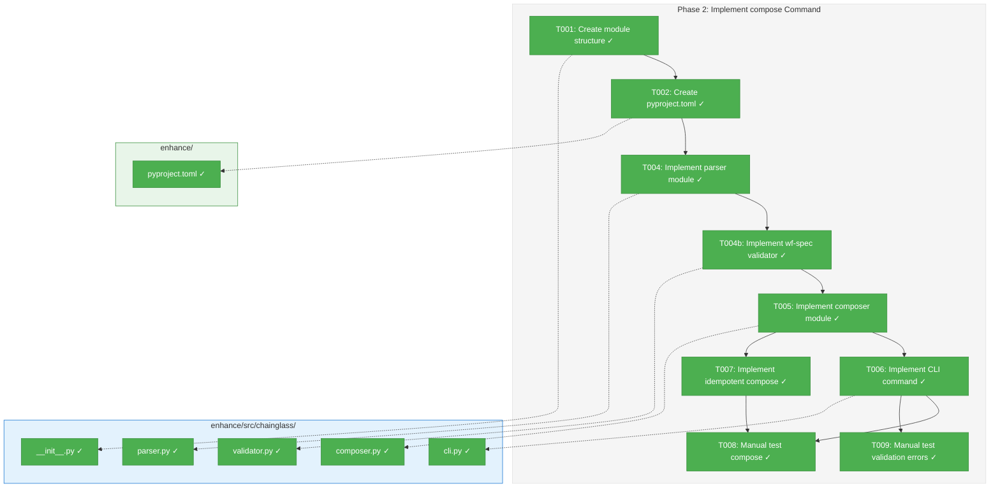
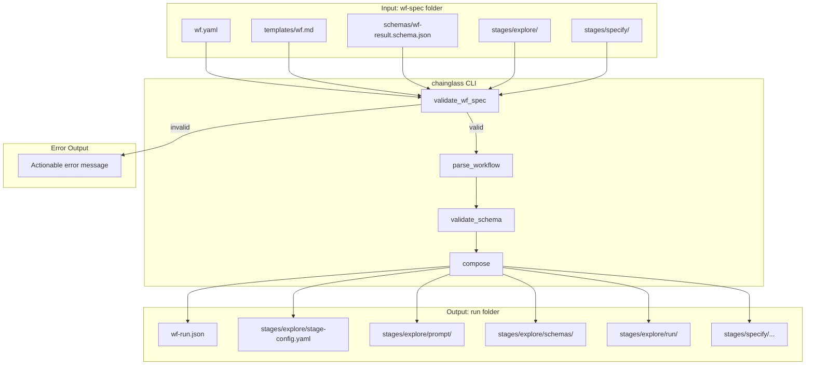
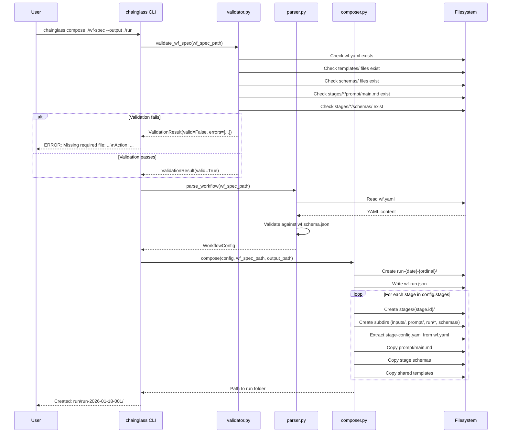

# Phase 2: Implement compose Command – Tasks & Alignment Brief

**Spec**: [../../first-wf-build-spec.md](../../first-wf-build-spec.md)
**Plan**: [../../first-wf-build-plan.md](../../first-wf-build-plan.md)
**Date**: 2026-01-18
**Phase Slug**: phase-2-implement-compose-command

---

## Executive Briefing

### Purpose
This phase creates the `chainglass` CLI tool with its first command: `compose`. The compose command transforms a wf-spec folder (created in Phase 1) into an executable run folder where coding agents can execute workflow stages. This is the foundational command that makes the entire workflow system operational.

### What We're Building
A Python CLI application using typer that provides the `chainglass compose` command:
- **Validates wf-spec folder completeness** before proceeding (all required files exist)
- Loads and validates `wf.yaml` against `wf.schema.json`
- Creates a timestamped run folder with the complete stage structure
- Extracts each stage's configuration from wf.yaml into `stage-config.yaml`
- Copies shared templates (wf.md, wf-result.schema.json) to each stage
- Copies stage-specific prompts and schemas
- Creates empty output directories (output-files/, output-data/, runtime-inputs/)
- Writes `wf-run.json` with run metadata

If validation fails (missing files, invalid schema, etc.), compose exits with an actionable error message explaining what's missing and how to fix it.

### User Value
Coding agents can run `chainglass compose ./wf-spec --output ./run` to create a complete, self-contained run folder. Each stage folder contains everything the agent needs to execute that stage: its configuration, prompts, schemas, input folders, and output directories. No additional setup required.

### Example
**Command**:
```bash
chainglass compose ./wf-spec --output ./run
```

**Before (wf-spec folder from Phase 1)**:
```
wf-spec/
├── wf.yaml                    # All stage definitions here
├── templates/wf.md            # Shared prompt
├── schemas/
│   ├── wf.schema.json
│   └── wf-result.schema.json
└── stages/explore/
    ├── prompt/main.md
    └── schemas/findings.schema.json
```

**After compose (run folder)**:
```
run/run-2026-01-18-001/
├── wf-run.json                # Run metadata
└── stages/explore/
    ├── stage-config.yaml      # EXTRACTED from wf.yaml
    ├── inputs/                # Empty, ready for user input
    ├── prompt/
    │   ├── wf.md              # COPIED from templates/
    │   └── main.md            # COPIED from stages/explore/
    ├── run/
    │   ├── output-files/      # Empty, stage writes here
    │   ├── output-data/       # Empty, stage writes here
    │   └── runtime-inputs/    # Empty, stage writes here
    └── schemas/
        ├── wf-result.schema.json  # COPIED from shared
        └── findings.schema.json   # COPIED from stage
```

---

## Objectives & Scope

### Objective
Implement the chainglass CLI module with the `compose` command per the plan's Phase 2 acceptance criteria and Appendix A.8, A.9, A.10 algorithms.

**Behavior Checklist (from Plan Phase 2 Acceptance Criteria)**:
- [ ] P2-AC-01: `chainglass compose ./wf-spec --output ./run` creates run folder matching A.8
- [ ] P2-AC-02: wf-run.json created with content per A.9
- [ ] P2-AC-03: Shared templates (wf.md, wf-result.schema.json) copied to each stage
- [ ] P2-AC-04: Stage-specific files (stage-config.yaml extracted, main.md, schemas) copied correctly
- [ ] P2-AC-05: Empty output directories created (run/output-files/, run/output-data/, run/runtime-inputs/)
- [ ] P2-AC-06: Compose is idempotent (AC-07 from spec)
- [ ] P2-AC-07: Compose validates wf-spec completeness before proceeding; exits with actionable error if incomplete

### Goals

- ✅ Create chainglass Python module with proper package structure
- ✅ Set up pyproject.toml with typer, PyYAML, jsonschema dependencies
- ✅ Embed wf.schema.json in package for wf.yaml validation
- ✅ Implement YAML parser that validates against schema
- ✅ **Implement wf-spec validator that checks all required files exist**
- ✅ Implement composer module per A.10 algorithm
- ✅ Implement compose CLI command with typer
- ✅ Ensure idempotent compose (running twice = identical output)
- ✅ Manually verify compose output matches A.8 structure

### Non-Goals (Scope Boundaries)

- ❌ Implement `prepare-wf-stage` command — Phase 3
- ❌ Implement `validate` command (stage output validation) — Phase 4
- ❌ Create test fixtures for stage validation — Phase 4
- ❌ Automated tests (pytest) — Manual testing per spec Testing Strategy
- ❌ Support for workflow variables or templating — Out of scope per spec
- ❌ Stage execution — Only folder creation, not execution
- ❌ Cross-platform path handling beyond POSIX — macOS/Linux focus

---

## Architecture Map

### Component Diagram
<!-- Status: grey=pending, orange=in-progress, green=completed, red=blocked -->
<!-- Updated by plan-6 during implementation -->



**Note**: T003 removed - wf.schema.json read from wf-spec/schemas/ at runtime

### Task-to-Component Mapping

<!-- Status: ⬜ Pending | 🟧 In Progress | ✅ Complete | 🔴 Blocked -->

| Task | Component(s) | Files | Status | Comment |
|------|-------------|-------|--------|---------|
| T001 | Package Structure | `__init__.py` | ✅ Complete | Create chainglass Python package |
| T002 | Build Config | `pyproject.toml` | ✅ Complete | Dependencies: typer, PyYAML, jsonschema |
| ~~T003~~ | ~~Schema Embedding~~ | – | ❌ Removed | Schema read from wf-spec/schemas/ at runtime |
| T004 | YAML Parser | `parser.py` | ✅ Complete | Load + validate wf.yaml against wf-spec schema |
| T004b | wf-spec Validator | `validator.py` | ✅ Complete | Two-phase validation (fail-fast + collect-all) |
| T005 | Composer Logic | `composer.py` | ✅ Complete | Core A.10 algorithm implementation |
| T006 | CLI Interface | `cli.py` | ✅ Complete | typer-based compose command |
| T007 | Idempotency | `composer.py` | ✅ Complete | Deterministic output ordering |
| T008 | Verification | Manual test | ✅ Complete | Verify A.8 structure output |
| T009 | Error Verification | Manual test | ✅ Complete | Verify actionable errors on incomplete wf-spec |

---

## Tasks

| Status | ID | Task | CS | Type | Dependencies | Absolute Path(s) | Validation | Subtasks | Notes |
|--------|------|------|----|------|--------------|------------------|------------|----------|-------|
| [x] | T001 | Create chainglass module structure | 1 | Setup | – | `/Users/jordanknight/github/tools/enhance/src/chainglass/__init__.py` | Can `python -c "import chainglass"` after pip install -e | – | Empty __init__.py; creates package (no schemas/ dir needed) |
| [x] | T002 | Create pyproject.toml with dependencies | 2 | Setup | T001 | `/Users/jordanknight/github/tools/enhance/pyproject.toml` | `pip install -e .` succeeds; `chainglass --help` shows version | – | typer[all], PyYAML, jsonschema; entry point for CLI |
| ~~N/A~~ | ~~T003~~ | ~~Copy wf.schema.json to chainglass schemas~~ | – | – | – | – | – | – | **REMOVED**: Schema read from wf-spec/schemas/ at runtime instead |
| [x] | T004 | Implement YAML parser module | 2 | Core | T001 | `/Users/jordanknight/github/tools/enhance/src/chainglass/parser.py` | `parse_workflow(wf_spec_path)` returns dict; validates against wf-spec/schemas/wf.schema.json; raises on invalid | – | PyYAML + jsonschema; reads schema from wf-spec folder |
| [x] | T004b | Implement wf-spec validator module | 2 | Core | T004 | `/Users/jordanknight/github/tools/enhance/src/chainglass/validator.py` | `validate_wf_spec(path)` returns ValidationResult; checks all required files exist; returns actionable errors | – | Pre-compose validation; fail-fast with helpful messages |
| [x] | T005 | Implement composer module | 3 | Core | T004b | `/Users/jordanknight/github/tools/enhance/src/chainglass/composer.py` | `compose(wf_spec, output)` creates run folder per A.10; calls validator first; all dirs/files created | – | Core compose logic; extracts stage-config.yaml |
| [x] | T006 | Implement compose CLI command | 2 | Core | T005 | `/Users/jordanknight/github/tools/enhance/src/chainglass/cli.py` | `chainglass compose --help` works; `chainglass compose ./wf-spec --output ./run` creates folder | – | typer command with WF_SPEC and --output args |
| [x] | T007 | Implement idempotent compose | 1 | Core | T005 | `/Users/jordanknight/github/tools/enhance/src/chainglass/composer.py` | Running compose twice produces identical output (except timestamps in wf-run.json) | – | Deterministic stage ordering; sorted file iteration |
| [x] | T008 | Manual test: compose creates correct structure | 1 | Test | T006, T007 | `/Users/jordanknight/github/tools/enhance/sample/sample_1/wf-spec/` (input), output run folder | Output matches A.8 exactly; all stages present; all files copied | – | Manual verification of compose output |
| [x] | T009 | Manual test: compose fails with actionable errors on incomplete wf-spec | 1 | Test | T006 | Create temp incomplete wf-spec folder | Compose exits with error; message indicates missing files and how to fix | – | Test validation error messages |

---

## Alignment Brief

### Prior Phases Review

#### Phase 1: Prepare wf-spec Folder (Complete)

**A. Deliverables Created**:
| File | Absolute Path | Purpose |
|------|---------------|---------|
| wf.yaml | `/Users/jordanknight/github/tools/enhance/sample/sample_1/wf-spec/wf.yaml` | Single source of truth for workflow (152 lines) |
| wf.schema.json | `/Users/jordanknight/github/tools/enhance/sample/sample_1/wf-spec/schemas/wf.schema.json` | Validates wf.yaml structure |
| wf-result.schema.json | `/Users/jordanknight/github/tools/enhance/sample/sample_1/wf-spec/schemas/wf-result.schema.json` | Shared result schema for all stages |
| templates/wf.md | `/Users/jordanknight/github/tools/enhance/sample/sample_1/wf-spec/templates/wf.md` | Shared bootstrap prompt |
| explore/prompt/main.md | `/Users/jordanknight/github/tools/enhance/sample/sample_1/wf-spec/stages/explore/prompt/main.md` | Explore stage prompt |
| explore/schemas/findings.schema.json | `/Users/jordanknight/github/tools/enhance/sample/sample_1/wf-spec/stages/explore/schemas/findings.schema.json` | Explore findings output schema |
| explore/schemas/explore-metrics.schema.json | `/Users/jordanknight/github/tools/enhance/sample/sample_1/wf-spec/stages/explore/schemas/explore-metrics.schema.json` | Parameter extraction demo |
| explore/schemas/read-files.schema.json | `/Users/jordanknight/github/tools/enhance/sample/sample_1/wf-spec/stages/explore/schemas/read-files.schema.json` | Runtime read tracking |
| specify/prompt/main.md | `/Users/jordanknight/github/tools/enhance/sample/sample_1/wf-spec/stages/specify/prompt/main.md` | Specify stage prompt (transformed from /plan-1b-specify.md) |
| specify/schemas/spec-metadata.schema.json | `/Users/jordanknight/github/tools/enhance/sample/sample_1/wf-spec/stages/specify/schemas/spec-metadata.schema.json` | Specify output schema |
| specify/schemas/read-files.schema.json | `/Users/jordanknight/github/tools/enhance/sample/sample_1/wf-spec/stages/specify/schemas/read-files.schema.json` | Runtime read tracking |

**B. Lessons Learned**:
- wf.yaml must be the **single source of truth** - no separate stage-config files in wf-spec
- Stage IDs use slugs ("explore", "specify") not numbered prefixes ("01-explore")
- Stage-config is **extracted** during compose, written as YAML (not JSON)
- read-files.json replaces manifest.json - focus on reads only (writes tracked by git)

**C. Technical Discoveries**:
- PyYAML not installed by default - use `uv run --with pyyaml` for validation
- jsonschema validation requires `uv run --with jsonschema`
- Stage prompts need "Stage Context" section explaining workflow execution model

**D. Dependencies Exported**:
Phase 1 provides the complete wf-spec folder that Phase 2 will consume:
- **Input**: `/Users/jordanknight/github/tools/enhance/sample/sample_1/wf-spec/`
- **Key files compose must read**: wf.yaml, templates/*, schemas/*, stages/*/prompt/*, stages/*/schemas/*

**E. Critical Findings Applied**:
- Finding 02 (wf.yaml is single source of truth): All stage definitions inline in wf.yaml
- Finding 06 (02-specify transformation): Command infrastructure removed from specify prompt
- Finding 07 (Shared templates): wf.md and wf-result.schema.json in templates/ and schemas/
- Finding 09 (Stage IDs are slugs): Using "explore", "specify" as IDs

**F. Incomplete/Blocked Items**: None - all Phase 1 tasks completed

**G. Test Infrastructure**:
- Manual verification only (per spec Testing Strategy)
- Validation commands in execution.log.md for reference

**H. Technical Debt**: None introduced

**I. Architectural Decisions**:
- stage-config.yaml format (YAML not JSON) - validator will support in Phase 4
- read-files.json naming (replaces manifest.json)
- wf.schema.json in wf-spec/schemas/ for self-documenting wf-spec

**J. Scope Changes**: None

**K. Key Log References**:
- See `execution.log.md` for all task evidence
- wf.yaml validation: Task T004b evidence section

### Critical Findings Affecting This Phase

| # | Finding | Impact on Phase 2 | Tasks Addressing |
|---|---------|-------------------|------------------|
| 01 | **wf.yaml schema undefined** | Must embed wf.schema.json in CLI package for validation | T003, T004 |
| 02 | **wf.yaml is single source of truth** | Compose extracts stage-config.yaml from wf.yaml (not copy) | T005 |
| 03 | **Three-tier output mandatory** | Must create output-files/, output-data/, runtime-inputs/ per stage | T005 |
| 04 | **Absolute paths required (PL-05)** | Use Path.resolve() everywhere; reject relative paths with ".." | T004, T004b, T005 |
| 07 | **Shared templates** | Must copy wf.md + wf-result.schema.json to each stage; validator checks they exist | T004b, T005 |
| 09 | **Stage IDs are slugs** | Stage folder names from id field, not prefixed | T005 |
| 12 | **Idempotent compose (AC-07)** | Deterministic ordering; only timestamps may differ | T007 |
| 13 | **typer for CLI** | Use typer with type hints; auto-generated help | T002, T006 |
| NEW | **Pre-compose validation** | Validate wf-spec completeness before compose; actionable error messages | T004b, T009 |

### ADR Decision Constraints

No ADRs exist for this project yet. N/A.

### Invariants & Guardrails

- **Python Package**: Must be installable via `pip install -e .`
- **CLI Entry Point**: `chainglass` command must be available after install
- **Type Hints**: All functions use type hints per typer best practices
- **Path Safety**: Never use relative paths internally; always resolve to absolute
- **Idempotency**: Running compose twice on same wf-spec produces identical output
- **No Side Effects**: Compose only creates files, never modifies source wf-spec
- **Fail Fast**: Validate wf-spec completeness before any file operations; exit with actionable error if incomplete
- **LLM-Friendly Errors**: Error messages must include: what's wrong, what file is affected, how to fix it

### Inputs to Read

| Input | Location | Purpose |
|-------|----------|---------|
| Plan file | `/Users/jordanknight/github/tools/docs/plans/010-first-wf-build/first-wf-build-plan.md` | A.3, A.8, A.9, A.10 algorithms |
| wf-spec folder | `/Users/jordanknight/github/tools/enhance/sample/sample_1/wf-spec/` | Test input for compose |
| Phase 1 execution log | `/Users/jordanknight/github/tools/docs/plans/010-first-wf-build/tasks/phase-1-prepare-wf-spec-folder/execution.log.md` | Understanding of wf-spec structure |

### Visual Alignment: Compose Flow Diagram



### Visual Alignment: Compose Sequence Diagram



### Test Plan

**Testing Approach**: Manual verification (per spec Testing Strategy - no TDD overhead)

| Test | Type | Method | Expected Result |
|------|------|--------|-----------------|
| Package install | Manual | `pip install -e .` | No errors; chainglass importable |
| CLI help | Manual | `chainglass --help` | Shows compose command |
| Compose help | Manual | `chainglass compose --help` | Shows WF_SPEC and --output args |
| Compose execution | Manual | `chainglass compose ./wf-spec --output ./run` | Creates run folder |
| wf-run.json content | Manual | `cat run/run-*/wf-run.json` | Matches A.9 structure |
| Stage structure | Manual | `ls -R run/run-*/stages/explore/` | Matches A.8 (all subdirs present) |
| stage-config.yaml | Manual | Compare extracted config to wf.yaml section | Stage config extracted correctly |
| Shared templates | Manual | `diff` wf.md in stage vs templates/ | Identical copies |
| Idempotency | Manual | Run compose twice, diff outputs | Only wf-run.json timestamps differ |
| Missing wf.yaml | Manual | Create empty folder, run compose | Error: "Missing required file: wf.yaml" |
| Missing stage prompt | Manual | Delete stages/explore/prompt/main.md, run compose | Error with actionable message |
| Invalid wf.yaml | Manual | Create wf.yaml with missing required field | Error with schema validation message |

**Mock Usage**: N/A (manual testing only per spec)

### Step-by-Step Implementation Outline

1. **T001**: Create package structure
   - Create `/Users/jordanknight/github/tools/enhance/src/chainglass/__init__.py`
   - Add `__version__ = "0.1.0"` to __init__.py
   - No schemas/ directory needed (schema read from wf-spec at runtime)

2. **T002**: Create pyproject.toml
   - Project name: `chainglass`
   - Dependencies: `typer[all]`, `pyyaml`, `jsonschema`
   - Entry point: `chainglass = chainglass.cli:app`
   - Python requires: `>=3.10`

3. ~~**T003**: REMOVED~~ - Schema read from wf-spec/schemas/ at runtime

4. **T004**: Implement parser.py
   - `parse_workflow(wf_spec_path: Path) -> dict`: Load wf.yaml, validate against wf-spec/schemas/wf.schema.json, return
   - Schema path: `wf_spec_path / "schemas" / "wf.schema.json"`
   - Raise `ValueError` on validation failure with actionable message

4b. **T004b**: Implement validator.py
   - `validate_wf_spec(wf_spec_path: Path) -> ValidationResult`: Check wf-spec completeness
   - **Two-Phase Validation** (A+C hybrid pattern):
     - **Phase 1 (Fail-Fast)**: YAML structure validation - exit early if broken
       1. wf.yaml exists
       2. wf.yaml is valid YAML syntax
       3. wf.yaml validates against wf.schema.json
     - **Phase 2 (Collect-All)**: File existence checks - collect ALL errors
       4. All shared templates exist (templates/wf.md)
       5. All shared schemas exist (schemas/wf-result.schema.json)
       6. For each stage in wf.yaml:
          - `stages/{stage.id}/prompt/main.md` exists
          - All schemas referenced in stage exist
   - **Rationale**: Phase 1 must fail-fast because you can't check stage files without valid wf.yaml. Phase 2 collects all errors so users see the complete picture in one run.
   - **Return format**:
     ```python
     @dataclass
     class ValidationResult:
         valid: bool
         errors: list[str]  # Actionable error messages
         warnings: list[str]  # Non-blocking issues
     ```
   - **Error message format** (LLM-friendly):
     ```
     ERROR: Missing required file: stages/explore/prompt/main.md
     Action: Create this file with the stage prompt content.
     See: wf-spec/stages/explore/prompt/main.md in a working wf-spec folder.
     ```

5. **T005**: Implement composer.py per A.10 algorithm
   ```python
   def compose(wf_spec_path: Path, output_path: Path) -> Path:
       # 0. VALIDATE wf-spec folder completeness (calls validator.validate_wf_spec)
       #    - If invalid, raise CompositionError with actionable errors
       # 1. Load and validate wf.yaml
       # 2. Create run folder: output_path/run-{date}-{ordinal}/
       # 3. Write wf-run.json
       # 4. For each stage:
       #    a. Create stage folder and subdirs
       #    b. Extract stage-config.yaml
       #    c. Copy prompt/main.md
       #    d. Copy stage schemas
       #    e. Copy shared templates
       # 5. Return run folder path
   ```

6. **T006**: Implement cli.py with typer
   ```python
   import typer
   app = typer.Typer()

   @app.command()
   def compose(
       wf_spec: Path = typer.Argument(..., help="Path to wf-spec folder"),
       output: Path = typer.Option(..., "--output", "-o", help="Output directory")
   ) -> None:
       # Call composer.compose()
       # Print result path
   ```

7. **T007**: Ensure idempotent compose
   - Sort stage iteration by id
   - Sort file iteration within each directory
   - Use consistent datetime format for wf-run.json

8. **T008**: Manual verification
   - Run compose on sample wf-spec
   - Verify all A.8 structure elements
   - Test idempotency by running twice

9. **T009**: Test validation error handling
   - Create incomplete wf-spec (missing files)
   - Run compose, verify actionable error messages
   - Verify exit code is non-zero

### Commands to Run

```bash
# Environment setup
cd /Users/jordanknight/github/tools/enhance

# T001-T002: Create structure and install
mkdir -p src/chainglass/schemas
pip install -e .

# Verify installation
python -c "import chainglass; print(chainglass.__version__)"
chainglass --help

# T003: Verify schema
python -c "import json; json.load(open('src/chainglass/schemas/wf.schema.json')); print('Schema OK')"

# T004: Test parser
python -c "
from chainglass.parser import parse_workflow
from pathlib import Path
wf = parse_workflow(Path('sample/sample_1/wf-spec'))
print(f'Loaded workflow: {wf[\"metadata\"][\"name\"]}')
print(f'Stages: {[s[\"id\"] for s in wf[\"stages\"]]}')
"

# T006-T008: Test compose
chainglass compose ./sample/sample_1/wf-spec --output ./sample/sample_1/runs

# Verify output structure
ls -R ./sample/sample_1/runs/run-*/

# Verify wf-run.json
cat ./sample/sample_1/runs/run-*/wf-run.json | python -m json.tool

# Verify stage-config.yaml extraction
cat ./sample/sample_1/runs/run-*/stages/explore/stage-config.yaml

# Verify shared templates copied
diff ./sample/sample_1/wf-spec/templates/wf.md ./sample/sample_1/runs/run-*/stages/explore/prompt/wf.md

# Test idempotency
chainglass compose ./sample/sample_1/wf-spec --output ./sample/sample_1/runs
# Compare two run folders (only wf-run.json timestamps should differ)

# T009: Test validation error handling
# Create incomplete wf-spec (missing wf.yaml)
mkdir -p /tmp/incomplete-wf-spec
chainglass compose /tmp/incomplete-wf-spec --output /tmp/test-run
# Expected: Error message about missing wf.yaml

# Create wf-spec with missing stage prompt
mkdir -p /tmp/broken-wf-spec/templates /tmp/broken-wf-spec/schemas /tmp/broken-wf-spec/stages/explore/schemas
cp ./sample/sample_1/wf-spec/wf.yaml /tmp/broken-wf-spec/
cp ./sample/sample_1/wf-spec/templates/* /tmp/broken-wf-spec/templates/
cp ./sample/sample_1/wf-spec/schemas/* /tmp/broken-wf-spec/schemas/
# Deliberately skip copying stages/explore/prompt/main.md
chainglass compose /tmp/broken-wf-spec --output /tmp/test-run
# Expected: Error message about missing stages/explore/prompt/main.md with actionable fix

# Cleanup
rm -rf /tmp/incomplete-wf-spec /tmp/broken-wf-spec /tmp/test-run
```

### Risks & Unknowns

| Risk | Severity | Mitigation |
|------|----------|------------|
| pyproject.toml entry point syntax | Low | Follow typer documentation example |
| importlib.resources API differences | Medium | Use `importlib.resources.files()` (Python 3.9+) |
| Run folder ordinal collision | Low | Increment ordinal until unique |
| YAML dump format differences | Low | Use default_flow_style=False for readable output |

### Ready Check

- [x] Phase 1 deliverables verified (wf-spec folder complete)
- [x] Plan Appendix A.8, A.9, A.10 read and understood
- [x] typer CLI framework understood
- [x] Python packaging with pyproject.toml understood
- [ ] ADR constraints mapped to tasks (IDs noted in Notes column) - **N/A** (no ADRs exist)

---

## Phase Footnote Stubs

| Footnote | Task | Change Description | Date |
|----------|------|-------------------|------|
| | | | |

_Populated by plan-6 during implementation._

---

## Evidence Artifacts

**Execution Log Location**: `./execution.log.md`

Implementation will record:
- Package installation output
- CLI help output
- Compose execution output
- Directory structure verification
- File content verification
- Idempotency test results

---

## Discoveries & Learnings

_Populated during implementation by plan-6. Log anything of interest to your future self._

| Date | Task | Type | Discovery | Resolution | References |
|------|------|------|-----------|------------|------------|
| | | | | | |

**Types**: `gotcha` | `research-needed` | `unexpected-behavior` | `workaround` | `decision` | `debt` | `insight`

**What to log**:
- Things that didn't work as expected
- External research that was required
- Implementation troubles and how they were resolved
- Gotchas and edge cases discovered
- Decisions made during implementation
- Technical debt introduced (and why)
- Insights that future phases should know about

_See also: `execution.log.md` for detailed narrative._

---

## Directory Layout

```
docs/plans/010-first-wf-build/
├── first-wf-build-spec.md
├── first-wf-build-plan.md
├── research-dossier.md
└── tasks/
    ├── phase-1-prepare-wf-spec-folder/
    │   ├── tasks.md
    │   └── execution.log.md
    └── phase-2-implement-compose-command/
        ├── tasks.md              # This file
        └── execution.log.md      # Created by /plan-6
```

---

## Critical Insights Discussion

**Session**: 2026-01-18
**Context**: Phase 2 Tasks Dossier - Implement compose Command
**Analyst**: AI Clarity Agent
**Reviewer**: Development Team
**Format**: Water Cooler Conversation (5 Critical Insights)

### Insight 1: The Validation Chicken-and-Egg Problem

**Did you know**: The validator must parse wf.yaml before it can check if the stage files wf.yaml references actually exist, creating a two-phase validation requirement.

**Implications**:
- Can't just check "does wf.yaml exist" and continue
- wf.yaml might be invalid YAML, fail schema, or reference non-existent stages
- Need to parse wf.yaml to know which stage folders to validate

**Options Considered**:
- Option A: Two-phase validation (structure first, then files)
- Option B: Fail-fast on first error
- Option C: Collect all errors before reporting

**AI Recommendation**: Option A + C Hybrid
- Reasoning: Phase 1 must fail-fast (can't continue without valid wf.yaml), Phase 2 should collect all missing file errors for comprehensive feedback.

**Decision**: **A + C Hybrid** - Two-phase validation with error collection in Phase 2

**Action Items**: None - already aligned with T004b spec (updated in document)

**Affects**: T004b (validator.py), T009 (validation error testing)

---

### Insight 2: Idempotency Doesn't Mean Overwrite

**Did you know**: The "idempotent compose" requirement means deterministic output structure, not overwriting the same folder. Each compose creates a new `run-{date}-{ordinal}` folder.

**Implications**:
- Running compose twice creates two folders with identical internal structure
- The idempotency test verifies structure equality, not path equality
- wf-run.json timestamps always differ between runs

**Options Considered**:
- Option A: Create new folder each time (ordinal increment)
- Option B: Add --force flag to overwrite
- Option C: Skip if content identical

**AI Recommendation**: Option A
- Reasoning: Matches plan spec, provides audit trail, no data loss risk, matches existing `create_run.py` pattern.

**Decision**: **Option A** - Create new run folder each time

**Action Items**: None - already aligned with A.10 algorithm

**Affects**: T007 (idempotency), T008 (test verification)

---

### Insight 3: Schema Embedding Requires Careful Package Structure

**Did you know**: Embedding wf.schema.json in the Python package requires specific pyproject.toml configuration and package structure to work with `importlib.resources`.

**Options Considered**:
- Option A: importlib.resources.files() (plan requirement)
- Option B: pkg_resources (deprecated)
- Option C: Path(__file__) pattern
- **Option D (User Choice)**: Read from wf-spec/schemas/ at runtime

**AI Recommendation**: Option A (per plan)

**Decision**: **Option D** - Read schema from wf-spec/schemas/wf.schema.json at runtime (user override)

**Action Items**:
- [x] Remove T003 from tasks (no longer needed)
- [x] Update T004 to read schema from wf-spec path
- [x] Update T001 to remove schemas/ directory from package structure
- [x] Update Mermaid diagram and Task-to-Component Mapping

**Affects**: T001, T003 (removed), T004, T004b

---

### Insight 4: YAML Extraction Needs Sort Keys Control

**Did you know**: PyYAML's default `yaml.dump()` alphabetically sorts dictionary keys, making extracted stage-config.yaml harder to read (id and name buried in middle instead of at top).

**Implications**:
- Default sorting puts `description` before `id`
- LLMs and humans expect logical field ordering
- Python 3.7+ preserves dict insertion order

**Options Considered**:
- Option A: PyYAML with sort_keys=False
- Option B: ruamel.yaml for round-trip (no codebase precedent)
- Option C: Custom YAML Dumper (overkill)

**AI Recommendation**: Option A
- Reasoning: Simple, no new deps, preserves logical ordering.

**Decision**: **Option A** - Use `yaml.dump(config, default_flow_style=False, sort_keys=False)`

**Action Items**: None - implementation detail for T005

**Affects**: T005 (composer.py)

---

### Insight 5: Shared Templates Get Copied N Times

**Did you know**: The compose algorithm copies wf.md and wf-result.schema.json to every stage folder. With 2 stages, that's 4 copies of shared files.

**Implications**:
- Disk usage scales with stage count × template count
- Existing run folders become stale if templates updated in wf-spec
- Each stage is fully self-contained (good for LLM context)

**Options Considered**:
- Option A: Copy files (current plan)
- Option B: Use symlinks (FlowSpace has follow_symlinks: false)
- Option C: Shared folder with relative refs (changes LLM expectations)

**AI Recommendation**: Option A
- Reasoning: Self-contained stages, simple, can optimize later if needed.

**Decision**: **Option A** - Copy files as planned; optimize later if needed

**Action Items**: None - already specified in plan

**Affects**: T005 (composer.py)

---

## Session Summary

**Insights Surfaced**: 5 critical insights identified and discussed
**Decisions Made**: 5 decisions reached through collaborative discussion
**Action Items Created**: 4 document updates completed (all for Insight 3)
**Areas Updated**:
- T003 removed from tasks table
- T004 dependency and description updated
- Mermaid diagram updated
- Task-to-Component Mapping updated
- Step-by-Step Implementation Outline updated
- T004b now documents Two-Phase Validation pattern

**Shared Understanding Achieved**: ✓

**Confidence Level**: High - All decisions align with plan intent or are explicit user overrides

**Next Steps**:
Run `/plan-6-implement-phase --phase 2` when ready to begin implementation

---

**STOP**: Do **not** edit code. Awaiting human **GO** to proceed with implementation.
