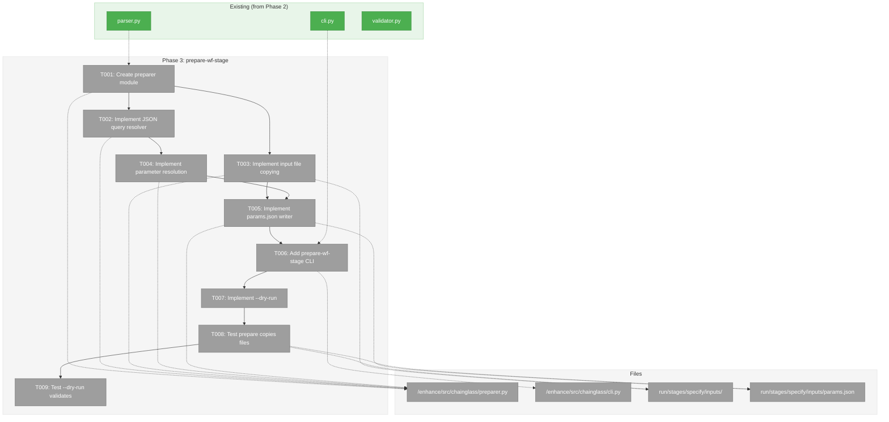
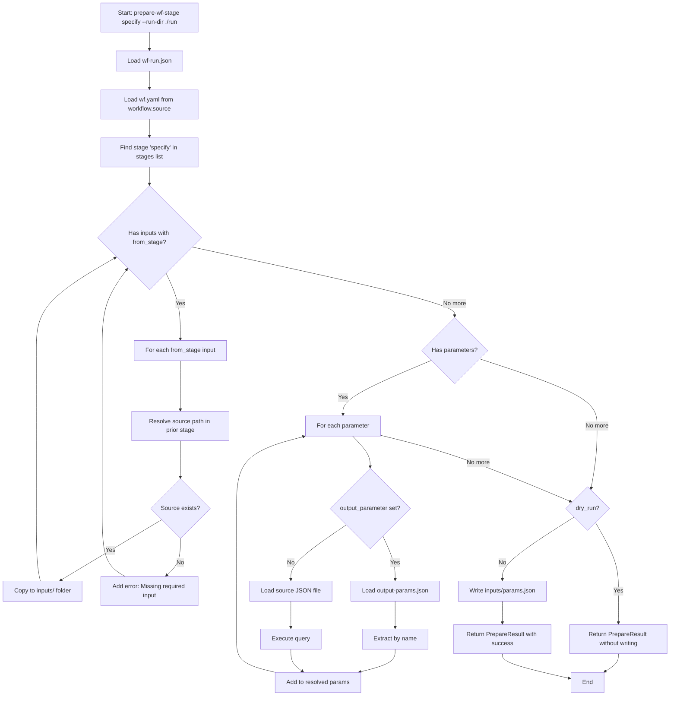
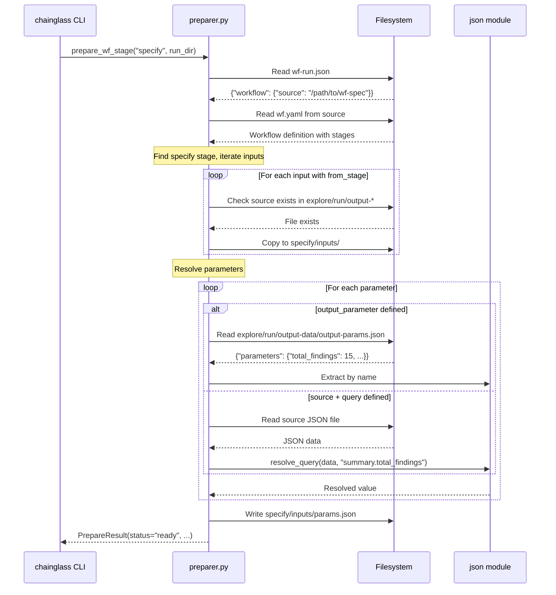

# Phase 3: Implement prepare-wf-stage Command – Tasks & Alignment Brief

**Spec**: [../first-wf-build-spec.md](../first-wf-build-spec.md)
**Plan**: [../first-wf-build-plan.md](../first-wf-build-plan.md)
**Date**: 2026-01-18
**Phase Slug**: `phase-3-implement-prepare-wf-stage-command`

---

## Executive Briefing

### Purpose
This phase implements the `prepare-wf-stage` command that bridges stages in a multi-stage workflow. Without this, the specify stage cannot access outputs from the explore stage, breaking the workflow pipeline.

### What We're Building
A `chainglass prepare-wf-stage` CLI command that:
- Copies input files from prior stage outputs to current stage inputs folder
- Resolves parameters by querying prior stage JSON outputs (using dot notation and array indexing)
- Writes resolved parameters to `inputs/params.json` for consumption by the stage prompt
- Supports `--dry-run` for validation without file writes

### User Value
Workflow stages can be executed independently while maintaining data flow contracts. An LLM agent running the `specify` stage gets all required inputs from `explore` automatically copied and parameters resolved without manual intervention.

### Example

**Before (explore stage complete):**
```
run/run-2026-01-18-001/stages/
├── explore/
│   └── run/output-data/
│       ├── explore-metrics.json    ← Contains parameters to extract
│       ├── output-params.json      ← Published parameters
│       └── findings.json           ← Required by specify
└── specify/
    └── inputs/                     ← Empty, needs files from explore
```

**Command:**
```bash
chainglass prepare-wf-stage specify --run-dir ./run/run-2026-01-18-001
```

**After:**
```
run/run-2026-01-18-001/stages/specify/inputs/
├── research-dossier.md           ← Copied from explore/run/output-files/
├── findings.json                 ← Copied from explore/run/output-data/
└── params.json                   ← Resolved parameters: {total_findings: 15, ...}
```

---

## Objectives & Scope

### Objective
Implement the `prepare-wf-stage` command as specified in plan Appendix A.11, enabling inter-stage dependency resolution for the explore → specify workflow.

### Goals

- ✅ Create `chainglass prepare-wf-stage <stage_id> --run-dir <path>` command
- ✅ Copy inputs with `from_stage` from prior stage output folders
- ✅ Resolve parameters via `output_parameter` name lookup (preferred)
- ✅ Resolve parameters via `source` + `query` direct JSON path (fallback)
- ✅ Support dot notation (`summary.total_findings`) and array indexing (`components[0].name`)
- ✅ Write resolved parameters to `inputs/params.json`
- ✅ Support `--dry-run` to validate without writing
- ✅ Provide actionable errors when source files/parameters missing

### Non-Goals (Scope Boundaries)

- ❌ Automatic stage execution (this is preparation only, not running the stage)
- ❌ Circular dependency detection (workflow is strictly sequential: explore → specify)
- ❌ Parameter type coercion (values extracted as-is from JSON)
- ❌ Complex JSONPath expressions (only dot notation and single-level array indexing)
- ❌ Updating wf-run.json status (that's the validate command's responsibility)
- ❌ Validating stage outputs (Phase 4 scope)
- ❌ Creating the stage folder structure (already done by compose)

---

## Architecture Map

### Component Diagram
<!-- Status: grey=pending, orange=in-progress, green=completed, red=blocked -->
<!-- Updated by plan-6 during implementation -->



### Task-to-Component Mapping

<!-- Status: ⬜ Pending | 🟧 In Progress | ✅ Complete | 🔴 Blocked -->

| Task | Component(s) | Files | Status | Comment |
|------|-------------|-------|--------|---------|
| T001 | PrepareResult dataclass, preparer module structure | `/Users/jordanknight/github/tools/enhance/src/chainglass/preparer.py` | ⬜ Pending | Module skeleton with dataclass, exception, entry function |
| T002 | JSON query resolver | `/Users/jordanknight/github/tools/enhance/src/chainglass/preparer.py` | ⬜ Pending | Implement `resolve_query(data, query)` for dot notation + array indexing |
| T003 | Input file copying logic | `/Users/jordanknight/github/tools/enhance/src/chainglass/preparer.py` | ⬜ Pending | Copy files with `from_stage` to stage inputs folder |
| T004 | Parameter resolution logic | `/Users/jordanknight/github/tools/enhance/src/chainglass/preparer.py` | ⬜ Pending | Resolve via output_parameter or source+query |
| T005 | params.json writer | `/Users/jordanknight/github/tools/enhance/src/chainglass/preparer.py` | ⬜ Pending | Write resolved parameters to inputs/params.json |
| T006 | CLI command registration | `/Users/jordanknight/github/tools/enhance/src/chainglass/cli.py` | ⬜ Pending | Add `prepare-wf-stage` typer command |
| T007 | --dry-run implementation | `/Users/jordanknight/github/tools/enhance/src/chainglass/preparer.py` | ⬜ Pending | Validate without copying/writing |
| T008 | Manual test: copies and resolves | Test fixture | ⬜ Pending | End-to-end test with sample run folder |
| T009 | Manual test: --dry-run validates | Test fixture | ⬜ Pending | Verify no writes in dry-run mode |

---

## Tasks

| Status | ID | Task | CS | Type | Dependencies | Absolute Path(s) | Validation | Subtasks | Notes |
|--------|------|------|-----|------|--------------|------------------|------------|----------|-------|
| [ ] | T001 | Create preparer module with PrepareResult dataclass and entry function | 2 | Core | Phase 2 | `/Users/jordanknight/github/tools/enhance/src/chainglass/preparer.py` | `from chainglass.preparer import prepare_wf_stage` imports | – | Follow A.11 algorithm signature |
| [ ] | T002 | Implement JSON query resolver with dot notation and array indexing | 2 | Core | T001 | `/Users/jordanknight/github/tools/enhance/src/chainglass/preparer.py` | `resolve_query({"a": {"b": [1]}}, "a.b[0]")` returns `1` | – | Support `summary.total` and `items[0].name` patterns |
| [ ] | T003 | Implement input file copying from prior stage outputs | 2 | Core | T001 | `/Users/jordanknight/github/tools/enhance/src/chainglass/preparer.py` | Files with `from_stage` copied to inputs folder | – | Read from `stage-config.yaml` inputs section |
| [ ] | T004 | Implement parameter resolution via output_parameter or source+query | 2 | Core | T002 | `/Users/jordanknight/github/tools/enhance/src/chainglass/preparer.py` | Parameters resolved from output-params.json or direct JSON query | – | Prefer output_parameter when available |
| [ ] | T005 | Implement params.json writer with resolved parameters | 1 | Core | T003, T004 | `/Users/jordanknight/github/tools/enhance/src/chainglass/preparer.py` | `inputs/params.json` contains all resolved parameters | – | JSON format per A.11 |
| [ ] | T006 | Add prepare-wf-stage CLI command with typer | 2 | Core | T005 | `/Users/jordanknight/github/tools/enhance/src/chainglass/cli.py` | `chainglass prepare-wf-stage --help` works | – | Follow existing cli.py patterns |
| [ ] | T007 | Implement --dry-run validation without writing | 1 | Core | T006 | `/Users/jordanknight/github/tools/enhance/src/chainglass/preparer.py` | --dry-run returns status without modifying filesystem | – | Validate all sources accessible |
| [ ] | T008 | Manual test: prepare copies files and resolves params | 1 | Test | T006 | `/Users/jordanknight/github/tools/enhance/sample/sample_1/runs/` | Files copied, params.json written, output matches A.11 | – | Test with existing run folder |
| [ ] | T009 | Manual test: --dry-run validates without writing | 1 | Test | T007 | `/Users/jordanknight/github/tools/enhance/sample/sample_1/runs/` | Returns "ready" status, no files written | – | Verify filesystem unchanged |

---

## Alignment Brief

### Prior Phases Review

#### Phase 1 → Phase 2 → Phase 3 Evolution

**Phase 1 (Prepare wf-spec Folder)** established the foundation:
- Created the `wf-spec` folder structure with wf.yaml as single source of truth
- Defined stage inputs/outputs contracts in wf.yaml (lines 306-460)
- Created explore-metrics.schema.json for parameter extraction demo
- **Key export for Phase 3**: The `parameters` section in wf.yaml (lines 391-408) defines what specify needs from explore

**Phase 2 (Implement compose Command)** built the CLI infrastructure:
- Created chainglass Python package with typer CLI
- Established two-phase validation pattern (fail-fast + collect-all)
- Implemented compose algorithm that extracts stage-config.yaml
- **Key export for Phase 3**:
  - `parser.py:parse_workflow()` - Load wf.yaml
  - `validator.py:validate_wf_spec()` - Two-phase validation pattern
  - `cli.py` - Typer CLI patterns to follow
  - `composer.py` - Path resolution patterns

#### Cumulative Deliverables (organized by phase)

| Phase | Files Created | APIs Exported |
|-------|---------------|---------------|
| Phase 1 | `wf-spec/wf.yaml`, `wf-spec/schemas/*.json`, `wf-spec/stages/*/prompt/main.md` | Stage input/output contracts |
| Phase 2 | `enhance/src/chainglass/__init__.py`, `parser.py`, `validator.py`, `composer.py`, `cli.py`, `pyproject.toml` | `parse_workflow()`, `validate_wf_spec()`, `ValidationResult`, typer app |

#### Dependencies from Prior Phases

Phase 3 depends on:

1. **From Phase 1**:
   - wf.yaml `parameters` section defining from_stage + output_parameter references
   - Stage input definitions with `from_stage` and `source` fields
   - output_parameters in explore stage defining published values

2. **From Phase 2**:
   - `parse_workflow()` to load wf.yaml from wf-run.json source path
   - `ValidationResult` dataclass pattern for PrepareResult
   - typer command pattern from cli.py
   - Path resolution pattern: `Path(...).resolve()`

#### Lessons Learned from Prior Phases

1. **Two-Phase Validation Works**: Phase 2's fail-fast + collect-all pattern prevented cascading errors. Apply same pattern in preparer: fail fast if wf-run.json missing, then collect all missing input/parameter errors.

2. **Deterministic Ordering**: Phase 2 sorted stages/files for idempotency. Preparer should process parameters in defined order.

3. **Actionable Errors**: Phase 2's "Action:" guidance in error messages was effective. Continue pattern for missing inputs/parameters.

4. **No Embedded Schemas**: Phase 2 reads wf.schema.json from wf-spec at runtime. Preparer reads stage-config.yaml from run folder.

#### Reusable Test Infrastructure

Phase 2 manual testing approach:
- Sample wf-spec at `/Users/jordanknight/github/tools/enhance/sample/sample_1/wf-spec/`
- Run folders at `/Users/jordanknight/github/tools/enhance/sample/sample_1/runs/`

For Phase 3 testing, need explore stage outputs in a run folder:
- `run/output-files/research-dossier.md`
- `run/output-data/findings.json`
- `run/output-data/explore-metrics.json`
- `run/output-data/output-params.json`

---

### Critical Findings Affecting This Phase

| Finding | Impact | How Addressed |
|---------|--------|---------------|
| **#05**: prepare-wf-stage for stage inputs | Defines entire command scope | Tasks T001-T009 implement A.11 algorithm |
| **#04**: Absolute paths required | Path resolution in preparer | T001 uses `Path.resolve()` everywhere |
| **#03**: Three-tier output mandatory | Input copying from correct tier | T003 handles output-files/ vs output-data/ |
| **#10**: Multiple outputs required | Parameter extraction from multiple files | T004 supports querying any JSON output |

---

### Invariants & Guardrails

1. **Never modify source files**: Only copy from prior stage, never modify explore's outputs
2. **Fail if source missing**: Error with actionable message if required input unavailable
3. **Preserve JSON types**: Extracted parameter values maintain their JSON types (number, string, array, object)
4. **Idempotent operation**: Running prepare twice produces same result
5. **No circular dependencies**: Only look backward to prior stages (enforced by wf.yaml order)

---

### Inputs to Read

| File | Purpose | Read by Task |
|------|---------|--------------|
| `run/wf-run.json` | Get workflow source path | T001 |
| `wf-spec/wf.yaml` | Get full workflow definition | T001 |
| `run/stages/{stage_id}/stage-config.yaml` | Get stage inputs/parameters | T003, T004 |
| `run/stages/{from_stage}/run/output-data/output-params.json` | Get published parameters | T004 |
| `run/stages/{from_stage}/run/output-data/*.json` | Direct JSON query source | T004 |
| `run/stages/{from_stage}/run/output-files/*` | Files to copy as inputs | T003 |

---

### Visual Alignment Aids

#### Flow Diagram: prepare-wf-stage Execution



#### Sequence Diagram: Parameter Resolution



---

### Test Plan (Manual Testing per Spec)

| Test | Fixture | Steps | Expected Result |
|------|---------|-------|-----------------|
| **T008: Full prepare** | Run folder with completed explore stage | `chainglass prepare-wf-stage specify --run-dir ./run/run-2026-01-18-001` | Files copied to inputs/, params.json written, exit 0 |
| **T009: Dry-run** | Same fixture | `chainglass prepare-wf-stage specify --run-dir ./run/run-2026-01-18-001 --dry-run` | Status "ready" printed, no files written |
| **Blocked test** | Run folder without explore outputs | `chainglass prepare-wf-stage specify --run-dir ./run/run-empty` | Status "blocked", actionable error, exit 1 |

#### Fixture Preparation

To test Phase 3, create mock explore outputs in an existing run folder:

```bash
# Create mock explore outputs for testing
RUN_DIR=enhance/sample/sample_1/runs/run-2026-01-18-002
mkdir -p $RUN_DIR/stages/explore/run/output-files
mkdir -p $RUN_DIR/stages/explore/run/output-data

# Mock research dossier
echo "# Research Dossier\n\nTest content" > $RUN_DIR/stages/explore/run/output-files/research-dossier.md

# Mock findings.json
echo '{"findings": [{"id": 1, "title": "Test finding"}]}' > $RUN_DIR/stages/explore/run/output-data/findings.json

# Mock explore-metrics.json (for parameter extraction)
cat > $RUN_DIR/stages/explore/run/output-data/explore-metrics.json << 'EOF'
{
  "summary": {"total_findings": 15, "by_impact": {"critical": 2, "high": 5}},
  "components": [{"name": "auth/session.py", "findings_count": 5}],
  "recommendations": {"complexity": {"suggested_score": "CS-3"}}
}
EOF

# Mock output-params.json (published by validate command, but mock for testing)
cat > $RUN_DIR/stages/explore/run/output-data/output-params.json << 'EOF'
{
  "stage_id": "explore",
  "published_at": "2026-01-18T12:00:00Z",
  "parameters": {
    "total_findings": 15,
    "critical_count": 2,
    "top_component": "auth/session.py",
    "complexity_score": "CS-3"
  }
}
EOF
```

---

### Step-by-Step Implementation Outline

| Step | Task | Implementation |
|------|------|----------------|
| 1 | T001 | Create `preparer.py` with `PrepareResult` dataclass and `prepare_wf_stage()` entry function |
| 2 | T002 | Add `resolve_query(data, query)` function to handle `a.b.c` and `arr[0].field` patterns |
| 3 | T003 | Add input copying logic: read stage-config.yaml, find from_stage inputs, copy files |
| 4 | T004 | Add parameter resolution: check output_parameter first, fallback to source+query |
| 5 | T005 | Add params.json writer: JSON dump resolved parameters to inputs/params.json |
| 6 | T006 | Add CLI command: `@app.command()` with stage_id argument, --run-dir and --dry-run options |
| 7 | T007 | Add dry_run flag handling: skip copy/write operations, still collect all errors |
| 8 | T008 | Run full test with mock fixture, verify files and params.json content |
| 9 | T009 | Run dry-run test, verify no file changes, status printed |

---

### Commands to Run

```bash
# Navigate to package directory
cd /Users/jordanknight/github/tools/enhance

# Verify package still works
uv run chainglass --version

# Test prepare-wf-stage help (after T006)
uv run chainglass prepare-wf-stage --help

# Create test fixture (before T008)
RUN_DIR=sample/sample_1/runs/run-2026-01-18-002
# ... see fixture preparation above

# Full prepare test (T008)
uv run chainglass prepare-wf-stage specify --run-dir ./sample/sample_1/runs/run-2026-01-18-002

# Dry-run test (T009)
uv run chainglass prepare-wf-stage specify --run-dir ./sample/sample_1/runs/run-2026-01-18-002 --dry-run

# Verify params.json content
cat ./sample/sample_1/runs/run-2026-01-18-002/stages/specify/inputs/params.json

# Verify files copied
ls -la ./sample/sample_1/runs/run-2026-01-18-002/stages/specify/inputs/
```

---

### Risks & Unknowns

| Risk | Severity | Mitigation |
|------|----------|------------|
| JSON query edge cases (nested arrays, missing keys) | Medium | Use defensive coding with clear error messages; test with known fixture |
| output-params.json not yet written by explore | Medium | Create mock fixture for testing; real validation in Phase 4 |
| wf-run.json source path might be relative | Low | Always resolve to absolute via `Path.resolve()` |

---

### Ready Check

- [ ] Plan A.11 algorithm understood (prepare_wf_stage signature and flow)
- [ ] Prior phase deliverables available (cli.py, parser.py patterns)
- [ ] Test fixture can be created (mock explore outputs)
- [ ] Phase 2 run folder exists for testing (`enhance/sample/sample_1/runs/run-2026-01-18-002`)
- [ ] No blocking dependencies (Phase 2 complete)

**Await explicit GO/NO-GO before implementation.**

---

## Phase Footnote Stubs

_Footnotes will be added by plan-6 during implementation. Leave empty until execution._

| Footnote | Task | Node ID | Notes |
|----------|------|---------|-------|
| | | | |

---

## Evidence Artifacts

Implementation evidence will be written to:

- **Execution Log**: `phase-3-implement-prepare-wf-stage-command/execution.log.md`
- **Test Output**: Console output from manual tests
- **Created Files**:
  - `/Users/jordanknight/github/tools/enhance/src/chainglass/preparer.py`
  - Modified: `/Users/jordanknight/github/tools/enhance/src/chainglass/cli.py`

---

## Discoveries & Learnings

_Populated during implementation by plan-6. Log anything of interest to your future self._

| Date | Task | Type | Discovery | Resolution | References |
|------|------|------|-----------|------------|------------|
| | | | | | |

**Types**: `gotcha` | `research-needed` | `unexpected-behavior` | `workaround` | `decision` | `debt` | `insight`

**What to log**:
- Things that didn't work as expected
- External research that was required
- Implementation troubles and how they were resolved
- Gotchas and edge cases discovered
- Decisions made during implementation
- Technical debt introduced (and why)
- Insights that future phases should know about

_See also: `execution.log.md` for detailed narrative._

---

## Directory Layout

```
docs/plans/010-first-wf-build/
├── first-wf-build-plan.md
├── first-wf-build-spec.md
├── research-dossier.md
└── tasks/
    ├── phase-1-prepare-wf-spec-folder/
    │   ├── tasks.md
    │   └── execution.log.md
    ├── phase-2-implement-compose-command/
    │   ├── tasks.md
    │   └── execution.log.md
    └── phase-3-implement-prepare-wf-stage-command/
        ├── tasks.md              ← This file
        └── execution.log.md      ← Created by /plan-6
```
