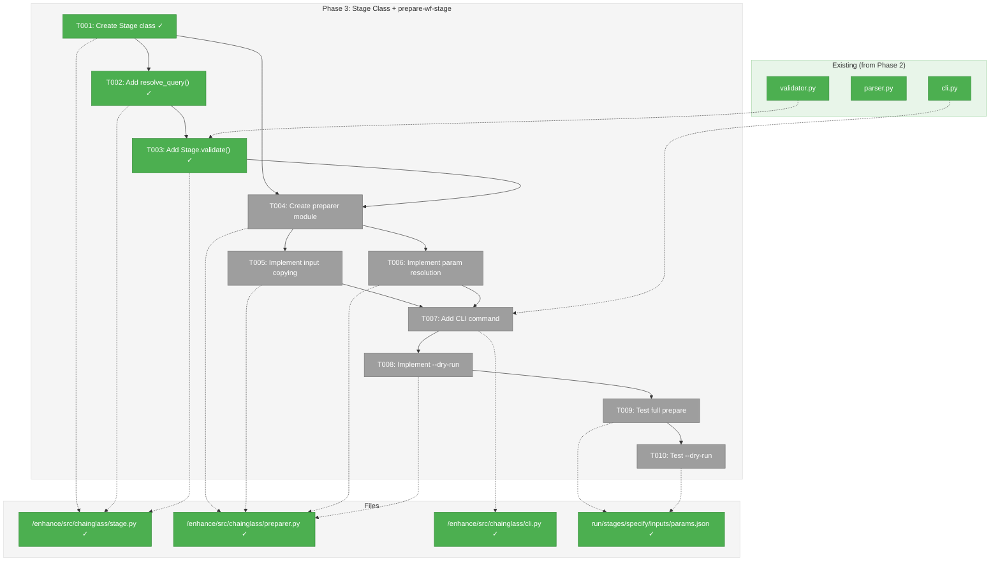
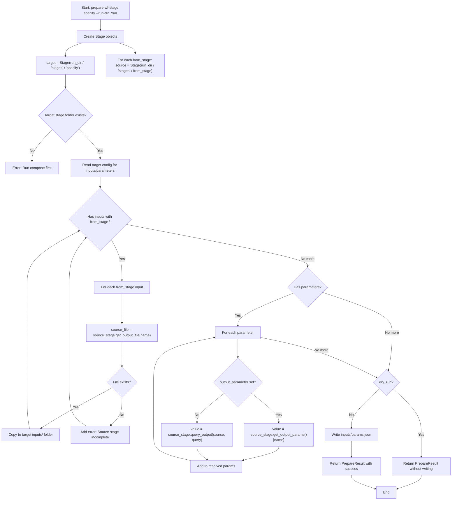
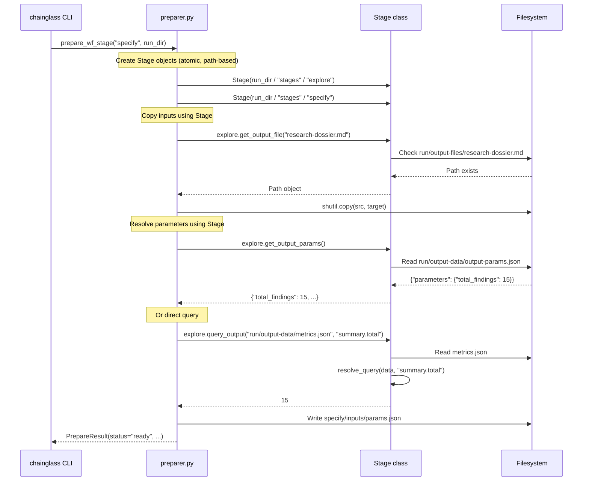

# Phase 3: Implement prepare-wf-stage Command – Tasks & Alignment Brief

**Spec**: [../first-wf-build-spec.md](../first-wf-build-spec.md)
**Plan**: [../first-wf-build-plan.md](../first-wf-build-plan.md)
**Date**: 2026-01-19
**Phase Slug**: `phase-3-implement-prepare-wf-stage-command`

---

## Executive Briefing

### Purpose
This phase implements the `prepare-wf-stage` command that bridges stages in a multi-stage workflow. Without this, the specify stage cannot access outputs from the explore stage, breaking the workflow pipeline.

### What We're Building

**Core Abstraction: `Stage` Class**

A reusable `Stage` class that encapsulates stage folder access:
- Input: Stage folder path directly (e.g., `run/stages/explore/`)
- Atomic and self-contained - reads everything from `stage-config.yaml`
- Always loads (even if incomplete) - validation is a separate concern
- Provides graceful access to outputs (returns `None`/empty if not present)
- `validate()` method checks completeness without preventing loading
- `finalize()` method validates outputs AND writes `output-params.json`
- Discovers `wf-run.json` by traversing up from stage path when needed
- Reusable across finalize, prepare, and future commands

**CLI Command: `chainglass finalize`**

Runs after LLM completes a stage to publish its outputs:
- Validates all required output files exist
- Validates all required output data files exist (with schema validation)
- Extracts `output_parameters` using `source` + `query` definitions
- Writes extracted parameters to `run/output-data/output-params.json`
- Updates stage status in `wf-run.json` to "completed"
- **Must run before `prepare-wf-stage` for the next stage**

**CLI Command: `chainglass prepare-wf-stage`**

Uses the `Stage` class to prepare the next stage:
- Assumes source stage has been finalized (output-params.json exists)
- Copy input files from prior stage outputs to current stage inputs folder
- Resolve parameters from source stage's `output-params.json`
- Write resolved parameters to `inputs/params.json`
- Support `--dry-run` for validation without file writes

**Workflow Order:**
```
compose → [LLM runs explore] → finalize explore → prepare-wf-stage specify → [LLM runs specify] → finalize specify
```

### User Value
Workflow stages can be executed independently while maintaining data flow contracts. An LLM agent running the `specify` stage gets all required inputs from `explore` automatically copied and parameters resolved without manual intervention.

### Example

**Stage class usage (during stage work):**
```python
from pathlib import Path
from chainglass.stage import Stage

# Load explore stage directly from folder (always succeeds if folder exists)
explore = Stage(Path("run/stages/explore"))

# Check if complete
if explore.is_complete:
    params = explore.get_output_params()
    print(f"Found {params['total_findings']} findings")
else:
    # Still usable even if incomplete - see what's available
    result = explore.validate()
    print(f"Missing: {result.errors}")

    # Access partial data
    metrics = explore.get_output_data("explore-metrics.json")
    if metrics:
        print(f"Progress: {metrics.get('summary', {})}")
```

**CLI usage:**
```bash
# Prepare specify stage (copies from explore)
chainglass prepare-wf-stage specify --run-dir ./run/run-2026-01-18-001

# Result: files copied, params.json written
ls ./run/run-2026-01-18-001/stages/specify/inputs/
# research-dossier.md  findings.json  params.json
```

---

## Objectives & Scope

### Objective
Implement the `Stage` class abstraction and `prepare-wf-stage` command as specified in plan Appendix A.11, enabling inter-stage dependency resolution for the explore → specify workflow.

### Goals

**Stage Class:**
- ✅ Create `Stage` class that loads from stage folder path directly
- ✅ Stage class is atomic and self-contained, loads config lazily from `stage-config.yaml`
- ✅ Stage class provides `validate()` for completeness checking (separate from loading)
- ✅ Stage class provides `finalize()` to validate outputs AND write `output-params.json`
- ✅ Stage class provides graceful output access (`get_output_params()`, `get_output_data()`, `query_output()`)
- ✅ Support dot notation (`summary.total_findings`) and array indexing (`components[0].name`)

**Finalize Command:**
- ✅ Create `chainglass finalize <stage_id> --run-dir <path>` command
- ✅ Validate all required outputs exist (files and data)
- ✅ Extract `output_parameters` using `source` + `query` definitions
- ✅ Write extracted parameters to `run/output-data/output-params.json`
- ✅ Update stage status in `wf-run.json` to "completed"

**Prepare Command:**
- ✅ Create `chainglass prepare-wf-stage <stage_id> --run-dir <path>` command
- ✅ Require source stage to be finalized (output-params.json must exist)
- ✅ Copy inputs with `from_stage` from prior stage output folders
- ✅ Resolve parameters from source stage's `output-params.json` (simple lookup)
- ✅ Write resolved parameters to `inputs/params.json`
- ✅ Support `--dry-run` to validate without writing
- ✅ Provide actionable errors when source stage not finalized

### Non-Goals (Scope Boundaries)

- ❌ Automatic stage execution (this is preparation only, not running the stage)
- ❌ Circular dependency detection (workflow is strictly sequential: explore → specify)
- ❌ Parameter type coercion (values extracted as-is from JSON)
- ❌ Complex JSONPath expressions (only dot notation and single-level array indexing)
- ❌ Updating wf-run.json status (that's the validate command's responsibility)
- ❌ Full output validation with schema checks (Phase 4 scope)
- ❌ Creating the stage folder structure (already done by compose)

---

## Architecture Map

### Component Diagram
<!-- Status: grey=pending, orange=in-progress, green=completed, red=blocked -->
<!-- Updated by plan-6 during implementation -->



### Task-to-Component Mapping

<!-- Status: ⬜ Pending | 🟧 In Progress | ✅ Complete | 🔴 Blocked -->

| Task | Component(s) | Files | Status | Comment |
|------|-------------|-------|--------|---------|
| T001 | `Stage` class with lazy loading | `/Users/jordanknight/github/tools/enhance/src/chainglass/stage.py` | ✅ Complete | Core abstraction: stage folder path → Stage object (atomic) |
| T002 | `resolve_query()` utility | `/Users/jordanknight/github/tools/enhance/src/chainglass/stage.py` | ✅ Complete | Dot notation + array indexing query resolver |
| T003 | `Stage.validate()` method | `/Users/jordanknight/github/tools/enhance/src/chainglass/stage.py` | ✅ Complete | Check completeness, returns ValidationResult |
| T004 | `PrepareResult` dataclass, preparer entry | `/Users/jordanknight/github/tools/enhance/src/chainglass/preparer.py` | ✅ Complete | Uses Stage class for source stage access |
| T005 | Input file copying logic | `/Users/jordanknight/github/tools/enhance/src/chainglass/preparer.py` | ✅ Complete | Copy files with `from_stage` using Stage class |
| T006 | Parameter resolution logic | `/Users/jordanknight/github/tools/enhance/src/chainglass/preparer.py` | ✅ Complete | Use Stage.get_output_params() or query_output() |
| T007 | CLI command registration | `/Users/jordanknight/github/tools/enhance/src/chainglass/cli.py` | ✅ Complete | Add `prepare-wf-stage` typer command |
| T008 | --dry-run implementation | `/Users/jordanknight/github/tools/enhance/src/chainglass/preparer.py` | ✅ Complete | Validate without copying/writing |
| T009 | Manual test: full prepare | Test fixture | ✅ Complete | End-to-end test with sample run folder |
| T010 | Manual test: --dry-run | Test fixture | ✅ Complete | Verify no writes in dry-run mode |

---

## Tasks

| Status | ID | Task | CS | Type | Dependencies | Absolute Path(s) | Validation | Subtasks | Notes |
|--------|------|------|-----|------|--------------|------------------|------------|----------|-------|
| [x] | T001 | Create `Stage` class with lazy config loading and output accessors | 2 | Core | Phase 2 | `/Users/jordanknight/github/tools/enhance/src/chainglass/stage.py` | `Stage(Path("run/stages/explore")).config` returns dict | – | Input: stage folder path (atomic, self-contained) |
| [x] | T002 | Implement `resolve_query()` for dot notation and array indexing | 2 | Core | T001 | `/Users/jordanknight/github/tools/enhance/src/chainglass/stage.py` | `resolve_query({"a": {"b": [1]}}, "a.b[0]")` returns `1` | – | Support `summary.total` and `items[0].name` |
| [x] | T003 | Add `Stage.validate()` method returning ValidationResult | 2 | Core | T001, T002 | `/Users/jordanknight/github/tools/enhance/src/chainglass/stage.py` | `stage.validate().valid` returns bool; errors list populated | – | Check outputs exist, params extractable |
| [x] | T004 | Add `Stage.finalize()` method that validates and writes output-params.json | 2 | Core | T003 | `/Users/jordanknight/github/tools/enhance/src/chainglass/stage.py` | `stage.finalize()` writes output-params.json, returns FinalizeResult | – | Extracts output_parameters via resolve_query |
| [x] | T005 | Add finalize CLI command with typer | 2 | Core | T004 | `/Users/jordanknight/github/tools/enhance/src/chainglass/cli.py` | `chainglass finalize explore --run-dir ./run` works | – | Updates wf-run.json status |
| [x] | T006 | Manual test: finalize validates and writes output-params.json | 1 | Test | T005 | `/Users/jordanknight/github/tools/enhance/sample/sample_1/runs/` | output-params.json created with correct values | – | Test with mock explore outputs |
| [x] | T007 | Create preparer module with PrepareResult dataclass | 2 | Core | T004 | `/Users/jordanknight/github/tools/enhance/src/chainglass/preparer.py` | `from chainglass.preparer import prepare_wf_stage` imports | – | Uses Stage class for source access |
| [x] | T008 | Implement input file copying using Stage class | 2 | Core | T007 | `/Users/jordanknight/github/tools/enhance/src/chainglass/preparer.py` | Files with `from_stage` copied to inputs folder | – | Use source path from stage-config.yaml |
| [x] | T009 | Implement parameter resolution from output-params.json | 2 | Core | T007 | `/Users/jordanknight/github/tools/enhance/src/chainglass/preparer.py` | Params resolved via `get_output_params()` | – | Fail if output-params.json missing (not finalized) |
| [x] | T010 | Add prepare-wf-stage CLI command with typer | 2 | Core | T008, T009 | `/Users/jordanknight/github/tools/enhance/src/chainglass/cli.py` | `chainglass prepare-wf-stage --help` works | – | Follow existing cli.py patterns |
| [x] | T011 | Implement --dry-run validation without writing | 1 | Core | T010 | `/Users/jordanknight/github/tools/enhance/src/chainglass/preparer.py` | --dry-run returns status without modifying filesystem | – | Validate all sources accessible |
| [x] | T012 | Manual test: prepare copies files and resolves params | 1 | Test | T010 | `/Users/jordanknight/github/tools/enhance/sample/sample_1/runs/` | Files copied, params.json written | – | Requires finalize to run first |
| [x] | T013 | Manual test: prepare fails gracefully if not finalized | 1 | Test | T010 | `/Users/jordanknight/github/tools/enhance/sample/sample_1/runs/` | Error: "Run finalize first" | – | Test error message quality |
| [x] | T014 | Manual test: --dry-run validates without writing | 1 | Test | T011 | `/Users/jordanknight/github/tools/enhance/sample/sample_1/runs/` | Returns "ready" status, no files written | – | Verify filesystem unchanged |

---

## Stage Class Design

### Core Principle: Loading vs Validation vs Finalization

The `Stage` class has three distinct operations:

1. **Loading** (constructor): Always succeeds if folder exists, even if incomplete
2. **Validation** (`validate()`): Checks completeness, returns ValidationResult, doesn't modify anything
3. **Finalization** (`finalize()`): Validates, extracts output_parameters, writes output-params.json

This separation allows:
- Using Stage during stage execution to track partial progress
- Inspecting what outputs are available so far
- Checking what's missing without failing to load
- Explicitly publishing outputs when the LLM is done

### Class Interface

```python
# File: /Users/jordanknight/github/tools/enhance/src/chainglass/stage.py

from dataclasses import dataclass, field
from pathlib import Path
from typing import Any
import json
import yaml

from chainglass.validator import ValidationResult


def resolve_query(data: dict, query: str) -> Any:
    """
    Resolve a dot-notation query with optional array indexing.

    Examples:
        resolve_query({"a": {"b": 1}}, "a.b") → 1
        resolve_query({"items": [{"name": "x"}]}, "items[0].name") → "x"
        resolve_query({"a": {"b": {"c": 2}}}, "a.b.c") → 2

    Returns None if path doesn't exist (no exceptions for missing keys).
    """
    # Implementation handles: a.b.c and arr[0].field patterns
    ...


class Stage:
    """
    Represents a stage in a run folder.

    Atomic and self-contained - reads everything from stage-config.yaml.
    Always loadable if folder exists - validation is separate.
    Provides graceful access to outputs (None/empty if not present).

    Args:
        path: Path to stage folder (e.g., "run/stages/explore")

    Example:
        >>> stage = Stage(Path("run/stages/explore"))
        >>> stage.path
        PosixPath('/abs/path/run/stages/explore')
        >>> stage.config["id"]
        'explore'
        >>> stage.get_output_params()
        {'total_findings': 15, 'critical_count': 2}
        >>> stage.is_complete
        True
    """

    def __init__(self, path: Path):
        self.path = Path(path).resolve()
        self._config: dict | None = None

    # =========================================================================
    # Path Discovery (derived from stage folder location)
    # =========================================================================

    @property
    def stage_id(self) -> str:
        """Stage ID from folder name."""
        return self.path.name

    @property
    def run_dir(self) -> Path:
        """Parent run directory (two levels up from stage folder)."""
        return self.path.parent.parent

    @property
    def wf_run_path(self) -> Path:
        """Path to wf-run.json (discovered from run_dir)."""
        return self.run_dir / "wf-run.json"

    # =========================================================================
    # Configuration (lazy loading)
    # =========================================================================

    @property
    def config(self) -> dict:
        """Load stage-config.yaml (lazy, cached)."""
        if self._config is None:
            config_path = self.path / "stage-config.yaml"
            self._config = yaml.safe_load(config_path.read_text())
        return self._config

    @property
    def name(self) -> str:
        """Stage display name from config."""
        return self.config.get("name", self.stage_id)

    # =========================================================================
    # Validation (separate from loading)
    # =========================================================================

    def validate(self) -> ValidationResult:
        """
        Check if stage is complete. Returns result, doesn't raise.

        Checks:
        - All required output files exist
        - All required output data files exist
        - All output_parameters can be extracted

        Returns ValidationResult with valid=True if complete, else errors populated.
        """
        result = ValidationResult(valid=True)

        # Check required output files exist
        for output in self.config.get("outputs", {}).get("files", []):
            path = self.path / output["path"]
            if not path.exists():
                result.valid = False
                result.errors.append(f"Missing output file: {output['name']} ({path})")

        # Check required output data files exist
        for output in self.config.get("outputs", {}).get("data", []):
            if output.get("required", True):
                path = self.path / output["path"]
                if not path.exists():
                    result.valid = False
                    result.errors.append(f"Missing output data: {output['name']} ({path})")

        # Check output_parameters can be extracted (if declared)
        for param in self.config.get("output_parameters", []):
            value = self.query_output(param["source"], param["query"])
            if value is None:
                result.valid = False
                result.errors.append(
                    f"Cannot extract output_parameter '{param['name']}' "
                    f"from {param['source']} query '{param['query']}'"
                )

        return result

    @property
    def is_complete(self) -> bool:
        """Convenience: True if validate() passes."""
        return self.validate().valid

    @property
    def is_finalized(self) -> bool:
        """True if output-params.json exists (stage has been finalized)."""
        return (self.path / "run" / "output-data" / "output-params.json").exists()

    # =========================================================================
    # Finalization (validates + writes output-params.json)
    # =========================================================================

    def finalize(self) -> "FinalizeResult":
        """
        Validate stage completion and publish output parameters.

        This is the "official" way to mark a stage as complete after the LLM
        finishes its work. It:
        1. Runs validate() to check all outputs exist
        2. Extracts output_parameters using source + query definitions
        3. Writes extracted parameters to run/output-data/output-params.json
        4. Updates stage status in wf-run.json to "completed"

        Returns:
            FinalizeResult with success=True if finalized, else errors populated.

        Example:
            >>> stage = Stage(wf_run_path, "explore")
            >>> result = stage.finalize()
            >>> if result.success:
            ...     print(f"Finalized with {len(result.parameters)} params")
            ... else:
            ...     print(f"Failed: {result.errors}")
        """
        from datetime import datetime, timezone

        result = FinalizeResult(success=True)

        # Step 1: Validate outputs exist
        validation = self.validate()
        if not validation.valid:
            result.success = False
            result.errors = validation.errors
            return result

        # Step 2: Extract output_parameters
        parameters: dict[str, Any] = {}
        for param in self.config.get("output_parameters", []):
            value = self.query_output(param["source"], param["query"])
            if value is not None:
                parameters[param["name"]] = value
            else:
                result.success = False
                result.errors.append(
                    f"Cannot extract '{param['name']}' from {param['source']}"
                )

        if not result.success:
            return result

        # Step 3: Write output-params.json
        output_params_path = self.path / "run" / "output-data" / "output-params.json"
        output_params_data = {
            "stage_id": self.stage_id,
            "finalized_at": datetime.now(timezone.utc).isoformat(),
            "parameters": parameters,
        }
        output_params_path.write_text(json.dumps(output_params_data, indent=2))

        # Step 4: Update wf-run.json status
        self._update_wf_run_status("completed")

        result.parameters = parameters
        return result

    def _update_wf_run_status(self, status: str) -> None:
        """Update this stage's status in wf-run.json."""
        from datetime import datetime, timezone

        wf_run = json.loads(self.wf_run_path.read_text())
        for stage in wf_run.get("stages", []):
            if stage["id"] == self.stage_id:
                stage["status"] = status
                if status == "completed":
                    stage["completed_at"] = datetime.now(timezone.utc).isoformat()
                break
        self.wf_run_path.write_text(json.dumps(wf_run, indent=2))


    # =========================================================================
    # Output Access (graceful - returns None/empty if not present)
    # =========================================================================

    def get_output_params(self) -> dict:
        """
        Get published output parameters dict.

        Returns empty dict if output-params.json not yet written.
        """
        path = self.path / "run" / "output-data" / "output-params.json"
        if path.exists():
            data = json.loads(path.read_text())
            return data.get("parameters", {})
        return {}

    def get_output_data(self, filename: str) -> dict | None:
        """
        Load JSON from run/output-data/.

        Returns None if file doesn't exist.
        """
        path = self.path / "run" / "output-data" / filename
        if path.exists():
            return json.loads(path.read_text())
        return None

    def get_output_file(self, filename: str) -> Path | None:
        """
        Get path to file in run/output-files/.

        Returns None if file doesn't exist.
        """
        path = self.path / "run" / "output-files" / filename
        return path if path.exists() else None

    def query_output(self, source: str, query: str) -> Any | None:
        """
        Query a JSON output file using dot notation.

        Args:
            source: Path relative to stage (e.g., "run/output-data/metrics.json")
            query: Dot notation query (e.g., "summary.total_findings")

        Returns None if file missing or query path doesn't exist.
        """
        # Extract filename from source path
        source_path = self.path / source
        if not source_path.exists():
            return None

        data = json.loads(source_path.read_text())
        return resolve_query(data, query)


@dataclass
class FinalizeResult:
    """Result of stage finalization."""

    success: bool
    errors: list[str] = field(default_factory=list)
    parameters: dict[str, Any] = field(default_factory=dict)
```

---

## Alignment Brief

### Prior Phases Review

#### Phase 1 → Phase 2 → Phase 3 Evolution

**Phase 1 (Prepare wf-spec Folder)** established the foundation:
- Created the `wf-spec` folder structure with wf.yaml as single source of truth
- Defined stage inputs/outputs contracts in wf.yaml (lines 306-460)
- Created explore-metrics.schema.json for parameter extraction demo
- **Key export for Phase 3**: The `parameters` section in wf.yaml (lines 391-408) defines what specify needs from explore

**Phase 2 (Implement compose Command)** built the CLI infrastructure:
- Created chainglass Python package with typer CLI
- Established two-phase validation pattern (fail-fast + collect-all)
- Implemented compose algorithm that extracts stage-config.yaml
- **Key export for Phase 3**:
  - `validator.py:ValidationResult` - Reuse for Stage.validate()
  - `cli.py` - Typer CLI patterns to follow
  - `composer.py` - Path resolution patterns

#### Cumulative Deliverables (organized by phase)

| Phase | Files Created | APIs Exported |
|-------|---------------|---------------|
| Phase 1 | `wf-spec/wf.yaml`, `wf-spec/schemas/*.json`, `wf-spec/stages/*/prompt/main.md` | Stage input/output contracts |
| Phase 2 | `enhance/src/chainglass/__init__.py`, `parser.py`, `validator.py`, `composer.py`, `cli.py`, `pyproject.toml` | `parse_workflow()`, `validate_wf_spec()`, `ValidationResult`, typer app |
| **Phase 3** | `enhance/src/chainglass/stage.py`, `preparer.py` | **`Stage(path)` class** (atomic), `prepare_wf_stage()`, `resolve_query()` |

#### Dependencies from Prior Phases

Phase 3 depends on:

1. **From Phase 1**:
   - wf.yaml `parameters` section defining from_stage + output_parameter references
   - Stage input definitions with `from_stage` and `source` fields
   - output_parameters in explore stage defining published values

2. **From Phase 2**:
   - `ValidationResult` dataclass for Stage.validate() return type
   - typer command pattern from cli.py
   - Path resolution pattern: `Path(...).resolve()`
   - Run folder structure: `run/stages/{stage_id}/` convention

#### Lessons Learned from Prior Phases

1. **Two-Phase Validation Works**: Phase 2's fail-fast + collect-all pattern prevented cascading errors. Stage.validate() applies same pattern: fail fast if stage folder missing, then collect all output errors.

2. **Lazy Loading**: Phase 2 loaded wf.yaml only when needed. Stage class loads config lazily via `@property`.

3. **Actionable Errors**: Phase 2's "Action:" guidance in error messages was effective. Continue pattern for missing inputs/parameters.

4. **Graceful Degradation**: Stage class returns None/empty for missing data rather than raising exceptions.

#### Reusable Test Infrastructure

Phase 2 manual testing approach:
- Sample wf-spec at `/Users/jordanknight/github/tools/enhance/sample/sample_1/wf-spec/`
- Run folders at `/Users/jordanknight/github/tools/enhance/sample/sample_1/runs/`

For Phase 3 testing, need explore stage outputs in a run folder (see Fixture Preparation below).

---

### Critical Findings Affecting This Phase

| Finding | Impact | How Addressed |
|---------|--------|---------------|
| **#05**: prepare-wf-stage for stage inputs | Defines entire command scope | Stage class + preparer implement A.11 algorithm |
| **#04**: Absolute paths required | Path resolution | Stage class uses `Path.resolve()` everywhere |
| **#03**: Three-tier output mandatory | Output access | Stage class has `get_output_file()` vs `get_output_data()` |
| **#10**: Multiple outputs required | Parameter extraction | Stage.query_output() supports any JSON output |

---

### Invariants & Guardrails

1. **Stage always loads**: If folder exists, Stage object loads (validation separate)
2. **Never modify source files**: Only copy from prior stage, never modify explore's outputs
3. **Graceful access**: Methods return None/empty if data not present (no exceptions)
4. **Fail if source missing (during prepare)**: Error with actionable message if required input unavailable
5. **Preserve JSON types**: Extracted parameter values maintain their JSON types
6. **Idempotent operation**: Running prepare twice produces same result

---

### Inputs to Read

| File | Purpose | Read by Task |
|------|---------|--------------|
| `run/stages/{stage_id}/stage-config.yaml` | Get stage inputs/outputs/parameters | T001 (Stage.config) |
| `run/wf-run.json` | Update stage status on finalize | T004 (Stage.finalize) |
| `run/stages/{from_stage}/run/output-data/output-params.json` | Get published parameters | T006 (via Stage.get_output_params()) |
| `run/stages/{from_stage}/run/output-data/*.json` | Direct JSON query source | T006 (via Stage.query_output()) |
| `run/stages/{from_stage}/run/output-files/*` | Files to copy as inputs | T005 (via Stage.get_output_file()) |

---

### Visual Alignment Aids

#### Flow Diagram: prepare-wf-stage using Stage class



#### Sequence Diagram: Stage class usage



---

### Test Plan (Manual Testing per Spec)

| Test | Fixture | Steps | Expected Result |
|------|---------|-------|-----------------|
| **T009: Full prepare** | Run folder with completed explore stage | `chainglass prepare-wf-stage specify --run-dir ./run/run-2026-01-18-002` | Files copied to inputs/, params.json written, exit 0 |
| **T010: Dry-run** | Same fixture | `chainglass prepare-wf-stage specify --run-dir ./run/run-2026-01-18-002 --dry-run` | Status "ready" printed, no files written |
| **Blocked test** | Run folder without explore outputs | `chainglass prepare-wf-stage specify --run-dir ./run/run-empty` | Status "blocked", actionable error, exit 1 |
| **Stage partial load** | Run folder with some explore outputs | Python: `Stage(Path("run/stages/explore")).get_output_data("metrics.json")` | Returns available data, None for missing |

#### Fixture Preparation

To test Phase 3, create mock explore outputs in an existing run folder:

```bash
# Create mock explore outputs for testing
cd /Users/jordanknight/github/tools/enhance
RUN_DIR=sample/sample_1/runs/run-2026-01-18-002

# Ensure directories exist
mkdir -p $RUN_DIR/stages/explore/run/output-files
mkdir -p $RUN_DIR/stages/explore/run/output-data

# Mock research dossier
cat > $RUN_DIR/stages/explore/run/output-files/research-dossier.md << 'EOF'
# Research Dossier

## Executive Summary
This dossier contains findings from codebase exploration.

## Findings
1. Authentication module needs refactoring
2. Session handling has edge cases
EOF

# Mock findings.json
cat > $RUN_DIR/stages/explore/run/output-data/findings.json << 'EOF'
{
  "findings": [
    {"id": 1, "title": "Auth refactoring needed", "severity": "high"},
    {"id": 2, "title": "Session edge cases", "severity": "medium"}
  ]
}
EOF

# Mock explore-metrics.json (for parameter extraction)
cat > $RUN_DIR/stages/explore/run/output-data/explore-metrics.json << 'EOF'
{
  "summary": {
    "total_findings": 15,
    "by_impact": {"critical": 2, "high": 5, "medium": 6, "low": 2}
  },
  "components": [
    {"name": "auth/session.py", "findings_count": 5, "risk_level": "high"},
    {"name": "api/handlers.py", "findings_count": 3, "risk_level": "medium"}
  ],
  "recommendations": {
    "complexity": {"suggested_score": "CS-3", "rationale": "Multiple components affected"}
  }
}
EOF

# Mock output-params.json (published by validate command, but mock for testing)
cat > $RUN_DIR/stages/explore/run/output-data/output-params.json << 'EOF'
{
  "stage_id": "explore",
  "published_at": "2026-01-18T12:00:00Z",
  "parameters": {
    "total_findings": 15,
    "critical_count": 2,
    "top_component": "auth/session.py",
    "complexity_score": "CS-3"
  }
}
EOF

echo "Fixture created at $RUN_DIR"
```

---

### Step-by-Step Implementation Outline

| Step | Task | Implementation |
|------|------|----------------|
| 1 | T001 | Create `stage.py` with `Stage` class: `__init__(path)`, derived properties, lazy config loading, output accessors |
| 2 | T002 | Add `resolve_query()` function to handle `a.b.c` and `arr[0].field` patterns |
| 3 | T003 | Add `Stage.validate()` method that checks outputs exist and params extractable |
| 4 | T004 | Create `preparer.py` with `PrepareResult` dataclass and `prepare_wf_stage()` entry function |
| 5 | T005 | Add input copying: iterate config inputs, use `source_stage.get_output_file()`, copy to target |
| 6 | T006 | Add param resolution: use `get_output_params()` or `query_output()` based on parameter definition |
| 7 | T007 | Add CLI command: `@app.command()` with stage_id argument, --run-dir and --dry-run options |
| 8 | T008 | Add dry_run flag handling: skip copy/write operations, still collect all errors |
| 9 | T009 | Run full test with mock fixture, verify files and params.json content |
| 10 | T010 | Run dry-run test, verify no file changes, status printed |

---

### Commands to Run

```bash
# Navigate to package directory
cd /Users/jordanknight/github/tools/enhance

# Verify package still works
uv run chainglass --version

# Create test fixture (before T009)
# ... see fixture preparation above

# Test Stage class in Python (after T001-T003)
uv run python -c "
from pathlib import Path
from chainglass.stage import Stage

# Stage is atomic - just pass the folder path
explore = Stage(Path('sample/sample_1/runs/run-2026-01-18-002/stages/explore'))
print(f'Stage path: {explore.path}')
print(f'Stage ID: {explore.stage_id}')
print(f'Config name: {explore.name}')
print(f'Output params: {explore.get_output_params()}')
print(f'Is complete: {explore.is_complete}')
"

# Test prepare-wf-stage help (after T007)
uv run chainglass prepare-wf-stage --help

# Full prepare test (T009)
uv run chainglass prepare-wf-stage specify --run-dir ./sample/sample_1/runs/run-2026-01-18-002

# Dry-run test (T010)
uv run chainglass prepare-wf-stage specify --run-dir ./sample/sample_1/runs/run-2026-01-18-002 --dry-run

# Verify params.json content
cat ./sample/sample_1/runs/run-2026-01-18-002/stages/specify/inputs/params.json

# Verify files copied
ls -la ./sample/sample_1/runs/run-2026-01-18-002/stages/specify/inputs/
```

---

### Risks & Unknowns

| Risk | Severity | Mitigation |
|------|----------|------------|
| JSON query edge cases (nested arrays, missing keys) | Medium | resolve_query returns None for missing paths; test with fixture |
| output-params.json not yet written by explore | Medium | Create mock fixture; real output-params.json written by Phase 4 validate |
| Stage class loaded during incomplete execution | Low | By design: validation separate from loading |
| wf-run.json source path might be relative | Low | Always resolve to absolute via `Path.resolve()` |

---

### Ready Check

- [x] Stage class design understood (load vs validate separation)
- [x] Plan A.11 algorithm understood (prepare_wf_stage flow)
- [x] Prior phase deliverables available (ValidationResult, cli.py patterns)
- [x] Test fixture can be created (mock explore outputs)
- [x] Phase 2 run folder exists for testing (`enhance/sample/sample_1/runs/run-2026-01-18-002`)
- [x] No blocking dependencies (Phase 2 complete)

**Phase 3 implementation complete.**

---

## Phase Footnote Stubs

| Footnote | Task(s) | Node ID(s) | Notes |
|----------|---------|------------|-------|
| [^17] | T001, T002, T003, T004 | `file:enhance/src/chainglass/stage.py`, `class:Stage`, `function:resolve_query`, `class:FinalizeResult`, `method:Stage.validate`, `method:Stage.finalize`, `method:Stage.get_output_params`, `method:Stage.get_output_data`, `method:Stage.get_output_file`, `method:Stage.query_output` | Stage class with lazy loading, validation, finalization |
| [^18] | T007, T008, T009, T010, T011 | `file:enhance/src/chainglass/preparer.py`, `class:PrepareResult`, `function:prepare_wf_stage` | Preparer module |
| [^19] | T005, T010, T011 | `function:enhance/src/chainglass/cli.py:finalize_cmd`, `function:enhance/src/chainglass/cli.py:prepare_wf_stage_cmd` | finalize and prepare-wf-stage CLI commands |

---

## Evidence Artifacts

Implementation evidence:

- **Execution Log**: [execution.log.md](./execution.log.md) ✅
- **Test Output**: Console output from manual tests documented in log
- **Created Files**:
  - `/Users/jordanknight/github/tools/enhance/src/chainglass/stage.py` ✅ NEW
  - `/Users/jordanknight/github/tools/enhance/src/chainglass/preparer.py` ✅ NEW
  - `/Users/jordanknight/github/tools/enhance/src/chainglass/cli.py` ✅ Modified
- **Test Fixtures Used**:
  - `sample/sample_1/runs/run-2026-01-18-003` — Full finalize + prepare test
  - `sample/sample_1/runs/run-2026-01-18-004` — Not-finalized error test
  - `sample/sample_1/runs/run-2026-01-18-005` — Dry-run test

---

## Discoveries & Learnings

_Populated during implementation by plan-6. Log anything of interest to your future self._

| Date | Task | Type | Discovery | Resolution | References |
|------|------|------|-----------|------------|------------|
| 2026-01-19 | T013 | gotcha | Multiple inputs/params referencing same source stage caused duplicate "not finalized" errors | Added `reported_errors` set to track which stages already logged errors | log#task-t013 |

**Types**: `gotcha` | `research-needed` | `unexpected-behavior` | `workaround` | `decision` | `debt` | `insight`

**What to log**:
- Things that didn't work as expected
- External research that was required
- Implementation troubles and how they were resolved
- Gotchas and edge cases discovered
- Decisions made during implementation
- Technical debt introduced (and why)
- Insights that future phases should know about

_See also: `execution.log.md` for detailed narrative._

---

## Directory Layout

```
docs/plans/010-first-wf-build/
├── first-wf-build-plan.md
├── first-wf-build-spec.md
├── research-dossier.md
└── tasks/
    ├── phase-1-prepare-wf-spec-folder/
    │   ├── tasks.md
    │   └── execution.log.md
    ├── phase-2-implement-compose-command/
    │   ├── tasks.md
    │   └── execution.log.md
    └── phase-3-implement-prepare-wf-stage-command/
        ├── tasks.md              ← This file
        └── execution.log.md      ← Created by /plan-6
```
