# Subtask 001: Implement preflight Command

**Parent Plan:** [View Plan](../../first-wf-build-plan.md)
**Parent Phase:** Phase 4: Implement validate Command
**Parent Task(s):** Phase 4 complete; subtask extends phase with pre-execution validation
**Plan Task Reference:** [Phase 4 in Plan](../../first-wf-build-plan.md#phase-4-implement-validate-command)

**Why This Subtask:**
The validate command validates stage OUTPUTS after execution. There is no corresponding check for stage INPUTS before execution. Agents can start working on a stage only to fail mid-execution because a required input file doesn't exist or an upstream stage hasn't been finalized. The preflight command catches these issues BEFORE wasted effort, providing actionable error messages. Additionally, wf.md must be updated to instruct agents to run preflight before beginning work.

**Created:** 2026-01-19
**Requested By:** User (manual testing revealed gap)

---

## Executive Briefing

### Purpose
This subtask implements a `chainglass preflight` command that validates a stage is **ready to execute** before an LLM agent begins work. It mirrors the `validate` command's structure but checks INPUTS instead of OUTPUTS. Without this, agents cannot verify prerequisites before starting, leading to mid-execution failures.

### What We're Building
A `preflight` command that:
- Checks all required input files exist and are non-empty
- Validates source stages are finalized (for inputs with `from_stage`)
- Verifies parameters can be resolved from upstream `output-params.json`
- Confirms prompt files exist (`prompt/wf.md`, `prompt/main.md`)
- Provides LLM-friendly, actionable error messages
- Returns structured result with status, checks, and errors

Additionally, updates to `wf.md` template to instruct agents to run preflight BEFORE reading inputs.

### Unblocks
- Manual agent testing: Agents can verify stage readiness before starting work
- Error prevention: Catches missing inputs before wasted execution effort

### Example

**Command**: `chainglass preflight explore --run-dir ./run/run-2026-01-19-002`

**Success Output**:
```
Preflight: explore
Checks passed:
  stage-config.yaml (valid)
  prompt/wf.md (exists)
  prompt/main.md (exists, non-empty)
  inputs/user-description.md (exists, non-empty)
Result: PASS (4 checks, 0 errors)
```

**Failure Output**:
```
Preflight failed:
  INPUT_MISSING: inputs/user-description.md
    Action: Create this file with: User-provided research query or feature description
Result: FAIL (3 passed, 1 error)
```
*(Note: Action includes description from stage-config.yaml per DYK-04)*

---

## Objectives & Scope

### Objective
Implement the `chainglass preflight` command that validates stage inputs are present and ready, mirroring the `validate` command's pattern but for pre-execution checks. Update `wf.md` to instruct agents to run this command first.

### Goals

- ✅ Create `preflight.py` module with `preflight()` function and `PreflightResult` dataclass
- ✅ Implement checks for: config validity, prompt files, required inputs, source stage finalization
- ✅ Add `preflight` CLI command to `cli.py` with same signature as `validate`
- ✅ Provide LLM-friendly, actionable error messages following established pattern
- ✅ Update `wf.md` template to add preflight instruction in "Before You Begin" section
- ✅ Return structured result: `{"status": "pass"|"fail", "stage_id": "...", "checks": [...], "errors": [...]}`

### Non-Goals

- ❌ Schema validation of input files (preflight checks existence, not content validity)
- ❌ Automatic fixing of preflight failures (command reports, doesn't fix)
- ❌ Integration with compose command (preflight runs separately after compose)
- ❌ Parameter value validation (preflight checks parameters are extractable, not their values)

---

## Architecture Map

### Component Diagram

```mermaid
flowchart TD
    classDef pending fill:#9E9E9E,stroke:#757575,color:#fff
    classDef inprogress fill:#FF9800,stroke:#F57C00,color:#fff
    classDef completed fill:#4CAF50,stroke:#388E3C,color:#fff
    classDef blocked fill:#F44336,stroke:#D32F2F,color:#fff

    style Parent fill:#F5F5F5,stroke:#E0E0E0
    style Subtask fill:#F5F5F5,stroke:#E0E0E0
    style Files fill:#F5F5F5,stroke:#E0E0E0

    subgraph Parent["Parent Context: Phase 4 Complete"]
        P4["Phase 4: validate command ✓"]:::completed
    end

    subgraph Subtask["Subtask 001: Preflight Command"]
        ST001["ST001: Create preflight.py module ✓"]:::completed
        ST002["ST002: Implement PreflightResult dataclass ✓"]:::completed
        ST003["ST003: Implement preflight() function ✓"]:::completed
        ST004["ST004: Add preflight CLI command ✓"]:::completed
        ST005["ST005: Update wf.md template ✓"]:::completed
        ST006["ST006: Test first stage (explore) ✓"]:::completed
        ST007["ST007: Test second stage (specify) ✓"]:::completed

        ST001 --> ST002 --> ST003 --> ST004 --> ST005 --> ST006 --> ST007
    end

    subgraph Files["Files"]
        F1["/enhance/src/chainglass/preflight.py ✓"]:::completed
        F2["/enhance/src/chainglass/cli.py ✓"]:::completed
        F3["/enhance/sample/sample_1/wf-spec/templates/wf.md ✓"]:::completed
    end

    ST001 -.-> F1
    ST002 -.-> F1
    ST003 -.-> F1
    ST004 -.-> F2
    ST005 -.-> F3
    ST006 -.->|first stage| P4
    ST007 -.->|from_stage| P4
```

<!-- Status: grey=pending, orange=in-progress, green=completed, red=blocked -->
<!-- Updated by plan-6 during implementation -->



### Task-to-Component Mapping

<!-- Status: ⬜ Pending | 🟧 In Progress | ✅ Complete | 🔴 Blocked -->

| Task | Component(s) | Files | Status | Comment |
|------|-------------|-------|--------|---------|
| ST001 | Preflight Module | /enhance/src/chainglass/preflight.py | ✅ Complete | Created module structure |
| ST002 | PreflightCheck, PreflightResult | /enhance/src/chainglass/preflight.py | ✅ Complete | Mirrors StageValidationCheck pattern |
| ST003 | preflight() function | /enhance/src/chainglass/preflight.py | ✅ Complete | Two-phase validation implemented |
| ST004 | CLI Command | /enhance/src/chainglass/cli.py | ✅ Complete | Matches validate command signature |
| ST005 | wf.md Template | /enhance/sample/sample_1/wf-spec/templates/wf.md | ✅ Complete | Added preflight as step 0 |
| ST006 | Manual Testing (first stage) | -- | ✅ Complete | First stage testing passed |
| ST007 | Manual Testing (second stage) | -- | ✅ Complete | Second stage testing passed |

---

## Tasks

| Status | ID | Task | CS | Type | Dependencies | Absolute Path(s) | Validation | Subtasks | Notes |
|--------|-----|------|----|------|--------------|------------------|------------|----------|-------|
| [x] | ST001 | Create preflight.py module with imports and docstring | 1 | Setup | – | `/Users/jordanknight/github/tools/enhance/src/chainglass/preflight.py` | Can `from chainglass.preflight import preflight` | – | Mirror validator.py structure. Use yaml.safe_load() directly, NO Stage class import per DYK-05. |
| [x] | ST002 | Implement PreflightCheck and PreflightResult dataclasses | 2 | Core | ST001 | `/Users/jordanknight/github/tools/enhance/src/chainglass/preflight.py` | Dataclasses match StageValidationCheck pattern | – | Include check, name, path, status, message, action fields. Action should include input description per DYK-04. |
| [x] | ST003 | Implement preflight() function with two-phase validation | 3 | Core | ST002 | `/Users/jordanknight/github/tools/enhance/src/chainglass/preflight.py` | Validates config, prompts, inputs, parameters | – | Phase 1: file existence (fast). Phase 2: parameter resolution (requires finalization gate). Per DYK-01. |
| [x] | ST004 | Add preflight CLI command to cli.py | 2 | Core | ST003 | `/Users/jordanknight/github/tools/enhance/src/chainglass/cli.py` | `chainglass preflight --help` works | – | Match validate command signature exactly |
| [x] | ST005 | Update wf.md template with preflight instruction | 2 | Docs | ST004 | `/Users/jordanknight/github/tools/enhance/sample/sample_1/wf-spec/templates/wf.md` | "Before You Begin" includes preflight step | – | Add as step 0 (preflight reads config internally like validate does). Per DYK-02. |
| [x] | ST006 | Manual test: preflight on run-2026-01-19-002 (missing input) | 1 | Test | ST005 | `/Users/jordanknight/github/tools/enhance/sample/sample_1/runs/run-2026-01-19-002/` | Returns FAIL with actionable error for missing user-description.md | – | Validates first-stage (no from_stage) error messages |
| [x] | ST007 | Manual test: preflight on specify stage with unfinalized explore | 2 | Test | ST006 | `/Users/jordanknight/github/tools/enhance/sample/sample_1/runs/run-2026-01-19-002/` | Returns FAIL with "source stage not finalized" error for explore dependency | – | Validates from_stage check. Per DYK-03: comprehensive testing for end-to-end validation. |

---

## Alignment Brief

### Objective Recap

This subtask extends Phase 4 by adding pre-execution validation to complement post-execution validation. While `validate` checks that outputs are correct after an LLM finishes, `preflight` checks that inputs are ready before an LLM starts.

**Acceptance Checklist**:
- [x] `chainglass preflight <stage_id> --run-dir <path>` validates inputs
- [x] Detects missing required input files with actionable message
- [x] Detects unfinalized source stages with actionable message
- [x] Returns structured result matching validate command pattern
- [x] Exit code 0 on pass, 1 on fail
- [x] wf.md instructs agents to run preflight as step 0 before reading config
- [x] ST006: First-stage test passes (explore with missing input)
- [x] ST007: Second-stage test passes (specify with unfinalized from_stage) ← DYK-03

---

### Critical Findings Affecting This Subtask

| Finding | Impact | How Addressed |
|---------|--------|---------------|
| **Research: DC-04 Stage Readiness Checklist** | Defined what "ready to execute" means | Check config, prompts, inputs, parameters per checklist |
| **Research: PS-01 Two-Phase Validation** | Proven pattern exists in validate_wf_spec() | Use fail-fast for config, collect-all for inputs |
| **Research: IC-03 Preflight Timing** | Must run before reading inputs | Update wf.md to add preflight as step 1 |
| **Research: QT-07 Missing preflight() Method** | Stage class has validate() but no preflight() | Create standalone preflight module |

---

### Invariants & Guardrails

1. **Path Safety**: All paths must be validated with `is_relative_to()` before file operations (inherit from Phase 4)
2. **Error Message Format**: Always include "Action:" with specific fix instructions (match validate pattern)
3. **Exit Codes**: 0 on pass, 1 on fail (standard CLI convention)
4. **Signature Parity**: preflight CLI command must have same signature as validate command

---

### Inputs to Read

| File | Purpose |
|------|---------|
| `/Users/jordanknight/github/tools/enhance/src/chainglass/validator.py` | Pattern for StageValidationCheck, StageValidationResult |
| `/Users/jordanknight/github/tools/enhance/src/chainglass/cli.py` | Pattern for validate_cmd to mirror |
| `/Users/jordanknight/github/tools/enhance/src/chainglass/stage.py` | Stage class for config loading |
| `/Users/jordanknight/github/tools/enhance/sample/sample_1/wf-spec/templates/wf.md` | Template to update |
| `/Users/jordanknight/github/tools/enhance/sample/sample_1/runs/run-2026-01-19-002/stages/explore/stage-config.yaml` | Example stage config to validate against |

---

### Visual Aids

#### Preflight Validation Flow


#### Preflight vs Validate Comparison


---

### Test Plan

**Manual Testing Only** (per project guidelines):

1. **Test Missing Input File (ST006)** - First stage, no from_stage:
   - Run `chainglass preflight explore --run-dir ./sample/sample_1/runs/run-2026-01-19-002`
   - Expected: FAIL with "Missing required input: inputs/user-description.md"

2. **Test Valid First Stage** (after creating input):
   - Create `inputs/user-description.md` with content
   - Run preflight again
   - Expected: PASS with 4+ checks passed

3. **Test Unfinalized Source Stage (ST007)** - Second stage, has from_stage:
   - Run `chainglass preflight specify --run-dir ./sample/sample_1/runs/run-2026-01-19-002`
   - Expected: FAIL with "Source stage 'explore' not finalized" error
   - This validates the from_stage dependency checking

4. **Test Valid Second Stage** (after finalizing explore):
   - Finalize explore stage first
   - Run preflight on specify again
   - Expected: PASS (or FAIL only for missing user-provided inputs)

5. **Test wf.md Update**:
   - Compose a new run
   - Verify `prompt/wf.md` contains preflight instruction as step 0

---

### Implementation Outline

| Step | Task | Details |
|------|------|---------|
| 1 | ST001 | Create `/enhance/src/chainglass/preflight.py` with module docstring and imports |
| 2 | ST002 | Define `PreflightCheck` and `PreflightResult` dataclasses matching validator pattern |
| 3 | ST003 | Implement `preflight(stage_path: Path) -> PreflightResult` with two-phase checks |
| 4 | ST004 | Add `preflight_cmd()` to cli.py matching validate_cmd signature |
| 5 | ST005 | Edit wf.md to add preflight as step 0 in "Before You Begin" |
| 6 | ST006 | Manual test with run-2026-01-19-002 explore stage (known missing input) |
| 7 | ST007 | Manual test with run-2026-01-19-002 specify stage (unfinalized from_stage dependency) |

---

### Commands to Run

```bash
# ST006: Test first stage (explore) - missing input file
cd /Users/jordanknight/github/tools/enhance
uv run chainglass preflight explore --run-dir ./sample/sample_1/runs/run-2026-01-19-002
# Should fail with actionable error about missing inputs/user-description.md

# Create the missing input and retry
echo "Research the preflight command implementation" > ./sample/sample_1/runs/run-2026-01-19-002/stages/explore/inputs/user-description.md
uv run chainglass preflight explore --run-dir ./sample/sample_1/runs/run-2026-01-19-002
# Should pass

# ST007: Test second stage (specify) - unfinalized source stage
uv run chainglass preflight specify --run-dir ./sample/sample_1/runs/run-2026-01-19-002
# Should fail with "Source stage 'explore' not finalized" error

# Finalize explore stage (requires outputs to exist first - may need to create mock outputs)
# Then test specify preflight again
uv run chainglass preflight specify --run-dir ./sample/sample_1/runs/run-2026-01-19-002
# Should pass (or fail only for missing user-provided inputs)
```

---

### Risks & Unknowns

| Risk | Likelihood | Impact | Mitigation |
|------|------------|--------|------------|
| ~~preflight.py import cycle with stage.py~~ | ~~Low~~ | ~~Medium~~ | **ELIMINATED per DYK-05**: Using yaml.safe_load() directly, no Stage class import needed |
| wf.md change breaks existing agents | Low | Low | Preflight is additive guidance, not breaking change |
| preflight misses edge cases | Medium | Medium | Start with core checks; iterate based on usage |

---

### Ready Check

- [x] Research findings reviewed (DC-04, PS-01, IC-03, QT-07)
- [x] validator.py pattern understood (StageValidationCheck, validate_stage)
- [x] cli.py pattern understood (validate_cmd signature)
- [x] wf.md current structure understood
- [x] Test run folder available (run-2026-01-19-002 with missing input)

**Gate**: ✅ All boxes checked - implementation complete

---

## Phase Footnote Stubs

| Ref | Date | Change | Rationale |
|-----|------|--------|-----------|
| ST001-ST003 | 2026-01-19 | Created preflight.py with PreflightCheck, PreflightResult, and preflight() | DYK-01 two-phase pattern, DYK-04 descriptions in errors, DYK-05 no Stage import |
| ST004 | 2026-01-19 | Added preflight_cmd() to cli.py | Matches validate_cmd signature exactly |
| ST005 | 2026-01-19 | Updated wf.md with preflight as step 0 | DYK-02: preflight reads config internally |
| ST006 | 2026-01-19 | Tested explore stage with missing input | Verified actionable error messages |
| ST007 | 2026-01-19 | Tested specify stage with unfinalized from_stage | DYK-03: comprehensive testing for from_stage |

---

## Evidence Artifacts

**Execution Log**: `001-subtask-preflight-command.execution.log.md` ✅

**Files Created/Modified**:
- `/Users/jordanknight/github/tools/enhance/src/chainglass/preflight.py` (new) ✅
- `/Users/jordanknight/github/tools/enhance/src/chainglass/cli.py` (modified) ✅
- `/Users/jordanknight/github/tools/enhance/sample/sample_1/wf-spec/templates/wf.md` (modified) ✅

**Test Results**:
- ST006: Preflight correctly detects missing input and returns FAIL with actionable error ✅
- ST007: Preflight correctly detects unfinalized source stage and returns FAIL ✅

---

## Discoveries & Learnings

_Populated during implementation by plan-6. Log anything of interest to your future self._

| Date | Task | Type | Discovery | Resolution | References |
|------|------|------|-----------|------------|------------|
| 2026-01-19 | ST003 | decision | DYK-01: Input files vs parameters have different validation semantics - files are cheap (Path.exists), parameters require finalization check first | Use two-phase validation: Phase 1 checks file existence (fast), Phase 2 checks parameter resolution with finalization gate. Matches prepare_wf_stage() pattern. | preparer.py:74-104, DYK session |
| 2026-01-19 | ST005 | decision | DYK-02: wf.md instruction ordering - preflight reads config internally like validate does, so agent doesn't need to read config before running preflight | Add preflight as step 0 in wf.md workflow. CLI commands handle their own config loading. Agent instruction is simply "run preflight first". | validator.py:271-290, DYK session |
| 2026-01-19 | ST007 | decision | DYK-03: Test case run-2026-01-19-002 only tests first stage (explore) which has no from_stage dependencies. Need second-stage test for comprehensive coverage. | Added ST007 to test preflight on specify stage with unfinalized explore dependency. User requires comprehensive testing for end-to-end validation. | preparer.py:74-104, DYK session |
| 2026-01-19 | ST002 | decision | DYK-04: Error messages should include input description from stage-config.yaml for actionability. Preflight already reads config, so description is available. | Include description in error action field: "Create this file with: [description from config]". Self-contained errors help agents fix issues without extra file reads. | stage-config.yaml input definitions, DYK session |
| 2026-01-19 | ST001 | decision | DYK-05: Stage class dependency is unnecessary. validate_stage() reads YAML directly, preflight can too. Eliminates circular import risk entirely. | Use yaml.safe_load() directly, no Stage class import. is_finalized check is one line: (path/"run/output-data/output-params.json").exists(). | validator.py:271-290, DYK session |

**Types**: `gotcha` | `research-needed` | `unexpected-behavior` | `workaround` | `decision` | `debt` | `insight`

**What to log**:
- Things that didn't work as expected
- External research that was required
- Implementation troubles and how they were resolved
- Gotchas and edge cases discovered
- Decisions made during implementation
- Technical debt introduced (and why)
- Insights that future phases should know about

_See also: `execution.log.md` for detailed narrative._

---

## After Subtask Completion

**This subtask extends:**
- Parent Phase: Phase 4: Implement validate Command
- Plan: first-wf-build-plan.md

**When all ST### tasks complete:**

1. **Record completion** in parent execution log:
   ```
   ### Subtask 001-subtask-preflight-command Complete

   Resolved: Added preflight command for pre-execution validation
   See detailed log: [subtask execution log](./001-subtask-preflight-command.execution.log.md)
   ```

2. **Update parent phase status** (if needed):
   - Phase 4 was already complete; subtask adds new functionality
   - No task status changes needed in parent tasks.md

3. **Resume or complete:**
   - If more subtasks needed: Create via `/plan-5a-subtask-tasks-and-brief`
   - If phase fully complete: Update Global Acceptance Criteria in plan

**Quick Links:**
- [Parent Dossier](./tasks.md)
- [Parent Plan](../../first-wf-build-plan.md)
- [Parent Execution Log](./execution.log.md)

---

## Directory Structure

After subtask completion:

```
docs/plans/010-first-wf-build/tasks/phase-4-implement-validate-command/
├── tasks.md                                    # Parent phase dossier
├── execution.log.md                            # Parent phase log
├── 001-subtask-preflight-command.md            # THIS FILE
└── 001-subtask-preflight-command.execution.log.md  # Subtask log (created by plan-6)
```

---

## Critical Insights Discussion

**Session**: 2026-01-19
**Context**: Subtask 001 - Preflight Command Implementation Dossier
**Analyst**: AI Clarity Agent (Claude Opus 4.5)
**Reviewer**: Development Team
**Format**: Water Cooler Conversation (5 Critical Insights)

### Insight 1: Input Files vs Parameters Have Different Validation Semantics

**Did you know**: Input file checks (Path.exists) and parameter resolution checks (JSON extraction from output-params.json) have fundamentally different prerequisites and failure semantics.

**Implications**:
- File checks are immediate and cheap (no JSON parsing)
- Parameter checks require source stage finalization first
- A single root cause (source not finalized) can cause multiple redundant errors

**Options Considered**:
- Option A: Two-phase preflight with early exit on missing files - *SELECTED*
- Option B: Single-pass preflight collecting all errors
- Option C: Separate commands for file vs parameter checks - Not Feasible

**AI Recommendation**: Option A (Two-phase preflight)
- Reasoning: Matches proven prepare_wf_stage() pattern, fail-fast on cheap checks

**Discussion Summary**: User agreed two-phase approach is cleaner and avoids redundant error messages.

**Decision**: Use two-phase validation - Phase 1 for file existence, Phase 2 for parameter resolution with finalization gate.

**Action Items**: None (incorporated into ST003 notes)

**Affects**: ST003 implementation

---

### Insight 2: wf.md Instruction Ordering Has Hidden Dependency

**Did you know**: The subtask said to add preflight "before reading config" but preflight itself must read stage-config.yaml internally to know what inputs to check.

**Implications**:
- CLI commands handle their own config loading internally
- validate_stage() and prepare_wf_stage() already follow this pattern
- Agent doesn't need to read config before running preflight

**Options Considered**:
- Option A: Preflight first, reads config internally - *SELECTED*
- Option B: Agent reads config first, then preflight - Not Recommended
- Option C: Preflight --check-config-only mode - Not Feasible

**AI Recommendation**: Option A
- Reasoning: Matches existing CLI command patterns, simplifies agent workflow

**Discussion Summary**: User agreed the paradox was resolved - preflight as step 0 is correct.

**Decision**: Add preflight as step 0 in wf.md. CLI commands handle their own config loading.

**Action Items**: None (incorporated into ST005 notes)

**Affects**: ST005 wf.md template update

---

### Insight 3: Test Case Won't Exercise from_stage Validation

**Did you know**: The test case (explore stage in run-2026-01-19-002) is a first stage with no from_stage dependencies, leaving the from_stage validation code path untested.

**Implications**:
- explore has user-provided inputs, not upstream stage dependencies
- specify stage has from_stage dependencies (depends on explore)
- Comprehensive testing requires both first-stage and second-stage scenarios

**Options Considered**:
- Option A: Accept test coverage gap (from_stage code exists in preparer)
- Option B: Add second-stage test case (specify with unfinalized explore) - *SELECTED*
- Option C: Skip from_stage checks in v1 - Not Feasible

**AI Recommendation**: Option A (accept gap)
- Reasoning: Code already proven in preparer, manual test evidence exists

**Discussion Summary**: User chose Option B for comprehensive coverage - "this is important, i dont want surprises" during end-to-end validation.

**Decision**: Added ST007 to test preflight on specify stage with unfinalized explore dependency.

**Action Items**:
- [x] Add ST007 to tasks table
- [x] Update test plan with second-stage scenario
- [x] Update commands to run section

**Affects**: Tasks table, Test Plan, Acceptance Checklist

---

### Insight 4: Error Messages Need Input Descriptions

**Did you know**: The example error message didn't include the input description from stage-config.yaml, even though preflight reads that file internally.

**Implications**:
- stage-config.yaml contains description field for each input
- Preflight has access to this context when generating errors
- Self-contained error messages help agents fix issues without extra file reads

**Options Considered**:
- Option A: Include description in error action field - *SELECTED*
- Option B: Tell agent to read stage-config for details - Not Recommended
- Option C: Output full input specification - Not Feasible

**AI Recommendation**: Option A
- Reasoning: Information is available, follows established error pattern, maximizes actionability

**Discussion Summary**: User agreed actionable errors with full context are better for agent workflows.

**Decision**: Error action should include description from config: "Create this file with: [description]"

**Action Items**: None (incorporated into ST002 notes)

**Affects**: ST002 dataclass design, example error format

---

### Insight 5: Stage Class Dependency Is Unnecessary

**Did you know**: The subtask's risk table mentioned circular imports with stage.py, but preflight doesn't actually need the Stage class - validate_stage() reads YAML directly.

**Implications**:
- validate_stage() uses yaml.safe_load() directly, no Stage import
- is_finalized check is one line: (path/"run/output-data/output-params.json").exists()
- Stage class provides caching/accessors that preflight doesn't need

**Options Considered**:
- Option A: Use Stage class with function-level import
- Option B: Read YAML directly like validate_stage - *SELECTED*
- Option C: Extract shared config loading to new module - Not Feasible

**AI Recommendation**: Option B
- Reasoning: Zero import risk, matches validate pattern, simpler implementation

**Discussion Summary**: User chose Option B for cleaner implementation without unnecessary dependencies.

**Decision**: Use yaml.safe_load() directly, no Stage class import. Circular import risk eliminated.

**Action Items**:
- [x] Update Risks table to show risk eliminated

**Affects**: ST001 module structure, Risks & Unknowns section

---

## Session Summary

**Insights Surfaced**: 5 critical insights identified and discussed
**Decisions Made**: 5 decisions reached through collaborative discussion
**Action Items Created**: 1 new task (ST007) added for comprehensive testing
**Areas Updated**:
- Tasks table (ST001-ST007 notes clarified)
- Test Plan (expanded with second-stage scenario)
- Commands to Run (added ST007 commands)
- Acceptance Checklist (added test requirements)
- Risks & Unknowns (circular import risk eliminated)
- Discoveries & Learnings (5 DYK decisions logged)
- Example error format (description included)

**Shared Understanding Achieved**: ✓

**Confidence Level**: High - All key implementation decisions made, comprehensive test coverage planned.

**Next Steps**:
Run `/plan-6-implement-phase --subtask 001-subtask-preflight-command` when ready to implement.

**Notes**:
User emphasized comprehensive testing is important for end-to-end validation workflow. All decisions favor clarity and actionability for LLM agents.
