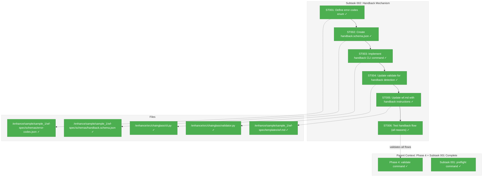
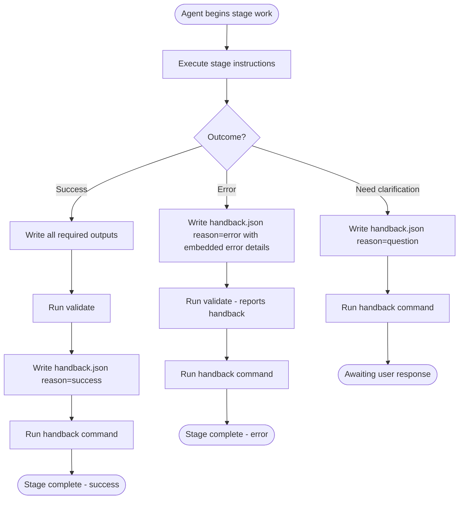
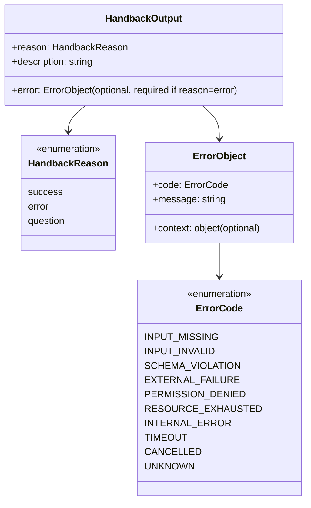

# Subtask 002: Handback Mechanism with Error Reporting

**Parent Plan:** [View Plan](../../first-wf-build-plan.md)
**Parent Phase:** Phase 4: Implement validate Command
**Parent Task(s):** Phase 4 complete; subtask extends phase with agent handback protocol
**Plan Task Reference:** [Phase 4 in Plan](../../first-wf-build-plan.md#phase-4-implement-validate-command)

**Why This Subtask:**
Currently, agents have no structured way to signal completion or report errors back to the workflow system. When work is complete (success, error, or question), there's no formal handback protocol. This subtask introduces a unified **handback mechanism** - a single `handback.json` file that agents write to signal completion, with structured reasons and embedded error details when applicable. Predefined error codes map to descriptions for consistent error reporting.

This enables the workflow system to understand agent state and provide better observability.

**Created:** 2026-01-19
**Requested By:** User (need structured handback protocol with error reporting)

---

## Executive Briefing

### Purpose
This subtask implements a unified **handback mechanism** for agent-to-workflow communication. Agents write a single `handback.json` file to signal completion with a structured reason (success, error, question). When the reason is `error`, the handback includes embedded error details with predefined error codes mapped to descriptions.

Without this, agents operate in a black box - the workflow system cannot distinguish between "agent succeeded", "agent failed", and "agent needs clarification".

### What We're Building

**Unified Handback Mechanism:**
- `error-codes.json` - Predefined enum of error codes with descriptions (e.g., `INPUT_MISSING`, `SCHEMA_VIOLATION`, `EXTERNAL_FAILURE`)
- `handback.schema.json` - JSON Schema for `handback.json` with embedded error fields
- `chainglass handback` CLI command that:
  - Reads `handback.json` from stage output
  - Validates handback structure
  - Echoes the handback to the user (with error code descriptions when applicable)
- Integration with `validate` command to detect and report handback presence
- wf.md instructions for agents on when/how to handback

### Unblocks
- Workflow observability: System can understand agent completion state
- Error handling: Structured errors enable automated retry/recovery decisions
- Human-in-the-loop: Questions trigger user interaction before proceeding

### Example

**Success handback:**
```json
{
  "reason": "success",
  "description": "Stage completed successfully. All outputs validated."
}
```

**Error handback (with embedded error details):**
```json
{
  "reason": "error",
  "description": "Stage failed due to external service unavailability.",
  "error": {
    "code": "EXTERNAL_FAILURE",
    "message": "Unable to reach FlowSpace MCP server after 3 retries",
    "context": {
      "service": "mcp__flowspace",
      "retries": 3,
      "last_error": "Connection timeout"
    }
  }
}
```

**Question handback:**
```json
{
  "reason": "question",
  "description": "Clarification needed: Should I include deprecated APIs in the research scope?"
}
```

**Command**: `chainglass handback explore --run-dir ./run/run-2026-01-19-007`

**Output (for error):**
```
Handback: explore
Reason: error
Description: Stage failed due to external service unavailability.
Error Code: EXTERNAL_FAILURE (External service or API failure outside agent control)
Error Message: Unable to reach FlowSpace MCP server after 3 retries
```

---

## Objectives & Scope

### Objective
Implement a unified handback mechanism so agents can communicate their completion state (success, error, question) to the workflow system. Update `validate` to detect handback presence and update `wf.md` to instruct agents on using this mechanism.

### Goals

- ✅ Create `error-codes.json` with predefined error code enum and descriptions
- ✅ Create `handback.schema.json` for validating agent-written `handback.json` files (with embedded error fields)
- ✅ Implement `chainglass handback` CLI command
- ✅ Update `validate` to detect and report handback.json presence
- ✅ Update `wf.md` template with handback instructions

### Non-Goals

- ❌ Automatic error recovery (system reports errors, doesn't fix)
- ❌ Workflow branching based on handback reason (future orchestration)
- ❌ Error aggregation across stages (stage-scoped only)
- ❌ Interactive question/answer flow (handback signals question, user responds externally)

---

## Architecture Map

### Component Diagram
<!-- Status: grey=pending, orange=in-progress, green=completed, red=blocked -->
<!-- Updated by plan-6 during implementation -->



### Task-to-Component Mapping

<!-- Status: ⬜ Pending | 🟧 In Progress | ✅ Complete | 🔴 Blocked -->

| Task | Component(s) | Files | Status | Comment |
|------|-------------|-------|--------|---------|
| ST001 | Error Codes Enum | /enhance/sample/sample_1/wf-spec/schemas/error-codes.json | ✅ Complete | Defines ERROR_CODES with code → description mapping |
| ST002 | Handback Schema | /enhance/sample/sample_1/wf-spec/schemas/handback.schema.json | ✅ Complete | JSON Schema with reason enum + embedded error object |
| ST003 | Handback CLI | /enhance/src/chainglass/cli.py | ✅ Complete | `chainglass handback` command that echoes handback.json |
| ST004 | Validate Handback Detection | /enhance/src/chainglass/validator.py | ✅ Complete | Detect handback.json, report in summary |
| ST005 | wf.md Template | /enhance/sample/sample_1/wf-spec/templates/wf.md | ✅ Complete | Add handback protocol section |
| ST006 | Test Handback Flow | -- | ✅ Complete | Manual test: all three reasons (success, error, question) |

---

## Tasks

| Status | ID | Task | CS | Type | Dependencies | Absolute Path(s) | Validation | Subtasks | Notes |
|--------|-----|------|----|------|--------------|------------------|------------|----------|-------|
| [x] | ST001 | Define error codes enum in error-codes.json | 2 | Setup | – | `/Users/jordanknight/github/tools/enhance/sample/sample_1/wf-spec/schemas/error-codes.json` | JSON parses; contains ERROR_CODES object with code→description | – | Codes: INPUT_MISSING, INPUT_INVALID, SCHEMA_VIOLATION, EXTERNAL_FAILURE, PERMISSION_DENIED, RESOURCE_EXHAUSTED, INTERNAL_ERROR, TIMEOUT, CANCELLED, UNKNOWN. **Also add to wf.yaml shared_templates.** |
| [x] | ST002 | Create handback.schema.json with embedded error object | 2 | Setup | ST001 | `/Users/jordanknight/github/tools/enhance/sample/sample_1/wf-spec/schemas/handback.schema.json` | Valid JSON Schema; requires reason (enum), description; error object required when reason=error | – | Reason enum: success, error, question. Error object has code, message, optional context. **Also add to wf.yaml shared_templates.** |
| [x] | ST003 | Implement handback CLI command in cli.py | 2 | Core | ST002 | `/Users/jordanknight/github/tools/enhance/src/chainglass/cli.py` | `chainglass handback --help` works; echoes handback.json content with error description | – | Match validate/preflight signature. **Load schemas from stage's schemas/ folder** (copied via shared_templates). |
| [x] | ST004 | Update validate to detect and report handback.json presence | 2 | Core | ST003 | `/Users/jordanknight/github/tools/enhance/src/chainglass/validator.py` | Validate reports "Handback: [reason]" when handback.json exists; warns if missing | – | **If missing: emit warning** (not failure). If present: validate and report reason. |
| [x] | ST005 | Update wf.md template with handback instructions | 2 | Docs | ST004 | `/Users/jordanknight/github/tools/enhance/sample/sample_1/wf-spec/templates/wf.md` | wf.md contains "Handback Protocol" section | – | Clear instructions on when/how to write handback.json |
| [x] | ST006 | Manual test: write handback.json, run validate and handback for all three reasons | 2 | Test | ST005 | `/Users/jordanknight/github/tools/enhance/sample/sample_1/runs/run-2026-01-19-007/` | Handback echoes correctly for success, error (with code description), and question | – | Test all three reasons; verify error details are displayed |

---

## Alignment Brief

### Objective Recap

This subtask extends Phase 4 by adding structured agent-to-workflow communication. While `validate` and `preflight` help agents verify stage state, there's no way for agents to communicate *their* state back. This subtask adds:

1. **Unified handback** - Single `handback.json` file signals completion with reason (success/error/question) and embedded error details when applicable

**Acceptance Checklist**:
- [x] error-codes.json defines 10 error codes with descriptions
- [x] handback.schema.json validates handback.json structure (with embedded error object)
- [x] `chainglass handback <stage_id> --run-dir <path>` echoes handback with error description
- [x] `chainglass validate` reports handback.json presence in summary
- [x] wf.md instructs agents on handback protocol
- [x] ST006: Handback flow tests pass for all three reasons (success, error, question)

---

### Design Decisions

#### Error Codes Enum

The error codes are designed to be:
1. **Agent-agnostic** - Not tied to specific LLM capabilities
2. **Actionable** - Each code suggests a category of fix
3. **Extensible** - Can add codes without breaking existing usage

**Proposed Error Codes:**

| Code | Description | When to Use |
|------|-------------|-------------|
| `INPUT_MISSING` | Required input file does not exist | Preflight should catch, but agent may discover at runtime |
| `INPUT_INVALID` | Input file exists but content is invalid or unusable | Malformed JSON, unexpected format, etc. |
| `SCHEMA_VIOLATION` | Output file fails schema validation | Agent self-checks before handback |
| `EXTERNAL_FAILURE` | External service or API failure outside agent control | MCP server down, network error, etc. |
| `PERMISSION_DENIED` | Insufficient permissions for required operation | File access, API auth, etc. |
| `RESOURCE_EXHAUSTED` | Resource limit exceeded | Token limit, memory, disk space |
| `INTERNAL_ERROR` | Unexpected internal error in agent logic | Catch-all for agent bugs |
| `TIMEOUT` | Operation exceeded time limit | Long-running operations |
| `CANCELLED` | Operation was cancelled by user or system | Explicit cancellation signal |
| `UNKNOWN` | Error category cannot be determined | Last resort fallback |

#### Handback Reasons

Three mutually exclusive reasons:

| Reason | When to Use | Triggers |
|--------|-------------|----------|
| `success` | Stage completed successfully, all outputs valid | Workflow can proceed to next stage |
| `error` | Stage failed, cannot continue | Workflow should stop, report error |
| `question` | Agent needs clarification before proceeding | User interaction required |

#### Unified Handback Structure

The `handback.json` file contains everything:
- `reason` - success, error, or question
- `description` - human-readable explanation
- `error` object (required when reason=error) with:
  - `code` - error code from error-codes.json
  - `message` - detailed error message
  - `context` - optional structured context

This means agents write ONE file that captures their completion state and any error details.

#### Handback Command Behavior

The `handback` command is intentionally simple - it just echoes. This keeps the agent workflow clean:

1. Agent writes `handback.json` to `run/output-data/`
2. Agent calls `chainglass handback <stage> --run-dir <path>`
3. Command reads and validates `handback.json`
4. Command echoes content to stdout (for user visibility)
5. If reason=error, also echoes error code description from error-codes.json
6. Command always exits 0; reason is a string constant ("success" | "error" | "question") in JSON output

The command does NOT:
- Modify any files
- Update wf-run.json status (that's `finalize`)
- Make orchestration decisions (that's the workflow system)

#### Validate + Handback Detection

When `validate` runs:

**If handback.json is MISSING:**
1. Emit warning: "Warning: handback.json not found - remember to write handback.json before calling handback command"
2. Continue validating other outputs (missing handback does NOT cause failure)

**If handback.json EXISTS:**
1. Validate handback.json against handback.schema.json
2. If valid: Report "Handback: [reason]" in summary
3. If reason=error: Include error code and message in report
4. Continue validating other outputs (collect all errors)
5. Overall status still reflects output validation (handback doesn't change pass/fail)

This means:
- Handback.json missing → Warning only, validate can still PASS
- Agent can handback error AND have missing outputs → Both reported
- Agent handbacks success and all outputs valid → "Handback: success" + PASS
- Handback.json invalid → Schema validation error on handback.json itself

---

### Critical Findings Affecting This Subtask

| Finding | Impact | How Addressed |
|---------|--------|---------------|
| **User requirement: Predefined ENUMs** | Error codes must be predefined, not ad-hoc | Create error-codes.json with fixed enum |
| **User requirement: Mapped to descriptions** | Codes need human-readable explanations | error-codes.json contains code→description mapping |
| **User requirement: Handback does nothing but echo** | Keep handback simple, no side effects | Command only reads and echoes, no file modifications |
| **User requirement: Handback reasons: error, success, question** | Three distinct completion states | handback.schema.json enum with three values |
| **User requirement: Combined error+handback** | Single file simplifies agent workflow | Error details embedded in handback.json when reason=error |
| **User requirement: Baked into wf.md** | Agents must know how to use these | Update wf.md with clear instructions |
| **didyouknow: String constants, not numeric exit codes** | Exit codes 0/1/2 break Unix convention | Command always exits 0; reason is string constant in JSON output |
| **didyouknow: Schemas copied via shared_templates** | Handback command needs schema access | Add schemas to wf.yaml shared_templates; load from stage's schemas/ folder |
| **didyouknow: Handback optional for validate, warn if missing** | Validate must work before handback written | If missing: emit warning. If present: validate and report. Missing doesn't cause failure. |
| **didyouknow: handback.json vs wf-result.json distinction** | Two files with different purposes | handback.json = agent↔orchestrator flow control. wf-result.json = stage metadata (modifiable by agent OR orchestrator). Document in wf.md. |
| **didyouknow: Error codes in two places is intentional** | Schema enum + error-codes.json descriptions | Keep duplication - schema is self-contained, follows codebase pattern, error codes are stable. Update both files when adding codes. |

---

### Invariants & Guardrails

1. **Error codes are fixed** - error-codes.json is not modified at runtime
2. **Handback is idempotent** - Running handback multiple times has no side effects
3. **Validate doesn't fail on error.json presence** - Error acknowledgment is informational
4. **Path Safety** - All paths validated with `is_relative_to()` (inherited from Phase 4)
5. **Exit Codes**: handback always exits 0; reason is a string constant in structured JSON output

---

### Inputs to Read

| File | Purpose |
|------|---------|
| `/Users/jordanknight/github/tools/enhance/src/chainglass/validator.py` | Pattern for schema validation, result structure |
| `/Users/jordanknight/github/tools/enhance/src/chainglass/cli.py` | Pattern for CLI commands |
| `/Users/jordanknight/github/tools/enhance/sample/sample_1/wf-spec/templates/wf.md` | Template to update |
| `/Users/jordanknight/github/tools/enhance/sample/sample_1/wf-spec/schemas/wf-result.schema.json` | Pattern for shared schemas |

---

### Visual Aids

#### Handback Flow



#### handback.json Structure



---

### Test Plan

**Manual Testing Only** (per project guidelines):

1. **Test Handback - Success (ST006a)**:
   - Write handback.json with reason=success
   - Run `chainglass validate explore --run-dir <path>` - should report "Handback: success"
   - Run `chainglass handback explore --run-dir <path>`
   - Expected: Echoes reason and description, exit code 0

2. **Test Handback - Error (ST006b)**:
   - Write handback.json with reason=error and embedded error object
   - Run validate - should report "Handback: error" with error details
   - Run handback
   - Expected: Echoes reason, description, error code, AND error code description from error-codes.json; exit code 0, JSON has reason="error"

3. **Test Handback - Question (ST006c)**:
   - Write handback.json with reason=question
   - Run validate - should report "Handback: question"
   - Run handback
   - Expected: Echoes reason and description; exit code 0, JSON has reason="question"

4. **Test Handback - Invalid (ST006d)**:
   - Write invalid handback.json (missing required field or reason=error without error object)
   - Run validate
   - Expected: Schema validation error on handback.json

5. **Test Validate - Missing Handback (ST006e)**:
   - Ensure handback.json does NOT exist in output-data/
   - Run validate with valid outputs
   - Expected: Validate PASSES with warning "handback.json not found"

6. **Test wf.md Update**:
   - Compose a new run
   - Verify `prompt/wf.md` contains handback instructions

---

### Implementation Outline

| Step | Task | Details |
|------|------|---------|
| 1 | ST001 | Create error-codes.json with ERROR_CODES object mapping codes to descriptions |
| 2 | ST002 | Create handback.schema.json with required fields: reason (enum), description; error object (required when reason=error) |
| 3 | ST003 | Add `handback_cmd()` to cli.py - reads handback.json, loads error-codes.json for description, echoes |
| 4 | ST004 | Update `validate_stage()` to detect handback.json, validate it, add to result summary |
| 5 | ST005 | Add "Handback Protocol" section to wf.md |
| 6 | ST006 | Manual test handback.json flow with all three reasons (success, error, question) |

---

### Commands to Run

```bash
# Development environment
cd /Users/jordanknight/github/tools/enhance
source .venv/bin/activate  # if using venv

# After implementation - verify help
uv run chainglass handback --help

# ST006a: Test handback - success
cat > ./sample/sample_1/runs/run-2026-01-19-007/stages/explore/run/output-data/handback.json << 'EOF'
{
  "reason": "success",
  "description": "Stage completed successfully. All outputs validated."
}
EOF

# Run validate - should report "Handback: success"
uv run chainglass validate explore --run-dir ./sample/sample_1/runs/run-2026-01-19-007

# Run handback - expected: exit code 0
uv run chainglass handback explore --run-dir ./sample/sample_1/runs/run-2026-01-19-007

# ST006b: Test handback - error (with embedded error details)
cat > ./sample/sample_1/runs/run-2026-01-19-007/stages/explore/run/output-data/handback.json << 'EOF'
{
  "reason": "error",
  "description": "Stage failed due to external service unavailability.",
  "error": {
    "code": "EXTERNAL_FAILURE",
    "message": "Unable to reach FlowSpace MCP server after 3 retries",
    "context": {
      "service": "mcp__flowspace",
      "retries": 3
    }
  }
}
EOF

# Run validate - should report "Handback: error" with error details
uv run chainglass validate explore --run-dir ./sample/sample_1/runs/run-2026-01-19-007

# Run handback - expected: exit code 0, JSON reason="error", shows error code description
uv run chainglass handback explore --run-dir ./sample/sample_1/runs/run-2026-01-19-007

# ST006c: Test handback - question
cat > ./sample/sample_1/runs/run-2026-01-19-007/stages/explore/run/output-data/handback.json << 'EOF'
{
  "reason": "question",
  "description": "Clarification needed: Should I include deprecated APIs in the research scope?"
}
EOF

# Run validate - should report "Handback: question"
uv run chainglass validate explore --run-dir ./sample/sample_1/runs/run-2026-01-19-007

# Run handback - expected: exit code 0, JSON reason="question"
uv run chainglass handback explore --run-dir ./sample/sample_1/runs/run-2026-01-19-007
```

---

### Risks & Unknowns

| Risk | Likelihood | Impact | Mitigation |
|------|------------|--------|------------|
| Error codes insufficient for all failure modes | Medium | Low | UNKNOWN code as catch-all; can extend later |
| Agents forget to call handback | Medium | Medium | wf.md emphasizes handback as final step |
| Handback exit codes conflict with shell conventions | Low | Low | Document clearly; 0/1/2 is conventional |
| validate + error.json interaction confusing | Medium | Medium | Clear documentation in wf.md |

---

### Ready Check

- [ ] Parent phase (Phase 4) understood
- [ ] Subtask 001 (preflight) pattern reviewed
- [ ] validator.py pattern understood
- [ ] cli.py command pattern understood
- [ ] wf.md current structure understood
- [ ] Test run folder available (run-2026-01-19-007)

**Gate**: Awaiting ready check completion before implementation

---

## Phase Footnote Stubs

| Ref | Date | Change | Rationale |
|-----|------|--------|-----------|
| | | | |

---

## Evidence Artifacts

**Execution Log**: `002-subtask-error-output-and-handback.execution.log.md` (created by plan-6)

**Files to Create:**
- `/Users/jordanknight/github/tools/enhance/sample/sample_1/wf-spec/schemas/error-codes.json` (new)
- `/Users/jordanknight/github/tools/enhance/sample/sample_1/wf-spec/schemas/handback.schema.json` (new)

**Files to Modify:**
- `/Users/jordanknight/github/tools/enhance/src/chainglass/cli.py` (add handback command)
- `/Users/jordanknight/github/tools/enhance/src/chainglass/validator.py` (add handback detection)
- `/Users/jordanknight/github/tools/enhance/sample/sample_1/wf-spec/templates/wf.md` (add instructions)
- `/Users/jordanknight/github/tools/enhance/sample/sample_1/wf-spec/wf.yaml` (add shared_templates for handback.schema.json and error-codes.json)

---

## Discoveries & Learnings

_Populated during implementation by plan-6. Log anything of interest to your future self._

| Date | Task | Type | Discovery | Resolution | References |
|------|------|------|-----------|------------|------------|
| | | | | | |

**Types**: `gotcha` | `research-needed` | `unexpected-behavior` | `workaround` | `decision` | `debt` | `insight`

**What to log**:
- Things that didn't work as expected
- External research that was required
- Implementation troubles and how they were resolved
- Gotchas and edge cases discovered
- Decisions made during implementation
- Technical debt introduced (and why)
- Insights that future phases should know about

_See also: `execution.log.md` for detailed narrative._

---

## After Subtask Completion

**This subtask extends:**
- Parent Phase: Phase 4: Implement validate Command
- Plan: first-wf-build-plan.md

**When all ST### tasks complete:**

1. **Record completion** in parent execution log:
   ```
   ### Subtask 002-subtask-error-output-and-handback Complete

   Resolved: Added error output mechanism and handback command
   See detailed log: [subtask execution log](./002-subtask-error-output-and-handback.execution.log.md)
   ```

2. **Update parent phase Subtasks table**:
   - Add row for this subtask with status [x] Complete

3. **Resume or complete:**
   - If more subtasks needed: Create via `/plan-5a-subtask-tasks-and-brief`
   - If phase fully complete: Update Global Acceptance Criteria in plan

**Quick Links:**
- [Parent Dossier](./tasks.md)
- [Parent Plan](../../first-wf-build-plan.md)
- [Parent Execution Log](./execution.log.md)

---

## Directory Structure

After subtask completion:

```
docs/plans/010-first-wf-build/tasks/phase-4-implement-validate-command/
├── tasks.md                                           # Parent phase dossier
├── execution.log.md                                   # Parent phase log
├── 001-subtask-preflight-command.md                   # Subtask 001 dossier
├── 001-subtask-preflight-command.execution.log.md     # Subtask 001 log
├── 002-subtask-error-output-and-handback.md           # THIS FILE
└── 002-subtask-error-output-and-handback.execution.log.md  # Subtask log (created by plan-6)
```

---

## Schema Definitions (Reference)

### error-codes.json

A simple key-value lookup file (not a JSON Schema):

```json
{
  "ERROR_CODES": {
    "INPUT_MISSING": "Required input file does not exist",
    "INPUT_INVALID": "Input file exists but content is invalid or unusable",
    "SCHEMA_VIOLATION": "Output file fails JSON Schema validation",
    "EXTERNAL_FAILURE": "External service or API failure outside agent control",
    "PERMISSION_DENIED": "Insufficient permissions for required operation",
    "RESOURCE_EXHAUSTED": "Resource limit exceeded (tokens, memory, disk)",
    "INTERNAL_ERROR": "Unexpected internal error in agent logic",
    "TIMEOUT": "Operation exceeded time limit",
    "CANCELLED": "Operation was cancelled by user or system",
    "UNKNOWN": "Error category cannot be determined"
  }
}
```

### handback.schema.json

```json
{
  "$schema": "https://json-schema.org/draft/2020-12/schema",
  "$id": "handback.schema.json",
  "title": "Handback Output Schema",
  "description": "Schema for agent-written handback.json files with embedded error details",
  "type": "object",
  "required": ["reason", "description"],
  "properties": {
    "reason": {
      "type": "string",
      "enum": ["success", "error", "question"],
      "description": "Completion reason: success (all done), error (failed), question (need clarification)"
    },
    "description": {
      "type": "string",
      "minLength": 1,
      "description": "Human-readable description of the handback reason"
    },
    "error": {
      "type": "object",
      "description": "Error details (required when reason=error)",
      "required": ["code", "message"],
      "properties": {
        "code": {
          "type": "string",
          "enum": ["INPUT_MISSING", "INPUT_INVALID", "SCHEMA_VIOLATION", "EXTERNAL_FAILURE", "PERMISSION_DENIED", "RESOURCE_EXHAUSTED", "INTERNAL_ERROR", "TIMEOUT", "CANCELLED", "UNKNOWN"],
          "description": "Error code from error-codes.json"
        },
        "message": {
          "type": "string",
          "minLength": 1,
          "description": "Human-readable error message with context"
        },
        "context": {
          "type": "object",
          "description": "Optional additional context (service name, retry count, etc.)",
          "additionalProperties": true
        }
      },
      "additionalProperties": false
    }
  },
  "additionalProperties": false,
  "if": {
    "properties": { "reason": { "const": "error" } }
  },
  "then": {
    "required": ["error"]
  }
}
```

---

## wf.md Updates (Reference)

Add the following section to wf.md after "Stage Completion":

```markdown
## Handback Protocol

When you're done with the stage (success, error, or question), you MUST handback:

### Success Handback
```json
{
  "reason": "success",
  "description": "Stage completed successfully. All outputs validated."
}
```

### Error Handback (with embedded error details)
```json
{
  "reason": "error",
  "description": "Brief summary of what went wrong",
  "error": {
    "code": "<ERROR_CODE>",
    "message": "Detailed error message",
    "context": { "optional": "additional context" }
  }
}
```

**Error codes** (use the most specific one):
- `INPUT_MISSING` - Required input file doesn't exist
- `INPUT_INVALID` - Input exists but is malformed/unusable
- `SCHEMA_VIOLATION` - Your output fails schema validation
- `EXTERNAL_FAILURE` - External service/API failed (not your fault)
- `PERMISSION_DENIED` - Can't access required resource
- `RESOURCE_EXHAUSTED` - Hit a limit (tokens, memory, etc.)
- `INTERNAL_ERROR` - Bug in your logic
- `TIMEOUT` - Operation took too long
- `CANCELLED` - User/system cancelled
- `UNKNOWN` - Can't categorize the error

### Question Handback (need clarification)
```json
{
  "reason": "question",
  "description": "What clarification do you need from the user?"
}
```

### Handback Steps

1. **Write handback.json** to `../run/output-data/handback.json`

2. **Call handback command**:
   ```bash
   uv run chainglass handback <stage_id> --run-dir ../../
   ```

3. **Output**: Command always exits 0. The JSON output contains the reason as a string constant:
   - `"reason": "success"` - workflow can proceed
   - `"reason": "error"` - workflow should stop
   - `"reason": "question"` - user response needed

**Always handback** - Even on error, write the handback so the workflow system knows you're done.

### handback.json vs wf-result.json

These are **distinct files** with different purposes:

| File | Purpose | Who Modifies | Contains |
|------|---------|--------------|----------|
| `handback.json` | **Flow control** between agent and orchestrator | Agent only | reason, error details, questions |
| `wf-result.json` | **Stage metadata** and completion status | Agent OR orchestrator | status, metrics, timestamps |

Write BOTH files:
- `wf-result.json` records what happened to the stage
- `handback.json` signals why and what's needed next
```

---

## Critical Insights Discussion

**Session**: 2026-01-20
**Context**: Subtask 002 - Handback Mechanism with Error Reporting
**Analyst**: AI Clarity Agent
**Reviewer**: Development Team
**Format**: Water Cooler Conversation (5 Critical Insights)

### Insight 1: Exit Code Convention

**Did you know**: The proposed exit codes (0=success, 1=error, 2=question) violate Unix conventions where exit code 2 means "command-line syntax error".

**Implications**:
- Shell scripts can't reliably distinguish error from question
- All 10 existing CLI commands use only 0/1 exit codes
- No precedent in codebase for three-way exit outcomes

**Options Considered**:
- Option A: Use 0/1/2 as designed - Partial feasibility, breaks convention
- Option B: Use 0/1/1 (binary) - Feasible, matches existing pattern
- Option C: Exit 0 always, status in JSON - Feasible, structured output

**AI Recommendation**: Option B (0/1/1)

**Discussion Summary**: User specified "codes will be string CONST please... not numbers" - preferring explicit string constants over numeric exit codes.

**Decision**: Exit 0 always; reason is a string constant ("success" | "error" | "question") in JSON output

**Action Items**:
- [x] Updated handback command behavior section
- [x] Updated test plan expectations
- [x] Updated wf.md reference

**Affects**: ST003, Test Plan, wf.md Updates

---

### Insight 2: Schema Location for Handback Command

**Did you know**: The handback command needs to validate against handback.schema.json, but schemas live in wf-spec while the command runs from a run directory context.

**Implications**:
- Command needs clear schema resolution strategy
- error-codes.json also needs to be loadable for description lookup
- Current validate resolves schemas via stage-config.yaml output declarations

**Options Considered**:
- Option A: Embed schemas in Python package - Feasible but duplicates
- Option B: Resolve from wf-spec via run directory - Feasible, follows pattern
- Option C: Copy schemas to run/schemas/ during compose - Feasible, self-contained runs

**AI Recommendation**: Option B (resolve from wf-spec)

**Discussion Summary**: User directed to "review how we copy other schemas" via subagent. Found two mechanisms: stage-specific (automatic) and shared_templates (declared in wf.yaml).

**Decision**: Copy schemas via shared_templates in wf.yaml (Option C)

**Action Items**:
- [x] Add handback.schema.json to wf.yaml shared_templates
- [x] Add error-codes.json to wf.yaml shared_templates
- [x] Updated ST001, ST002, ST003 notes
- [x] Added wf.yaml to files to modify

**Affects**: ST001, ST002, ST003, wf.yaml

---

### Insight 3: Validate and Handback.json Interaction

**Did you know**: There's ambiguity about whether validate should REQUIRE handback.json to exist, creating a chicken-and-egg problem where agent can't validate before deciding success/error.

**Implications**:
- Agent needs validation result to write correct handback reason
- If validate requires handback, agent can't check outputs first
- Workflow sequence matters: validate → handback

**Options Considered**:
- Option A: Handback.json OPTIONAL for validate - Feasible, supports workflow
- Option B: Two-phase validation with flag - Feasible, adds complexity
- Option C: Handback.json REQUIRED - Not recommended, breaks workflow

**AI Recommendation**: Option A (optional)

**Discussion Summary**: User agreed with Option A but specified handback should "report if its missing as a warning".

**Decision**: Handback.json is optional; validate warns if missing but doesn't fail

**Action Items**:
- [x] Updated Validate + Handback Detection section
- [x] Updated ST004 task notes
- [x] Added ST006e test case for missing handback warning

**Affects**: ST004, Test Plan

---

### Insight 4: wf-result.json vs handback.json Overlap

**Did you know**: The workflow already has wf-result.json for stage completion status, and now we're adding handback.json - both capture "did the stage succeed or fail" but with different schemas.

**Implications**:
- Two files with similar but not identical completion states
- Agents must write BOTH files correctly
- Potential for inconsistency between files

**Options Considered**:
- Option A: Keep both, document distinction - Feasible, separation of concerns
- Option B: Merge into wf-result.json - Not feasible, breaking change
- Option C: Replace wf-result with handback - Not feasible, loses metadata

**AI Recommendation**: Option A (keep both)

**Discussion Summary**: User clarified: "Handback controls flow between agent and orchestrator. Agent or orchestrator may modify wf-result.json which is to do with the stage itself... a distinct concept."

**Decision**: Keep both files - handback.json is flow control, wf-result.json is stage metadata

**Action Items**:
- [x] Added comparison table to wf.md Updates section
- [x] Documented distinction in Critical Findings

**Affects**: ST005 (wf.md documentation)

---

### Insight 5: Error Codes Duplication

**Did you know**: Error codes are defined in TWO places (error-codes.json for descriptions, handback.schema.json for enum validation) - adding a new code requires updating both files.

**Implications**:
- Two sources of truth that must stay synchronized
- Schema enum provides validation, error-codes.json provides descriptions
- No automated check that they match

**Options Considered**:
- Option A: Keep duplication (as designed) - Feasible, follows pattern
- Option B: Generate schema from error-codes.json - Not feasible, needs build pipeline
- Option C: Remove enum from schema - Feasible but loses validation

**AI Recommendation**: Option A (keep duplication)

**Discussion Summary**: User confirmed Option A.

**Decision**: Keep duplication - schema is self-contained, follows codebase pattern, error codes are stable

**Action Items**: None - already designed this way

**Affects**: No changes needed

---

## Session Summary

**Insights Surfaced**: 5 critical insights identified and discussed
**Decisions Made**: 5 decisions reached through collaborative discussion
**Action Items Created**: 12 follow-up items identified (all completed during session)
**Areas Updated**:
- Handback command behavior (exit codes → string constants)
- Schema loading (shared_templates in wf.yaml)
- Validate behavior (warn if handback missing)
- wf.md documentation (file distinction table)
- Critical Findings table (5 new entries)

**Shared Understanding Achieved**: ✓

**Confidence Level**: High - Key architectural decisions clarified, all concerns addressed

**Next Steps**:
Proceed to implementation with `/plan-6-implement-phase --subtask 002-subtask-error-output-and-handback`
