# Subtask 003: Filesystem-Based State Machine for Accept/Handback

**Parent Plan:** [View Plan](../../first-wf-build-plan.md)
**Parent Phase:** Phase 4: Implement validate Command
**Parent Task(s):** [002-subtask-error-output-and-handback](./002-subtask-error-output-and-handback.md)
**Plan Task Reference:** [Phase 4 in Plan](../../first-wf-build-plan.md#phase-4-implement-validate-command)

**Why This Subtask:**
Create a simple filesystem-based state machine that explicitly tracks control flow between orchestrator and agent. The state should be readable by both agents (LLMs) and classic code (Python CLI). This builds on the handback mechanism (subtask 002) by adding explicit "accept" signaling.

**Created:** 2026-01-20
**Requested By:** User (workflow state design workshop)

---

## Executive Briefing

### Purpose

This subtask implements a **simple filesystem-based state machine** that tracks who currently controls a workflow stage: the orchestrator or the agent. Currently, control handoff is implicit (preflight pass = "go ahead"). This makes control explicit, auditable, and readable by any system.

### What We're Building

A bidirectional control protocol using two JSON files:

| File | Written By | Purpose | When |
|------|-----------|---------|------|
| `accept.json` | Orchestrator | Grant control to agent | Before stage execution |
| `handback.json` | Agent | Return control to orchestrator | After stage execution |

The state machine is intentionally **simple**:
- State is encoded in file presence and content
- Any system can read the files to determine current state
- No database, no in-memory state, no complex coordination

### Unblocks

- Future orchestrator implementations (classic code can read state files)
- Human-in-the-loop workflows (clear gate for approval before agent proceeds)
- Debugging and auditability (timestamped state transitions)

### Example

**1. Orchestrator grants control:**
```bash
$ chainglass accept explore --run-dir ./run/run-2026-01-20-001
Accept: explore
State: agent
Timestamp: 2026-01-20T10:02:00Z
```

Creates: `stages/explore/run/output-data/accept.json`
```json
{
  "state": "agent",
  "timestamp": "2026-01-20T10:02:00Z"
}
```

**2. Agent completes work and hands back control:**
```bash
$ chainglass handback explore --run-dir ./run/run-2026-01-20-001
Handback: explore
Reason: success
Description: Stage completed successfully.
State: agent → orchestrator
  Accepted at: 2026-01-20T10:02:00Z
  Handed back: 2026-01-20T10:15:00Z
```

Creates: `stages/explore/run/output-data/handback.json`
```json
{
  "reason": "success",
  "description": "Stage completed successfully."
}
```

**Cohesive Experience**: Both commands show state context, making control flow visible to agents and orchestrators alike.

---

## Objectives & Scope

### Objective

Add explicit filesystem-based state tracking via `accept.json` that complements the existing `handback.json` mechanism, creating a simple bidirectional control protocol.

### Goals

- ✅ Create accept.schema.json (mirrors handback.schema.json simplicity)
- ✅ Implement `chainglass accept` CLI command (reentrant and idempotent)
- ✅ Report accept.json status in preflight output (informational, not blocking)
- ✅ Display accept status in validate output (informational)
- ✅ **Enhance handback command** to report accept.json status and display state transition
- ✅ Update wf.md Handback Protocol with Accept subsection (keep simple, no jargon)
- ✅ Manual test full accept → work → handback cycle

### Non-Goals

- ❌ Complex state machine with many states (keep it simple: just "agent" or "orchestrator")
- ❌ State persistence in wf-run.json (state lives in accept.json/handback.json files)
- ❌ Automatic state transitions (orchestrator explicitly calls accept, agent explicitly calls handback)
- ❌ Real-time state change notifications (file-based polling is sufficient)
- ❌ Enforcement flags (--skip-accept-check, --require-accept) - KISS, just report what we see

---

## Architecture Map

### Component Diagram

```mermaid
flowchart TD
    classDef pending fill:#9E9E9E,stroke:#757575,color:#fff
    classDef inprogress fill:#FF9800,stroke:#F57C00,color:#fff
    classDef completed fill:#4CAF50,stroke:#388E3C,color:#fff
    classDef blocked fill:#F44336,stroke:#D32F2F,color:#fff

    style Parent fill:#F5F5F5,stroke:#E0E0E0
    style Subtask fill:#F5F5F5,stroke:#E0E0E0
    style Files fill:#F5F5F5,stroke:#E0E0E0
    style State fill:#E3F2FD,stroke:#1976D2

    subgraph Parent["Parent Context"]
        S002["002-subtask: handback.json ✓"]:::completed
    end

    subgraph Subtask["Subtask 003: Filesystem State Machine"]
        ST001["ST001: Create accept.schema.json ✓"]:::completed
        ST002["ST002: Implement accept CLI command ✓"]:::completed
        ST003["ST003: Add AcceptInfo dataclass ✓"]:::completed
        ST004["ST004: Enhance preflight with accept check ✓"]:::completed
        ST005["ST005: Display accept in validate ✓"]:::completed
        ST006["ST006: Enhance handback with accept verification ✓"]:::completed
        ST007["ST007: Add state transition display to handback ✓"]:::completed
        ST008["ST008: Update wf.md with unified state docs ✓"]:::completed
        ST009["ST009: Manual test full state machine cycle ✓"]:::completed

        ST001 --> ST002 --> ST003
        ST003 --> ST004
        ST003 --> ST005
        ST003 --> ST006
        ST006 --> ST007
        ST004 --> ST008
        ST005 --> ST008
        ST007 --> ST008
        ST008 --> ST009
    end

    subgraph Files["Files"]
        F1["/wf-spec/schemas/accept.schema.json ✓"]:::completed
        F2["/src/chainglass/cli.py ✓"]:::completed
        F3["/src/chainglass/validator.py ✓"]:::completed
        F4["/src/chainglass/preflight.py ✓"]:::completed
        F5["/wf-spec/templates/wf.md ✓"]:::completed
    end

    subgraph State["State Files (Runtime)"]
        S1["accept.json (written by orchestrator)"]:::pending
        S2["handback.json (written by agent)"]:::pending
    end

    ST001 -.-> F1
    ST002 -.-> F2
    ST003 -.-> F3
    ST004 -.-> F4
    ST005 -.-> F3
    ST006 -.-> F2
    ST007 -.-> F2
    ST008 -.-> F5
    ST009 -.->|validates| S1
    ST009 -.->|validates| S2
    S002 -.->|provides| S2
```

<!-- Status: grey=pending, orange=in-progress, green=completed, red=blocked -->
<!-- Updated by plan-6 during implementation -->



### Task-to-Component Mapping

<!-- Status: ⬜ Pending | 🟧 In Progress | ✅ Complete | 🔴 Blocked -->

| Task | Component(s) | Files | Status | Comment |
|------|-------------|-------|--------|---------|
| ST001 | Accept Schema | /enhance/sample/sample_1/wf-spec/schemas/accept.schema.json | ✅ Complete | JSON Schema for accept.json |
| ST002 | Accept CLI | /enhance/src/chainglass/cli.py | ✅ Complete | New `accept` command |
| ST003 | AcceptInfo | /enhance/src/chainglass/validator.py | ✅ Complete | Full parity: present, state, timestamp, valid, warning |
| ST004 | Preflight Check | /enhance/src/chainglass/preflight.py | ✅ Complete | Formal PreflightCheck (accept_present), informational |
| ST005 | Validate Display | /enhance/src/chainglass/validator.py, cli.py | ✅ Complete | Show accept status in output |
| ST006 | Handback Accept Report | /enhance/src/chainglass/cli.py | ✅ Complete | Report accept.json status (informational) |
| ST007 | Handback State Display | /enhance/src/chainglass/cli.py | ✅ Complete | Show state transition in handback output |
| ST008 | Documentation | /enhance/sample/sample_1/wf-spec/templates/wf.md | ✅ Complete | Add Accept subsection to Handback Protocol |
| ST009 | Manual Testing | -- | ✅ Complete | Full cycle: accept → work → handback |

---

## Tasks

| Status | ID | Task | CS | Type | Dependencies | Absolute Path(s) | Validation | Subtasks | Notes |
|--------|-----|------|----|------|--------------|------------------|------------|----------|-------|
| [x] | ST001 | Create accept.schema.json with state enum and timestamp | 1 | Setup | – | `/Users/jordanknight/github/tools/enhance/sample/sample_1/wf-spec/schemas/accept.schema.json` | Valid JSON Schema; state enum = ["agent"] | – | Simple schema, mirrors handback pattern |
| [x] | ST002 | Implement `chainglass accept` CLI command | 2 | Core | ST001 | `/Users/jordanknight/github/tools/enhance/src/chainglass/cli.py` | `chainglass accept --help` works; writes accept.json | – | Always exit 0; state in JSON |
| [x] | ST003 | Add AcceptInfo dataclass to validator.py | 2 | Core | – | `/Users/jordanknight/github/tools/enhance/src/chainglass/validator.py` | Can import AcceptInfo | – | Full parity with HandbackInfo: present, state, timestamp, valid, warning |
| [x] | ST004 | Enhance preflight to report accept.json status | 1 | Core | ST002, ST003 | `/Users/jordanknight/github/tools/enhance/src/chainglass/preflight.py` | Preflight output shows "Accept: PRESENT/ABSENT" | – | Informational only, no enforcement |
| [x] | ST005 | Display accept status in validate command output | 1 | Core | ST003 | `/Users/jordanknight/github/tools/enhance/src/chainglass/cli.py`, `/Users/jordanknight/github/tools/enhance/src/chainglass/validator.py` | Validate output shows "Accept: PRESENT/ABSENT" | – | Informational, not blocking |
| [x] | ST006 | Enhance handback to report accept.json status | 1 | Core | ST003 | `/Users/jordanknight/github/tools/enhance/src/chainglass/cli.py` | Handback output shows accept status | – | Informational only, no enforcement |
| [x] | ST007 | Add state transition display to handback output | 1 | Core | ST006 | `/Users/jordanknight/github/tools/enhance/src/chainglass/cli.py` | Handback shows "State: agent → orchestrator" | – | Clear visual of control transfer |
| [x] | ST008 | Update wf.md Handback Protocol with Accept subsection | 2 | Docs | ST004, ST005, ST007 | `/Users/jordanknight/github/tools/enhance/sample/sample_1/wf-spec/templates/wf.md` | wf.md Handback Protocol covers accept + handback flow | – | Keep simple, no "state machine" jargon |
| [x] | ST009 | Manual test: full accept → work → handback cycle | 2 | Test | ST001-ST008 | – | accept.json created; preflight validates; handback shows transition | – | Use new compose run |

---

## Alignment Brief

### Objective Recap

Extend the handback mechanism (subtask 002) with explicit accept signaling, creating a simple filesystem-based state machine:

1. **Orchestrator grants control**: Writes `accept.json` with `state: "agent"`
2. **Agent executes**: Works on stage (reads accept.json to confirm permission)
3. **Agent returns control**: Writes `handback.json` with `reason: "success|error|question"`

### Acceptance Criteria Checklist

- [ ] **ST-AC-01**: accept.schema.json exists and validates accept.json files
- [ ] **ST-AC-02**: `chainglass accept <stage_id> --run-dir <path>` writes accept.json (reentrant, idempotent)
- [ ] **ST-AC-03**: AcceptInfo dataclass captures accept.json state
- [ ] **ST-AC-04**: Preflight reports accept.json status in output (informational, not blocking)
- [ ] **ST-AC-05**: Validate command displays accept status (informational)
- [ ] **ST-AC-06**: Handback command reports accept.json status in output (informational)
- [ ] **ST-AC-07**: Handback command displays state transition ("State: agent → orchestrator")
- [ ] **ST-AC-08**: wf.md Handback Protocol section documents both accept and handback flow
- [ ] **ST-AC-09**: Full cycle tested: accept → (simulated work) → handback with state display

### Critical Findings Affecting This Subtask

| Finding | Impact | How Addressed |
|---------|--------|---------------|
| **IA-04**: Handback always exits 0 | Critical | Accept command follows same pattern: always exit 0, state in JSON |
| **PL-01**: Exit codes violate Unix conventions | Critical | Use string constants ("agent"), not numeric exit codes |
| **PL-02**: Schemas copied via shared_templates | Medium | Add accept.schema.json to wf.yaml shared_templates |
| **DC-02**: Preflight reports accept status | Medium | Report accept.json presence (informational only) |
| **PS-01**: Literal type status enums | Medium | Use `Literal["agent"]` for type safety |

### ADR Decision Constraints

No ADRs exist for this project. This section is N/A.

### Invariants & Guardrails

1. **Simplicity First**: State is file presence + JSON content. No database, no coordination.
2. **Report Only**: Commands report accept.json status; no enforcement flags (KISS)
3. **Reentrant & Idempotent**: Accept command can be called multiple times; overwrites existing accept.json
4. **Exit Code 0 Always**: State communicated via JSON, not exit codes (per PL-01)
5. **File Location Consistency**: accept.json in same location as handback.json (`run/output-data/`)
6. **Schema Validation**: accept.json validated against accept.schema.json

### Inputs to Read

| File | Purpose |
|------|---------|
| `/enhance/src/chainglass/cli.py` | Add accept command following handback pattern |
| `/enhance/src/chainglass/validator.py` | Add AcceptInfo dataclass |
| `/enhance/src/chainglass/preflight.py` | Add accept.json check |
| `/enhance/sample/sample_1/wf-spec/schemas/handback.schema.json` | Pattern for accept.schema.json |
| `/enhance/sample/sample_1/wf-spec/templates/wf.md` | Add Accept Protocol section |
| `/enhance/sample/sample_1/wf-spec/wf.yaml` | Add accept.schema.json to shared_templates |

### Visual Aids: State Machine Flow


### Visual Aids: Sequence Diagram

```mermaid
sequenceDiagram
    participant Orch as Orchestrator
    participant FS as Filesystem
    participant Agent as Agent (LLM)
    participant CLI as chainglass CLI

    Note over Orch,Agent: Stage Initialization
    Orch->>CLI: chainglass accept explore --run-dir ./run
    CLI->>FS: Write accept.json {state: "agent"}
    CLI-->>Orch: Accept: explore, State: agent

    Note over Orch,Agent: Stage Execution
    Agent->>CLI: chainglass preflight explore --run-dir ./run
    CLI->>FS: Read accept.json
    FS-->>CLI: {state: "agent"}
    CLI-->>Agent: Preflight PASS, Accept: PRESENT (state=agent)

    Agent->>Agent: Execute stage work

    Agent->>CLI: chainglass validate explore --run-dir ./run
    CLI->>FS: Read accept.json
    CLI-->>Agent: Validate PASS, Accept: PRESENT

    Agent->>FS: Write handback.json {reason: "success"}

    Note over Orch,Agent: Handback
    Agent->>CLI: chainglass handback explore --run-dir ./run
    CLI->>FS: Read handback.json
    CLI->>FS: Read accept.json (for state transition)
    CLI-->>Agent: Reason: success, State: agent → orchestrator

    Orch->>FS: Read handback.json
    FS-->>Orch: {reason: "success"}
    Orch->>FS: Read accept.json (verify control was granted)
    Note over Orch: Control returned (full audit trail)
```



### Test Plan

**Testing Approach**: Manual (per spec Testing Strategy)

**Primary Validation Method**: Use `docs/plans/010-first-wf-build/manual-test/` which runs accept but **without a required human input file**, causing the agent to immediately detect the failure, write an error, and handback.

| Test | Command | Expected | Validates |
|------|---------|----------|-----------|
| ST009a | `chainglass accept explore --run-dir ./run/...` | accept.json created with state="agent", timestamp | ST-AC-02 |
| ST009b | `chainglass accept explore --run-dir ./run/...` (call twice) | Overwrites accept.json (idempotent) | ST-AC-02 |
| ST009c | `chainglass preflight explore --run-dir ./run/...` | Shows "Accept: PRESENT" in output | ST-AC-04 |
| ST009d | `chainglass validate explore --run-dir ./run/...` | Shows "Accept: PRESENT (state=agent)" | ST-AC-05 |
| ST009e | `chainglass handback explore --run-dir ./run/...` | Shows accept status and "State: agent → orchestrator" | ST-AC-06, ST-AC-07 |
| ST009f | Full cycle: accept → preflight → validate → handback | All commands succeed, state displayed | ST-AC-09 |
| **ST009g** | **Error path via manual-test/** | **accept → missing input → error handback** | **ST-AC-09** |

#### Error Path Test (ST009g) - Primary Validation

This is the main validation scenario using `docs/plans/010-first-wf-build/manual-test/`.

**What needs to be extended in manual-test/**:
The existing `MANUAL-TEST-GUIDE.md` and scripts need to be updated to include accept/handback commands in the workflow.

---

## Manual Test Guide (Run After Implementation)

### Prerequisites

```bash
cd /Users/jordanknight/github/tools/enhance
uv run chainglass --help  # Verify CLI works
```

### Test 1: Accept Command (Idempotent)

```bash
# Create a fresh run
uv run chainglass compose ./sample/sample_1/wf-spec --output ./sample/sample_1/runs
# Note the run folder created (e.g., run-2026-01-20-001)

RUN_DIR=./sample/sample_1/runs/run-2026-01-20-XXX  # Replace with actual

# 1a. Accept (first time)
uv run chainglass accept explore --run-dir $RUN_DIR
# Expected: Accept: explore, State: agent, Timestamp: <ISO8601>

# 1b. Accept (second time - should overwrite, no error)
uv run chainglass accept explore --run-dir $RUN_DIR
# Expected: Same output (idempotent)

# 1c. Verify accept.json exists
cat $RUN_DIR/stages/explore/run/output-data/accept.json
# Expected: {"state": "agent", "timestamp": "..."}
```

### Test 2: Preflight Reports Accept Status

```bash
# Run preflight (should show accept status, but NOT block on missing input yet)
uv run chainglass preflight explore --run-dir $RUN_DIR
# Expected output includes: "Accept: PRESENT (state=agent)"
# Also: FAIL because inputs/user-description.md is missing
```

### Test 3: Validate Reports Accept Status

```bash
# Create minimal valid outputs first (or use existing finalized stage)
uv run chainglass validate explore --run-dir $RUN_DIR
# Expected output includes: "Accept: PRESENT (state=agent)" or "Accept: ABSENT"
```

### Test 4: Full Cycle with Handback

```bash
# Using manual-test scripts (already sets up run folder)
./docs/plans/010-first-wf-build/manual-test/01-start-explore.sh
# Note the RUN_DIR from output

RUN_DIR=<path-from-script>

# Step 1: Orchestrator accepts
uv run chainglass accept explore --run-dir $RUN_DIR
# Expected: Accept: explore, State: agent

# Step 2: Preflight (will fail - missing user-description.md)
uv run chainglass preflight explore --run-dir $RUN_DIR
# Expected: FAIL with Accept: PRESENT shown

# Step 3: Agent writes error handback (simulating agent detecting missing input)
mkdir -p $RUN_DIR/stages/explore/run/output-data
cat > $RUN_DIR/stages/explore/run/output-data/handback.json << 'EOF'
{
  "reason": "error",
  "description": "Required human input file not found",
  "error": {
    "code": "INPUT_MISSING",
    "message": "Cannot proceed without inputs/user-description.md"
  }
}
EOF

# Step 4: Handback shows state transition
uv run chainglass handback explore --run-dir $RUN_DIR
# Expected output:
#   Handback: explore
#   Reason: error
#   Description: Required human input file not found
#   Error Code: INPUT_MISSING
#   State: agent → orchestrator
#   Accepted at: <timestamp>
#   Handed back: <timestamp>
```

### Test 5: Success Handback

```bash
# After running full explore stage successfully...
cat > $RUN_DIR/stages/explore/run/output-data/handback.json << 'EOF'
{
  "reason": "success",
  "description": "Stage completed successfully. All outputs validated."
}
EOF

uv run chainglass handback explore --run-dir $RUN_DIR
# Expected:
#   Reason: success
#   State: agent → orchestrator
```

### Test 6: Handback Without Accept (Informational)

```bash
# Create fresh run without calling accept
uv run chainglass compose ./sample/sample_1/wf-spec --output ./sample/sample_1/runs
RUN_DIR=./sample/sample_1/runs/run-2026-01-20-YYY

# Write handback without accept
mkdir -p $RUN_DIR/stages/explore/run/output-data
echo '{"reason": "success", "description": "Done"}' > $RUN_DIR/stages/explore/run/output-data/handback.json

uv run chainglass handback explore --run-dir $RUN_DIR
# Expected: Shows handback info, Accept: ABSENT (informational, not blocking)
```

---

### Update manual-test/ Files (ST009 Task)

After implementation, update `docs/plans/010-first-wf-build/manual-test/MANUAL-TEST-GUIDE.md` to add:

1. **Accept step** after compose in "Step 1.1"
2. **Accept status** in expected preflight output
3. **Handback command** after validate in "Step 1.6"
4. **State file checks** in "Post-Test Forensic Analysis"

Also update `01-start-explore.sh` to include:
```bash
# After compose, orchestrator grants control
echo "Granting control to agent..."
uv run chainglass accept explore --run-dir $RUN_DIR
```

---

**What This Validates**:
- Accept grants control correctly (idempotent)
- Preflight reports accept status (informational)
- Validate reports accept status (informational)
- Handback shows state transition with timestamps
- Error handback displays error code correctly
- System works without accept (backwards compatible, just reports ABSENT)

### Step-by-Step Implementation Outline

1. **ST001**: Create `accept.schema.json` in wf-spec/schemas/
   - Required: `state` (enum: ["agent"]), `timestamp` (format: date-time)
   - `additionalProperties: false` (matches handback's strict pattern)
   - Add to wf.yaml shared_templates

2. **ST002**: Add `accept_cmd()` to cli.py
   - Parameters: stage_id, --run-dir
   - Action: Write accept.json to `run/output-data/accept.json` (idempotent, overwrites if exists)
   - Output: Echo accept confirmation
   - Always exit 0

3. **ST003**: Add `AcceptInfo` dataclass to validator.py
   - Fields: `present: bool`, `state: str | None`, `timestamp: str | None`, `valid: bool = True`, `warning: str | None`
   - Full parity with HandbackInfo (5 fields, same serialization pattern)

4. **ST004**: Enhance preflight.py
   - Add formal PreflightCheck: `PreflightCheck(check="accept_present", path="run/output-data/accept.json", status="PASS/FAIL")`
   - PASS = accept.json exists; FAIL = accept.json absent (informational, not blocking overall result)
   - Follows existing pattern: source_finalized, param_resolved (informational checks)

5. **ST005**: Enhance validate output
   - Load accept.json if present
   - Display "Accept: PRESENT (state=agent)" or "Accept: ABSENT"
   - Informational only, doesn't affect validation result

6. **ST006**: Enhance handback_cmd() to report accept.json status
   - Load accept.json if present to get state and timestamp
   - Simple append pattern: add lines after error context block, before JSON Output
   - Informational only - does NOT affect handback behavior

7. **ST007**: Add state transition display to handback output
   - Append after error context: `State: agent → orchestrator`
   - Include timestamps: `Accepted at: {accept_timestamp}`, `Handed back: {now}`
   - If no accept.json: show `Accept: ABSENT` (informational)

8. **ST008**: Update wf.md Handback Protocol section
   - Keep "Handback Protocol" name (no "state machine" jargon)
   - Add "Accept" subsection within Handback Protocol documenting accept.json
   - Document flow: orchestrator writes accept.json → agent works → agent writes handback.json
   - Note: Commands report status only (no enforcement)

9. **ST009**: Manual testing - full state machine cycle
   - **Setup**: Create `docs/plans/010-first-wf-build/manual-test/` with stage that requires human input
   - Test accept command (orchestrator grants control) - verify idempotent (call twice)
   - Test preflight showing accept status
   - Test validate showing accept status
   - **Error path**: Run without human input file → agent detects, writes error handback
   - Test handback showing state transition (including error reason)
   - Verify both orchestrator and agent can read state files

### Commands to Run

```bash
# From /Users/jordanknight/github/tools/enhance
cd /Users/jordanknight/github/tools/enhance

# Verify current state
uv run chainglass --help

# After ST002: Test accept command
uv run chainglass accept --help
uv run chainglass accept explore --run-dir ./sample/sample_1/runs/run-2026-01-19-009

# After ST004: Test preflight shows accept status
uv run chainglass preflight explore --run-dir ./sample/sample_1/runs/run-2026-01-19-009

# After ST005: Test validate shows accept status
uv run chainglass validate explore --run-dir ./sample/sample_1/runs/run-2026-01-19-009

# After ST006-ST007: Test handback shows accept status and state transition
uv run chainglass handback explore --run-dir ./sample/sample_1/runs/run-2026-01-19-009

# Import test
uv run python -c "from chainglass.validator import AcceptInfo; print('OK')"

# Full cycle test (ST009)
# 1. Compose fresh run
uv run chainglass compose ./sample/sample_1/wf-spec --output ./sample/sample_1/runs
# 2. Accept (orchestrator grants control)
uv run chainglass accept explore --run-dir ./sample/sample_1/runs/run-2026-01-20-XXX
# 3. Preflight (agent verifies accept)
uv run chainglass preflight explore --run-dir ./sample/sample_1/runs/run-2026-01-20-XXX
# 4. (Agent does work, writes outputs)
# 5. Validate (shows accept status)
uv run chainglass validate explore --run-dir ./sample/sample_1/runs/run-2026-01-20-XXX
# 6. Handback (agent returns control, shows state transition)
uv run chainglass handback explore --run-dir ./sample/sample_1/runs/run-2026-01-20-XXX

# ============================================
# PRIMARY VALIDATION: See "Manual Test Guide" section above
# Uses docs/plans/010-first-wf-build/manual-test/
# ============================================
# Tests 1-6 provide step-by-step commands with expected outputs
```

### Risks & Unknowns

| Risk | Severity | Mitigation |
|------|----------|------------|
| Schema changes require wf.yaml update | Low | Document in wf.yaml shared_templates section |
| Agent confusion about accept vs handback | Medium | Clear unified documentation in wf.md with state diagram |
| Orphaned accept.json (agent crash) | Low | Timestamp field enables future staleness detection; manual handling for now |

### Ready Check

- [x] Parent subtask (002-handback) reviewed
- [x] Design workshop research incorporated (IA-01 through IA-10, DR-01 through DR-10)
- [x] Prior learnings applied (PL-01 through PL-10)
- [x] Test plan defined
- [x] Implementation commands documented
- [x] Architecture diagram shows all task dependencies
- [x] Non-goals explicitly called out to prevent scope creep

**Ready for GO**: Awaiting human approval before implementation.

---

## Phase Footnote Stubs

| Footnote | Task(s) | Node ID(s) | Notes |
|----------|---------|------------|-------|
| | | | Populated by plan-6 during implementation |

---

## Evidence Artifacts

- **Execution log**: `003-subtask-filesystem-state-machine.execution.log.md`
- **Schema file**: `/enhance/sample/sample_1/wf-spec/schemas/accept.schema.json`
- **Code changes**: Tracked in git diff

---

## Discoveries & Learnings

_Populated during implementation by plan-6. Log anything of interest to your future self._

| Date | Task | Type | Discovery | Resolution | References |
|------|------|------|-----------|------------|------------|
| | | | | | |

**Types**: `gotcha` | `research-needed` | `unexpected-behavior` | `workaround` | `decision` | `debt` | `insight`

**What to log**:
- Things that didn't work as expected
- External research that was required
- Implementation troubles and how they were resolved
- Gotchas and edge cases discovered
- Decisions made during implementation
- Technical debt introduced (and why)
- Insights that future phases should know about

_See also: `execution.log.md` for detailed narrative._

---

## After Subtask Completion

**This subtask resolves a blocker for:**
- Parent Subtask: [002-subtask-error-output-and-handback](./002-subtask-error-output-and-handback.md)
- Plan Task Reference: [Phase 4 in Plan](../../first-wf-build-plan.md#phase-4-implement-validate-command)

**When all ST### tasks complete:**

1. **Record completion** in parent execution log:
   ```
   ### Subtask 003-subtask-filesystem-state-machine Complete

   Resolved: Added explicit accept/handback state machine with filesystem-based state files
   See detailed log: [subtask execution log](./003-subtask-filesystem-state-machine.execution.log.md)
   ```

2. **Update parent subtask** (002-subtask):
   - Open: [`002-subtask-error-output-and-handback.md`](./002-subtask-error-output-and-handback.md)
   - Note in After Subtask Completion: "Extended by 003-subtask-filesystem-state-machine"

3. **Resume parent phase work:**
   ```bash
   /plan-6-implement-phase --phase "Phase 4: Implement validate Command" \
     --plan "/Users/jordanknight/github/tools/docs/plans/010-first-wf-build/first-wf-build-plan.md"
   ```
   (Note: NO `--subtask` flag to resume main phase)

**Quick Links:**
- [Parent Dossier](./tasks.md)
- [Parent Plan](../../first-wf-build-plan.md)
- [Parent Execution Log](./execution.log.md)
- [002-subtask-handback](./002-subtask-error-output-and-handback.md)

---

## Critical Insights Discussion

### Session 1: 2026-01-20 (Design Simplification)
**Context**: Subtask 003 - Initial design review
**Format**: Did You Know clarity session (5 insights)

#### Insight 1: Race Condition on State File Writes
**Decision**: Skip - not needed for prototype (KISS)

#### Insight 2: State File Orphaning
**Decision**: Document as expected behavior; manual handling for now. Timestamp in accept.json enables future staleness detection if needed.

#### Insight 3: Backwards Compatibility Flag Defaults
**Decision**: Remove enforcement flags entirely (`--skip-accept-check`, `--require-accept`). Commands just report accept.json status - informational only, no blocking.

#### Insight 4: Missing State Reset Mechanism
**Decision**: Accept is reentrant and idempotent - calling twice overwrites. Matches existing codebase patterns.

#### Insight 5: Timestamp Timezone Handling
**Decision**: Use existing pattern - `datetime.now(timezone.utc).isoformat()` produces `+00:00` suffix consistently.

---

### Session 2: 2026-01-20 (Implementation Patterns)
**Context**: Subtask 003 - Pre-implementation verification
**Format**: Did You Know clarity session (5 insights, FlowSpace-verified)

#### Insight 1: AcceptInfo Must Match HandbackInfo's Pattern
**Decision**: Option B - Full parity with HandbackInfo (5 fields: present, state, timestamp, valid, warning)
**Updates**: ST003 task updated with explicit field types, CS bumped to 2

#### Insight 2: Preflight Accept Status Format
**Decision**: Option B - Use formal PreflightCheck (check="accept_present") not ad-hoc text lines
**Updates**: ST004 implementation outline updated with PreflightCheck pattern

#### Insight 3: Handback State Transition Display
**Decision**: Option A - Simple append (add state lines after error context, before JSON Output)
**Updates**: ST006/ST007 implementation outline updated with append pattern

#### Insight 4: wf.md Documentation Structure
**Decision**: Keep "Handback Protocol" name, add Accept subsection within it. No "state machine" jargon.
**Updates**: ST008 task, goals, acceptance criteria updated to remove "state machine" terminology

#### Insight 5: Accept Schema Design
**Decision**: Option A - Minimal schema (state + timestamp only, additionalProperties: false). No orchestrator_id or context fields.
**Updates**: ST001/ST002 implementation outline cleaned up, removed optional fields and --orchestrator-id parameter

---

## Directory Layout

```
docs/plans/010-first-wf-build/
├── first-wf-build-plan.md
├── first-wf-build-spec.md
├── research-dossier.md
└── tasks/
    └── phase-4-implement-validate-command/
        ├── tasks.md
        ├── execution.log.md
        ├── 001-subtask-preflight-command.md
        ├── 001-subtask-preflight-command.execution.log.md
        ├── 002-subtask-error-output-and-handback.md
        ├── 002-subtask-error-output-and-handback.execution.log.md
        ├── 003-subtask-filesystem-state-machine.md            # This file
        └── 003-subtask-filesystem-state-machine.execution.log.md  # Created by /plan-6
```
