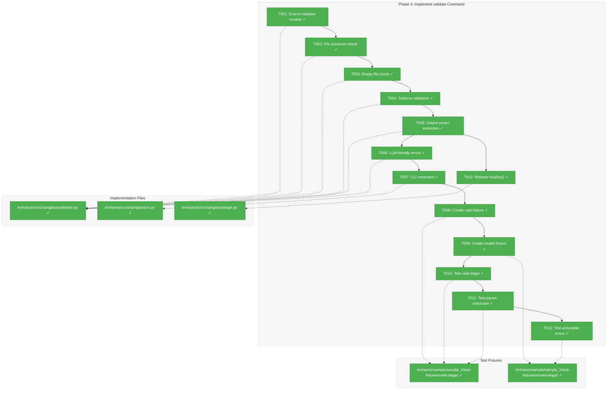
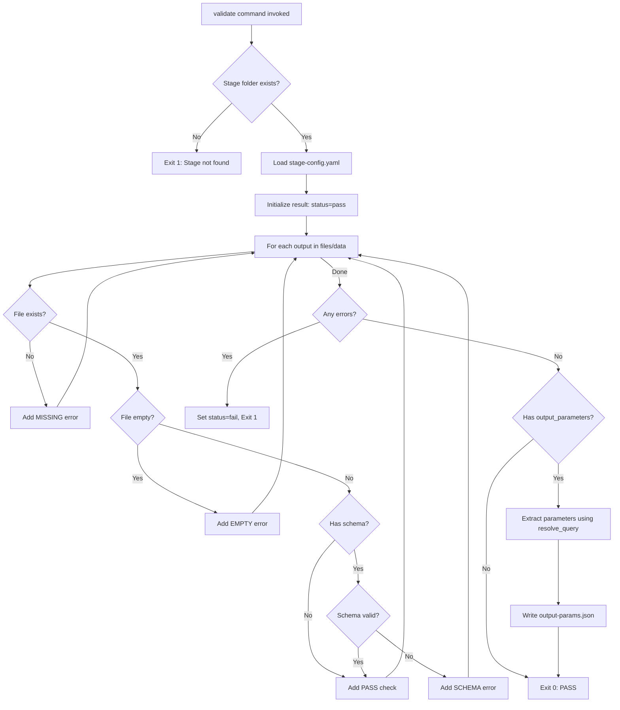
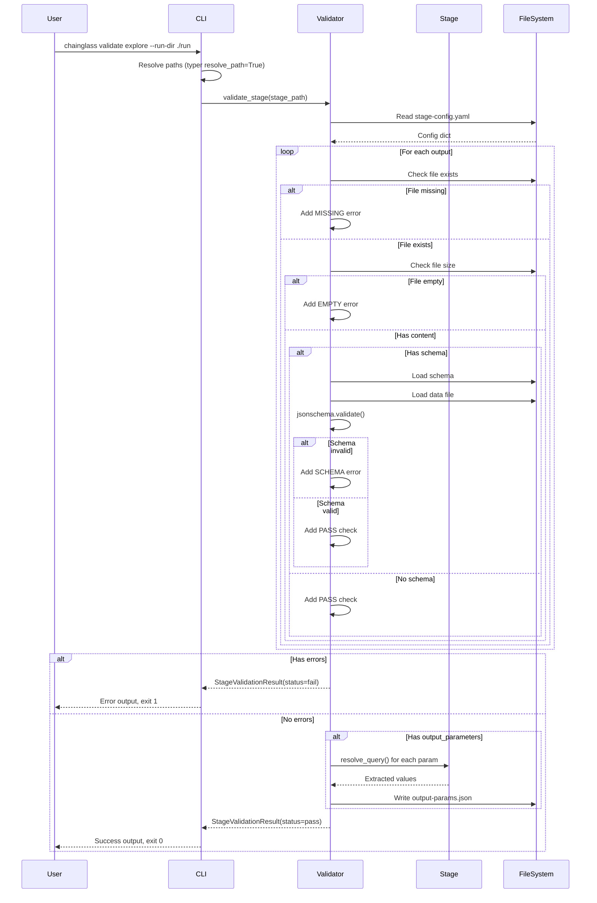

# Phase 4: Implement validate Command – Tasks & Alignment Brief

**Spec**: [../../first-wf-build-spec.md](../../first-wf-build-spec.md)
**Plan**: [../../first-wf-build-plan.md](../../first-wf-build-plan.md)
**Date**: 2026-01-19
**Phase Slug**: `phase-4-implement-validate-command`

---

## Executive Briefing

### Purpose

This phase implements the `chainglass validate` command that validates stage outputs after LLM execution. The command provides **LLM-friendly, actionable error messages** that tell the agent exactly what to fix. Without this, agents cannot verify they've completed a stage correctly before moving on.

### What We're Building

A `validate` command that:
- Checks all declared outputs exist (files, data, runtime)
- Validates JSON outputs against their declared schemas
- Reports empty (0-byte) files as errors
- Extracts output_parameters and writes `output-params.json`
- Returns structured JSON result with status, checks, and errors
- Provides human-readable CLI output with actionable guidance

### User Value

LLMs executing workflow stages can run `chainglass validate <stage>` at the end of their work to:
1. Verify all required outputs exist and are valid
2. Get specific, actionable error messages telling them exactly what to fix
3. Have output parameters automatically extracted and published for downstream stages

### Example

**Command**: `chainglass validate explore --run-dir ./run/run-2026-01-18-001`

**Success Output** (matches existing CLI style):
```
Validated: explore
Checks passed:
  run/output-files/research-dossier.md
  run/output-data/wf-result.json (schema valid)
  run/output-data/findings.json (schema valid)
  run/output-data/explore-metrics.json (schema valid)
Output parameters published:
  total_findings: 15
  critical_count: 2
  top_component: auth/session.py
  complexity_score: CS-3
Result: PASS (8 checks, 0 errors)
```

**Failure Output**:
```
Validation failed:
  MISSING: run/output-data/wf-result.json
    Action: Write this file before completing the stage.
  EMPTY: run/output-data/findings.json
    Action: Write content to this file.
Result: FAIL (2 passed, 2 errors)
```

---

## Objectives & Scope

### Objective

Implement the `chainglass validate` command per A.12 algorithm with all acceptance criteria (P4-AC-01 through P4-AC-07).

**Behavior Checklist**:
- [x] Detects missing required files with actionable message
- [x] Detects empty files with actionable message
- [x] Validates JSON against declared schemas
- [x] Extracts output_parameters using resolve_query() from stage.py
- [x] Writes output-params.json on successful validation
- [x] Returns structured JSON result
- [x] Exit code 0 on pass, 1 on fail

### Goals

- ✅ Implement validate command that checks all stage outputs
- ✅ Reuse Stage class and resolve_query() from Phase 3
- ✅ Provide LLM-friendly, actionable error messages
- ✅ Extract and publish output_parameters on validation pass
- ✅ Return structured JSON result for programmatic consumption
- ✅ Create test fixtures (valid-stage, invalid-stage) per A.13

### Non-Goals

- ❌ Automatic retry on failure (out of scope)
- ❌ Partial validation (validate all or nothing)
- ❌ Fixing validation errors (command reports, doesn't fix)
- ❌ Async/parallel validation (stages validated sequentially)
- ❌ Custom validation rules (use JSON Schema only)
- ❌ Web-based validation UI (CLI only)

---

## Architecture Map

### Component Diagram
<!-- Status: grey=pending, orange=in-progress, green=completed, red=blocked -->
<!-- Updated by plan-6 during implementation -->



### Task-to-Component Mapping

<!-- Status: ⬜ Pending | 🟧 In Progress | ✅ Complete | 🔴 Blocked -->

| Task | Component(s) | Files | Status | Comment |
|------|-------------|-------|--------|---------|
| T001 | Validator Module | /enhance/src/chainglass/validator.py | ✅ Complete | Added StageValidationCheck, StageValidationResult, validate_stage() |
| T002 | File Presence | /enhance/src/chainglass/validator.py | ✅ Complete | In _validate_output_file() |
| T003 | Empty File Check | /enhance/src/chainglass/validator.py | ✅ Complete | st_size == 0 check |
| T004 | Schema Validation | /enhance/src/chainglass/validator.py | ✅ Complete | jsonschema.validate() |
| T005 | Param Extraction | /enhance/src/chainglass/validator.py | ✅ Complete | Uses resolve_query() from stage.py |
| T006 | Error Formatting | /enhance/src/chainglass/validator.py | ✅ Complete | Action: guidance in all errors |
| T007 | CLI Command | /enhance/src/chainglass/cli.py | ✅ Complete | validate_cmd() added |
| T008 | Valid Fixture | /enhance/sample/sample_1/test-fixtures/valid-stage/ | ✅ Complete | Fixed JSON to match schemas |
| T009 | Invalid Fixture | /enhance/sample/sample_1/test-fixtures/invalid-stage/ | ✅ Complete | Missing, empty, invalid files |
| T010 | Test Valid | -- | ✅ Complete | PASS (11 checks, 0 errors) |
| T011 | Test Params | -- | ✅ Complete | 4 params extracted |
| T012 | Test Errors | -- | ✅ Complete | FAIL (6 passed, 3 errors) |
| T013 | Finalize Refactor | /enhance/src/chainglass/stage.py | ✅ Complete | Delegates to validate_stage() |

---

## Tasks

| Status | ID | Task | CS | Type | Dependencies | Absolute Path(s) | Validation | Subtasks | Notes |
|--------|-----|------|----|------|--------------|------------------|------------|----------|-------|
| [x] | T001 | Extend validator module with validate_stage() function and StageValidationResult dataclass | 2 | Core | – | `/Users/jordanknight/github/tools/enhance/src/chainglass/validator.py` | Can import validate_stage and StageValidationResult | – | Per A.12 algorithm |
| [x] | T002 | Implement file presence check for required outputs (files, data) | 2 | Core | T001 | `/Users/jordanknight/github/tools/enhance/src/chainglass/validator.py` | Missing files return FAIL with path and action | – | In _validate_output_file() |
| [x] | T003 | Implement empty file check (0-byte detection) | 1 | Core | T002 | `/Users/jordanknight/github/tools/enhance/src/chainglass/validator.py` | Empty files return FAIL with action | – | In _validate_output_file() |
| [x] | T004 | Implement JSON Schema validation using jsonschema Draft202012 | 2 | Core | T003 | `/Users/jordanknight/github/tools/enhance/src/chainglass/validator.py` | Schema violations return FAIL with json_path and action | – | In _validate_output_file() |
| [x] | T005 | Implement output_parameter extraction using resolve_query() from stage.py | 2 | Core | T004 | `/Users/jordanknight/github/tools/enhance/src/chainglass/validator.py` | Extracted params written to output-params.json | – | Reuse resolve_query() from stage.py:18-83 |
| [x] | T006 | Implement LLM-friendly error message formatting with Action: guidance | 2 | Core | T005 | `/Users/jordanknight/github/tools/enhance/src/chainglass/validator.py` | Errors include "Action:" with specific fix instructions | – | Per A.12 output format |
| [x] | T007 | Implement validate CLI command with typer | 2 | Core | T006 | `/Users/jordanknight/github/tools/enhance/src/chainglass/cli.py` | `chainglass validate --help` works | – | Match compose/finalize pattern |
| [x] | T008 | Create valid-stage test fixture with all outputs present and schema-compliant | 2 | Setup | T007 | `/Users/jordanknight/github/tools/enhance/sample/sample_1/test-fixtures/valid-stage/` | All files exist, all schemas validate, runtime-inputs present | – | Fixed JSON files to match schemas |
| [x] | T009 | Create invalid-stage test fixture with missing, empty, and schema-invalid files | 2 | Setup | T008 | `/Users/jordanknight/github/tools/enhance/sample/sample_1/test-fixtures/invalid-stage/` | Files deliberately broken per A.13 | – | Per A.13 structure |
| [x] | T010 | Manual test: validate passes on valid-stage fixture | 1 | Test | T009 | `/Users/jordanknight/github/tools/enhance/sample/sample_1/test-fixtures/valid-stage/` | Returns status: "pass", exit code 0 | – | PASS (11 checks, 0 errors) |
| [x] | T011 | Manual test: validate extracts output_parameters and writes output-params.json | 1 | Test | T010 | `/Users/jordanknight/github/tools/enhance/sample/sample_1/test-fixtures/valid-stage/` | output-params.json written with correct values | – | 4 params extracted |
| [x] | T012 | Manual test: validate fails on invalid-stage with actionable errors | 1 | Test | T011 | `/Users/jordanknight/github/tools/enhance/sample/sample_1/test-fixtures/invalid-stage/` | Returns status: "fail", exit code 1, errors with Action: | – | FAIL (6 passed, 3 errors) |
| [x] | T013 | Refactor Stage.finalize() to use shared validate_and_extract() helper | 2 | Core | T005 | `/Users/jordanknight/github/tools/enhance/src/chainglass/stage.py` | finalize() delegates to validate_stage(); tested on both fixtures | – | Per Insight #1 decision |

---

## Alignment Brief

### Prior Phases Review

#### Phase 1 Summary: Prepare wf-spec Folder

Phase 1 created the complete `wf-spec` folder structure with **11 files** across 7 directories:

**Key Deliverables**:
- `/Users/jordanknight/github/tools/enhance/sample/sample_1/wf-spec/wf.yaml` - Master workflow definition (166 lines)
- `/Users/jordanknight/github/tools/enhance/sample/sample_1/wf-spec/schemas/wf.schema.json` - wf.yaml validation schema
- `/Users/jordanknight/github/tools/enhance/sample/sample_1/wf-spec/schemas/wf-result.schema.json` - Shared result schema
- `/Users/jordanknight/github/tools/enhance/sample/sample_1/wf-spec/stages/explore/schemas/explore-metrics.schema.json` - Nested data for parameter extraction demo

**Dependencies for Phase 4**:
- Schema files in wf-spec are used to validate stage outputs
- `output_parameters` declaration pattern in wf.yaml defines what parameters to extract

**Critical Patterns**:
- Stage IDs are slugs (explore, specify) not prefixed names
- Three-tier output organization: output-files/, output-data/, runtime-inputs/
- wf.yaml is single source of truth for all stage definitions

---

#### Phase 2 Summary: Implement compose Command

Phase 2 created the chainglass CLI package with the `compose` command:

**Key Deliverables**:
- `/Users/jordanknight/github/tools/enhance/src/chainglass/__init__.py` - Package init with version "0.1.0"
- `/Users/jordanknight/github/tools/enhance/src/chainglass/cli.py` - Typer CLI with compose, finalize, prepare-wf-stage commands
- `/Users/jordanknight/github/tools/enhance/src/chainglass/parser.py` - YAML parser with schema validation
- `/Users/jordanknight/github/tools/enhance/src/chainglass/validator.py` - Two-phase wf-spec validation
- `/Users/jordanknight/github/tools/enhance/src/chainglass/composer.py` - A.10 compose algorithm

**Dependencies for Phase 4**:
- `ValidationResult(valid: bool, errors: list[str], warnings: list[str])` at `validator.py:15-21` - Pattern to extend
- `ValidationError` exception at `validator.py:24-35` - Error handling pattern
- `WorkflowParseError` at `parser.py:11-16` - Exception pattern
- Run folder structure at `run-{date}-{ordinal}/stages/{stage_id}/...`
- `stage-config.yaml` format with inputs, outputs, output_parameters

**Critical Patterns**:
- Two-phase validation: fail-fast for fatal errors, collect-all for file checks
- Typer CLI with `resolve_path=True` for automatic absolute path resolution
- LLM-friendly error messages with "Action:" guidance

---

#### Phase 3 Summary: Implement prepare-wf-stage Command

Phase 3 created the Stage class and prepare-wf-stage/finalize commands:

**Key Deliverables**:
- `/Users/jordanknight/github/tools/enhance/src/chainglass/stage.py` - Stage class (388 lines)
  - `resolve_query(data, query)` at lines 18-83 - Dot notation + array indexing query resolver
  - `class Stage` at lines 86-378 - Core abstraction for stage folder access
  - `Stage.validate()` at lines 159-207 - Validates stage completeness
  - `Stage.finalize()` at lines 223-279 - Validates + extracts output_parameters
  - `class FinalizeResult` at lines 381-387 - Result dataclass pattern
- `/Users/jordanknight/github/tools/enhance/src/chainglass/preparer.py` - Preparer module (238 lines)
  - `class PrepareResult` at lines 15-23 - Result dataclass pattern
- CLI commands added: `finalize` and `prepare-wf-stage`

**Dependencies for Phase 4** (CRITICAL):
- `resolve_query()` at `stage.py:18-83` - **REUSE for output_parameter extraction**
- `Stage.validate()` at `stage.py:159-207` - **May overlap with Phase 4 validate; review for integration**
- `FinalizeResult` pattern at `stage.py:381-387` - **Pattern for StageValidationResult**
- Path validation pattern with `is_relative_to()` - **Reuse for security**

**Test Fixtures Available**:
- `/Users/jordanknight/github/tools/enhance/sample/sample_1/runs/run-2026-01-18-003` - Finalized explore stage (use as basis for valid-stage fixture)

**Critical Patterns**:
- Loading vs Validation vs Finalization separation (Stage class)
- Graceful output access (return None/empty for missing data)
- Path traversal protection with `is_relative_to()`
- Error deduplication (track which errors already reported)

---

### Cumulative Deliverables from All Prior Phases

| Phase | Files Created | Lines | Available for Phase 4 |
|-------|--------------|-------|----------------------|
| 1 | 11 files (wf-spec/) | ~1,100 | Schemas for validation |
| 2 | 5 files (chainglass/) | ~700 | ValidationResult, parser, cli patterns |
| 3 | 2 files (stage.py, preparer.py) | ~625 | resolve_query(), Stage class, FinalizeResult |
| **Total** | **18 files** | **~2,425** | -- |

### Cumulative Dependencies from All Prior Phases

```
wf-spec/schemas/*.schema.json (Phase 1)
    └── Used by validate_stage() for JSON Schema validation

chainglass/validator.py:ValidationResult (Phase 2)
    └── Extended to StageValidationResult for stage validation

chainglass/stage.py:resolve_query() (Phase 3)
    └── Reused for output_parameter extraction

chainglass/stage.py:Stage.validate() (Phase 3)
    └── May need integration review with new validate command

sample/runs/run-2026-01-18-003/stages/explore (Phase 3)
    └── Basis for valid-stage test fixture
```

---

### Critical Findings Affecting This Phase

| Finding | Impact | How Addressed |
|---------|--------|---------------|
| **#08: validate_stage_outputs.py reuse** | Existing validator pattern exists | Create Python wrapper in CLI; use same output format as A.12 |
| **#10: Multiple outputs required (PL-12)** | Must validate all declared outputs | Iterate through files, data, runtime in stage-config.yaml |
| **#15: Manual testing only** | No TDD overhead | Focus on manual verification with test fixtures |

---

### ADR Decision Constraints

No ADRs exist for this project. This section is N/A.

---

### Invariants & Guardrails

1. **Path Safety**: All paths must be validated with `is_relative_to()` before file operations
2. **Schema Version**: Use JSON Schema Draft202012 (consistent with Phase 2)
3. **Exit Codes**: 0 on pass, 1 on fail (standard CLI convention)
4. **Error Message Format**: Always include "Action:" with specific fix instructions

---

### Inputs to Read

| File | Purpose |
|------|---------|
| `{stage_dir}/stage-config.yaml` | Get list of declared outputs and output_parameters |
| `{stage_dir}/schemas/*.schema.json` | Load schemas for JSON validation |
| `{stage_dir}/run/output-files/*` | Check existence of output files |
| `{stage_dir}/run/output-data/*` | Check existence and validate JSON data files |
| `{stage_dir}/run/runtime-inputs/*` | Check existence of runtime tracking files |

---

### Visual Alignment: Flow Diagram



---

### Visual Alignment: Sequence Diagram



---

### Test Plan

**Testing Approach**: Manual (per spec Testing Strategy - no TDD overhead)

| Test | Fixture | Command | Expected | Validates |
|------|---------|---------|----------|-----------|
| T010 | valid-stage | `chainglass validate explore --run-dir test-fixtures/valid-stage` | status=pass, exit 0 | P4-AC-01 |
| T011 | valid-stage | Check output-params.json after validate | Parameters extracted correctly | P4-AC-05 |
| T012a | invalid-stage | Validate with missing file | FAIL: Missing required output | P4-AC-02 |
| T012b | invalid-stage | Validate with empty file | FAIL: Output file is empty | P4-AC-03 |
| T012c | invalid-stage | Validate with invalid JSON | FAIL: Schema validation failed | P4-AC-04 |

---

### Step-by-Step Implementation Outline

1. **T001**: Add `StageValidationResult` dataclass and `validate_stage()` function signature to `validator.py`
2. **T002**: Implement file existence check loop per A.12 step 3a.ii
3. **T003**: Add file size check for empty file detection per A.12 step 3a.iii
4. **T004**: Add jsonschema validation per A.12 step 3a.iv
5. **T005**: Import `resolve_query` from stage.py; implement output_parameter extraction per A.12 step 4
6. **T006**: Format all errors with "Action:" guidance per A.12 output format
7. **T007**: Add `validate` command to cli.py following `finalize` command pattern
8. **T008**: Copy `run-2026-01-18-003/stages/explore` to `test-fixtures/valid-stage/`
9. **T009**: Create `test-fixtures/invalid-stage/` with deliberate errors per A.13
10. **T010**: Run validate on valid-stage, verify pass
11. **T011**: Check output-params.json written with correct parameter values
12. **T012**: Run validate on invalid-stage, verify actionable error messages

---

### Commands to Run

```bash
# Environment setup (from /Users/jordanknight/github/tools/enhance)
cd /Users/jordanknight/github/tools/enhance
source .venv/bin/activate  # if using venv

# Install package in dev mode
uv pip install -e .

# Verify CLI
uv run chainglass --help
uv run chainglass validate --help

# Run validate on valid fixture
uv run chainglass validate explore --run-dir sample/sample_1/test-fixtures/valid-stage

# Run validate on invalid fixture
uv run chainglass validate explore --run-dir sample/sample_1/test-fixtures/invalid-stage

# Check output-params.json
cat sample/sample_1/test-fixtures/valid-stage/run/output-data/output-params.json

# Type check (if mypy configured)
uv run mypy src/chainglass/validator.py

# Import test
uv run python -c "from chainglass.validator import validate_stage, StageValidationResult; print('OK')"
```

---

### Risks/Unknowns

| Risk | Severity | Mitigation | Status |
|------|----------|------------|--------|
| Stage.validate() overlap with new validate command | Medium | Review Stage.validate() in stage.py:159-207; consider integration or deprecation | ✅ RESOLVED: Use shared helper |
| Output_parameters extraction already in finalize() | Low | validate_stage() may duplicate; consider refactoring to shared helper | ✅ RESOLVED: Option D selected |
| jsonschema error messages may be cryptic | Medium | Wrap jsonschema errors with friendly formatting | Open |

---

### Architectural Decision: Shared Helper Pattern (Insight #1)

**Decision**: Implement Option D - Refactor to Shared Helper

**Context**: A.12 explicitly requires validate to write output-params.json, but `Stage.finalize()` already does this. Two commands writing the same file creates confusion.

**Resolution**:
1. Create shared `validate_and_extract()` helper function in validator.py
2. `validate` command: calls shared helper → writes output-params.json (per A.12)
3. `finalize` command: calls shared helper → updates wf-run.json status
4. Refactor `Stage.finalize()` to delegate to shared helper

**Benefits**:
- Follows A.12 spec exactly
- Eliminates code duplication
- Maintains backward compatibility with existing finalize workflow
- Single source of truth for validation + extraction logic

**Implementation Impact**:
- T002-T004: Add empty file + schema checks directly to `Stage.validate()` in stage.py (KISS)
- T005: Extraction logic added to `Stage.validate()` or separate helper
- T013: Refactor `Stage.finalize()` to avoid duplication with enhanced validate

---

### Ready Check

- [x] Prior phases reviewed (P1, P2, P3 summaries complete)
- [x] Critical findings mapped to tasks (Finding #08, #10, #15)
- [x] ADR constraints mapped to tasks (N/A - no ADRs exist)
- [x] Test fixtures defined (valid-stage, invalid-stage per A.13)
- [x] Implementation commands documented
- [x] Architecture diagram shows all task dependencies
- [x] Non-goals explicitly called out to prevent scope creep

**Phase 4 COMPLETE** - All 13 tasks implemented and verified.

---

## Subtasks

This phase has been extended with the following subtasks:

| ID | Summary | Status | Dossier |
|----|---------|--------|---------|
| 001-subtask-preflight-command | Implement preflight command for pre-execution input validation; update wf.md | [ ] Pending | [001-subtask-preflight-command.md](./001-subtask-preflight-command.md) |

---

## Phase Footnote Stubs

| Footnote | Task(s) | Node ID(s) | Notes |
|----------|---------|------------|-------|
| [^20] | T001-T006 | `class:src/chainglass/validator.py:StageValidationCheck`, `class:src/chainglass/validator.py:StageValidationResult`, `function:src/chainglass/validator.py:validate_stage`, `function:src/chainglass/validator.py:_validate_output_file` | Core validation implementation per A.12 |
| [^21] | T007 | `function:src/chainglass/cli.py:validate_cmd` | CLI validate command |
| [^22] | T008-T009 | `file:sample/sample_1/test-fixtures/valid-stage/`, `file:sample/sample_1/test-fixtures/invalid-stage/` | Test fixtures per A.13 |
| [^23] | T013 | `method:src/chainglass/stage.py:Stage.finalize` | Refactored to delegate to validate_stage() |

---

## Evidence Artifacts

Implementation will write:
- **Execution log**: `./execution.log.md`
- **Code changes**: Tracked in git diff

---

## Discoveries & Learnings

_Populated during implementation by plan-6. Log anything of interest to your future self._

| Date | Task | Type | Discovery | Resolution | References |
|------|------|------|-----------|------------|------------|
| | | | | | |

**Types**: `gotcha` | `research-needed` | `unexpected-behavior` | `workaround` | `decision` | `debt` | `insight`

**What to log**:
- Things that didn't work as expected
- External research that was required
- Implementation troubles and how they were resolved
- Gotchas and edge cases discovered
- Decisions made during implementation
- Technical debt introduced (and why)
- Insights that future phases should know about

_See also: `execution.log.md` for detailed narrative._

---

## Directory Layout

```
docs/plans/010-first-wf-build/
├── first-wf-build-plan.md
├── first-wf-build-spec.md
├── research-dossier.md
├── reviews/
│   ├── review.phase-1-prepare-wf-spec-folder.md
│   ├── review.phase-2-implement-compose-command.md
│   ├── review.phase-3-implement-prepare-wf-stage-command.md
│   └── fix-tasks.phase-3-implement-prepare-wf-stage-command.md
└── tasks/
    ├── phase-1-prepare-wf-spec-folder/
    │   ├── tasks.md
    │   └── execution.log.md
    ├── phase-2-implement-compose-command/
    │   ├── tasks.md
    │   └── execution.log.md
    ├── phase-3-implement-prepare-wf-stage-command/
    │   ├── tasks.md
    │   └── execution.log.md
    └── phase-4-implement-validate-command/
        ├── tasks.md                                    # This file
        ├── execution.log.md                            # Created by /plan-6
        ├── 001-subtask-preflight-command.md            # Subtask dossier
        └── 001-subtask-preflight-command.execution.log.md  # Subtask log (created by /plan-6)
```
