# Research Dossier: Lite Agent Flows

**Generated**: 2026-02-18T07:15:00Z
**Research Query**: "Create a clean lite version of the agent command pipeline"
**Mode**: Pre-Plan
**Location**: docs/plans/014-lite-agent-flows/research-dossier.md
**FlowSpace**: Not Available
**Findings**: 7 subagents, ~200 findings synthesized

---

## Executive Summary

### What We're Building
A stripped-down "lite" version of the 24-command agent pipeline, keeping only 10 essential commands and removing all non-pure dependencies (FlowSpace MCP, plan-ordinal, PlanPak, TAD command, constitution gates).

### Why
The full pipeline has accumulated significant coupling to specific infrastructure (FlowSpace MCP: 283 references across 11 files, PlanPak: 30+ references across 5 files). A clean lite version serves users who want the core planning workflow without requiring specialized tooling.

### Key Insights
1. **3 commands need zero changes** (deepresearch, didyouknow mostly clean, plan-5b-flightplan mostly clean)
2. **3 commands need major rewrites** (plan-3-architect: 1446 lines with deep FlowSpace/PlanPak/TAD coupling; plan-6: mandatory plan-6a dependency; plan-7: 1614 lines with extensive validator subagents)
3. **The lite version IS Simple Mode** — hardcode it, don't detect it. This eliminates ~40% of conditional branches in plan-3/5/6/7.

### Quick Stats
- **Commands included**: 10 of 24
- **Commands excluded**: 14
- **Non-pure references to strip**: ~576 total (109 MUST_REMOVE, 245 SHOULD_SIMPLIFY, 222 NICE_TO_HAVE)
- **Critical flow gaps**: 3 (plan-6→6a, plan-3→flowspace-research, testing strategy setup)
- **Medium flow gaps**: 4 (plan-3 clarify gate, plan-5→5c, plan-3→plan-4 next step, testing strategy)
- **Low flow gaps**: 5 (next-step text fixes)

---

## Included Commands (The Lite 10)

| # | Command | Lines | Lite Readiness | Major Changes Needed |
|---|---------|-------|----------------|---------------------|
| 1 | `plan-1a-explore` | 924 | 🟡 YELLOW | Strip FlowSpace dual-mode (keep standard only), remove plan-ordinal |
| 2 | `plan-1b-specify` | 136 | 🟡 YELLOW | Fix next-step (plan-2-clarify → plan-3), inline CS rubric ref |
| 3 | `plan-3-architect` | 1446 | 🔴 RED | Rewrite subagents (drop /flowspace-research), remove gates, strip PlanPak/TAD, change next-step |
| 4 | `plan-5-phase-tasks-and-brief` | 942 | 🟡 YELLOW | Remove plan-5c subagent, remove /code-concept-search, strip PlanPak |
| 5 | `plan-5b-flightplan` | 322 | 🟡 YELLOW | Remove PlanPak section, fix constitution ref |
| 6 | `plan-6-implement-phase` | 502 | 🔴 RED | Rewrite progress tracking (remove plan-6a mandatory auto-run), strip PlanPak/TAD |
| 7 | `plan-7-code-review` | 1614 | 🔴 RED | Strip PlanPak/TAD validators, fix flow list, remove plan-3a suggestions, strip FlowSpace node ID validation |
| 8 | `didyouknow` | 177 | 🟢 GREEN | Generalize CS rubric references (2 minor edits) |
| 9 | `plan-2c-workshop` | 445 | 🟡 YELLOW | Fix next-step (remove plan-2-clarify reference) |
| 10 | `deepresearch` | 46 | 🟢 GREEN | Zero changes needed |

---

## Excluded Commands (The Dropped 14)

| Command | Removal Risk | Orphaned Functionality | Mitigation |
|---------|-------------|----------------------|------------|
| `plan-0-constitution` | 🔴 HIGH | CS rubric definition, doctrine files | Inline simplified CS rubric in plan-3 |
| `plan-2-clarify` | 🔴 HIGH | Mode selection, testing strategy, mock policy | Absorb key questions into plan-3 gates |
| `plan-6a-update-progress` | 🔴 HIGH | 3-location atomic progress tracking, footnote mgmt | Simplify to inline status updates in plan-6 |
| `flowspace-research` | 🔴 HIGH | FlowSpace research worker for plan-3 subagents | Rewrite plan-3 subagents to use grep/glob/view |
| `plan-3a-adr` | 🟡 MED | ADR document generation | Remove references (already soft deps) |
| `plan-4-complete-the-plan` | 🟡 MED | Readiness validation gate | Skip — go plan-3 → plan-5 directly |
| `plan-5c-requirements-flow` | 🟡 MED | AC coverage tracing | Skip — rely on pre-impl audit + plan-7 |
| `planpak` | 🟡 MED | Feature-based file organization | Strip all PlanPak conditional branches |
| `tad` | 🟡 MED | TAD workflow guide | Keep TAD as testing approach, drop /tad command |
| `code-concept-search` | 🟡 MED | Duplicate detection in plan-5 | Replace with inline grep search |
| `plan-2b-prep-issue` | 🟢 LOW | Issue tracker text generation | Zero connections to included commands |
| `plan-6b-worked-example` | 🟢 LOW | Runnable example scripts | Zero connections |
| `plan-8-merge` | 🟢 LOW | Git merge planning | Zero connections |
| `util-0-handover` | 🟢 LOW | LLM handover documents | Zero connections |

---

## Non-Pure Concepts to Remove

### Category 1: FlowSpace MCP (283 references)

**What it is**: FlowSpace (fs2) is a code graph MCP server providing semantic search, tree navigation, and node retrieval.

**Where it's embedded**:
| File | Refs | Depth | Action |
|------|------|-------|--------|
| plan-1a-explore | 41 | DEEP — dual FlowSpace/Standard modes for all 7 subagents | Strip FlowSpace mode, keep Standard mode only |
| plan-3-architect | 44 | DEEP — 4 subagents invoke /flowspace-research; provenance graph appendix | Rewrite subagent prompts to use grep/glob/view |
| plan-5 | 5 | MODERATE — FlowSpace detection in pre-impl audit | Remove FlowSpace detection block |
| plan-7 | 8 | MODERATE — validates FlowSpace node IDs in footnotes | Remove node ID validation step |
| plan-5b | 0 | NONE | No changes |
| plan-6 | 0 | NONE | No changes |

**Specific removals in plan-1a-explore**:
- Lines 162-202: Entire FlowSpace MCP Detection section (§2, §2a)
- Lines 210-350: FlowSpace subagent prompts (replace with Standard mode prompts)
- Lines 407-440: "Standard Mode" section becomes the ONLY mode
- Install instructions: `uvx --from git+https://github.com/AI-Substrate/flow_squared fs2 install`

**Specific removals in plan-3-architect**:
- Lines 167-302: All 4 subagent prompts with `/flowspace-research` invocations
- Lines 812-813: `{flowspace-node-id}` footnote format
- Lines 1184-1440: FlowSpace provenance Graph Traversal Guide appendix

### Category 2: Plan-Ordinal Tool (5 references)

**What it is**: Cross-branch safe ordinal counter for `docs/plans/NNN-*` folders.

**Where**: Only in `plan-1a-explore.md` (lines 148-157)

**Action**: Remove plan-ordinal/jk-po references. Keep the existing fallback: `max(existing_ordinals) + 1`.

### Category 3: PlanPak (30+ references across 5 included files)

**What it is**: Optional feature-based file organization (`features/<ordinal>-<slug>/`).

**Where**: plan-3 (L51-763), plan-5 (L418-733), plan-5b (L159-283), plan-6 (L155-267), plan-7 (L72-1027)

**Action**: Strip ALL PlanPak conditional branches. All 5 files have `if PlanPak NOT active → Legacy` fallbacks. In lite, there is no PlanPak — always Legacy.

### Category 4: TAD Command References (25+ references across 3 included files)

**What it is**: TAD (Test-Assisted Development) is both a testing *approach* (Scratch→Promote lifecycle) and a standalone command (`/tad`).

**Where**: plan-3 (L425-1210), plan-6 (L195-405), plan-7 (L63-1556)

**Action**: Keep TAD as a valid testing approach within the commands (it's embedded knowledge, not a dependency). Remove references to running `/tad` as a standalone command. Simplify: offer "Lightweight" or "Standard" testing, with TAD concepts folded into the descriptions.

### Category 5: Constitution Gates (6 MUST_REMOVE references)

**What it is**: plan-3-architect validates against `docs/project-rules/constitution.md` before proceeding.

**Where**: plan-3 (lines 41, 70-71), plan-4 (lines 101-114)

**Action**: Remove constitution validation gate from plan-3. The CS rubric is already partially inlined — complete the inlining. The `if present` soft checks in plan-5/plan-7 are fine as-is (they gracefully degrade).

---

## Proposed Lite Flow Chain

### Current Full Pipeline
```
plan-0 → plan-1a? → plan-1b → plan-2-clarify → plan-3 → plan-4? → 
  [per phase: plan-5 → plan-5b → plan-6 → plan-6a → plan-7] → repeat
```

### Proposed Lite Pipeline
```
plan-1a? → plan-1b → plan-2c? → plan-3 → 
  [per phase: plan-5 → plan-5b → plan-6 → plan-7] → repeat
```

### Mermaid Diagram

```mermaid
graph TD
    Start([Start Feature]) --> P1A["🔍 plan-1a-explore<br/>(optional research)"]
    Start --> P1B["📋 plan-1b-specify<br/>Feature spec"]
    P1A --> P1B
    
    P1B -.-> P2C["🔬 plan-2c-workshop<br/>(optional design deep-dive)"]
    P2C -.-> P3
    P1B --> P3["🏗️ plan-3-architect<br/>Generate plan"]
    
    P3 --> PhaseLoop{For each phase}
    
    PhaseLoop --> P5["📝 plan-5<br/>Phase tasks + brief"]
    P5 -->|auto| P5B["✈️ plan-5b<br/>Flight plan"]
    
    P5 -.-> DYK["💡 didyouknow<br/>(recommended)"]
    DYK -.-> P6
    
    P5 --> P6["⚡ plan-6<br/>Implement"]
    P6 --> P7["🔍 plan-7<br/>Code review"]
    
    P7 --> NextPhase{More phases?}
    NextPhase -->|Yes| PhaseLoop
    NextPhase -->|No| End([Feature Complete])
    P7 -->|REQUEST_CHANGES| P6
    
    DR["📚 deepresearch"] -.-> |anytime| P1A
    DR -.-> |anytime| P3
    
    style Start fill:#c8e6c9
    style End fill:#c8e6c9
    style P1A fill:#fff3e0
    style P2C fill:#fff3e0
    style DYK fill:#e1f5fe
    style DR fill:#e1f5fe
```


### Standalone Utilities (invoke anytime)
- `/deepresearch` — External knowledge research
- `/didyouknow` — Clarity after any step
- `/plan-2c-workshop` — Deep design exploration

---

## Critical Flow Gaps & Resolutions

### GAP 1: plan-6 → plan-6a (🔴 CRITICAL)

**Problem**: plan-6 has `⛔ MANDATORY: AUTO-RUN /plan-6a-update-progress BEFORE REPORTING DONE ⛔`. plan-6a handles 3-location atomic progress tracking and footnote management.

**Resolution**: Rewrite plan-6's completion section to handle progress tracking inline:
- Update task status in the plan file directly (Simple Mode already uses inline tasks)
- Drop footnote management entirely (FlowSpace-dependent)
- Keep execution log updates (plan-6 already creates `execution.log.md`)
- Replace the mandatory 6a auto-run with a simplified inline checklist:
  ```
  Before reporting done:
  1. ✅ Update task status in plan (mark completed tasks)
  2. ✅ Append summary to execution.log.md
  3. ✅ Note any discoveries in plan's Discoveries section
  ```

### GAP 2: plan-3 → /flowspace-research (🔴 CRITICAL)

**Problem**: plan-3-architect's 4 parallel research subagents all invoke `/flowspace-research` for evidence gathering. This is ~135 lines of subagent prompts.

**Resolution**: Rewrite the 4 subagent prompts to use standard tools (grep, glob, view). Pattern:
- Replace `invoke /flowspace-research` with direct codebase exploration instructions
- "Use grep to find [X], glob to find [Y], read key files to understand [Z]"
- This is how plan-1a-explore's "Standard Mode" subagents already work — copy that pattern

### GAP 3: Testing Strategy Setup (🟡 MEDIUM)

**Problem**: plan-2-clarify (excluded) sets testing strategy, mock policy, mode. These cascade to plan-3, plan-6, plan-7.

**Resolution**: Absorb into plan-3-architect. Before generating the plan, plan-3 asks 2-3 quick questions:
1. Testing approach: Standard / Lightweight / None (drop TAD/TDD/Hybrid complexity)
2. Mock usage: Targeted mocks / No mocks
This is ~10 lines added to plan-3's entry gate.

### GAP 4: plan-5 → plan-5c Subagent (🟡 MEDIUM)

**Problem**: plan-5 invokes plan-5c as a subagent for requirements flow tracing (AC coverage verification).

**Resolution**: Skip entirely. The pre-implementation audit (step 5a in plan-5) and plan-7 code review provide sufficient coverage for lite-scale features.

### GAP 5-10: Next-Step Text Fixes (🟢 LOW)

| Gap | Current Text | Lite Text |
|-----|-------------|-----------|
| plan-1b next step | → plan-2-clarify | → plan-3-architect |
| plan-3 next step | → plan-4-complete-the-plan | → plan-5-phase-tasks-and-brief |
| plan-2c next step | → plan-2-clarify or plan-3 | → plan-3-architect |
| plan-7 merge ref | → plan-8-merge | Remove |
| plan-7 flow list | Lists plan-0, plan-2, plan-4 | Lite flow only |
| plan-3 clarify gate | "instruct running /plan-2-clarify first" | "ask user to resolve [NEEDS CLARIFICATION] in spec" |

---

## Infrastructure: Lite = Simple Mode (Hardcoded)

### Key Decision: Lite is NOT a third mode

The lite version hardcodes `Mode: Simple`. This eliminates:
- Mode detection logic in plan-3, plan-5, plan-6, plan-7
- Full Mode branches (tasks/ subdirectory tree, phase dossiers, phase-scoped reviews)
- The "Two Paths: Simple vs Full" documentation concept

### Lite Folder Structure (Minimal)
```
docs/plans/
└── <ordinal>-<slug>/
    ├── <slug>-spec.md              ← plan-1b (specification)
    ├── <slug>-plan.md              ← plan-3 (plan with inline tasks)
    ├── research-dossier.md         ← plan-1a (optional research)
    ├── workshops/                  ← plan-2c (optional design docs)
    │   └── <topic>.md
    ├── execution.log.md            ← plan-6 (implementation log)
    └── reviews/                    ← plan-7 (optional review)
        ├── review.md
        └── fix-tasks.md
```

**Reduction**: From ~15+ files across 7 directories → 3-6 files in 1-2 directories.

### CS Rubric: Inline Simplified Version

The lite version inlines a compact CS rubric (no constitution.md dependency):
```
Complexity Score (CS 1-5):
Score = Surface Area + Integration + Data/State + Novelty + NFR + Testing (0-2 each)
- CS-1 (0-2): Trivial — single file, no deps
- CS-2 (3-4): Small — few files, familiar code  
- CS-3 (5-7): Medium — multiple modules, integration tests
- CS-4+ → Consider using the Full pipeline
```

---

## Documentation Strategy

### Recommendation: Create NEW lite-specific documentation

**Do NOT edit the existing README.md / GETTING-STARTED.md** — they serve the full pipeline.

Create two new files:
1. `README.lite.md` — Comprehensive lite workflow guide (~400 lines vs 1240)
2. `GETTING-STARTED.lite.md` — Quick-start for lite (~200 lines vs 520)

### What the lite docs cover
- Simplified Mermaid flow (8 nodes vs 18)
- 10-command reference (vs 24)
- One example walkthrough (no clarify/constitution/validate steps)
- Simplified folder structure
- Inline CS rubric

---

## Per-Command Change Inventory

### plan-1a-explore.md (924 lines → ~500 estimated)

| Area | Lines | Action | Est. Lines Removed |
|------|-------|--------|-------------------|
| FlowSpace MCP Detection (§2) | 162-178 | REMOVE section | ~17 |
| FlowSpace API Discovery (§2a) | 191-202 | REMOVE section | ~12 |
| 7 FlowSpace subagent prompts | 210-350 | REPLACE with Standard-only | ~70 (net: keep standard) |
| Standard Mode heading | 407-440 | PROMOTE to only mode | ~5 |
| plan-ordinal tool refs | 148-157 | REPLACE with simple max+1 | ~6 |
| uvx fs2 install instructions | 176-178 | REMOVE | ~3 |
| FlowSpace output template refs | 502, 566, 701, 823 | REMOVE FlowSpace lines | ~8 |
| plan-2-clarify integration | 891-893 | REMOVE section | ~3 |
| **Total removed** | | | **~420 lines** |

### plan-1b-specify.md (136 lines → ~130 estimated)

| Area | Lines | Action | Est. Lines Removed |
|------|-------|--------|-------------------|
| --simple flag / plan-2-clarify ref | 16, 60 | REMOVE | ~2 |
| Next step: plan-2-clarify | 136 | CHANGE to plan-3-architect | ~1 (edit) |
| **Total removed** | | | **~3 lines** |

### plan-3-architect.md (1446 lines → ~800 estimated)

| Area | Lines | Action | Est. Lines Removed |
|------|-------|--------|-------------------|
| Clarify gate (instruct plan-2) | 65-68 | REWRITE: tell user to fix spec | ~4 (edit) |
| Constitution gate | 41, 70-71 | REMOVE | ~3 |
| /flowspace-research subagent prompts | 167-302 | REWRITE: grep/glob/view | ~70 (net reduction) |
| plan-3a-adr suggestion | 91 | REMOVE line | ~1 |
| PlanPak sections | 51-53, 402, 733-763, 1116 | STRIP all PlanPak branches | ~40 |
| TAD approach sections | 425-435, 515-532, 637-664 | SIMPLIFY to Lightweight/Standard | ~30 |
| plan-4 next-step | 794, 871, 1141, 1446 | CHANGE to plan-5 | ~4 (edit) |
| plan-6a footnote refs | 799, 801, 812-813 | REMOVE | ~4 |
| FlowSpace Graph Traversal Guide | 1184-1440 | REMOVE appendix | ~256 |
| Full Mode output format | retain Simple Mode only | STRIP Full Mode branches | ~200 |
| **Total removed** | | | **~612 lines** |

### plan-5-phase-tasks-and-brief.md (942 lines → ~750 estimated)

| Area | Lines | Action | Est. Lines Removed |
|------|-------|--------|-------------------|
| PlanPak refs | 418-468, 728-733 | STRIP PlanPak branches | ~40 |
| /code-concept-search subagent | 452-458 | REPLACE with grep-based search | ~3 (edit) |
| plan-5c subagent invocation | 496-557 | REMOVE step | ~60 |
| FlowSpace detection | 429-430, 500-501 | REMOVE | ~4 |
| CS rubric "from constitution" ref | 241-249 | INLINE simplified rubric | ~2 (edit) |
| **Total removed** | | | **~107 lines** |

### plan-5b-flightplan.md (322 lines → ~280 estimated)

| Area | Lines | Action | Est. Lines Removed |
|------|-------|--------|-------------------|
| PlanPak section | 159, 215-283 | STRIP PlanPak status/output | ~30 |
| Constitution rubric ref | 181 | INLINE or remove | ~1 |
| **Total removed** | | | **~31 lines** |

### plan-6-implement-phase.md (502 lines → ~380 estimated)

| Area | Lines | Action | Est. Lines Removed |
|------|-------|--------|-------------------|
| PlanPak refs | 155-158, 267, 273 | STRIP PlanPak detection | ~6 |
| TAD refs | 195, 205, 319, 364-367, 403-405 | SIMPLIFY testing sections | ~10 |
| plan-6a mandatory auto-run | 375-488 | REWRITE with inline progress tracking | ~80 (replace with ~20) |
| Full Mode branches | scattered | STRIP (keep Simple only) | ~20 |
| **Total removed** | | | **~116 lines** |

### plan-7-code-review.md (1614 lines → ~1100 estimated)

| Area | Lines | Action | Est. Lines Removed |
|------|-------|--------|-------------------|
| TAD validator subagent | 409-541 | SIMPLIFY or remove | ~60 |
| PlanPak compliance validator | 973-1027 | REMOVE validator | ~55 |
| plan-3a-adr suggestions | 1472, 1585 | REMOVE lines | ~2 |
| FlowSpace node ID validation | 144-152, 356-385 | REMOVE | ~30 |
| Flow list with excluded commands | 1603-1610 | REWRITE to lite flow | ~8 (edit) |
| plan-1-specify ref | 1604 | Already fixed previously | ~0 |
| Full Mode branches | scattered | STRIP | ~200 |
| **Total removed** | | | **~355 lines** |

### didyouknow.md (177 lines → ~170 estimated)

| Area | Lines | Action | Est. Lines Removed |
|------|-------|--------|-------------------|
| CS score challenge block | 56-59 | GENERALIZE wording | ~2 (edit) |
| Integration command refs | 170-176 | SIMPLIFY | ~3 |
| **Total removed** | | | **~5 lines** |

### plan-2c-workshop.md (445 lines → ~440 estimated)

| Area | Lines | Action | Est. Lines Removed |
|------|-------|--------|-------------------|
| plan-2-clarify next step | 378 | CHANGE to plan-3-architect only | ~1 (edit) |
| Integration section | 393-408 | SIMPLIFY cross-refs | ~5 |
| **Total removed** | | | **~6 lines** |

### deepresearch.md (46 lines → 46)

No changes needed.

---

## Summary: Scale of Work

| Metric | Value |
|--------|-------|
| **Files to create (extracted lite versions)** | 10 command files + 2 doc files = 12 (in `agents/commands/lite/`) |
| **Total lines to process** | ~6,554 (sum of all 10 commands) |
| **Estimated lines removed** | ~1,655 (~25% reduction) |
| **Estimated lite total** | ~4,899 lines across 10 commands |
| **Critical rewrites** | 3 (plan-3 subagents, plan-6 progress tracking, plan-7 validators) |
| **Simple edits** | 12 (next-step text, reference removals) |
| **New documentation** | 2 files (~600 lines total, in `agents/commands/lite/`) |
| **Full pipeline impact** | ZERO — no existing files modified |

### Approach: Extraction (Parallel Lite Set)

This is an **extraction** process — we create a second, parallel set of lite commands alongside the existing full commands. The full pipeline is **never modified**.

**Structure**:
```
agents/commands/           # Full pipeline (UNTOUCHED)
├── plan-1a-explore.md
├── plan-3-architect.md
├── ...
└── README.md

agents/commands/lite/      # Lite extraction (NEW)
├── plan-1a-explore.md     # Extracted & cleaned from full version
├── plan-1b-specify.md
├── plan-2c-workshop.md
├── plan-3-architect.md
├── plan-5-phase-tasks-and-brief.md
├── plan-5b-flightplan.md
├── plan-6-implement-phase.md
├── plan-7-code-review.md
├── didyouknow.md
├── deepresearch.md
├── README.md              # Lite-specific guide
└── GETTING-STARTED.md     # Lite-specific quick-start
```

**Key principles**:
1. **Full pipeline untouched** — zero edits to existing `agents/commands/*.md`
2. **Independent copies** — lite commands are self-contained, no imports from full
3. **Cross-pollination removed** — each lite file is stripped of FlowSpace, PlanPak, TAD command refs, constitution gates, plan-ordinal, and all references to the 14 excluded commands
4. **Lite commands reference only lite commands** — next-step chains, integration sections, and flow lists only mention commands that exist in the lite set
5. **Distribution**: lite commands can be installed to a separate path (e.g., `~/.claude/commands/lite/`) or used as a standalone command pack

---

## Next Steps

1. **Run `/plan-1b-specify`** to create the formal specification for the lite pipeline
2. Consider **`/plan-2c-workshop`** on the plan-6 progress tracking rewrite (most complex gap)
3. Consider **`/deepresearch`** on best practices for "lite vs full" command set distribution patterns

---

**Research Complete**: 2026-02-18T07:15:00Z
**Report Location**: docs/plans/014-lite-agent-flows/research-dossier.md
