# Workshop: Lite Pipeline Flow & Architecture

**Type**: CLI Flow + State Machine
**Plan**: 014-lite-agent-flows
**Spec**: [lite-agent-flows-spec.md](../lite-agent-flows-spec.md)
**Created**: 2026-02-20T23:20:00Z
**Status**: Draft

**Related Documents**:
- [Research Dossier](../research-dossier.md) — full audit of non-pure concepts
- [Plan-6 Progress Tracking Workshop](./plan-6-inline-progress-tracking.md) — 3-step inline tracking design
- [Plan-3 Research Subagent Workshop](./plan-3-research-subagent-rewrite.md) — grep/glob/view subagent design
- Full pipeline reference: `agents/commands/README.md`, `agents/commands/GETTING-STARTED.md`

---

## Purpose

Visualize the complete lite agent pipeline end-to-end. This is the reference blueprint for what the lite extraction produces — every command, every connection, every artifact, every state transition. If it's not in this workshop, it's not in lite.

## Key Questions Addressed

- What does the lite pipeline look like as a whole?
- How does each command connect to the next?
- What does a per-phase implementation cycle look like without plan-6a?
- What files and folders does the lite pipeline create?
- How does traceability work without footnotes or FlowSpace?
- What does plan-3's research look like with standard tools?
- How does lite compare to the full pipeline?

---

## 1. The Big Picture

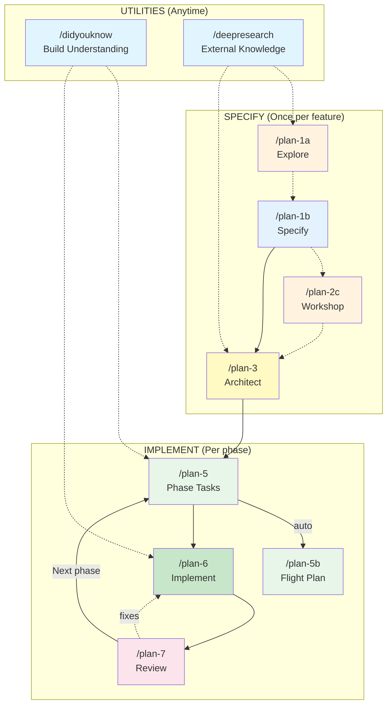

**10 commands. Zero infrastructure dependencies. Standard tools only.**

---

## 2. Detailed Command Flow

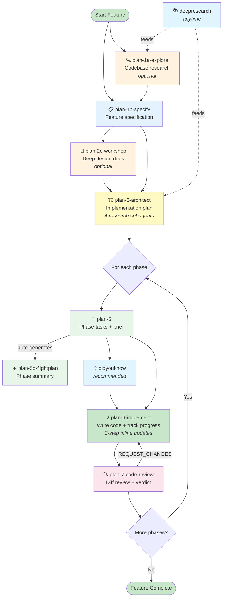

---

## 3. Lite vs Full Pipeline Comparison

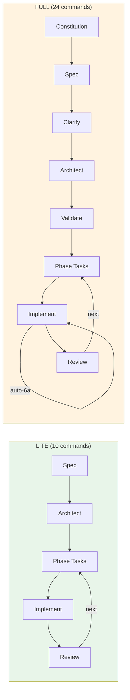

### What Lite Drops

| Full Pipeline | Lite | Why |
|--------------|------|-----|
| plan-0-constitution | ❌ Dropped | CS rubric inlined into plan-3 |
| plan-2-clarify | ❌ Dropped | Key questions absorbed into plan-3 gate |
| plan-2b-prep-issue | ❌ Dropped | External tracker — not core flow |
| plan-3a-adr | ❌ Dropped | ADR docs optional, can be done manually |
| plan-4-complete-the-plan | ❌ Dropped | Readiness gate — plan-3 goes direct to plan-5 |
| plan-5c-requirements-flow | ❌ Dropped | AC tracing — plan-7 catches gaps |
| plan-6a-update-progress | ❌ Inlined | 3-step inline tracking replaces 8-subagent delegation |
| plan-6b-worked-example | ❌ Dropped | Optional examples — not core flow |
| plan-8-merge | ❌ Dropped | Git merge — manual when needed |
| planpak | ❌ Dropped | Feature-based file org — always Legacy in lite |
| tad | ❌ Dropped | TAD guide — testing approach still available |
| util-0-handover | ❌ Dropped | Handover docs — not core flow |
| code-concept-search | ❌ Dropped | FlowSpace-dependent concept search |
| flowspace-research | ❌ Dropped | FlowSpace-dependent research worker |

---

## 4. Command-by-Command Flow

### 4a. Specification Phase

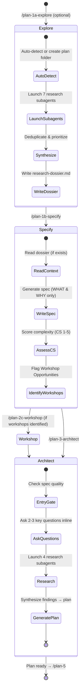

### 4b. Implementation Cycle (Per Phase)

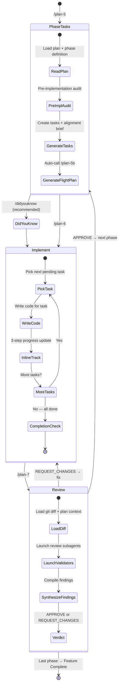

---

## 5. Plan-3 Research Architecture

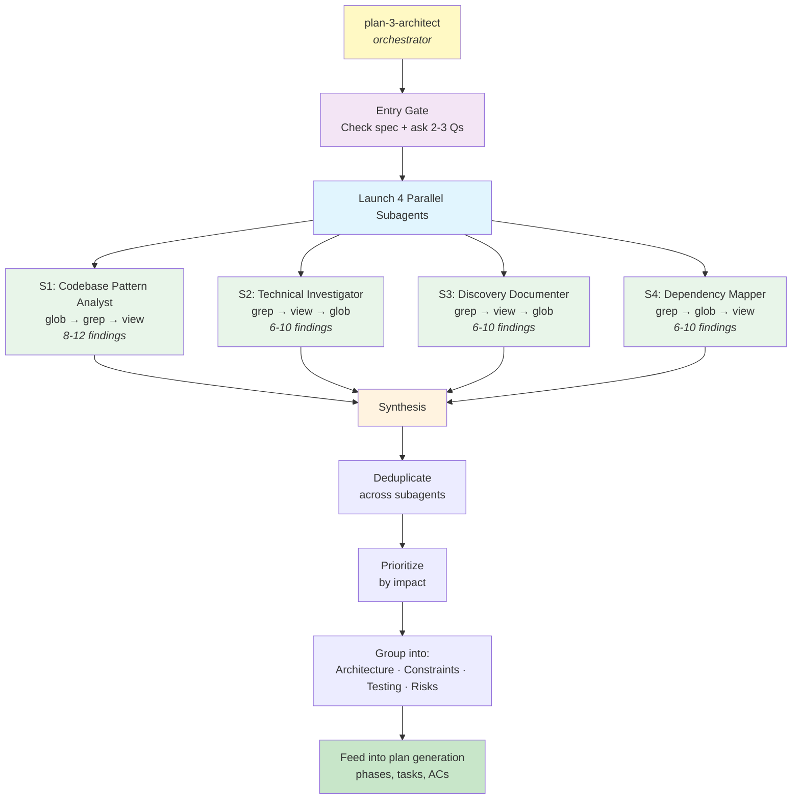

### What Each Subagent Does

```
┌──────────────────────────────────────────────────────┐
│  S1: CODEBASE PATTERN ANALYST                        │
│                                                      │
│  "How does the code work?"                           │
│                                                      │
│  • Glob: find source files in feature domain         │
│  • Grep: naming conventions, existing patterns       │
│  • View: examine key files, understand structure     │
│                                                      │
│  Output: Conventions, integration points, file org   │
├──────────────────────────────────────────────────────┤
│  S2: TECHNICAL INVESTIGATOR                          │
│                                                      │
│  "What could go wrong?"                              │
│                                                      │
│  • Grep: error handling, validation, config patterns │
│  • View: API definitions, schema files, CI configs   │
│  • Glob: test files, dependency manifests            │
│                                                      │
│  Output: Constraints, gotchas, API limits            │
├──────────────────────────────────────────────────────┤
│  S3: DISCOVERY DOCUMENTER                            │
│                                                      │
│  "What's missing from the spec?"                     │
│                                                      │
│  • Grep: edge case handling, validation rules        │
│  • View: test files for expected behavior            │
│  • Glob: docs, READMEs, architecture notes           │
│                                                      │
│  Output: Gaps, edge cases, conflicting assumptions   │
├──────────────────────────────────────────────────────┤
│  S4: DEPENDENCY MAPPER                               │
│                                                      │
│  "What connects to what?"                            │
│                                                      │
│  • Grep: imports, function calls, module references  │
│  • Glob: all files in target directories             │
│  • View: module interfaces, public APIs              │
│                                                      │
│  Output: Dependency graph, boundaries, shared state  │
└──────────────────────────────────────────────────────┘
```

---

## 6. Plan-6 Implementation & Progress Tracking

### Per-Task Cycle

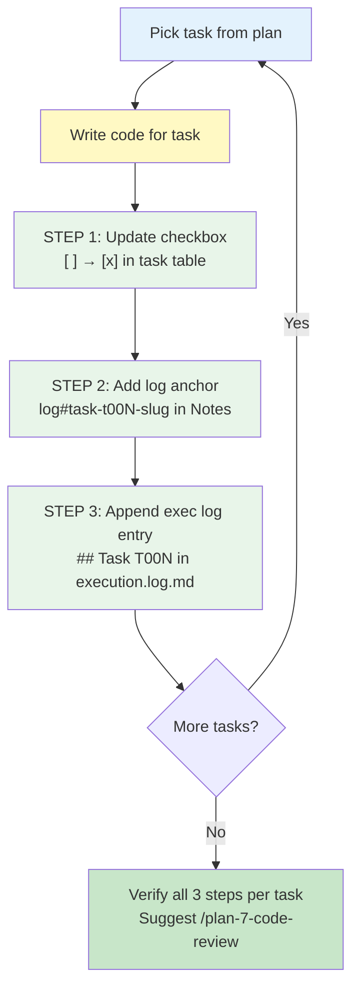

### Task Table State Machine

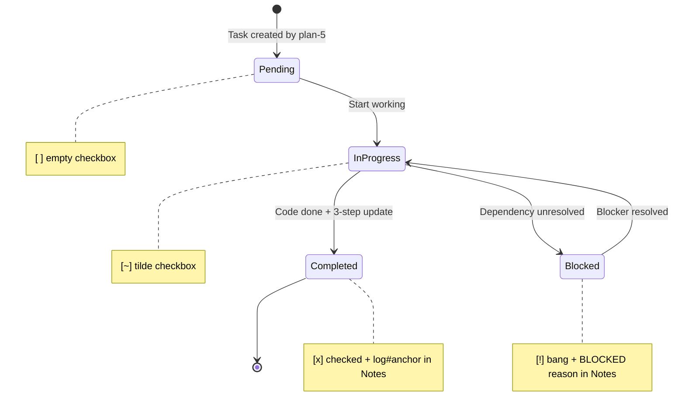

### What Gets Written

```
┌─────────────────────────────────────────────────────────────┐
│  IN THE PLAN FILE (## Implementation > ### Tasks)           │
│                                                             │
│  | Status | ID   | Task         | Notes                  | │
│  |--------|------|--------------|------------------------| │
│  | [x]    | T001 | Setup config | log#task-t001-setup    | │
│  | [x]    | T002 | Add endpoint | log#task-t002-endpoint | │
│  | [ ]    | T003 | Add tests    |                        | │
└─────────────────────────────────────────────────────────────┘

┌─────────────────────────────────────────────────────────────┐
│  IN execution.log.md (sibling to plan file)                 │
│                                                             │
│  ## Task T001: Setup config                                 │
│  **Status**: Completed                                      │
│                                                             │
│  ### Changes Made:                                          │
│  - Created `src/config.py` with default loader              │
│  - Added `src/defaults.yaml` with default settings          │
│                                                             │
│  ### Test Results:                                          │
│  ```                                                        │
│  3 passed, 0 failed                                         │
│  ```                                                        │
│                                                             │
│  ### Notes:                                                 │
│  Used YAML over JSON for readability.                       │
│                                                             │
│  ---                                                        │
│                                                             │
│  ## Task T002: Add endpoint                                 │
│  **Status**: Completed                                      │
│  ...                                                        │
└─────────────────────────────────────────────────────────────┘
```

---

## 7. Plan-7 Code Review

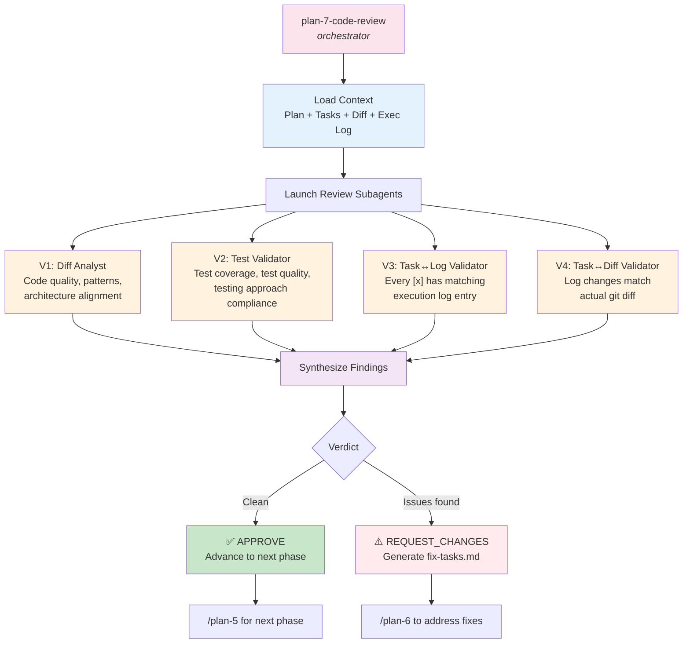

---

## 8. Traceability Model (No Footnotes, No FlowSpace)

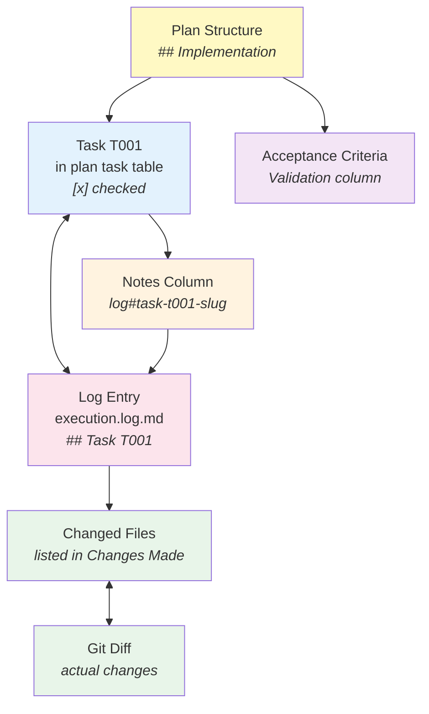

### Traceability Chain

```
Plan task table    →  Checkbox [x] proves completion
  └── Notes column →  log#anchor links to execution log
       └── Exec log →  Changes Made lists files modified
            └── Git diff →  Actual code changes (ground truth)
```

**No footnotes. No FlowSpace node IDs. No separate dossier.**
The execution log IS the detailed record. The task table IS the index.

---

## 9. Directory Structure Evolution

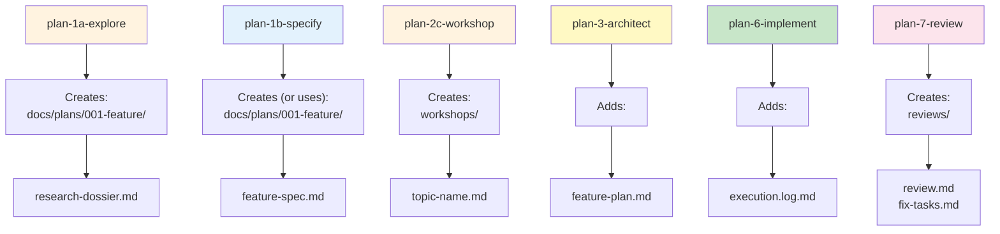

### Final Directory Tree

```
docs/plans/
└── 001-my-feature/
    ├── research-dossier.md          ← plan-1a (optional)
    ├── my-feature-spec.md           ← plan-1b
    ├── my-feature-plan.md           ← plan-3 (with inline tasks)
    ├── execution.log.md             ← plan-6 (progress record)
    ├── workshops/                   ← plan-2c (optional)
    │   ├── data-model.md
    │   └── cli-flows.md
    └── reviews/                     ← plan-7 (optional)
        ├── review.md
        └── fix-tasks.md
```

**That's it.** 3-6 files in 1-2 subdirectories. Compare to the full pipeline's ~15+ files across 7 directories.

---

## 10. Testing Strategy (Simplified)

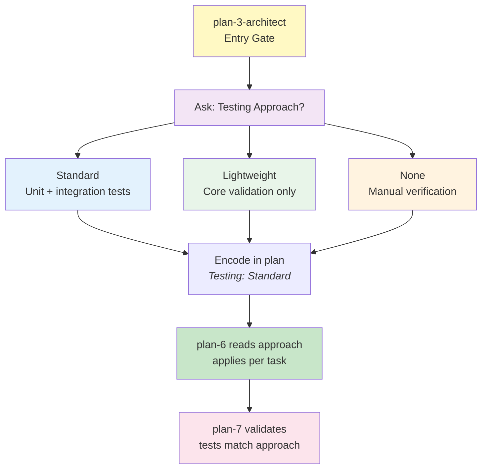

**No TDD/TAD/Hybrid complexity.** Three clear choices. plan-3 asks during its entry gate, writes the answer into the plan, and plan-6 + plan-7 respect it.

---

## 11. Standalone Utilities

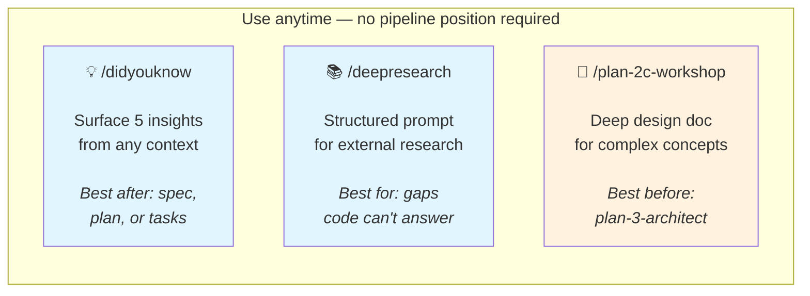

---

## 12. Complete Pipeline Sequence Diagram

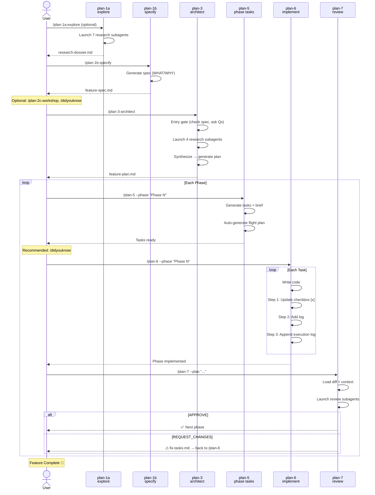

---

## 13. Quick Reference Card

```
┌─────────────────────────────────────────────────────────────┐
│                    LITE PIPELINE CHEATSHEET                  │
├─────────────────────────────────────────────────────────────┤
│                                                             │
│  SPECIFY                                                    │
│    /plan-1a-explore          Research codebase (optional)   │
│    /plan-1b-specify          Write feature spec             │
│    /plan-2c-workshop         Deep design docs (optional)    │
│    /plan-3-architect         Generate implementation plan   │
│                                                             │
│  IMPLEMENT (repeat per phase)                               │
│    /plan-5                   Generate phase tasks            │
│    /plan-5b-flightplan       Phase summary (auto)           │
│    /plan-6-implement-phase   Write code + track progress    │
│    /plan-7-code-review       Review → APPROVE or FIX        │
│                                                             │
│  UTILITIES (anytime)                                        │
│    /didyouknow               5 insights from any context    │
│    /deepresearch             External research prompts      │
│                                                             │
├─────────────────────────────────────────────────────────────┤
│                                                             │
│  PROGRESS TRACKING (inline in plan-6, no delegation)        │
│    1. [x] checkbox in task table                            │
│    2. log#anchor in Notes column                            │
│    3. ## Task entry in execution.log.md                     │
│                                                             │
│  TESTING (chosen in plan-3 entry gate)                      │
│    Standard · Lightweight · None                            │
│                                                             │
│  FILES CREATED                                              │
│    docs/plans/<ord>-<slug>/                                 │
│      ├── research-dossier.md    (plan-1a)                   │
│      ├── <slug>-spec.md         (plan-1b)                   │
│      ├── <slug>-plan.md         (plan-3)                    │
│      ├── execution.log.md       (plan-6)                    │
│      ├── workshops/*.md         (plan-2c)                   │
│      └── reviews/*.md           (plan-7)                    │
│                                                             │
│  TOOLS REQUIRED                                             │
│    grep · glob · view · bash    (standard — no FlowSpace)   │
│                                                             │
└─────────────────────────────────────────────────────────────┘
```

---

## Resolved Questions

### Q: What does the lite pipeline look like as a whole?
**RESOLVED**: 10 commands in 3 groups — Specify (4), Implement (4), Utilities (2). Linear flow with a per-phase loop. See §1-2.

### Q: How does traceability work without footnotes or FlowSpace?
**RESOLVED**: Task checkbox → log anchor → execution log entry → git diff. Four-link chain, all plain text. See §8.

### Q: What does plan-3's research look like with standard tools?
**RESOLVED**: 4 parallel subagents using grep/glob/view. Same roles as full pipeline, ~80% finding volume. See §5.

### Q: How does the per-phase cycle work without plan-6a?
**RESOLVED**: 3-step inline tracking per task (checkbox, log anchor, exec log entry). No delegation, no footnotes, no subagents. See §6.
