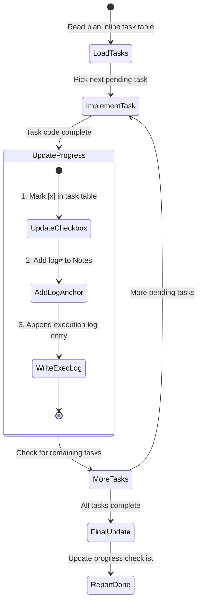

# Workshop: Plan-6 Inline Progress Tracking

**Type**: State Machine
**Plan**: 014-lite-agent-flows
**Spec**: [lite-agent-flows-spec.md](../lite-agent-flows-spec.md)
**Created**: 2026-02-20T05:05:00Z
**Status**: Draft

**Related Documents**:
- [Research Dossier — GAP 1](../research-dossier.md) (plan-6→plan-6a critical gap)
- Full plan-6: `agents/commands/plan-6-implement-phase.md`
- Full plan-6a: `agents/commands/plan-6a-update-progress.md`
- Full plan-7: `agents/commands/plan-7-code-review.md` (consumer of progress output)

---

## Purpose

Design the inline progress tracking system for lite `plan-6-implement-phase.md` that replaces the mandatory plan-6a delegation. The lite version must produce output that lite `plan-7-code-review.md` can validate, without requiring FlowSpace node IDs, separate dossier files, or multi-location atomic updates.

## Key Questions Addressed

- Q1: What's the minimum viable progress tracking for Simple Mode?
- Q2: Does plan-7 lite need footnote ledger data? **No — footnotes dropped from lite.**
- Q3: Can execution.log.md alone serve as the progress record?
- Q4: What format should inline task status updates use?

---

## Current State: What Plan-6a Does

Plan-6a is an 820+ line command that launches up to 8 subagents across 4 phases:

```
┌─────────────────────────────────────────────────────────────┐
│ Phase A: State Readers (3 subagents)                        │
│   A1: Plan Reader — extract metadata, footnote counter      │
│   A2: Dossier Reader — load task table, stubs               │
│   A3: Log Reader — load execution log, existing anchors     │
├─────────────────────────────────────────────────────────────┤
│ Phase B: Log Creation                                       │
│   (inline — write execution log entry)                      │
├─────────────────────────────────────────────────────────────┤
│ Phase C: Atomic Updates (3-4 subagents)                     │
│   C1: Dossier/Inline Task Updater — status + footnote       │
│   C2: Plan Updater (Full Mode only) — plan task table       │
│   C3: Footnote & Progress Updater — both ledgers            │
│   C4: Architecture Map Updater (conditional)                │
├─────────────────────────────────────────────────────────────┤
│ Phase D: Validation (3-4 subagents)                         │
│   D1: Footnote Validator                                    │
│   D2: Link Validator                                        │
│   D3: Status Validator                                      │
│   D4: Diagram Validator (conditional)                       │
└─────────────────────────────────────────────────────────────┘
```

### What Plan-6a Does in Simple Mode (INLINE_MODE=true)

In Simple Mode, plan-6a already simplifies significantly:

| Aspect | Full Mode | Simple Mode |
|--------|-----------|-------------|
| Task table location | Separate `tasks.md` dossier | Inline in plan `## Implementation` |
| Execution log location | `tasks/phase-N/execution.log.md` | `${PLAN_DIR}/execution.log.md` (sibling) |
| Footnote ledgers | TWO (plan §12 + dossier stubs) | ONE (plan §12 only) |
| Subagent C2 (Plan Updater) | ✅ Launched | ❌ Skipped |
| Dossier sync | Required | N/A (no dossier) |

**Key insight**: Simple Mode already eliminates half the complexity. The lite version simplifies further by also dropping FlowSpace node IDs from footnotes.

---

## What Plan-7 Lite Needs

Plan-7 in Simple Mode runs **3 validators** (not 5):

| Validator | What It Checks | Required Input |
|-----------|---------------|----------------|
| Task↔Log | Every `[x]` task has matching execution log entry | Task table + execution.log.md |
| Task↔Diff | Changed files in log match actual git diff | Execution log + git diff |

Plan-7 Simple Mode **skips**:
- ❌ Plan↔Dossier sync (no dossier)
- ❌ Parent↔Subtask validation
- ❌ FlowSpace node ID validation (no FlowSpace in lite)
- ❌ Footnote validation (no footnotes in lite)

### Critical Contract: What Plan-7 Reads

```
FROM PLAN FILE:
├── **Mode**: Simple                          ← Mode marker (required)
├── ## Implementation (Single Phase)
│   └── ### Tasks
│       └── Markdown table with:
│           ├── Status: [ ] [~] [x] [!]       ← Checkbox glyphs
│           ├── Task ID: T001, T002, ...       ← Unique identifiers
│           ├── Notes column with:
│           │   └── log#task-t001-slug         ← Anchor to exec log
│           └── Other columns (name, paths, validation, deps)

FROM EXECUTION LOG (sibling):
└── execution.log.md
    └── ## Task T001: [name]
        └── anchor: task-t001-slug             ← Matches log# in Notes
        └── **Status**: Completed
        └── ### Changes Made: [details]
        └── ### Test Results: [output]
```

---

## Proposed Design: Lite Inline Progress Tracking

### State Diagram



### The 3-Step Per-Task Update (Replaces Plan-6a)

After completing each task's code changes, plan-6 lite performs these 3 edits **inline** (no delegation):

```
┌─────────────────────────────────────────────────────────────┐
│ STEP 1: UPDATE TASK TABLE CHECKBOX                          │
│                                                             │
│ In plan's ## Implementation (Single Phase) > ### Tasks:     │
│                                                             │
│   Before: | [ ] | T003 | Add validation | ... | |          │
│   After:  | [x] | T003 | Add validation | ... | log ↓      │
│                                                             │
│ Status glyphs: [ ] pending, [~] in-progress, [x] done      │
└─────────────────────────────────────────────────────────────┘
                              │
                              ▼
┌─────────────────────────────────────────────────────────────┐
│ STEP 2: ADD LOG ANCHOR TO NOTES COLUMN                      │
│                                                             │
│ Append to Notes: log#task-t003-add-validation               │
│                                                             │
│ Format: log#task-{id}-{slug}                                │
│   - {id} = task ID lowercase (t003)                         │
│   - {slug} = task name kebab-cased (add-validation)         │
└─────────────────────────────────────────────────────────────┘
                              │
                              ▼
┌─────────────────────────────────────────────────────────────┐
│ STEP 3: APPEND EXECUTION LOG ENTRY                          │
│                                                             │
│ In ${PLAN_DIR}/execution.log.md, append:                    │
│                                                             │
│ ## Task T003: Add validation                                │
│ **Status**: Completed                                       │
│                                                             │
│ ### Changes Made:                                           │
│ - Added `validate_input()` in src/validators/input.py       │
│ - Added schema checks in src/validators/schema.py           │
│                                                             │
│ ### Test Results:                                           │
│ ```                                                         │
│ 12 passed, 0 failed                                        │
│ ```                                                         │
│                                                             │
│ ### Notes:                                                  │
│ [Any implementation observations]                           │
│                                                             │
└─────────────────────────────────────────────────────────────┘
```

### What We DROP vs Plan-6a

| Plan-6a Feature | Lite Decision | Rationale |
|----------------|---------------|-----------|
| 3-location atomic updates | ❌ DROP → 1 location | Simple Mode = 1 task table (inline in plan) |
| Separate dossier sync | ❌ DROP | No dossier in Simple Mode |
| FlowSpace node IDs in footnotes | ❌ DROP | No FlowSpace in lite |
| Footnote ledger (entire system) | ❌ DROP | Unnecessary complexity; execution log + task table are sufficient |
| Dual footnote ledgers | ❌ DROP | No footnotes at all in lite |
| Architecture Map updates | ❌ DROP | Optional decoration, not needed for plan-7 validation |
| Task-to-Component Mapping | ❌ DROP | Optional decoration |
| 8 subagent phases (A/B/C/D) | ❌ DROP → inline checklist | 3 sequential edits, no subagents |
| Progress Checklist percentages | ✅ KEEP (simplified) | Quick completion status |
| Footnote sequential numbering | ❌ DROP | No footnotes in lite |
| Log anchor format | ✅ KEEP | Plan-7 validates Task↔Log links |
| Task checkbox glyphs | ✅ KEEP | Plan-7 validates these |

### Completion Sequence (Replaces Mandatory 6a Auto-Run)

When **all tasks are complete**, plan-6 lite performs one final update:

```markdown
## Before Reporting Done — Inline Completion Checklist

For each completed task, verify:
- [x] Task table checkbox is [x]
- [x] Notes column has log#anchor
- [x] Execution log entry exists with matching anchor

Then update the Progress section in plan:
- [x] All tasks marked [x] in task table
- [x] "Overall: Complete" added to plan header or progress section

Report done and suggest: /plan-7-code-review --plan "<PLAN_PATH>"
```

---

## Exact Formats for Lite

### Task Table (in plan's `## Implementation (Single Phase)`)

```markdown
### Tasks

| Status | ID | Task | Est | Deps | Target Path(s) | Validation | Notes |
|--------|----|------|-----|------|-----------------|------------|-------|
| [x] | T001 | Setup config | 1 | -- | /abs/path/config.py | Config loads | log#task-t001-setup-config |
| [x] | T002 | Add endpoint | 2 | T001 | /abs/path/api.py | 200 response | log#task-t002-add-endpoint |
| [ ] | T003 | Add tests | 1 | T002 | /abs/path/tests/ | All pass | |
```

### Execution Log Entry

```markdown
## Task T001: Setup config
**Status**: Completed

### Changes Made:
- Created `src/config.py` with default configuration loader
- Added `src/defaults.yaml` with default settings

### Test Results:
```
$ python -m pytest tests/test_config.py
3 passed, 0 failed
```

### Notes:
Used YAML over JSON for readability.
```

**Anchor format**: The `## Task T001: Setup config` heading auto-generates anchor `task-t001-setup-config` (lowercase, hyphenated). This matches the `log#task-t001-setup-config` reference in the task table Notes column.

---

## Resolved Questions

### Q1: What's the minimum viable progress tracking for Simple Mode?

**RESOLVED**: 3 inline edits per task (checkbox, log anchor, exec log entry). No subagents, no delegation, no multi-location sync, no footnotes. This is sufficient because:
- Simple Mode has only 1 task table (inline in plan) — no sync needed
- Plan-7 lite validates 2 things: checkbox↔log, log changes↔diff
- Both validations are satisfied by the 3-step update

### Q2: Does plan-7 lite need footnote ledger data?

**RESOLVED**: No. Footnotes are dropped entirely from lite. Plan-7 lite validates task completion via Task↔Log anchor links and log entry content↔git diff. The footnote system was designed for FlowSpace node ID tracing — without FlowSpace, execution log entries listing changed files serve the same purpose more simply.

### Q3: Can execution.log.md alone serve as the progress record?

**RESOLVED**: Almost — execution.log.md is the primary detailed record. The task table checkboxes (`[x]`) and log anchors provide the structured index that plan-7 uses for at-a-glance validation. Together, task table + execution log form a complete, footnote-free progress system.

### Q4: What format should inline task status updates use?

**RESOLVED**: Same glyph system as full pipeline (maximum compatibility):
- `[ ]` = pending
- `[~]` = in-progress  
- `[x]` = completed
- `[!]` = blocked

Notes column format: `log#task-{id}-{slug}`

---

## Quick Reference: Lite Plan-6 Progress Tracking

```bash
# Per-task cycle (after writing code for each task):
# 1. Edit plan: change [ ] → [x] (or [~]) in task table
# 2. Edit plan: add "log#task-t00N-slug" to Notes column
# 3. Edit execution.log.md: append ## Task T00N entry

# Completion (after all tasks done):
# 1. Verify all 3 edits present for every [x] task
# 2. Suggest /plan-7-code-review to user
```

---

## Implementation Notes for Lite Plan-6

The existing plan-6 command text (lines 31-133) already describes the per-task update cycle with 4 edit locations. For the lite extraction:

1. **KEEP** lines 31-133 (the inline progress tracking section) — this IS the lite progress system
2. **REMOVE** lines 370-400 (plan-6a delegation block) — replace with "Steps 1-3 above are your complete progress tracking"
3. **REMOVE** lines 460-502 (mandatory 6a auto-run) — replace with inline completion checklist
4. **SIMPLIFY** the status reference table to exclude Architecture Map and Task-to-Component columns (those are optional decorations)
5. **REMOVE** all footnote references — no `[^N]`, no "Change Footnotes Ledger" section
6. **ADD** completion checklist (verify all 3 edits per task, then suggest plan-7)

### Simplified Status Reference (Lite)

| State | Task Table | Notes Column |
|-------|-----------|--------------|
| Pending | `[ ]` | *(empty)* |
| In Progress | `[~]` | *(empty or partial)* |
| Completed | `[x]` | `log#anchor` |
| Blocked | `[!]` | `BLOCKED: reason` |
