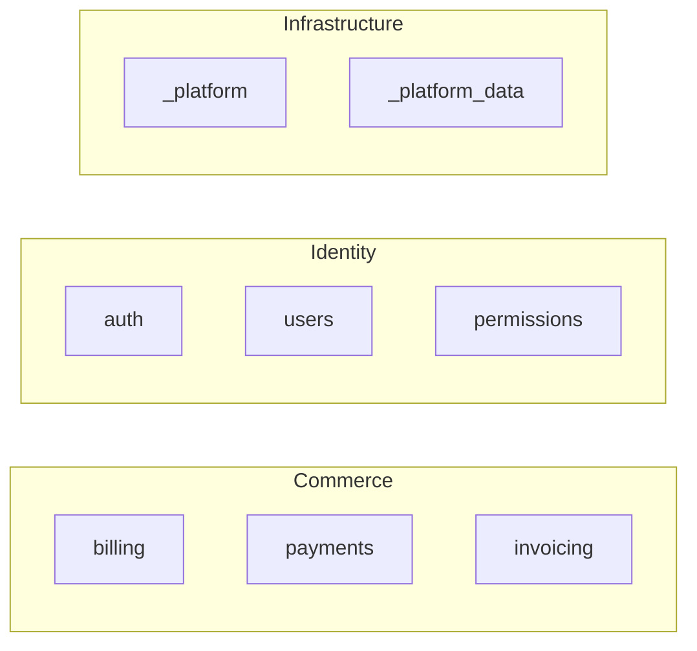

# Workshop: Domain Map

**Type**: Data Model + Integration Pattern
**Plan**: 015-plan-domain-system
**Created**: 2026-02-24
**Status**: Draft

**Related Documents**:
- [domain-system-design.md](./domain-system-design.md) — domain model, registry, lifecycle
- [v2-command-structure.md](./v2-command-structure.md) — which commands maintain the map

---

## Purpose

Design the **domain map** (`docs/domains/domain-map.md`) — a living Mermaid diagram that shows all domains and their contract relationships. The map is not just a visualization. It's a **validation tool** that makes domains truly first-class: if a domain can't be placed on the map with clear contracts in and out, it's not well-defined enough.

## Key Questions Addressed

- What does the domain map look like and what does it contain?
- Why is it more than just a diagram?
- How does it validate domain first-classness?
- Which commands create, read, and update it?
- How does it grow incrementally in brownfields?

---

## 1. Why the Map Matters

The registry (`docs/domains/registry.md`) is a **flat table** — it tells you what domains exist. The individual `domain.md` files describe each domain's internals. But neither answers:

- **How do domains relate to each other?**
- **Is this domain actually well-defined?**
- **What contracts flow between domains?**
- **Are there circular dependencies?**
- **Is this domain actually doing its own thing, or is it tangled with another?**

The domain map answers all of these. It's the **system architecture at the business level**.

### The First-Classness Test

A domain is truly first-class when it can be placed on the map with:

1. **A node** — it has a name and identity
2. **Contracts out** — it exposes something others can consume (even if nobody consumes it yet)
3. **Contracts in** — it declares what it depends on from other domains (even if nothing)
4. **Clean edges** — no unlabeled arrows, no reaching into internals, no hidden couplings

If you can't draw a domain on the map with labeled contracts, something is wrong:
- **No contracts out?** → The domain might not have a clear boundary. What does it expose?
- **Contracts out but nobody consumes them?** → Fine for new domains. Suspicious for old ones.
- **Consuming from another domain but no labeled edge?** → Hidden coupling. Formalize the contract.
- **Circular dependency between business domains?** → Boundary problem. One domain should probably own the shared concept.
- **Everything depends on one domain?** → Is it too coarse? Should it split?

### What the Map Catches That Individual domain.md Files Don't

| Problem | domain.md Sees It? | Map Sees It? |
|---------|-------------------|-------------|
| Circular business domain dependency | ❌ Each file looks fine alone | ✅ Obvious in the graph |
| God domain (everything depends on it) | ❌ Just a popular domain | ✅ Star topology visible |
| Orphan domain (no contracts consumed) | ❌ Could just be standalone | ✅ Isolated node — intentional? |
| Duplicate contracts across domains | ❌ Each domain defines its own | ✅ Two domains offering same contract label |
| Missing contract formalization | ❌ Code works via direct import | ✅ Edge exists but no contract label |
| Infrastructure leaking into business flow | ❌ Dependency listed | ✅ Arrow direction wrong |

---

## 2. Map Format

### File Location

`docs/domains/domain-map.md`

Lives next to `registry.md` — the registry is the index, the map is the architecture view.

### Structure

```markdown
# Domain Map

> Living architecture diagram of all domains and their contract relationships.
> Auto-maintained by plan commands. Validated by plan-7 code review.
>
> **Reading this diagram**: Each box is a domain. Lines with labels show which
> contracts flow between domains. If a domain can't be placed here with clear
> contracts in/out, it needs better definition.

## System View

​```mermaid
flowchart LR
    classDef business fill:#E3F2FD,stroke:#2196F3,color:#000
    classDef infra fill:#F3E5F5,stroke:#9C27B0,color:#000
    classDef new fill:#FFF3E0,stroke:#FF9800,color:#000
    classDef deprecated fill:#FFEBEE,stroke:#F44336,color:#666

    %% ── Business Domains ──────────────────────────
    auth["🔐 auth
    ─────────
    ↗ IAuthService
    ↗ AuthEvents"]:::business

    billing["💰 billing
    ─────────
    ↗ IBillingService
    ↗ InvoiceEvents"]:::business

    notifications["📧 notifications
    ─────────
    ↗ INotificationService"]:::business

    %% ── Infrastructure Domains ────────────────────
    _platform["⚙️ _platform
    ─────────
    ↗ ILogger
    ↗ IConfig"]:::infra

    _platform_data["💾 _platform/data-access
    ─────────
    ↗ DatabaseConnection
    ↗ BaseRepository"]:::infra

    %% ── Contract Dependencies ─────────────────────
    %% Format: consumer -->|contract| provider

    auth -->|DatabaseConnection| _platform_data
    auth -->|ILogger| _platform

    billing -->|IAuthService| auth
    billing -->|DatabaseConnection| _platform_data
    billing -->|ILogger| _platform

    notifications -->|AuthEvents| auth
    notifications -->|ILogger| _platform
​```

## Domain Health Summary

| Domain | Contracts Out | Consumers | Contracts In | Providers | Status |
|--------|--------------|-----------|-------------|-----------|--------|
| auth | IAuthService, AuthEvents | billing, notifications | DatabaseConnection, ILogger | _platform/data-access, _platform | ✅ Healthy |
| billing | IBillingService, InvoiceEvents | — | IAuthService, DatabaseConnection, ILogger | auth, _platform/data-access, _platform | ✅ Healthy |
| notifications | INotificationService | — | AuthEvents, ILogger | auth, _platform | ✅ Healthy |
| _platform | ILogger, IConfig | auth, billing, notifications | — | — | ✅ Healthy |
| _platform/data-access | DatabaseConnection, BaseRepository | auth, billing | — | — | ✅ Healthy |

## Validation Notes

_Updated by plan-7-v2 code review. Tracks issues found in the domain topology._

| Date | Issue | Severity | Resolution |
|------|-------|----------|------------|
```

### Anatomy of a Domain Node

```
auth["🔐 auth          ← emoji + slug (identity)
─────────               ← separator
↗ IAuthService          ← contracts EXPOSED (what others can consume)
↗ AuthEvents"]          ← each contract on its own line, ↗ prefix
```

- **Emoji**: Quick visual type indicator (🔐 auth, 💰 billing, ⚙️ infra, etc.)
- **Slug**: The domain's kebab-case identifier — matches `docs/domains/<slug>/`
- **Separator line**: `─────────`
- **↗ Contracts**: Public interfaces this domain exposes. One per line. These come from `domain.md § Contracts`.

### Anatomy of an Edge

```
billing -->|IAuthService| auth
   ↑              ↑          ↑
consumer    contract name   provider
```

Every edge MUST have a label. Unlabeled edges mean hidden coupling — the review should flag them.

---

## 3. The Domain Health Summary Table

The table below the diagram is a **cross-reference validation** of every domain:

| Column | What It Shows | Why |
|--------|--------------|-----|
| Contracts Out | What this domain exposes | Every domain should expose something |
| Consumers | Who uses those contracts | Zero consumers for mature domains is suspicious |
| Contracts In | What this domain depends on | Shows coupling surface |
| Providers | Who provides those contracts | Validates edges match |
| Status | Health assessment | ✅ Healthy, ⚠️ Review, ❌ Problem |

### Health Status Rules

| Status | Condition |
|--------|-----------|
| ✅ Healthy | Has contracts out, edges are labeled, no circular business deps |
| ⚠️ Review | Zero consumers (mature domain), or high fan-in (>5 consumers) |
| ❌ Problem | Circular business dependency, unlabeled edges, no contracts defined |

---

## 4. How the Map Grows (Brownfield)

The map starts empty. It grows as domains are discovered/created:

```
Day 1: No map file exists
  → /extract-domain auth
  → Map created with single node (auth)
  → Just one box, maybe no edges yet

Day 2: /extract-domain billing
  → billing node added
  → billing -->|IAuthService| auth edge added
  → Two boxes, one arrow

Day 5: Plan 003 creates notifications domain
  → notifications node added
  → notifications -->|AuthEvents| auth edge added
  → Three boxes, pattern emerging

Day 10: /extract-domain _platform
  → Infrastructure node added
  → Multiple -->|ILogger| _platform edges added
  → Architecture becomes visible
```

**Key principle**: The map is **always correct for the domains it shows**. It doesn't need to show everything on day 1. But what it shows must be accurate — accurate contracts, accurate edges, accurate direction.

---

## 5. Which Commands Touch the Map

| Command | Reads Map? | Updates Map? | How |
|---------|-----------|-------------|-----|
| `/plan-v2-extract-domain` | ✅ Check existing topology | ✅ Add new domain node + edges | After domain.md is written |
| `/plan-1b-v2-specify` | ✅ Understand relationships | ❌ | Background context for Target Domains |
| `/plan-2-v2-clarify` | ✅ Validate domain boundaries | ❌ | May prompt user about topology issues |
| `/plan-3-v2-architect` | ✅ Load relationships | ✅ Add NEW domain nodes + edges | Domain setup tasks include map update |
| `/plan-5-v2-phase-tasks-and-brief` | ✅ Context for flight plan | ❌ | Domain Context section references map |
| `/plan-6-v2-implement-phase` | ✅ Validate placement | ✅ Update if new contracts added | Post-implementation domain.md updates cascade to map |
| `/plan-7-v2-code-review` | ✅ Validate topology | ✅ Add validation notes | Checks map matches actual code relationships |
| `didyouknow-v2` | ✅ May surface topology insights | ❌ | Background context |

### Update Rules

**When to add a node**: Domain is created (extract-domain) or established (plan-3 domain setup task).

**When to add an edge**: A domain's `domain.md § Dependencies` changes, or plan-6 implementation creates a new cross-domain contract consumption.

**When to update a node**: Domain's contracts change — new contracts added, contracts removed.

**When to remove**: Domain status goes to `deprecated` → node gets `:::deprecated` class. Domain goes to `archived` → node removed.

---

## 6. Validation by plan-7-v2

The code review command uses the map as a **validation source**:

```
Subagent: Domain Compliance Validator

Additional checks against domain-map.md:
1. Every domain in registry has a node on the map
2. Every contract dependency in code has a matching labeled edge
3. No unlabeled edges (hidden coupling)
4. No circular dependencies between business domains
5. Infrastructure domains are on the right side, business on left
6. New domains added by this plan appear on the map
7. Health Summary table is current
```

Findings go into `## Validation Notes` at the bottom of the map.

---

## 7. Mermaid Conventions

### Node Naming

```
slug["emoji slug\n─────────\n↗ Contract1\n↗ Contract2"]:::class
```

- Slug is the node ID (must be valid Mermaid identifier — use underscores for child domains: `_platform_data`)
- Display text includes emoji, slug, and contracts
- `\n` for line breaks within the node

### Edge Direction

```
consumer -->|ContractName| provider
```

Always reads as "consumer depends on provider via ContractName." Left-to-right mirrors the dependency direction.

### Layout

- `flowchart LR` — left-to-right
- Business domains on the **left**
- Infrastructure domains on the **right**
- This naturally shows business → infra dependency direction

### Color Scheme

| Class | Color | When |
|-------|-------|------|
| `business` | Blue (#E3F2FD) | User-facing business domains |
| `infra` | Purple (#F3E5F5) | Infrastructure/cross-cutting domains |
| `new` | Orange (#FFF3E0) | Just added in current plan (temporary) |
| `deprecated` | Red (#FFEBEE) | Being phased out |

### Size Management

For large codebases (10+ domains), use Mermaid subgraphs to group related domains:



---

## 8. Quick Reference

```
File: docs/domains/domain-map.md
Lives next to: docs/domains/registry.md

A domain is first-class when it has:
  ✅ A node on the map (identity)
  ✅ Contracts out with ↗ prefix (what it offers)
  ✅ Labeled edges in (what it consumes)
  ✅ No hidden couplings

The map catches what individual domain.md files can't:
  • Circular dependencies
  • God domains (everything depends on one)
  • Orphan domains (nothing connects)
  • Duplicate contracts
  • Infrastructure leaking into business flow

Commands that update the map:
  /plan-v2-extract-domain  — adds node + edges
  /plan-3-v2-architect     — adds NEW domain nodes + edges
  /plan-6-v2-implement     — updates if new contracts appear
  /plan-7-v2-code-review   — validates topology, adds notes
```

---

## Resolved Questions

### Q1: Should the map be auto-generated from domain.md files or hand-maintained?

**RESOLVED**: Hand-maintained via commands. Auto-generation would require parsing all domain.md files and resolving relationships — fragile and loses the human curation of layout and grouping. Commands update it incrementally as domains change.

### Q2: What happens when the map gets too big for a single Mermaid diagram?

**RESOLVED**: Use Mermaid subgraphs to group related domains. If truly massive (20+ domains), the map can have a "System Overview" (high-level groups) and "Detail View" sections (per group). But most projects won't hit this.

### Q3: Should the health summary be in the map file or the registry?

**RESOLVED**: In the map file. The health summary is a cross-reference validation that needs the relationship data from the diagram. It's the "so what" of the map — not just showing relationships but assessing whether they're healthy.
