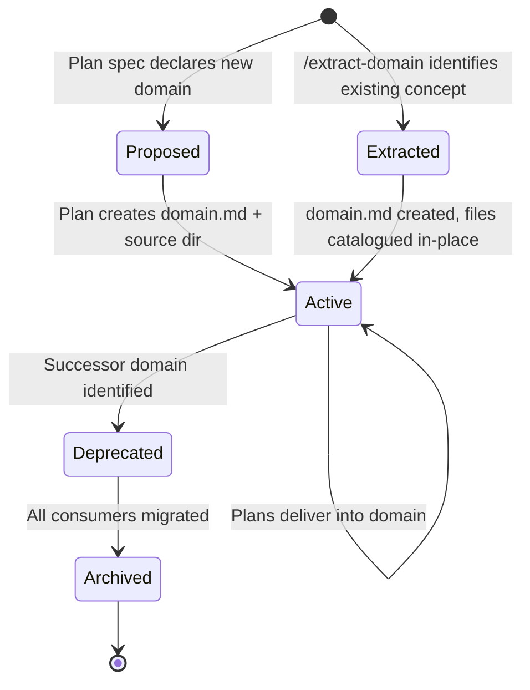

# Workshop: Domain System Design

**Type**: Data Model + Integration Pattern
**Plan**: 015-plan-domain-system
**Created**: 2026-02-22
**Status**: Draft

**Related Documents**:
- [PlanPak command](../../../../agents/commands/planpak.md) — the system this replaces
- [plan-3-architect](../../../../agents/commands/plan-3-architect.md) — primary consumer of domain context
- [plan-5-phase-tasks-and-brief](../../../../agents/commands/plan-5-phase-tasks-and-brief.md) — task-level domain enforcement

---

## Purpose

Design a first-class **domain system** that replaces PlanPak's plan-based file organization with persistent, business-meaning-based organization. The domain is the primary unit of code ownership — every file belongs to a domain, every plan delivers into domains, and domains persist across the lifetime of the codebase.

## Key Questions Addressed

- What is a domain and what does it contain?
- Where do domain definitions live and what's the minimum viable format?
- How does source code map to domains?
- How do plan commands (1b → 7) integrate with domains?
- How does domain-awareness prevent concept reinvention?
- How do we trace files ↔ domains ↔ plans bidirectionally?
- What replaces PlanPak's classification tags and decision tree?

---

## 1. What Is a Domain?

A domain is a **persistent, named business concept boundary** in the codebase. It owns code, contracts, documentation, and composition rules. Unlike plans (which are historical work orders — they have a start, execution, and completion), domains are **living organizational units** that actively accumulate capability from many plans over time.

### Domain vs Plan vs PlanPak Feature

| | PlanPak Feature | Domain | Plan |
|---|---|---|---|
| **Organized by** | Which plan created it | Business meaning | Unit of work |
| **Role** | Plan-scoped file grouping | Living organizational unit | Historical work order |
| **Lifespan** | Permanent (committed) | Permanent (committed) | Permanent (committed) |
| **Activity** | Static after plan completes | Actively accumulates over time | Static after completion |
| **Identity** | `features/003-billing/` | `src/billing/` + `docs/domains/billing/` | `docs/plans/003-billing-mvp/` |
| **Accumulates** | Only from one plan | From many plans over time | N/A |
| **Tracks** | File provenance (birth) | Concept ownership | Work items & decisions |

### Domain Examples

```
auth            — Authentication, authorization, token management
billing         — Invoicing, payments, subscriptions
notifications   — Email, push, in-app notifications
search          — Indexing, querying, ranking
_platform/      — Parent infrastructure domain (logging, config, DI wiring, error handling)
  _platform/data-access  — Database connections, migrations, base repositories
  _platform/observability — Logging, metrics, tracing
```

**Convention**: `_platform` is the parent domain for all infrastructure/cross-cutting concerns. Child domains nest under it (e.g., `_platform/data-access`). Start coarse — `_platform` alone is fine. Split into children when a concern grows large enough to warrant its own boundary. Children follow the same rules as any domain but signal "this serves other domains, not end users directly."

---

## 2. Domain Registry

### Location

```
docs/domains/
├── registry.md                    # Master index of all domains
├── auth/
│   ├── domain.md                  # Domain definition (locked-down format)
│   ├── sketches.md                # Arbitrary: design ideas, brainstorms
│   └── api-notes.md              # Arbitrary: anything useful for context
├── billing/
│   ├── domain.md
│   └── stripe-integration.md     # Arbitrary: research, notes, diagrams
├── notifications/
│   └── domain.md
└── _platform/
    ├── domain.md                  # Parent infrastructure domain
    ├── data-access/               # Child infrastructure domain
    │   └── domain.md
    └── observability/             # Child infrastructure domain
        └── domain.md
```

**Domain folder convention**:
- `domain.md` is **locked down** — required sections, structured format, validated by plan-7. This is the authoritative definition.
- **Everything else** in the folder is freeform. Drop in sketches, research notes, diagrams, API explorations, meeting notes — whatever helps build understanding. Creativity stays open; the contract stays tight.

### registry.md — Master Index

```markdown
# Domain Registry

| Domain | Slug | Type | Parent | Created By | Status |
|--------|------|------|--------|------------|--------|
| Authentication | auth | business | — | Plan 001 | active |
| Billing | billing | business | — | Plan 003 | active |
| Notifications | notifications | business | — | Plan 005 | active |
| Platform | _platform | infrastructure | — | Plan 001 | active |
| Data Access | _platform/data-access | infrastructure | _platform | Plan 001 | active |
| Observability | _platform/observability | infrastructure | _platform | Plan 003 | active |

## Domain Types

- **business**: Represents a user-facing business capability
- **infrastructure**: Cross-cutting technical capability serving other domains

## Domain Statuses

- **active**: Domain is in use and accepting changes
- **deprecated**: Domain is being phased out (note successor domain)
- **archived**: Domain code remains but is no longer modified
```

### domain.md — Minimum Viable Domain Document

```markdown
# Domain: [Name]

**Slug**: [kebab-case identifier]
**Type**: business | infrastructure
**Created**: [ISO-8601]
**Created By**: [Plan ordinal-slug that established this domain]
**Status**: active | deprecated | archived

## Purpose

[1-3 sentences: What business concept does this domain own?
Why does it exist? What would break if it didn't?]

## Boundary

### Owns
- [Concept 1 — e.g., "User credential storage and validation"]
- [Concept 2 — e.g., "OAuth provider integration"]
- [Concept 3 — e.g., "Session token lifecycle"]

### Does NOT Own
- [Boundary clarification — e.g., "User profile data (→ user-profile domain)"]
- [Boundary clarification — e.g., "Permission policies (→ authorization domain)"]

## Contracts (Public Interface)

What other domains may consume. These are the domain's "lego block" sockets.

| Contract | Type | Consumers | Description |
|----------|------|-----------|-------------|
| IAuthService | service interface | billing, notifications | Authenticate and authorize users |
| UserCredential | value object | — | Immutable credential representation |
| AuthEvents | event channel | notifications, audit | Login, logout, token refresh events |

## Composition (Internal Lego Blocks)

| Component | Role | Depends On |
|-----------|------|------------|
| AuthService | Service (composable business logic) | UserRepository, OAuthAdapter |
| OAuthAdapter | Adapter (SDK boundary) | Google OAuth SDK |
| UserRepository | Repository (data access) | _data-access/DatabaseConnection |
| TokenService | Service (internal, not in contracts) | UserRepository |

## Source Location

Primary: `src/auth/`

```
src/auth/
├── auth-service.ts          # AuthService implementation
├── token-service.ts         # TokenService (internal)
├── adapters/
│   └── oauth-adapter.ts     # OAuthAdapter
├── repositories/
│   └── user-repository.ts   # UserRepository
├── contracts/
│   ├── i-auth-service.ts    # IAuthService interface
│   ├── auth-events.ts       # AuthEvents definitions
│   └── user-credential.ts   # UserCredential value object
└── index.ts                 # Public exports (contracts only)
```

## History

| Plan | What Changed | Date |
|------|-------------|------|
| 001-user-auth | Domain established, core auth flow | 2024-01-15 |
| 005-oauth | Added OAuthAdapter, Google provider | 2024-02-20 |
| 012-session-mgmt | Added TokenService, refresh flow | 2024-04-10 |

## Dependencies

### This Domain Depends On
- `_data-access` — DatabaseConnection for repositories
- `_platform` — Logging, configuration

### Domains That Depend On This
- `billing` — Uses IAuthService for payment authorization
- `notifications` — Listens to AuthEvents for welcome emails
```

---

## 3. Source Code Organization

### Structure

Source code mirrors the domain structure. Each domain gets a directory:

```
src/
├── auth/                          # Domain: auth
│   ├── contracts/                 # Public interfaces (what others consume)
│   │   ├── i-auth-service.ts
│   │   └── auth-events.ts
│   ├── adapters/                  # SDK/external boundaries
│   │   └── oauth-adapter.ts
│   ├── repositories/              # Data access
│   │   └── user-repository.ts
│   ├── auth-service.ts            # Core service
│   ├── token-service.ts           # Internal service
│   └── index.ts                   # Public exports
├── billing/                       # Domain: billing
│   ├── contracts/
│   ├── adapters/
│   ├── repositories/
│   └── ...
├── _platform/                     # Domain: _platform (parent infrastructure)
│   ├── logging/                   # Part of _platform until split
│   ├── config/
│   ├── di/
│   ├── data-access/               # Child domain: _platform/data-access
│   │   ├── connection.ts
│   │   └── base-repository.ts
│   └── observability/             # Child domain: _platform/observability
│       ├── logger.ts
│       └── metrics.ts
```

### Key Rules

**1. Every source file belongs to exactly one domain.**
No orphan files. If you can't name the domain, you haven't thought about it enough.

**2. Domains may have internal structure.**
Unlike PlanPak's flat folders, domains can organize internally (`contracts/`, `adapters/`, `repositories/`, or whatever fits). The domain owner decides the internal layout.

**3. Public surface is explicit.**
A domain's `contracts/` folder (or equivalent) defines what others can import. The `index.ts` (or language equivalent) re-exports only public contracts.

**4. Dependency direction is enforced.**

```
business domain  ──→  infrastructure domain  ✅  (always allowed)
infrastructure   ──→  business domain        ❌  (never allowed)
business domain  ──→  business domain        ⚠️  (only via contracts)
```

When domain A consumes domain B, it imports from B's contracts, never from B's internals.

**5. Plans deliver INTO domains, not alongside them.**
A plan creates or extends domain code in place. There is no separate `features/` tree.

### Library Splits

For projects with deployment-target splits, domains nest within each target:

```
src/
├── web/
│   ├── auth/                      # Web-specific auth (UI, routes)
│   └── billing/
├── cli/
│   ├── auth/                      # CLI-specific auth (commands)
│   └── billing/
└── shared/
    ├── auth/                      # Shared auth (core logic)
    └── billing/
```

The `docs/domains/auth/domain.md` source location section lists all splits.

---

## 4. Domain Lifecycle



### Creation (Greenfield)

A domain is born when a plan needs a concept boundary that doesn't exist yet.

```
Plan spec (plan-1b):
  ## Target Domains
  - auth (existing) — extend with OAuth
  - notifications [NEW] — establish for email alerts

Plan architect (plan-3):
  Phase 1 creates:
    docs/domains/notifications/domain.md
    src/notifications/              (directory)
    Updates docs/domains/registry.md
```

**Minimum to create a domain**: slug, purpose (1-3 sentences), boundary (owns/doesn't own), and an empty source directory. Contracts and composition fill in as implementation proceeds.

### Extraction (Brownfield) — `/extract-domain` Command

A new command for identifying and encapsulating an existing concept as a named domain **without moving files**. This is a collaborative workshop with the user, not an automated refactor.

**When to use**: When working in a brownfield codebase and you need to give a name and boundary to code that already exists but isn't formally organized. The goal is **communication** — future plans can reference "the auth domain" and everyone knows what that means.

**What it does**:
1. **Explore**: Uses research subagents to discover all code related to the concept (services, adapters, repos, tests, config)
2. **Catalogue**: Lists all discovered files and their roles — presented to user for review
3. **Boundary workshop**: Collaborates with user to define what belongs vs. doesn't
4. **Contracts**: Identifies the public interfaces other code already consumes
5. **Composition**: Maps the internal lego blocks (services, adapters, repos)
6. **Write domain.md**: Creates the domain definition with `§ Source Location` pointing to files **where they currently live** (scattered across the existing tree)
7. **Update registry**: Adds the domain to `docs/domains/registry.md`

**What it does NOT do**:
- ❌ Move files to a new directory structure
- ❌ Refactor imports
- ❌ Create new source directories
- ❌ Change any code

**Output**: A `docs/domains/<slug>/domain.md` that documents the domain boundary, contracts, and composition with source locations pointing to the existing file layout. The domain is now a known entity — plans can target it, research can find it, reviews can validate against it.

**Example**:
```
User: /extract-domain auth

Agent explores codebase, finds:
  - src/controllers/auth-controller.ts
  - src/services/auth-service.ts
  - src/middleware/jwt-middleware.ts
  - src/models/user.ts
  - lib/oauth/google-provider.ts
  - config/auth.yaml

Agent workshops with user:
  "I found these files related to auth. Should jwt-middleware
   be part of the auth domain or _platform?"
  → User: "auth — it's auth-specific"
  
  "Should config/auth.yaml be included?"
  → User: "Yes, it's auth config"

  "user.ts has auth fields but also profile fields.
   Should the whole file be auth, or should we note
   it's shared?"
  → User: "Note it as shared — user-profile will be
   its own domain later"

Output: docs/domains/auth/domain.md
  § Source Location lists files WHERE THEY ARE:
    src/controllers/auth-controller.ts
    src/services/auth-service.ts
    src/middleware/jwt-middleware.ts
    lib/oauth/google-provider.ts
    config/auth.yaml
    src/models/user.ts (shared with future user-profile domain)
```

**Optional later**: A plan can include a "consolidate auth domain" phase that moves files into `src/auth/`. But that's a deliberate refactoring choice, not a requirement of domain extraction.

### Growth

Domains accumulate capability over time. Each plan that touches a domain:
1. Adds entries to `domain.md § History`
2. Updates `§ Composition` if new services/adapters/repos are introduced
3. Updates `§ Contracts` if public interface changes
4. Updates `§ Dependencies` if new domain relationships form

### Graduation (from one domain to another)

Sometimes code starts in one domain and later belongs in another. This is explicit:

1. Move the code to the new domain's source directory
2. Update both domain.md files (source removes, destination adds)
3. Update all imports
4. Log the graduation in both domains' History sections
5. Update registry.md if a new domain was created for this

---

## 5. Domain Classification Tags

PlanPak had 4 tags (`plan-scoped`, `cross-cutting`, `cross-plan-edit`, `shared-new`). The domain system replaces these with a simpler model:

| Tag | Meaning | Example |
|-----|---------|---------|
| `domain:<slug>` | File belongs to this domain | `domain:auth` |
| `contract` | File is part of the domain's public interface | Used in contracts/ folder |
| `internal` | File is domain-internal, not for external consumption | Default for non-contract files |
| `cross-domain` | Task edits files in a domain it's not primarily targeting | Plan targets billing but edits auth/contracts |

### Decision Tree (replaces PlanPak's)

```
Which domain does this file's CONCEPT belong to?
├── Existing domain → domain:<slug>
│   ├── Is it part of the public interface? → contract
│   └── Is it internal implementation? → internal
└── No domain fits →
    ├── Is it a business concept? → Create new business domain
    └── Is it infrastructure? → Create new infrastructure domain
        (or extend _platform / _data-access)
```

**There is no "I'll figure it out later" option.** Every file gets a domain tag at planning time. This is the key mechanism that prevents drift and reinvention.

---

## 6. Plan Workflow Integration

### New Command: `/extract-domain`

Standalone command for brownfield domain identification. See §4 "Extraction (Brownfield)" for full design. This command:
- Can be run **outside** the plan flow — anytime the user wants to formalize a concept
- Can be run **during** plan-1a or plan-1b when research discovers an unformalised concept area
- Is collaborative — agent proposes, user confirms boundaries
- Produces a domain.md without touching source code

### How Each Command Changes

#### plan-1a-explore (Research)

**Addition**: Research subagents check `docs/domains/registry.md` and read relevant `domain.md` files to understand what concepts already exist.

New subagent focus area:
```
"Scan docs/domains/ for existing domain definitions.
For each domain, note: slug, purpose, contracts, composition.
Identify which existing domains are relevant to this feature.
Flag if the feature concept already exists in a domain."
```

#### plan-1b-specify (Spec)

**Replaces**: Nothing (PlanPak wasn't in spec)
**Adds**: `## Target Domains` section

```markdown
## Target Domains

| Domain | Status | Role in This Feature |
|--------|--------|---------------------|
| auth | existing | Extend with OAuth provider support |
| notifications | **NEW** | Establish for email alert delivery |
| _platform | existing | Use logging and config (no changes) |

### New Domain Sketches

#### notifications [NEW]
- **Purpose**: Deliver notifications across channels (email, push, in-app)
- **Boundary Owns**: Message templating, delivery scheduling, channel adapters
- **Boundary Excludes**: User preferences (→ user-profile), content generation (→ calling domain)
```

#### plan-2-clarify (Clarify)

**Replaces**: PlanPak vs Legacy question
**New question**:

```
Q: Domain Review

The spec identifies these target domains:

| Domain | Status | Role |
|--------|--------|------|
| auth | existing | Extend with OAuth |
| notifications | NEW | Email alerts |

For NEW domains:
- Does the boundary look right?
- Should any part be absorbed into an existing domain instead?
- Are the contracts clear enough to proceed?

For EXISTING domains:
- Will changes respect existing contracts?
- Any contract-breaking changes needed? (flag for ADR)

Answer: [Confirm / Adjust boundaries / Merge into existing]
```

#### plan-3-architect (Architect)

**Replaces**: PlanPak File Placement Manifest, T000 task, PlanPak conditional blocks
**Adds**: Domain-aware phase design

**Key changes**:

1. **Research subagents check domains first**:
   ```
   "Before proposing any new service, adapter, or repository,
   check docs/domains/*/contracts.md and composition sections.
   Does this capability already exist? Can it be extended?
   Report: EXISTING (reuse), EXTEND (add to domain), NEW (create)."
   ```

2. **Phases are SRP'd to domains where possible**:
   ```markdown
   ## Phase Design Principles

   - Each phase should primarily target ONE domain
   - Multi-domain phases are permitted but each domain-touch
     is a separate task group within the phase
   - Domain creation phases come before domain extension phases
   - Composition/wiring phases (connecting domains) come last
   ```

3. **Domain Manifest replaces File Placement Manifest**:
   ```markdown
   ### Domain Manifest

   | File | Domain | Classification | Rationale |
   |------|--------|---------------|-----------|
   | src/auth/adapters/oauth-adapter.ts | auth | internal | New adapter for OAuth SDK |
   | src/auth/contracts/i-auth-service.ts | auth | contract | Extended interface |
   | src/notifications/notification-service.ts | notifications | internal | New domain, core service |
   | src/notifications/contracts/i-notify.ts | notifications | contract | Public interface |
   ```

4. **Domain Setup Task replaces T000**:
   For each NEW domain in the spec, the first phase includes:
   ```markdown
   | [ ] | 1.1 | Create notifications domain | 1 | Setup | — |
   ```
   This task:
   - Creates `docs/domains/notifications/domain.md` from spec sketch
   - Creates `src/notifications/` directory structure
   - Updates `docs/domains/registry.md`

#### plan-5-phase-tasks-and-brief (Tasks)

**Replaces**: PlanPak path rules in task table
**Changes to task table**:

```markdown
| Status | ID | Task | CS | Type | Domain | Absolute Path(s) | Validation | Notes |
```

New `Domain` column replaces the need for PlanPak classification tags in Notes. Every task declares which domain it delivers into.

**Pre-Implementation Audit changes**:
- Checks file → domain mapping instead of file → plan mapping
- Validates that files live under the correct domain's source tree
- Checks for concept duplication across domains using `/code-concept-search`
- Verifies contract-only imports between domains

**Requirements Flow changes**:
- Traces acceptance criteria through domains, not just files
- Flags when an AC requires changes to domain contracts (higher risk)

#### plan-6-implement (Implement)

**Replaces**: PlanPak's 5 placement rules
**New rules**:

```markdown
### Domain Placement Rules

1. Every new file MUST go under its declared domain's source directory
2. Contract files go in the domain's contracts/ directory
3. Cross-domain imports MUST use the target domain's public contracts only
4. After implementation, update domain.md:
   - § Composition: new services/adapters/repos
   - § History: plan reference and what changed
   - § Contracts: if public interface changed
   - § Dependencies: if new domain relationships formed
5. Update docs/domains/registry.md if domain status changed
```

#### plan-6a-update-progress (Progress)

**Addition**: FlowSpace node IDs now include domain context:
```markdown
[^3]: Task 2.3 - Added OAuth adapter
  - domain: auth
  - `class:src/auth/adapters/oauth-adapter.ts:OAuthAdapter`
  - `method:src/auth/adapters/oauth-adapter.ts:OAuthAdapter.authenticate`
```

#### plan-7-code-review (Review)

**Replaces**: PlanPak Compliance Validator subagent
**New**: Domain Compliance Validator subagent

```
"Validate domain compliance:
1. Every file is under its declared domain's source tree
2. No imports from another domain's internals (only contracts)
3. Dependency direction respected (no infra → business)
4. New contracts are documented in domain.md
5. Domain.md § History updated for this plan
6. registry.md is current"
```

---

## 7. Anti-Reinvention Mechanism

This is the core problem the domain system solves. Here's how:

### Before Implementation (plan-3 research)

```
Researcher checks: "I need an email sending capability"

1. Read docs/domains/registry.md → find all domains
2. Search domain contracts for email/notification concepts:
   - docs/domains/notifications/contracts.md → INotificationService.send()
   - Already exists! → REUSE
3. Search domain composition for adapters:
   - docs/domains/notifications/domain.md § Composition → EmailAdapter
   - Already exists! → REUSE
4. If nothing found → NEW domain or NEW component in existing domain
```

### During Planning (plan-5 audit)

```
Pre-Implementation Audit:
  File: src/billing/email-sender.ts
  Domain: billing
  ⚠️ DUPLICATION WARNING:
    /code-concept-search "email sending"
    FOUND: src/notifications/adapters/email-adapter.ts
    Domain: notifications
    Recommendation: Import from notifications domain contracts,
                    do not reimplement in billing
```

### During Review (plan-7)

```
Domain Compliance Check:
  ❌ VIOLATION: src/billing/email-sender.ts duplicates
     functionality in notifications domain
  Recommendation: Remove and use INotificationService.send()
     from notifications contracts
```

### Three-Layer Defense

| Layer | When | How |
|-------|------|-----|
| **Research** | plan-3 | Subagents search domain contracts before proposing new code |
| **Audit** | plan-5 | Pre-implementation audit uses code-concept-search against domain registry |
| **Review** | plan-7 | Domain compliance validator catches duplication post-implementation |

---

## 8. Traceability Model

### File → Domain → Plans (bidirectional)

```
src/auth/adapters/oauth-adapter.ts
  ↓ (lives in src/auth/)
Domain: auth (docs/domains/auth/domain.md)
  ↓ (§ History)
Plans: 001-user-auth (created), 005-oauth (added this file)
  ↓ (§ Composition)
Role: Adapter wrapping Google OAuth SDK
  ↓ (§ Contracts)  
Consumed by: No (internal) — AuthService uses it internally
```

### Plan → Domains → Files

```
Plan: 005-oauth (docs/plans/005-oauth/)
  ↓ (spec § Target Domains)
Domains touched: auth (extend), _platform (use, no changes)
  ↓ (plan § Domain Manifest)
Files:
  - src/auth/adapters/oauth-adapter.ts (domain:auth, internal)
  - src/auth/contracts/i-auth-service.ts (domain:auth, contract)
  ↓ (domain § History)
docs/domains/auth/domain.md logs: "005-oauth: Added OAuthAdapter"
```

### FlowSpace Integration

The existing FlowSpace footnote system (`[^N]`) gains a domain dimension:

```markdown
## Change Footnotes Ledger

[^3]: Task 2.3 - Added OAuth adapter
  - domain: auth
  - `class:src/auth/adapters/oauth-adapter.ts:OAuthAdapter`

[^4]: Task 2.4 - Extended auth contract
  - domain: auth
  - `method:src/auth/contracts/i-auth-service.ts:IAuthService.authenticateWithProvider`
```

Source file comments:
```typescript
// FlowSpace: [^3] domain:auth class:src/auth/adapters/oauth-adapter.ts:OAuthAdapter
export class OAuthAdapter implements IOAuthProvider {
```

---

## 9. Migration Path from PlanPak

### For Existing PlanPak Projects

```
Step 1: Create docs/domains/registry.md
Step 2: For each features/<ordinal>-<slug>/ folder:
  - Identify the business domain it represents
  - Create docs/domains/<domain>/domain.md
  - Move files from features/<ordinal>-<slug>/ to src/<domain>/
  - Update all imports
Step 3: Remove features/ directory
Step 4: Update spec to use "Target Domains" instead of "File Management: PlanPak"
```

### For New Projects

No migration needed. First plan that runs establishes the domain registry and creates domains as needed.

### For Legacy (No PlanPak) Projects — Brownfield Adoption

Domains are built **incrementally and collaboratively** with the user. There is no big-bang migration.

**Approach**: As plans touch areas of the codebase, identify domains with the user's help and formalize them one at a time. Existing code that no plan has touched yet stays where it is — no retroactive reorganization.

```
Plan 001 touches auth code:
  → User identifies "auth" as a domain
  → Create docs/domains/auth/domain.md (minimal)
  → New/modified files go in src/auth/
  → Existing auth files stay where they are for now

Plan 003 touches auth again:
  → Domain already exists, deliver into it
  → Optionally migrate legacy auth files into src/auth/ as part of this plan

Plan 005 touches billing:
  → User identifies "billing" as a new domain
  → Create docs/domains/billing/domain.md
  → And so on...
```

**Key principles for brownfield**:
- **User-driven**: The agent proposes domain boundaries, but the user confirms. Domain identification is a collaborative conversation, not an automated classification.
- **Incremental**: Only formalize domains as plans naturally encounter them. Don't map the entire codebase upfront.
- **Non-destructive**: Existing code that isn't part of an active plan doesn't move. Migration happens organically as plans touch those areas.
- **Progressive**: A project might have 2 domains formalized and 80% of code still in legacy locations — that's fine. Coverage grows over time.

---

## 10. Domain Granularity Guidelines

### How Big Should a Domain Be?

A domain should represent a **business conversation** — a coherent set of concepts that change together for the same business reasons.

**Too granular** (avoid):
```
domains/login/           # Just login
domains/registration/    # Just registration  
domains/token-refresh/   # Just token refresh
```

**Right granularity**:
```
domains/auth/            # All of authentication & authorization
```

**Too coarse** (avoid):
```
domains/backend/         # Everything server-side
```

### Splitting a Domain

Split when a domain starts owning concepts that change for **different business reasons**:

```
Before: domains/auth/ owns both authentication AND fine-grained permissions
After:  domains/auth/ owns authentication
        domains/authorization/ owns permissions, roles, policies
```

Signal to split: Different plans consistently touch only one half of the domain.

### Merging Domains

Merge when two domains are always changed together and have the same stakeholders:

```
Before: domains/email-templates/, domains/email-delivery/
After:  domains/email/
```

Signal to merge: Every plan that touches one also touches the other.

---

## Resolved Questions

### Q1: Should domain.md contracts be duplicated as actual interface files?

**RESOLVED**: Option A — `domain.md § Contracts` is documentation only; actual interfaces live in `src/<domain>/contracts/` and domain.md references them. Source code is the actual contract. Less duplication, stays in sync via plan-7 review.

### Q2: How do domains interact with testing?

**RESOLVED**: Defer to project conventions — the domain system doesn't prescribe test location. Same principle as PlanPak.

### Q3: Should `_cross-cutting` be one domain or many?

**RESOLVED**: `_platform` is the parent infrastructure domain. Start coarse — everything lives in `_platform`. When a concern grows, split it into a child domain (`_platform/data-access`, `_platform/observability`). Child domains nest both in docs (`docs/domains/_platform/data-access/domain.md`) and source (`src/_platform/data-access/`). Follow the same granularity rules as business domains.

### Q4: What about files that truly have no domain (e.g., root config files)?

**RESOLVED**: Option C — domain tagging applies to `src/` files only. Config files at project root, CI configs, etc. are outside the domain system.

### Q5: Should the domain.md format be validated?

**RESOLVED**: Option A — `domain.md` is freeform markdown but with **locked-down required sections**, validated by plan-7 review. The domain compliance validator checks for required sections (Purpose, Boundary, Contracts, Composition, Source Location, History). However, the domain *folder* is open — any other files (sketches, research, notes, diagrams) can be dropped alongside domain.md to support creative exploration. The contract is tight; the context is free.

---

## Quick Reference

```
Create a domain:
  1. Add to docs/domains/registry.md
  2. Create docs/domains/<slug>/domain.md (purpose + boundary + contracts)
  3. Create src/<slug>/ directory

Add to a domain (during plan execution):
  1. Put file in src/<domain>/
  2. Tag task with Domain column in task table
  3. Update domain.md § History, § Composition

Check before creating new code:
  1. Read docs/domains/registry.md — does a domain for this exist?
  2. Read relevant domain.md § Contracts — does this capability exist?
  3. Run /code-concept-search — is this concept implemented somewhere?

Domain rules:
  - Every src/ file belongs to exactly one domain
  - Import only from other domains' contracts/ (never internals)
  - infrastructure → business domain imports are forbidden
  - business → business imports go through contracts only
  - Plans deliver INTO domains; domains outlive plans
```
