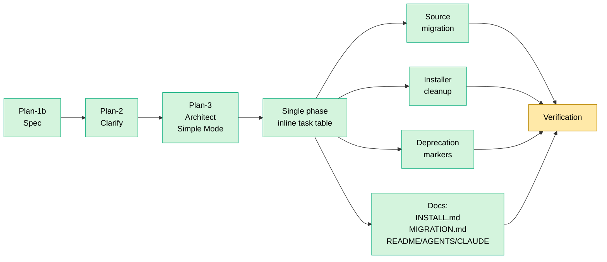

# Flight Plan: Skills-Layout Migration

**Plan ID**: 022-skills-layout-migration
**Mode**: Simple (single-phase, inline task table)
**Status**: Landed (15 / 17 ACs ✅; 2 deferred to post-merge smoke)
**Created**: 2026-05-13
**Spec**: [skills-layout-migration-spec.md](skills-layout-migration-spec.md)
**Plan**: [skills-layout-migration-plan.md](skills-layout-migration-plan.md)
**Research**: [research-dossier.md](research-dossier.md) · [external-research/cli-paths-verification.md](external-research/cli-paths-verification.md)

---

## Executive Overview

Move the canonical source of 27 v2 skills from flat-file `agents/v2-commands/*.md` to `skills/<category>/<slug>/SKILL.md`, following the `mattpocock/skills` categorization convention. Simultaneously gut `install/agents.sh`'s 7-target install fan-out (~700+ lines), deprecate the legacy `agents/commands/` and `agents/commands-lite/` directories, and rely on `npx skills@latest add jakkaj/tools` for user-side distribution. Net result: a smaller, single-purpose repo where the skills are the product.

## Vision

```
Today                                          After migration
=====                                          ===============
agents/v2-commands/*.md (flat, 31 files)       skills/SDD/*/SKILL.md (27)
agents/commands/ (27 v1)                       skills/general/grill-me/SKILL.md
agents/commands-lite/ (12)                     skills/personal/shopping-hunter/SKILL.md
other-skills/*.md (2)                          agents/commands/DEPRECATED.md
install/agents.sh: 7-target fan-out (1078 LOC) agents/commands-lite/DEPRECATED.md
                                               install/agents.sh: MCP-only (~300 LOC)

Distribution:                                  Distribution:
  ./setup.sh fans skills to 7 dirs               npx skills add jakkaj/tools -a <cli>
                                                 OR work inside a clone
```

## Implementation Workstreams

Simple mode — one phase, one inline task table (generated by `/plan-3-v2-architect`). Workstreams below are the sequencing hints, not phase boundaries.

| # | Workstream | Primary Surface | Objective (1 line) | Status |
|---|---|---|---|---|
| 1 | Migrate source files | skills-authoring | Move 27 v2 + 2 other-skills into `skills/<category>/<slug>/SKILL.md` with `name:` frontmatter | ✅ Done |
| 2 | Installer cleanup | skills-distribution | Delete fan-out logic from `install/agents.sh`, `setup_manager.py`, `src/jk_tools/cli.py`, `scripts/sync-to-dist.sh` | ✅ Done |
| 3 | Deprecation markers | legacy-commands | Add `DEPRECATED.md` to `agents/commands/` and `agents/commands-lite/` | ✅ Done |
| 4 | Documentation refresh | repo-docs | Write `INSTALL.md` + `MIGRATION.md`; refresh `README.md`, `AGENTS.md`, `CLAUDE.md` | ✅ Done |
| 5 | Verification | (cross-cutting) | `npx skills` smoke test, `./setup.sh` smoke test, slug-collision linter, tests updated/replaced | Partial (linter+grep+byte-diff ✅; live setup.sh smoke deferred to post-merge; npx skills smoke deferred until pushed) |

Sequencing: 1 → 2 → 5 (verification gates on installer changes). 3 and 4 can run any time after 1. Documentation (4) is the largest workstream in terms of polish — `INSTALL.md` is a first-class deliverable, not a paragraph in the README.

## Journey Map



## Acceptance Criteria (Top-Level)

Detailed acceptance criteria live in the spec § Acceptance Criteria (17 items). Summary:

- [ ] `skills/SDD/` has 27 skills; `general/` and `personal/` each have 1.
- [ ] `agents/v2-commands/` and `other-skills/` removed.
- [ ] `agents/commands/` and `agents/commands-lite/` deprecated, not deleted.
- [ ] `install/agents.sh` net reduction ≥700 LOC; no skill-fan-out logic remains.
- [ ] `setup.sh` end-to-end run creates zero skill files in user `$HOME`.
- [ ] `npx skills@latest add jakkaj/tools` installs at least one skill correctly to `~/.claude/skills/`.
- [ ] `INSTALL.md` at repo root covers all 9 canonical install patterns + 3 category index + agent-readable preamble.
- [ ] `MIGRATION.md` exists for existing-installer users.
- [ ] `README.md`, `AGENTS.md`, `CLAUDE.md` refreshed; zero stale `v2-commands` / `commands-local` references.

## Key Decisions (already made)

| Decision | Resolution | Source |
|---|---|---|
| Source location | `skills/<category>/<slug>/SKILL.md` (community convention) | Memory: `project_022_canonical_source_path.md` |
| Categorization | `SDD/`, `general/`, `personal/` (mattpocock-style) | Memory: `project_022_skills_categorization.md` |
| Fan-out installer | Gut entirely; rely on `npx skills` for user-side install | This conversation |
| Legacy v1 + lite | Deprecate with markers; do not delete | Memory: `project_022_deprecate_legacy_commands.md` |
| Slug renames (drop `-v2`) | Not in scope | Spec § Open Questions Q1 |
| Auto-prune of stale `$HOME` files | Not in scope; `MIGRATION.md` only | Spec § Non-Goals + R1 |

## Risks (Top 3)

| Risk | Severity | Mitigation |
|---|---|---|
| Existing user `$HOME` installs become silent stale data | Medium | `MIGRATION.md` cleanup note |
| In-repo nested discovery fails for some CLI | Low | Workshop #1 (recommended next) |
| Migration introduces body whitespace drift across 29 files | Low | Deterministic migration script + phase-5 byte-diff verification |

## Flight Log

### Entry 4 — 2026-05-13: Implementation landed (15 / 17 ACs ✅; 2 deferred)

**What happened**: `/plan-6-v2-implement-phase` executed all 28 tasks across the 5 workstreams.

**Workstreams**:
- WS1 — Migration: 29 SKILL.md files created under `skills/{SDD,general,personal}/`. Body byte-diff 29/29 OK. Idempotency verified. Slug-collision linter PASS. Legacy `agents/v2-commands/` and `other-skills/` deleted; 4 skip-list docs moved to `docs/skills-pipeline/`.
- WS2 — Installer cleanup: `install/agents.sh` rewritten — 1078 → 589 LOC (~750 gross deletions, 489 net). `generate_mcp_configs` preserved verbatim per F03. `setup_manager.py` 717 → 545 LOC. `src/jk_tools/cli.py` 98 → 80 LOC. `scripts/sync-to-dist.sh` v2-commands block + mkdir removed. `setup.sh` skills-note added. Dist mirror `src/jk_tools/agents/v2-commands/` deleted.
- WS3 — Tests: `tests/install/test_agents_copilot_dirs.sh` (202 lines) + `tests/install/test_complete_flow.sh` (98 lines) deleted. T018 optional regression test skipped.
- WS4 — Docs: `INSTALL.md` (9 patterns + 3 categories + LLM preamble) + `MIGRATION.md` (cleanup recipes) written. `README.md`, `AGENTS.md` (27 SDD + 1 general + 1 personal catalog), `CLAUDE.md` (contributor guide) rewritten. T026 grep stale-string check: 0 hits across all three top-level docs.
- WS5 — Verification: AC walk: 15 ✅ + 2 deferred. AC#11 (live setup.sh smoke) and AC#12 (npx skills smoke) deferred to post-merge — both require either a sandbox environment (heavyweight, installs Rust/MCP into real system) or a pushed branch.

**Deviation**: AC#7's "≥700 LOC net reduction" target arithmetically unreachable while preserving `generate_mcp_configs` verbatim (409 LOC); net is 489. Spec **intent** (gut all skill fan-out) fully met — `grep -cE 'V2_SOURCE_DIR|install_local_commands|generate_copilot_cli_skills|cleanup_plan_commands|cleanup_copilot_cli_agents|--commands-local|COPILOT_CLI_SKILLS_DIR' install/agents.sh` returns 0.

**Status**: Implementation complete. Awaiting: commit + push, then live verification.

### Entry 3 — 2026-05-13: Plan-4 + Validate-v2 complete (plan APPROVED)

**Plan-4 readiness gate**: READY (3/3 applicable validators PASS with zero violations; Doctrine + ADR N/A).

**Validate-v2 multi-lens validation**: APPROVED. Three lenses launched in parallel:
- Correctness + Thesis Alignment: PASS — all 17 ACs mapped, all clarifications honored, all Non-Goals respected
- Cut-Line Risk: PASS — MCP preservation verified by direct source-code read; no tangled references between DELETE and KEEP regions
- Implementability: PASS after 8 fixes applied inline (idempotency contract, grep assertions, sandbox definition, explicit sequencing for 3 tasks, AGENTS.md required sections, tool/command specifics)

**Plan status**: Implementation-ready. Next: `/plan-6-v2-implement-phase`.

### Entry 2 — 2026-05-13: Plan produced (Plan-3 Architect, Simple Mode)

**What happened**: Plan-3-v2-architect generated `skills-layout-migration-plan.md` — 28 tasks (T018 optional) in the 7-column Simple Mode format. Tasks reference an authoritative line-range cut-list from a focused subagent that read all 6 affected files and produced DELETE/KEEP tables per file.

**Key Findings produced**:
- F01 (Critical): `COPILOT_CLI_MCP_CONFIG` constant is tangled — must be preserved during T009 despite its name
- F02 (High): Per-file cut-line inventory exists and is referenced in tasks T009–T015
- F03–F08: precise scope guards for MCP preservation, test deletion, slug uniqueness, comment refresh, migration mechanics

**Verification**: Self-check passes (all tasks have success criteria, absolute paths, domain assignments, findings cross-referenced).

**Status**: Ready → pending `/plan-4-complete-the-plan` readiness gate + `/validate-v2` lens validation.

### Entry 1 — 2026-05-13: Spec produced + iterated (Plan-1b ×2)

**What happened**: Plan-1b-v2-specify produced the feature spec, incorporating findings from plan-1a research and verified Vercel CLI source review. Then the spec went through several layout / scope iterations within the same conversation as decisions firmed up:

1. Initial framing: keep fan-out installer, just change source format.
2. → Drop fan-out entirely; skills live only in repo.
3. → Source location: `.agents/skills/<cat>/<skill>/SKILL.md` (cross-CLI convention)
4. → Source location: top-level `skills/<cat>/<skill>/SKILL.md` (final — mirrors `mattpocock/skills`).
5. → Mode flipped from Full (5 phases) to Simple (single phase).
6. → `INSTALL.md` and `AGENTS.md` promoted to first-class deliverables (AC #15–17 added).

**Final scope**:
- 27 v2-commands → `skills/SDD/`; 2 `other-skills/` → `skills/general/` + `skills/personal/`.
- `install/agents.sh` skill-fan-out logic deleted (~700+ LOC).
- `agents/commands/` + `agents/commands-lite/` deprecated with markers.
- Five documentation deliverables: `INSTALL.md` (new, first-class), `MIGRATION.md` (new), refreshed `README.md`, `AGENTS.md`, `CLAUDE.md`.
- Simple mode — single phase, inline task table generated by plan-3.

**Next**: `/plan-2-v2-clarify` to surface remaining doc-shape and migration-mechanics questions before architecture.
