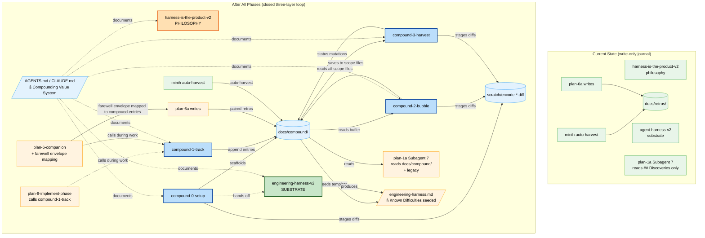

# Flight Plan: Compounding Value System

> **First-class concept**: "Compounding Value System" is the formal name; **`compound`** is the slug. A peer category in this repo's skills graph alongside SDD, general, and personal.

**Spec**: [difficulty-ledger-skill-spec.md](./difficulty-ledger-skill-spec.md)
**Plan**: Pending — run `/plan-3-v2-architect` (after the four queued workshops; all critical Open Questions now resolved)
**Generated**: 2026-05-16 · **Last clarified**: 2026-05-16 (Session 1: 8 Qs; Session 2: compound restructure; Session 3: plan-6 + plan-6-companion compound integration; Session 4: branding lock — Compounding Value System; Session 5: 4-question lock — engineering-harness Interpretation A, flat naming, retros auto-migrate, Principle 2 wording)
**Status**: Specifying — workshops queued; Group E unblocked
**Mode**: Simple (single phase with grouped tasks; plan-4/plan-5 optional)

---

## The Mission

**What we're building**: The **Compounding Value System** — a three-layer architecture (philosophy / substrate / meta-loop) that closes both ends of the compounding-value loop and earns its place as a first-class concept (peer to SDD / general / personal) in this repo's skills graph. The three layers:

1. **Philosophy** — `harness-is-the-product-v2` (existing skill, unchanged content; small Principle 2 wording update). States the principle: *the harness is the product; encode, don't document; gifts to your future self*.
2. **Substrate** — `engineering-harness-v2` (renamed from `agent-harness-v2`). Audits + scaffolds the engineering harness (justfile, dev scripts, tests). Its template's `## Known Difficulties` section auto-seeds from the compound ledger.
3. **Meta-loop** — the **compound family**: 4 small re-entrant skills under `skills/compound/`:
   - `compound-0-setup` — scaffold + re-check
   - `compound-1-track` — silent log + magic-wand check during work
   - `compound-2-bubble` — session-end soft prompt with `[s/t/p/e/d/a]` menu
   - `compound-3-harvest` — periodic curation + `[r/w/s]` lifecycle ops

Every self-improvement artifact (difficulty entries, magic-wand entries, gift entries, insights, sessions, indices, convention guide, opt-out sentinel) lives under **`docs/compound/`** — one umbrella, one schema, one integration surface.

**Why it matters**: The compounding-value promise of `harness-is-the-product-v2` Principle 2 is currently broken. Producers exist (`plan-6a`, minih) but no SDD skill reads from the ledger. The compound family closes both ends and makes "encode, don't document" something every session does, not something one philosophy doc gestures at. The framing is **compounding value** (broader than minih's "compounding velocity") — every captured entry compounds value session-over-session, like compound interest.

---

## Where We Are → Where We're Headed

```
TODAY:                                            AFTER this plan:
29 SDD skills                                     33 skills:
                                                    + 4 new compound (skills/compound/)
                                                    + 1 renamed (engineering-harness-v2)
1 ledger producer (plan-6a, phase-end only)       2 ledger producers (+ compound-1-track,
                                                                       every session)
0 ledger readers                                  3 readers:
                                                    + compound-3-harvest (periodic curation)
                                                    + plan-1a Subagent 7 (research-time)
                                                    + engineering-harness-v2 template
                                                      (boot-time § Known Difficulties)
docs/retros/ (empty / unused convention)          docs/compound/ scaffolded:
                                                    README.md (convention guide)
                                                    _session-buffer.md (transient)
                                                    _LEDGER.md (auto-rebuilt index)
                                                    sessions/<date>-<branch>.md
                                                    .disabled (opt-out sentinel)
AGENTS.md silent on the system                    AGENTS.md "Compounding Value System" section
                                                  (D7 voice; mirrored in CLAUDE.md;
                                                   describes all 3 layers; names the
                                                   slug `compound` as the umbrella)
0 sessions outside plan-6 contribute entries      Every session in any of 5 CLIs can contribute
No portable, non-minih producer                   compound family works in 5 CLIs without minih
No bubble-up UX in the skill set                  Soft end-of-session prompt: [s/t/p/e/d/a]
Encoded fixes invisible / un-staged               Encoded fixes staged as scratch/*.diff
agent-harness.md silent on prior difficulties     engineering-harness.md template seeds
                                                  § Known Difficulties from ledger
No three-layer architecture documented            Three-layer stack explicit in AGENTS.md
                                                  + workshop 003 + cross-skill references

🔵 plan-6a → docs/retros/<plan>.md (existing)     🔵 plan-6a → docs/compound/<plan>.md
                                                     (one-line path update)
🔵 minih → docs/retros/<agent>.md (existing)      🔵 minih → docs/compound/<agent>.md
❌ No reader of the ledger                         🟡 plan-1a Subagent 7 reads docs/compound/
                                                     + legacy ## Discoveries
❌ No portable producer                            🔴 compound-1-track silent log + magic-wand
❌ No harvest/curate consumer                      🔴 compound-3-harvest reads + curates +
                                                     status mutations
❌ No bubble-up                                    🔴 compound-2-bubble session-end soft prompt
❌ No agent self-introspection contract            🔴 magic-wand check at natural pauses
❌ No three-layer system                           🔴 philosophy / substrate / meta-loop
                                                     stack documented
❌ agent-harness.md template silent on friction    🟡 § Known Difficulties seeded from ledger
❌ One unified producer + consumer (proposed       🟢 Four small focused re-entrant skills
   gifts-v2 + plan-8a-compound-harvest)              (compound-0/1/2/3); cleaner separation
```



**Legend**: 🟧 philosophy | 🟩 substrate | 🟦 meta-loop | 🟢 existing/unchanged | 🟧 changed | 🟦 new

---

## Scope

**Goals**:
- Three-layer self-improvement architecture (philosophy / substrate / meta-loop) explicit and documented
- Every session in any supported CLI contributes to `docs/compound/` ledger (not just plan-6 invocations)
- Agent self-introspects at natural pauses ("if I had a magic wand right now?") — most honest friction signal
- Silent during work, single soft prompt at end (no mid-session interruptions, never asks twice)
- One-keystroke escalation: save / fix-task / plan / encoded-knowledge / dismiss
- Encoded fixes staged as reviewable diffs in `scratch/` — never auto-applied (suggest, don't mandate)
- Periodic curation (`compound-3-harvest`) keeps the ledger current and surfaces accumulated improvements
- Read-side gap closed: 3 readers (compound-3-harvest, plan-1a Subagent 7, engineering-harness.md template seed)
- Portable across Claude Code, Codex, Copilot CLI, Pi, OpenCode (no minih runtime dependency)
- AGENTS.md / CLAUDE.md describe the loop as an operational contract a fresh agent grasps in <60s
- "Compounding value" framing threaded throughout (not minih's narrower "compounding velocity")

**Non-Goals**:
- Not a runtime; no daemons; no session state outside ledger files
- Not a replacement for minih's auto-harvest (interoperates by writing to the same `docs/compound/`)
- Not auto-applying any fix (every encoded change is a staged diff for user review)
- Not mid-session prompting (bubble-up at session end is the only user-facing surface)
- Not a JSON Schema validator in v1; not a `compound import-minih` importer in v1; not cross-plan analytics beyond `_LEDGER.md`
- Not modifying `plan-3-v2-architect` or `plan-7-v2-code-review` in v1 (deferred)
- Not a separate `compound-1-explore` skill (Stage 1 read fulfilled by plan-1a Subagent 7 + engineering-harness.md template seed; cross-skill leak accepted)

---

## Journey Map


**Legend**: green = done | yellow = active | grey = not started

---

## Phases Overview

**Mode is Simple** (resolved in Clarification Q1). Plan-3 will produce **a single phase with grouped tasks** rather than a multi-phase split. The work groups below are informational; `/plan-3-v2-architect` produces the canonical task table inline in the plan document.

| Group | Scope | Status |
|-------|-------|--------|
| A | Four queued workshops (schema · CLI flow · AGENTS.md voice · harvest behavior) | Pending |
| B | Build `compound-0-setup` + `docs/compound/` scaffold + `_LEDGER.md` rebuild logic | Pending |
| C | Build `compound-1-track` + `compound-2-bubble` (per-session producer pair) | Pending |
| D | Build `compound-3-harvest` (consumer-side periodic skill with `[r/w/s]` lifecycle ops) | Pending |
| E | Substrate + governance + pipeline integration (Q5.1 resolved as Interpretation A — cosmetic): rename `agent-harness-v2` → `engineering-harness-v2` (skill content unchanged), rename governance doc + legacy fallback, template `§ Known Difficulties` seed, AGENTS.md / CLAUDE.md / README_AGENTS.md / justfile updates, `harness-is-the-product-v2` Principle 2 wording ("Track Velocity Compounding" → "Track Compounding Value") + disambiguation softening (engineering harness becomes umbrella), 8 SDD skills' agent-harness terminology cascade, plan-6a one-line path update, plan-1a Subagent 7 reader update, plan-6 + plan-6-companion compound integration | Pending |
| F | Dogfood week + Compounding Test evaluation; calibrate self-introspection + harvest staleness heuristics; file vibe regressions as compound-1-track entries against the skills themselves | Pending |

**Spec-level complexity score**: CS-3 (medium). Breakdown: S=2, I=0, D=1, N=1, F=0, T=1. Confidence: 0.80.

**Mode tension note**: six task groups in one phase is wide. `/plan-3-v2-architect` may surface this and recommend Full Mode instead. The user's clarification chose Simple — the architect should respect that unless wide-but-shallow proves unworkable.

---

## Acceptance Criteria

(Top-level criteria pulled from the spec's 28 ACs — the load-bearing ones for "the loop closed and the vibe was right".)

- [ ] **AC4/7**: No-friction session is silent (no entries logged; no prompt at session end)
- [ ] **AC8**: Multi-friction session shows a single soft bubble at session end with `[s/t/p/e/d/a]` actions and per-entry encoding hints
- [ ] **AC6**: Agent self-introspects at natural pauses with self-prompt rate ≤ 1 per 5 minutes; entries-per-session averages ≤ 5
- [ ] **AC10**: `[e]ncode` stages a unified diff in `scratch/encode-<id>-<target>.diff`; nothing auto-applied
- [ ] **AC13–17**: `compound-3-harvest` reads all scope files, dedups, clusters, age-orders, flags stale entries, presents prioritised top-10 with `[s/t/p/e/d/a/r/w/s]` actions, mutates status in-place
- [ ] **AC18–20**: `engineering-harness-v2` rename + governance doc rename + `§ Known Difficulties` template seed
- [ ] **AC21**: `plan-1a-v2-explore` Subagent 7 reads `docs/compound/` in addition to legacy `## Discoveries & Learnings`
- [ ] **AC22**: `plan-6a-v2-update-progress` path updated `docs/retros/` → `docs/compound/`
- [ ] **AC23**: `docs/compound/.disabled` sentinel honoured (silent no-op)
- [ ] **AC24**: Portable across all 5 supported CLIs with no minih dependency
- [ ] **AC25**: None of the 7 anti-vibes triggered (verified by walking 3 imagined sessions)
- [ ] **AC26–27**: AGENTS.md + CLAUDE.md describe the loop as an operational contract; three-layer stack documented
- [ ] **AC28**: 1-week dogfood Compounding Test passes (≥1 `[t/p/e]` action chosen, ≥1 entry encoded, ≥1 session reads ledger, user did not disable)

---

## Key Risks

| Risk | Mitigation |
|------|-----------|
| **R1 — Agent compliance with `compound-1-track` is too low** (medium/high). Buffer empty → loop is no-op. | Hybrid trigger (agent-self-invoked default + manual `/compound-2-bubble` escape); pipeline skills include explicit `compound-1-track` log reminders at natural friction points; Compounding Test signal #1 measures at 1 week. |
| **R3 — Reader-side updates land but readers don't surface entries usefully** (medium/high). | Group F dogfood week + Compounding Test signal #3 measures directly. Optional follow-up workshop on reader-side surfacing UX if dogfood reveals issues. |
| ~~**R8 — `engineering-harness-v2` rename interpretation ambiguity**~~ | **RESOLVED in Session 5 (Q5.1)**: Interpretation A (cosmetic). Skill content unchanged; "engineering harness" becomes the broader umbrella. Cascade work (8 SDD skills + harness-is-the-product-v2 disambiguation softening + legacy filename fallback) added to Group E scope. |
| **R4 — User dismisses the bubble-up every time** (medium/high; anti-vibe 3). | D5 from workshop 001 ("terse + one-line encoding hint per entry") is the primary defense. If dismiss-rate >80% after 1 week, encoding hints need iteration. |
| **R2 — Self-introspection over-fires** (low/medium; anti-vibe 7). | Concrete trigger heuristics; calibration target ≤1 per 5min; AC#6 measures explicitly. Tighten in Group F if entry-rate exceeds threshold. |

---

## Flight Log

<!-- Updated by /plan-6 and /plan-6a after each phase completes -->

_No phases completed yet._
