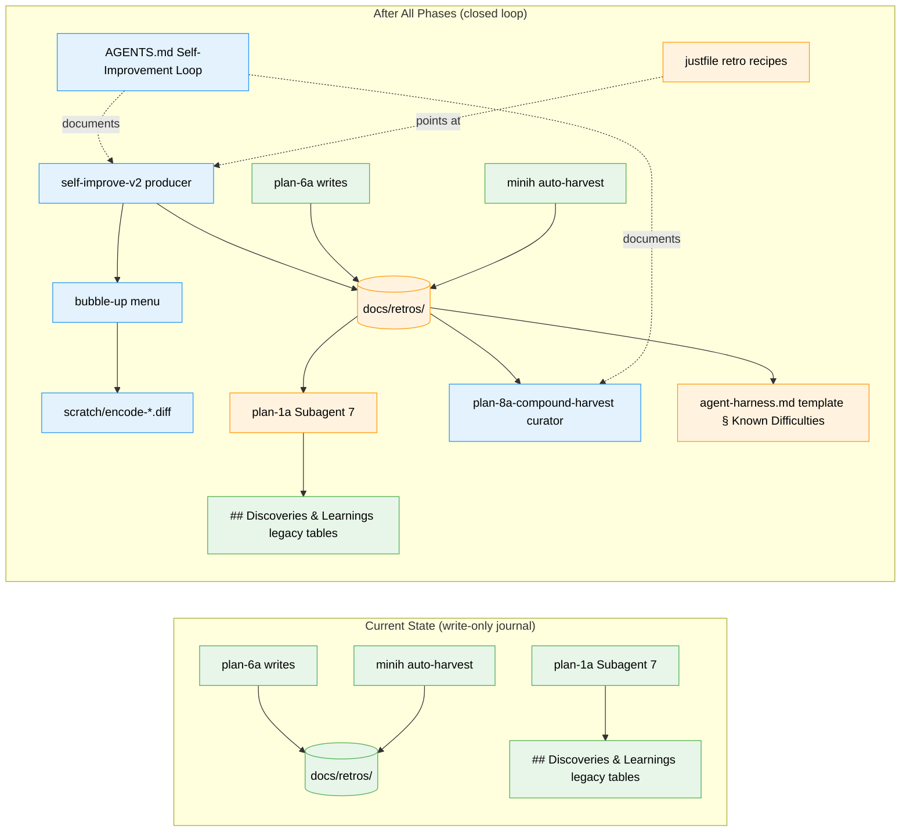

# Flight Plan: Self-Improving Difficulty Ledger Skill (`self-improve-v2` + `plan-8a-compound-harvest`)

**Spec**: [difficulty-ledger-skill-spec.md](./difficulty-ledger-skill-spec.md)
**Plan**: Pending — run `/plan-3-v2-architect` (after the four queued workshops)
**Generated**: 2026-05-16 · **Last clarified**: 2026-05-16 (Session 1, 8 questions, Mode locked to Simple)
**Status**: Clarified — workshops queued
**Mode**: Simple (single phase with grouped tasks; plan-4/plan-5 optional)

---

## The Mission

**What we're building**: Two paired portable skills that close both ends of the difficulty-ledger loop. **`self-improve-v2`** (producer) turns every agent session into a contributor — silently captures user-source and agent-source friction, then surfaces a single soft prompt at session end with one-keystroke options to save / fix-task / plan / encoded-knowledge / dismiss. **`plan-8a-compound-harvest`** (consumer; pipeline slot 8a between `plan-7-v2-code-review` and `plan-8-v2-merge`) reads accumulated ledger entries, curates them, flags stale ones, and surfaces a prioritised improvement-suggestion summary the user can route into fix-tasks or full plans.

**Why it matters**: The compounding-velocity premise of `harness-is-the-product-v2` Principle 2 — "every difficulty catalogued is a gift to future sessions" — is currently broken in this repo. Producers exist (`plan-6a`, minih) but no SDD skill reads from `docs/retros/`. The producer + consumer pair closes both ends of the loop and makes "encode, don't document" something every session does, not something one philosophy doc gestures at.

---

## Where We Are → Where We're Headed

```
TODAY:                                            AFTER this plan:
29 SDD skills                                     31 skills (2 new: self-improve-v2 +
                                                                  plan-8a-compound-harvest)
1 ledger producer (plan-6a, phase-end only)       2 ledger producers (+ self-improve-v2,
                                                                       every session)
0 ledger readers                                  2 readers (plan-1a Subagent 7 +
                                                             plan-8a-compound-harvest)
docs/retros/ empty                                docs/retros/ scaffolded + README + sessions/
AGENTS.md silent on the loop                      AGENTS.md "Self-Improvement Loop" section
                                                  (D7 voice; mirrored in CLAUDE.md)
0 sessions outside plan-6 contribute entries      Every session in any CLI can contribute
No portable, non-minih producer                   Portable producer + harvester in 5 CLIs
No bubble-up UX in the skill set                  Soft end-of-session prompt: [s/t/p/e/d/a]
Encoded fixes invisible / un-staged               Encoded fixes staged as scratch/*.diff
agent-harness.md template silent on difficulties  Template seeds § Known Difficulties from ledger
No way to triage accumulated learnings            plan-8a-compound-harvest curates after reviews

🔵 plan-6a → docs/retros/<plan>.md (unchanged)    🔵 plan-6a → docs/retros/<plan>.md (unchanged)
🔵 minih → docs/retros/<agent>.md (unchanged)     🔵 minih → docs/retros/<agent>.md (unchanged)
❌ No reader of docs/retros/                       🟡 plan-1a Subagent 7 reads docs/retros/+legacy
❌ No portable producer                            🔴 self-improve-v2 → docs/retros/ (NEW)
❌ No harvest/curate consumer                      🔴 plan-8a-compound-harvest reads + curates (NEW)
❌ No bubble-up                                    🔴 [s/t/p/e/d/a] menu at session end (NEW)
❌ No agent self-introspection contract            🔴 magic-wand check at natural pauses (NEW)
❌ agent-harness.md silent on prior difficulties   🟡 § Known Difficulties seeded from ledger
```



**Legend**: existing (green, unchanged) | changed (orange, modified) | new (blue, created)

---

## Scope

**Goals**:
- Every session in any supported CLI contributes to the ledger (not just `plan-6` invocations)
- Agent self-introspects at natural pauses ("if I had a magic wand right now?") — the most honest friction signal
- Silent during work, single soft prompt at end (never blocks mid-flow, never asks twice)
- One-keystroke escalation: save / fix-task / plan / encoded-knowledge / dismiss
- Encoded fixes staged as reviewable diffs in `scratch/` — never auto-applied (suggest, don't mandate)
- Close the read-side gap: at minimum `plan-1a-v2-explore` Subagent 7 reads `docs/retros/`
- Portable across Claude Code, Codex, Copilot CLI, Pi, OpenCode (no minih runtime dependency)
- AGENTS.md / CLAUDE.md describe the loop as an operational contract a fresh agent grasps in <60s

**Non-Goals**:
- Not a runtime; not a daemon; no session state outside the buffer file
- Not a replacement for minih's auto-harvest (interoperates by writing to the same directory)
- Not auto-applying any fix (every encoded change is a staged diff for user review)
- Not mid-session prompting (bubble-up at session end is the only user-facing surface)
- Not a JSON Schema validator in v1; not a `self-improve-v2 import-minih` importer in v1; not a cross-plan analytics tool in v1

---

## Journey Map


**Legend**: green = done | yellow = active | grey = not started

---

## Phases Overview

**Mode is Simple** (resolved in Clarification Q1). Plan-3 will produce **a single phase with grouped tasks** rather than a multi-phase split. The work groups below are informational; `/plan-3-v2-architect` produces the canonical task table inline in the plan document.

| Group | Scope | Status |
|-------|-------|--------|
| A | Four workshops (schema · CLI flow · AGENTS.md voice · harvest companion behaviour) | Pending |
| B | Build `self-improve-v2` (producer): `log` / `bubble` / `init` modes, `docs/retros/` scaffold, `_LEDGER.md` rebuild | Pending |
| C | Build `plan-8a-compound-harvest` (consumer): read-pass, dedup/cluster/age-order, staleness heuristics, prioritised summary, ledger-hygiene | Pending |
| D | Docs + harness: AGENTS.md / CLAUDE.md / README_AGENTS.md / justfile + `agent-harness-v2` template § Known Difficulties | Pending |
| E | Reader updates: `plan-1a-v2-explore` Subagent 7 reads `docs/retros/` | Pending |
| F | Dogfood week + Compounding Test evaluation; calibrate self-introspection + harvest-staleness heuristics | Pending |

**Spec-level complexity score**: CS-3 (medium). Breakdown: S=2, I=0, D=1, N=1, F=0, T=1.

**Mode tension note**: Six task groups in one phase is wide. `/plan-3-v2-architect` may surface this and recommend Full Mode instead. The user's clarification chose Simple — the architect should respect that unless wide-but-shallow proves unworkable.

---

## Acceptance Criteria

(Top-level criteria pulled from the spec's 15 ACs — the load-bearing ones for "the loop closed and the vibe was right.")

- [ ] **AC1**: No-op session (no friction encountered) shows no prompt at session end
- [ ] **AC2**: Multi-friction session shows a single soft bubble-up at session end with `[s/t/p/e/d/a]` actions and per-entry encoding hints
- [ ] **AC3**: Agent self-introspects at natural pauses with self-prompt rate ≤ 1 per 5 minutes; entries-per-session averages ≤ 5
- [ ] **AC9**: `plan-1a-v2-explore` Subagent 7 reads `docs/retros/` in addition to legacy `## Discoveries & Learnings` tables
- [ ] **AC10**: 1-week dogfood Compounding Test passes — ≥1 `[t/p/e]` action chosen, ≥1 entry marked `status: encoded`, ≥1 session that started by reading the ledger, user did not disable the skill
- [ ] **AC12**: Portable across all 5 supported CLIs with no minih dependency
- [ ] **AC13**: None of the 7 anti-vibes from the workshop is triggered (verified by walkthrough of the 3 imagined sessions)

---

## Key Risks

| Risk | Mitigation |
|------|-----------|
| **R1 — Agent compliance with `log` is too low** (medium/high). If agents systematically forget to call `log`, the buffer stays empty and the skill is a no-op. | D1 hybrid trigger (agent-self-invoked default + manual `/self-improve-v2 bubble` escape); modified pipeline skills include explicit `log` reminders at natural friction points; Compounding Test signal #1 measures this directly at 1 week. |
| **R3 — Reader-side updates land but don't surface entries usefully** (medium/high). Subagent 7 reads the new ledger but presents entries dryly → users don't act on them. | Phase 4 includes calibration of Subagent 7's surfacing logic; Compounding Test signal #3 measures this directly. Optional follow-up workshop on reader-side surfacing UX if dogfood reveals issues. |
| **R7 — User dismisses the bubble-up every time** (medium/high; this is anti-vibe 3 in motion). | D5 "terse + one-line encoding hint per entry" is the primary defense. If dismiss-rate >80% after 1 week, encoding hints need iteration — possibly a follow-up workshop. |
| **R2 — Self-introspection over-fires** (low/medium; anti-vibe 7). Agent runs the magic-wand check too often, buffer fills with low-quality entries. | Workshop trigger heuristics are concrete (not vibes); calibration target ≤1 per 5min; AC#3 measures explicitly. Tighten heuristics in Phase 5 if entry-rate exceeds threshold. |

---

## Flight Log

<!-- Updated by /plan-6 and /plan-6a after each phase completes -->

_No phases completed yet._
