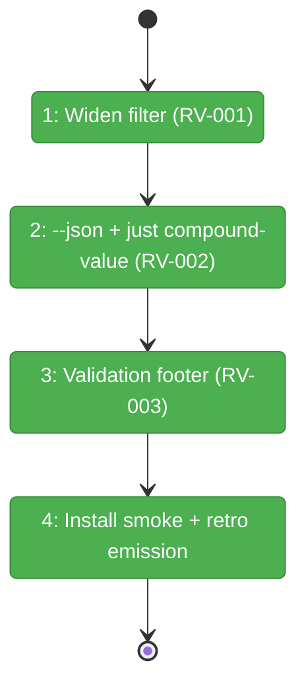

# Flight Plan: Fix FX001 — Group A Quick Wins

**Fix**: [FX001-group-a-quick-wins.md](./FX001-group-a-quick-wins.md)
**Plan**: [023-difficulty-ledger-skill](../difficulty-ledger-skill-plan.md)
**Workshop**: [007-post-launch-review-fixes](../workshops/007-post-launch-review-fixes.md)
**Generated**: 2026-05-18
**Status**: Landed (code merged; awaiting closure retro commit)

---

## What → Why

**Problem**: External review found 3 immediately-shippable defects/gaps in the compound + engineering-harness skill family: a confirmed taxonomy bug filtering boot-relevant entries out of Known Difficulties, no machine-readable read interface for `compound-3-harvest`, and ambiguity in what `[e]ncode` means without validation evidence.

**Fix**: Widen the target filter (RV-001), add a `--json` spec + `just compound-value` recipe via a stdin pretty-printer script (RV-002), and append a validation footer to staged encode diffs (RV-003). Single batch, no schema bump, additive only.

---

## Domain Context

| Domain | Relationship | What Changes |
|--------|-------------|-------------|
| engineering-harness | modify | Boot-time relevance filter widens — more compound entries surface in `## Known Difficulties` |
| compound | modify | `compound-3-harvest` adds `--json` flag spec; `compound-2-bubble` adds validation footer to encode-flow template |
| scripts | extend | New `scripts/compound-value.sh` — stdin JSON pretty-printer |

---

## Flight Status

<!-- Updated by /plan-6-v2: pending → active → done. Use blocked for problems/input needed. -->

**Legend**: grey = pending | yellow = active | red = blocked/needs input | green = done

---

## Stages

<!-- Updated by /plan-6-v2 during implementation: [ ] → [~] → [x] -->

- [x] **Stage 1: Widen target filter (RV-001)** — Update L156 (HTML comment) and L218 (Step 4a algorithm bullet) in `skills/SDD/engineering-harness-v2/SKILL.md` to include build/config/dependencies/env/auth/tests/observe
- [x] **Stage 2: `--json` + recipe (RV-002)** — Spec full JSON schema in `compound-3-harvest/SKILL.md`; add `scripts/compound-value.sh` (with rendering contract: 6 lines, jq-based, missing-field defaults); wire `just compound-value` recipe AND update the `help` recipe listing; run `./scripts/sync-to-dist.sh`
- [x] **Stage 3: Validation footer (RV-003)** — Append validation footer template (Run/Expected/Compound-lifecycle) to `[e]ncode` action in `skills/compound/compound-2-bubble/SKILL.md`
- [x] **Stage 4: Install smoke + write closure retros** — Run `just install-skills-from-source` (exit 0, no errors); hand-author one `.retro.md` containing all 3 entries (RV-001/002/003, kind=improvement-suggestion, `system.compound.status=encoded`, `system.compound.resolved_by=<commit-sha>`) under `docs/compound/agents/<agent-slug>/2026-05-1X/T<HH-MM-SS>Z-<hash>.retro.md` — this demonstrates Compounding Test signals (a)/(b)/(d). Signal (c) is delivered by the next session that reads the ledger.

---

## Acceptance

- [ ] Engineering-harness re-run produces `target: build` and `target: config` entries under `## Known Difficulties`
- [ ] `echo '<sample-json>' | just compound-value` renders the 6-line terminal view
- [ ] `[e]ncode` flow stages a diff that ends with a `## Validation` block
- [ ] `just install-skills-from-source` succeeds
- [ ] Three encoded retros (RV-001/002/003) exist under `docs/compound/agents/<slug>/2026-05-1*/T*.retro.md` with `resolved_by=<commit-sha>` — this is the compounding-test proof for plan 023
