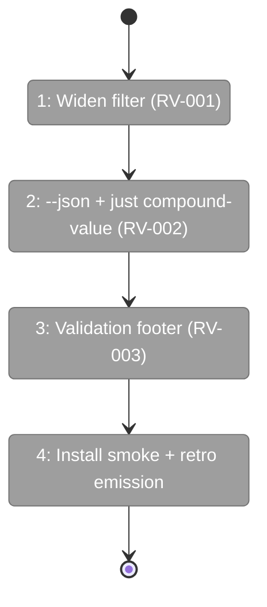

# Flight Plan: Fix FX001 — Group A Quick Wins

**Fix**: [FX001-group-a-quick-wins.md](./FX001-group-a-quick-wins.md)
**Plan**: [023-difficulty-ledger-skill](../difficulty-ledger-skill-plan.md)
**Workshop**: [007-post-launch-review-fixes](../workshops/007-post-launch-review-fixes.md)
**Generated**: 2026-05-18
**Status**: Ready for takeoff

---

## What → Why

**Problem**: External review found 3 immediately-shippable defects/gaps in the compound + engineering-harness skill family: a confirmed taxonomy bug filtering boot-relevant entries out of Known Difficulties, no machine-readable read interface for `compound-3-harvest`, and ambiguity in what `[e]ncode` means without validation evidence.

**Fix**: Widen the target filter (RV-001), add a `--json` spec + `just compound-value` recipe via a stdin pretty-printer script (RV-002), and append a validation footer to staged encode diffs (RV-003). Single batch, no schema bump, additive only.

---

## Domain Context

| Domain | Relationship | What Changes |
|--------|-------------|-------------|
| engineering-harness | modify | Boot-time relevance filter widens — more compound entries surface in `## Known Difficulties` |
| compound | modify | `compound-3-harvest` adds `--json` flag spec; `compound-2-bubble` adds validation footer to encode-flow template |
| scripts | extend | New `scripts/compound-value.sh` — stdin JSON pretty-printer |

---

## Flight Status

<!-- Updated by /plan-6-v2: pending → active → done. Use blocked for problems/input needed. -->

**Legend**: grey = pending | yellow = active | red = blocked/needs input | green = done

---

## Stages

<!-- Updated by /plan-6-v2 during implementation: [ ] → [~] → [x] -->

- [ ] **Stage 1: Widen target filter** — Update HTML comment and Step 4a clause to include build/config/dependencies/env/auth/tests/observe (`skills/SDD/engineering-harness-v2/SKILL.md` L155-156 + L218)
- [ ] **Stage 2: `--json` + recipe** — Spec the JSON schema in compound-3-harvest, add `scripts/compound-value.sh` (new), wire `just compound-value` (`skills/compound/compound-3-harvest/SKILL.md`, `scripts/compound-value.sh`, `justfile`)
- [ ] **Stage 3: Validation footer** — Append validation footer template to `[e]ncode` action in `skills/compound/compound-2-bubble/SKILL.md`
- [ ] **Stage 4: Install smoke + emit compound retros** — Run `just install-skills-from-source` to confirm no breakage; emit three `encoded` retros (RV-001/002/003) via `plan-6a` so the loop literally closes

---

## Acceptance

- [ ] Engineering-harness re-run produces `target: build` and `target: config` entries under `## Known Difficulties`
- [ ] `echo '<sample-json>' | just compound-value` renders the 6-line terminal view
- [ ] `[e]ncode` flow stages a diff that ends with a `## Validation` block
- [ ] `just install-skills-from-source` succeeds
- [ ] Three encoded retros (RV-001/002/003) exist under `docs/compound/agents/<slug>/2026-05-1*/T*.retro.md` with `resolved_by=<commit-sha>` — this is the compounding-test proof for plan 023
