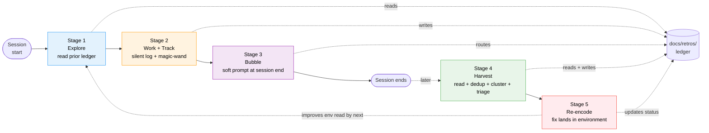
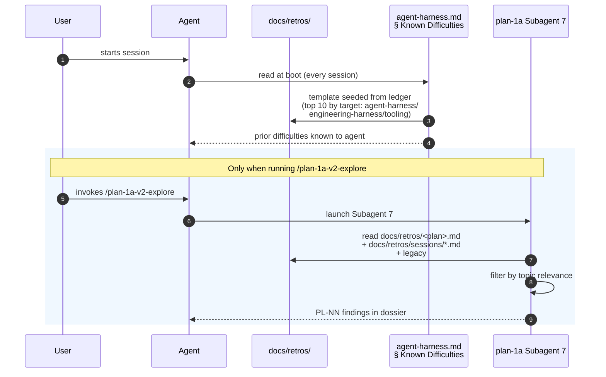
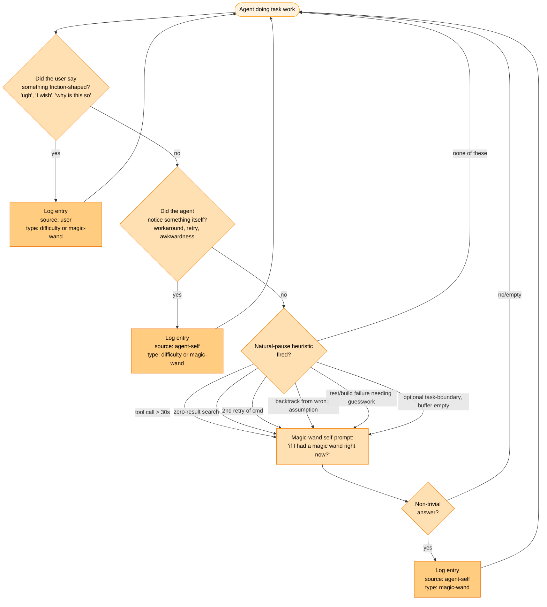
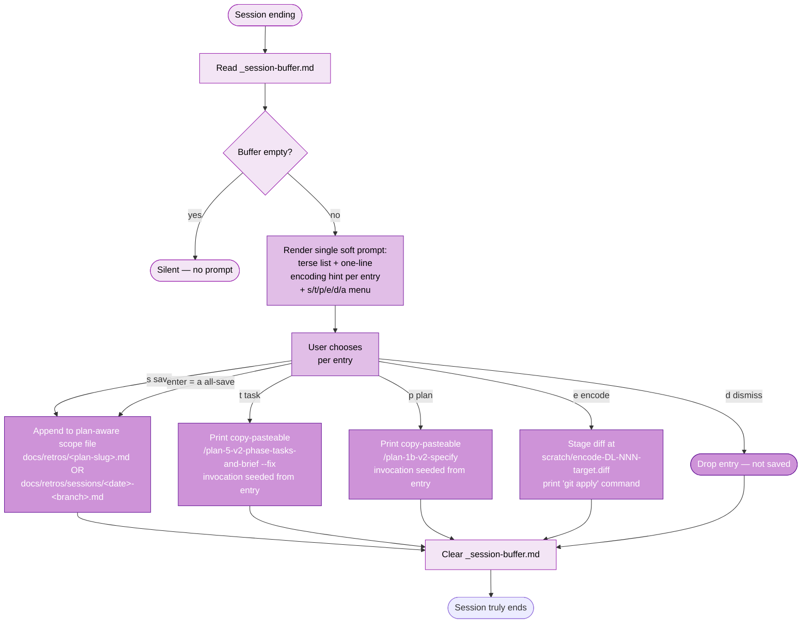
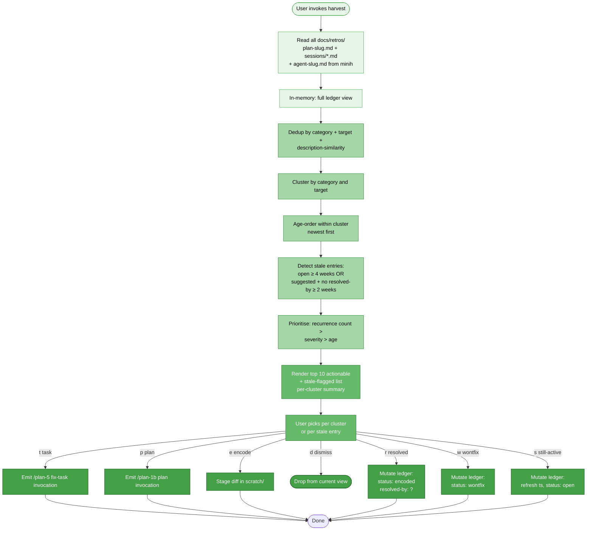
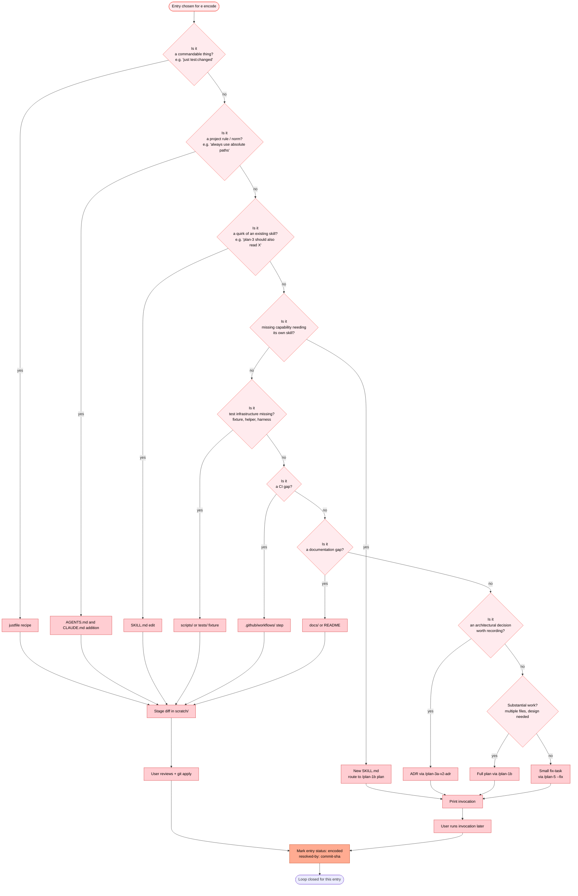
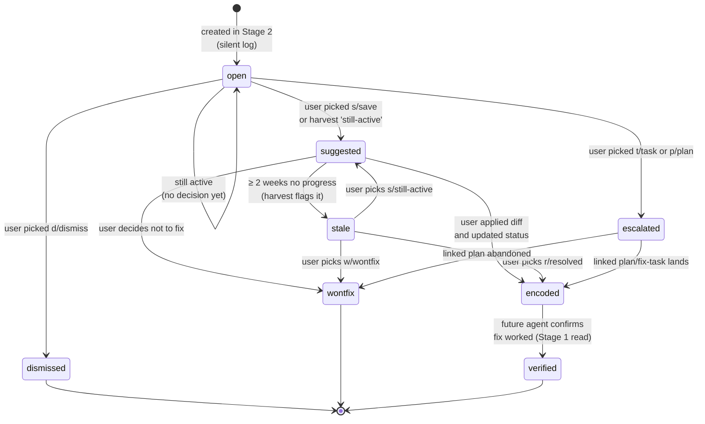
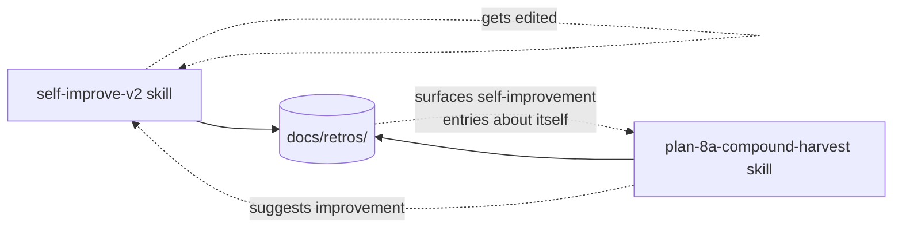

# Workshop: End-to-End Self-Improvement Flow

**Type**: Integration Pattern
**Plan**: 023-difficulty-ledger-skill
**Spec**: [difficulty-ledger-skill-spec.md](../difficulty-ledger-skill-spec.md)
**Created**: 2026-05-16
**Status**: Draft

**Value Thesis**: The dossier diagnosed the gap, the vibe workshop locked the *feel*, the spec listed *what* to build. None of those show the **flow** — the continuous loop from "agent starts a session" to "encoded fix lands in the environment" and back. This workshop draws that loop with Mermaid diagrams stage by stage so a fresh implementer can see the whole picture before touching any single skill. Without it, each implementer has to compose the flow mentally from scattered fragments across `self-improve-v2`, `plan-8a-compound-harvest`, `plan-1a` Subagent 7, `agent-harness-v2`, and `harness-is-the-product-v2`. With it, the integration view is a single document.

**Target Proof Level**: Contract Ready (the inter-stage contracts — what one stage passes to the next — are explicit; the contracts are diagrammed and named so downstream skills can be implemented against them)
**Current Proof Level**: Contract Ready (reached by this document)

**Selected Value Axes**:
- **Implementation Readiness** *(primary)*: Downstream implementers (skill authors, AGENTS.md authors) can build their parts knowing exactly what they consume and produce.
- **Cross-Domain Coordination**: The loop crosses multiple skills (`self-improve-v2`, `plan-8a-compound-harvest`, `plan-1a` Subagent 7, `agent-harness-v2`); this workshop is the contract sheet between them.
- **Knowability**: Currently the flow lives in fragments across the dossier, vibe workshop, and spec. After this workshop the flow is *visible* end-to-end as a single artefact.
- **Learning Compounding**: The whole point of the loop is compounding velocity. This workshop makes the compounding mechanism explicit (where does each entry go and why).
- **Operator Usability**: The user only sees Stages 3 and 4 directly; the workshop ensures those stages compose cleanly with the silent stages (1, 2, 5).

**Related Documents**:
- [research-dossier.md](../research-dossier.md) — gap diagnosis (producers without readers)
- [001-self-improvement-vibe.md](./001-self-improvement-vibe.md) — locked the vibe and 8 design decisions
- [difficulty-ledger-skill-spec.md](../difficulty-ledger-skill-spec.md) — the spec this flow implements
- [`harness-is-the-product-v2`](../../../../skills/SDD/harness-is-the-product-v2/SKILL.md) — the philosophical parent ("encode, don't document")
- [Minih AGENTS_README § Improvement Loop](https://github.com/AI-Substrate/minih/blob/main/AGENTS_README.md) — minih's analogous flow

**Domain Context**: Not applicable — this repo doesn't use the formal `docs/domains/` system. The flow crosses skill boundaries; the contracts between skills are documented in this workshop.

---

## Purpose

Draw the **complete, continuous loop** from session start through re-encoded fix, with Mermaid diagrams for each stage and explicit contracts at every boundary. The user's directive: "just on the flow. you explore and ensure you know prior difficulties. then you do your owrk, and track for difficultues and magic wands as you go. Then when done we extract / harest them and talk about if htey shoudl be re-encoded in to our evnironemtn or even directly to our engineering harness etc... might be extra bits etc."

This workshop produces:

1. **One overview diagram** of the five-stage loop.
2. **One detail diagram per stage** showing internal logic.
3. **One state machine** for an entry's lifecycle.
4. **One sequence diagram** worked through end-to-end with a real example.
5. **One decision tree** for "where does the re-encoded fix live?" (the user's "extras" — the encoding targets).
6. **A short Decision Space** anchoring inter-stage contract choices.

What this workshop does NOT produce: the schema (deferred to schema workshop), the literal CLI prompt copy (deferred to CLI-flow workshop), or the AGENTS.md text (deferred to AGENTS.md voice workshop). Those workshops can hang their specifics off the contracts this workshop locks.

## Fresh Entrant Outcome

A fresh human or agent should be able to use this workshop to reach **Contract Ready** with no additional context.

They should be able to:

- Draw the five-stage loop on a whiteboard from memory after one read.
- Name what each stage consumes and what it produces (the inter-stage contracts).
- Identify which stages are silent vs which surface to the user.
- Describe an entry's full lifecycle from `_session-buffer.md` to `status: encoded, resolved-by: <commit>`.
- Pick the right encoding destination (justfile / AGENTS.md / SKILL.md / fix-task / full plan / ADR / etc.) for a given entry by walking the decision tree.
- Say which existing skills own which stages and what the skills must do to honour the contracts.

## Key Questions Addressed

- What are the discrete stages of the loop, and where do their boundaries sit?
- What does each stage consume from the previous stage and produce for the next?
- Which stages are silent (background) and which surface to the user?
- What is the lifecycle of a single entry from creation to retired?
- When the user picks `[e]ncode`, what are the candidate destinations and how is the right one chosen?
- What "extras" round out the loop (verification, promotion, recursion)?
- How does this loop integrate with `plan-1a` Subagent 7's research read, `agent-harness-v2`'s template seeding, and `plan-7-v2-code-review`'s timing?

---

## Value Frame

| Field | Selection | Why It Matters |
|-------|-----------|----------------|
| Target Proof Level | Contract Ready | The next workshops (schema, CLI flow, AGENTS.md voice, harvest behavior) all need clear inter-stage contracts to design against. Implementation Ready would over-constrain those workshops; Decision Space would under-constrain them. Contract Ready is the right gate. |
| Primary Value Axis | Implementation Readiness | This workshop's explicit job is to produce diagrams + contracts that downstream implementers build against. |
| Supporting Value Axes | Cross-Domain Coordination · Knowability · Learning Compounding · Operator Usability | The loop crosses multiple skills (Cross-Domain); makes the previously-fragmented flow visible (Knowability); is the mechanism for compounding (Learning Compounding); user-touched stages must compose cleanly (Operator Usability). |
| Downstream Loop Improved | Specification + design (the four queued workshops + plan-3) | Each downstream artefact can reference the diagrams in this workshop rather than re-deriving the flow from scattered fragments. |

---

## Evidence Ledger

| Evidence | Location | Supports | Status |
|----------|----------|----------|--------|
| Five-stage overview Mermaid | § "The Five-Stage Loop" | The whole-loop view; load-bearing diagram | Ready |
| Stage 1: Explore — sequence Mermaid | § "Stage 1 — Explore" | Read-side contract: agent reads `docs/retros/`, `agent-harness.md § Known Difficulties`, prior plans' Subagent 7 outputs at session start | Ready |
| Stage 2: Work + Track — flowchart Mermaid (trigger heuristics) | § "Stage 2 — Work + Track" | Producer contract: when `log` is called, what triggers the magic-wand check, what gets written to the buffer | Ready |
| Stage 3: Bubble — flowchart Mermaid (`[s/t/p/e/d/a]` decision tree) | § "Stage 3 — Bubble" | User-facing contract: the menu's actions, defaults, save destinations | Ready |
| Stage 4: Harvest — flowchart Mermaid (read → dedup → cluster → triage) | § "Stage 4 — Harvest" | Consumer contract: how `plan-8a-compound-harvest` reads + curates + presents | Ready |
| Stage 5: Re-encode — decision tree Mermaid (encoding-target chooser) | § "Stage 5 — Re-encode" | Encoding contract: which destination wins for which entry kind | Ready |
| Entry lifecycle state machine | § "Entry Lifecycle" | Lifecycle contract: status transitions and triggers | Ready |
| Worked example sequence diagram | § "Worked Example" | Validates the contracts compose for one realistic entry end-to-end | Ready |
| Extras (verification, promotion, recursion, cross-project sharing) | § "Extras / Variants" | The user's "might be extra bits"; clarifies what the loop *also* enables beyond the core path | Ready |
| Decision Space — 6 inter-stage contract decisions | § "Decision Space" | Anchors contract choices downstream workshops depend on | Ready |
| Schema field shape | (deferred to schema workshop) | — | Missing (out of scope) |
| Literal CLI prompt copy | (deferred to CLI-flow workshop) | — | Missing (out of scope) |
| AGENTS.md text | (deferred to AGENTS.md voice workshop) | — | Missing (out of scope) |

---

## The Five-Stage Loop

The whole loop in one diagram. Read left-to-right; the dashed return arrow shows that re-encoded fixes update the environment that the *next* session's Stage 1 reads — that is the compounding.



**Legend**: explore (blue) | work (orange) | bubble (purple) | harvest (green) | encode (red). The cylinder is `docs/retros/` — every stage touches it.

**Key contract**: every stage either reads from or writes to `docs/retros/`. The directory is the single integration surface. No skill in the loop talks to another skill directly — they all communicate through the ledger files. This is why the schema workshop matters so much: the schema *is* the inter-stage contract.

---

## Stage 1 — Explore

**What happens**: At session start, before doing any task work, the agent reads accumulated ledger entries so that prior difficulties inform the current session. This is what closes the read-side of the compounding loop.

**Who triggers it**: `plan-1a-v2-explore` Subagent 7 (during research dossier generation), and `agent-harness-v2`'s generated `agent-harness.md § Known Difficulties` (during agent boot, every session). Both are reader-side updates locked in spec AC#9 and AC#22.



**Contract IN** (what Stage 1 consumes): the ledger file tree under `docs/retros/`. Schema specified by the schema workshop.

**Contract OUT** (what Stage 1 produces): prior-friction context loaded into the agent's working memory at session start (via `agent-harness.md`) and into research dossiers (via `plan-1a` Subagent 7). No new ledger writes.

**Why this matters**: Without Stage 1, the loop is open at the read end — exactly the gap the dossier diagnosed (PL-03). Stage 1 is what makes the compounding *compound*.

---

## Stage 2 — Work + Track

**What happens**: The agent does its primary task. While doing so, it silently logs friction observations to `_session-buffer.md`. Two sources: the user mutters / says something; the agent itself notices something or runs the magic-wand self-check at a natural pause.

**Who triggers it**: `self-improve-v2` `log` mode. Called by the agent during normal task work. Silent — never surfaces to the user.



**Contract IN**: the user's spoken/typed messages and the agent's own observations during work. No file reads required (Stage 1 already loaded prior context).

**Contract OUT**: append-only writes to `docs/retros/_session-buffer.md`. Each entry has `source` (`user` | `agent-self`), `type` (`difficulty` | `magic-wand` | `gift` | `insight`), `category`, `target`, `description`, optional `workaround`, optional `suggested-encoding` sketch. Schema details deferred to schema workshop.

**Trigger calibration**: per the vibe workshop's anti-vibe 7, agent self-introspection rate must stay ≤ 1 per 5 minutes of work in typical sessions. The trigger heuristics in the diagram are concrete; if entries-per-session averages > 5, the heuristics are misfiring.

---

## Stage 3 — Bubble

**What happens**: At session end, the skill reads `_session-buffer.md`, presents a single soft prompt with all entries and the action menu, and routes the user's choices.

**Who triggers it**: `self-improve-v2` `bubble` mode. Per D1 (vibe workshop): hybrid trigger — agent-self-invoked default before handing back, with `/self-improve-v2 bubble` available as manual escape hatch.



**Contract IN**: `_session-buffer.md` (entries from Stage 2).

**Contract OUT**: zero or more entries appended to scope files (`<plan-slug>.md` or `sessions/<date>-<branch>.md`); zero or more printed invocations (`/plan-5`, `/plan-1b`); zero or more staged diff files in `scratch/`; buffer cleared. Per D2 (vibe workshop) the default action on `enter` is `[a]ll-save`.

**Plan-aware destination logic** (D4 from vibe workshop): if cwd is inside `docs/plans/NNN-<slug>/` OR current branch matches `^\d{3}-`, save to that plan's `<plan-slug>.md`; otherwise save to `sessions/<date>-<branch>.md`. Same heuristic `plan-1a` step 1 already uses.

---

## Stage 4 — Harvest

**What happens**: Periodically (typically after a `plan-7-v2-code-review` cycle), the user invokes `plan-8a-compound-harvest`. The skill reads accumulated entries across all scope files, deduplicates, clusters, age-orders, flags stale entries, and presents a prioritised improvement-suggestion summary with per-cluster actions.

**Who triggers it**: `plan-8a-compound-harvest` skill. Invoked manually (`/plan-8a-compound-harvest`) or prompted at the end of `plan-7-v2-code-review`'s output (in a follow-up plan; not modifying `plan-7` in v1).



**Contract IN**: every entry across `docs/retros/<plan>.md`, `docs/retros/sessions/*.md`, and `docs/retros/<agent>.md` (where minih has written).

**Contract OUT**: prioritised summary presented to the user; zero or more emitted invocations (same as Stage 3); zero or more staged diffs (same as Stage 3); zero or more **in-place ledger mutations** (status updates to `encoded`/`wontfix`/`still-active`/`open`).

**Difference from Stage 3**: Stage 3 surfaces a *single* session's entries; Stage 4 surfaces *accumulated* entries across many sessions. Stage 3 only writes new entries; Stage 4 *mutates existing entries' status*. The new `[r]/[w]/[s]` actions are unique to Stage 4 — they're ledger-hygiene operations.

**Per spec AC#16–22**: the harvest skill is the consumer-side counterpart to `self-improve-v2` and is required for the loop to close. Without Stage 4, the ledger accumulates entries that nobody triages — back to the silent-journal failure mode.

---

## Stage 5 — Re-encode

**What happens**: When the user picks `[e]ncode` (in Stage 3 or Stage 4), the skill stages a candidate diff in `scratch/`. The user reviews, applies (`git apply`), and the encoded fix lands in the environment — justfile recipe, AGENTS.md addition, SKILL.md edit, script, fixture, CI step, ADR, etc. The user updates the entry's `status: encoded` with `resolved-by: <commit>`.

This is the most decision-rich stage. The user's "might be extra bits etc." was specifically about this: what counts as a re-encoded fix, and where does it live?



**Contract IN**: a single entry chosen for `[e]ncode`, plus its `suggested-encoding` field from the producer.

**Contract OUT**: a staged diff at `scratch/encode-<entry-id>-<target-shortname>.diff` OR a printed invocation; eventually a status mutation on the entry (`status: encoded, resolved-by: <commit | PR | plan-NNN>`).

**Encoding-target priority** (top-to-bottom in the decision tree, with rationale):
- **justfile recipe** (most preferred for repeatable commands) — encodes commandable knowledge as executable
- **AGENTS.md / CLAUDE.md** — for norms / project rules; cheap to add, high read-leverage
- **SKILL.md edit** — for skill-specific quirks; tightest integration with the SDD pipeline
- **New SKILL.md** — for missing capability; promotes to a proper plan
- **Test fixture / script** — for testing infrastructure gaps
- **CI step** — for gaps in automated quality gates
- **Doc** — for knowledge gaps not captured by recipes
- **ADR** — for design decisions worth preserving
- **Full plan / fix-task** — for substantial work that doesn't fit any of the above

**Why staged-diff and not auto-apply** (D3 from vibe workshop): suggest-don't-mandate. Anti-vibe 5 is auto-magic the user didn't ask for. The diff in `scratch/` gives the user something concrete to review without surrendering control.

---

## Entry Lifecycle

A single entry's status flows through a bounded state machine:



**Contract**: every entry has a `status` field that takes values: `open` | `suggested` | `encoded` | `verified` | `wontfix` | `dismissed` | `escalated` | `stale`. Transitions are triggered by user actions in Stage 3 or Stage 4 (or by the verification step in Stage 1 of a *future* session — see Extras).

---

## Worked Example

A single difficulty's full journey from silent observation to verified fix.

```mermaid
sequenceDiagram
    autonumber
    participant U as User
    participant A as Agent
    participant SI as self-improve-v2
    participant LD as docs/retros/
    participant H as plan-8a-compound-harvest
    participant F as Filesystem<br>(justfile, scratch/)
    participant G as git

    Note over U,A: Day 1 — Code review session
    U->>A: review PR #142
    A->>A: run test suite (90s)
    Note over A: tool call > 30s → magic-wand check fires
    A->>A: 'if I had a magic wand: a `just test:changed` recipe'
    A->>SI: log(type: magic-wand, source: agent-self,<br>category: test, target: engineering-harness,<br>description: '...', suggested-encoding: justfile recipe)
    SI->>LD: append to _session-buffer.md as DL-001
    A->>U: posts review

    Note over A,U: Session ending — Stage 3 fires
    A->>SI: bubble (auto-self-invoked)
    SI->>LD: read _session-buffer.md
    SI->>U: 🎁 1 entry: DL-001 [magic-wand]<br>'No way to run tests in diff'<br>Suggested fix: justfile recipe<br>[s/t/p/e/d/a]?
    U->>SI: e (encode)
    SI->>F: write scratch/encode-DL-001-justfile.diff
    SI->>U: Wrote candidate edit. Apply with: git apply ...
    SI->>LD: append DL-001 to docs/retros/sessions/<br>2026-05-16-pr-142-review.md (status: suggested)
    SI->>LD: clear _session-buffer.md

    Note over U,F: Day 1 — User reviews and applies
    U->>F: cat scratch/encode-DL-001-justfile.diff
    U->>G: git apply scratch/encode-DL-001-justfile.diff
    U->>G: git commit -m 'add just test:changed recipe'
    U->>LD: edit DL-001 status: encoded,<br>resolved-by: commit abc123

    Note over U,H: Day 8 — Weekly harvest
    U->>H: /plan-8a-compound-harvest
    H->>LD: read all scope files
    H->>U: 🌾 Top entries:<br>- DL-001 [encoded] ✓ verified by recent commit<br>- (other entries...)

    Note over U,A: Day 15 — New session, new agent
    U->>A: starts new session
    A->>LD: agent-harness.md § Known Difficulties<br>(template seeded from ledger)
    Note over A: agent boots knowing 'just test:changed' exists
    A->>F: just test:changed
    Note over A: works in 8s instead of 90s — compounding!
    A->>SI: log(type: gift, source: agent-self,<br>description: 'verified DL-001 fix',<br>resolves: DL-001)
    SI->>LD: append verification entry; mark DL-001 status: verified
```

**Result**: One difficulty went from silent observation → suggested → encoded → verified across 15 days. The 90-second test wait became an 8-second test run for every future agent. The compounding-velocity hypothesis is operating.

---

## Extras / Variants

The user said "might be extra bits etc." — here are the variants the loop also enables:

### Variant A — Verification (closing the verification half-loop)

When a future agent reads `agent-harness.md § Known Difficulties` and sees an entry marked `status: encoded`, it can attempt the encoded fix and confirm it works. If yes, the agent logs a `type: gift` entry that flips the original entry to `status: verified`. This is the second half of the loop closing (the "verified" terminal state in the lifecycle).

**Why it matters**: encoded ≠ verified. An encoded fix that doesn't actually work is worse than no fix (false confidence). Verification by a fresh agent is the strongest test.

### Variant B — Promotion (cross-plan generality)

When the harvest skill notices an encoded fix has been useful across ≥ 3 plans (multiple `resolved-by` references in the ledger), it can suggest promoting the fix to a more permanent home — e.g. project constitution, framework defaults, a `docs/how/` article, or upstream contribution. The harvest skill flags it; the user decides.

**Example**: a justfile recipe that proved useful for `self-improve-v2`, `plan-8a-compound-harvest`, AND `plan-7-v2-code-review` belongs in the global `justfile` rather than per-skill duplicates.

### Variant C — Recursion (the skills dogfood themselves)

`self-improve-v2` and `plan-8a-compound-harvest` are themselves skills. Entries about *them* go into the same ledger:



The recursion is delicious: the skill that improves the harness uses itself to improve itself. The vibe workshop's anti-vibe 7 (over-introspection) is the failure mode of this recursion if heuristics misfire.

### Variant D — Cross-project sharing (npm-skills install pattern)

A magic-wand fixed in this repo (e.g. a useful justfile recipe) can be shared with other projects via `npx skills add jakkaj/tools --skill <name>`. Entries that reach `status: verified` and `category: tooling | engineering-harness` are candidates. Out of v1 scope; flagged here as a future extension.

### Variant E — Minih interop (read-side)

Minih's auto-harvested `docs/retros/<agent-slug>.md` files are read by Stage 4 (and Stage 1 via `agent-harness-v2`) but written by minih itself. The schema workshop must ensure portable YAML can coexist with minih's structured retros; the `self-improve-v2 import-minih` follow-up plan handles formal interop.

---

## Decision Space

Inter-stage contract decisions. Most were already locked by the vibe workshop or the spec; a handful are new to this flow workshop.

| Option | Description | Pros | Cons | Decision |
|--------|-------------|------|------|----------|
| **F1a** — Stage 1 reads always run at session start | `agent-harness.md § Known Difficulties` is loaded into agent context every session | Always-on context; no opt-in friction | Uses tokens whether needed or not | **Selected** (per spec AC#22; agent-harness-v2 template change) |
| **F1b** — Stage 1 reads only when invoked | Only `plan-1a` Subagent 7 reads; no boot-time context | Cheap | Most sessions never see prior friction; weakens compounding | Rejected |
| **F2a** — Single integration surface = `docs/retros/` | All stages read/write through ledger files; no direct skill-to-skill calls | Loose coupling; minih interop free; testable | Slightly more parsing per stage | **Selected** (the load-bearing choice this workshop locks) |
| **F2b** — In-memory message bus between skills | Skills emit events to a shared bus; harvest subscribes | Tighter coordination | Requires a runtime; breaks portability across CLIs; not viable | Rejected |
| **F3a** — Stage 3 (bubble) and Stage 4 (harvest) share the action vocabulary `[s/t/p/e/d/a]` | Same menu in both stages; harvest adds `[r/w/s]` for status updates | User learns one menu; Stage 4 only adds the lifecycle actions | None significant | **Selected** |
| **F3b** — Stage 4 has a totally different menu | Harvest UX optimised for triage rather than per-entry escalation | Possibly clearer for batch triage | Two menus to learn; UX inconsistency | Rejected |
| **F4a** — `[e]ncode` always stages a diff in `scratch/` | Both Stage 3 and Stage 4 use the same staged-diff pattern | Predictable, reviewable, no auto-magic | One extra command (`git apply`) | **Selected** (per vibe workshop D3) |
| **F4b** — `[e]ncode` auto-applies in Stage 4 | Harvest is "post-review cleanup" — assume user already approved the encoded form | Faster | Violates suggest-don't-mandate; anti-vibe 5 | Rejected |
| **F5a** — Status mutations are in-place edits to the ledger file | Stage 4 directly rewrites the entry's `status` field | Simple; auditable via git history | Concurrent harvest + log race possible (rare) | **Selected** |
| **F5b** — Status mutations append a new entry that supersedes | Append-only ledger; mutations are new entries that link the original | Pure append-only semantics | Harder to read current status; needs reduce step at every read | Rejected |
| **F6a** — Verification entries are auto-detected from later sessions | Future agent's `type: gift, resolves: DL-NNN` entry triggers status: verified | Closes the verification half-loop automatically | Requires the agent to think to log it | **Selected** |
| **F6b** — Verification is a separate manual step | User explicitly marks verified | More deterministic | More user friction; lower verification rate | Rejected |

### Decision Summary (the contracts this workshop locks)

| ID | Contract | Locked Choice |
|----|----------|---------------|
| F1 | When does Stage 1 read happen? | Always at session start (via agent-harness.md template seed) + on-demand via plan-1a Subagent 7 |
| F2 | What's the integration surface between skills? | The `docs/retros/` ledger files. No direct skill-to-skill calls. |
| F3 | Action vocabulary in Stage 3 vs Stage 4? | Shared `[s/t/p/e/d/a]`; Stage 4 adds `[r/w/s]` for lifecycle |
| F4 | What does `[e]ncode` do in both stages? | Stages a diff in `scratch/`; never auto-applies |
| F5 | How are status mutations represented? | In-place edit to the entry's `status` field |
| F6 | How are encoded fixes verified? | Auto-detected from a future agent's `type: gift` entry with `resolves: <id>` |

---

## Attention Reduction

| Future Loop | Before Workshop | After Workshop |
|-------------|-----------------|----------------|
| Schema workshop | "What fields does each stage need?" was scattered across spec / dossier / vibe workshop | Each stage's `Contract IN` and `Contract OUT` lists field categories explicitly; schema design starts from these requirements |
| CLI-flow workshop | "What does the bubble look like?" without knowing what comes before/after | Stage 3 diagram shows exactly which decisions land in the user's lap; CLI-flow workshop designs the literal copy |
| AGENTS.md voice workshop | "What's the loop the section describes?" — vague | The five-stage diagram is the loop; AGENTS.md describes it in 10–15 lines pointing at this workshop |
| Harvest companion behavior workshop | "What does harvest do?" — open | Stage 4 diagram + lifecycle state machine + F-decisions cover most of the behavior space; the harvest workshop locks specifics (staleness thresholds, summary rendering) |
| `/plan-3-v2-architect` phase design | "What's the work breakdown?" — needed to be inferred from spec | Six task groups already in spec § Complexity, each maps to a stage in this workshop |
| Implementation review | "Did the implementor build the right loop?" | Reviewer compares implementation against the five Mermaid diagrams; mismatches are explicit |
| Onboarding a fresh agent or contributor | "Read 4 docs to understand the loop" | This workshop is the canonical loop view; other docs (dossier, vibe, spec) become supplementary |

---

## Open Questions

### Q1: How does the harvest skill detect "active plan" for plan-aware destinations?

**RESOLVED**: same heuristic as `plan-1a-v2-explore` step 1 — cwd inside `docs/plans/NNN-<slug>/` OR branch matches `^\d{3}-`. Locked by D4 (vibe workshop) and reused here for consistency.

### Q2: Should Variant A (verification) be in v1 scope?

**OPEN**. The verification half-loop is described in this workshop and the lifecycle state machine includes the `verified` terminal state, but no AC in the current spec mandates it. Recommendation: defer auto-verification to a follow-up plan; allow manual `verified` status updates in v1 via the harvest `[r]/resolved` flow. Workshop entry: future-flag.

### Q3: Should Variant B (promotion) be in v1 scope?

**OPEN**. Recommendation: NO in v1. Promotion is a "we've used this loop for a while and want to graduate well-traveled fixes" feature. Premature for v1 (we don't have the data yet). Document in this workshop for future reference.

### Q4: When stage 4 mutates ledger files in place, how do we handle git conflicts?

**OPEN**. If two harvest invocations run concurrently (rare but possible), in-place edits could conflict. Recommendation: harvest is a per-user, per-machine operation; `docs/retros/` writes are normal git changes; conflicts resolve like any other markdown conflict. Document the assumption; revisit if conflicts become a real problem.

### Q5: What happens if a `suggested-encoding` field's `kind` doesn't fit any branch of the Stage 5 decision tree?

**RESOLVED**: the decision tree's terminal branches "small fix-task via /plan-5 --fix" or "full plan via /plan-1b" are the catch-alls. Any encoding that doesn't fit a specific destination falls through to one of those. The producer's `suggested-encoding` field is a *hint*, not a constraint — the user always has final say on destination.

---

## Validation / Acceptance

This workshop reaches its target proof level (**Contract Ready**) when:

1. The five stage diagrams (overview + 5 details) are read by a fresh entrant who can reproduce the loop on a whiteboard from memory and explain what each stage consumes/produces.
2. The lifecycle state machine, the worked-example sequence diagram, and the encoding-target decision tree together let a fresh implementer answer "what happens to a single entry from creation to retired?" without ambiguity.
3. The six F-decisions in the Decision Space table are explicit enough that a future contributor can argue "this proposal violates F2 / F4" with the workshop text supporting the argument.
4. The downstream workshops (schema / CLI flow / AGENTS.md voice / harvest behavior) can each cite "Contract IN" and "Contract OUT" sections of this workshop as their starting point — i.e. they don't need to re-derive the inter-stage contracts.
5. `/plan-3-v2-architect` can produce a single-phase task table with the six task groups (already in spec § Complexity) where each group maps cleanly to one or more stages in this workshop.

The acceptance test for this workshop specifically: the user reads the diagrams, the worked example, the encoding decision tree, and either (a) approves them, or (b) flags specific contracts (F1–F6) that should change — without invalidating the five-stage structure.

---

## Quick Reference

**The five stages**: Explore (read prior) → Work + Track (silent log + magic-wand) → Bubble (soft prompt at session end) → Harvest (post-review curation) → Re-encode (fix lands in environment, loop returns to Stage 1).

**The integration surface**: `docs/retros/` files. No skill talks to another skill directly — they communicate through the ledger.

**The user-facing stages**: Stage 3 (bubble) and Stage 4 (harvest). All others are silent to the user.

**The action vocabulary**: `[s]ave / [t]ask / [p]lan / [e]ncode / [d]ismiss / [a]ll-save` shared by Stages 3 and 4. Stage 4 adds `[r]esolved / [w]ontfix / [s]till-active` for status updates.

**The encoding targets** (Stage 5 decision tree, in priority): justfile recipe → AGENTS.md/CLAUDE.md → SKILL.md edit → new SKILL.md (full plan) → test fixture → CI step → doc → ADR → fix-task or full plan (catch-all).

**The lifecycle**: open → suggested → encoded → verified | wontfix | dismissed | stale | escalated.

**The compounding mechanism**: Stage 5 updates the environment; Stage 1 of the next session reads that improved environment via `agent-harness.md § Known Difficulties`. The loop closes session-by-session.

**The six locked contracts**: F1 (Stage 1 always at session start), F2 (ledger-as-integration-surface), F3 (shared action vocabulary), F4 (encode = stage diff in scratch/), F5 (in-place status edits), F6 (auto-detected verification from future gift entries).

---

**Next steps after this workshop**:

- User reviews the five stage diagrams, the worked example, the encoding decision tree, and the six F-decisions.
- If approved → the four queued workshops (schema, CLI flow, AGENTS.md voice, harvest behavior) can each cite this workshop's contracts as their starting point.
- After all workshops: `/plan-3-v2-architect` produces the single-phase task table.
- If revisions needed → iterate this workshop, then proceed.
