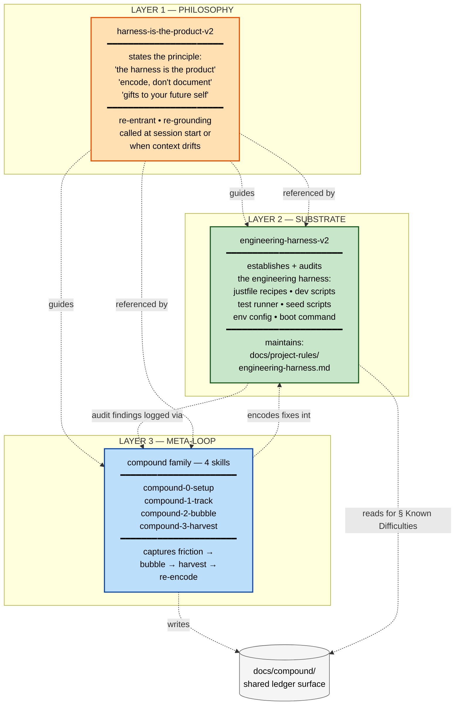
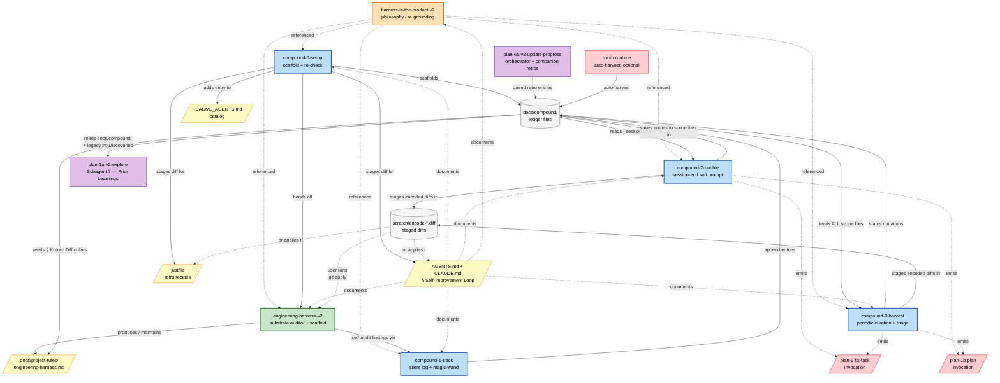
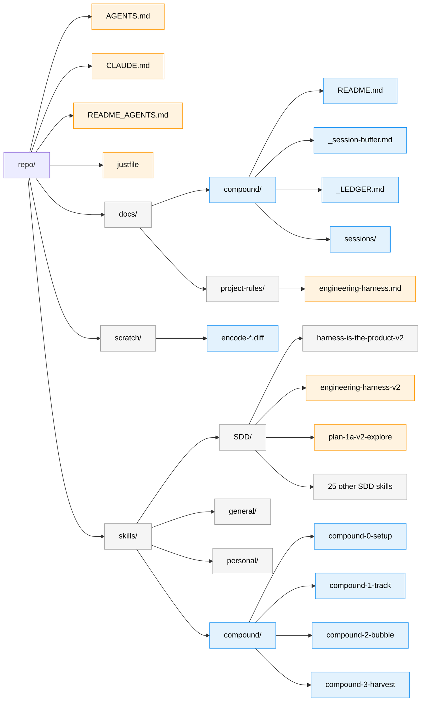
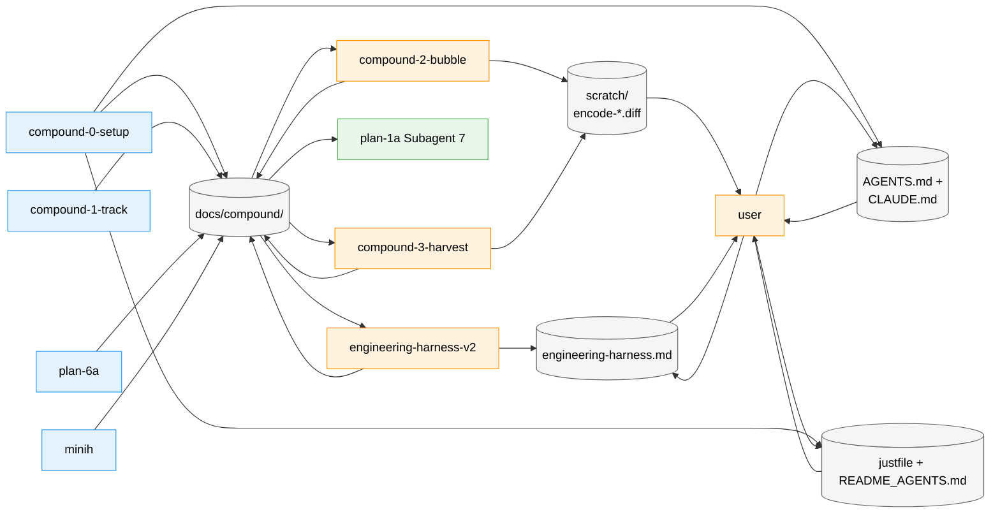
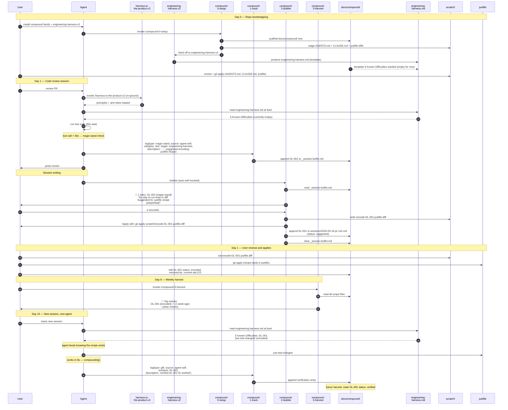

# Workshop: Compound System Map

**Type**: Integration Pattern
**Plan**: 023-difficulty-ledger-skill
**Spec**: [difficulty-ledger-skill-spec.md](../difficulty-ledger-skill-spec.md)
**Created**: 2026-05-16
**Status**: Draft

**Value Thesis**: The compound system has three distinct layers (philosophy, substrate, meta-loop), six skills, two governance docs, four file surfaces, and a ledger directory shared across all of them. Without one canonical map, every contributor reconstructs the layout from fragments scattered across the dossier, two prior workshops, and the spec. This workshop is the **single visual reference** for the whole system — what every component is, what it owns, what it consumes, what it produces, where its files live, and how every flow composes. The user's directive: "I really need to visualise this."

**Target Proof Level**: Contract Ready
**Current Proof Level**: Contract Ready (reached by this document)

**Selected Value Axes**:
- **Knowability** *(primary)*: The system's structure is visible end-to-end in one document, with diagrams as the primary medium and prose as commentary.
- **Cross-Domain Coordination**: Six skills + two docs + a ledger surface cooperate; this workshop is the integration contract sheet between them.
- **Implementation Readiness**: Implementers, reviewers, and AGENTS.md authors can build their parts knowing exactly what they consume, produce, and store where.
- **Onboarding / Accessibility**: A fresh agent or contributor can read this workshop and understand the entire compound system without prior context.

**Related Documents**:
- [research-dossier.md](../research-dossier.md) — gap diagnosis
- [workshops/001-self-improvement-vibe.md](./001-self-improvement-vibe.md) — vibe + 8 design decisions
- [workshops/002-end-to-end-flow.md](./002-end-to-end-flow.md) — five-stage loop diagrams
- [difficulty-ledger-skill-spec.md](../difficulty-ledger-skill-spec.md) — the spec
- [`harness-is-the-product-v2`](../../../../skills/SDD/harness-is-the-product-v2/SKILL.md) — the philosophy layer

**Domain Context**: Not applicable — this repo doesn't use the formal `docs/domains/` system.

---

## Purpose

Provide the **canonical visual map** of the compound system: every layer, every skill, every governance doc, every file surface, every flow. The system is large enough (six new/modified skills + two docs + a shared ledger) that a single map prevents downstream contributors from re-deriving the integration topology each time. The user's directive was explicit: "create a workshop that uses visual diagramming to show me the linkages between all of these, what the inputs and outputs are, where they store files, everything. Relationships between them, I really need to visualise this."

## Fresh Entrant Outcome

A fresh human or agent should be able to use this workshop to reach **Contract Ready** with no additional context.

They should be able to:

- Name the three layers (philosophy / substrate / meta-loop) and which components live in each
- Point at any compound skill and say what it consumes, what it produces, and where its outputs land in the filesystem
- Walk a single difficulty entry's journey from creation to retired through the worked-example sequence
- Identify all five integration surfaces and which components read or write each
- Explain why the compound system unifies under one umbrella concept ("compounding value") and what that umbrella covers
- Re-render any of the diagrams from memory using only the captions and component names

## Key Questions Addressed

- What are the three layers and what does each own?
- Which skills are new, which are modified, which are unchanged?
- Where does every artifact live in the filesystem?
- What does each component consume and produce?
- How do the components cooperate without coupling directly to each other?
- Who reads each of the five integration surfaces, and who writes them?
- What is the "compound" umbrella, and what falls inside vs outside it?

---

## Value Frame

| Field | Selection | Why It Matters |
|-------|-----------|----------------|
| Target Proof Level | Contract Ready | Implementers need the system map locked before building. The integration contracts (who reads/writes what) are this workshop's primary output. |
| Primary Value Axis | Knowability | The system's structure is currently fragmented across 4 prior docs. This workshop unifies it. |
| Supporting Value Axes | Cross-Domain Coordination · Implementation Readiness · Onboarding/Accessibility | Six skills must cooperate cleanly; implementers need the full picture; fresh entrants must grok it without re-derivation. |
| Downstream Loop Improved | Implementation + AGENTS.md authoring + review | Each downstream task references this workshop instead of re-deriving the topology. |

---

## Evidence Ledger

| Evidence | Location | Supports | Status |
|----------|----------|----------|--------|
| Three-layer stack diagram | § "The Three-Layer Stack" | The load-bearing architectural choice (Option C from clarification) | Ready |
| The ecosystem map (full integration diagram) | § "The Ecosystem Map" | Single visual reference for every component + surface + flow | Ready |
| File layout diagram + tree | § "File Layout" | Where every artifact lives in the repo | Ready |
| Five integration surfaces table + diagram | § "The Five Integration Surfaces" | Surface ownership; reader/writer matrix | Ready |
| Per-component I/O contracts | § "Per-Component I/O Contracts" | What each component consumes and produces, in isolation | Ready |
| Worked example sequence diagram | § "Worked Example" | Validates the contracts compose end-to-end for one realistic entry | Ready |
| Entry lifecycle with skill ownership | § "Entry Lifecycle with Skill Ownership" | Who drives each status transition | Ready |
| The "compound" umbrella scope decision | § "The Compound Umbrella" | What's inside the umbrella vs what's outside; naming rationale | Ready |
| Decision Space — 5 architectural decisions | § "Decision Space" | Locks the integration topology choices | Ready |

---

## The Three-Layer Stack

The compound system has three distinct layers. Each layer has a different lifetime, a different audience, and a different responsibility. The layers compose top-down: philosophy states the principle, substrate provides the engineering surface, meta-loop captures friction and routes it back into the substrate.



**Read this diagram as**: Philosophy at the top names the principle. Substrate at the bottom owns the engineering surface (recipes, scripts, etc.). Meta-loop in the middle captures friction (writes to `docs/compound/`), surfaces it, and routes encoded fixes into the substrate. Substrate's own audits feed entries back into the meta-loop. Philosophy guides both lower layers but is referenced rather than called.

**The asymmetry**: meta-loop *depends on* substrate (it needs targets to encode into); substrate does NOT depend on meta-loop (it can exist with or without compound). Philosophy depends on neither but informs both.

---

## The Ecosystem Map

Every component, every governance doc, every file surface, every directional arrow — in one diagram. This is the single visual reference for the whole system.



**Read the colours**:
- 🟧 orange = philosophy layer (1 skill)
- 🟩 green = substrate layer (1 skill + 1 governance doc)
- 🟦 blue = meta-loop layer (4 compound skills)
- 🟪 purple = SDD pipeline touchpoints (2 modified pipeline skills)
- 🟥 red = external (minih) and emitted invocations
- 🟨 yellow = governance documents (`AGENTS.md` / `CLAUDE.md` / `README_AGENTS.md`, `engineering-harness.md`, `justfile`)
- ⬜ grey = file surfaces (the integration cylinders)

**Read the arrows**:
- Solid arrow = data flow (writes / reads / produces)
- Dashed arrow = reference / documentation / "guides" (no data passes; conceptual link)

**The two cylinders are the load-bearing surfaces**: `docs/compound/` (the ledger) and `scratch/` (staged diffs). Everything else is either a producer, a consumer, or a governance document describing the system.

---

## File Layout

Where every artifact lives in the repository. Tree first, then a Mermaid map of the same.

```
repo/
├── AGENTS.md                                      ← MODIFIED: § Self-Improvement Loop
├── CLAUDE.md                                      ← MODIFIED: mirror of AGENTS.md
├── README_AGENTS.md                               ← MODIFIED: catalog entries for compound + engineering-harness-v2
├── justfile                                       ← MODIFIED: retro recipes (`just retro`, `just retro-log`, `just retro-index`)
│
├── docs/
│   ├── compound/                                  ← NEW directory (renamed from earlier "docs/retros/")
│   │   ├── README.md                              convention guide for the whole compound system
│   │   ├── _session-buffer.md                     transient per-session scratch (cleared at bubble-up)
│   │   ├── _LEDGER.md                             auto-rebuilt index/dashboard of open entries
│   │   ├── <plan-slug>.md                         per-plan entries (plan-6a + compound-2/3 paired writes)
│   │   ├── <agent-slug>.md                        per-minih-agent entries (auto-harvested)
│   │   └── sessions/
│   │       └── <date>-<branch>.md                 per-session entries when no plan is active
│   │
│   ├── project-rules/
│   │   └── engineering-harness.md                 ← RENAMED from agent-harness.md (per spec)
│   │                                                produced + maintained by engineering-harness-v2
│   │                                                template seeds § Known Difficulties from docs/compound/
│   │
│   └── plans/
│       └── 023-difficulty-ledger-skill/           (this plan's artifacts)
│
├── scratch/                                        ← (existing; gitignored)
│   └── encode-DL-NNN-<target>.diff                staged diffs from compound's [e]ncode action
│                                                   user reviews + git apply
│
└── skills/
    ├── SDD/
    │   ├── harness-is-the-product-v2/             ← UNCHANGED (philosophy layer)
    │   ├── engineering-harness-v2/                ← RENAMED from agent-harness-v2 (substrate)
    │   ├── plan-1a-v2-explore/                    ← MODIFIED Subagent 7 reads docs/compound/
    │   └── (25 other SDD skills unchanged)
    ├── general/                                    (1: grill-me, unchanged)
    ├── personal/                                   (1: shopping-hunter, unchanged)
    └── compound/                                   ← NEW top-level category (4 skills)
        ├── compound-0-setup/SKILL.md
        ├── compound-1-track/SKILL.md
        ├── compound-2-bubble/SKILL.md
        └── compound-3-harvest/SKILL.md
```

The same layout as a Mermaid tree — useful for spotting the asymmetry between the few new locations (compound/, docs/compound/) vs the broad surface of modifications:



**Legend**: blue = NEW | orange = MODIFIED | grey = UNCHANGED.

---

## The Five Integration Surfaces

Six skills + two pipeline touchpoints + one external runtime cooperate without ever calling each other directly. They communicate through five file surfaces. This table is the integration contract sheet.

| # | Surface | Owner | Writers | Readers | Lifetime |
|---|---------|-------|---------|---------|----------|
| 1 | `docs/compound/` (ledger files) | compound family | `compound-1-track` (buffer), `compound-2-bubble` (scope files), `compound-3-harvest` (status mutations + scope appends), `plan-6a-v2-update-progress` (paired retros), minih (auto-harvest) | `compound-2-bubble` (reads buffer), `compound-3-harvest` (reads all scope files), `plan-1a-v2-explore` Subagent 7 (research-time reads), `engineering-harness-v2` (template seed reads) | persistent (committed to git) |
| 2 | `scratch/encode-*.diff` | compound family (transient) | `compound-2-bubble` `[e]ncode`, `compound-3-harvest` `[e]ncode` | user (reviews + `git apply`) | transient (gitignored) |
| 3 | `docs/project-rules/engineering-harness.md` | `engineering-harness-v2` | `engineering-harness-v2` (regeneration), user (manual edits) | every agent at boot, `compound-0-setup` (suggests updates if missing/stale) | persistent (committed to git) |
| 4 | `AGENTS.md` + `CLAUDE.md` § Self-Improvement Loop | user (curated; `compound-0-setup` proposes initial draft) | `compound-0-setup` (initial diff), user (maintain) | every agent at session start | persistent (committed to git) |
| 5 | `justfile` retro recipes + `README_AGENTS.md` catalog | user (curated; `compound-0-setup` proposes initial diffs/entries) | `compound-0-setup` (initial), user (maintain) | user, agent (when reading repo overview) | persistent (committed to git) |

**The asymmetry**: surface 1 (`docs/compound/`) has the most writers and the most readers. It's the load-bearing integration surface. Surface 2 (`scratch/`) is transient — diffs land there briefly, the user applies them, the diff is consumed. Surfaces 3–5 are slow-moving governance documents.

A diagram of who-touches-what:



**Legend**: blue = primarily a writer | green = primarily a reader | orange = both reads and writes the surface.

---

## Per-Component I/O Contracts

What each component consumes and produces, in isolation. This is the API surface of the compound system — every implementer can see at a glance what their skill is responsible for.

### Philosophy Layer

```
┌────────────────────────────────────────────────────┐
│ harness-is-the-product-v2                          │
├────────────────────────────────────────────────────┤
│ INPUTS:   nothing (philosophy skill, re-entrant)   │
│ OUTPUTS:  re-grounding prose surfaced to user      │
│           5 principles + 7 anti-vibes inherited    │
│ LIFETIME: per-session re-grounding                 │
│ TOUCHES:  no files                                 │
└────────────────────────────────────────────────────┘
```

### Substrate Layer

```
┌────────────────────────────────────────────────────┐
│ engineering-harness-v2                             │
├────────────────────────────────────────────────────┤
│ INPUTS:   project-type detection (justfile,        │
│           Makefile, package.json scripts, etc.)    │
│           docs/compound/ entries (template seed)   │
│ OUTPUTS:  docs/project-rules/engineering-harness.md│
│           (with § Known Difficulties seeded from   │
│            ledger; up to top 10 entries filtered   │
│            by target: engineering-harness | tooling)│
│           audit findings logged via compound-1-track│
│ LIFETIME: long-lived; regenerated on demand        │
│ TOUCHES:  docs/project-rules/engineering-harness.md│
│           docs/compound/ (read for template seed)  │
└────────────────────────────────────────────────────┘
```

### Meta-Loop Layer

```
┌────────────────────────────────────────────────────┐
│ compound-0-setup                                   │
├────────────────────────────────────────────────────┤
│ INPUTS:   repo state (does docs/compound/ exist?   │
│           does AGENTS.md have the section?         │
│           does justfile have retro recipes?)       │
│ OUTPUTS:  scaffolds docs/compound/ tree            │
│           writes docs/compound/README.md           │
│           stages diff for AGENTS.md + CLAUDE.md    │
│           stages diff for justfile recipes        │
│           stages diff for README_AGENTS.md         │
│           hands off to engineering-harness-v2      │
│           re-run: re-checks state, suggests gaps   │
│ LIFETIME: one-time setup; re-entrant for re-check  │
│ TOUCHES:  docs/compound/ (creates tree)            │
│           scratch/ (stages diffs)                  │
└────────────────────────────────────────────────────┘

┌────────────────────────────────────────────────────┐
│ compound-1-track                                   │
├────────────────────────────────────────────────────┤
│ INPUTS:   user mutterings ("ugh", "I wish...")     │
│           agent self-observations during work      │
│           magic-wand check at trigger heuristics:  │
│             - tool call > 30s                      │
│             - zero-result search                   │
│             - 2nd retry of same command            │
│             - backtrack from wrong assumption      │
│             - test/build failure needing guesswork │
│             - optional task-boundary (empty buffer)│
│ OUTPUTS:  appends entry to                         │
│           docs/compound/_session-buffer.md         │
│           with id, ts, source, type, category,     │
│           target, description, suggested-encoding  │
│ LIFETIME: per-session; called many times           │
│ TOUCHES:  docs/compound/_session-buffer.md         │
└────────────────────────────────────────────────────┘

┌────────────────────────────────────────────────────┐
│ compound-2-bubble                                  │
├────────────────────────────────────────────────────┤
│ INPUTS:   docs/compound/_session-buffer.md         │
│           (current-session entries)                │
│ OUTPUTS:  if buffer empty: silent (no prompt)      │
│           else: single soft prompt with menu       │
│             [s] save → docs/compound/<scope>.md    │
│             [t] task → emit /plan-5 invocation     │
│             [p] plan → emit /plan-1b invocation    │
│             [e] encode → stage diff in scratch/    │
│             [d] dismiss → drop entry               │
│             [a] all-save (default on enter)        │
│           clears buffer after routing              │
│ LIFETIME: once per session (auto + manual escape)  │
│ TOUCHES:  docs/compound/_session-buffer.md (read) │
│           docs/compound/<plan>.md OR sessions/     │
│             <date>-<branch>.md (writes)            │
│           scratch/encode-*.diff (stages)           │
│           prints: /plan-5 / /plan-1b invocations   │
└────────────────────────────────────────────────────┘

┌────────────────────────────────────────────────────┐
│ compound-3-harvest                                 │
├────────────────────────────────────────────────────┤
│ INPUTS:   ALL docs/compound/ scope files:          │
│           - <plan-slug>.md (any active plan)       │
│           - sessions/*.md                          │
│           - <agent-slug>.md (minih auto-harvest)   │
│ OUTPUTS:  in-memory: dedup → cluster → age-order   │
│           stale-flag (open ≥4w; suggested + no    │
│             resolved-by ≥2w)                       │
│           prioritised top-10 summary               │
│             (recurrence > severity > age)          │
│           per-cluster menu adds to compound-2's:   │
│             [r] resolved → status: encoded         │
│             [w] wontfix → status: wontfix          │
│             [s] still-active → status: open + ts   │
│ LIFETIME: periodic; typically post-/plan-7         │
│ TOUCHES:  docs/compound/ (reads all + mutates      │
│           status fields in place)                  │
│           scratch/encode-*.diff (stages)           │
│           prints: /plan-5 / /plan-1b invocations   │
└────────────────────────────────────────────────────┘
```

### SDD Pipeline Touchpoints (modified, not new)

```
┌────────────────────────────────────────────────────┐
│ plan-1a-v2-explore Subagent 7 (modified)           │
├────────────────────────────────────────────────────┤
│ INPUTS:   docs/compound/<plan>.md                  │
│           docs/compound/sessions/*.md              │
│           docs/compound/<agent>.md (minih)         │
│           legacy ## Discoveries & Learnings tables │
│ OUTPUTS:  PL-NN findings in research dossier       │
│ NOTE:     Cross-category leak (SDD reads from      │
│           compound's surface). Accepted tradeoff.  │
└────────────────────────────────────────────────────┘

┌────────────────────────────────────────────────────┐
│ plan-6a-v2-update-progress (unchanged from current)│
├────────────────────────────────────────────────────┤
│ INPUTS:   orchestrator retrospective JSON          │
│           companion farewell envelope              │
│ OUTPUTS:  paired entries in                        │
│           docs/compound/<plan-slug>.md             │
│           with OH-NNN / MH-NNN IDs                 │
│ NOTE:     plan-6a was already a producer; the      │
│           directory rename docs/retros/ →          │
│           docs/compound/ requires a one-line path  │
│           update in plan-6a Step 8c.               │
└────────────────────────────────────────────────────┘
```

---

## Worked Example

A single difficulty's full journey across all the cross-skill flows. This validates the I/O contracts compose end-to-end.



The journey crosses 8 components, touches 4 file surfaces, and spans 15 days. By the end, the engineering harness is permanently better, and a new agent benefits without ever knowing the original difficulty existed.

---

## Entry Lifecycle with Skill Ownership

Every entry transitions through a bounded state machine. Each transition is *driven by a specific skill or actor* — knowing which skill drives which transition is the contract for who owns each operation.

```mermaid
stateDiagram-v2
    [*] --> open: compound-1-track<br/>(silent log during work)
    open --> open: still active<br/>(no decision)
    open --> suggested: compound-2-bubble s<br/>OR compound-3-harvest s
    open --> dismissed: compound-2-bubble d<br/>OR compound-3-harvest d
    open --> escalated: compound-2-bubble t/p<br/>OR compound-3-harvest t/p
    suggested --> encoded: user (after git apply)<br/>updates status field
    suggested --> wontfix: compound-3-harvest w
    suggested --> stale: time elapsed<br/>(detected by harvest)
    stale --> encoded: compound-3-harvest r
    stale --> wontfix: compound-3-harvest w
    stale --> suggested: compound-3-harvest s
    encoded --> verified: future agent<br/>via compound-1-track<br/>(type: gift, resolves: id)
    escalated --> encoded: linked plan/fix-task lands
    escalated --> wontfix: linked plan abandoned
    dismissed --> [*]
    wontfix --> [*]
    verified --> [*]

    note right of open: writer: compound-1-track
    note right of suggested: writer: compound-2-bubble<br/>or compound-3-harvest
    note right of encoded: writer: user (manual edit)<br/>or compound-3-harvest
    note right of verified: writer: compound-1-track<br/>(via gift entry from future session)
```

The state machine is the same as in workshop 002, but now annotated with which skill performs each write. This is what locks the ownership boundary — `compound-1-track` is the only skill that creates entries; only `compound-2-bubble`, `compound-3-harvest`, and the user mutate status; only future agents (via `compound-1-track`) drive `verified`.

---

## The "Compound" Umbrella

The user's directive: "Let's just keep everything underneath docs/compound, the magic wands, these difficulty ledgers, everything else. Let's just try and really get around this compound concept."

**What's inside the umbrella**:

| Concept | Lives where | Why it's compound |
|---|---|---|
| Difficulty entries | `docs/compound/<scope>.md` | Friction the loop captures |
| Magic-wand entries | `docs/compound/<scope>.md` (same schema; type field) | Improvement wishes — most actionable signal |
| Gift entries | `docs/compound/<scope>.md` (same schema) | Encoded fixes that landed; verification signals |
| Insight entries | `docs/compound/<scope>.md` (same schema) | Discoveries that don't yet need a fix |
| Session buffer | `docs/compound/_session-buffer.md` | Transient per-session capture |
| Per-plan ledger | `docs/compound/<plan-slug>.md` | Plan-scoped accumulation |
| Per-session ledger | `docs/compound/sessions/<date>-<branch>.md` | Session-scoped (no active plan) |
| Per-agent ledger | `docs/compound/<agent-slug>.md` | Minih auto-harvest |
| Index / dashboard | `docs/compound/_LEDGER.md` | Auto-rebuilt rollup |
| Convention guide | `docs/compound/README.md` | How the system works |
| Disable sentinel | `docs/compound/.disabled` | Project opt-out |
| The 4 producer/consumer skills | `skills/compound/compound-N-<verb>/` | The meta-loop itself |

**What's OUTSIDE the umbrella** (related but distinct):

| Concept | Lives where | Why it's NOT compound |
|---|---|---|
| The engineering harness | `docs/project-rules/engineering-harness.md` + `justfile` + scripts | Substrate layer; exists independently of compound |
| `engineering-harness-v2` skill | `skills/SDD/engineering-harness-v2/` | Substrate layer; produces the engineering harness; reads compound for template seed but is not part of it |
| `harness-is-the-product-v2` skill | `skills/SDD/harness-is-the-product-v2/` | Philosophy layer; states the principle; referenced by compound but distinct |
| `plan-1a-v2-explore` Subagent 7 | `skills/SDD/plan-1a-v2-explore/` | SDD pipeline touchpoint; reads compound's surface but lives in SDD |
| `plan-6a-v2-update-progress` retro writes | `skills/SDD/plan-6a-v2-update-progress/` | SDD pipeline; writes to docs/compound/ but is not part of compound |
| Staged diffs in `scratch/` | `scratch/encode-*.diff` | Transient handoff to user; not a compound file |
| `AGENTS.md`/`CLAUDE.md`/`README_AGENTS.md` | repo root | Project governance; describes compound but is not a compound file |
| `justfile` retro recipes | repo root `justfile` | Engineering harness target (substrate); recipes happen to be about compound but live in the substrate |

**Naming rationale** ("compounding value" not "compounding velocity"):

The metaphor is **compound interest of value**. Every captured entry is principal that compounds session-over-session. A magic-wand entry that becomes a justfile recipe doesn't just save time on the next test run — it improves the substrate that every future agent inherits, indefinitely. The compounding is in the *value to future selves* (humans + agents), not specifically in execution speed. "Velocity" is one possible expression of compounded value (faster cycles); "value" is the broader principle.

This naming choice aligns the compound family with `harness-is-the-product-v2` Principle 2's better framing ("every difficulty catalogued is a gift to future sessions" — value-language, not speed-language). It deliberately diverges from minih's "compound velocity hypothesis" naming, which is more specific.

---

## Decision Space

The integration topology decisions this workshop locks. Most were already locked by prior workshops or clarifications; a handful are new.

| Option | Description | Pros | Cons | Decision |
|--------|-------------|------|------|----------|
| **M1a** — Three-layer stack (philosophy / substrate / meta-loop) | Three distinct skills/families with explicit layering | Each layer has a clean job; substrate exists with or without meta-loop; philosophy stays first-class | Slightly more skills to install | **Selected** (locks Option C from clarification) |
| **M1b** — Fold engineering-harness into compound family | One unified self-improvement system | Tighter integration | Conflates substrate with the loop that improves it; demotes substrate from "the product" | Rejected |
| **M2a** — All compound artifacts under `docs/compound/` | One umbrella directory; same schema across producers | Memorable; single place to look; aligned with "compound" branding | Renames the directory we previously called `docs/retros/` | **Selected** (per user directive) |
| **M2b** — Keep per-purpose directories (`docs/retros/`, `docs/wands/`, etc.) | Separation by entry type | Possibly clearer per-type | More directories; fragments the schema; doesn't match the "compound" umbrella | Rejected |
| **M3a** — Components communicate ONLY via file surfaces | No direct skill-to-skill calls | Loose coupling; minih interop free; testable | Slightly more parsing per stage | **Selected** (F2 from workshop 002, reinforced) |
| **M3b** — Compound family uses an in-memory bus | Tighter coordination | Requires runtime; breaks portability across CLIs | Rejected | Rejected |
| **M4a** — `compound-0-setup` is one-time + re-entrant | Same skill creates the scaffold AND re-checks/reminds on re-run | Single skill for setup-and-reminder concerns | Slightly more logic in one skill | **Selected** (per user comment about re-entrant pattern from harness-is-the-product-v2) |
| **M4b** — Separate `compound-0-setup` and `compound-0a-reminder` skills | Distinct setup-vs-reminder responsibilities | Clearer per-purpose | Two skills for what is conceptually "is your repo set up for compound?" | Rejected |
| **M5a** — "Compounding value" framing | Aligns with harness-is-the-product Principle 2 ("gifts"); broader than speed | Captures all value classes (recipes, norms, contracts, insights) | Diverges from minih's "compound velocity" naming | **Selected** (per user clarification) |
| **M5b** — "Compounding velocity" framing | Matches minih precedent | Familiar to minih users | Narrower (implies speed-only); doesn't capture value classes that aren't speed | Rejected |

---

## Attention Reduction

| Future Loop | Before This Workshop | After This Workshop |
|-------------|----------------------|---------------------|
| Implementation review | Reviewer reconstructs the system topology from spec + 2 prior workshops + dossier | Reviewer compares implementation against the ecosystem map, file-layout tree, and per-component I/O contracts in this single workshop |
| Onboarding a fresh contributor | "Read 4 docs and infer the layering" | "Read this workshop's three-layer stack diagram + ecosystem map → grok the system in 5 minutes" |
| AGENTS.md voice workshop (next) | "What does the loop look like?" — needs derivation | The three-layer stack and the ecosystem map are the loop; AGENTS.md describes them in 10–15 lines |
| Schema workshop (next) | "What fields go in entries?" — derived from spec scattered across multiple sections | Per-component I/O contracts list the field categories each producer needs; schema design starts from these |
| CLI-flow workshop (next) | "What does the bubble look like?" — derived | Per-component I/O contract for `compound-2-bubble` lists exactly what comes in and what routing emerges; CLI flow designs the literal copy |
| Harvest behavior workshop (next) | "What does harvest do?" — open | Per-component I/O contract for `compound-3-harvest` + the lifecycle diagram with skill ownership covers the behavior space |
| Spec restructure (when triggered) | "What needs to change to reflect the compound family?" | This workshop is the target state; the spec catches up to it |
| Plan-3 architect | "What's the work breakdown?" | Six task groups, each maps to one component or one surface in this workshop |

---

## Open Questions

### Q1: Should the rename `docs/retros/` → `docs/compound/` be done as part of this plan, or as a separate cleanup pass?

**OPEN**. Recommendation: in this plan, since `compound-0-setup` is the natural place to scaffold the new directory. Existing `docs/retros/` content (if any in users' repos) should be migrated by `compound-0-setup` (move + leave a `docs/retros/.moved-to-compound` breadcrumb). For this repo specifically, no `docs/retros/` exists yet, so it's a clean start.

### Q2: How does `engineering-harness-v2` know when to re-seed § Known Difficulties from the ledger?

**OPEN**. Three options: (a) re-seed on every `engineering-harness-v2 --validate` invocation; (b) re-seed when `compound-3-harvest` runs (chained); (c) re-seed manually when the user runs `engineering-harness-v2 --regenerate-template`. Recommendation: (a) — cheap and predictable. Resolved during plan-3 phase design.

### Q3: Does `harness-is-the-product-v2` Principle 2 need to be renamed from "Track Velocity Compounding" to "Track Compounding Value" to align with the new framing?

**OPEN**. Recommendation: yes — small edit, aligns the philosophy layer with the compound umbrella's framing. The principle's *content* doesn't change; just the heading. To confirm during implementation.

### Q4: Should the rename `agent-harness-v2` → `engineering-harness-v2` be Interpretation 1 (cosmetic) or Interpretation 2 (scope refocus)?

**OPEN — load-bearing**. The skill currently produces a Boot/Interact/Observe doc (which the prior disambiguation called *agent harness*). Renaming the skill to `engineering-harness-v2` either: (a) broadens "engineering harness" to include the agent-facing layer (cosmetic — undoes part of prior disambiguation); or (b) refocuses the skill on the engineering substrate (justfile, dev scripts, tests) and pushes Boot/Interact/Observe elsewhere. This affects what the skill produces, what the governance doc is named, and how `harness-is-the-product-v2` describes the layers. **Must resolve before implementation.**

### Q5: When `compound-0-setup` re-runs and finds the AGENTS.md "Self-Improvement Loop" section already present but stale, does it re-stage a diff or stay silent?

**OPEN**. Recommendation: detect drift (e.g. via a versioned section header `<!-- compound:v1 -->`), re-stage a diff if drifted, log a `type: difficulty, target: docs` entry if user keeps dismissing the diff. Resolved during plan-3 task design.

### Q6: Does `plan-6a-v2-update-progress` need to update its hardcoded path from `docs/retros/` to `docs/compound/`?

**RESOLVED**: yes. One-line path update in `plan-6a` Step 8c. Trivial. Listed as part of the v1 implementation scope.

---

## Validation / Acceptance

This workshop reaches its target proof level (**Contract Ready**) when:

1. The three-layer stack diagram + ecosystem map together let a fresh entrant reproduce the system on a whiteboard from memory and explain what each layer / component owns.
2. The five integration surfaces table can be queried by a future contributor as "I want to add a new reader / writer to surface X — what existing components touch it?" and the table answers immediately.
3. The per-component I/O contracts are detailed enough that an implementer can stub a SKILL.md from any of them without re-reading other workshops.
4. The worked-example sequence diagram traces a single difficulty across all 8 components and 4 file surfaces without ambiguity.
5. The lifecycle state machine annotates each transition with the responsible skill, so ownership disputes ("who's allowed to mutate `status: encoded`?") have a clear answer.
6. The "compound umbrella" table answers "is X part of compound?" with a deterministic yes/no for every concept introduced by this plan.

The acceptance test for this workshop specifically: the user reads the diagrams + the ecosystem map + the file layout, and either (a) approves them, or (b) flags specific arrows / surfaces / components that should change — without invalidating the three-layer stack.

---

## Quick Reference

**The three layers**:
- 🟧 Philosophy: `harness-is-the-product-v2` (re-entrant; states the principle)
- 🟩 Substrate: `engineering-harness-v2` (audits + scaffolds the engineering harness)
- 🟦 Meta-loop: `compound-0/1/2/3` (capture → bubble → harvest → re-encode)

**The four compound skills** (`skills/compound/`):
- `compound-0-setup` — scaffold + re-check (re-entrant)
- `compound-1-track` — silent log + magic-wand check
- `compound-2-bubble` — session-end soft prompt
- `compound-3-harvest` — periodic curation + triage

**The five integration surfaces**:
1. `docs/compound/` — ledger files (the load-bearing one)
2. `scratch/encode-*.diff` — staged diffs (transient)
3. `docs/project-rules/engineering-harness.md` — engineering substrate doc
4. `AGENTS.md` + `CLAUDE.md` § Self-Improvement Loop — operational contract
5. `justfile` retro recipes + `README_AGENTS.md` catalog — substrate + catalog

**The two pipeline touchpoints** (modified, not part of compound family):
- `plan-1a-v2-explore` Subagent 7 — reads `docs/compound/`
- `plan-6a-v2-update-progress` — writes `docs/compound/<plan>.md` (one-line path update)

**The umbrella term**: "compound" means *compounding value* — every entry compounds value session-over-session. Like compound interest. NOT "compounding velocity" (minih's narrower framing).

**The integration contract**: components communicate ONLY through file surfaces, never through direct skill-to-skill calls. The schema (deferred to schema workshop) IS the inter-component contract.

---

**Next steps after this workshop**:

- User reviews the ecosystem map, file layout, and per-component I/O contracts.
- Resolve Q4 (the load-bearing one): is `agent-harness-v2` → `engineering-harness-v2` cosmetic or a scope refocus?
- If approved → propagate the new structure (compound family naming, `docs/compound/` rename, three-layer framing) into spec + workshops 001/002 + flight plan in a single restructure pass.
- After propagation: the four still-queued workshops (schema / CLI flow / AGENTS.md voice / harvest behavior) inherit this workshop's contracts as their starting point.
- After all workshops: `/plan-3-v2-architect` produces the single-phase task table.
