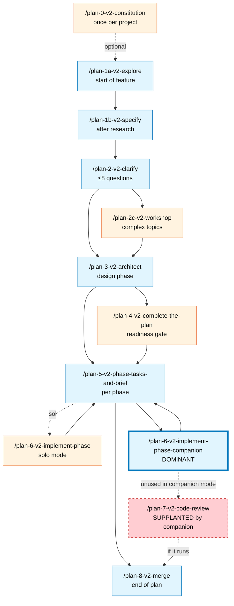

# Workshop: SDD Pipeline ↔ Compound Integration

**Type**: Integration Pattern
**Plan**: 023-difficulty-ledger-skill
**Spec**: [difficulty-ledger-skill-spec.md](../difficulty-ledger-skill-spec.md)
**Created**: 2026-05-16
**Status**: Draft

**Value Thesis**: The spec assumes `compound-3-harvest` fires "typically post-`/plan-7-v2-code-review`" — but the dominant flow uses `/plan-6-v2-implement-phase-companion` which **supersedes** `/plan-7`. Under that flow, harvest is orphaned and the curation half of the loop never runs. Beyond harvest, the spec only specifies compound integration for `plan-6` + `plan-6-companion`; the other plan-N skills (1a / 1b / 2 / 2c / 3 / 5 / 8) have no integration design at all. This workshop locks the per-skill integration contract: which `plan-N` skills produce compound entries, which auto-fire `compound-2-bubble`, and where `compound-3-harvest` actually runs in companion-mode workflows. Without it, plan-3 has to guess.

**Target Proof Level**: Implementation Ready
**Current Proof Level**: Decision Space → Preferred Direction (workshop output)

**Selected Value Axes**:
- **Implementation Readiness**: plan-3 needs the integration matrix concrete; this workshop produces the per-skill contract table that plan-3 consumes verbatim.
- **Cross-Domain Coordination**: every plan-N skill becomes a producer + a potential firing site for compound-2/3; the workshop is the contract sheet between the SDD pipeline and the compound family.
- **Operator Usability**: the user's actual workflow is plan-1 → plan-6-companion → plan-8; the integration must feel natural in *that* flow, not in some abstract pipeline.
- **Cost / Attention Reduction**: the loop must close without the user manually running `/compound-3-harvest` after every phase; the workshop picks the auto-fire points that reduce user babysitting to ~zero.
- **Agent Readiness**: each plan-N skill body needs to know what compound action to take when; the workshop produces the exact one-liners each plan-N skill body adds.

**Related Documents**:
- [Workshop 001 — Self-improvement vibe](./001-self-improvement-vibe.md) — anti-vibes 2 (ceremony) + 5 (auto-magic) constrain the auto-fire-vs-suggest decision space
- [Workshop 002 — End-to-end flow](./002-end-to-end-flow.md) — defines the five-stage loop; this workshop refines its Stage 3 + Stage 4 trigger story
- [Workshop 003 — Compound system map](./003-compound-system-map.md) — defines integration surfaces; this workshop adds the per-plan-N firing topology
- [Spec § Target Domains](../difficulty-ledger-skill-spec.md#target-domains) — currently only `plan-6` + `plan-6-companion` are listed as modify entries; this workshop expands the list

**Domain Context** (no formal `docs/domains/` registry in this repo):
- **Primary scope**: `skills/SDD/plan-*` skill bodies + the compound family's auto-invocation interface
- **Related scopes**: `docs/compound/` ledger surface (write side); engineering-harness.md (read side)

---

## Purpose

The spec's `compound-3-harvest` is anchored to `/plan-7-v2-code-review` as its natural firing point ("typically after a `plan-7-v2-code-review` cycle"). The user's dominant workflow uses `/plan-6-v2-implement-phase-companion`, which **supersedes `/plan-7`** (the companion does the live review instead). Under companion mode `/plan-7` rarely runs → harvest never auto-fires → the curation layer becomes vestigial.

This workshop fixes that by locking the per-`plan-N` integration contract: which plan-N skills produce entries via `compound-1-track`, which end-of-skill auto-fire `compound-2-bubble`, and where `compound-3-harvest` fires in companion-mode flows. The output is consumed by `plan-3-v2-architect` as the basis for the modify-list of pipeline skills.

## Fresh Entrant Outcome

A fresh implementer (or `plan-3-v2-architect`) should be able to use this workshop to reach **Implementation Ready** with no additional context.

They should be able to:

- Read the per-skill integration matrix and know exactly what one-liner to add to each `plan-N` skill body
- Understand WHY each firing site was chosen (auto-fire vs suggest, fire-now vs fire-later)
- Trace any of the four worked example sessions end-to-end and predict what entries land where
- Know which compound calls are gated by the `docs/compound/.disabled` sentinel
- Hand the workshop to plan-3 and have plan-3 emit a modify-list that includes 6+ plan-N skills (not just plan-6 + plan-6-companion)

## Key Questions Addressed

1. Which `plan-N` skills auto-invoke `compound-1-track` during their work?
2. Which `plan-N` skills end-of-skill auto-fire `compound-2-bubble` (vs. just letting the buffer accumulate)?
3. Where does `compound-3-harvest` fire when `/plan-7` doesn't run (companion mode is the norm)?
4. Should `plan-1a` Subagent 7's research-time read also surface a "harvest summary" entry so the loop is visible?
5. Auto-fire vs print-suggested-invocation — which compound skills are safe to fully auto-fire and which need user consent to fire?
6. How does this interact with the `docs/compound/.disabled` sentinel?
7. Does the bubble-up fire once per CLI session or once per `plan-N` skill?

---

## Value Frame

| Field | Selection | Why It Matters |
|-------|-----------|----------------|
| Target Proof Level | **Implementation Ready** | plan-3 needs to consume this directly — the per-skill matrix and the four firing sites are the deliverable |
| Primary Value Axis | **Implementation Readiness** | Without this workshop, plan-3 either guesses (and ships the wrong integration) or asks 12 clarifying questions |
| Supporting Value Axes | **Cross-Domain Coordination, Operator Usability, Cost / Attention Reduction, Agent Readiness** | Each axis shapes a different decision: coordination → integration matrix; usability → companion-mode flow; cost → auto-fire selection; agent readiness → exact skill-body one-liners |
| Downstream Loop Improved | **Implementation (plan-3 → Group E task list)** | Group E currently lists `plan-6 + plan-6-companion compound integration` as one bullet; this workshop expands it into 6+ surgical edits with exact line-anchor targets |

---

## The User's Actual SDD Flow

Before designing the integration, anchor on what the user actually runs.



**Key observations** (from the user's stated workflow):

1. **`/plan-6-v2-implement-phase-companion` is the dominant implementation path**. Solo `/plan-6` is rare.
2. **`/plan-7-v2-code-review` is supplanted by the companion**. The companion does the live review per-commit; `/plan-7` rarely fires after a companion run.
3. The pipeline forms an arc: research → specify → clarify (→ workshop) → architect → tasks → implement (with companion) → merge.
4. Every plan-N skill ends with a `Next step:` handoff. The pipeline is a chain of skills, not isolated invocations.
5. **A "session"** in the user's CLI is one continuous chat. One session can chain ~5-10 plan-N skills back-to-back.

The integration design must respect (1)–(5). The rejected pattern — anchoring harvest to `/plan-7` — fails (1)+(2). The unconsidered pattern — auto-firing bubble at every plan-N end — fails (4)+(5) (8 prompts in one session).

---

## Decision Space

### D1 — Where does `compound-3-harvest` fire in companion-mode workflows?

The spec anchors harvest to `/plan-7`. With companion mode, that's wrong. Options:

| Option | Description | Pros | Cons | Decision |
|--------|-------------|------|------|----------|
| **A** | Anchor to `/plan-7` only (status quo from spec) | Simple; one firing site | Vestigial under companion mode (the dominant flow) | **Rejected** |
| **B** | Auto-fire at end of `plan-6-companion`'s debrief (after plan-6a Step 9 lands) | Natural fit — debrief is already a "reflection" moment | Only fires per-phase; might be too frequent | Partial |
| **C** | Auto-fire at end of `/plan-8-v2-merge` (end of plan) | Natural plan-completion signal; fires once per plan | Plans take days/weeks; harvest is too infrequent | Partial |
| **D** | Suggest at start of `/plan-1a-v2-explore` and `/plan-3-v2-architect` (pre-research / pre-architect harvest opportunity) | Lets the user choose to harvest before the new work consumes ledger entries | User has to opt in | Partial |
| **E** | Auto-fire at end of last phase of `plan-6-companion` (when no more phases remain) | Natural "phase work complete" signal; one fire per plan-implementation cycle | Need to detect "last phase" | Partial |
| **F** | **Hybrid: B + D** — auto-fire after final-phase companion debrief; SUGGEST at plan-1a + plan-3 starts when ledger is fluffy | Auto-fire at the strongest natural moment; suggest at moments where harvest *enriches* the new work | More complex than a single anchor | **Selected** |

**Why F is selected**:
- B alone fires too often (every phase). E refines B (only the last phase) — and E ⊂ F.
- C alone fires too rarely (plans take weeks).
- D alone requires user opt-in for the moment harvest most matters (post-implementation reflection).
- F (E + D) gives one auto-fire per plan-implementation cycle (the companion's last-phase debrief) plus two suggestion sites where harvest *upgrades* the next work (plan-1a's research dossier + plan-3's architecture decisions can incorporate freshly-curated entries).

### D2 — How often does `compound-2-bubble` fire?

The spec says "single soft prompt at session end." But "session" is ambiguous in chat-agent CLIs.

| Option | Description | Pros | Cons | Decision |
|--------|-------------|------|------|----------|
| **A** | Once per `plan-N` skill (auto-fire at end of every plan-N) | Reliable; never misses a chance to bubble | 8 bubbles per chained pipeline session — anti-vibe 2 (ceremony) | Rejected |
| **B** | Once per CLI session (true session end) | Matches spec language | Hard to detect "session end" reliably; might never fire | Rejected |
| **C** | Once per "logical pause" — defined as end-of-skill where the next-step is "done" or "pick what's next" rather than a chained handoff | Fires at natural reflection moments; respects the user's chained pipeline | Need to define "logical pause" per skill | Partial |
| **D** | **Hybrid: C + manual escape (`/compound-2-bubble`)** — auto-fire at logical pauses; user can also invoke manually anytime | Reliable AND user-controllable; matches spec D1 hybrid trigger from vibe workshop | None — this is the vibe-aligned choice | **Selected** |

**Logical pauses** (from D2-C definition):
- End of `plan-1a-v2-explore` (research dossier complete; user reads it before deciding next move) ✓
- End of `plan-3-v2-architect` (plan complete; user reviews before /plan-5) ✓
- End of `plan-6-v2-implement-phase` (phase complete; user decides whether to do more) ✓
- End of `plan-6-v2-implement-phase-companion` (per-phase; companion debrief done) ✓
- End of `plan-8-v2-merge` (plan complete; pipeline ends) ✓

**Not logical pauses** (these chain immediately):
- End of `plan-1b-specify` → next step is `/plan-2-clarify` (chain) ✗
- End of `plan-2-clarify` → next step is `/plan-3` or `/plan-2c-workshop` (chain) ✗
- End of `plan-2c-workshop` → next step is `/plan-2-clarify` or `/plan-3` (chain) ✗
- End of `plan-4` → next step is `/plan-5` (chain) ✗
- End of `plan-5` → next step is `/plan-6` (chain) ✗
- End of `plan-6a` → sub-step of plan-6, not a user-facing endpoint ✗

### D3 — Which `plan-N` skills produce entries via `compound-1-track`?

The spec already specifies `plan-6` and `plan-6-companion` call `compound-1-track` during work. The question is which other plan-N skills should.

| Skill | Friction during execution? | Recommendation |
|-------|---------------------------|----------------|
| `plan-0-v2-constitution` | Low (norms text editing) | No — too rare to bother |
| `plan-1a-v2-explore` | High (subagent searches fail; FlowSpace timeouts; concept matches missing) | **Yes** — orchestrator-side calls only (subagents complicate buffer ownership; defer subagent integration to v2) |
| `plan-1b-v2-specify` | Medium (spec ambiguities; missing decisions) | **Yes** — orchestrator-side |
| `plan-2-v2-clarify` | Low (skill is *itself* a clarification interview; double-prompting is bureaucratic) | No — skill already prompts user |
| `plan-2c-v2-workshop` | Medium (decision-space gaps; example-finding) | **Yes** — orchestrator-side |
| `plan-3-v2-architect` | High (cross-domain decisions; finding hooks; rule lookups) | **Yes** — orchestrator-side |
| `plan-4-v2-complete-the-plan` | Low (validation gate; surfaces existing issues) | No — issues found are *spec/plan* issues, not friction-with-substrate |
| `plan-5-v2-phase-tasks-and-brief` | Medium (mapping plan tasks → dossier; rule discovery) | **Yes** — orchestrator-side |
| `plan-6-v2-implement-phase` | High | **Yes** (already in spec) |
| `plan-6-v2-implement-phase-companion` | High (orchestrator + companion both produce) | **Yes** (already in spec) |
| `plan-6a-v2-update-progress` | Low (mechanical update) | No — sub-step |
| `plan-7-v2-code-review` | Medium (when it runs) | **Yes** — orchestrator-side (matters for the rare solo-mode path) |
| `plan-8-v2-merge` | Medium (merge analysis surfaces friction) | **Yes** — orchestrator-side |

**Net new producers** (beyond the spec's plan-6 + plan-6-companion): plan-1a, plan-1b, plan-2c, plan-3, plan-5, plan-7, plan-8 — **seven additional skills**.

### D4 — Auto-fire vs Suggest for compound-3-harvest

This is the core tension.

| Option | Description | Pros | Cons | Decision |
|--------|-------------|------|------|----------|
| **A** | Always auto-fire (at every site in D1's selected pattern) | Loop closes without user attention | Surprises the user with a curated view they didn't trigger; risk of anti-vibe 5 (auto-magic) | Rejected |
| **B** | Always suggest (print-the-invocation only) | Zero surprise; user opts in | Under best-effort, user often won't run it; loop never closes | Rejected |
| **C** | **Hybrid: auto-fire at high-fit moments (companion last-phase debrief, plan-8 end); suggest at enrichment moments (plan-1a start, plan-3 start)** | Auto-fire only where the moment *is already a reflection moment*; suggest where harvest *enriches* the new work | Two patterns to remember | **Selected** |

**Why C is selected**:
- The companion's debrief is an explicit reflection moment — auto-firing harvest there extends the existing reflection rather than creating a new one. It feels native, not magical.
- `plan-8`'s merge is the natural plan-completion moment — auto-firing harvest there is "let's see what we learned this plan" — also feels native.
- `plan-1a`'s research start and `plan-3`'s architect start are moments where the user is choosing the *direction* of new work. Suggesting harvest here lets them decide whether to enrich the dossier/architecture with freshly-curated entries — opt-in is the right vibe.

### D5 — How does compound integration interact with the `docs/compound/.disabled` sentinel?

The spec's AC#23 states the sentinel makes `compound-1-track` a silent no-op and makes `compound-2-bubble` and `compound-3-harvest` print a "logging disabled" message.

| Option | Description | Decision |
|--------|-------------|----------|
| **A** | Pipeline-skill auto-invocations honor the sentinel exactly the same way (silent no-op for compound-1-track; "disabled" message for bubble + harvest) | **Selected** |
| **B** | Pipeline-skill auto-invocations print "compound disabled" once per session and then go silent for the rest of the session | Rejected — chatty |
| **C** | Pipeline-skill auto-invocations don't even attempt to call when sentinel present (skip the call entirely) | **Selected** (refinement of A) |

**Resolution**: Combine A + C — pipeline skills *check the sentinel before invoking* and skip the call entirely if present. No "disabled" message printed by the pipeline skill; the user opted out and doesn't need the reminder. The `compound-N` skill itself still prints the disabled message when invoked directly by the user.

### D6 — Should subagents (e.g. plan-1a Subagents 1–7) call compound-1-track?

Subagents run in their own context window via the `Task` tool. They can't share `_session-buffer.md` writes cleanly with the orchestrator (race conditions; ordering; ID collisions).

| Option | Description | Pros | Cons | Decision |
|--------|-------------|------|------|----------|
| **A** | Subagents call compound-1-track directly | Captures subagent-side friction | Race conditions; ID collisions; complex buffer ownership | Rejected |
| **B** | Subagents return friction findings in their structured output; orchestrator parses and writes to compound-1-track | Clean ownership; no races | Requires subagent prompt updates | Possible |
| **C** | **Defer subagent integration to v2; orchestrator-side calls only in v1** | Simple; matches the spec's "best-effort" framing; v1 captures orchestrator-side friction (which is most of the friction the user sees) | Misses subagent-side friction in v1 | **Selected** |

**Why C**: under best-effort, capturing orchestrator-side friction in v1 is enough. Subagents are a force-multiplier for v2; defer.

### D7 — Should plan-1a Subagent 7's research read print a "loop is alive" signal?

Subagent 7 already reads `docs/compound/` for prior learnings (per spec AC#21). Should it also surface a one-line meta-summary in the research dossier — e.g. "✓ 12 entries from prior sessions referenced; 3 marked encoded"?

| Option | Description | Decision |
|--------|-------------|----------|
| **A** | Skip — Subagent 7 just surfaces individual PL-NN findings | Default; matches spec AC#21 |
| **B** | **Add a one-line meta-summary to the research dossier's Prior Learnings section header** | **Selected** — visible, low cost, signals the loop is alive |
| **C** | Add a full "compound activity report" section to the research dossier | Rejected — too much |

**Why B**: under best-effort, the user benefits from seeing "the loop has been writing things even when I wasn't looking." A one-line header costs nothing and makes the system feel alive.

---

## Recommended Integration Pattern

The following table is the **per-skill integration contract**. plan-3-v2-architect should consume this verbatim as the source for Group E's pipeline-integration tasks.

### Per-Skill Integration Matrix

| Skill | compound-1-track during | compound-2-bubble at end | compound-3-harvest at end | Notes |
|-------|------------------------|------------------------|--------------------------|-------|
| `plan-0-v2-constitution` | — | — | — | Out of scope; rare invocation |
| `plan-1a-v2-explore` | YES (orchestrator-side) | AUTO-fire (logical pause — research complete) | SUGGEST if Subagent 7 found ≥5 unharvested entries | Subagent 7 also adds a "compound activity" one-liner to the dossier's Prior Learnings header (per D7 decision) |
| `plan-1b-v2-specify` | YES (orchestrator-side) | — (chains to plan-2) | — | |
| `plan-2-v2-clarify` | — (skill already prompts user; double-prompting is bureaucratic) | — (chains to plan-3 or plan-2c) | — | |
| `plan-2c-v2-workshop` | YES (orchestrator-side) | — (chains back to plan-2 or plan-3) | — | Workshop creation often surfaces design friction worth logging |
| `plan-3-v2-architect` | YES (orchestrator-side) | AUTO-fire (logical pause — plan complete) | SUGGEST if ledger has ≥10 unharvested entries | Architect benefits from harvested entries informing phase design |
| `plan-4-v2-complete-the-plan` | — | — (chains to plan-5) | — | Validation gate; not a friction-producer |
| `plan-5-v2-phase-tasks-and-brief` | YES (orchestrator-side, light) | — (chains to plan-6) | — | |
| `plan-6-v2-implement-phase` | YES (already in spec; trigger heuristics from compound-1-track) | AUTO-fire at end of phase (logical pause) | SUGGEST after final phase if ledger has ≥10 unharvested entries | Solo mode |
| `plan-6-v2-implement-phase-companion` | YES (already in spec; orchestrator + companion both produce) | AUTO-fire at end of phase (logical pause; after plan-6a Step 9 lands) | **AUTO-fire at end of FINAL phase** (companion's debrief is the natural reflection moment) | Replaces `/plan-7`'s harvest-anchor role for this flow |
| `plan-6a-v2-update-progress` | — (sub-step; not user-facing) | — | — | Already specced for path update only |
| `plan-7-v2-code-review` | YES (orchestrator-side; relevant when solo `/plan-6` was used) | AUTO-fire (logical pause — review complete) | AUTO-fire (existing spec position) | Rare path under user's dominant workflow |
| `plan-8-v2-merge` | YES (orchestrator-side) | AUTO-fire (logical pause — merge complete; pipeline ends) | AUTO-fire (natural plan-completion moment) | |

### Integration Topology Diagram

```mermaid
flowchart TD
    classDef plan fill:#E8F5E9,stroke:#2E7D32,color:#000
    classDef compound fill:#FFE0B2,stroke:#E65100,color:#000
    classDef autofire stroke-width:3px,stroke-dasharray:0
    classDef suggest stroke-dasharray:5 5

    P1A[plan-1a-v2-explore]:::plan
    P1B[plan-1b-v2-specify]:::plan
    P2[plan-2-v2-clarify]:::plan
    P2C[plan-2c-v2-workshop]:::plan
    P3[plan-3-v2-architect]:::plan
    P5[plan-5-v2-phase-tasks-and-brief]:::plan
    P6[plan-6-v2-implement-phase]:::plan
    P6C[plan-6-v2-implement-phase-companion]:::plan
    P8[plan-8-v2-merge]:::plan

    C1[compound-1-track]:::compound
    C2[compound-2-bubble]:::compound
    C3[compound-3-harvest]:::compound

    %% compound-1-track during work (silent log)
    P1A -.->|during| C1
    P1B -.->|during| C1
    P2C -.->|during| C1
    P3 -.->|during| C1
    P5 -.->|during| C1
    P6 -.->|during| C1
    P6C -.->|during| C1
    P8 -.->|during| C1

    %% compound-2-bubble auto-fire at logical pauses
    P1A ==>|auto end| C2
    P3 ==>|auto end| C2
    P6 ==>|auto per-phase| C2
    P6C ==>|auto per-phase| C2
    P8 ==>|auto end| C2

    %% compound-3-harvest auto-fire at strong moments
    P6C ==>|AUTO at FINAL phase| C3
    P8 ==>|AUTO at end| C3

    %% compound-3-harvest suggest at enrichment moments
    P1A -.->|suggest if N>=5| C3
    P3 -.->|suggest if N>=10| C3
    P6 -.->|suggest after final phase if N>=10| C3
```



**Diagram key**:
- Dotted arrow (`-.->`) = silent during-work call (compound-1-track) OR a suggested invocation (printed line)
- Thick solid arrow (`==>`) = auto-fire at end of skill
- Auto-fire arrows with `AUTO` in their label = the strongest auto-fire moments (companion's last phase, plan-8 end). Mermaid doesn't visually differentiate arrow weights beyond `==>`, so emphasis is in the label.

### The Four Firing Sites

These are the only sites where `compound-3-harvest` actually triggers (auto or suggested):

| # | Site | Trigger Type | Vibe Rationale |
|---|------|--------------|----------------|
| 1 | End of `plan-6-companion`'s FINAL phase debrief | **AUTO** | Companion debrief is already a reflection moment; harvest extends it |
| 2 | End of `plan-8-merge` | **AUTO** | Plan-completion is a natural "what did we learn" moment |
| 3 | Start of `plan-1a-explore` | **SUGGEST** if ≥5 unharvested entries | New research benefits from curated prior learnings |
| 4 | Start of `plan-3-architect` | **SUGGEST** if ≥10 unharvested entries | New architecture benefits from curated prior learnings |

Sites 3 and 4 print a one-liner like:
```
📊 docs/compound/ has 12 unharvested entries. Run /compound-3-harvest first to enrich this research? [y/skip]
```

The user types `y` to chain harvest before continuing, or `skip` (or just continues typing) to proceed without harvesting.

---

## UX Walkthroughs

### Walkthrough A: Single-session full pipeline (companion mode, last phase)

User runs the full pipeline in one chat session:

```
User: /plan-1a-v2-explore "research the auth refactor"
[plan-1a runs Subagents 1-7; orchestrator notices 2 friction events: a slow grep, a missing FlowSpace MCP node]
[plan-1a calls compound-1-track twice silently]
[Subagent 7 reports: "✓ 8 entries from prior sessions referenced (3 encoded, 5 open) — see Prior Learnings section"]
[Research dossier complete]
[end of plan-1a → AUTO-fire compound-2-bubble]

  ┌──────────────────────────────────────────────────────────┐
  │ 📋 2 friction notes from this research session:          │
  │   • DL-103: grep on src/ took 47s (consider ripgrep)     │
  │   • DL-104: FlowSpace lacks node for AuthMiddleware      │
  │ [s/t/p/e/d/a]: ▮                                          │
  └──────────────────────────────────────────────────────────┘

User: a    (all-save → DL-103, DL-104 land in docs/compound/<plan-slug>.md)

User: /plan-1b-v2-specify "based on the research"
[plan-1b runs; orchestrator notices 1 friction: spec template ambiguity in § Target Domains]
[silent compound-1-track call → DL-105 in buffer]
[end of plan-1b → CHAINS to plan-2; no bubble]

User: /plan-2-v2-clarify
[plan-2 runs its own 8-question interview; no compound-1-track during; no bubble]
[end of plan-2 → CHAINS to plan-3]

User: /plan-3-v2-architect
[plan-3 starts]
[plan-3 checks: ledger has 12 unharvested entries → SUGGEST]
  📊 docs/compound/ has 12 unharvested entries. Run /compound-3-harvest first to enrich this architecture? [y/skip]: ▮

User: y    (compound-3-harvest runs; presents top-10; user picks [r] for 5, [d] for 4, [t] for 1; harvest closes)

[plan-3 continues; orchestrator notices 3 friction events]
[silent compound-1-track calls → DL-106, DL-107, DL-108 in buffer]
[Plan complete]
[end of plan-3 → AUTO-fire compound-2-bubble]

  ┌──────────────────────────────────────────────────────────┐
  │ 📋 4 friction notes from architect session:              │
  │   • DL-105 (carried from plan-1b): spec template gap     │
  │   • DL-106: domain manifest required cross-grepping      │
  │   • DL-107: dependency direction rule unclear in arch.md │
  │   • DL-108: no example for cross-domain ADR pattern      │
  │ [s/t/p/e/d/a]: ▮                                          │
  └──────────────────────────────────────────────────────────┘

User: a

User: /plan-5-v2-phase-tasks-and-brief --phase "Phase 1: Build the X"
[plan-5 runs; orchestrator notices 1 friction]
[silent compound-1-track → DL-109 in buffer]
[end of plan-5 → CHAINS to plan-6; no bubble]

User: /plan-6-v2-implement-phase-companion --phase "Phase 1: Build the X"
[plan-6-companion runs; many compound-1-track calls during work]
[plan-6a Step 9 harvests companion's farewell envelope into <plan-slug>.md]
[end of phase → AUTO-fire compound-2-bubble]
[bubble shows orchestrator-side entries; 5-10 entries typical]

User: a

[Phase 1 of N complete; phase index says more phases pending]
[end of phase → NOT the final phase → no auto-harvest]

[user repeats /plan-5 → /plan-6-companion for phases 2..N]

[At end of FINAL phase]
[end of phase → AUTO-fire compound-2-bubble]
User: a
[end of FINAL phase → AUTO-fire compound-3-harvest]

  ┌──────────────────────────────────────────────────────────┐
  │ 🌾 Harvest summary: 27 entries across this plan          │
  │   Top clusters:                                           │
  │   1. [tooling] grep/search slowness (4 entries) [r/w/s]  │
  │   2. [pipeline] missing example patterns (3) [r/w/s]     │
  │   ...                                                     │
  │ [s/t/p/e/d/a/r/w/s]: ▮                                    │
  └──────────────────────────────────────────────────────────┘

User: w    (mark cluster 2 as wontfix; rest stay open)

User: /plan-8-v2-merge
[plan-8 runs; orchestrator notices 0 friction]
[end of plan-8 → AUTO-fire compound-2-bubble]
[bubble fires with 0 entries → silent (per AC#7)]
[end of plan-8 → AUTO-fire compound-3-harvest]
[harvest re-reads ledger; presents only newly-changed entries since last harvest]

User: d    (dismiss the harvest summary)

[Pipeline complete]
```

**Total prompts the user saw**:
- 4 bubble-up prompts (after plan-1a, plan-3, each plan-6-companion phase, plan-8 — empty bubbles silent)
- 2 harvest prompts (auto at last-phase debrief, auto at plan-8) + 1 harvest *suggestion* (at plan-3 start, accepted)

**Total user attention cost**: ~5 actions across the entire plan (each <30s). The loop closed without manual `/compound-3-harvest` invocations.

### Walkthrough B: Solo `/plan-6` flow (no companion)

User uses solo mode for a small phase:

```
User: /plan-6-v2-implement-phase --phase "Phase 1: small fix"
[runs; compound-1-track during]
[end of phase → AUTO-fire bubble; user picks 'a']
[NO auto-harvest — solo mode doesn't trigger D1's auto-harvest]
[next step: /plan-7-v2-code-review]

User: /plan-7-v2-code-review
[runs; compound-1-track during]
[end of plan-7 → AUTO-fire bubble; user picks 'a']
[end of plan-7 → AUTO-fire compound-3-harvest]
[harvest summary shown; user triages]
```

**Note**: in solo mode, `/plan-7` retains its spec'd role as harvest-anchor. The integration pattern handles both flows — companion *and* solo — without conflict.

### Walkthrough C: Disabled sentinel present

User has `docs/compound/.disabled` in their project:

```
User: /plan-1a-v2-explore "research X"
[plan-1a checks for docs/compound/.disabled → present; skip all compound calls]
[Subagent 7 ALSO checks → skip compound reads; only reads legacy ## Discoveries & Learnings tables]
[plan-1a completes; no bubble; no harvest suggestion]
[research dossier has no "compound activity" line; just legacy PL-NN findings]
```

**Result**: zero compound surface visible. The user opted out cleanly.

### Walkthrough D: Multi-session plan (chat ends mid-plan)

User runs plan-1a + plan-1b on Day 1; plan-3 + plan-5 + plan-6-companion on Day 2:

```
DAY 1:
[plan-1a runs; bubbles at end; user saves entries to <plan-slug>.md]
[plan-1b runs; chains; no bubble]
[Day 1 ends; chat window closes; buffer might have leftover entries from plan-1b]
[ ⚠️ EDGE CASE: leftover buffer entries from plan-1b are stranded if no bubble fires ]

DAY 2:
[New chat session]
User: /plan-3-v2-architect
[plan-3 starts]
[plan-3 checks: ledger has 8 unharvested entries → SUGGEST harvest? user skips]
[plan-3 ALSO checks: _session-buffer.md has 3 entries leftover from Day 1 → AUTO-fire bubble FIRST]
[user processes leftover bubble; then plan-3 continues]
```

**Edge-case resolution**: pipeline skills should auto-fire bubble at *start* if `_session-buffer.md` is non-empty (covering the cross-session leftover case). This is a one-liner add to each plan-N skill body that already auto-fires at end.

---

## Auto-fire vs Suggest — Detailed Rationale

The decision split (D4) is the single most contested choice in this workshop. The full rationale:

| Site | Auto or Suggest? | Why |
|------|------------------|-----|
| Companion last-phase debrief | **Auto** | The companion already has a "debrief" step. Harvest *extends* an existing reflection moment; doesn't create a new one. Native, not magical. |
| `plan-8-merge` end | **Auto** | Plan completion is the canonical "what did we learn" moment. User expects reflection here; harvest fits. |
| `plan-1a-explore` start | **Suggest** | Research start is *forward-looking*; harvest is *backward-looking*. The user might want fresh context, not curated past. Let them choose. |
| `plan-3-architect` start | **Suggest** | Architecture is forward-looking. Harvest enriches if accepted, but isn't required. Let them choose. |
| Solo `plan-6`/`plan-7` end | **Auto** at plan-7 | Spec'd position; preserved for solo flow. |

**The general principle**: auto-fire when harvest *extends* an already-reflective moment; suggest when harvest *would interrupt* a forward-looking moment.

---

## Edge Cases

### EC1 — Long session, ~50 entries in buffer

`compound-2-bubble` shows top-10 by priority (recurrence > severity > recency); appends `+ N more — see _session-buffer.md or run /compound-3-harvest` to the prompt. Per spec D5 (workshop 001), terse-with-encoding-hint is the primary defense.

### EC2 — Buffer not cleared on session crash

If the agent crashes after compound-1-track writes but before compound-2-bubble fires, entries persist in `_session-buffer.md`. **Resolution**: per Walkthrough D, the next plan-N skill that has auto-fire-bubble checks the buffer at *start* and bubbles immediately if non-empty.

### EC3 — User runs `/compound-3-harvest` manually mid-session

Manual invocation always works; clears the harvested entries from "unharvested" status; subsequent auto-fires only see the truly-new entries. No conflict with auto-fire pattern.

### EC4 — User runs `/plan-7-v2-code-review` after companion mode (rare)

Auto-fires bubble + harvest at plan-7 end (per matrix). The companion already auto-fired harvest at last-phase debrief; this is a SECOND harvest. The harvest skill is idempotent — second run sees only entries new since first run, which may be ~0. Empty harvest summary = harvest prints "no new unharvested entries since last run" and exits.

### EC5 — Pipeline skill auto-invocation when sentinel present

Per D5: pipeline skills check the sentinel before invoking and skip the call entirely. No "disabled" message printed by the pipeline skill.

### EC6 — Subagent encounters friction (per D6, deferred to v2)

In v1, subagent-side friction is not captured. The orchestrator-side call after subagents return covers any orchestrator-observed friction (e.g. "subagent 3 timed out twice"). This is a known v1 gap; flagged for v2 as a Variant under workshop 002 § Extras.

---

## Schema Implications

**None**. This workshop does not change the entry schema. It only changes *who calls compound-1-track* and *when compound-2/3 auto-fire*. The schema lock from the (queued) schema workshop is not affected.

---

## Open Questions

### Q1 — Should `plan-6a-v2-update-progress` Step 9 also auto-fire bubble?

**OPEN**. plan-6a Step 9 already harvests the companion's farewell envelope into `<plan-slug>.md`. Should it also auto-fire compound-2-bubble at Step 9 completion (BEFORE the orchestrator's end-of-phase bubble), or wait for the orchestrator's end-of-phase bubble to surface both companion-source and orchestrator-source entries together?

**Tentative answer**: wait. One bubble per phase (orchestrator-end). The companion-source entries land via plan-6a Step 9's auto-harvest path and are visible in the next harvest run. Avoids two bubbles per phase.

### Q2 — Should `plan-1a` Subagent 7's "compound activity" header also count as a harvest invocation?

**OPEN**. If Subagent 7 reads docs/compound/ and surfaces a one-line summary, is that effectively a *partial* harvest? Should it trigger any state mutation on the entries it surfaced?

**Tentative answer**: no. Subagent 7 is read-only. It surfaces; harvest mutates. Keep them separate. The "compound activity" line is informational, not curatorial.

### Q3 — How does the auto-fire pattern interact with plan-level `tasks/<phase>/`?

**OPEN**. plan-6 runs per-phase. The auto-fire-bubble-at-end-of-phase pattern fires once per phase. For a plan with 5 phases, that's 5 bubbles. Is that acceptable, or should bubbles be debounced (only fire if the buffer has >N entries)?

**Tentative answer**: one bubble per phase is fine. Empty bubbles are silent (AC#7); non-trivial bubbles per phase keep the user in the loop on per-phase friction. Don't debounce.

### Q4 — What happens if the user invokes `/plan-3-architect` directly without prior plan-1a/plan-1b?

**OPEN**. The "suggest harvest at start of plan-3" pattern assumes a prior research/specify cycle. If plan-3 is invoked standalone (e.g. for a small spec), is the harvest suggestion still useful?

**Tentative answer**: yes, still useful — harvest doesn't require a specific upstream context. The check is "ledger has ≥10 unharvested entries", not "we just finished plan-1a". Pattern is unchanged.

### Q5 — Should the `[y/skip]` prompt for harvest-suggestion at plan-1a/plan-3 start be inline-invoked or print-then-stop?

**OPEN**. Two options:
- **A**: print the suggestion line; if user types `y`, the plan-N skill calls compound-3-harvest inline; if `skip`, plan-N continues.
- **B**: print the suggestion line and *always* continue; the user can run `/compound-3-harvest` manually if they want.

**Tentative answer**: B. Pattern A creates a sub-prompt within the plan-N skill that the user has to handle before plan-N proceeds; this is interrupt-flavor, which leans toward anti-vibe 2 (ceremony). B prints the suggestion and lets the user decide outside the plan-N flow. Defer the inline-invocation pattern to a post-dogfood revisit.

---

## Acceptance Criteria for plan-3-v2-architect

When plan-3 consumes this workshop, it should produce a Group E task list that includes:

- [ ] **plan-1a-v2-explore body update**: orchestrator-side compound-1-track calls during research; auto-fire compound-2-bubble at end; suggest compound-3-harvest at start if ≥5 unharvested entries; Subagent 7 adds compound-activity one-liner to research dossier
- [ ] **plan-1b-v2-specify body update**: orchestrator-side compound-1-track calls during spec writing; chains to plan-2 (no bubble at end)
- [ ] **plan-2c-v2-workshop body update**: orchestrator-side compound-1-track calls during workshop creation; chains back to plan-2/plan-3 (no bubble)
- [ ] **plan-3-v2-architect body update**: orchestrator-side compound-1-track during architect; auto-fire compound-2-bubble at end; suggest compound-3-harvest at start if ≥10 unharvested entries
- [ ] **plan-5-v2-phase-tasks-and-brief body update**: orchestrator-side compound-1-track during; chains to plan-6 (no bubble)
- [ ] **plan-6-v2-implement-phase body update** (already in spec; this workshop refines): auto-fire compound-2-bubble at end-of-phase; suggest compound-3-harvest after final phase if ≥10 unharvested entries
- [ ] **plan-6-v2-implement-phase-companion body update** (already in spec; this workshop refines): auto-fire compound-2-bubble at end-of-phase; **AUTO-fire compound-3-harvest at end of FINAL phase**
- [ ] **plan-7-v2-code-review body update**: orchestrator-side compound-1-track during; auto-fire compound-2-bubble at end; auto-fire compound-3-harvest at end (preserved for solo-mode flow)
- [ ] **plan-8-v2-merge body update**: orchestrator-side compound-1-track during; auto-fire compound-2-bubble at end; auto-fire compound-3-harvest at end
- [ ] **All auto-firing plan-N skills**: check `docs/compound/.disabled` sentinel before invoking; skip silently if present
- [ ] **All auto-firing plan-N skills**: check `_session-buffer.md` at start; auto-fire bubble immediately if non-empty (covers cross-session leftover entries from EC2)

These ten task items expand Group E's previous one-line "plan-6 + plan-6-companion compound integration" into the surgical edit list plan-3 needs.

---

## Validation / Acceptance

This workshop reaches its target proof level when:

- [x] Per-skill integration matrix is complete and unambiguous (every plan-N skill is either explicitly in the table or explicitly out-of-scope)
- [x] Each of the four firing sites for compound-3-harvest is justified against vibes (auto-fire only at reflective moments; suggest at forward-looking moments)
- [x] Each auto-fire site for compound-2-bubble is justified by the "logical pause" definition
- [x] Companion-mode workflow has explicit harvest anchor (replaces /plan-7 in user's dominant flow)
- [x] At least three worked examples cover: full-pipeline single-session, solo /plan-6 flow, disabled sentinel
- [x] Edge cases include cross-session buffer carryover, sentinel handling, manual /compound-3-harvest invocation
- [x] Open questions are tracked with tentative answers; nothing critical is blocking
- [x] plan-3 acceptance criteria list is consumable verbatim — 10 surgical edits, each with a clear target skill
- [ ] Reviewed by user (the user reads this and either approves or sends it back for refinement)

---

## Attention Reduction

| Future Loop | Before Workshop | After Workshop |
|-------------|-----------------|----------------|
| Implementation (plan-3) | One-line "plan-6 + plan-6-companion compound integration" in spec Group E; plan-3 has to invent the per-skill integration topology | Ten surgical edits with explicit target skills, exact firing sites, and auto-fire-vs-suggest decisions |
| Review (plan-7 / companion) | Reviewer would have to reason about whether the integration is correct without a contract | Per-skill matrix + integration topology diagram is the contract; review checks "does the skill body match its row in the matrix?" |
| Testing (Compounding Test signals) | Signal #3 ("≥1 session reads ledger") was narrow — only fired if /plan-1a or fresh-agent-boot occurred | Signal #3 now fires natively because Subagent 7's "compound activity" header surfaces during any /plan-1a; the loop is visibly alive |
| Onboarding | New contributor would see compound + SDD as two separate systems | Workshop shows them as cooperating — compound rides on top of SDD's natural reflection moments |
| Agent execution | Agent didn't know which plan-N skills to call which compound action from | Per-skill matrix tells the agent: "you're in plan-1a → compound-1-track during, bubble at end, suggest harvest at start if N≥5" |

---

## Evidence Ledger

| Evidence | Location | Supports | Status |
|----------|----------|----------|--------|
| User's actual SDD flow diagram | § "The User's Actual SDD Flow" | Decision context — companion mode is dominant, /plan-7 supplanted | Ready |
| Decision space (D1–D7) | § "Decision Space" | Each integration choice with selected option + rationale | Ready |
| Per-skill integration matrix | § "Per-Skill Integration Matrix" | The contract sheet plan-3 consumes | Ready |
| Integration topology Mermaid | § "Integration Topology Diagram" | Visual reference for which skill fires which compound action | Ready |
| Four firing sites table | § "The Four Firing Sites" | Locks compound-3-harvest's trigger story | Ready |
| Walkthrough A (full pipeline, companion mode) | § "Walkthroughs" | Demonstrates the integration end-to-end in the dominant flow | Ready |
| Walkthrough B (solo /plan-6) | § "Walkthroughs" | Demonstrates that solo flow still works (preserves spec) | Ready |
| Walkthrough C (disabled sentinel) | § "Walkthroughs" | Demonstrates clean opt-out | Ready |
| Walkthrough D (multi-session) | § "Walkthroughs" | Demonstrates cross-session buffer carryover handling | Ready |
| 10-item plan-3 acceptance criteria list | § "Acceptance Criteria for plan-3" | Direct consumption surface for plan-3 | Ready |
| Open questions Q1–Q5 | § "Open Questions" | Tentative answers; nothing critical blocking | Draft |

---

## Decision Space — Summary Reference

For quick lookup during plan-3 consumption:

| Decision | Selection | Rationale (one-line) |
|----------|-----------|---------------------|
| D1 — compound-3-harvest firing strategy | **F** (hybrid: auto at companion-final + plan-8; suggest at plan-1a + plan-3) | Auto at reflective moments; suggest at forward-looking moments |
| D2 — compound-2-bubble fire frequency | **D** (logical pause + manual escape) | Match user's chained-pipeline reality; not once-per-skill |
| D3 — compound-1-track producer set | **7 net new producers** (plan-1a, 1b, 2c, 3, 5, 7, 8) | Plus plan-6 + plan-6-companion already in spec |
| D4 — auto-fire vs suggest for harvest | **C** (hybrid per site) | Same rationale as D1 |
| D5 — sentinel interaction | **A+C** (skip call entirely; no "disabled" message from pipeline skill) | Don't remind user they opted out |
| D6 — subagent compound-1-track | **C** (orchestrator-side only in v1) | Defer subagent integration to v2 |
| D7 — Subagent 7 "loop alive" line | **B** (one-line meta-summary in dossier) | Visible loop signal at zero cost |

---

**Workshop Status**: Draft → ready for user review.

**Next step**:
- User reviews; either approves or sends back for refinement
- Once approved, this workshop is **required reading for plan-3-v2-architect**
- plan-3 should treat the "Acceptance Criteria for plan-3" section as the modify-list contract
