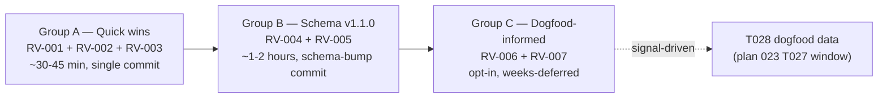

# Workshop: Post-Launch Review Fixes (Compound + Engineering Harness)

**Type**: Other (fix dossier — improvement-suggestion punch list)
**Plan**: 023-difficulty-ledger-skill
**Spec**: [`../difficulty-ledger-skill-spec.md`](../difficulty-ledger-skill-spec.md)
**Created**: 2026-05-18
**Status**: Approved (commitment locked: all 7 fixes will be done)

**Value Thesis**: A single durable reference for the 7 review fixes — each fix has an `RV-NNN` compound-tracking ID, a placement decision, files to touch, and a validation check — so implementation can execute without re-reading the original review or re-litigating triage decisions.

**Target Proof Level**: Implementation Ready
**Current Proof Level**: Implementation Ready

**Selected Value Axes**:
- **Implementation Readiness**: Each fix has files + validation + risk listed; an executor can go fix-by-fix without rediscovery.
- **Learning Compounding**: The workshop itself seeds 7 `improvement-suggestion` retros (RV-001 … RV-007); each transitions to `encoded` when shipped — proving the compound loop closes.
- **Review Compression**: Future reviewers can check "did we do RV-N?" against this doc plus git log; no need to re-derive scope.
- **Safety to Change**: Schema bump (v1.0.0 → v1.1.0) is additive only; back-compat path is explicit.
- **Cost / Attention Reduction**: Replaces the ~3KB review email with a tight punch list anchored to compound primitives.

**Related Documents**:
- [`001-self-improvement-vibe.md`](./001-self-improvement-vibe.md) — 7 anti-vibes (referenced by RV-005, RV-006)
- [`004-sdd-pipeline-compound-integration.md`](./004-sdd-pipeline-compound-integration.md) — referenced by RV-002 (`just compound-value` is the meta-loop's terminal view)
- [`005-universal-retro-contract.md`](./005-universal-retro-contract.md) — schema basis for RV-004 (evidence pointers bump)
- [`006-compound-folder-layout.md`](./006-compound-folder-layout.md) — KISS principle anchor (RV-002 preserves it; RV-007 must respect it)

**Domain Context**: No `docs/domains/registry.md` in this repo. Skills + schemas are the de-facto "domains".

---

## Purpose

External review of the just-shipped compound + engineering-harness skill family surfaced 7 concrete improvements. The user committed to doing all of them. This workshop locks each into a tracking record with files, validation, and risk — so we don't lose any, and so the principle-sensitive items (RV-006, RV-007) don't drift into compliance-gate vibes during implementation.

## Fresh Entrant Outcome

A fresh human or agent should be able to use this workshop to reach **Implementation Ready** with no additional context.

They should be able to:

- Identify all 7 fixes by `RV-NNN` ID with a one-line summary each
- Know which fixes ship together (3 sequenced groups)
- Execute Group A as a single commit (~30 min) without further design
- Execute Group B as a schema-bump batch (~1 hour) with the v1.1.0 path explicit
- Recognize the anti-vibe risks on RV-006 / RV-007 and apply the documented mitigations
- Verify each fix landed by running the listed validation command

## Key Questions Addressed

1. What were the 7 review suggestions, and do we commit to all of them?
2. Which fixes are cheap and aligned vs. which are bigger lifts?
3. Does any fix require a schema version bump? What is the migration path?
4. Which fixes risk introducing the vibes the compound system explicitly rejects (compliance gates, ceremony, numeric thresholds)?
5. Do these fixes belong in plan 023 (extend) or a new plan 024 (follow-up)?
6. How do we prove the loop closed for each fix (compound retro lifecycle)?

---

## Value Frame

| Field | Selection | Why It Matters |
|-------|-----------|----------------|
| Target Proof Level | Implementation Ready | The fixes are scoped, not exploratory; ambiguity costs more than detail. |
| Primary Value Axis | Implementation Readiness | Goal is to ship — punch list beats narrative. |
| Supporting Value Axes | Learning Compounding, Review Compression, Safety to Change | Workshop itself is a compound-loop closure event. |
| Downstream Loop Improved | Implementation + Review | Each `RV-NNN` becomes a commit + a compound `encoded` transition. |

---

## The Review (provenance)

The 7 suggestions originated from an external review of `scratch/skills-pack/codebase.md` (the compound + harness skill pack generated 2026-05-18). Verbatim review text lives in the chat transcript at session timestamp 2026-05-18T17:12Z. Each `RV-NNN` below references the review's numbering (#1 … #7) for traceability.

**Confirmed defect during triage**: RV-001 (target taxonomy) — `engineering-harness-v2/SKILL.md:218` filter admits `engineering-harness | tooling | infra`, but fixtures (`skills/compound/schemas/fixtures/*.retro.md`) emit `build | config | tooling | minih | project`. 3 of 5 fixture targets get silently dropped from Known Difficulties seeding. **Bug, not preference.**

---

## Fix Inventory

| RV-ID | Title | Review# | Group | Decision | Risk | Schema bump? |
|-------|-------|---------|-------|----------|------|--------------|
| RV-001 | Target taxonomy expansion | #2 | A | DO NOW | None | No |
| RV-002 | `--json` on `compound-3-harvest` + `just compound-value` | #1 + "do first" | A | DO NOW | None | No |
| RV-003 | Validation footer on `[e]ncode` diffs | #4 | A | DO NOW | None | No |
| RV-004 | Optional `evidence:` pointers on entries | #5 | B | DO (additive) | Schema discipline | Yes — v1.1.0 |
| RV-005 | Reduce mandatory confirmation in `engineering-harness-v2` CREATE mode | #6 | B | DO | Anti-vibe drift (nag-ware) | No |
| RV-006 | Cluster → regression-proof pattern | #3 | C | DO (opt-in only) | **Anti-vibe drift** (compliance gate) | No |
| RV-007 | Move deterministic harvest logic to scripts | #7 | C | DO (scoped) | Substrate dependency | No |

---

## Sequencing



**Why this order**:
1. Group A is bug fix + small features that change observable behavior immediately — ship them first so the loop demonstrably works better tomorrow.
2. Group B touches the schema and the engineering-harness UX — needs slightly more care, but no dependency on dogfood data.
3. Group C is principle-sensitive (RV-006) or substrate-dependent (RV-007) — let real-use signals from the T027 dogfood window decide how much to do.

---

## Group A — Quick Wins (DO NOW)

### RV-001 — Target taxonomy expansion

**What**: Expand the boot-time relevance filter in `engineering-harness-v2` from `engineering-harness | tooling | infra` to `engineering-harness | tooling | infra | build | config | dependencies | env | auth | tests | observe`.

**Why**: Confirmed bug. Fixtures and likely real-world entries emit `build` and `config` targets for the exact friction agents need to see at boot (install failures, env-var guessing). Currently filtered out — boot-time Known Difficulties section misses the most actionable entries.

**Files**:
- `skills/SDD/engineering-harness-v2/SKILL.md:155-156` — update HTML comment to list new targets
- `skills/SDD/engineering-harness-v2/SKILL.md:218` — update filter clause in Step 4a algorithm

**Validation**:
```bash
# Seed all 5 fixtures into a test docs/compound/ tree, run engineering-harness-v2,
# verify Known Difficulties contains entries with target=build and target=config.
grep -c "target: build\|target: config" docs/project-rules/engineering-harness.md
# Expected: >= 1
```

**Risk**: None. Strictly widens the filter; no entries previously included are dropped.

**Compound tracking**: `RV-001` `kind=improvement-suggestion` `target=engineering-harness` → transitions to `encoded` on commit; `resolved_by` = commit SHA.

---

### RV-002 — `--json` on `compound-3-harvest` + `just compound-value` recipe

**What**: Add a `--json` flag to `compound-3-harvest` that returns the already-computed terminal view as structured data, then wrap it in a `just compound-value` recipe for the daily one-liner check.

**Schema for `--json` output**:

```json
{
  "schema_version": "1.0.0",
  "generated_at": "2026-05-18T17:30:00Z",
  "retros": 27,
  "entries": {
    "total": 47,
    "open": 28,
    "suggested": 2,
    "encoded": 17,
    "wontfix": 0,
    "dismissed": 0,
    "escalated": 0,
    "stale": 0
  },
  "top_clusters": [
    {
      "kind": "difficulty",
      "target": "tooling",
      "count": 4,
      "oldest": "2026-05-14T11:22:00Z",
      "representative": "grep on src/ took 47s — should use ripgrep"
    }
  ],
  "harness": {
    "maturity": "L2",
    "last_validation": "2026-05-18",
    "boot_ms": 18000,
    "verdict": "healthy"
  }
}
```

**Why**: Preserves the KISS "no on-disk index" rule from workshop 006 — the view is computed at read time and never persisted. `--json` is just a different render of the same transient computation. The `just compound-value` recipe gives the user (and CI hooks, and future skills) a stable interface for the "is the loop compounding?" question.

**Terminal-rendered output** (what `just compound-value` shows, derived from the JSON above):

```text
Harness: L2, last validation HEALTHY, boot 18s
Compound: 47 entries — 28 open, 17 encoded, 2 suggested
Top friction:
  1. tooling/search slowness — 4 entries — suggested: just rg
  2. config/env guessing      — 3 entries — suggested: just doctor
  3. auth expiry unclear      — 2 entries — suggested: explicit AUTH_EXPIRED check

Next encoding:
  Add `just doctor` preflight for env/config/auth.
```

**Files**:
- `skills/compound/compound-3-harvest/SKILL.md` — add `--json` flag spec to "Runtime Filters" section; document output schema inline
- `justfile` — add `compound-value` recipe (4 lines: invoke the skill via the active CLI's skill runner, or shell out)

**Open implementation question**: `just compound-value` needs to invoke the skill. Options:
- (a) Direct CLI: `claude --skill compound-3-harvest --json | jq -r '<terminal-render-jq-script>'` — but binds to one CLI.
- (b) Tiny shell script `scripts/compound-value.sh` that documents the agent-side invocation and pretty-prints whatever JSON appears on stdin — agent-agnostic.
- **Recommended**: (b). Keeps the recipe portable across all 5 CLIs.

**Validation**:
```bash
just compound-value
# Expected: 6-line terminal view as shown above, or "No compound entries yet" if docs/compound/ is empty.
just compound-value --json | jq .entries.total
# Expected: numeric
```

**Risk**: None on the read side. The pretty-print script (option b) is the one new file; pure stdin→stdout, no state.

**Compound tracking**: `RV-002` `kind=improvement-suggestion` `target=compound`.

---

### RV-003 — Validation footer on `[e]ncode` diffs

**What**: When `compound-2-bubble` stages an encoded fix into `scratch/encode-<id>-<target>.diff`, append a `## Validation` footer block to the diff with the validation commands and expected outcome.

**Footer template**:

```markdown
## Validation

Run:
  <command 1>
  <command 2>

Expected:
  - <observable outcome 1>
  - <observable outcome 2>

Compound lifecycle:
  RV-<id> transitions from `suggested` to `encoded` when this diff lands.
```

**Why**: Currently `[e]ncode` produces a diff staged in scratch. Reviewers can see the patch but have to infer how to verify it. Adding a validation footer makes "encoded" mean "loop changed AND provable" — not just "we wrote a patch". Matches the principle that every compound entry should reduce ambiguity for the next session.

**Files**:
- `skills/compound/compound-2-bubble/SKILL.md` — add footer template + 1-2 sentence instruction to the `[e]ncode` action section.

**Validation**:
```bash
# Trigger a compound-2-bubble session with [e]ncode action on a seeded difficulty.
# Inspect the staged diff:
grep -A 8 "^## Validation" scratch/encode-*-*.diff
# Expected: validation block present with non-empty Run/Expected sections.
```

**Risk**: None. Purely additive to the diff template.

**Compound tracking**: `RV-003` `kind=improvement-suggestion` `target=compound`.

---

## Group B — Schema v1.1.0 + Ergonomics

### Schema bump plan (one-time, gates RV-004)

- **From**: `schema_version: "1.0.0"`
- **To**: `schema_version: "1.1.0"`
- **Compat**: Additive only — new optional `evidence` property on entries. All v1.0.0 retros parse unchanged.
- **Files**:
  - `skills/compound/schemas/retro.schema.json` — add `evidence` property + bump root `properties.schema_version.default`
  - `skills/compound/schemas/fixtures/full.retro.md` — add an `evidence:` example
  - `skills/compound/compound-1-track/SKILL.md`, `compound-2-bubble/SKILL.md`, `compound-3-harvest/SKILL.md` — note v1.1.0 default; readers MUST tolerate missing `evidence` block.
- **Migration**: None required. Old entries remain valid.

### RV-004 — Optional `evidence:` pointers on entries

**What**: Add optional `evidence` object to the entry schema, capturing the concrete artifact that made the difficulty real.

**Proposed schema fragment** (inserted under each entry's properties):

```json
"evidence": {
  "type": "object",
  "description": "Optional. Concrete artifact that made this entry real. Lets a future agent reproduce without reverse-engineering the story.",
  "properties": {
    "command": { "type": "string" },
    "exit_code": { "type": "integer" },
    "duration_ms": { "type": "integer", "minimum": 0 },
    "stdout_path": { "type": "string" },
    "stderr_path": { "type": "string" },
    "rerun_script": { "type": "string" }
  },
  "additionalProperties": false
}
```

**Why**: Right now `description` carries the friction in prose. A future agent reading the retro has to interpret. With `evidence`, the harvest view becomes objective ("this command exited 1 in 47 seconds") and reruns are mechanical.

**Files**:
- `skills/compound/schemas/retro.schema.json` (with v1.1.0 bump)
- `skills/compound/schemas/fixtures/full.retro.md` — add evidence block to one entry as an example
- `skills/compound/compound-1-track/SKILL.md` — note: when tool failures are observed, capture stdout/stderr to `docs/compound/_buffers/evidence/<timestamp>-<slug>.{stdout,stderr}.log` and reference from buffer entry
- `skills/compound/compound-3-harvest/SKILL.md` — when `evidence` is present, include the command + exit_code in the cluster representative line

**Validation**:
```bash
# Validate v1.1.0 schema accepts entries with and without evidence:
jq --slurpfile schema skills/compound/schemas/retro.schema.json \
  'inputs | $schema[0]' \
  skills/compound/schemas/fixtures/full.retro.md
# Expected: schema passes for entries both with and without evidence block.
```

**Risk**: Schema discipline — the evidence paths must be relative to `docs/compound/` to remain portable across machines. Document this in the schema description.

**Compound tracking**: `RV-004` `kind=improvement-suggestion` `target=compound` `linked_principles=workshop-005`.

---

### RV-005 — Reduce mandatory confirmation in `engineering-harness-v2` CREATE mode

**What**: Change the CREATE-mode flow from "auto-detect → present → wait for confirm → write" to "auto-detect → write draft → validate → report confidence + missing fields". Only prompt when uncertainty actually blocks execution (ambiguous boot command, unknown port, destructive cleanup).

**Why**: Current CREATE flow asks for confirmation even on high-confidence auto-detections — that's the "nag-ware" anti-vibe (workshop 001 anti-vibe #1). Auto-write + report-with-confidence aligns with how compound-1-track operates silently.

**Mitigation against drift**: Keep the prompt for the 3 known-ambiguous cases (boot command unclear, port collision, destructive cleanup). The change is "default to act, prompt only on real ambiguity" — not "remove all prompts".

**Files**:
- `skills/SDD/engineering-harness-v2/SKILL.md` — rewrite the CREATE-mode user-interaction section (currently presents a confirmation step before writing)

**Validation**:
```bash
# Run engineering-harness-v2 --create on a project with unambiguous boot setup (e.g., justfile + just dev recipe).
# Expected: writes docs/project-rules/engineering-harness.md without prompting; emits "Confidence: HIGH" report.
# Run on a project with no boot command at all.
# Expected: prompts for the boot command (real ambiguity case).
```

**Risk**: **Anti-vibe drift** — could over-correct into "never prompt for anything". Mitigation is the explicit list of 3 ambiguity triggers. If the user reports new ambiguity classes during dogfood, add to the list — don't broaden the prompt heuristic.

**Compound tracking**: `RV-005` `kind=improvement-suggestion` `target=engineering-harness` `linked_principles=anti-vibe-1-nag-ware`.

---

## Group C — Dogfood-Informed (Principle-Sensitive)

### RV-006 — Cluster → regression-proof pattern (OPT-IN ONLY)

**What**: When `compound-3-harvest` surfaces a recurring cluster (≥3 entries on same `target` + `kind`), the suggested action evolves from "encode a fix" to "encode a fix AND add a failing check that would have caught it". The harvest output includes a `regression_check_template:` field suggesting the shape of that check.

**Example**:

| Cluster | Old: encode | New: encode + regression proof |
|---------|-------------|-------------------------------|
| "env vars unclear" (3 entries, target=config) | Add doctor docs | `just doctor` fails with missing vars + actionable names |
| "grep slow" (4 entries, target=tooling) | Note to use ripgrep | `just rg` recipe + alias suggestion |
| "auth expired" (2 entries, target=auth) | Known-difficulty row | Health check returns `AUTH_EXPIRED` |

**Why**: Closes the loop from "we documented the pain" to "we made the pain self-announcing". This is what makes compound the second derivative of velocity — friction encoded today never costs the same again tomorrow.

**🚨 Anti-vibe mitigation (CRITICAL)**: This pattern MUST stay OPT-IN. **No compliance gates, no thresholds, no enforcement levers.** The compound philosophy is best-effort (per the user's standing instruction `feedback_compound_best_effort.md`).

Concrete guardrails:
1. The `regression_check_template:` field is **suggestion only** — harvest does not refuse to display clusters lacking one.
2. No "compliance %" reporting. No "X clusters lack regression checks" warning. Just the suggested template + an example.
3. Some difficulties genuinely don't have a clean failing check (research dead-ends, conceptual confusion, third-party flake). The harvest output for those should say `regression_check_template: N/A — conceptual` and move on.
4. The implementor (during `[e]ncode`) decides whether to write the check. No skill nags them.

**Files**:
- `skills/compound/compound-3-harvest/SKILL.md` — extend cluster output schema with optional `regression_check_template` field; add the 3-row decision table above as documentation
- `skills/compound/compound-2-bubble/SKILL.md` — in `[e]ncode` flow, if the staged entry's cluster has a `regression_check_template`, surface it inline in the diff comment (not blocking)

**Validation**:
```bash
# Seed a cluster of 3+ difficulties on target=config with description containing "env var".
just compound-value
# Expected: cluster shown with regression_check_template like "just doctor" — but only as a suggestion line, no warning/error if user ignores it.
```

**Risk**: **High vibe-drift risk** — this is the suggestion most likely to creep into compliance ceremony. Mitigation = the 4 guardrails above + explicit "N/A — conceptual" escape hatch.

**Defer until**: Plan 023 T027 dogfood signal (≥4 weeks of real usage) gives us actual clusters to test the template against. Implementing this against synthetic clusters risks fitting the template to imagined patterns.

**Compound tracking**: `RV-006` `kind=improvement-suggestion` `target=compound` `linked_principles=anti-vibe-1-nag-ware,anti-vibe-7-compliance` `defer_until=T028-dogfood-signal`.

---

### RV-007 — Move deterministic logic to scripts (SCOPED)

**What**: Extract genuinely deterministic operations from `compound-3-harvest` (clustering by `(kind, target)`, dedup by `retro_id`, schema validation) into `skills/compound/compound-3-harvest/scripts/*.py`. The skill body becomes thinner — it orchestrates and interprets; the scripts handle pure computation.

**Initial scope (Phase 3a — start here)**:
- `scripts/cluster.py` — read `.retro.md` files via stdin or path arg, output JSON clusters
- `scripts/validate.py` — JSON-schema validate a single retro, exit 0/1
- `scripts/dedup.py` — given a list of retro paths, output deduplicated set by `retro_id`

**Why**: These three operations have no contextual judgment — same input always produces same output. Prose-driven implementation re-reasons through them every invocation, wasting tokens and inviting drift. Scripts make them cheap, testable, and consistent across the 5 supported CLIs.

**Out of scope (stay prose-driven)**:
- `compound-1-track` — trigger heuristics need contextual judgment
- `compound-2-bubble` — user-prompt rendering, action interpretation
- `engineering-harness-v2` — boot/interact/observe checks are project-specific

**Files**:
- `skills/compound/compound-3-harvest/scripts/cluster.py` (new)
- `skills/compound/compound-3-harvest/scripts/validate.py` (new)
- `skills/compound/compound-3-harvest/scripts/dedup.py` (new)
- `skills/compound/compound-3-harvest/SKILL.md` — rewrite Algorithm section to invoke scripts instead of describing the operations in prose
- `scripts/check-skill-slugs.sh` pattern — verify scripts dir doesn't break the npx skills install (test: `npx skills add . --skill compound-3-harvest` still works)

**Validation**:
```bash
# Run each script standalone:
python skills/compound/compound-3-harvest/scripts/validate.py skills/compound/schemas/fixtures/full.retro.md
# Expected: exit 0
python skills/compound/compound-3-harvest/scripts/cluster.py docs/compound/agents/**/*.retro.md
# Expected: JSON output with clusters array

# Verify install still works across all 5 CLIs:
just install-skills-from-source
# Expected: scripts/ subdirectory installed alongside SKILL.md
```

**Risk**: Substrate dependency — scripts require Python 3 on the path. The repo already depends on Python (jk-tools-setup, scripts/migrate-skills.py), so this is consistent.

**Open question (resolve before starting)**: Does the `npx skills` CLI flatten the `scripts/` subdir, or preserve it? **Action**: Test with `npx skills add . --skill compound-3-harvest --list` before implementing. If flattened, place scripts under a different relative path or vendor them.

**Defer until**: Group A + Group B complete. Group C waits on actual usage data (T027) to confirm clustering/dedup logic is stable before locking it into scripts.

**Compound tracking**: `RV-007` `kind=improvement-suggestion` `target=compound` `defer_until=group-b-complete-or-T028`.

---

## Decision Space (decisions locked here)

### D1: Same plan 023 follow-up, or new plan 024?

| Option | Pros | Cons | Decision |
|--------|------|------|----------|
| Extend plan 023 with a new phase | Single plan history; T025-T028 already deferred | Plan 023 has "Landed" status; adding work re-opens it | **Rejected** |
| New plan 024-compound-review-fixes citing this workshop | Clean 023 close; 024 has clear scope; each fix maps to a 024 task | One more plan folder | **Selected** |

**Rationale**: Plan 023 shipped. Mixing post-launch fixes into a "landed" plan muddles the journey-map narrative. Plan 024 has the right scope (these 7 fixes) and inherits 023's substrate.

### D2: Schema bump strategy

| Option | Pros | Cons | Decision |
|--------|------|------|----------|
| Bump to 1.1.0 (minor, additive) | SemVer-correct; old retros valid | Readers must tolerate missing `evidence` | **Selected** |
| Stay at 1.0.0, add evidence as undocumented field | Zero ceremony | Schema drift; future readers can't validate | Rejected |
| Bump to 2.0.0 | Cleaner break | Forces migration on all existing retros | Rejected (no breaking change exists) |

### D3: Anti-vibe risk on RV-006

**RESOLVED** — Implement as opt-in suggestion only. Four guardrails listed in the RV-006 block above. Concrete check during implementation: if the diff adds any string containing "must", "required", "non-compliant", or "%", reject and rewrite.

### D4: Scripts substrate (RV-007)

**RESOLVED** — Scope to `compound-3-harvest` only in Phase 3a. Three scripts: cluster, validate, dedup. Other skills stay prose-driven. Revisit after T028 dogfood signal — may expand to engineering-harness's compound-ledger seeding read if it proves brittle.

---

## Attention Reduction

| Future Loop | Before Workshop | After Workshop |
|-------------|-----------------|----------------|
| Implementation of fixes | Re-read review email, re-derive scope, re-litigate principle risks | Open `007-post-launch-review-fixes.md`, pick a Group, execute the listed files; validate per command |
| Review of fix PRs | Reviewer must reconstruct "is this what the review asked for?" | Reviewer compares PR against `RV-NNN` block (files + validation) |
| Compound retro authoring | Author re-discovers what improvement-suggestions look like | Workshop seeds 7 well-formed retros with IDs, kinds, targets, validations |
| T028 verification (4 Compounding Test signals) | Need to assemble evidence that "subsequent session surfaces entry" | Each `RV-NNN` shipping is a literal demo of the action→encode→surface cycle |

---

## Evidence Ledger

| Evidence | Location | Supports | Status |
|----------|----------|----------|--------|
| Confirmed taxonomy bug | `skills/SDD/engineering-harness-v2/SKILL.md:218` vs fixtures grep | RV-001 is defect not preference | Validated |
| Review verbatim text | Chat transcript 2026-05-18T17:12Z + `scratch/skills-pack/codebase.md` | Provenance for all 7 RV items | Ready |
| Retro schema kind enum | `skills/compound/schemas/retro.schema.json:64-74` | Each RV maps to `kind=improvement-suggestion` | Validated |
| ID pattern `^[A-Z]+-\d{3,}$` | `skills/compound/schemas/retro.schema.json:61` | `RV-001`…`RV-007` are valid IDs | Validated |
| Workshop 001 anti-vibe list | `workshops/001-self-improvement-vibe.md` | Mitigations on RV-005, RV-006 trace to documented vibes | Ready |
| Workshop 006 KISS principle | `workshops/006-compound-folder-layout.md` | RV-002 preserves "no on-disk index" rule; RV-007 must not violate | Ready |

---

## Validation / Acceptance

This workshop reaches Implementation Ready when:

- [x] All 7 RV items have `RV-NNN` IDs, files touched, validation command, risk + mitigation
- [x] Grouping (A/B/C) is justified by leverage + risk profile, not arbitrary
- [x] Schema bump path (v1.1.0) is explicit and proven additive
- [x] Anti-vibe risks on RV-005 + RV-006 are named and mitigated
- [x] Decision on plan 023 vs 024 is locked (D1)
- [x] Each RV item is structured to seed a compound retro entry directly

---

## Open Questions

### Q1: Does the `npx skills` CLI preserve subdirectories under `skills/<slug>/`?

**OPEN** — Critical gate for RV-007. Test command: `npx skills add . --skill compound-3-harvest --list` against a branch that has a stub `scripts/` directory in the skill. If subdirs are flattened, RV-007 needs a different layout (e.g., scripts live at `scripts/compound/` repo-level and the skill references them by path).

**Action item**: Run this test before scheduling RV-007 work. Not a blocker for Group A or Group B.

### Q2: Should `just compound-value` be cross-CLI portable, or claude-code-first?

**RESOLVED** — Cross-CLI portable. Use the shell-script-pretty-printer approach (option b in RV-002). The script accepts JSON on stdin and renders the terminal view; the user's active CLI is responsible for producing the JSON via the appropriate skill invocation. Keeps the `just` recipe agent-agnostic.

### Q3: For RV-006, where do we draw the line on "conceptual" vs "actionable" clusters?

**OPEN — defer to dogfood**: Let real cluster data from T027 inform this. The escape hatch (`regression_check_template: N/A — conceptual`) is sufficient until then. Do NOT pre-specify a taxonomy of which kinds are conceptual — that's the exact vibe drift the guardrails exist to prevent.

---

## Compound Tracking — How This Workshop Closes the Loop

Each `RV-NNN` is a seed for one compound retro entry:

```yaml
# Conceptual shape — actual retro emitted when RV-NNN ships
id: RV-001
kind: improvement-suggestion
target: engineering-harness
description: Expand boot-time relevance filter to include build/config/auth/tests targets.
status: suggested  →  encoded  (on commit)
linked_workshop: docs/plans/023-difficulty-ledger-skill/workshops/007-post-launch-review-fixes.md
resolved_by: <commit-sha>
evidence:
  command: "grep target docs/project-rules/engineering-harness.md"
  expected: ">= 1 entry with target: build or target: config"
```

When all 7 RVs ship, harvest output will show 7 `encoded` entries pointing back to this workshop. **That is the literal compounding test for plan 023 — the system catches and resolves friction in its own design.**

---

## Next Steps

1. **`/plan-1b-v2-specify` for plan 024**:
   - Slug: `compound-review-fixes`
   - Spec body: 3 phases matching Groups A/B/C; each phase's tasks come from the RV-NNN blocks above
   - Workshop link: this file

2. **`/plan-3-v2-architect` for plan 024**:
   - Phase 1: Group A (3 fixes, single commit target)
   - Phase 2: Group B (schema bump + UX, 2 fixes)
   - Phase 3: Group C (signal-deferred, 2 fixes)

3. **Group A immediately** after plan 024 has phase tasks — these are 30-45 min of changes, no design risk.

4. **Group B** as a follow-up commit on the same branch as Group A.

5. **Group C** waits on T028 dogfood signal from plan 023. Hold the branch open or merge Groups A+B first and revisit C in a new plan 025.

6. **Workshop status update** to `Approved` (already set above).

---

## Status

**Approved — commitment locked**. All 7 RV items will be done. Sequencing is recommended but not forced; the only hard constraint is "schema bump (v1.1.0) gates RV-004", which means Group A can ship before or after Group B but the schema bump is a single discrete commit either way.
