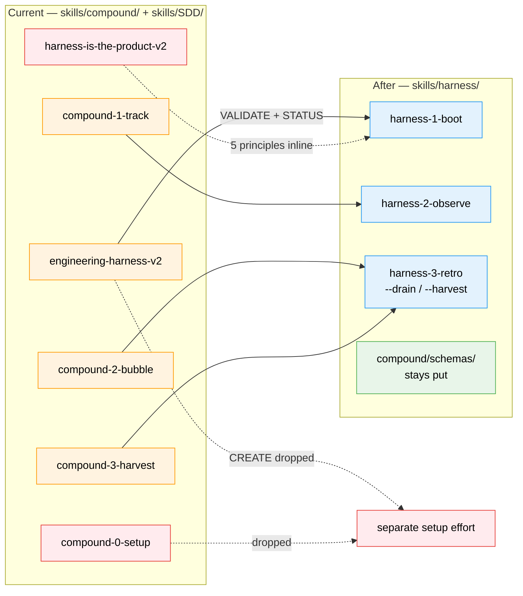

# Flight Plan: Harness Nucleus Consolidation

**Spec**: [harness-nucleus-spec.md](./harness-nucleus-spec.md)
**Plan**: [harness-nucleus-plan.md](./harness-nucleus-plan.md)
**Generated**: 2026-05-28
**Status**: Landed — 17/17 tasks complete; committed `897a3b9`, pushed to main; all grep gates + dogfood install (AC1–AC13) pass

---

## The Mission

**What we're building**: Collapse the 6-skill compound + harness family into 3 harness-themed loop-stage skills (`harness-1-boot`, `harness-2-observe`, `harness-3-retro`) under a new `skills/harness/` category, retire the standalone philosophy skill by encoding its 5 principles inline, and update every cross-reference in lockstep.

**Why it matters**: Skill names will name the loop stage they serve (Boot → Observe → Retro) instead of the artifact (`compound`). One less skill to maintain (philosophy goes inline), a consistent family, and a clean base for the eventual standalone-repo extraction — without breaking the 8 SDD consumers, the minih cross-system contract, or the `engineering-harness.md` filename contract.

---

## Where We Are → Where We're Headed

```
TODAY (6 skills, mixed naming):          AFTER plan-024 (3 skills, loop-stage naming):

[~] engineering-harness-v2               [~] harness-1-boot          (← VALIDATE + STATUS)
    (CREATE + VALIDATE + STATUS)         [DROP] CREATE mode          → separate setup effort
[~] compound-0-setup                     [DROP] ledger scaffolder    → separate setup effort
[~] compound-1-track                     [~] harness-2-observe       (1:1 rename)
[~] compound-2-bubble    ─┐              [~] harness-3-retro --drain
[~] compound-3-harvest   ─┴── MERGE ──→  [~] harness-3-retro --harvest
[X] harness-is-the-product-v2            [DEL] retired → 5 principles inline

8 SDD ## Compound integration            8 SDD ## Harness integration (atomic cascade)
5 governance docs (old names)            5 governance docs (new names)
plan-3-v3-architect: 2-deep chain BUG    plan-3-v3-architect: 3-deep chain FIXED
```

Legend: `[~]` modified/renamed · `[DROP]` removed (to separate setup effort) · `[DEL]` deleted · `[X]` retired



**Legend**: existing (green, unchanged) | changed (orange, source consumed) | new (blue, created) | gone (red, dropped/retired)

---

## Scope

**Goals**:
- G1: Skill names match loop stage (boot/observe/retro), not artifact (compound)
- G2: Retire philosophy skill; 5 principles distribute inline into surviving bodies + README
- G3: Atomic cross-reference cascade — no old names survive (modulo immutable plan-023 history)
- G4: Fix the latent 2-deep harness-doc fallback bug in plan-3-v3-architect
- G5: Vocabulary freeze — 3 harness-N-* names stable ≥1 quarter

**Non-Goals**:
- Scaffold / migration / audit concepts → user's **separate engineering-harness setup effort** (not tracked here)
- New repo extraction, CLI + extension architecture, `harness-backpressure-eval` → plan-025+ Workshop Opportunities
- Renaming `engineering-harness.md` filename, schema files, or `docs/compound/` path root (cross-system frozen)
- Rewriting plan-023 design history (forward-pointer only)

---

## Journey Map


**Legend**: green = done | yellow = active/next | grey = not started

---

## Phases Overview

| Phase | Title | Tasks | CS | Status |
|-------|-------|-------|----|--------|
| 1 | Consolidation (single phase — Simple Mode) | 17/17 done | CS-3 | Complete |

Simple Mode = one phase with inline tasks. Task table generated in [harness-nucleus-plan.md](./harness-nucleus-plan.md) § Implementation. Next: `/plan-6-v2-implement-phase`.

---

## Acceptance Criteria

- [ ] AC1: `grep -l 'compound-[0-9]' skills/SDD/*/SKILL.md` empty; `harness-2-observe\|harness-3-retro` hits the 8 files
- [ ] AC2: `grep -rln 'harness-is-the-product\|engineering-harness-v2' skills/ docs/ *.md` empty (excl. plan-023)
- [ ] AC3: 5 governance docs reference new names; old names gone
- [ ] AC4: `harness-3-retro --harvest --json` preserves `harness.maturity/verdict/boot_ms`; `just compound-value` succeeds
- [ ] AC5: `just doctor-skills` clean; 6 old `~/.agents/skills/` slugs removed
- [ ] AC6: `npx skills add jakkaj/tools -a claude-code -g` installs 3 new slugs; 6 old slugs gone
- [ ] AC7: plan-3-v3-architect full 3-deep fallback chain + Phase 0 creates `engineering-harness.md`
- [ ] AC11: Vocabulary-freeze recorded (commit + CLAUDE.md paragraph)

---

## Key Risks

| Risk | Mitigation |
|------|-----------|
| Vocabulary regression — bare "harness" creeps back (PL-05) | Grep-audit gate as Done-When on final cascade task |
| npx-skills orphan trap — old slugs linger (PL-04) | Explicit `rm -rf` of 6 old slugs + `just doctor-skills` post-install |
| Tooling silent-breakage — compound-value.sh jq filters (CF-02) | Preserve `--json` shape OR atomic rewrite of script + recipe |
| Mode-extraction error — dangling `--create` refs after splitting engineering-harness-v2 | Grep for `--create` suggestions during cascade; redirect or remove |
| Self-modifying skill ordering (PL-02) | Order plan-1a/3/6/6a edits LAST |

---

## Flight Log

<!-- Updated by /plan-6 and /plan-6a after each phase completes -->

### Phase 1: Consolidation — 16/17 landed (2026-05-29)

**What was done**: Collapsed the 6 compound+harness skills into 3 loop-stage skills under a new `skills/harness/` category and cascaded every cross-reference atomically. The latent `plan-3-v3-architect` 2-deep fallback-chain bug was fixed in the same train. All grep-audit gates (AC1/AC2/AC3/AC13) pass; AC4 verified functionally.

**Key changes**:
- `skills/harness/harness-1-boot/` — VALIDATE+STATUS extracted verbatim from `engineering-harness-v2`; CREATE + Known-Difficulties seed + Anti-Patterns dropped (KF05); canonical-first 3-deep chain; `UNAVAILABLE` graceful degrade
- `skills/harness/harness-2-observe/` — `git mv` from `compound-1-track`; `compound-0-setup` self-heal refs neutralized to no-op/UNAVAILABLE
- `skills/harness/harness-3-retro/` — merge of `compound-2-bubble` (`--drain`) + `compound-3-harvest` (`--harvest`); `[s/t/p/e/d/a]` menu + 8-path `--json` schema preserved
- Retired `harness-is-the-product-v2` — 5 principles distributed inline across the 3 bodies + README (AC12)
- 8 SDD appendices, 5 governance docs (+ AC11 vocab-freeze), `justfile`/`compound-value.sh`, `src/jk_tools/` mirror, plan-023 forward-pointer, `walkthroughs.md` fixture trace
- `plan-3-v3-architect` — canonical-first 3-deep harness-doc read + Phase-0 creates `engineering-harness.md` (AC7)

**Decisions made**: MIGRATION.md's explicit stale-file `rm` lists collapsed into behavior-preserving globs (so the retired names disappear from the doc while cleanup still works). `compound-value` recipe name kept (not a skill name). Frozen `skills/compound/schemas/` left untouched (Non-Goal) — its `compound-2/3` strings are expected, AC2-excluded residue.

**Dogfood (T014, post-push)**: committed `897a3b9`, pushed `bffbe24..897a3b9 → main`; removed 7 old slugs (6 plan + stale `agent-harness-v2`) from canonical + `~/.claude/skills`; `just install-skills-from-source` + `just doctor-skills` clean (32 skills, no orphans/dangling); `npx skills add jakkaj/tools` from published main installed the 3 new slugs (AC5 + AC6 green).
