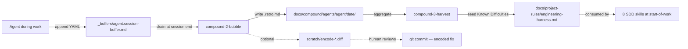

# Research Report: Harness Nucleus — Renaming, Merging, and Extracting the Compound + Harness Skill Family

**Generated**: 2026-05-28
**Research Query**: "fully explore these changes" — the proposed restructure of the compound + harness skill family into harness-themed skills aligned with a Boot → Do Work → Observe → Retro → Improve loop, with eventual extraction into a new standalone "harness nucleus" repo (CLI + extension architecture)
**Mode**: Pre-Plan
**Location**: `docs/plans/024-harness-nucleus/research-dossier.md`
**FlowSpace**: Not used (codebase is small + recently authored; direct file reads were sufficient)
**Findings**: 74 (IA-10 + DC-10 + PS-8 + QT-8 + IC-10 + DE-10 + PL-11 + DB-8)

## Executive Summary

### What is being explored
A proposed restructure of six skills (`compound-0/1/2/3-*` under `skills/compound/`, plus `harness-is-the-product-v2` and `engineering-harness-v2` under `skills/SDD/`) into a smaller set of **harness-themed skills** that name the loop stages directly: **harness-setup → harness-boot → harness-observe → harness-backpressure-eval → harness-retro**. The philosophy skill (`harness-is-the-product-v2`) is candidate-for-retirement; its principles fold into `harness-boot` (front-of-loop session-start grounding) and a repo README. The end-state is **a new standalone repo** that hosts the nucleus + a small CLI with an extension architecture for teams to grow their own harness.

### Business purpose
The current `compound/` family encodes the philosophy in the wrong direction — it's named after the artifact (`compound`) but the user-facing concept is the **engineering harness** and its feedback loop. Renaming aligns the skills with how teams will adopt them; the new repo lets the nucleus evolve without entangling with `jakkaj/tools`'s broader SDD pipeline.

### Key insights
1. **Asymmetric risk**: `engineering-harness-v2` is battle-tested (one confirmed shipped bug, fixed in FX001); the compound-* skills are nearly unused (exactly **one retro** in the live ledger, and it's the system documenting its own fix). Renaming compound-* is essentially free; renaming engineering-harness-v2 carries real regression risk.
2. **Eight SDD skills auto-fire compound by name** via explicit `## Compound integration` sections. A rename without atomic cross-file edits silently breaks every one — no error, no warning, just no compound capture happening.
3. **The trajectory is consolidation**. Two recent merges (plan-1b-v2+plan-2-v2 → plan-1b-v3, plan-3-v2+plan-4-v2 → plan-3-v3) show this restructure is part of an existing pattern, not novel. The compound+harness restructure continues the trend.
4. **Cross-system contracts limit free movement**. The universal retro schema, `.retro.md` wire format + path layout, sentinel `docs/compound/.disabled`, and the engineering-harness.md governance doc are all cross-system or user-facing. Only the buffer protocol is freely renameable.
5. **A new repo is feasible cleanly**. Compound + harness have **zero dependencies on SDD**; SDD has 14 soft-references back (skill-name + buffer-path based). Extraction requires a name-stability contract, not code re-architecture.

### Quick Stats
- **Components**: 6 target skills, 8 downstream SDD consumers (auto-fire), 1 justfile recipe, 1 shell script tightly coupled to `--json` schema
- **Dependencies**: 7 SDD skills depend on `docs/project-rules/engineering-harness.md`; 1 (compound-3-harvest) parses sections of it
- **Test Coverage**: Schema fixtures (5 `.retro.md` files in `skills/compound/schemas/fixtures/`); no executable test suite; `walkthroughs.md` is design-review prose, not regression tests
- **Maturity**: 1 battle-tested (engineering-harness-v2), 1 lightly-used (harness-is-the-product-v2), 4 experimental-to-unshipped (compound-0/1/2/3)
- **Prior Learnings**: 11 — including 1 active retro (the FX001 self-closure), 4 rename-saga commits, and the "trust grep not the plan" gotcha from plan-023 implementation
- **Domains**: 5 natural boundaries identified (no registry yet) — compound, harness, SDD-pipeline, dev-tooling, plan-tooling

## How It Currently Works

### Entry Points

| Entry Point | Type | Location | Purpose |
|------------|------|----------|---------|
| `/compound-0-setup` | User-invoked | `skills/compound/compound-0-setup/SKILL.md` | Scaffold `docs/compound/`; split-migrate legacy `docs/retros/` |
| `compound-1-track` | Silent auto-fire | `skills/compound/compound-1-track/SKILL.md` | Append friction/insight entries to per-agent buffer |
| `/compound-2-bubble` | Auto-fire with user surface | `skills/compound/compound-2-bubble/SKILL.md` | Session-end soft prompt; drain buffer to `.retro.md` |
| `/compound-3-harvest` | Auto-fire (FINAL phase / merge) + manual | `skills/compound/compound-3-harvest/SKILL.md` | Curator: cluster, age, prioritize; terminal view + `--json` |
| `/harness-is-the-product-v2` | User-invoked | `skills/SDD/harness-is-the-product-v2/SKILL.md` | Re-ground session on the 5 principles |
| `/engineering-harness-v2` | User-invoked (`--create`/`--validate`/`--status`) | `skills/SDD/engineering-harness-v2/SKILL.md` | Write/validate `docs/project-rules/engineering-harness.md` |

### Core Execution Flow

The current loop (per workshop 002, locked decision DE-03):

```
Stage 1 (Explore)         user starts work
   ↓
Stage 2 (Work + Track)    agent silently calls compound-1-track during work
   ↓ (buffer accumulates entries)
Stage 3 (Bubble)          at session end OR logical pause, compound-2-bubble fires
   ↓ (writes .retro.md, truncates buffer, optionally stages encode diff)
Stage 4 (Harvest)         at companion FINAL / plan-8 end / plan-7 end, compound-3-harvest fires
   ↓ (clusters, ages, prints top-10; mutates status in-place)
Stage 5 (Re-encode)       human reviews encode diffs in scratch/, applies if good
   ↓
→ next session reads the improved harness + ledger
```

**Critical design property (DE-03 F2)**: skills communicate **only through files**, never through direct skill-to-skill calls. The ledger IS the integration surface. This makes cross-CLI portability and minih interop free.

### Data Flow



### State Management

State lives on the filesystem:
- **Buffers**: `docs/compound/_buffers/<agent>.session-buffer.md` — gitignored, append-only, per-agent
- **Retros**: `docs/compound/agents/<agent>/<date>/T<HHMMSS>Z-<hash>.retro.md` — checked in, append-only modulo lifecycle mutations
- **Lifecycle mutations**: `system.compound.status` field mutated in-place by `compound-3-harvest` (`open` → `encoded`/`wontfix`/`stale`)
- **No on-disk indexes** — KISS rule from workshop 006 D4 + user memory `feedback_kiss_information_over_ceremony.md`

## Architecture & Design

### Three-Layer Stack (Workshop 003; locked-in)

| Layer | Skill | Role | Artifacts |
|-------|-------|------|-----------|
| Philosophy | `harness-is-the-product-v2` | 5 principles; re-grounding; reports ledger state | None (pure read+report) |
| Substrate | `engineering-harness-v2` | Scaffold + validate engineering harness | `docs/project-rules/engineering-harness.md` |
| Meta-loop | `compound-0/1/2/3-*` | Capture friction → encode → improve | `docs/compound/{_buffers,agents,schemas}/` |

**Asymmetry**: meta-loop depends on substrate (needs encoding targets); substrate does NOT depend on meta-loop. Philosophy depends on neither (it's a leaf node — no skill invokes it).

### Loop Topology (IA-07)

Current handoffs are **loose** — one-line pointers, not tight invocations:
- `compound-0-setup` Step 3 prints an advisory pointer to `engineering-harness-v2`
- Plan-* skills auto-fire `compound-2-bubble` and `compound-3-harvest` at fixed hook points
- `engineering-harness-v2` Step 4a re-renders `## Known Difficulties` from `compound-3-harvest`'s ledger reads

The only **tight coupling** is the 8 SDD skill `## Compound integration` sections (DC-08) that explicitly invoke compound skills by name.

### Patterns Identified

1. **Silent producer** (compound-1-track) — no user output, never prompts, append-only
2. **Auto-fire with user surface** (compound-2-bubble, compound-3-harvest) — invoked by pipeline skills but shows ONE bounded user prompt; "never asks twice"
3. **User-invoked governance writer** (engineering-harness-v2, compound-0-setup) — explicit modes (CREATE/VALIDATE/STATUS); idempotent
4. **File-based integration** — every cross-skill handoff is a file read/write, never a function call
5. **Append-only KISS** (PL-08) — when adding compound integration to 8 SDD skills, appended a clearly-titled appendix rather than restructuring inline; auditable via git diff
6. **No on-disk indexes** (DE-07) — cross-cutting views computed at read-time and printed to terminal; never persisted

### System Boundaries

- **Internal boundaries**: buffer protocol (IC-03), action menu letter overload [s] (IC-06) — both freely changeable within the family
- **External interfaces**: universal retro JSON schema (IC-01, cross-system with minih); `.retro.md` wire format + path layout (IC-02); engineering-harness.md doc + section structure (IC-07, 8 SDD readers)
- **User-facing**: sentinel `docs/compound/.disabled`; `[s/t/p/e/d/a]` action menu

## Dependencies & Integration

### Internal Dependencies (within compound + harness family)

| Dependency | Type | Direction | Risk if Changed |
|------------|------|-----------|-----------------|
| compound-1-track → buffer file | Write | producer | None — internal |
| compound-2-bubble → buffer file | Read+truncate | consumer | None — internal |
| compound-2-bubble → .retro.md path | Write | producer | Cross-system (IC-02) |
| compound-3-harvest → .retro.md glob | Read+mutate | consumer | Cross-system (IC-02) |
| compound-3-harvest → engineering-harness.md sections | Read parse | consumer | Cross-system (IC-07) |
| engineering-harness-v2 → .retro.md glob | Read | consumer (Known Difficulties) | Cross-system (IC-02) |
| compound-0-setup → docs/retros/*.md | Read+split-migrate | consumer (legacy) | Cross-system with minih (IC-04) |

### Cross-System Dependencies

| Contract | Consumers | Classification | Restructure Verdict |
|----------|-----------|----------------|---------------------|
| `skills/compound/schemas/retro.schema.json` | minih (pending RFC), future `@ai-substrate/retro-schema` npm pkg | Cross-system | **Preserve path + `$id`** |
| `.retro.md` wire format + path layout | All compound consumers + plan-1a Subagent 7 + engineering-harness-v2 § Known Difficulties | Cross-system | **Preserve path layout** |
| `docs/retros/*.md` legacy minih block format | compound-3-harvest, compound-0-setup migration | Cross-system (until minih RFC) | **Keep back-compat parser** |
| `docs/compound/.disabled` sentinel | ≥9 known consumers + user muscle memory | Cross-system + user-facing | **Preserve path** |
| `[s/t/p/e/d/a]` action menu | User | User-facing | **Preserve letters**; resolve `[s]` overload |
| `docs/project-rules/engineering-harness.md` filename + sections | 8 SDD readers + 3-deep legacy fallback chain | Cross-system | **Preserve filename** OR extend fallback chain |
| `docs/compound/` tree root | 9+ producers/consumers | Cross-system | **Preserve root path** |

### SDD Pipeline Integration

8 SDD skills carry explicit `## Compound integration` sections (DC-08, PL-09). Every one of these must be updated atomically in any rename:

| Skill | Section line | What it does |
|-------|--------------|--------------|
| `plan-1a-v2-explore` | 1051 | Buffer leftover check + tracker + bubble at end |
| `plan-2c-v2-workshop` | 619 | Light tracking; chains to next skill |
| `plan-5-v2-phase-tasks-and-brief` | 548 | Light tracking; no end-bubble |
| `plan-6-v2-implement-phase` | 245 | Buffer check + tracker + bubble |
| `plan-6-v2-implement-phase-companion` | 435 | Orchestrator-side same pattern; harvest at FINAL |
| `plan-6a-v2-update-progress` | 285 | Deepest — knows JSON schema fields directly |
| `plan-7-v2-code-review` | 443 | Buffer + tracker + bubble |
| `plan-8-v2-merge` | 1034 | Buffer + tracker + bubble + harvest |

**Cross-cutting checklist (PL-09)**: every auto-firing SDD skill MUST include (a) `docs/compound/.disabled` sentinel check, (b) start-of-skill `_buffers/<agent>.session-buffer.md` non-empty check. Restructure must preserve both — and re-grep to verify after.

### Tooling Coupling (highest silent-breakage risk)

| Surface | Coupling | Restructure verdict |
|---------|----------|---------------------|
| `justfile:39,243-246` `compound-value:` recipe | Names `compound-3-harvest` in help text + invokes script | Update recipe name + script call |
| `scripts/compound-value.sh:2-28` | Parses `compound-3-harvest --json` output via jq filters (`harness.maturity`, `harness.verdict`, `harness.boot_ms`) | **New skill must emit same JSON shape** OR rewrite script atomically |
| `docs/plans/023-difficulty-ledger-skill/` (full plan history) | ~600 references to compound-N names | **Do not rewrite** — leave as immutable design history; add forward-pointer in plan-024 |
| `src/jk_tools/` | Auto-synced mirror per CLAUDE.md | Run `./scripts/sync-to-dist.sh` after rename |

## Quality & Testing

### Implementation Status (QT-01, QT-03)

- **Plan 023**: 26/30 tasks shipped (T001-T024 + T029-T030); 4 deferred to dogfood/calendar (T025-T028); header still says `**Status**: DRAFT` despite real shipment.
- **FX001 (post-launch fix batch)**: Landed 2026-05-19 — fixed RV-001 (confirmed bug: boot-time filter admitted only 3/10 target classes), RV-002 (added `--json` schema + script), RV-003 (mandatory `## Validation` footer template).
- **FX002, FX003**: Tracked in Out-of-Scope; not yet scoped.

### Real-World Usage (QT-04)

- **Active compound ledger contains exactly ONE retro**: `docs/compound/agents/claude-code/2026-05-19/T03-13-43Z-073f2025.retro.md` (3 entries — RV-001/002/003 closure)
- **Other agent dirs** (`codex/`, `copilot/`, `opencode/`, `pi/`): don't exist
- **`_buffers/`**: contains only README.md — no live session buffer carryover
- **Most recent retro**: 9 days old; no organic-session retros yet
- **Verdict**: System ALIVE but BARELY USED. Compound-1/2/3 are design-validated, not usage-validated.

### Per-Skill Maturity Ranking (QT-08)

| Skill | Maturity | Justification |
|-------|----------|---------------|
| `engineering-harness-v2` | **battle-tested** | Real shipped bug (RV-001) fixed in FX001; L218 filter now load-bearing |
| `harness-is-the-product-v2` | **lightly-used** | Mature concept; modified T012 (Principle 2 wording + tag collapse); philosophy doc with no runtime surface |
| `compound-0-setup` | **unshipped-in-practice** | Migration code is dead code in this repo (no `docs/retros/` to split); idempotent re-run is a no-op |
| `compound-1-track` | **experimental** | `_buffers/` contains only README — no buffer ever persisted; trigger heuristics never observed firing |
| `compound-2-bubble` | **experimental** | No evidence of any organic `[s/t/p/e/d/a]` action chosen — the one retro was hand-written per Option A; validation-footer template unexercised |
| `compound-3-harvest` | **experimental** | `--json` flag (RV-002) shipped with `just compound-value` recipe; back-compat `docs/retros/*.md` parser is dead in this repo; top-clusters never had >1 retro to cluster |

### Schema Validity (QT-07)

The one real retro spot-checked OK against `retro.schema.json` semantically, but its `retro_id` uses `T03-13-43Z` (dashes) while the schema regex expects `T\d{2}:\d{2}:\d{2}Z` (colons). **Latent schema-regex bug** — the only real retro might fail automated validation.

### Git Activity Recency (QT-06)

Hot for ~10 days (May 9-19); cold for the last 9 days (May 19-28). The 6 target skills have not been touched since `7226c79` (2026-05-19) except indirectly via plan-3-v3 merge (`5897034`). No concurrent in-flight work — restructure won't conflict with active edits.

## Modification Considerations

### Safe to Modify (low risk)

1. **`compound-1-track`'s body** — buffer protocol is fully internal (IC-03). Renaming + small refactors low blast radius. Cost: update 4+ SDD skill leftover-checks.
2. **`compound-2-bubble`'s prompt text and entry rendering** — user-facing but unexercised; muscle memory not yet established (only 1 hand-authored retro exists).
3. **`compound-3-harvest`'s cluster ordering, stale thresholds, top-N count** — best-effort heuristics; tunable.
4. **Action-menu `[s]` overload** (IC-06) — `[s]ave` vs `[s]tale` are context-disambiguated but latent confusion; fix opportunistically.
5. **`compound-0-setup`** — migration path is dead in this repo; relatively low risk to evolve (but verify minih-side back-compat).

### Modify with Caution (medium risk)

1. **Rename `compound-1-track` → `harness-observe`** — 8 SDD `## Compound integration` sections (DC-08) invoke by name. Update atomically + grep-audit after.
2. **Merge `compound-2-bubble` + `compound-3-harvest` → `harness-retro`** — collapses two distinct skills with different auto-fire hooks (session-end vs FINAL-phase/merge-end). Per-skill integration matrix (DE-05) must pick new entry points; some hooks may need to split into `harness-retro --drain` vs `harness-retro --harvest`.
3. **Retire `harness-is-the-product-v2`** — referenced by `plan-6-companion:442` as philosophy citation + 3 governance docs (CLAUDE.md, AGENTS.md, README_AGENTS.md). Two install snippets in README_AGENTS.md would 404. Mitigation: update philosophy references to point at new `harness-boot` body or repo README.
4. **Update `## Compound integration` appendices in 8 SDD skills** — append-only KISS (PL-08) suggests adding a new "## Harness integration" appendix and leaving the old one with a `Soft-deprecated:` marker for one release cycle, OR atomically renaming all 8 in lockstep.

### Danger Zones (high risk)

1. **Renaming `engineering-harness-v2`** — battle-tested with shipped bug history (RV-001). 7 SDD consumer skills read `docs/project-rules/engineering-harness.md` with a 3-deep legacy fallback chain (canonical first, then legacy: `engineering-harness.md` → `agent-harness.md` → `harness.md`) — except `plan-3-v3-architect` which is on a buggy 2-deep chain that omits the canonical name (see Critical Finding 03). Extending the chain to 4-deep compounds the problem for the 6 already-correct consumers. **Filename `engineering-harness.md` should be preserved regardless** (IC-07 cross-system contract); the skill itself is a separate decision per Open Question 3. If the skill is renamed, preserve the filename + section structure + L218 boot-time filter.
2. **Changing the `compound-3-harvest --json` output schema** — `scripts/compound-value.sh` parses `harness.maturity`, `harness.verdict`, `harness.boot_ms` via hard-coded jq filters. New skill must emit the SAME JSON shape, or script + `just compound-value` recipe must be rewritten atomically.
3. **Renaming `docs/compound/` tree root** — 9+ skills hard-code paths under `docs/compound/{_buffers,agents,schemas}/`. Cross-system: minih and any future adopter use this path convention.
4. **Renaming the schema files at `skills/compound/schemas/`** — IC-01 + IC-08: this is the v1-home commitment with minih + future `@ai-substrate/retro-schema` npm package. Move only when extraction to the npm package lands.

### Extension Points

1. **`docs/project-rules/engineering-harness.md` § Known Difficulties** — auto-seeded by engineering-harness-v2 Step 4a from compound ledger; idempotent re-render. Natural place for new harness-* skills to surface evidence.
2. **`docs/compound/.disabled` sentinel** — universal opt-out; new harness-* skills must check (or inherit a shared helper).
3. **Namespaced extensions in retro schema** (`system.<name>.*`) — adding a `system.harness.*` block is forward-compatible per workshop 005 (additive minor version).
4. **`just doctor-skills` recipe** — recently added (ff321a1); the right place to add detection logic for orphan harness-* skill dirs after rename.

## Prior Learnings (From Previous Implementations)

Compound activity: 1 active retro scanned (3 entries: 1 insight + 3 improvement-suggestions, all encoded). No open or stale entries. 1 execution log scanned (138 lines). 7 workshops scanned for keywords. 30 commits reviewed.

### PL-01: The one live retro IS the system catching its own design bugs
**Source**: `docs/compound/agents/claude-code/2026-05-19/T03-13-43Z-073f2025.retro.md`
**Action**: Cross-check RV-001's target taxonomy when reshaping engineering-harness. Preserve RV-002's `--json` schema + `just compound-value` recipe. Keep RV-003's mandatory `## Validation` footer in any new encode action.

### PL-02: Self-modification of skills must be ordered LAST in any cascade
**Source**: `docs/plans/023-difficulty-ledger-skill/difficulty-ledger-skill-plan.md:100` (Finding 03)
**Action**: Plan-024 will likely modify plan-1a/plan-3/plan-6/plan-6a (which drive its own implementation). Order their modifications LAST.

### PL-03: Skill merges delete losers atomically — no half-states
**Source**: commits `5897034` (plan-3-v3), `b818ca3` (plan-1b-v3)
**Action**: For each merge candidate, decide explicitly: pure overlap (delete) vs distinct lifecycle role (soft-deprecate + scope-clarify). Update all in-repo references in the same commit.

### PL-04: `npx skills` does not auto-prune — every rename creates an orphan
**Source**: commit `ff321a1`; CLAUDE.md § Skills deployment architecture
**Action**: For every rename/merge, document the post-install cleanup: `rm -rf ~/.agents/skills/<old-slug>` + run `just doctor-skills`. Consider a one-line breadcrumb in the new skill's body so users know the old name vanished.

### PL-05: The harness rename SAGA — 4 renames in 5 weeks; terminology is fragile
**Source**: commits `aa9d688`, `9019f63`, `36a9ade`, plan-023 Block 2
**Action**: If plan-024 touches harness vocabulary again, grep ALL of `skills/SDD/` for `\bharness\b`, `agent-harness`, `engineering-harness`, `harness.md` before AND after. Bake the regression grep into plan-7 review. Consider freezing vocabulary unless absolutely necessary.

### PL-06: Cascade target enumeration mismatches reality — TRUST GREP, NOT THE PLAN
**Source**: `execution.log.md` Block 2 Discovery #1
**Action**: Don't hardcode cascade lists in plan-024 task tables. Instead require the implementer to run `grep -rl <old-name> skills/SDD/` at task time. Bake the grep into the task's "Done When" column.

### PL-07: KISS reversal already happened — derived-state files were tried and rejected
**Source**: workshop 006:106-111; user memory `feedback_kiss_information_over_ceremony.md`
**Action**: For any new artifact plan-024 proposes, ask: "source-of-truth, or derived?" Derived → recompute on demand and print to terminal. No `_LEDGER.md`, no `_INDEX.md`, no rollup files.

### PL-08: Append-only KISS for skill body integration — auditable via git diff
**Source**: `execution.log.md` Block 3 Discovery #1
**Action**: Default to appending a clearly-titled section. Inline-edit ONLY when the new behavior IS the body change. Note exceptions in execution log.

### PL-09: Compound integration cross-cutting checklist (sentinel + buffer-check)
**Source**: `execution.log.md` Block 3 Discovery #3
**Action**: Add a single grep-audit gate in plan-024: `grep -L '.disabled' skills/SDD/*/SKILL.md` and `grep -L 'session-buffer.md' skills/SDD/*/SKILL.md` for any skill flagged as auto-firing. Both should return empty.

### PL-10: Three-layer model is LOCKED (philosophy / substrate / meta-loop)
**Source**: workshop 003:99-103; `harness-is-the-product-v2/SKILL.md:11,17`
**Action**: If plan-024 wants to consolidate, consolidate WITHIN a layer (mechanism with mechanism), not ACROSS layers. Merging philosophy into substrate would collapse the architectural commitment. The user's proposal — retire philosophy skill and put the principles in the README + boot-time grounding — preserves the three-layer concept while removing a separate skill artifact; that's compatible with the lock.

### PL-11: `docs/retros/` does NOT exist in this repo — migration code is untested in-repo
**Source**: `execution.log.md` Block 1 Discovery #1
**Action**: If plan-024 changes `docs/compound/` layout, add a synthetic-fixture test: seed a fake `docs/retros/foo.md` block file, run setup, verify split.

### Prior Learnings Summary

| ID | Type | Source | One-liner | Action |
|----|------|--------|-----------|--------|
| PL-01 | insight | live retro | System caught its own bugs | Preserve FX001 fixes through restructure |
| PL-02 | gotcha | plan-023 Finding 03 | Self-modify ordering matters | Driver-skill edits LAST |
| PL-03 | decision | recent merges | Delete losers on pure overlap | Atomic single-commit cascades |
| PL-04 | gotcha | ff321a1 | npx-skills orphan problem | Document cleanup + `doctor-skills` |
| PL-05 | gotcha | 4 rename commits | Vocabulary is fragile | Grep-audit before+after rename |
| PL-06 | gotcha | execution log | Hardcoded lists drift | Bake grep into task Done-When |
| PL-07 | decision | workshop 006 | KISS: no derived-state files | Recompute, don't persist |
| PL-08 | insight | execution log | Append-only beats inline | Default to appendix |
| PL-09 | decision | cross-cutting | Sentinel + buffer-check pair | Single grep-audit gate |
| PL-10 | decision | workshop 003 | Three-layer model is locked | Consolidate within layers only |
| PL-11 | gotcha | execution log | Migration untested in-repo | Synthetic fixture test |

## Domain Context

### Natural Boundaries (no registry today)

The repo has no `docs/domains/registry.md`. Five natural domains emerge from the directory structure (DB-01, DB-08):

| Proposed Domain | Owns | Concepts | External Interface |
|----------------|------|----------|--------------------|
| **compound** | `skills/compound/`, `docs/compound/`, `scripts/compound-value.sh` | retro entry, buffer, harvest cluster, magic-wand target | `.retro.md` files, retro.schema.json |
| **harness** | `skills/SDD/{engineering,harness-is-the-product}-v2/`, `docs/project-rules/engineering-harness.md` | Boot/Interact/Observe, Known Difficulties, maturity level | governance doc filename + section structure |
| **sdd-pipeline** | `skills/SDD/plan-*` + research/tutorial skills, `docs/plans/` | phase, task, plan ordinal, flightplan | `docs/plans/NNN-*/` folders |
| **dev-tooling** | `setup.sh`, `install/`, `src/jk_tools/`, `setup_manager.py` | MCP config, install order, idempotent re-run | `jk-tools-setup` CLI |
| **plan-tooling** | `scripts/plan-ordinal.py`, `scripts/dump-plan.sh`, `justfile` | cross-branch ordinal allocation, plan dump | shell utilities |

Compound + harness are **separate domains** — they extract together but their concept vocabularies are distinct, and that distinction matters for the new repo's CLI verbs (`harness setup` vs `compound harvest` — though under the proposed restructure both verbs collapse under `harness-*`).

### Extraction Feasibility (DB-04, DB-05)

**Clean in one direction**: compound + harness have **zero dependencies on SDD**. The reverse pull (SDD → compound name references) is the contract surface that must be schematized.

**Four contract elements** to preserve across repos:
1. Skill names — `compound-0/1/2/3-*`, `engineering-harness-v2`, `harness-is-the-product-v2` (these become `harness-*` names post-restructure)
2. Buffer path — `docs/compound/_buffers/<agent>.session-buffer.md`
3. Retro JSON schema — already formal at `skills/compound/schemas/`
4. Harness doc canonical path — `docs/project-rules/engineering-harness.md`

**Coordination requirement**: extracting compound+harness wholesale requires a **deletion PR in tools-repo** in the same window, otherwise both repos publish the same slugs and `npx skills` silently overwrites (slug-collision risk, DB-07).

### CLI Starting Points (DB-06)

Three reusable patterns in this repo:
1. **`jk-tools-setup`** (`pyproject.toml:23`, `setup_manager.py`) — Python + rich + orchestrator. Best template for a multi-step `harness-setup` installer.
2. **`scripts/plan-ordinal.py`** — single-file argparse CLI with NAME/SYNOPSIS docstring. Best for small utilities (`harness doctor`, `harness validate`).
3. **`justfile`** — human-readable dispatch.

Drop the `src/jk_tools/` dist-mirror complexity unless the new repo also pip-distributes.

## Critical Discoveries

### CRITICAL FINDING 01: 8 SDD skills auto-fire compound by name — atomic rename required
**Impact**: Critical
**Source**: DC-08, DC-02, DC-03, DC-04
**What**: 8 SDD skills have explicit `## Compound integration` sections invoking `/compound-1-track`, `/compound-2-bubble`, `/compound-3-harvest` by name. Renaming without lockstep edits silently breaks every one — no error, no warning, just no compound capture.
**Required Action**: Single atomic commit must update all 8 SDD sections + 4 compound SKILL.md files + 3 governance docs (CLAUDE.md, AGENTS.md, README_AGENTS.md) + the `just doctor-skills` recipe. Verify with a grep-audit gate per PL-09.

### CRITICAL FINDING 02: `justfile compound-value` + `scripts/compound-value.sh` parse `--json` via hard-coded jq filters
**Impact**: Critical
**Source**: DC-04, DC-10
**What**: `scripts/compound-value.sh` calls `compound-3-harvest --json` and parses `harness.maturity`, `harness.verdict`, `harness.boot_ms` via jq. Any rename of compound-3-harvest OR change to JSON shape silently produces empty output.
**Required Action**: Either (a) the new `harness-retro` skill must emit the same JSON shape, OR (b) update `compound-value.sh` + justfile help text + recipe name atomically in the same commit.

### CRITICAL FINDING 03: 3-deep legacy fallback chain on `engineering-harness.md` filename — and one SDD consumer is silently on a 2-deep chain
**Impact**: High
**Source**: DC-06, IC-07; supplemented by validation Agent 1 spot-check (2026-05-28)
**What**: 7 SDD consumer skills (excluding `engineering-harness-v2` itself as producer and `harness-is-the-product-v2` which only cites filenames in philosophy prose) read `docs/project-rules/engineering-harness.md` with a 3-deep fallback chain — canonical first, then legacy: `engineering-harness.md` → `agent-harness.md` → `harness.md`.

**Latent bug discovered during validation**: `skills/SDD/plan-3-v3-architect/SKILL.md:50` and `:231` carry only a **2-deep chain that omits the new canonical name** (`agent-harness.md` → `harness.md` only) AND instructs Phase 0 to create `docs/project-rules/agent-harness.md` (the old name). This is a pre-existing inconsistency, not introduced by plan-024; plan-024 should fix it as part of the harness-touching cascade.

A 4th rename (e.g. to `harness.md` again under the new harness-themed family) compounds the read-order complexity for the 6 already-correct SDD consumers.

**Required Action**: (a) Keep `engineering-harness.md` **filename** as a cross-system contract (IC-07) regardless of the skill-rename outcome. (b) Update `plan-3-v3-architect` to the full 3-deep chain in the same restructure commit (it's a latent bug worth surfacing now). (c) If the skill itself is renamed/retired (see Open Question 3), preserve the filename contract; the doc and the skill are separable concerns.

### CRITICAL FINDING 04: Only 1 retro in the active ledger; system is design-validated, not usage-validated
**Impact**: Medium (positive — gives freedom to restructure)
**Source**: QT-04, QT-08, PL-01
**What**: `docs/compound/agents/claude-code/` has exactly ONE retro file (the FX001 self-closure). No organic-session retros exist. The compound meta-loop is essentially unused in practice.
**Required Action**: Renaming/merging compound-* skills is LOW-RISK from a user-impact perspective — there's nothing to migrate, no muscle memory to break, no historical analytics that depend on the names. Take advantage of this window before the system has real users.

### CRITICAL FINDING 05: Vocabulary is fragile — 4 renames in 5 weeks already
**Impact**: High (process risk)
**Source**: PL-05
**What**: harness terminology has been renamed 4 times in 5 weeks (`harness-is-the-product` → -v2; `harness-v2` → `agent-harness-v2`; mass cleanup of bare "harness"; `agent-harness-v2` → `engineering-harness-v2`). Each rename caused regressions where bare "harness" crept back.
**Required Action**: After plan-024 renames complete, FREEZE the vocabulary. Grep-audit before AND after. Don't propose another rename in this family for the next quarter unless it's genuinely load-bearing.

### CRITICAL FINDING 06: Plan 023's design history (~600 references to compound-* names) is immutable
**Impact**: Medium
**Source**: DC-10
**What**: `docs/plans/023-difficulty-ledger-skill/` is the design history for the compound system. Rewriting historical names erases the rationale trail. ~600 references across spec/plan/fltplan/research/6 workshops/execution log/walkthroughs/fixes.
**Required Action**: Leave plan-023 as immutable history. Add a forward-pointer note at the top of `difficulty-ledger-skill-plan.md` saying "Skills renamed in plan-024-harness-nucleus; see that plan for current names."

## Recommendations

**Posture**: These are evidence-based options + trade-off analysis to inform plan-1b-v3's clarification round and the user's resolution of the 7 Open Questions below. Where a "Recommend X" sentence appears, it reflects the evidence weighting at this moment — it is NOT a decision; the user retains authority via the Open Questions. Use the recommendations as defaults to argue with, not commitments.

### If Renaming Skills

1. **Rename compound-1-track → harness-observe** — 1:1 rename, same job. Low risk per QT-04.
2. **Keep `engineering-harness.md` filename unrenamed** (cross-system contract per IC-07; 6 SDD consumers + producer parse this exact filename via 3-deep fallback chain — Critical Finding 03). The **skill itself** is a separable decision — see Open Question 3 (skill may retire if CREATE / VALIDATE / STATUS modes fold cleanly into harness-setup / harness-boot / harness-backpressure-eval; mode-fold proposal is in "If Merging Skills" §2). Filename-keep is non-negotiable; skill-keep is open.
3. **Single atomic commit for each rename**: SKILL.md + 8 SDD appendices + 5 governance docs (CLAUDE.md, AGENTS.md, README_AGENTS.md, INSTALL.md, MIGRATION.md) + tooling (justfile / script / `src/jk_tools/` mirror).
4. **Bake grep-audits into task Done-When columns** per PL-06 (see Done-When commands attached to each atomic-update zone in the Appendix).
5. **Document post-install cleanup** per PL-04: every rename needs an `rm -rf ~/.agents/skills/<old-slug>` step + `just doctor-skills` run.

### If Merging Skills

1. **compound-2-bubble + compound-3-harvest → harness-retro** — the user's proposal. Caveat: bubble's auto-fire hooks (every plan-* end) differ from harvest's (only at FINAL/merge end). Either:
   - **Single skill, two modes**: `harness-retro --drain` (replaces bubble; fires at every session end) vs `harness-retro --harvest` (replaces harvest; fires at FINAL/merge). Same skill body, different code paths.
   - **Keep separate skills under harness-* naming**: `harness-bubble` (rename of compound-2) + `harness-harvest` (rename of compound-3). Less ambitious; less interesting.
   Recommend mode-flag approach.
2. **compound-0-setup folds into harness-setup** — broader scope (scaffold ledger + harness governance doc + agent-readable Boot/Interact/Observe surface). Replaces both `compound-0-setup` AND `engineering-harness-v2 --create`. The `VALIDATE` / `STATUS` modes of engineering-harness-v2 fold into `harness-boot` and `harness-backpressure-eval` respectively — see Open Question 3 (decision pending: this is the mode-fold proposal that, if accepted, retires the engineering-harness-v2 skill while keeping the `engineering-harness.md` filename contract).

### If Retiring Skills

1. **Retire harness-is-the-product-v2** — philosophy moves into:
   - `harness-boot` body header (3-5 sentences orienting the agent at every session start)
   - The new repo's README (human entry point)
   - Brief framing sentences in each loop-stage skill (so they make sense standalone)
   This preserves PL-10's three-layer model — the philosophy layer still exists, it just doesn't have its own SKILL.md file.
2. **Update install snippets in README_AGENTS.md** (lines 56, 73) — currently invoke `npx skills add --skill harness-is-the-product-v2`; would 404 after retirement.

### If Extracting to a New Repo

1. **Coordinate with deletion PR in tools-repo** (DB-07) — prevent slug collision.
2. **Schema the contract surface** (DB-05) — skill names + buffer path + retro JSON schema + harness doc path become public API of the new repo, semver-managed.
3. **Use `jk-tools-setup` as the CLI template** (DB-06) — Python + rich + install/*.sh orchestration is the cleanest seed.
4. **Drop the dist-mirror complexity** (DB-06) unless the new repo pip-distributes.
5. **Preserve plan-023 as immutable history** in tools-repo; new repo starts fresh with plan-024 as its origin.

### Encoding the Philosophy in Mechanism (user's specific ask)

The user wants principles encoded inline rather than living as a separate philosophy skill. Candidate placements **by loop-stage role** (skill-name slots below assume the Open-Question-1 naming proposal lands; reread once the user resolves Q1):

| Principle | Loop-stage role (skill-name candidate) |
|-----------|---------------------------------------|
| "Harness IS the product" | Repo README opening paragraph + the **boot-stage** skill's body header |
| "Track compounding value" | The **observe-stage** skill's description + body framing |
| "Encode don't document" | The **retro-stage** skill (the encode action is the encoding!) |
| "Measure" | The **backpressure-evaluation skill** (literally the measurement skill) — assumes Q7 keeps this as a standalone skill |
| "Agents are real users" | The **setup-stage** skill's body framing |

Each placement is where an agent already reads the principle as part of doing the work — that's "encode don't document" applied to itself. Concrete skill-name assignments depend on Open Questions 1 (naming convention) and 7 (whether `harness-backpressure-eval` is standalone vs folded into a plan-3 gate).

## External Research Opportunities

None identified. The research is local — all evidence is in this repo's files. The proposed restructure is a coordination + sequencing problem, not a knowledge problem.

If at plan-3 time the design space wants validation against external prior art (e.g., "how do other 'engineering harness' systems structure their loop?"), that's a candidate for `/deepresearch`. For now: skip.

## Open Questions for plan-1b-v3

Seven numbered questions (some with paired sub-options for batched-prompting hosts). Plan-1b-v3 caps at ≤8 total; these fit. Questions already mandated elsewhere in this dossier are NOT repeated here (vocabulary freeze is mandated by Critical Finding 05; default for `docs/compound/` path preservation is signalled in Q5).

1. **Naming convention** (two sub-decisions): (a) Use `harness-` prefix for all new skills? (b) Use ordinal prefixes (`harness-0-setup`, `harness-1-boot`, …) to mark the loop sequence, OR bare slugs (`harness-setup`, `harness-boot`, …) since the order is more flow than strict sequence?
2. **`harness-retro` shape**: single skill with `--drain` / `--harvest` modes, OR two skills (`harness-bubble` + `harness-harvest`) keeping the bubble/harvest split under harness-themed names? (See "If Merging Skills" §1 for the trade-off analysis; this question is genuinely open pending user choice.)
3. **`engineering-harness-v2` skill fate** (the `.md` filename is non-negotiable per Critical Finding 03): retire the skill (fold CREATE → harness-setup, VALIDATE → harness-boot, STATUS → harness-backpressure-eval), OR keep it as a mid-project updater for the harness governance doc?
4. **Extraction timing**: do the renames + merges in tools-repo first, validate, THEN extract to the new repo? Or extract immediately and let the new repo's namespace be the home for the new harness-* skills?
5. **`docs/compound/` path rename** (default = KEEP per cross-system contract): confirm `docs/compound/` stays as the runtime path root in BOTH repos (IC-08/IC-09 cross-system commitment with minih + 9+ consumer skills hard-code it), OR rename to `docs/harness/` in the new repo to match the new skill family (requires coordinated back-compat work with minih, deferral until the schema npm package extracts)?
6. **CLI architecture scope**: include the harness-nucleus CLI + extension architecture (`harness setup`, `harness doctor`, plugin entry points, etc.) in plan-024, OR defer to a follow-on plan? (Extension-boundary specifics — Python entry points vs shell hooks vs in-repo skill files — would be a Workshop Opportunity within whichever plan owns it.)
7. **`harness-backpressure-eval`** is the most novel skill — no current analog. Two sub-decisions: (a) auto-fire (and if so, after planning or before implementation?) or user-invoked? (b) Should it become a new G8 gate inside `plan-3-v3-architect`'s gate matrix (current gates G1-G7: Clarify / Constitution / Architecture / ADR / Structure / Testing Alignment / Domain Completeness — see `skills/SDD/plan-3-v3-architect/SKILL.md` line ~50 onwards)?

## Appendix: File Inventory

### Core Files (the six target skills)

| File | Lines | Last Modified |
|------|-------|---------------|
| `skills/compound/compound-0-setup/SKILL.md` | ~200 | 2026-05-19 |
| `skills/compound/compound-1-track/SKILL.md` | ~150 | 2026-05-19 |
| `skills/compound/compound-2-bubble/SKILL.md` | ~250 | 2026-05-19 |
| `skills/compound/compound-3-harvest/SKILL.md` | ~300 | 2026-05-19 |
| `skills/SDD/harness-is-the-product-v2/SKILL.md` | ~150 | 2026-05-19 |
| `skills/SDD/engineering-harness-v2/SKILL.md` | ~350 | 2026-05-19 |

### Schema + fixtures

- `skills/compound/schemas/retro.schema.json` — universal retro schema v1.0
- `skills/compound/schemas/system.compound.schema.json`
- `skills/compound/schemas/system.minih.schema.json`
- `skills/compound/schemas/fixtures/{full,minimum,multi-kind,lifecycle,malformed}.retro.md`

### SDD skills carrying `## Compound integration` (8 sites — atomic-update required)

- `skills/SDD/plan-1a-v2-explore/SKILL.md:1051`
- `skills/SDD/plan-2c-v2-workshop/SKILL.md:619`
- `skills/SDD/plan-5-v2-phase-tasks-and-brief/SKILL.md:548`
- `skills/SDD/plan-6-v2-implement-phase/SKILL.md:245`
- `skills/SDD/plan-6-v2-implement-phase-companion/SKILL.md:435`
- `skills/SDD/plan-6a-v2-update-progress/SKILL.md:285`
- `skills/SDD/plan-7-v2-code-review/SKILL.md:443`
- `skills/SDD/plan-8-v2-merge/SKILL.md:1034`

**Verify pre-rename**: `grep -n '^## Compound integration' skills/SDD/*/SKILL.md` returns exactly these 8 hits.
**Verify post-rename**: with `compound-N` → `harness-X` renames applied, `grep -l 'compound-[0-9]' skills/SDD/*/SKILL.md` should return empty, AND `grep -l 'harness-observe\|harness-retro' skills/SDD/*/SKILL.md` should return these 8 files (or whichever skill-name set the user selects in Open Question 1).

### Governance docs (atomic-update required)

- `CLAUDE.md` § Compounding Value System (lines 41-51) — mirror with AGENTS.md
- `AGENTS.md` (lines 85-95, 205) — install example
- `README_AGENTS.md` (lines 56, 73, 153, 154, 164, 168-171) — install snippets + catalog rows
- `INSTALL.md` — 2 skill-name hits per 2026-05-28 grep audit; verify + update if renames land
- `MIGRATION.md` — 4 skill-name hits per 2026-05-28 grep audit; verify + update if renames land

**Verify pre-rename**: `grep -l 'compound-\|harness-is-the-product\|engineering-harness-v2\|agent-harness' CLAUDE.md AGENTS.md README_AGENTS.md INSTALL.md MIGRATION.md` returns all 5 files.
**Verify post-rename**: same grep with the OLD names returns empty; same grep with NEW names returns the 5 files.

### Tooling (atomic-update required)

- `justfile:39,243-246` — `compound-value:` recipe + help text naming `compound-3-harvest`
- `scripts/compound-value.sh:2,6-9,27-28` — jq filters tied to `--json` schema (`harness.maturity`, `harness.verdict`, `harness.boot_ms`)
- `scripts/sync-to-dist.sh` — run after ALL source edits land to refresh `src/jk_tools/`

**Verify pre-rename**: `grep -n compound-3-harvest justfile scripts/compound-value.sh` returns hits in both files.
**Verify post-rename**: same grep with old name returns empty; recipe `just compound-value` (or its renamed equivalent) still produces non-empty output when fed valid retro JSON; `diff -r skills/ src/jk_tools/skills/` returns empty.

### Distribution mirror (atomic-update required — 4th zone)

- `src/jk_tools/` — auto-synced mirror per CLAUDE.md "Source / distribution sync". Skills tree is NOT mirrored (per CLAUDE.md it changed; `scripts/sync-to-dist.sh` mirrors `agents/`, `scripts/`, `install/`, `setup_manager.py` only). Still verify after any rename to catch references in those auto-synced trees.

**Verify post-rename**: `./scripts/sync-to-dist.sh && grep -r 'compound-[0-9]\|harness-is-the-product' src/jk_tools/ | head` returns empty (or only intentional historical references).

### Plan history (immutable — do not rewrite)

- `docs/plans/023-difficulty-ledger-skill/` — full design history of the compound system (~600 cross-references)

## Next Steps

This research dossier is complete and ready for `/plan-1b-v3-specify-and-clarify`.

Suggested entry point (skill-name assignments deliberately omitted — they belong to Open Question 1):

```
/plan-1b-v3-specify-and-clarify "harness-nucleus: rename + merge + retire the compound + harness skill family into a harness-themed loop aligned with Boot → Do Work → Observe → Retro → Improve; retire harness-is-the-product-v2 by encoding the 5 principles into the new skills' bodies + repo README; prepare extraction into a new standalone repo with a small CLI + extension architecture. Specific skill names + ordinal-vs-bare-slug convention pending Open Question 1; harness-retro shape pending Open Question 2; engineering-harness-v2 skill fate pending Open Question 3 (filename is non-negotiable); CLI scope pending Open Question 6."
```

plan-1b-v3 will ask Round-1 questions (Workflow Mode / Testing / Mock / Docs) up-front, generate a sketch grounded in this dossier, then ask Round-2 (Domain Review / Harness Readiness / topic-specific gaps from the 7 open questions above). Cap ≤8 questions total.

Then `/plan-3-v3-architect` for the phased implementation plan (the 7 inline gates G1-G7 will catch any clarify/constitution/architecture/ADR/structure/testing-alignment/domain-completeness misalignment with this dossier's findings — and, per Critical Finding 03, plan-3-v3-architect itself has a latent 2-deep harness-doc fallback bug to repair in the same restructure).

**Research Complete**: 2026-05-28
**Report Location**: `/Users/jordanknight/github/tools/docs/plans/024-harness-nucleus/research-dossier.md`

---

## Validation Record (2026-05-28)

### Validation Thesis

**Raison d'être**: Give downstream `/plan-1b-v3-specify-and-clarify` and `/plan-3-v3-architect` an evidence-based map of the current compound + harness skill ecosystem so the eventual rename/merge/retire/extract decisions don't break silent contracts, don't get tripped up by 4-rename-saga vocabulary fragility, and don't violate the locked-in three-layer design.

**Value claim**: Restructure planning becomes safer (fewer silent breakages), faster (no rediscovery of cross-reference maps), better-calibrated (knowing which renames are nearly-free vs danger zones).

**Artifact promise**: A future agent or human running plan-1b-v3 / plan-3-v3 can identify every file that needs atomic update, distinguish internal-renameable from cross-system-frozen contracts, avoid known-bad patterns from the 4-rename saga, and make informed extraction-vs-keep decisions.

**Intended beneficiaries**: plan-1b-v3 (asks the right questions), plan-3-v3 (designs safe phases), user (resolves 7 Open Questions), future plan-6 implementers (atomic-update cascades).

**Proof target**: Decision — pre-plan research narrowing the decision space.

**Evidence standard**: source-code references with line numbers; cross-reference accuracy; prior-learning provenance; contract classifications match observable reality.

**Thesis source**: User request "fully explore these changes" + preceding conversation about harness-themed restructure + new repo extraction. INFERRED — no explicit spec exists.

**Thesis verdict**: Partially advanced → after fixes, Advanced.

**Main thesis risk** (pre-fix): Recommendations section answered Open Questions 2, 3, and partially 1 with prescriptive verbs, narrowing the user's decision space below "exploration" into "proposal". **Mitigated** by Edit 8 (Posture note explicitly framing recommendations as evidence-weighted defaults the user can argue with, not commitments) + Edit 7 (Open Questions cleanup: split multi-part, removed already-answered, signaled defaults explicitly so the user reads the dossier's leaning without losing authority).

---

| Agent | Lenses Covered | Thesis Axes Covered | Issues | Verdict |
|-------|----------------|---------------------|--------|---------|
| Source Truth / Accuracy | Evidence Sufficiency, System Behavior, Hidden Assumptions | Evidence Sufficiency, Proof-Level Fit | 1 MEDIUM (plan-3-v3 latent 2-deep chain bug discovered during validation — now flagged in Critical Finding 03), 2 LOW (chain-order direction, "7" count clarification) — all fixed | ⚠️ → ✅ |
| Consistency / Cross-Reference | Integration & Ripple, Concept Documentation, Hidden Assumptions | Evidence Sufficiency, Downstream Usefulness | 1 HIGH (engineering-harness-v2 contradiction — fixed via filename-keep/skill-may-retire reframe), 4 MEDIUM (OQ2/5/6 already-answered + "agent harness layer" terminology — fixed via Edit 4 + Edit 7), 1 LOW (PL-05 count vs commits — accepted) | ⚠️ → ⚠️ (1 LOW accepted) |
| Thesis Alignment | Thesis Alignment, Proof-Level Fit, Evidence Sufficiency | Thesis Alignment | 2 MEDIUM (Recommendations pre-empt — fixed via Posture note Edit 8; Encoding-the-Philosophy assumption leakage — fixed via Edit 8 caveat), 4 LOW (exec-summary assumption leakage, thoroughness-theatre 74-count, OQ8 G1-G7 gap — fixed via Edit 7 reframe linking plan-3-v3, CLI-Starting-Points non-goal creep — fixed via Edit 7 OQ6 scoping reframe) | ⚠️ → ✅ |
| Forward-Compatibility | Forward-Compatibility, Integration & Ripple, Edge Cases | Downstream Usefulness, Contract Integrity | 2 HIGH (src/jk_tools/ missing from atomic-update zones — fixed via Edit 6 4th zone; no Done-When greps on cascade lists — fixed via Edit 6 Verify pre/post lines), 4 MEDIUM (OQ1/7/8 multi-part — fixed via Edit 7 splits; OQ5 self-answering — fixed via Edit 7 default signaling; MIGRATION.md/INSTALL.md not audited — fixed via Edit 5 grep + addition; Domain Manifest seed missing — accepted, deferred to plan-3-v3 Gate G7), 1 LOW (template adaptation note — accepted) | ⚠️ → ⚠️ (1 MEDIUM + 1 LOW accepted) |

**Lens coverage**: 9 of 15 (Thesis Alignment, Evidence Sufficiency, Proof-Level Fit, Forward-Compatibility, Integration & Ripple, Hidden Assumptions, System Behavior, Concept Documentation, Edge Cases & Failures). Hard floor met.

### Forward-Compatibility Matrix

| Consumer | Requirement | Failure Mode | Verdict | Evidence |
|----------|-------------|--------------|---------|----------|
| `plan-1b-v3-specify-and-clarify` | Workshop Opportunities markers + Target Domain hints + enough context to generate sketch without re-research | shape mismatch (no explicit `## Workshop Opportunities` heading; plan-1b-v3 must infer from Open Questions + Recommendations) | ✅ (workable indirect path; Edit 7 cleanup of Open Questions + Edit 8 Posture note made the inference paths cleaner) | "Natural Boundaries" table § Domain Context supplies 5 domains; Critical Discoveries supply sketch material; 7 well-formed Open Questions now batch-ready |
| `plan-3-v3-architect` | Domain Manifest (file→domain), Key Findings with Impact column, Risks catalog, Target Domains list | shape mismatch (Target Domains ✅, Key Findings ✅ with Critical/High/Medium tags, Risks scattered across Danger Zones + Critical Findings rather than consolidated table, Domain Manifest seed MISSING) | ⚠️ (Domain Manifest seed deferred to plan-3-v3 Gate G7 Domain Completeness, which is designed to create the file→domain mapping inline) | Target Domains @ § Domain Context; Key Findings tagged Critical/High @ Critical Discoveries; Risks split between Danger Zones + Critical Findings (workable but not consolidated) |
| User (decision-maker) | 7 resolvable Open Questions framed as answerable in ≤2 sentences each | shape mismatch (multi-part questions cannot batch into `AskUserQuestion` 4-option arrays) | ✅ post-Edit-7 | Q1 split into (a) prefix + (b) ordinals; Q7 split into (a) invocation + (b) gate; OQ6 (vocabulary freeze, already mandated by CF-05) removed; Q5 reframed with KEEP-default signaled; all 7 fit in plan-1b-v3's ≤8-question cap |
| Future plan-6 implementers | Atomic-update cascade lists complete enough to execute without re-discovery + Done-When verification per PL-06/PL-09 | contract drift (PL-06 mandates "trust grep" + PL-09 mandates "single grep-audit gate" but cascade lists lacked the actual grep commands) | ✅ post-Edit-5/6 | Each of 4 atomic-update zones (8 SDD appendices, governance docs, tooling, distribution mirror) now carries explicit Verify pre-rename + Verify post-rename grep commands |

**Thesis alignment**: Value claim advanced from Partially to Advanced after 9 fixes; proof level target = Decision, actual = Decision (with localized Implementation drift in the Encoding-the-Philosophy table — now caveated as candidate-only per Edit 8); main thesis risk (Recommendations pre-empting OQs) mitigated by explicit Posture note + Open Questions cleanup.

**Outcome alignment**: "fully explore these changes" (the user's restructure of the compound + harness skill family into harness-themed loop skills with eventual extraction into a standalone repo) — the dossier as-shipped substantially advances the outcome by mapping the 6 target skills, 8 SDD consumers, cross-system contracts, and 11 prior learnings + (post-fix) attaching grep-verifiable Done-When commands to every atomic-update zone and split-into-batchable form for every Open Question, so plan-1b-v3 can ask focused questions in ≤8-question batches and plan-6 implementers can verify cascades without re-discovery.

**Standalone?**: No — plan-1b-v3 and plan-3-v3 are documented next-step consumers; the dossier's contract surface (Open Questions + atomic-update zones) is designed to be consumed by them.

**Overall**: ⚠️ VALIDATED WITH FIXES — 3 HIGH (all fixed), ~10 MEDIUM (most fixed; Domain Manifest seed deferred to plan-3-v3 Gate G7; PL-05 commit-count precision accepted as LOW), 6 LOW (mostly mitigated indirectly via Edits 7 and 8). Ready for handoff to `/plan-1b-v3-specify-and-clarify`.
