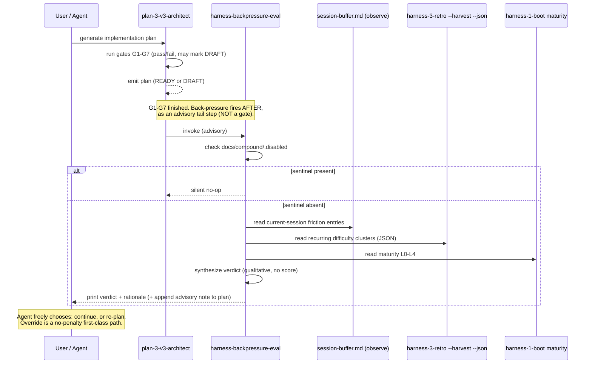

# Workshop: harness-backpressure-eval skill

**Type**: State Machine / Integration Pattern
**Plan**: 024-harness-nucleus
**Spec**: [../harness-nucleus-spec.md](../harness-nucleus-spec.md)
**Created**: 2026-05-28
**Status**: Draft

**Value Thesis**: This workshop makes the future plan-025+ extraction track cheaper and safer by narrowing the design space for a net-new skill before any code exists — it decides where back-pressure fires, what signals it reads, and what advisory verdict it emits, so the implementer does not re-litigate the auto-fire-vs-invoke and G8-gate questions under time pressure.
**Target Proof Level**: Preferred Direction
**Current Proof Level**: Decision Space

**Selected Value Axes**:
- **Learning Compounding**: Back-pressure is the Improve stage made active — it closes the loop the other three skills feed, turning accumulated difficulty into a re-plan signal instead of a write-only ledger.
- **Knowability**: It makes hidden risk explicit — "you have three recurring blocking difficulties clustered on this plan's domain" is a fact the agent currently never surfaces mid-plan.
- **Safety to Change**: An advisory verdict lets a plan slow down or re-plan before sinking implementation effort into a path the ledger already flagged as friction-heavy.
- **Agent Readiness**: The verdict + rationale is shaped so an agent (or human) can act on it with no further clarification — proceed, proceed-with-caution, or re-plan-recommended.

**Related Documents**:
- [001-new-repo-extraction.md](./001-new-repo-extraction.md) — repo boundary (where this skill ultimately lives)
- [002-cli-extension-architecture.md](./002-cli-extension-architecture.md) — the CLI verb that would invoke this evaluator (deferred there; treat back-pressure as the worked example of a CLI extension)
- [004-formalize-domains.md](./004-formalize-domains.md) — domain registry (the cluster `target` field maps to domains)

**Domain Context**:
- **Primary Domain**: harness (the loop family) — this is the Improve-stage member of `harness-1-boot` / `harness-2-observe` / `harness-3-retro`
- **Related Domains**: compound (reads the ledger + buffer), sdd-pipeline (the optional G8 advisory note attaches to a plan-3 plan)

---

## Purpose

This workshop explores a net-new skill, `harness-backpressure-eval`, that reads accumulated friction (the observe buffer + the harvested retro ledger + boot's maturity report) and emits an **advisory verdict** — proceed / proceed-with-caution / re-plan-recommended — telling the agent whether the current plan looks too risky or complex to continue as-is. It drives one decision for the plan-025+ extraction track: where back-pressure fires (user-invoked / auto-fire-after-plan-3 / soft G8 gate) and whether it earns a gate slot.

## Fresh Entrant Outcome

A fresh human or agent should be able to use this workshop to reach **Preferred Direction** with no additional context.

They should be able to:

- Name the exact signal fields the evaluator reads (entry `kind`, `severity`, `target`, `system.compound.status`, harvest cluster recurrence, boot maturity L0–L4) and where each comes from.
- Describe the three-value advisory verdict as a state-machine output, and why none of them is a hard block.
- Choose the firing location (the recommendation: auto-fire advisory note after plan-3, NOT a blocking G8) and state the rejected alternatives + why.
- Explain how this is the Improve stage closing the Boot → Observe → Retro loop.

## Key Questions Addressed

- (a) Does it auto-fire (after planning? before implementation?) or is it user-invoked?
- (b) Should it add a new G8 gate in `plan-3-v3-architect`'s gate matrix (currently G1–G7)?
- What signals does it read, and what advisory verdict does it emit — without any numeric compliance threshold or hard block?

---

## Value Frame

| Field | Selection | Why It Matters |
|-------|-----------|----------------|
| Target Proof Level | Preferred Direction | The extraction track needs a recommended firing model + rejected alternatives, not a buildable spec. Implementation Ready is explicitly out of scope. |
| Primary Value Axis | Learning Compounding | This is the loop-closing skill; without it the ledger is write-only and the Improve stage stays passive. |
| Supporting Value Axes | Knowability, Safety to Change, Agent Readiness | Makes accumulated risk visible, lets a plan re-plan early, and gives an actionable verdict. |
| Downstream Loop Improved | Planning + Implementation | A plan author / implementer sees "the ledger already flagged friction here" before committing effort. |

## Evidence Ledger

| Evidence | Location | Supports | Status |
|----------|----------|----------|--------|
| Signal field inventory (kind / severity / target / status / maturity) | § Input Signals | What the evaluator may read | Draft |
| Verdict state machine + States/Transitions/Events tables | § State Machine | Advisory-only verdict shape | Draft |
| Firing-location options table + recommendation | § Decision Space | Q(a) + Q(b) resolution | Draft |
| Sequence diagram for the recommended firing point | § Integration Pattern | Where it fires in the SDD pipeline | Draft |
| Best-effort / no-hard-gate constraint honored throughout | § Non-Negotiable Constraint | The single most important framing | Ready |
| Open questions for the implementer | § Open Questions | Deferred decisions | Draft |

## Non-Negotiable Constraint (read this first)

The compound + harness system is **best-effort / vibe-driven** (Critical Finding 04: exactly one retro in the live ledger; user memory `feedback_compound_best_effort.md`: no compliance gates). Therefore:

- **Back-pressure is ADVISORY signal, never a hard gate.** It prints a verdict + rationale and returns. It never blocks plan-3, never fails a build, never refuses to proceed.
- **No numeric compliance threshold.** The verdict is reasoned from the SHAPE of accumulated friction (recurrence, severity words, clustering on the plan's target), not from a score crossing a line. There is no "≥3 blocking difficulties = halt" rule. The evaluator describes what it sees in human-readable prose and recommends a posture.
- **No on-disk derived state** (KISS, PL-07, `feedback_kiss_information_over_ceremony.md`). The evaluator computes its view at read time and prints to terminal. It does NOT write a `_BACKPRESSURE.md` index, score file, or rollup.
- **Honors the opt-out sentinel.** If `docs/compound/.disabled` exists, the evaluator silently no-ops like every other harness/compound skill.

Every section below is written to honor this. If any later reader feels tempted to add a threshold or a blocking gate, that is the design going wrong.

---

## Overview

The harness loop is **Boot → Do Work → Observe → Retro → Improve**. Today the first four stages have homes:

| Loop stage | Skill | Writes / Reads |
|------------|-------|----------------|
| Boot | `harness-1-boot` | reads `engineering-harness.md`; reports maturity L0–L4 + UNAVAILABLE |
| Observe | `harness-2-observe` | appends entries to `docs/compound/_buffers/<agent>.session-buffer.md` |
| Retro (drain) | `harness-3-retro --drain` | drains buffer → `.retro.md`; `[s/t/p/e/d/a]` menu |
| Retro (harvest) | `harness-3-retro --harvest` | clusters + ages + ranks `.retro.md` ledger; emits `--json` |
| **Improve** | **(none today)** | **— this is the gap `harness-backpressure-eval` fills** |

"Improve" currently means a human reading the harvest output and choosing to encode a fix. Back-pressure makes Improve **active at the front of the next loop**: instead of only recording difficulty, the harness reads accumulated difficulty and advises the agent to slow down or re-plan when the signal warrants. It is the read-side counterpart to observe's write-side — same ledger, opposite direction.

## Input Signals

The evaluator is a pure reader. It reads three sources and never mutates them.

### Signal 1 — the observe session-buffer (current-session friction)

Path: `docs/compound/_buffers/<agent>.session-buffer.md` (FROZEN path). Each entry conforms to the universal retro entry shape (`skills/compound/schemas/retro.schema.json` → `$defs/Entry`). Relevant fields:

| Field | Schema location | How back-pressure reads it |
|-------|-----------------|---------------------------|
| `kind` | `Entry.kind` enum | Counts `difficulty` and `confusion` as friction; `magic-wand` as latent-wish signal; `insight` / `gift` as neutral-to-positive. |
| `severity` | `Entry.severity` enum (`blocking` / `degrading` / `annoying`) | A `blocking` difficulty in the live buffer is the strongest single signal. Read as a WORD, not a number. |
| `target` | `Entry.target` (free text; conventional `project`/`tooling`/`plan`/`skill`/...) | If friction clusters on the same `target` as the current plan's domain, that is a focused-risk signal. |
| `description` | `Entry.description` | Quoted verbatim into the rationale so the verdict is explainable. |

### Signal 2 — the harvested retro ledger (recurring / historical friction)

Source: `harness-3-retro --harvest --json` (FROZEN JSON shape: must preserve `harness.maturity` / `harness.verdict` / `harness.boot_ms` paths per Critical Finding 02). The evaluator consumes harvest's already-computed clusters rather than re-globbing `.retro.md` itself — harvest owns clustering + aging.

| Signal | Source field | Reading |
|--------|--------------|---------|
| Recurring difficulty | a harvest cluster with >1 member sharing `kind=difficulty` | Recurrence (the same friction across multiple retros) is the dominant historical signal — "we keep hitting this." |
| Open vs encoded | `system.compound.status` (`open` / `encoded` / `wontfix` / `stale`) | `open` recurring difficulties weigh more than `encoded` ones (the latter already have a fix). |
| Cluster target | cluster's shared `target` | Same overlap test as Signal 1 — does recurring friction sit on the current plan's domain? |

### Signal 3 — boot's reported maturity (harness capability ceiling)

Source: `harness-1-boot`'s maturity report, L0–L4 (`engineering-harness.md` § Maturity Assessment):

| Maturity | Meaning | Back-pressure reading |
|----------|---------|----------------------|
| L0 | No harness | The agent cannot observe its own changes — a complex plan at L0 is inherently higher-risk; nudge toward caution. |
| L1–L2 | Manual / auto boot + API | Partial observability; weigh friction signals normally. |
| L3–L4 | Full interaction / self-healing | High observability; the harness can catch its own regressions, so the same friction is less alarming. |
| UNAVAILABLE | No harness doc | Treat like L0 for advisory purposes; never error. |

**Synthesis (qualitative, NOT scored)**: the evaluator forms a verdict by reasoning over the SHAPE — "is there recurring open blocking difficulty on this plan's target, and is the harness too immature to catch the resulting regressions?" — and writes that reasoning as prose. There is deliberately no formula.

## State Machine

The loop with the back-pressure transition added. Back-pressure is the **Improve** node; its advisory verdict feeds back into Plan or Do-Work without ever forcing the transition.

```mermaid
stateDiagram-v2
    [*] --> Boot
    Boot --> DoWork: harness healthy / maturity reported
    DoWork --> Observe: friction encountered
    Observe --> DoWork: entry appended to buffer (silent)
    DoWork --> Retro: session end / FINAL
    Retro --> Improve: ledger drained + harvested
    Improve --> Evaluate: harness-backpressure-eval reads signals

    state Evaluate {
        [*] --> Reading
        Reading --> Proceed: friction low / not clustered
        Reading --> ProceedWithCaution: notable friction, advisory only
        Reading --> ReplanRecommended: recurring open blocking friction on plan target
    }

    Proceed --> DoWork: continue as planned
    ProceedWithCaution: advisory note printed; agent continues
    ProceedWithCaution --> DoWork: agent acknowledges, continues
    ReplanRecommended: advisory note printed; agent MAY re-plan
    ReplanRecommended --> Plan: agent CHOOSES to re-plan (never forced)
    ReplanRecommended --> DoWork: agent overrides, continues (allowed)
    Plan --> Boot

    note right of Evaluate
        Advisory only. Every verdict
        returns control to the agent.
        No state is terminal/blocking.
    end note
```

### States

| State | Description | Entry Condition | Valid Transitions |
|-------|-------------|-----------------|-------------------|
| Boot | Session-start health check + maturity report | Session start | DoWork |
| DoWork | Agent doing planned work | Harness healthy | Observe, Retro |
| Observe | Silent friction capture to buffer | Friction encountered | DoWork |
| Retro | Drain + harvest the ledger | Session end / FINAL | Improve |
| Improve | The loop-closing stage; invokes the evaluator | Ledger harvested | Evaluate |
| Evaluate.Reading | Evaluator reads the 3 signals | Improve entered | Proceed, ProceedWithCaution, ReplanRecommended |
| Proceed | Verdict: friction low — continue | Low / unclustered friction | DoWork |
| ProceedWithCaution | Verdict: notable friction — advisory caution | Notable but non-recurring friction | DoWork |
| ReplanRecommended | Verdict: recurring open blocking friction on the plan's target | Strong friction shape | Plan (agent's choice), DoWork (override) |

### Transitions

| From | To | Trigger | Guard | Action |
|------|-----|---------|-------|--------|
| Improve | Evaluate.Reading | back-pressure invoked | `docs/compound/.disabled` absent | read buffer + harvest JSON + boot maturity |
| Reading | Proceed | signals synthesized | friction sparse / off-target | print "proceed" verdict + one-line rationale |
| Reading | ProceedWithCaution | signals synthesized | notable but non-recurring friction | print caution verdict + quoted friction descriptions |
| Reading | ReplanRecommended | signals synthesized | recurring `open` `blocking` difficulty clustered on plan target, esp. at low maturity | print re-plan-recommended verdict + cluster evidence |
| ProceedWithCaution | DoWork | agent reads note | none | agent continues (advisory acknowledged) |
| ReplanRecommended | Plan | agent decides | none — agent's free choice | agent re-enters planning |
| ReplanRecommended | DoWork | agent overrides | none — override always allowed | agent continues; no penalty, no record |

**Critical**: every transition out of a verdict state is agent-driven, never forced. `ReplanRecommended → DoWork` (override) is a first-class, no-penalty path. That is what "advisory" means structurally.

### Events

| Event | Payload | Triggered By |
|-------|---------|--------------|
| `evaluate` | `{plan_target?, agent}` | Improve stage / user / plan-3 (depending on firing model) |
| `verdict` | `{level: proceed\|proceed-with-caution\|re-plan-recommended, rationale, evidence[]}` | the evaluator (printed to terminal) |
| `disabled-noop` | `{}` | sentinel present → silent return |
| `signals-empty` | `{}` | empty buffer + no clusters → defaults to `proceed` with "no accumulated friction" rationale |

## Verdict (the advisory output)

The verdict is the state-machine output — three human-readable levels, each with a rationale and quoted evidence. It is printed to the terminal and is the entire product of the skill (no file written).

```
$ harness-backpressure-eval            # (illustrative; CLI verb deferred to workshop 002)

Back-pressure: PROCEED-WITH-CAUTION

Why:
  - 2 'degrading' difficulties in the current session buffer target 'tooling'
    ("sync-to-dist drifted again", "doctor-skills false-positive on symlinks").
  - Harvest shows 1 recurring open difficulty cluster on target 'skill' (2 retros)
    — not on this plan's target, so weighted lower.
  - Harness maturity L1 (manual boot + API): partial observability.

Recommendation:
  Proceed, but watch the tooling friction — if a 3rd tooling difficulty lands,
  consider a tooling-stabilisation pass before more feature work. Advisory only.
```

| Verdict | Meaning | Typical signal shape |
|---------|---------|----------------------|
| `proceed` | Nothing in the ledger argues against continuing | Empty/sparse buffer; no recurring difficulty; or friction off the plan's target |
| `proceed-with-caution` | Notable friction worth naming, not worth re-planning | Several degrading/annoying entries, or one blocking entry not yet recurring |
| `re-plan-recommended` | The ledger has been telling you this path is hard | Recurring `open` `blocking` difficulty clustered on the plan's `target`, amplified by low maturity (L0/L1/UNAVAILABLE) |

There is no fourth "halt" verdict by design. The strongest thing the harness ever says is "re-plan recommended."

## Decision Space

The two key questions resolve here: (Q-a) auto-fire vs user-invoked, and (Q-b) the G8 gate question.

| Option | Description | Pros | Cons | Decision |
|--------|-------------|------|------|----------|
| **A — User-invoked only** | A standalone skill/CLI verb the agent or human runs on demand (e.g. mid-plan when something feels off). | Maximally best-effort; zero pipeline coupling; honors "vibe-driven" purely. Easiest to extract to the new repo. Never surprises anyone. | Almost never runs (the one-retro ledger shows the system is barely used; nobody will think to invoke it). The Improve stage stays effectively dormant. | **Rejected as the SOLE model** — kept as an always-available manual entry point alongside B. |
| **B — Auto-fire advisory note after plan-3 architecture** | After `plan-3-v3-architect` emits the plan, the evaluator runs and appends a short advisory note (the verdict + rationale) to the plan, or prints it to terminal. Non-blocking; plan-3 finishes regardless. | Fires at the moment back-pressure is most useful — right when a plan is freshly drafted and re-planning is cheapest. Surfaces accumulated friction without anyone remembering to ask. Stays advisory (a note, not a gate). | Light coupling to plan-3's tail; must be careful the note is clearly advisory and never reads like a failed check. | **PREFERRED** |
| **C — Soft "G8" advisory gate inside plan-3-v3-architect** | Add a G8 row to plan-3's gate matrix (G1–G7 today). Unlike G1–G7 (which can mark a plan DRAFT/UNRESOLVED), G8 would ONLY ever emit an advisory `note`, never `READY`-blocking. | Discoverable (lives in the documented gate matrix); reuses plan-3's existing inline-gate machinery. | Gates G1–G7 are pass/fail and can hold a plan at DRAFT. Putting back-pressure in the same matrix invites future readers to "promote" it to blocking — directly violating the best-effort/no-hard-gate constraint (CF-05 vocabulary fragility shows how easily framing drifts). A gate that never blocks is also confusing next to seven that do. | **Rejected** — too easy to mistake for / mutate into a hard gate. |

### Preferred Direction

**Recommend Option B (auto-fire advisory note after plan-3) as the primary model, with Option A (manual invoke) retained as an always-available entry point. Reject Option C (the G8 gate).**

Rationale:
- B fires where re-planning is cheapest (fresh plan) and solves A's fatal flaw (nobody invokes it) while staying strictly advisory — it appends a note, it does not gate.
- A alone leaves the Improve stage dormant given the barely-used ledger (Critical Finding 04), but A is free to keep as a manual override, so we keep it.
- C is rejected specifically to protect the most important constraint: back-pressure must never be confused with a blocking gate. Keeping it OUT of the G1–G7 matrix is the structural guarantee. The answer to Q(b) is **no — do not add a G8 gate.**

This keeps the firing model consistent with best-effort: advisory, discoverable at the natural moment, manually re-runnable, never blocking.

## Integration Pattern

Where Option B fires in the SDD pipeline. The evaluator is invoked at the tail of plan-3, reads the three file-based signals, and prints/appends an advisory verdict. plan-3 completes on its own schedule regardless of the verdict.



**File-based integration (DE-03)**: like the rest of the family, the evaluator communicates only through files — it reads the buffer, reads harvest's JSON, reads the maturity doc. No direct skill-to-skill call. This keeps it portable to the new repo (workshop 001) and trivially wrappable by a CLI verb (workshop 002).

**Pipeline placement summary**:

| Hook point | Fires? | Why |
|------------|--------|-----|
| After `plan-3-v3-architect` emits a plan | Yes (Option B) | Re-planning is cheapest on a fresh plan; the natural Improve moment. |
| Before implementation (`plan-6`) | Optional re-run | A second advisory read is fine, but the post-plan-3 read is the primary one. |
| On-demand (`plan-X --backpressure` or CLI verb) | Yes (Option A retained) | Manual override for mid-plan "this feels off" moments. |
| Inside the G1–G7 gate matrix | **No** | Rejected (Option C) to keep back-pressure structurally non-blocking. |

## Attention Reduction

| Future Loop | Before Workshop | After Workshop |
|-------------|-----------------|----------------|
| Planning (plan-3 tail) | Author cannot see that the ledger already flagged recurring friction on this domain | An advisory verdict names recurring/open/blocking friction at plan time, when re-planning is cheap |
| Implementation | Friction is write-only — recorded but never read back as a "should we proceed?" signal | The Improve stage reads it and advises proceed / caution / re-plan |
| Extraction track (plan-025+) | Open question OQ7: auto-fire? G8 gate? unresolved | Resolved direction (Option B + retained A; G8 rejected) with rationale + rejected alternatives |
| Agent execution | Agent has no structured "back-pressure" concept | Three-value verdict + rationale an agent can act on with no clarification |

## How This Is the "Improve" Stage

The other three skills are net producers/recorders into the ledger:

- `harness-1-boot` reports the harness's capability ceiling (maturity).
- `harness-2-observe` writes friction silently as it happens.
- `harness-3-retro` drains + harvests friction into the durable, clustered ledger.

All three feed the ledger; none of them reads it back to influence the *next* decision. `harness-backpressure-eval` is the **only consumer that closes the loop** — it reads the accumulated signal and turns it into forward advice. That is precisely the "Improve" arc in Boot → Do Work → Observe → Retro → **Improve**: the harness stops merely recording difficulty and starts *responding* to it, by recommending a slower or re-planned path when the evidence warrants. Critically, it improves by *advising*, never by *enforcing* — consistent with the best-effort nature of the whole system.

## Validation / Acceptance

This workshop reaches its target proof level (Preferred Direction) when:

- The three input signals are named with concrete schema fields (`kind`, `severity`, `target`, `system.compound.status`, harvest clusters, maturity L0–L4) — done in § Input Signals.
- The advisory verdict is expressed as a state-machine output with three non-blocking levels and an explicit no-penalty override path — done in § State Machine + § Verdict.
- Q(a) and Q(b) are answered with a recommended direction AND recorded rejected alternatives — done in § Decision Space (B preferred + A retained; C/G8 rejected).
- The best-effort / no-hard-gate / no-numeric-threshold / no-derived-state constraints are honored in every section — asserted in § Non-Negotiable Constraint and threaded throughout.
- It explicitly does NOT claim Implementation Ready — confirmed; firing-model details, exact verdict-rendering, and CLI surface are left to the implementer and workshop 002.

## Open Questions

### Q1: Where does the advisory note get written under Option B — appended to the plan file, or terminal-only?

**OPEN**: Terminal-only is the KISS-purest (no file mutation, no derived state). Appending a short note to the plan makes it durable and reviewable but edges toward "writing derived state." Lean terminal-only with an *optional* one-line note in the plan's existing `## Open Questions` or a clearly-labelled advisory line. Defer to the implementer.

### Q2: What exactly counts as "the current plan's target" for the clustering-overlap test?

**OPEN**: Needs the domain registry (workshop 004). Until domains are formalized, the evaluator can fall back to a free-text match between the plan slug / folder and the entry `target` field. Cross-reference workshop 004.

### Q3: Does the evaluator re-run at plan-6 (pre-implementation), or only post-plan-3?

**OPEN**: Post-plan-3 is the primary fire (Option B). A pre-implementation re-run is harmless and cheap but risks alert-fatigue on a barely-used system. Lean post-plan-3 only for v1; revisit if usage grows.

### Q4: How does it behave when harvest JSON is empty or the buffer is empty (the common case today — one retro total)?

**RESOLVED**: Defaults to `proceed` with rationale "no accumulated friction." The `signals-empty` event in § Events covers this — an empty ledger is the expected default state, not an error.

### Q5: Should the CLI verb be `harness backpressure` or `harness eval` or a flag on another verb?

**OPEN**: Deferred to workshop 002 (CLI + extension architecture). This workshop only establishes that the evaluator is invoke-able both automatically (post-plan-3) and manually; the verb name is a CLI concern.
