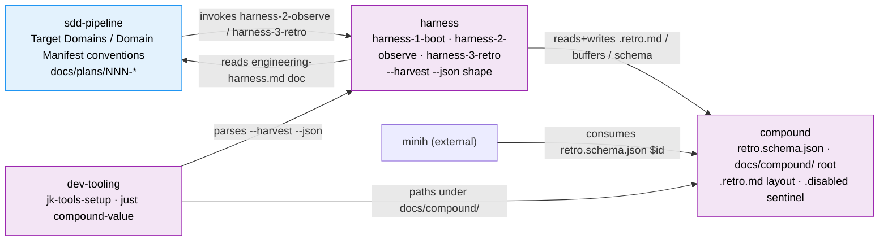

# Workshop: Formalize harness + compound as registered domains

**Type**: Other (domain extraction)
**Plan**: 024-harness-nucleus
**Spec**: [../harness-nucleus-spec.md](../harness-nucleus-spec.md)
**Created**: 2026-05-28
**Status**: Draft

**Value Thesis**: This workshop makes the eventual plan-025+ extraction track cheaper and safer by mapping the harness/compound boundaries and contracts up front, and by resolving — before any file is written — whether the SDD pipeline's `docs/domains/` registry machinery is worth instantiating for a 4-domain repo or whether KISS wins. It converts a latent "should we?" into a recorded direction with rejected alternatives.
**Target Proof Level**: Preferred Direction
**Current Proof Level**: Decision Space

**Selected Value Axes**:
- **Cross-Domain Coordination**: the whole point is to make the harness/compound/sdd-pipeline boundaries and the contracts that cross them explicit, so a future extraction PR knows exactly what it is cutting.
- **Learning Compounding**: records the registry decision (and the rejected alternatives) so plan-025+ does not re-litigate "do we need docs/domains/ here?" from scratch.
- **Knowability**: surfaces the hidden fact that the SDD skills *reference* a registry that was never instantiated in this repo — the machinery exists but the data does not.
- **Safety to Change**: by enumerating frozen contracts as domain-boundary outputs, it reduces the chance an extraction silently breaks a cross-system consumer (minih, the 8 SDD skills, the tooling).

**Related Documents**:
- [001 — repo boundary / new-repo extraction](./001-new-repo-extraction.md) *(sibling; repo split is designed there, not here)*
- [002 — CLI + extension architecture](./002-cli-extension-architecture.md) *(sibling; CLI verb surface is designed there)*
- [003 — harness-backpressure-eval / backpressure](./003-harness-backpressure-eval.md) *(sibling; the net-new measurement skill is designed there)*
- [../harness-nucleus-spec.md § Target Domains](../harness-nucleus-spec.md) — the 4 proposed-but-unregistered boundaries
- [../research-dossier.md § Domain Context](../research-dossier.md) — DB-01, DB-08, the 5 natural boundaries
- [`skills/SDD/plan-v2-extract-domain/SKILL.md`](../../../../skills/SDD/plan-v2-extract-domain/SKILL.md) — the skill that writes registry.md / domain-map.md / domain.md; the format proposed here is grounded in what it produces and reads

**Domain Context** (proposed, none registered today):
- **Primary Domains**: `harness` (the loop family) + `compound` (the ledger substrate) — both **proposed-but-unregistered**
- **Related Domains**: `sdd-pipeline` (existing-implicit; the 8 consumer skills), `dev-tooling` (existing-implicit; justfile + scripts + mirror)

---

## Purpose

Explore whether the plan-025+ extraction track should instantiate the SDD pipeline's `docs/domains/` registry (registry.md + domain-map.md + per-domain domain.md) to formally register `harness` and `compound` as named domains — and if so, in what minimal shape. This is an exploratory decision-space document, not an implementation spec. It recommends a direction and records what was rejected and what stays open.

## Fresh Entrant Outcome

A fresh human or agent should be able to use this workshop to reach **Preferred Direction** with no additional context.

They should be able to:

- See the proposed `harness` / `compound` / `sdd-pipeline` / `dev-tooling` boundaries with Owns / Excludes / Contracts-exposed / Depends-on for each, and a domain-map mermaid diagram of the contract edges between them.
- Understand the three registry options (full registry / registry-free / lightweight map-only), their pros and cons, and which direction this workshop recommends and why.
- See a concrete sample `domain.md` skeleton for the `harness` domain, so "what registration would look like" is no longer abstract.
- Know which questions are deliberately deferred (repo split → 001, CLI → 002, backpressure → 003) and which remain open for plan-025+.

## Key Questions Addressed

- **(a)** Should the extraction track introduce the domain registry at all, given the repo has none today and the user strongly prefers source-of-truth over ceremony / derived files?
- **(b)** Are per-`domain.md` Concept tables worth the overhead for these two domains?
- (context) What ARE the boundaries and contract edges, regardless of whether they get written to disk?

---

## Value Frame

| Field | Selection | Why It Matters |
|-------|-----------|----------------|
| Target Proof Level | Preferred Direction | plan-025+ needs a recommended direction + rejected alternatives, not a built registry. Building it now would be premature — extraction timing (OQ4) is itself deferred. |
| Primary Value Axis | Cross-Domain Coordination | The contract edges between harness/compound/sdd-pipeline ARE the thing an extraction PR cuts; naming them is the core value even if no file is written. |
| Supporting Value Axes | Learning Compounding, Knowability, Safety to Change | Record the registry decision once; surface the referenced-but-uninstantiated registry; enumerate frozen contracts so extraction does not break them. |
| Downstream Loop Improved | plan-025+ extraction track (planning + the eventual deletion/extraction PR) | The boundary tables + frozen-contract list become the extraction checklist; the registry decision is pre-made. |

## Evidence Ledger

| Evidence | Location | Supports | Status |
|----------|----------|----------|--------|
| 4 boundary tables (harness / compound / sdd-pipeline / dev-tooling) | § Domain Boundaries | Cross-domain coordination; the extraction cut surface | Draft |
| Domain-map mermaid (nodes + labeled contract edges) | § Proposed Domain Map | Knowability; visual of which contracts cross which boundary | Draft |
| Decision Space table (A full / B registry-free / C map-only) | § Decision Space | Question (a) — recommendation + rejected alternatives | Draft |
| Concept-table cost/benefit for 2 domains | § Decision: Concept Tables | Question (b) | Draft |
| Sample `harness` domain.md skeleton | § Sample domain.md Skeleton | "what registration looks like" concretely | Draft |
| Frozen-contract list (carried from spec § Non-Goals + dossier IC table) | § Frozen Contracts Recap | Safety to change; do-not-break list for extraction | Ready (sourced) |
| `plan-v2-extract-domain/SKILL.md` registry/map/domain formats | external skill | grounding the proposed format in what skills actually read | Ready (sourced) |

## Boundary Disclaimer

This workshop is **Decision Space → Preferred Direction**. It is **NOT Implementation Ready**. It does not:

- create `docs/domains/` or any file in it;
- decide extraction timing (OQ4 — deferred to plan-025+);
- design the repo split (→ workshop 001), the CLI verb surface (→ 002), or the backpressure skill (→ 003).

The boundaries below are a **communication artifact** — names and contracts that hold whether or not they are ever written to a registry. Per `plan-v2-extract-domain`, "this is about communication and traceability, not refactoring" — no files move regardless of the option chosen.

---

## Proposed Domain Boundaries

Four domains emerge from the post-plan-024 structure. `harness` and `compound` are the two this workshop proposes to register; `sdd-pipeline` and `dev-tooling` are noted as adjacent existing-implicit domains for map completeness (they would be registered lazily, only if a future plan touches them — brownfield adoption per `plan-v2-extract-domain`).

### Domain: harness (the loop family)

| Aspect | Detail |
|--------|--------|
| **Type** | infrastructure (cross-cutting; serves the SDD pipeline, owns no business capability) |
| **Owns** | `skills/harness/{harness-1-boot,harness-2-observe,harness-3-retro}/` (post-024); the Boot → Observe → Retro loop semantics; the 5 inline-distributed principles; the `--drain` / `--harvest` retro modes; the `--harvest --json` output shape (`harness.maturity` / `harness.verdict` / `harness.boot_ms`) |
| **Excludes** | the ledger storage layout + retro wire format (→ `compound`); the SDD phase/plan/task vocabulary (→ `sdd-pipeline`); the `engineering-harness.md` governance-doc *authoring/scaffold* (→ the user's separate setup effort, NOT a domain here); the install/MCP plumbing (→ `dev-tooling`) |
| **Contracts exposed** | (1) skill slugs `harness-1-boot` / `harness-2-observe` / `harness-3-retro` invoked by 8 SDD skills; (2) `--harvest --json` shape consumed by `scripts/compound-value.sh`; (3) reads `docs/project-rules/engineering-harness.md` via the 3-deep fallback chain (consumer-side, not a producer contract) |
| **Depends-on** | `compound` (reads/writes the ledger + buffers + schema); `engineering-harness.md` doc (read-only, with graceful `UNAVAILABLE`) |

### Domain: compound (the ledger substrate)

| Aspect | Detail |
|--------|--------|
| **Type** | infrastructure (cross-cutting data substrate; shared with minih) |
| **Owns** | `skills/compound/schemas/` (universal retro schema + `system.*` schemas + fixtures); `docs/compound/` runtime tree root (`_buffers/`, `agents/`, `.disabled` sentinel); the `.retro.md` wire format + path layout; the `[s/t/p/e/d/a]` action-menu letters |
| **Excludes** | the loop-stage skill *behaviour* that reads/writes the ledger (→ `harness`); any rollup/index files (KISS — none exist, none proposed); legacy `docs/retros/` migration logic (dropped to the setup effort per spec § Non-Goals) |
| **Contracts exposed** | (1) `retro.schema.json` `$id` + path — cross-system with minih + future `@ai-substrate/retro-schema` npm; (2) `docs/compound/` tree path root — 9+ producers/consumers hard-code it; (3) `.retro.md` path layout; (4) `.disabled` sentinel path; (5) action-menu letters (user-facing) |
| **Depends-on** | nothing in-repo (leaf substrate; zero dependency on SDD or harness skill bodies — the dependency is one-directional: harness → compound) |

### Adjacent: sdd-pipeline (existing-implicit; not proposed for registration here)

| Aspect | Detail |
|--------|--------|
| **Type** | business (the user-facing planning capability) |
| **Owns** | `skills/SDD/plan-*` + research/tutorial skills; `docs/plans/NNN-*/` folders; phase / task / plan-ordinal / flightplan vocabulary |
| **Excludes** | the harness loop skills; the compound substrate |
| **Contracts exposed** | the `## Target Domains` + `## Domain Manifest` spec/plan section conventions; `docs/plans/NNN-*/` folder layout |
| **Depends-on** | `harness` (invokes the 3 loop skills via 8 `## Compound integration` appendices); `compound` indirectly (the harness skills it invokes touch the ledger) |

### Adjacent: dev-tooling (existing-implicit; not proposed for registration here)

| Aspect | Detail |
|--------|--------|
| **Type** | infrastructure |
| **Owns** | `setup.sh`, `install/`, `setup_manager.py`, `src/jk_tools/` mirror, `justfile`, `scripts/` |
| **Excludes** | skill content (read-only consumer of slugs/JSON) |
| **Contracts exposed** | `jk-tools-setup` CLI; `just compound-value` recipe; the sync-to-dist mirror |
| **Depends-on** | `harness` (`scripts/compound-value.sh` parses `--harvest --json`); `compound` (paths) |

## Proposed Domain Map

Nodes show slug + the key contracts each domain exposes; edges are labeled with the contract that crosses the boundary. This is the diagram that would land in `docs/domains/domain-map.md` *if* a registry is introduced — and is a useful communication artifact even if it never does.



Note the key asymmetry (dossier DB-04/DB-05): `compound` is a leaf — it depends on nothing in-repo. `harness` depends only on `compound`. The `sdd-pipeline → harness` edges are the soft references (skill slugs) that an extraction must schematize. `minih` consumes the `compound` schema cross-repo.

---

## Decision Space

### Question (a): introduce the registry at all?

| Option | Description | Pros | Cons | Decision |
|--------|-------------|------|------|----------|
| **A — Full registry now** | plan-025+ instantiates `docs/domains/registry.md` + `domain-map.md` + per-domain `domain.md` for harness + compound (and likely sdd-pipeline + dev-tooling for map coherence). | SDD skills' `## Target Domains` / `## Domain Manifest` machinery finally has data to read; plan-7 domain-compliance gate becomes real; new contributors get a one-glance topology. | Heavy ceremony for a 4-domain repo with one effective author; registry.md is a **derived rollup** of facts already in the spec § Target Domains + dossier — exactly the `_INDEX.md`-style artifact the user rejected (PL-07, `feedback_kiss_information_over_ceremony.md`); 4+ files to keep in sync; brownfield-adoption guidance says register lazily, not big-bang. | **Rejected** |
| **B — Stay registry-free (KISS)** | No `docs/domains/`. Keep domains implicit. This workshop's boundary tables + map ARE the communication artifact, living in the plan folder where they were reasoned out. | Zero ceremony; no derived/rollup files to drift; matches today's reality (SDD skills already no-op gracefully when the registry is absent — confirmed: every plan-* skill guards reads with "if `docs/domains/registry.md` exists"); honours PL-07 + the user's source-of-truth-over-ceremony stance; the spec already carries a `## Target Domains` table per feature, which is the right granularity. | The `## Domain Manifest` / plan-7 domain gate stay advisory rather than enforced; cross-cutting topology lives in a workshop, not a canonical home — a reader must know to look here. | **Recommended (primary)** |
| **C — Lightweight: map-only** | Introduce only `docs/domains/domain-map.md` (the mermaid topology), no registry.md, no per-domain domain.md. | One file, visual, low ceremony; gives a canonical home for the topology diagram; `plan-v2-extract-domain --list` reads it. | Still a derived artifact that can drift from specs; the SDD skills read `registry.md` first and treat map as secondary, so a map-without-registry is a half-instantiated state the skills don't fully expect; one file is cheap but it is still on-disk derived state. | **Rejected (acceptable fallback)** |

**Recommendation: Option B — stay registry-free.** Honest read of the evidence: the registry is a derived rollup of what the per-feature spec `## Target Domains` table + this workshop already express. For a repo with 4 domains and effectively one author, instantiating registry.md + domain-map.md + N×domain.md is ceremony that the user has explicitly rejected before (PL-07; the KISS reversal where derived-state files were tried and removed). The SDD skills are already written to degrade gracefully when `docs/domains/` is absent, so registry-free is not a broken state — it is the *designed* default. The boundary tables and map in this workshop give plan-025+ everything it needs to plan the extraction cut without a registry.

**When to revisit (the trigger that would flip to C, then A):** if the harness-nucleus is extracted to its own repo (workshop 001) AND that repo accrues enough domains (say, harness / compound / cli / extensions all become distinct) that a contributor cannot hold the topology in their head, introduce `domain-map.md` first (Option C) as the single canonical topology, and only escalate to the full registry if a domain-compliance gate is genuinely being enforced in review. Do not pre-build it.

### Question (b): Concept tables per domain.md?

The `domain.md` format (from `plan-v2-extract-domain` Step 3.5 + 4a) includes a `## Concepts` table — verb-phrase capabilities a consumer would search for, each with an entry point and a one-line description, plus per-concept usage snippets.

**Recommendation: not worth the overhead for these two domains — and moot under Option B.** Reasoning:

- A Concepts table earns its keep when a domain exposes *many* consumer-facing capabilities that someone would search for by name (e.g. an `auth` domain with "authenticate a user", "refresh a token", "check a permission"). `harness` exposes essentially **one** consumer-facing concept ("run the harness loop: boot → observe → retro") and `compound` exposes **one** ("read/write the retro ledger"). A Concepts table with one row is ceremony.
- The contracts these domains expose are already enumerated above (skill slugs, JSON shape, schema `$id`, paths) — that IS the consumer surface, and it lives in the boundary tables without needing a separate Concepts abstraction.
- Under the recommended Option B there is no `domain.md` at all, so the Concepts table does not arise. *If* a future repo escalates to Option A, the harness `domain.md` should carry a minimal 1–2 row Concepts table at most (see skeleton below), not a forced per-capability decomposition.

---

## Sample domain.md Skeleton (harness)

Shown so a reader sees concretely what registration would produce **if** Option A were ever chosen. This is illustrative — it is NOT created by this workshop. Format follows `plan-v2-extract-domain` § 4a (the locked required-sections set: Purpose, Concepts, Boundary, Contracts, Composition, Source Location, Dependencies, History). Concepts kept deliberately to one row per the (b) recommendation.

```markdown
# Domain: Harness

**Slug**: harness
**Type**: infrastructure
**Created**: <ISO-8601>
**Created By**: extracted from existing codebase (plan-024 family)
**Status**: active

## Purpose

Owns the engineering-harness feedback loop — Boot -> (Do Work) -> Observe ->
Retro -> Improve — as three loop-stage skills. The harness is the product:
every captured friction entry compounds value. Without it, the SDD pipeline
runs with no session-start health check and no friction-capture loop.

## Concepts

| Concept | Entry Point | What It Does |
|---------|-------------|--------------|
| Run the harness loop | harness-1-boot | Boot health-check at session start, silent observe during work, retro (--drain / --harvest) to capture and harvest friction |

### Run the harness loop

A consumer (an SDD plan-* skill or a human) boots the harness at session start
to get a maturity/verdict report, lets harness-2-observe silently capture
friction during work, then runs harness-3-retro --drain at session end and
--harvest at FINAL/merge to cluster and prioritise.

## Boundary

### Owns
- The Boot / Observe / Retro loop-stage skills and their semantics
- The --harvest --json output shape (harness.maturity / harness.verdict / harness.boot_ms)
- The 5 inline-distributed principles

### Does NOT Own
- The ledger storage + retro wire format -> compound domain
- The engineering-harness.md governance-doc authoring -> separate setup effort
- The SDD phase/plan/task vocabulary -> sdd-pipeline domain

## Contracts (Public Interface)

| Contract | Type | Consumers | Description |
|----------|------|-----------|-------------|
| harness-1-boot / harness-2-observe / harness-3-retro slugs | skill invocation | 8 SDD skills | Loop-stage skills invoked by name |
| harness-3-retro --harvest --json | JSON shape | scripts/compound-value.sh | Maturity/verdict/boot_ms paths (frozen) |

## Composition (Internal)

| Component | Role | Depends On |
|-----------|------|------------|
| harness-1-boot | Boot — health check + maturity report | engineering-harness.md (read), compound ledger (read) |
| harness-2-observe | Observe — silent friction producer | compound buffer (write) |
| harness-3-retro | Retro — drain + harvest | compound ledger + schema (read/write) |

## Source Location

Primary: `skills/harness/`

| File | Role | Notes |
|------|------|-------|
| skills/harness/harness-1-boot/SKILL.md | Boot | from engineering-harness-v2 VALIDATE+STATUS |
| skills/harness/harness-2-observe/SKILL.md | Observe | from compound-1-track |
| skills/harness/harness-3-retro/SKILL.md | Retro | merge of compound-2-bubble + compound-3-harvest |

## Dependencies

### This Domain Depends On
- compound (ledger, buffers, schema)
- engineering-harness.md doc (read-only, graceful UNAVAILABLE)

### Domains That Depend On This
- sdd-pipeline (invokes the 3 loop skills)
- dev-tooling (parses --harvest --json)

## History

| Plan | What Changed | Date |
|------|--------------|------|
| 024-harness-nucleus | Loop family consolidated from 6 compound+harness skills into 3 | 2026-05-28 |
| *(extracted)* | Domain formalized (hypothetical — only under Option A) | <today> |
```

---

## Frozen Contracts Recap

Whatever option is chosen, these MUST NOT be broken by any future registration or extraction (source: spec § Non-Goals + dossier § Cross-System Dependencies). They are domain-boundary outputs of `compound` and one consumer-side read in `harness`:

| Frozen Contract | Owning Domain | Why Frozen |
|-----------------|---------------|-----------|
| `docs/compound/` runtime path root | compound | 9+ producers/consumers + minih back-compat (IC-09) |
| `skills/compound/schemas/` location + `$id` | compound | v1-home commitment with minih + future npm pkg (IC-01/IC-08) |
| `.retro.md` wire format + path layout | compound | all consumers + cross-system (IC-02) |
| `docs/compound/.disabled` sentinel path | compound | 9+ consumers + user muscle memory |
| `[s/t/p/e/d/a]` action-menu letters | compound | user-facing (IC-06) |
| `engineering-harness.md` filename | (read by harness; authored by setup effort) | 8 SDD readers + 3-deep fallback chain (IC-07 / Critical Finding 03) |

## Attention Reduction

| Future Loop | Before Workshop | After Workshop |
|-------------|-----------------|----------------|
| plan-025+ planning | "Do we need docs/domains/ here? What are the boundaries?" reasoned from scratch | Registry decision pre-made (Option B), boundaries + map + frozen-contract list ready to lift into the extraction plan |
| Extraction PR (workshop 001) | Cut surface between repos rediscovered from the dossier | The 5 `sdd-pipeline → harness` slug edges + `minih → compound` schema edge are named as the contracts to schematize |
| Review | Reviewer reconstructs why no registry exists | "registry-free is the designed default; SDD skills no-op gracefully" recorded with rationale |
| Agent execution | Agent might "helpfully" scaffold docs/domains/ as ceremony | Explicit recommendation NOT to, with the revisit trigger spelled out |

## Validation / Acceptance

This workshop reaches its **Preferred Direction** target proof level when:

- Question (a) has a recommended direction (Option B — registry-free) with the two rejected alternatives (A full, C map-only) and their rationale recorded.- Question (b) has a recommendation (Concept tables not worth it for 2 single-concept domains; moot under B).- The four domain boundaries (harness / compound / sdd-pipeline / dev-tooling) each have Owns / Excludes / Contracts-exposed / Depends-on.- A domain-map mermaid with labeled contract edges exists, including the cross-system minih edge.- A concrete sample `harness` domain.md skeleton is present so registration is not abstract.- The frozen-contract list is recorded as a do-not-break boundary output.- Deferred items (repo split → 001, CLI → 002, backpressure → 003) and OQ4 extraction timing are cross-referenced, not designed here.
It explicitly does NOT claim Implementation Ready: no `docs/domains/` files are designed for creation, and the recommendation is in fact to not create them.

## Open Questions

- **OQ-A (deferred to plan-025+)**: If the harness-nucleus is extracted to its own repo (workshop 001), does that repo cross the complexity threshold that flips the recommendation from B to C (map-only)? Revisit at extraction time, not now.
- **OQ-B (deferred)**: If a domain-compliance gate is ever genuinely *enforced* in review (plan-7 today only advises), does that change the cost/benefit of a registry? Out of scope until such enforcement is proposed.
- **OQ-C (cross-ref, not for this workshop)**: How are the `sdd-pipeline → harness` slug edges schematized as a public contract surface across repos? → owned by workshop 001 (repo boundary / extraction).
