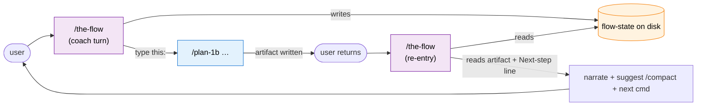

# Research Report: `the-flow` — a guided co-pilot for the SDD `plan-*` pipeline

**Generated**: 2026-05-29
**Research Query**: "A new skill `the-flow` that walks a user through the SDD flow documented in `getting-started.md`. Starts by asking what they want to do (input to `/plan-1a`), then hand-holds through the steps. Mostly the skills talk to one another; `the-flow` explains it — like a pro at the SDD plan flow sitting beside you. Suggests workshops after specify; suggests compaction at stage seams (after specify/before plan, after plan/before implement…). Research must include diagrams of how it works, the messages, and what gets called. Must have affordances for the harness, backpressure, and the full SDD flow."
**Mode**: Pre-Plan research (read-only)
**Location**: `docs/plans/026-the-flow/research-dossier.md`
**FlowSpace**: Not used (repo is small + skill-file focused; native tools sufficient)
**Findings**: 18

> **READ-ONLY RESEARCH** — no skill was created. This dossier feeds `/plan-1b`.

---

## Executive Summary

### What it would do
`the-flow` is a **guided orchestrator / co-pilot** for the existing `plan-*` SDD pipeline (`/plan-1a → 1b → [2c] → [2d] → 3 → 5 → 6 → 7 → 8`). It opens by asking the user what they want to build, treats that as the `/plan-1a` (or `/plan-1b`) input, and then walks them through the pipeline like an expert sitting beside them — narrating *why* each stage matters, surfacing the **optional** branches the raw pipeline only hints at (workshops, backpressure survey, context compaction), and pointing at the harness loop firing in the background.

### Why it would exist
The pipeline **already self-chains** (every skill ends with a `Next step: Run /plan-X` line — see Finding IA-03), but that chaining is *terse and mechanical*. A newcomer doesn't know: when a `/plan-2c` workshop is worth it, that `/plan-2d` backpressure survey exists, *when to `/compact`*, or what the purple harness prompts mean. `the-flow` is the **narration + judgement layer** on top of the mechanical chain. It is the conversational front-door equivalent of `getting-started.md`.

### The three load-bearing insights
1. **`the-flow` is NOT `sdd-tutorial`.** `sdd-tutorial` teaches the *RPIV / `task-*`* family (`/task-research`, `.copilot-tracking/`); `getting-started.md` and `the-flow` target the *`plan-*`* family (`docs/plans/`). Different command families, different artifact trees. `the-flow` is a real-work co-pilot, not a classroom lesson. (Finding PS-01 — **Critical**, easy to conflate.)
2. **Compaction forces re-entrancy.** The user wants `the-flow` to recommend `/compact` at stage seams. `/compact` is a Claude Code **built-in** (not a skill — Finding IA-05) and it *discards conversation context*. A single uninterrupted orchestrator conversation **cannot survive its own compaction advice**. Therefore `the-flow` must carry **durable on-disk state** and be **re-entrant**, exactly like the proven `sdd-tutorial` ↔ `sdd-tutorial-next` + `state.yaml` pattern (Finding PS-02 — **Critical**, this is the central architectural fork).
3. **Harness + backpressure are already wired into the pipeline.** `the-flow` doesn't *implement* them — it *surfaces* them at the right seams (Findings IC-01/IC-02). The harness loop auto-fires; `/plan-2d` already slots between spec and architect. `the-flow`'s job is to make these visible and explain them.

### Quick Stats
- **Closest precedent**: `sdd-tutorial` + `sdd-tutorial-next` (re-entrant, state-backed, coaching-voice). Reuse heavily.
- **Pipeline stages to narrate**: 9 (`1a, 1b, 2c, 2d, 3, 5, 6, 7, 8`) + 3 harness stages (boot, observe, retro).
- **New affordance the pipeline lacks today**: explicit `/compact` guidance at seams (Finding DE-01).
- **Domains**: No domain registry in this repo — skills ARE the product (matches prior plans 022–025).
- **Harness governance doc**: absent (`harness-1-boot` would report `UNAVAILABLE`) — expected for this repo.

---

## How the SDD pipeline currently works (the thing `the-flow` wraps)

### Entry points
| Entry point | Type | Location | Purpose |
|---|---|---|---|
| `/plan-1a` | research | `skills/SDD/plan-1a-v2-explore/SKILL.md` | optional deep codebase research → `research-dossier.md` |
| `/plan-1b` | spec | `skills/SDD/plan-1b-v3-specify-and-clarify/SKILL.md` | spec + front-loaded clarify → `<slug>-spec.md` (sets CS + Simple/Full) |
| `getting-started.md` | doc | `skills/SDD/sdd-tutorial/references/getting-started.md` | the canonical visual map `the-flow` is the conversational form of |

### Core execution flow (Finding IA-01)
The pipeline is a chain of single-purpose skills. Each produces an artifact in `docs/plans/<ordinal>-<slug>/` and ends by naming the next command. **`the-flow` rides this chain** — it does not replace any step.

```
/plan-1a (optional research)  ─► research-dossier.md
        │
/plan-1b (spec + clarify)     ─► <slug>-spec.md     [chooses CS 1-5 → Simple|Full]
        │   ├─(optional)► /plan-2c workshop          ─► workshops/<topic>.md
        │   └─(optional)► /plan-2d backpressure survey ─► backpressure-coverage.md
/plan-3 (architect, inline gates) ─► <slug>-plan.md  [+auto: plan-5b flightplan, validate-v2]
        │
   ── Simple ──► /plan-6                              (single inline phase)
        │
   ── Full ────► /plan-5 ─► /plan-6 ─► /plan-7 ──(next phase)──► /plan-5 …
                                          └─► /plan-8 (merge)
```

### The self-chaining convention (Finding IA-03 — **High**, this is the spine `the-flow` reads)
Every plan skill ends with an explicit handoff line. Verified across all eight:

| Skill | Terminal handoff |
|---|---|
| `plan-1b` | `Next steps:` → `/plan-2c` (if workshops) **or** `/plan-3`; + `/plan-2-v2-clarify` to add clarifications |
| `plan-2c` | `Next steps:` → back toward `/plan-3` |
| `plan-2d` | `Next step:` → `/plan-3` (consumes `backpressure-coverage.md`) |
| `plan-3` | `Next step (READY)`: `/plan-5`; `(DRAFT)`: fix gaps + re-run `/plan-3` |
| `plan-5` | `Next step:` → `/plan-6 --phase … --plan …` |
| `plan-6` | `STOP: Report phase complete. Suggest next step.` → `/plan-7` |
| `plan-7` | `Next step:` → apply fixes + re-run, or proceed |
| `plan-8` | `Next Steps:` → type `PROCEED` / `ABORT` |

**Implication**: `the-flow` can be a *thin narrator* — at each return it reads the just-produced artifact + the skill's own `Next step` line, then re-frames it in coaching voice and adds the optional branches the line omits.

### Skills already invoke other skills (Finding IA-04 — **High**)
The pipeline is not purely manual. Auto-fires already in place:
- `/plan-3` **auto-calls** `/plan-5b-flightplan` then **auto-runs** `/validate-v2`.
- `/plan-6` **auto-calls** `/plan-6a-v2-update-progress` per task.
- `/plan-1b` and `/plan-3` **auto-generate** the flight plan.
- The harness loop skills **auto-fire** `harness-2-observe` / `harness-3-retro --drain` at seams.

So "mostly the skills talk to one another" (the user's phrasing) is **already true**. `the-flow` adds the *human-facing connective tissue* and the *optional-branch judgement*, not the mechanical plumbing.

---

## The central architectural decision: how does `the-flow` drive?

This is the question `/plan-1b` must resolve. Three viable shapes, ordered by fit.

### Option A — Re-entrant coach (`the-flow` + `the-flow-next`), state-backed *(recommended)*
Mirror `sdd-tutorial` ↔ `sdd-tutorial-next`. `the-flow` bootstraps (asks intent, picks Simple/Full, writes state, issues the first command). The user runs the named `/plan-*` command. They return and run `/the-flow` (or `/the-flow-next`) which reads state, reads the new artifact, narrates one concrete insight, suggests compaction if at a seam, and issues the next command.



- **Pro**: Survives `/compact` (state on disk). Proven pattern. Each turn is short and cache-friendly. The user keeps control of code-changing commands.
- **Con**: Two-step rhythm (run command → return → `/the-flow`). Needs a state schema + a `-next` re-entry skill (or a single re-entrant `the-flow` that detects "fresh start vs resume").
- **Verdict**: Best fit because the user *explicitly wants `/compact` at seams* — and only durable state survives that.

### Option B — Single-conversation orchestrator (`the-flow` calls each skill via the Skill tool)
`the-flow` invokes `/plan-1b`, `/plan-3`, etc. itself in one long conversation, narrating between.
- **Pro**: One continuous, frictionless conversation; no return-and-reinvoke rhythm.
- **Con (fatal for the stated goal)**: It **cannot recommend `/compact`** mid-flow without destroying its own driving context. Also accumulates the largest possible context (every sub-skill's full output) — the opposite of the compaction hygiene the user wants. (Finding IA-05, DE-01.)
- **Verdict**: Contradicts the compaction requirement. Viable only if compaction is dropped.

### Option C — Hybrid (drive within a segment, hand off at compaction seams)
`the-flow` drives directly (Option B) *within* a no-compaction stretch, but at a designated seam it tells the user to `/compact` then re-invoke `the-flow`, resuming from state (Option A).
- **Pro**: Fewer round-trips inside a segment; still survives compaction at seams.
- **Con**: Most complex; two mental models in one skill; "when does it drive vs hand off" must be crisp.
- **Verdict**: Strong second choice. Worth a `/plan-2c` workshop if the team wants the smoother in-segment feel.

> **Recommendation for `/plan-1b`**: default to **Option A**, and put the drive-vs-handoff boundary of Option C on the **Workshop Opportunities** list.

---

## Where `the-flow` narrates, and the messages it speaks

`the-flow` borrows the **Orient → Suggest → Invite** turn shape and the **affordance contract** from `references/coaching-voice.md` (Finding DE-02): every decision named in plain language, a recommended default, 2–4 concrete typeable answers, an "if unsure" path, only the *next* step.

### Stage-by-stage narration map (what it says + what it calls + compaction/harness cues)

| Seam | `the-flow` orients with… | Optional branch it surfaces | Compaction cue | Harness/backpressure cue | Then issues |
|---|---|---|---|---|---|
| **start** | "What do you want to build? That becomes the input to research or the spec." | offer `/plan-1a` research vs straight to `/plan-1b` | — | mentions `harness-1-boot --validate` as an optional sanity check | `/plan-1a "<intent>"` or `/plan-1b "<intent>"` |
| **after 1a** | "Research is evidence, not code. Notice `<one dossier finding>`." | — | *suggest `/compact`* (dossier can be large) | observe fired silently during research | `/plan-1b` |
| **after 1b (spec)** | "Spec is the contract. CS-`<n>` → `<Simple\|Full>`." | **workshop**: "this spec has `<N>` Workshop Opportunities — want `/plan-2c` first?"; **backpressure**: "want `/plan-2d` to check we can *prove* this deterministically before architecting?" | *suggest `/compact` before `/plan-3`* | `/plan-2d` is the backpressure affordance here | `/plan-2c` *or* `/plan-2d` *or* `/plan-3` |
| **after 2c** | "Workshop decisions are now authoritative; `/plan-3` won't contradict them." | loop another workshop or proceed | — | — | `/plan-2d` or `/plan-3` |
| **after 2d** | "Coverage certainty = `<Strong\|Partial\|Weak>`; `<recommended Phase 0?>`." | — | — | **the backpressure payoff**: explain Phase 0 if recommended | `/plan-3` |
| **after 3 (plan)** | "Plan status = `<READY\|DRAFT>`; gates `<matrix>`; validate-v2 already ran." | if DRAFT: route to fix; if READY: proceed | *suggest `/compact` before implementing* | — | Simple → `/plan-6`; Full → `/plan-5` |
| **after 5 (tasks)** | "Tasks for `<phase>` are tabled with success criteria." | — | — | — | `/plan-6 --phase … --plan …` |
| **before 6** | "Before code: the harness boots & health-checks (or reports UNAVAILABLE)." | — | — | **boot gate** explained here | `/plan-6[-companion]` |
| **after 6 (phase)** | "Phase landed. `/plan-6a` tracked progress; a retro `--drain` prompt may appear `[s/t/p/e/d/a]`." | — | *suggest `/compact` between phases* | **observe + retro-drain** explained | `/plan-7` (or next `/plan-5`) |
| **after 7 (review)** | "Review is the *inferential* tier (eyeball); `/plan-2d` was the *computational* tier. Findings route back or forward." | apply fixes loop | — | contrast computational vs inferential backpressure | re-run `/plan-7` or `/plan-8` |
| **before/at 8 (merge)** | "Merge analysis; harvest reflection fires across the whole plan." | — | — | **retro --harvest** explained | type `PROCEED` / `ABORT` |

### Example opening turn (coaching voice)
> Welcome — I'm your guide through the SDD plan flow. Tell me in a sentence what you want to build or change, and I'll turn it into the right first step. We'll go one command at a time: I'll explain why each stage matters, point out the one thing worth noticing in what it produces, and tell you exactly what to type next. You stay in control — nothing merges without your say-so.
>
> What do you want to work on? *(If you're not sure it's worth full research, just describe it and I'll pick `/plan-1a` vs `/plan-1b` for you.)*

### Example compaction-seam turn (the new affordance)
> Nice — the spec is written (`api-widgets-spec.md`, CS-3 → Full Mode). Before we architect, two things:
>
> 1. **Context hygiene**: this is a natural seam. Running `/compact` now keeps `/plan-3` sharp by clearing the research/spec chatter it doesn't need. I'll pick up exactly here afterwards — my state's on disk.
> 2. **Optional depth**: the spec flagged 2 Workshop Opportunities and this feature touches real behaviour, so `/plan-2d` (backpressure survey) could confirm we'll be able to *prove* the work deterministically.
>
> Your move: `compact` (then re-run `/the-flow`), `workshop` (`/plan-2c`), `prove it` (`/plan-2d`), or `architect` (straight to `/plan-3`). If unsure → `compact` then `architect`.

> **Note (Finding DE-03)**: `the-flow` can *recommend* `/compact` but cannot *run* it — `/compact` is a user-typed CLI built-in. The turn must end by telling the user to type `/compact` then re-invoke `the-flow`. This is the same "type this yourself, then come back" contract `sdd-tutorial-next` already uses.

---

## Harness & backpressure affordances (what to surface, not build)

### Finding IC-01 — Harness loop touchpoints (already wired; `the-flow` narrates)
From `getting-started.md` §"Where the harness plugs in":
- **Boot** — `/plan-6` runs a Boot→Interact→Observe pre-phase gate *before the first task*. `the-flow` should set expectations right before issuing `/plan-6`, and explain a `UNAVAILABLE` result is normal (no error) when there's no `engineering-harness.md`.
- **Observe** — `harness-2-observe` fires silently during `1a/6/7/8/2c`. `the-flow` should mention it exists ("friction is being captured for you") but never call it.
- **Retro** — `--drain` auto-fires at phase boundaries (the `[s/t/p/e/d/a]` prompt); `--harvest` auto-fires at companion final-phase + `/plan-8`. `the-flow` explains the prompts so they aren't mysterious.
- **Opt-out** — `touch docs/compound/.disabled` silences all of it; `the-flow` should respect/mention this.

### Finding IC-02 — Backpressure affordance is `/plan-2d` (just shipped, plan-025)
`/plan-2d-backpressure-survey` runs **after spec, before `/plan-3`**, writes `backpressure-coverage.md`, and `/plan-3` consumes it. It's **advisory only — never blocks, no thresholds** (frozen invariant per plan-025 and the best-effort norm). `the-flow` should:
- Offer it at the **post-1b seam** ("want to check we can *prove* this deterministically before we architect?").
- Frame the verdict (`Strong/Partial/Weak`) and any recommended **Phase 0** as *user-decided*, never as a gate.
- At `/plan-7`, contrast it: "`/plan-2d` = computational tier (run early), `/plan-7` = inferential/eyeball tier (run late)." (This is plan-025's own framing.)

### Finding IC-03 — `the-flow` itself must honour `docs/compound/.disabled`
Every harness-touching skill checks the sentinel first. If `the-flow` mentions or triggers any harness affordance, it must gate that on `.disabled` and silently skip when present (consistency with the rest of the family + best-effort constraint).

---

## Prior learnings (institutional knowledge)

| ID | Source | Insight | Action for `the-flow` |
|---|---|---|---|
| PL-01 | `sdd-tutorial` + `-next` | Re-entrant + `state.yaml` (temp-file+rename), discover artifacts by checkpoint mtime, idempotent re-entry ("if no new artifact, reprint command, don't double-advance") | Adopt verbatim. State lives under a `the-flow`-owned dir; resume by reading it. |
| PL-02 | `coaching-voice.md` | Orient→Suggest→Invite; one decision per turn; affordance contract; no grading/telemetry | Adopt the voice spec directly (reference it, don't re-derive). |
| PL-03 | plan-022..025 (memory) | This repo has **no domain registry**; skills ARE the product; informal skill-file mapping is the norm | `the-flow` spec uses Simple mode, no domain ceremony, agent-harness N/A (prose feature). |
| PL-04 | plan-025 + memory `feedback_compound_best_effort` | Harness/compound family is **best-effort — no numeric thresholds, no blocking gates** | `the-flow` must never gate progress; all its suggestions are skippable. |
| PL-05 | memory `feedback_kiss_information_over_ceremony` | Source files only; no derived `_INDEX`/rollup state | `the-flow` state should be the *minimum* needed to resume (current stage + plan dir + chosen mode) — not a duplicated ledger. |
| PL-06 | plan-024 vocabulary freeze | `harness-1-boot/2-observe/3-retro` names are frozen ≥1 quarter | `the-flow` must reference those exact names; don't invent harness vocab. |

---

## Critical discoveries

### 🚨 Critical 01 — Don't conflate with `sdd-tutorial` (PS-01)
`sdd-tutorial` is RPIV/`task-*`/`.copilot-tracking/`; `the-flow` is `plan-*`/`docs/plans/`. They share *form* (re-entrant coach) but not *content*. Name, description, and references must make this unmistakable, or users/agents will trigger the wrong one. **`the-flow` should explicitly state it drives the `plan-*` pipeline.**

### 🚨 Critical 02 — Compaction ⇒ durable state + re-entrancy (PS-02)
The single most important design constraint. `/compact` clears context; the only way `the-flow` can "pick up where we left off" afterwards is a state file. This rules out a pure single-conversation orchestrator (Option B) *if compaction stays a requirement*. Decide this first in `/plan-1b`.

### 🚨 Critical 03 — `the-flow` is narration, not new plumbing
The pipeline already self-chains and auto-fires harness/validate/flightplan. The risk is `the-flow` **re-implementing** orchestration the skills already do. Keep it to: ask intent → read artifact → narrate insight → surface optional branch → suggest compaction at seams → issue next command. Anything more duplicates existing skills.

---

## External research opportunities
> No external (web) research gaps. This is an internal-skill-design question answerable entirely from repo precedent. One *internal* design question (Option A vs C) is best resolved via `/plan-2c`, not `/deepresearch`.

---

## Recommendations

### If building `the-flow`
1. **Clone the `sdd-tutorial` ↔ `sdd-tutorial-next` skeleton** (re-entrant pair OR one re-entrant skill that detects fresh-vs-resume) — don't invent a new state machine.
2. **State schema = minimum to resume**: `{ plan_dir, slug, mode (Simple|Full), current_stage, pending_command, last_checkpoint_at }`. No ledgers (PL-05).
3. **Reference, don't duplicate**, `getting-started.md` (the canonical map) and `coaching-voice.md` (the voice). `the-flow` is their conversational driver.
4. **Each re-entry turn**: read the new artifact → one concrete insight (sdd-tutorial-next style) → re-frame the skill's own `Next step` line in coaching voice → add optional branch(es) → add compaction cue at seams → issue the one next command.
5. **Compaction seams** (the new affordance): after `1a`, before `3` (post-spec), before `6` (post-plan), between phases. Always "type `/compact` yourself, then re-run `/the-flow`."
6. **Harness/backpressure**: surface `/plan-2d` at the post-spec seam; explain boot gate before `6`; explain drain/harvest prompts after `6`/at `8`; honour `.disabled`.

### What NOT to do
- Don't run code-changing or merge commands for the user (mirror sdd-tutorial Hard Rule 3).
- Don't gate, score, or block (PL-04). Every suggestion is skippable.
- Don't try to `/compact` programmatically (DE-03).
- Don't add domain ceremony (PL-03).

---

## Open questions for `/plan-1b`
1. **Drive model**: Option A (re-entrant coach) vs C (hybrid)? *(Recommend A; C → workshop.)*
2. **One skill or two?** Single re-entrant `the-flow` (detects fresh vs resume) vs `the-flow` + `the-flow-next` pair (sdd-tutorial precedent).
3. **State location**: `docs/plans/<ordinal>-<slug>/.the-flow-state.{yaml,md}` (co-located with the plan it's driving) vs a `the-flow`-owned dir? Co-location is KISS-friendly and self-cleaning with the plan.
4. **Does it bootstrap the plan folder**, or assume `/plan-1a`/`1b` created it? (Likely: it just issues `/plan-1a`/`1b`, which own folder creation.)
5. **Compaction default**: actively recommend at every seam, or only when context is plausibly large? (Recommend: suggest at the 3–4 canonical seams, phrased as optional.)
6. **Simple vs Full awareness**: how does `the-flow` route differently once `/plan-1b` sets the mode? (It reads the spec header `**Mode**:`.)

---

## Next Steps
- **Recommended**: Run `/plan-1b "the-flow — a re-entrant, state-backed guided co-pilot for the plan-* SDD pipeline …"` to spec it (it will ask Simple/Full, testing, docs up front).
- **If the drive model (A vs C) needs design first**: Run `/plan-2c-workshop` on "the-flow orchestration model: re-entrant coach vs hybrid, and the compaction-seam contract."
- This research stops here. Awaiting your instruction.

---

## Appendix: source files inventory
| File | Why it matters |
|---|---|
| `skills/SDD/sdd-tutorial/references/getting-started.md` | **The canonical map** `the-flow` voices. Diagrams, harness touchpoints, quick reference. |
| `skills/SDD/sdd-tutorial/SKILL.md` | Re-entrant-coach precedent (Hard Rules, two-terminal model, state schema). RPIV — *not* the target flow. |
| `skills/SDD/sdd-tutorial-next/SKILL.md` | Re-entry mechanics: artifact discovery by checkpoint, idempotency, per-phase narration scripts. |
| `skills/SDD/sdd-tutorial/references/coaching-voice.md` | Voice + affordance contract `the-flow` should adopt. |
| `skills/SDD/sdd-tutorial/references/canonical-flow-summary.md` | Artifact-chain framing (RPIV variant). |
| `skills/SDD/plan-2d-backpressure-survey/SKILL.md` | The backpressure affordance to surface post-spec (plan-025). |
| `skills/SDD/plan-{1b,2c,3,5,6,7,8}/SKILL.md` | Each ends with the `Next step` handoff line `the-flow` re-frames. |
| `docs/skills-pipeline/README.md` | Full command catalog (would gain a `the-flow` row). |
