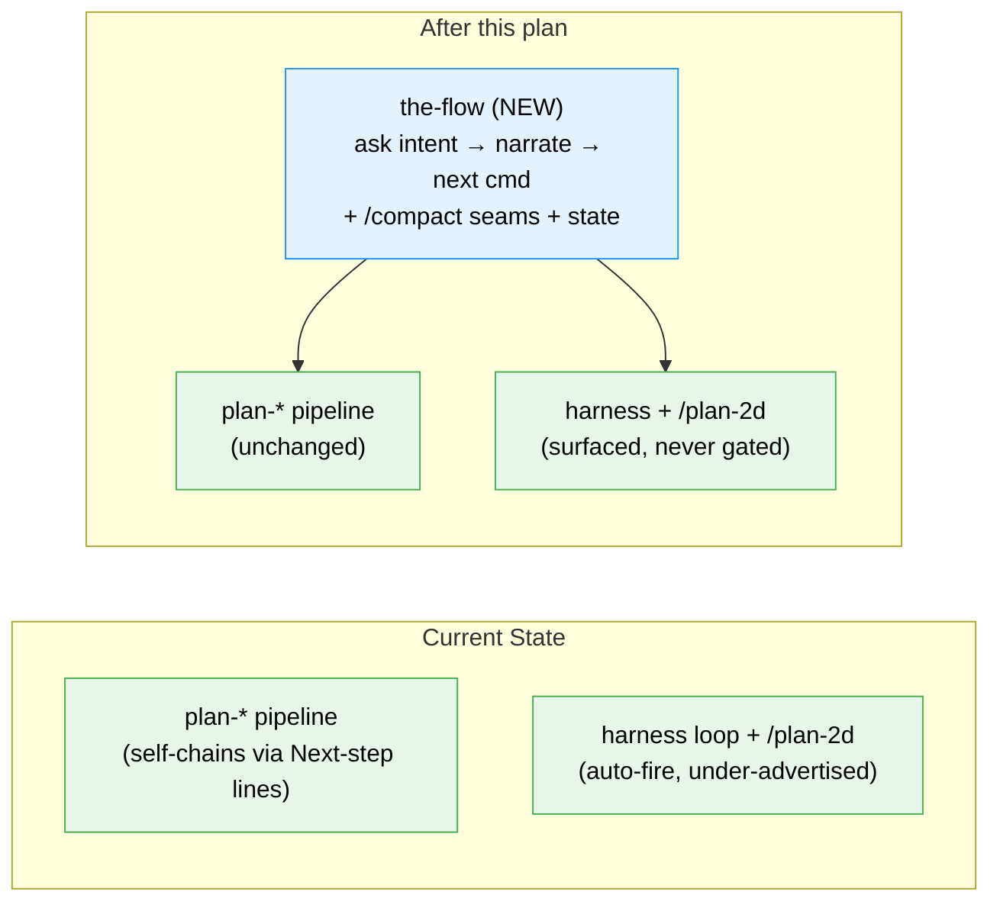

# Flight Plan: the-flow — Guided Co-Pilot for the SDD Pipeline

**Spec**: [the-flow-spec.md](./the-flow-spec.md)
**Plan**: [the-flow-plan.md](./the-flow-plan.md)
**Research**: [research-dossier.md](./research-dossier.md) · **Workshop**: [001-narration-scripts-and-compact-contract.md](./workshops/001-narration-scripts-and-compact-contract.md)
**Generated**: 2026-05-29
**Status**: Landed

---

## The Mission

**What we're building**: `the-flow` — one re-entrant skill that walks a user through the whole SDD `plan-*` pipeline like an expert sitting beside them. You tell it what you want to build; it turns that into the first command, then at each step it explains *why* the stage matters, points out one thing worth noticing in what the stage produced, tells you exactly what to type next, and nudges you to `/compact` at the natural seams. Type the same `/the-flow` to start and to pick back up after each command — it remembers where you are from a small state file, so it survives the very `/compact` it recommends.

**Why it matters**: The pipeline already chains itself, but tersely. A newcomer doesn't know when a workshop is worth it, that a backpressure survey exists, when to compact, or what the purple harness prompts mean. `the-flow` is the spoken form of `getting-started.md` — the narration + judgement layer that makes the whole flow legible.

---

## Where We Are → Where We're Headed

```
TODAY:                                   AFTER this plan:
plan-* pipeline self-chains, tersely      one /the-flow front-door, narrated

🔵 /plan-1a..8 each end with "Next step"  🔵 same skills, unchanged
❌ no front-door / narration layer         🔴 the-flow (NEW) → asks intent, drives, narrates
❌ no /compact guidance at seams           🔴 /compact suggested at 4 canonical seams
🟡 harness + /plan-2d under-advertised     🟡 surfaced at the right seams (never gated)
```

🔵 unchanged 🟡 made-legible 🔴 new



**Legend**: existing (green, unchanged) | new (blue, created)

---

## Scope

**Goals**:
- A single re-entrant `the-flow` front-door into the `plan-*` pipeline (zero prior knowledge needed).
- Coaching-voice narration of each stage + one artifact insight each.
- Surface optional branches: `/plan-2c` (post-spec), `/plan-2d` (pre-architect).
- Explicit `/compact` guidance at stage seams (the affordance the pipeline lacks).
- Make the harness loop legible; honour `docs/compound/.disabled`.
- Durable on-disk state → re-entrant + idempotent; survives `/compact`.

**Non-Goals**:
- Not reimplementing pipeline orchestration (the skills already chain).
- Not a tutorial (≠ `sdd-tutorial`; different command family + intent).
- Not running code-changing/merge commands or `/compact` itself.
- Not a gate — never blocks/scores; every suggestion is skippable.
- No edits to existing `plan-*`/`harness-*` skills (only catalog/reference docs).

---

## Journey Map


**Legend**: green = done | grey = not started

---

## Phases Overview

Simple Mode → single inline phase (7 tasks). Plan **Status: READY** (gates: 4 PASS / 3 N/A).

| Phase | Title | Tasks | CS | Status |
|-------|-------|-------|----|--------|
| 1 | Implementation (skill mechanics + narration + adoption + flight-plan DAG/schema/templates + docs + validate) | 7 | CS-3 | Pending |

---

## Acceptance Criteria

- [ ] Single `the-flow/SKILL.md`, valid frontmatter, distinct from `sdd-tutorial` (drives `plan-*`, not RPIV).
- [ ] Single + re-entrant: one `/the-flow` handles fresh start (no state) and resume (state present).
- [ ] Opens by asking intent; routes to `/plan-1a` or `/plan-1b`.
- [ ] Durable resume-state contract (temp-file+rename); idempotent resume; survives `/compact`.
- [ ] Per-stage narration map for all seams (1a..8) in coaching voice.
- [ ] `/compact` suggested at the 4 canonical seams ("type it yourself, then re-run `/the-flow`").
- [ ] Harness affordances surfaced at the right seams; honours `docs/compound/.disabled`.
- [ ] `/plan-2c` + `/plan-2d` surfaced as optional, user-decided, never gated.
- [ ] Never runs code-changing/merge commands; never blocks/scores (stated invariant).
- [ ] `check-skill-slugs.sh` exits 0; catalog rows + `getting-started.md` mention added.

---

## Key Risks

| Risk | Mitigation |
|------|-----------|
| Confusion / slug collision with `sdd-tutorial` | Distinct slug + description + explicit "drives `plan-*`, not RPIV" line; catalog row states it. |
| Reimplementing orchestration the skills already do | Non-Goal; narration only reads artifacts + re-frames each skill's own `Next step` line. |
| Re-entry double-advances / loses place after `/compact` | Idempotent resume + artifact-discovery-by-checkpoint (sdd-tutorial-next precedent); re-entry walkthrough. |
| Over-prompting `/compact` | Suggest only at 3–4 canonical seams, always optional. |

---

## Flight Log

<!-- Updated by /plan-6 and /plan-6a after each phase completes -->

_No phases completed yet._
