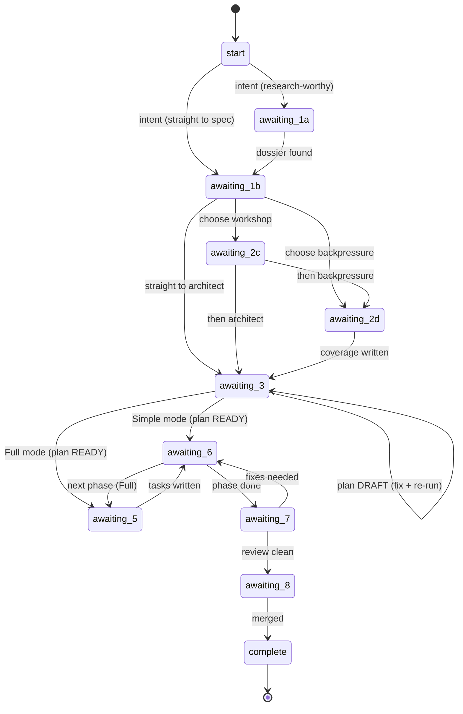

# Workshop: Per-Stage Narration Scripts + the `/compact`-Seam Contract

**Type**: CLI Flow (conversational flow)
**Plan**: 026-the-flow
**Spec**: [the-flow-spec.md](../the-flow-spec.md)
**Created**: 2026-05-29
**Status**: Draft

**Value Thesis**: This workshop turns the spec's abstract "narrate each stage in coaching voice" into the **actual speakable copy + a deterministic stage state-machine** the implementer can paste into `SKILL.md`. It collapses the three biggest unknowns (drive model, the `/compact` resume handshake, and how `the-flow` picks "one insight" per artifact) into resolved decisions with worked examples, so `/plan-3` produces a single dense phase with no design left to improvise.
**Target Proof Level**: Implementation Ready
**Current Proof Level**: Contract Ready (narration copy is concrete; "one-insight" extraction is heuristic, validated only by walkthrough in `/plan-6`)

**Selected Value Axes**:
- **Implementation Readiness**: the implementer can write `SKILL.md` straight from the routing table + copy blocks here, with no further design.
- **Operator Usability**: the human running `/the-flow` gets a predictable rhythm (run command → `/the-flow` → narration + next move), with affordances at every decision.
- **Agent Readiness**: an agent executing `the-flow` has a deterministic state→action map; no ambiguity about what to discover, say, or issue next.
- **Onboarding / Accessibility**: a newcomer to the `plan-*` pipeline never has to know which command is next — the script supplies it with rationale.

**Related Documents**:
- [research-dossier.md](../research-dossier.md) — §"Where the-flow narrates" (the source map this workshop makes concrete)
- `skills/SDD/sdd-tutorial-next/SKILL.md` — the re-entrant-resume precedent (artifact-discovery-by-checkpoint, idempotency)
- `skills/SDD/sdd-tutorial/references/coaching-voice.md` — the Orient→Suggest→Invite + affordance contract this copy obeys
- `skills/SDD/sdd-tutorial/references/getting-started.md` — the harness touchpoints the cues mirror

**Domain Context**: No domain registry (skills are the product). Primary "domain": the new `skills/SDD/the-flow/` skill.

---

## Purpose

Specify (a) the **drive model**, (b) the **durable state contract**, (c) the **stage state-machine + routing table**, (d) the **exact narration copy** for every pipeline seam, and (e) the **`/compact` resume handshake** — to a level where `SKILL.md` is a transcription job, not a design job.

## Fresh Entrant Outcome

A fresh human or agent should be able to use this workshop to reach **Implementation Ready** for `the-flow`'s conversational core with no additional context. They should be able to:

- State which model `the-flow` uses to advance the pipeline and why (drive model — RESOLVED here).
- Read/write the `.the-flow-state.json` contract and resume from it after `/compact`.
- Map any `current_stage` → {artifact to discover, what to say, next command, compact/harness cues} from one table.
- Paste the per-seam narration copy into `SKILL.md` and adjust only the `<bracketed>` fills.

## Key Questions Addressed

1. Does `the-flow` **drive** (invoke plan skills itself) or **coach** (tell the user what to type)? (The spec defaulted to "coach / Option A"; this workshop confirms and justifies it, closing the drive-model workshop opportunity.)
2. Where does state live, and how is the **fresh-start chicken-and-egg** (no plan folder yet) resolved?
3. How does `/the-flow` (no args) **find the active flow** on resume — especially after `/compact` wipes conversation memory?
4. What is the **exact `/compact` handshake** at a seam, and how is it idempotent?
5. What does `the-flow` **say** at each of the ~11 seams, and how does it pick the "one insight" from each artifact?

---

## Value Frame

| Field | Selection | Why It Matters |
|-------|-----------|----------------|
| Target Proof Level | Implementation Ready | `/plan-3` should emit one dense phase whose tasks are "transcribe the routing table + copy blocks", not "design the flow". |
| Primary Value Axis | Implementation Readiness | The narration copy + state machine *are* the skill; everything else is frontmatter. |
| Supporting Value Axes | Operator Usability, Agent Readiness, Onboarding | The flow has to feel like a guide AND be deterministic for an agent to run. |
| Downstream Loop Improved | Implementation (`/plan-6`) + every future use of `the-flow` | Removes the per-seam "what do I say / what do I run" rediscovery cost. |

---

## Decision Space

### D0 — Drive model: **Coach (Option A)**, not Drive (Option B/C)

| Option | Description | Pros | Cons | Decision |
|--------|-------------|------|------|----------|
| A — Coach | `the-flow` speaks, then tells the user the exact command to type; user runs it; user re-runs `/the-flow`. State on disk is the source of truth. | Survives `/compact` trivially; heavy `/plan-6` runs in its own clean turn; user stays in control of code-changing/merge cmds; mirrors proven `sdd-tutorial-next`. | One extra `/the-flow` invocation per stage. | **Selected** |
| B — Single-conversation orchestrator | `the-flow` invokes each plan skill via the Skill tool in one long conversation. | Fewest keystrokes. | **Cannot recommend `/compact`** without destroying its own driving context; bloats one context with every sub-skill's full output — the opposite of the hygiene the user wants. | **Rejected** |
| C — Hybrid | Drive light stages inline; yield at compact seams. | Smoother in-segment feel. | Two mental models in one skill; driving `/plan-6` (long, code-changing, fires its own harness prompts) inside `the-flow`'s context entangles outputs and is exactly what you'd want to compact *after*. | **Rejected** (KISS) |

> **Why A wins the "hand-hold / sitting beside you" feel anyway**: the guide feeling comes from `the-flow` being the *ever-present narrator that always knows the next move and explains why* — not from it literally typing for you. `sdd-tutorial` proves a coach loop feels like a person beside you. And the user explicitly wants `/compact` at seams, which only A supports cleanly.

> **This closes the spec's "drive model A vs C" Workshop Opportunity** — resolved to A with rationale.

### D1 — State location + fresh-start chicken-and-egg: **`the-flow` owns folder creation**

| Option | Description | Decision |
|--------|-------------|----------|
| State co-located in plan folder, created by `the-flow` at fresh start | On fresh start, `the-flow` allocates the ordinal (`plan-ordinal`/`jk-po`), derives the slug from intent, creates `docs/plans/<ord>-<slug>/`, writes `.the-flow-state.json`, **then** issues `/plan-1a`/`/plan-1b`. Both of those already *reuse* an existing `docs/plans/*-<slug>/` (documented behaviour), so no conflict. | **Selected** |
| State in a `the-flow`-owned global dir, keyed somehow | Needs a keying scheme; drifts from the plan it drives. | Rejected |
| State in a temp location until folder exists, then migrated | "Temp then move" is awkward and failure-prone. | Rejected |

State file: **`docs/plans/<ord>-<slug>/.the-flow-state.json`**. Self-cleans with the plan folder; one per flow.

### D2 — Resume discovery after `/compact`: **scan active state files**

`/the-flow` with no args:
1. Glob `docs/plans/*/.the-flow-state.json` where `status == "active"`.
2. **0 found** → fresh start (ask intent).
3. **1 found** → resume it.
4. **>1 found** → list them (slug + current_stage) and ask which; offer "start a new one".
5. `/the-flow <slug>` or `/the-flow <ord>-<slug>` → resume that one explicitly (skip the scan).

This is the `sdd-tutorial-next` "if multiple states exist, list and ask" rule, adapted. Conversation memory is a *bonus* within a segment; the scan is what makes it survive `/compact`.

### D3 — Single terminal, not two

`sdd-tutorial` uses two terminals (classroom + work) to protect the lesson context. `the-flow` needs only **one**: the user alternates `/plan-X` and `/the-flow` in the same conversation, and `/compact` is the hygiene valve. Simpler; documented as a deliberate divergence.

### D4 — "One insight" extraction: **stage-specific, artifact-grounded, never invented**

Per `sdd-tutorial-next`: read the artifact, pick **one** concrete, teachable detail (prefer the high-signal field for that stage — see the routing table's "insight source" column). If the artifact can't be read or has no useful detail, say so plainly and fall back to the next-best signal (file existence, git status). **Never fabricate an insight.**

### D5 — Host-identity progress rail: the guide's voice + how far down the flow we are

Every `the-flow` turn begins with a fixed one-line **host rail**: the skill's bracketed name, then a progress rail of the journey's macro-milestones. It does double duty — marks the guide's voice (never confusable with a `plan-*` skill's output) **and** shows how far down the flow we are.

```
[the-flow] ◆─◆─◆─[◆─◇─◇]─◇      ·  next: phase 2
 └ name ┘  └ flow ┘└phases┘└flow┘


Where we are: phase 1 is built and reviewed — phase 2 is next.
```

- `◆` = completed macro-milestone, `◇` = remaining, joined by `─` into one rail.
- **Phase grouping**: the per-phase nodes are wrapped in one `[ … ]` so they read distinctly from the fixed flow nodes (Research·Spec·Plan before, Merge after) — `◆─◆─◆─[◆─◇─◇]─◇`.
- **Layout**: the rail prints on its **own line**, then a blank line, then the narration content.
- **Macro-milestones (Full)**: Research · Spec · Plan · Tasks · Build · Review · Merge (7). Optional/sub-steps (`/plan-1a` deep-research, `/plan-2c`, `/plan-2d`, `/plan-3a`, the fix loop) live *under* a milestone and get **no diamond** — so opting in/out never changes the total.
- **Dynamic total**: `milestones_total` is an estimate early and gets **recomputed at `/plan-3`** from the real phase count. Macro-milestones = Research · Spec · Plan · **one node per phase** (that phase's build+review) · Merge. So a 5-phase plan expands the rail (3 + 5 + 1 = 9), a 1-phase Simple plan collapses it. The rail re-scales **only at `/plan-3`** (when phase count is first known), then is monotonic.
- **Status line** after the diamonds, in a **distinct accent colour**: `· now: <current> · next: <next>`. **Dynamic expansion** — inline when there's a single short next; when `next` has **≥2 options** (or would wrap), `now` and `next` break onto their **own lines** with options stacked (labelled + aligned, recommended option first). Frame the rail once, early, as *an approximate map, not a contract* (totals shift once `/plan-3` reveals phase count). Example multi-option form:
  ```
  [the-flow] ◆─◆─◇─◇─◇
   now  · spec written — CS-4, Full
   next · ▸ /plan-3        architect            (recommended)
          ▸ /plan-2c       another workshop
          ▸ /deepresearch  dig into the API
  ```
- The rule: this line is **always first**, never emitted by any `plan-*`/`harness-*` skill (those print `✅`/`📁` status lines but no persona rail — unambiguous). Glyphs tunable; apply to **every** block in § Narration Scripts.

**Stage → rail map** (Full mode; `state.milestones_done` drives the fill):

| Stage reached | done/total | Rail |
|---|---|---|
| `start` | 0/7 | `[the-flow] ◇─◇─◇─◇─◇─◇─◇` |
| `awaiting-1a` | 1/7 | `[the-flow] ◆─◇─◇─◇─◇─◇─◇` |
| `awaiting-1b` | 2/7 | `[the-flow] ◆─◆─◇─◇─◇─◇─◇` |
| `awaiting-2c` / `awaiting-2d` | 2/7 (sub-steps) | unchanged |
| `awaiting-3` | 3/7 | `[the-flow] ◆─◆─◆─◇─◇─◇─◇` |
| `awaiting-5` | 4/7 | `[the-flow] ◆─◆─◆─◆─◇─◇─◇` |
| `awaiting-6` | 5/7 | `[the-flow] ◆─◆─◆─◆─◆─◇─◇` |
| `awaiting-7` | 6/7 | `[the-flow] ◆─◆─◆─◆─◆─◆─◇` |
| `awaiting-8` / `complete` | 7/7 | `[the-flow] ◆─◆─◆─◆─◆─◆─◆` |

### D6 — Verbatim ask is logged on fresh start (default behaviour)

On fresh start the default is: allocate the ordinal, create `docs/plans/<ord>-<slug>/`, and **write the user's original ask verbatim** to `docs/plans/<ord>-<slug>/original-ask.md` (and mirror it into `state.intent`). This preserves the raw intent *before* any spec processing reshapes it — a durable "what we set out to do", and the line the-flow echoes when resuming. Shape:

```markdown
# Original ask — <slug>
**Captured**: <ISO>  ·  **By**: /the-flow

> <the user's verbatim words, unedited>
```

### D8 — `the-flow.md` flight view (mermaid)

Alongside the one-line rail, the skill maintains **`docs/plans/<ord>-<slug>/the-flow.md`** — a flight-plan-style **vertical (`flowchart TD`) mermaid** of the journey, refreshed each turn. The **main spine** runs top→down (Research·Spec·Plan·per-phase nodes·Merge); **optional excursions** (deep research, workshop loops, backpressure) render as **dashed side-branches** that hang off the spine node they came from and dotted-arrow back — non-linear but not random. **Each workshop / excursion is its OWN node** (never collapsed into one `↻` blob — show every round, hide no detail). Node colours: **grey/blue-grey = future (assumed/known), orange = in progress, red = blocked, green = done**; excursions get a dashed style. **Verbatim user-input bubbles**: any node the user spoke at hangs a `🗣` bubble (`said` class, pale yellow) with their exact words, dotted to the node. **Parallel agents (minih)**: a **companion** is rendered as a **subgraph that wraps the phases it covers** (e.g. `code-review-companion` enclosing P1–P6); a **worker** is a side-node that `builds`→ the phase it owns. The rail is the glanceable one-liner; `the-flow.md` is the full picture. Sample: [sample-the-flow.md](../references/sample-the-flow.md).

### D9 — The flight plan: a JSON DAG that is the source of truth

- **Terminology**: each instance of a flow that `the-flow` produces is a **flight plan** (kin to the existing `plan-5b` flight-plan concept, different implementation — first-class tooling lands later).
- **`the-flow.json` is the source of truth**; **`the-flow.md` (D8 mermaid) is generated from it**. For now `the-flow` writes both each turn; later first-class tooling produces the JSON and renders the MD, enabling agent-harness/tooling integration off a stable contract.
- **It's a DAG of step nodes.** Each node carries: `id`, `type`, `label`, `status`, `command`, `ran_at`, **`user_input` (verbatim — track what the user actually did → renders as a 🗣 bubble)**, `note` (what was done & why), **`artifacts[]` (linked plan folder / tasks / `execution.log.md` / `reviews/*.md`)**, `next[]` (edges), `branch_of` (excursions). Each workshop = its own node (loops expand; never collapsed). This makes it a deterministic graph *over* the artifacts **and** a visible (mutable) view of the future.
- **Parallel agents** ride alongside the nodes: a document-level **`agents[]`** tracks minih agents — `kind: companion|worker`, `slug`, `runtime`, `run_id`, `status`, `covers[]`, `render`, `driver`, `note`. A **companion wraps** the phases in its `covers[]` (subgraph); a **worker** is a side-node into its `covers[]`.
- **Status taxonomy → node colour**: `done` (green) · `in_progress` (orange) · `blocked` (red) · **`known`** (blue-grey — *designed* future, e.g. phases locked by `/plan-3`) · **`assumed`** (faint dashed grey — *speculative* future that may change, e.g. a conditional fix loop). Transitions: `assumed → known` when `/plan-3` designs it; `→ in_progress` when started; `→ done`; `→ blocked` on a wall.
- **Templates shipped *in the skill*** so every flight plan stays standardised: `skills/SDD/the-flow/references/flight-plan.template.json` + `flight-plan.template.md` (each with the worked example). Samples: [sample-the-flow.json](../references/sample-the-flow.json) · [sample-the-flow.md](../references/sample-the-flow.md).

### D10 — Companion & worker affordance (narration + tracking)

At the **build seam** (after `/plan-5`, before `/plan-6`), the-flow surfaces work that runs **alongside** the flow — all optional:

- **Companion (watches, advisory)**: the default is `code-review-companion` via **`/plan-6-v2-implement-phase-companion`** — a parallel minih agent that reviews every commit live and **supersedes `/plan-7`**. the-flow recommends it as the build path and notes the `--no-companion` fallback.
- **Other minih agents**: the user can attach more — additional **companions** (e.g. a security/perf watcher) or **workers** (normal agents doing a slice of work in parallel, e.g. a `docs-writer`). the-flow notes `minih run <slug>` and **records them in `agents[]`** so they appear on the flight view (companion wraps its phases; worker is a side-node).
- **the-flow does not run minih itself** (coach model — Option A): it narrates the affordance and *tracks* the agents the user spun up; `/plan-6-companion` owns the minih protocol (boot/attach, brief, per-commit pings, drain → farewell → retro). Companions are always optional.

### D7 — Breadth: core spine + light mentions of optional branches

The 11-stage spine is first-class. The ~6 other branches real flows use (deep-research after `1a`; ADR `/plan-3a`; prework/decision gate; the fix loop after `7`; domains when a registry exists; `/util-0-handover`) are surfaced as **one-line optional mentions** at the relevant seam — **not** new stages (keeps "narration not plumbing" intact). See [real-flow-examples.md](../references/real-flow-examples.md). In particular, the `awaiting-1a` block adds a **deep-research** mention: the user may deepen with an **online-connected agent** (e.g. `/deepresearch`, Perplexity) **or their coding harness** — tool of their choice — before `/plan-1b`.

---

## State Contract

```json
{
  "schema_version": 1,
  "slug": "the-flow",
  "plan_dir": "docs/plans/026-the-flow",
  "mode": "unknown",                 // "Simple" | "Full" | "unknown" (read from spec header after plan-1b)
  "current_stage": "awaiting-1b",    // see Stage Machine
  "pending_command": "/plan-1b-v3-specify-and-clarify \"<intent>\"",
  "intent": "<the user's one-line answer to 'what do you want to build?'>",
  "milestones_total": 7,             // macro-milestones for this run's mode (Full=7, Simple≈4); set after plan-1b, then stable
  "milestones_done": 2,              // completed macro-milestones → drives the [the-flow] ◆…◇ rail fill (D5)
  "last_checkpoint_at": "2026-05-29T00:00:00Z",   // for artifact-discovery-by-mtime
  "compacted_seams": [],             // seams where the user accepted /compact (audit only)
  "status": "active"                 // "active" | "complete"
}
```

**Write method**: temp file + atomic rename (`.the-flow-state.json.tmp` → `.the-flow-state.json`), exactly as `sdd-tutorial` writes `state.yaml`. **Minimal by design** (KISS / no derived rollup state): just enough to resume. `last_checkpoint_at` is captured via the shell (`date -u +%FT%TZ`).

---

## Stage Machine



### Routing Table (the deterministic core)

| current_stage | Discover artifact | Insight source (pick 1) | Compact seam *before* next? | Harness cue | Next command → next stage |
|---|---|---|---|---|---|
| `start` | — (ask intent) | — | — | mention `/harness-1-boot --validate` optional | research-worthy → `/plan-1a` (→`awaiting-1a`); else `/plan-1b` (→`awaiting-1b`) |
| `awaiting-1a` | `research-dossier.md` | one Critical/High finding | **YES** (dossier is large) | observe ran silently | `/plan-1b` → `awaiting-1b` |
| `awaiting-1b` | `<slug>-spec.md` | CS score + Simple/Full + #Workshop Opportunities | **YES** (before architect) | — | branch: `/plan-2c` (→`awaiting-2c`) \| `/plan-2d` (→`awaiting-2d`) \| `/plan-3` (→`awaiting-3`) |
| `awaiting-2c` | newest `workshops/*.md` | the headline decision (Selected option) | — | — | `/plan-2d` (→`awaiting-2d`) \| `/plan-3` (→`awaiting-3`) |
| `awaiting-2d` | `backpressure-coverage.md` | Certainty (Strong/Partial/Weak) + Phase 0? | — | **backpressure payoff** | `/plan-3` → `awaiting-3` |
| `awaiting-3` | `<slug>-plan.md` | `**Status**` (READY/DRAFT) + Gate Matrix | **YES** (before implement) | validate-v2 already auto-ran | DRAFT → fix + re-run `/plan-3` (stay); Simple+READY → `/plan-6` (→`awaiting-6`); Full+READY → `/plan-5` (→`awaiting-5`) |
| `awaiting-5` | `tasks/<phase>/tasks.md` | first task's Done-When | — | — | `/plan-6 --phase … --plan …` → `awaiting-6` |
| `awaiting-6` | `execution.log.md` / phase status | what landed + AC met | **YES** (between phases) | **boot gate** (set expectation *before* issuing); **drain** prompt `[s/t/p/e/d/a]` (explain *after*) | clean → `/plan-7` (→`awaiting-7`); more phases → next `/plan-5` (→`awaiting-5`) |
| `awaiting-7` | newest `reviews/*.md` | verdict + one finding | — | contrast computational(`2d`) vs inferential(`7`) tiers | findings → fix + re-run `/plan-7` (stay); clean → `/plan-8` (→`awaiting-8`) |
| `awaiting-8` | merge plan | merge readiness | — | **harvest** reflection | user types `PROCEED`/`ABORT`; on merge → `complete` |
| `complete` | — | — | — | suggest `/harness-3-retro --harvest` if not already | recap + stop; set `status:"complete"` |

**Idempotency rule (every resume)**: discover the artifact for `current_stage`. **Found** → narrate + persist next stage/command + issue next command. **Not found** → re-print `pending_command` verbatim and stop; do **not** advance. (Direct lift from `sdd-tutorial-next` Hard Rule 5.)

---

## Narration Scripts (the evidence — paste-ready copy)

> All copy obeys **Orient → Suggest → Invite**, one decision per turn, affordance contract (recommended default + 2–4 concrete typeable answers + an "if unsure" path). `<bracketed>` = fill from the discovered artifact.
> **Every block is prefaced with the host progress rail (D5)** — `[the-flow] ◆…◇` — so the user always knows the guide is speaking *and* how far down the flow they are. The rail shown per block below reflects that stage's `milestones_done` (see the Stage → rail map).

### `start` — fresh entry (no active state)
> [the-flow] ◇─◇─◇─◇─◇─◇─◇
> Welcome — I'm your guide through the SDD plan flow. Tell me in a sentence what you want to build or change, and I'll turn it into the right first step, explain why each stage matters, point out the one thing worth noticing in what each stage produces, and tell you exactly what to type next. You stay in control — nothing merges without your say-so, and I'll never run code changes for you.
>
> **What do you want to work on?** *(Just describe it. If it touches code you don't fully understand yet, I'll start us with research (`/plan-1a`); if the ask is clear, we'll go straight to the spec (`/plan-1b`). Unsure → just describe it and I'll choose.)*

*After the answer*: allocate ordinal, create `docs/plans/<ord>-<slug>/`, **log the verbatim ask to `original-ask.md` (D6)**, write state, then:
> [the-flow] ◇─◇─◇─◇─◇─◇─◇
> Got it: **`<intent>`** — logged that to `original-ask.md` so we always have the original wording. `<This is worth a research pass first / This is clear enough to spec directly>`, so type this next:
>
> `<​/plan-1a "<intent>"  |  /plan-1b "<intent>">`
>
> When it finishes, come back and run **`/the-flow`** — I'll pick up right here.

### `awaiting-1a` → after research
> [the-flow] ◆─◇─◇─◇─◇─◇─◇
> **Where we are**: research is done (`research-dossier.md`) — that's evidence, not code yet.
> Did you notice `<one Critical/High finding>`? That matters because `<why it shapes the spec>`.
> **Optional — go deeper?** If anything's still fuzzy, you can deep-research it with your **tool of choice**: an online-connected agent (`/deepresearch`, Perplexity) or your own coding harness. Skip it if the dossier already answers enough.
> **Then a seam**: this is a natural spot to run `/compact` — clears the research chatter and keeps the spec sharp; I'll resume right here afterwards (my state's on disk). Then we write the spec.
>
> Your move: `deep-research` (your tool), `compact` then `/the-flow` *(recommended)*, or straight to `/plan-1b`. Either way, `/plan-1b` is the next real step.

### `awaiting-1b` → after spec  *(the busiest seam)*
> **Where we are**: the spec is written (`<slug>-spec.md`) — **CS-`<n>` → `<Simple|Full>` Mode**. The spec is the contract the plan will build to.
> Did you notice `<the spec flagged N Workshop Opportunities / this feature touches real behaviour>`? That matters because `<why>`.
> Before we architect, you have up to three optional moves — all skippable, none gate anything:
> 1. **`/plan-2c`** — workshop a tricky topic first (the spec flagged `<N>`). Worth it when a design choice is still fuzzy.
> 2. **`/plan-2d`** — backpressure survey: can we *prove* this work deterministically before building? Advisory; surfaces an optional Phase 0.
> 3. **`/compact`** — context hygiene before the architect (recommended at this seam).
>
> Recommended path: `<compact then /plan-3>` *(or `workshop` / `prove it` first if you want)*. Type one of: `compact`, `workshop`, `prove it`, `architect`. Unsure → `compact` then `architect`.

### `awaiting-2c` → after a workshop
> **Where we are**: workshop saved (`workshops/<file>`). Its decisions are now **authoritative** — `/plan-3` won't contradict them.
> Did you notice it settled `<the Selected option>`? That removes `<the ambiguity it resolved>` from the plan.
> Next: another workshop, the backpressure survey (`/plan-2d`), or straight to the architect. Recommended: `<​/plan-3>`. Type: `another`, `prove it`, or `architect`.

### `awaiting-2d` → after backpressure survey
> **Where we are**: backpressure coverage written — **Certainty: `<Strong|Partial|Weak>`**`<; recommended Phase 0: …>`.
> What this means: `<the behaviour/architecture criteria with EXISTS sensors are provable now; the BUILDABLE/ABSENT ones are where you'd otherwise be eyeballing>`. It's **advisory** — `/plan-3` will *consider* any Phase 0, never be forced into one.
> Next: `/plan-3`. (Compact first if the survey was long — `compact` then `/the-flow`.) Type: `architect` or `compact`.

### `awaiting-3` → after the plan
> **Where we are**: the plan is written — **Status: `<READY|DRAFT>`** (gates: `<matrix summary>`). validate-v2 already auto-ran.
> Did you notice `<a phase boundary / a gate that's N/A / the DRAFT gap>`? That matters because `<why>`.
>
> *If DRAFT*: `<the gap>` needs a fix first — `<the suggested remedy>`, then re-run `/plan-3`. Type: `fix` (I'll walk you through it) or `show gaps`.
> *If READY (Simple)*: one seam before code — `/compact` keeps the implementer sharp. Then `/plan-6`. Type: `compact` then `/the-flow`, or `implement`.
> *If READY (Full)*: next is `/plan-5` for Phase 1's tasks (compact first if you like). Type: `compact` or `tasks`.

### `awaiting-5` → after phase tasks
> **Where we are**: Phase `<N>` tasks are tabled (`tasks/<phase>/tasks.md`) with success criteria.
> Did you notice the first task's done-when is `<criterion>`? That's the bar the implementer codes to.
> Next: implement this phase. Type this:
>
> `/plan-6-v2-implement-phase --phase "<Phase N: Title>" --plan "<plan path>"` *(or `/plan-6-...-companion` for live review)*
>
> Heads-up for the next step ↓ (the harness boots before any code).

### `awaiting-6` → after a phase  *(boot cue is set BEFORE issuing plan-6; drain explained AFTER)*
*(Pre-issue cue, spoken as part of `awaiting-5`/before re-issuing plan-6)*:
> Before the first task, `/plan-6` runs a **Boot→Interact→Observe pre-flight** — it proves the app actually runs before a line of code is written. If there's no harness it just reports `UNAVAILABLE` (not an error) and falls back to standard testing. That's expected here.

*(On return)*:
> **Where we are**: Phase `<N>` landed — `<what it delivered>`; acceptance `<AC refs>` met. `/plan-6a` tracked progress for you.
> You may have seen a retro prompt `[s/t/p/e/d/a]` at the end — that's the harness **draining** the session's friction notes; default `[a]` saves them all. (Silenced if `docs/compound/.disabled` exists.)
> Did you notice `<one execution-log discovery>`? Worth carrying forward.
> *More phases (Full)*: this is a between-phase seam — `/compact` now, then `/plan-5` for Phase `<N+1>`. Type: `compact` or `next phase`.
> *Last phase / Simple*: next is review — `/plan-7`. Type: `review`.

### `awaiting-7` → after review
> **Where we are**: review written (`reviews/<file>`) — verdict `<…>`.
> Worth knowing: `/plan-7` is the **inferential / eyeball** tier; `/plan-2d` earlier was the **computational** tier. Together they cover what each can't.
> Did you notice `<one finding>`? `<It routes back to implement / it's clean>`.
> *Findings*: fix, then re-run `/plan-7`. Type: `fix`.
> *Clean*: next is the merge analysis — `/plan-8`. Type: `merge`.

### `awaiting-8` → at merge
> **Where we are**: `/plan-8` produced the merge analysis. A harvest reflection across the whole plan fires here (idempotent).
> Read the merge plan, then type **`PROCEED`** to execute or **`ABORT`** to hold. I'll mark the flow complete once it merges.

### `complete`
> 🎉 That's the full loop: spec → plan → tasks → code → review → merge. The harness captured friction along the way; if you haven't, `/harness-3-retro --harvest` gives a curated cross-plan view. Nothing else queued — re-run `/the-flow` any time to start a new one.

---

## The `/compact` Resume Handshake

```
the-flow (at a compact seam, e.g. awaiting-1b):
  "... type /compact then /the-flow (recommended), or /plan-3."
        │
        ▼
USER types:  /compact          ← CLI built-in; wipes conversation context.
        │                         the-flow CANNOT run this — only the user can.
        ▼
USER types:  /the-flow         ← no args; conversation memory is gone.
        │
        ▼
the-flow:  glob docs/plans/*/.the-flow-state.json (status:active)
           → finds 026-the-flow @ current_stage=awaiting-1b
           → discover <slug>-spec.md (exists, unchanged since checkpoint)
           → NOT a new artifact ⇒ idempotent: re-print the pending guidance
             "We're past the spec. Next real step: /plan-3 (or /plan-2d). ..."
        │
        ▼
USER runs /plan-3 ... then /the-flow → discovers plan → advances to awaiting-3.
```

**Key properties**:
- `/compact` at a seam is a **no-op for state** — `the-flow` re-enters the *same* stage idempotently and re-states the next command. No double-advance, no lost place.
- The handshake phrasing is always: **"type `/compact` yourself, then re-run `/the-flow`."** `the-flow` never claims to compact.
- Works identically whether or not the user actually compacts — state on disk is the single source of truth.

---

## Evidence Ledger

| Evidence | Location | Supports | Status |
|----------|----------|----------|--------|
| Drive-model decision table | § Decision Space D0 | Closes "A vs C" workshop opportunity | Ready |
| `.the-flow-state.json` contract | § State Contract | AC-4 (durable resume state) | Ready |
| Stage machine + routing table | § Stage Machine | AC-5/AC-6 (idempotent resume), the deterministic core | Ready |
| Per-seam narration copy (11 blocks) | § Narration Scripts | AC-6 (per-stage narration map) | Ready (copy) / Draft (insight-fills) |
| `/compact` handshake sequence | § Resume Handshake | AC-7 (compact at seams) | Ready |
| Harness cue placement (boot pre, drain post) | Routing table + awaiting-6 copy | AC-8 (harness affordances) | Ready |

## Attention Reduction

| Future Loop | Before Workshop | After Workshop |
|-------------|-----------------|----------------|
| Implementation (`/plan-6`) | "Design the flow, the state, the copy, the compact handshake" | Transcribe the routing table + 11 copy blocks; fill `<brackets>` |
| Review (`/plan-7`) | Reconstruct intended behaviour to judge the skill | Check skill against the routing table + idempotency rule directly |
| Testing | Invent walkthrough scenarios | Re-entry-after-compact sequence is specified (§ Handshake) |
| Agent execution of `the-flow` | Repeated "what do I say / run next?" | One state→action row per stage; never invent insights |

## Validation / Acceptance

This workshop reaches **Implementation Ready** when:
- Every `current_stage` has a routing-table row AND a narration block. ✅ (11/11)
- The drive model is decided with rationale (no "Open"). ✅ (Option A)
- The `/compact` handshake is a concrete sequence, not a description. ✅
- The state contract is minimal and has a documented write method. ✅
- A reader can write `SKILL.md` filling only `<bracketed>` artifact values. ✅ (pending the per-artifact "one-insight" fill rule, which is heuristic by design — D4)

## Open Questions

- **Q1 — Stage labels in state**: store the command-just-issued (`awaiting-3`) vs the artifact-expected. **RESOLVED**: `awaiting-<cmd>` (the routing table keys on it).
- **Q2 — Multi-flow concurrency**: more than one active `.the-flow-state.json`. **RESOLVED**: list + ask (D2); explicit `/the-flow <slug>` overrides.
- **Q3 — Does `the-flow` allocate the ordinal or let `/plan-1b` do it?** **RESOLVED**: `the-flow` allocates + creates the dir at fresh start; `/plan-1b`/`/plan-1a` reuse it (D1).
- **Q4 — Insight-fill determinism** (`<bracketed>` values): **OPEN (acceptable)** — extraction is heuristic (D4), validated only by the `/plan-6` walkthrough. Not a blocker; the *structure* is fixed, only the picked sentence varies.
