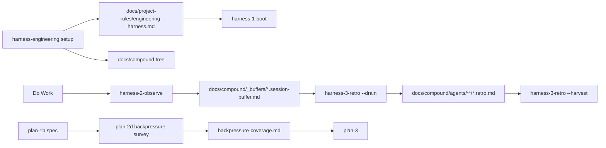

# Research Report: Upstream harness improvements

**Generated**: 2026-05-30T04:22:18Z  
**Research Query**: "Take the harness back-pressure, signal, and retro improvements from harness-engineering upstream into the tools repo, while leaving engineering-harness-setup in harness-engineering."  
**Mode**: Pre-Plan  
**Location**: `docs/plans/027-upstream-harness-improvements/research-dossier.md`  
**FlowSpace**: Not available for `~/github/tools` in this session; standard tools used  
**Findings**: 38 synthesized findings from local inspection + 4 focused research agents

## Executive Summary

### What It Does

The tools repo already owns the canonical runtime harness loop: `harness-1-boot`, `harness-2-observe`, and `harness-3-retro`. The harness-engineering repo now owns the setup/provisioning surface: `engineering-harness-setup`, generated `engineering-harness.md`, starter `harness/cli/`, and the stronger signal/back-pressure setup wording.

### Business Purpose

This migration should make tools the single upstream home for operational harness skills while keeping harness-engineering focused on public foundations and project-local setup. The key is to port improvements that belong to the runtime loop without reintroducing setup scaffolding into tools.

### Key Insights

1. **The split is already intentional upstream**: plan 024 explicitly dropped setup/scaffold/migration concepts to the separate engineering-harness setup effort while keeping only the three runtime loop skills in tools (`docs/plans/024-harness-nucleus/harness-nucleus-spec.md:13-28`, `39-46`, `58-66`).
2. **Back-pressure exists upstream, but mostly in `plan-2d`**: tools has a strong advisory backpressure survey, and `plan-3` consumes `backpressure-coverage.md`, but the harness loop itself is weaker on runtime signal inventory and inference-gap capture (`skills/SDD/plan-2d-backpressure-survey/SKILL.md:10-20`, `24-33`; `skills/SDD/plan-3-v3-architect/SKILL.md:97-100`, `235-237`).
3. **The schema contract should not be expanded casually**: tools' universal retro schema only permits `difficulty`, `magic-wand`, `gift`, `insight`, `coordination`, `improvement-suggestion`, and `confusion`; harness-engineering's `signal-gap`, `sensor-gap`, and `weak-back-pressure` should be mapped into existing kinds + richer targets/encoding hints unless a deliberate schema version bump is planned (`skills/compound/schemas/retro.schema.json:64-87`).

### Quick Stats

- **Core skill surfaces**: 3 harness runtime skills, 1 compound schema directory, 2 SDD consumers (`plan-2d`, `the-flow`) directly relevant.
- **Prior plans scanned**: 017, 023, 024, 025, 026.
- **Test coverage**: lightweight recipe/grep/install checks; no executable contract validator for retro schema or backpressure artifacts found.
- **Domains**: no formal `docs/domains/`; informal boundaries are `harness`, `compound`, `sdd-pipeline`, and `dev-tooling`.
- **Prior learnings**: 6 directly relevant prior-plan lessons surfaced.

## How It Currently Works

### Entry Points

| Entry Point | Type | Location | Purpose |
|------------|------|----------|---------|
| `harness-1-boot` | Skill | `skills/harness/harness-1-boot/SKILL.md:29-57` | Reads `engineering-harness.md` canonical-first and validates or reports `UNAVAILABLE`. |
| `harness-2-observe` | Skill | `skills/harness/harness-2-observe/SKILL.md:13-63` | Silent producer that appends friction/improvement entries to per-agent buffers. |
| `harness-3-retro --drain` | Skill mode | `skills/harness/harness-3-retro/SKILL.md:34-119` | Drains one session buffer into a durable `.retro.md`. |
| `harness-3-retro --harvest` | Skill mode | `skills/harness/harness-3-retro/SKILL.md:240-409` | Scans durable retros, clusters entries, and emits terminal or JSON views. |
| `plan-2d-backpressure-survey` | SDD skill | `skills/SDD/plan-2d-backpressure-survey/SKILL.md:24-33`, `105-143` | Advisory deterministic-sensor survey producing `backpressure-coverage.md`. |
| `the-flow` | SDD guide | `skills/SDD/the-flow/SKILL.md:16-44`, `211-220` | Guides the plan pipeline and surfaces backpressure/harness seams. |

### Core Execution Flow

1. **Boot**: `harness-1-boot` looks for `docs/project-rules/engineering-harness.md`, then legacy names. If missing, it reports `UNAVAILABLE`; it does not create the governance doc (`skills/harness/harness-1-boot/SKILL.md:29-57`, `90-98`).
2. **Observe**: during work, agents call `harness-2-observe` silently when they hit material friction or a magic-wand moment. If `_buffers/` is missing, it no-ops gracefully rather than scaffolding (`skills/harness/harness-2-observe/SKILL.md:13-63`, `120-125`).
3. **Retro drain**: `harness-3-retro --drain` presents one `[s/t/p/e/d/a]` prompt and saves entries into `docs/compound/agents/<agent>/<date>/*.retro.md` (`skills/harness/harness-3-retro/SKILL.md:60-119`).
4. **Retro harvest**: `harness-3-retro --harvest` scans `.retro.md` plus legacy `docs/retros/*.md`, validates frontmatter, dedups, clusters, and optionally emits JSON for tooling (`skills/harness/harness-3-retro/SKILL.md:267-409`).
5. **Backpressure planning**: `plan-2d` inventories deterministic sensors and writes `backpressure-coverage.md`; `plan-3` reads it if present and can include an optional "Phase 0: Establish Backpressure" (`skills/SDD/plan-2d-backpressure-survey/SKILL.md:61-105`; `skills/SDD/plan-3-v3-architect/SKILL.md:97-100`, `235-237`).

### Data Flow

## Architecture & Design

### Core Components

- **Runtime harness loop**: `skills/harness/` is the canonical upstream home for Boot, Observe, Retro. It intentionally assumes setup artifacts exist and degrades gracefully when they do not (`skills/compound/README.md:7-17`).
- **Compound contract**: `skills/compound/schemas/` is not installable skill content; it is the frozen universal retro schema path shared across systems (`skills/compound/README.md:1-21`).
- **Setup surface**: harness-engineering's `engineering-harness-setup` creates governance, CLI, signal inventory, and setup templates; tools only consumes the outputs (`harness-engineering/skills/engineering-harness-setup/SKILL.md:134-208`, `290-354`).
- **Backpressure design-time survey**: `plan-2d` is the computational-control tier before architect; it is advisory and artifact-based (`skills/SDD/plan-2d-backpressure-survey/SKILL.md:10-20`, `24-33`).

### Design Patterns Identified

1. **Graceful degradation**: missing setup artifacts produce `UNAVAILABLE` or no-op, never a hard failure (`harness-1-boot/SKILL.md:44-57`; `harness-2-observe/SKILL.md:61-63`).
2. **Computed views, not persisted indexes**: harvest computes views at read time and writes no on-disk rollups (`harness-3-retro/SKILL.md:450-472`).
3. **Advisory backpressure**: `plan-2d` can recommend sensors but never blocks or flips plans to DRAFT (`plan-2d-backpressure-survey/SKILL.md:24-33`).
4. **Setup/provisioning split**: plan 024 says setup/scaffold/migration are owned by the separate engineering-harness setup effort, not the runtime loop (`docs/plans/024-harness-nucleus/harness-nucleus-spec.md:39-46`, `58-66`).

## Dependencies & Integration

### Internal Dependencies

| Dependency | Type | Purpose | Risk if Changed |
|------------|------|---------|-----------------|
| `docs/project-rules/engineering-harness.md` | Optional input | Boot maturity and validation contract | Boot degrades to `UNAVAILABLE`; setup boundary becomes unclear. |
| `docs/compound/_buffers/` | Optional input/output | Observe buffer path | Observe no-ops; retro loop produces no entries. |
| `skills/compound/schemas/retro.schema.json` | Contract | Validates `.retro.md` envelope and entries | Schema bump could break minih/tools compatibility. |
| `backpressure-coverage.md` | Optional artifact | Design-time sensor coverage input to `plan-3` | `plan-3` loses Phase 0 signal; no blocking behavior. |
| `scripts/compound-value.sh` | Tool consumer | Pretty-prints harvest JSON | Can silently degrade if JSON fields default through `jq // 0`. |

### External / Cross-Repo Dependencies

| Surface | Owner | Purpose | Criticality |
|---------|-------|---------|-------------|
| `engineering-harness-setup` | `AI-Substrate/harness-engineering` | Provisions governance, `harness/cli`, command map, signal inventory | High |
| `npx skills add` | Vercel Labs skills CLI | Installs/updates skills but does not prune removed slugs | High |
| `docs/compound/` path | Cross-system contract | Shared ledger tree with minih/back-compat readers | High |

## Quality & Testing

### Existing Validation

- `just doctor-skills` validates deploy-target symlinks and legacy orphan paths.
- `just skills-orphans` reports deployed skills absent from source and prints copy-paste cleanup commands (`justfile:326-362`).
- `scripts/compound-value.sh` renders harvest JSON from stdin (`scripts/compound-value.sh:1-34`).
- `scripts/check-skill-slugs.sh` is used by prior plans to check slug collisions.

### Gaps

| Gap | Severity | Evidence | Impact |
|-----|----------|----------|--------|
| No repo-level retro schema validator wired into `just`/CI | High | `docs/compound/README.md` documents validation, but no just recipe was found | Schema drift can pass local checks. |
| `harness-1-boot` lacks signal-readiness reporting from harness-engineering | High | tools boot report still uses checklist `[X/15]`; setup emits `[X/20]` with signals | Setup-generated docs may be richer than boot output. |
| `harness-2-observe` triggers do not explicitly capture inference/back-pressure gaps | Medium | tools observe trigger list stops at magic-wand/backtracking; source `compound-1-track` includes signal/sensor/user-flow checks | Missing signals may be under-captured. |
| `harness-3-retro` clusters only by `(kind, target)` with no signal-shape annotation | Medium | harvest spec at `harness-3-retro/SKILL.md:302-325` | Back-pressure improvements may not be prioritized distinctly. |
| Install/update workflow can leave orphaned old skills | Medium | `justfile:326-362`, prior plan PL-04 | Old `boot-harness`/`compound-*` may keep appearing after migration. |

## Modification Considerations

### Safe to Modify

1. **Skill prose in `skills/harness/*.md`**: markdown contract edits are the intended surface, but preserve best-effort/no-gate wording.
2. **Targets and suggested encodings**: adding examples for `runtime-observe`, `smoke`, `architecture`, `static-analysis`, `security`, `schema`, `user-flow`, and `evidence` is schema-safe because `target` is a free string (`retro.schema.json:83-87`).
3. **Docs/install guidance**: tools docs should clarify loop ownership and tell users to install setup from harness-engineering.

### Modify with Caution

1. **`kind` enum**: adding `signal-gap`/`sensor-gap`/`weak-back-pressure` would require schema versioning and consumer updates (`retro.schema.json:64-74`).
2. **Harvest JSON shape**: `scripts/compound-value.sh` consumes `.harness`, `.entries`, and `.top_clusters[]` (`scripts/compound-value.sh:26-34`).
3. **Setup responsibility in tools**: adding scaffold behavior to `harness-1/2/3` would violate plan 024's boundary (`docs/plans/024-harness-nucleus/harness-nucleus-spec.md:39-46`, `58-66`).

### Danger Zones

1. **Turning backpressure into a gate**: both `plan-2d` and `the-flow` explicitly forbid blocking, thresholds, and scoring (`plan-2d-backpressure-survey/SKILL.md:24-33`; `the-flow/SKILL.md:18-23`).
2. **Persisted harvest indexes**: `harness-3-retro` explicitly forbids on-disk indexes (`harness-3-retro/SKILL.md:450-472`).
3. **Renaming `skills/compound/schemas/`**: tools docs state this path is frozen until extraction to a shared package (`skills/compound/README.md:13-17`).

## Prior Learnings

### Prior Learning PL-01: Runtime loop consolidation is already resolved

**Source**: `docs/plans/024-harness-nucleus/harness-nucleus-spec.md:13-28`, `39-46`  
**What They Found**: Six older compound/harness skills were consolidated into three runtime-stage skills, with scaffold/setup concepts moved out.  
**Action for Current Work**: Do not recreate `compound-0-setup` or setup scaffolding in tools; update tools runtime skills only.

### Prior Learning PL-02: Orphaned installed skills are a known trap

**Source**: `docs/plans/024-harness-nucleus/harness-nucleus-plan.md:52-54`, `87`; `justfile:326-362`  
**What They Found**: `npx skills add` updates but does not prune renamed/removed skills.  
**Action for Current Work**: Include `just skills-orphans` / `just doctor-skills` in validation and update harness-engineering install docs to stop advertising old slugs.

### Prior Learning PL-03: Backpressure must remain advisory

**Source**: `docs/plans/025-backpressure-survey/backpressure-survey-plan.md:52-56`, `75-93`  
**What They Found**: `plan-2d` exists to surface deterministic coverage, not to block or score.  
**Action for Current Work**: Any upstream wording must say "signals/back-pressure gaps are improvement candidates," not "required gates."

### Prior Learning PL-04: No formal domain registry exists

**Source**: `docs/plans/024-harness-nucleus/harness-nucleus-spec.md:81-90`; `docs/plans/026-the-flow/the-flow-spec.md:41-55`  
**What They Found**: Skills are treated as the product; domains are informal skill-file boundaries.  
**Action for Current Work**: Use informal domains in the spec/plan rather than creating `docs/domains/`.

### Prior Learning PL-05: The setup/runtime boundary is load-bearing

**Source**: `docs/plans/024-harness-nucleus/harness-nucleus-spec.md:46`, `58-66`  
**What They Found**: Fresh repos cannot be made loop-functional by the three tools skills alone; setup is separate.  
**Action for Current Work**: Keep `engineering-harness-setup` in harness-engineering, but make tools references point to it when provisioning is needed.

### Prior Learning PL-06: The-flow exposes harness cues, but does not validate them

**Source**: `docs/plans/026-the-flow/the-flow-spec.md:18-28`, `85-106`  
**What They Found**: the-flow narrates optional branches, backpressure, and harness seams; it is not a validator.  
**Action for Current Work**: Update the-flow wording only if needed to reference the migrated setup boundary; do not make it enforce retro/schema/backpressure consistency.

## Domain Context

No `docs/domains/registry.md` exists in tools. Informal domains:

| Domain | Relationship | Key Components | Recommendation |
|--------|--------------|----------------|----------------|
| `harness` | Direct | `skills/harness/harness-{1,2,3}-*.md` | Extend runtime skills with signal/back-pressure wording. |
| `compound` | Contract | `skills/compound/schemas/*.json`, `docs/compound/` | Preserve schema/path; avoid enum changes unless explicitly versioned. |
| `sdd-pipeline` | Consumer | `plan-2d`, `plan-3`, `the-flow`, SDD compound appendices | Keep advisory, artifact-driven integration. |
| `dev-tooling` | Validator | `justfile`, `scripts/compound-value.sh` | Add or document validation commands where practical. |
| `harness-engineering setup` | External owner | `engineering-harness-setup` in other repo | Reference as provisioning source; do not copy setup into tools. |

## Critical Discoveries

### Critical Finding 01: Tools boot is behind setup's signal checklist

**Impact**: Critical  
**Source**: local inspection + IA-02/IA-08  
**What**: harness-engineering setup generates `## Signals and Back Pressure` and a 20-item checklist; tools `harness-1-boot` reports `[X/15]` and does not inspect runtime/smoke/architecture/security/schema signal readiness.  
**Why It Matters**: Users could provision a richer harness doc but get a weaker boot report from the canonical upstream boot skill.  
**Required Action**: Update `harness-1-boot` to parse/report signal readiness without creating setup artifacts.

### Critical Finding 02: Signal-gap enum values are not upstream-schema-safe

**Impact**: Critical  
**Source**: `retro.schema.json:64-87`; harness-engineering `compound-1-track` source  
**What**: harness-engineering added `signal-gap`, `sensor-gap`, and `weak-back-pressure` as `kind` values, but tools' schema does not allow them.  
**Why It Matters**: Directly porting these values would produce invalid `.retro.md` entries.  
**Required Action**: Map to `difficulty` or `improvement-suggestion` with richer `target` and `suggested_encoding`, or plan an explicit schema bump.

### Critical Finding 03: Setup and runtime ownership must stay separate

**Impact**: Critical  
**Source**: `docs/plans/024-harness-nucleus/harness-nucleus-spec.md:39-46`, `58-66`; `harness-2-observe/SKILL.md:61-63`  
**What**: Tools loop skills intentionally do not scaffold `docs/compound/` or `engineering-harness.md`.  
**Why It Matters**: Moving too much from harness-engineering would undo the consolidation and re-create duplicate setup paths.  
**Required Action**: Keep provisioning in `engineering-harness-setup`; update tools to consume and narrate, not scaffold.

## Recommendations

### If Modifying Tools

1. **Port signal-readiness to `harness-1-boot`**: include runtime inspectability, product smoke, structured evidence, architecture/static checks, security/dependency/schema checks, and back-pressure gaps in the report. Keep `UNAVAILABLE` graceful.
2. **Port inference-gap capture to `harness-2-observe`**: add source-compatible triggers such as "what did the agent/reviewer have to infer?" but encode as existing schema kinds.
3. **Port back-pressure prioritization to `harness-3-retro`**: add wording that harvest distinguishes ease improvements from back-pressure improvements, using target/suggested_encoding rather than new kinds.
4. **Update tools docs**: explicitly state that setup/provisioning remains in `AI-Substrate/harness-engineering` and runtime loop skills live in tools.
5. **Add validation where practical**: a `just` recipe for retro schema validation or a documented smoke command would reduce drift.

### If Modifying Harness-Engineering Afterward

1. Keep `engineering-harness-setup`.
2. Retire or remove installable `boot-harness` and `compound-*` after tools has equivalent wording.
3. Update install docs to point runtime-loop users to `jakkaj/tools/skills/harness`.
4. Use `just skills-orphans` in tools to help users clean old deployed slugs.

## External Research Opportunities

No external research is needed. The question is an internal cross-repo migration and all material decisions are answered by the two local repos and prior plans.

## Appendix: File Inventory

### Tools repo core files

| File | Purpose |
|------|---------|
| `skills/harness/harness-1-boot/SKILL.md` | Session-start boot/maturity report. |
| `skills/harness/harness-2-observe/SKILL.md` | Silent producer for session buffer entries. |
| `skills/harness/harness-3-retro/SKILL.md` | Drain/harvest retro consumer and curator. |
| `skills/compound/schemas/retro.schema.json` | Universal retro envelope and entry schema. |
| `skills/SDD/plan-2d-backpressure-survey/SKILL.md` | Advisory deterministic-sensor survey. |
| `skills/SDD/the-flow/SKILL.md` | Guided SDD pipeline front door. |
| `justfile` | Skill install, doctor, orphan, and compound-value recipes. |
| `scripts/compound-value.sh` | Harvest JSON pretty-printer. |

### Harness-engineering source files

| File | Purpose |
|------|---------|
| `skills/engineering-harness-setup/SKILL.md` | Setup/provisioning source of truth; emits signal/back-pressure governance and starter CLI. |
| `skills/boot-harness/SKILL.md` | Older boot skill with richer signal-readiness report to port upstream. |
| `skills/compound-1-track/SKILL.md` | Older observe producer with signal/sensor/back-pressure triggers. |
| `skills/compound-2-bubble/SKILL.md` | Older drain wording with signal-gap encoding examples. |
| `skills/compound-3-harvest/SKILL.md` | Older harvest wording that distinguishes ease vs back-pressure improvements. |
| `skills/engineering-harness-setup/templates/magic-wand-prompt.md` | Canonical magic-wand + inference-gap wording. |
| `skills/engineering-harness-setup/templates/retrospective-schema.json` | Setup-local retrospective schema with `inferenceGap`. |

## Next Steps

Proceed to `/plan-1b-v3-specify-and-clarify` to write the migration spec. Suggested scope: upstream runtime-loop wording and validation into tools, leave `engineering-harness-setup` in harness-engineering, then later retire duplicate installable runtime skills from harness-engineering.

**Research Complete**: 2026-05-30T04:22:18Z  
**Report Location**: `docs/plans/027-upstream-harness-improvements/research-dossier.md`
