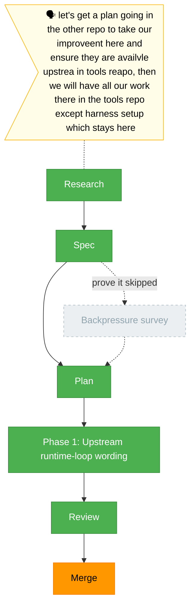

# `the-flow.md` - upstream-harness-improvements

**Plan**: upstream-harness-improvements . **Mode**: Simple
**Rail**: `[the-flow] ◆-◆-◆-[◆]-◆-◇` . **now**: Review approved . **next**: Merge analysis

**Legend**: done . in progress . blocked . known future . assumed future . user input . companion . worker

_Generated from `the-flow.json`._
