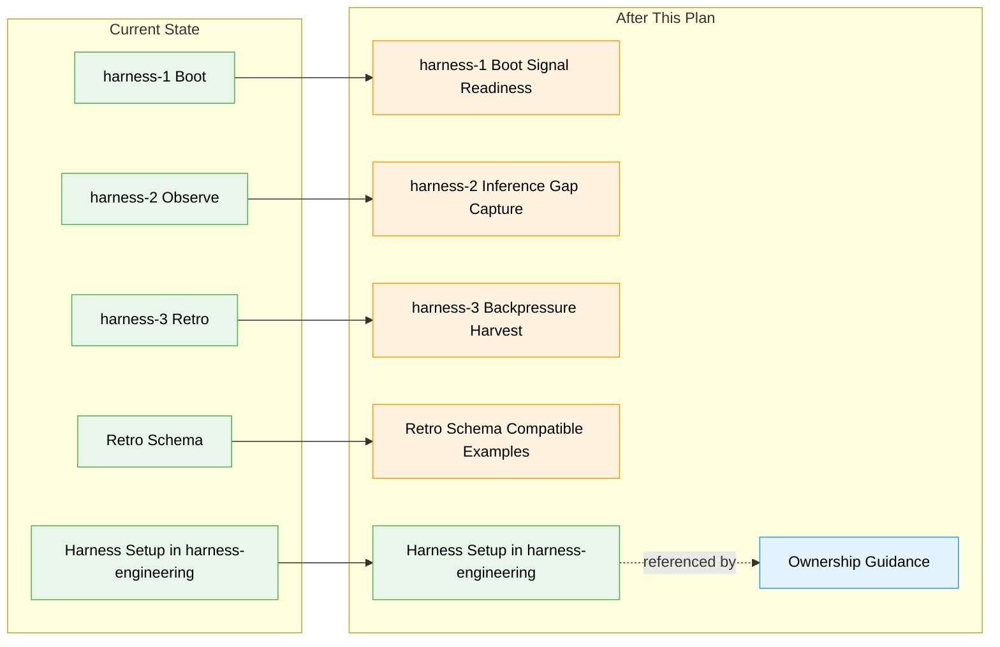

# Flight Plan: Upstream Harness Improvements

**Spec**: [upstream-harness-improvements-spec.md](./upstream-harness-improvements-spec.md)  
**Plan**: [upstream-harness-improvements-plan.md](./upstream-harness-improvements-plan.md)  
**Generated**: 2026-05-30T05:32:56Z  
**Status**: Landed

---

## The Mission

**What we're building**: We are moving the runtime harness-loop improvements from harness-engineering into tools, where `harness-1-boot`, `harness-2-observe`, and `harness-3-retro` are now canonical. The setup skill stays in harness-engineering; tools will consume setup-generated artifacts and make signal-readiness, inference gaps, and back-pressure opportunities visible during the runtime loop.

**Why it matters**: This prevents duplicate harness skills while making the stronger "what should the harness have proved?" improvement loop available upstream.

---

## Where We Are -> Where We're Headed

```text
TODAY:                                      AFTER this plan:
Tools has canonical harness-1/2/3           Tools harness-1/2/3 include signal/back-pressure language
Setup improvements live in harness-eng      Setup remains in harness-eng, referenced not copied
Retro schema has fixed kind enum            Signal gaps encode through schema-safe kinds/targets
plan-2d owns design-time backpressure       Runtime loop also captures missing proof during work
Existing orphan tooling reports drift       Validation uses orphan + schema checks
```



**Legend**: existing (green) | changed (orange) | new (blue)

---

## Scope

**Goals**:

- Align `harness-1-boot` with setup-generated signal/back-pressure readiness.
- Teach `harness-2-observe` to capture inference gaps and missing deterministic signals.
- Teach `harness-3-retro` to surface both ease improvements and proof/back-pressure improvements.
- Preserve retro schema compatibility by using existing kinds plus targets and encoding hints.
- Clarify setup/runtime ownership in tools docs.

**Non-Goals**:

- Move `engineering-harness-setup` into tools.
- Recreate legacy `boot-harness` or `compound-*` skill names in tools.
- Add mandatory gates, scores, thresholds, or blocking behavior.
- Add product-specific sensors for downstream repositories.

---

## Journey Map


**Legend**: green = done | yellow = active | grey = not started

---

## Phases Overview

| Phase | Title | Tasks | CS | Status |
|-------|-------|-------|----|--------|
| 1 | Upstream runtime-loop wording, schema-safe examples, validation, and ownership docs | 6 | CS-3 | Complete |

---

## Acceptance Criteria

- [x] `harness-1-boot` describes and reports signal/back-pressure readiness dimensions.
- [x] `harness-1-boot` still treats missing governance docs as `UNAVAILABLE`, not a failure.
- [x] `harness-2-observe` includes triggers for inference gaps and missing deterministic signals/sensors.
- [x] `harness-2-observe` maps those gaps into schema-valid retro entries.
- [x] `harness-3-retro --drain` prompts for ease and proof/back-pressure improvements.
- [x] `harness-3-retro --harvest` distinguishes ease improvements from back-pressure improvements.
- [x] Tools docs state runtime loop skills live in tools and setup/provisioning remains in harness-engineering.
- [x] Sample retro entries validate against tools' existing retro schema.

---

## Key Risks

| Risk | Mitigation |
|------|------------|
| Non-schema `kind` values break retro validation | Use existing `difficulty` or `improvement-suggestion` kinds plus targets and encoding hints. |
| Setup behavior creeps into tools | Keep tools runtime-only and reference harness-engineering for provisioning. |
| Back-pressure reads as a mandatory gate | Preserve advisory, best-effort, threshold-free wording. |
| Old deployed skills linger | Include `just skills-orphans` / `just doctor-skills` in validation guidance. |

---

## Flight Log

- 2026-05-30T07:37:29Z — Phase 1 implementation started; local engineering harness governance is unavailable, so validation will use repo-local schema, skill, drift, and grep checks.
- 2026-05-30T08:00:00Z — Phase 1 landed; schema, fixture, drift, legacy slug, advisory wording, `just skills-orphans`, and `just doctor-skills` checks completed. Baseline orphan report: `pack-code` is hand-installed local-only and was not deleted.

## Implementation Checklist

| Status | Task | Evidence |
|--------|------|----------|
| [x] | T001 — Schema-safe signal-gap examples | `fixtures/signal-backpressure.retro.md` plus schema README guidance |
| [x] | T002 — Boot signal-readiness reporting | `harness-1-boot` now reports signal readiness and preserves `UNAVAILABLE` |
| [x] | T003 — Observe triggers and encoding guidance | `harness-2-observe` logs inference gaps with schema-safe targets |
| [x] | T004 — Retro drain/harvest prioritization | `harness-3-retro` surfaces proof/back-pressure candidates without gates or schema changes |
| [x] | T005 — Ownership and migration guidance | README, INSTALL, and compound README clarify tools runtime vs harness-engineering setup |
| [x] | T006 — Validation | Schema/frontmatter validation, drift checks, orphan report, and doctor report completed |
