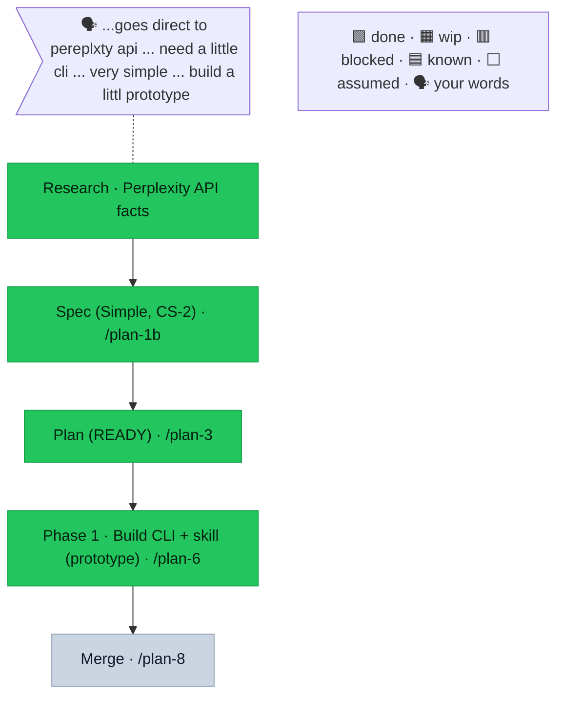

# Flight plan — perplexity-deep-research

> Generated from `the-flow.json`. Do not hand-edit.

```mermaid
flowchart TD
  classDef done fill:#22c55e,stroke:#16a34a,color:#06210f;
  classDef wip fill:#f97316,stroke:#ea580c,color:#2a1206;
  classDef blocked fill:#ef4444,stroke:#b91c1c,color:#2a0808;
  classDef known fill:#cbd5e1,stroke:#94a3b8,color:#0f172a;
  classDef assumed fill:#f1f5f9,stroke:#cbd5e1,color:#475569,stroke-dasharray:4 3;

  research["Research · Perplexity API facts"]:::done
  spec["Spec (Simple, CS-2) · /plan-1b"]:::done
  plan["Plan (READY) · /plan-3"]:::done
  p1["Phase 1 · Build CLI + skill (prototype) · /plan-6"]:::done
  merge["Merge · /plan-8"]:::known

  research --> spec --> plan --> p1 --> merge

  say1>"🗣 ...goes direct to pereplxty api ... need a little cli ... very simple ... build a littl prototype"]
  say1 -.- research

  legend["🟩 done · 🟧 wip · 🟥 blocked · 🟦 known · ⬜ assumed · 🗣 your words"]
```
