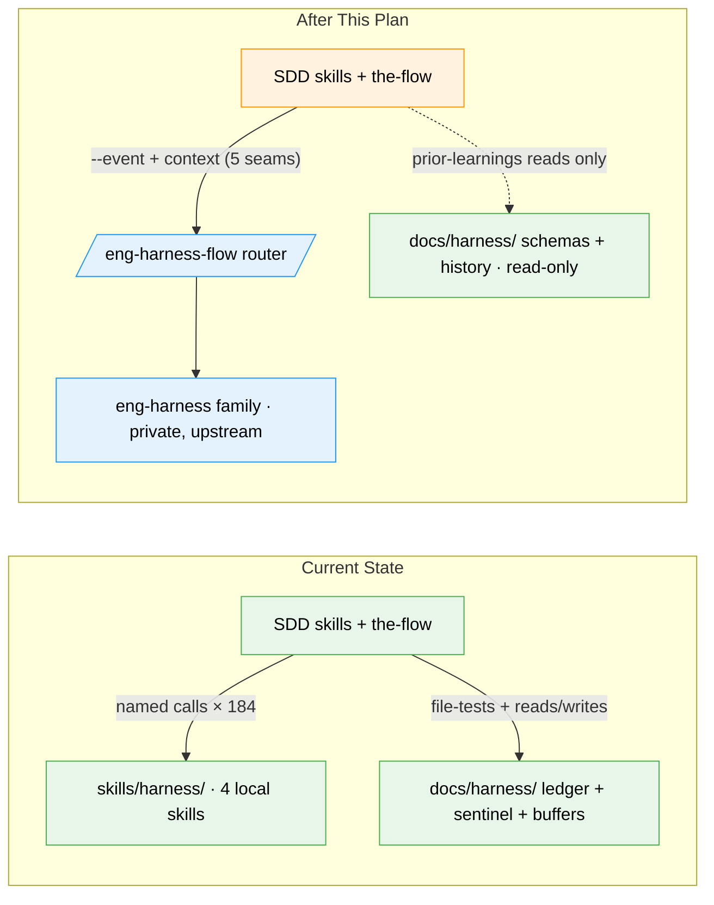

# Flight Plan: eng-harness switchover

**Spec**: [eng-harness-switchover-spec.md](./eng-harness-switchover-spec.md)
**Plan**: [eng-harness-switchover-plan.md](./eng-harness-switchover-plan.md)
**Generated**: 2026-06-10
**Status**: Complete (awaiting user commit + review/merge)

---

## The Mission

**What we're building**: The SDD pipeline stops carrying its own four harness skills and instead talks to the external engineering-harness family (AI-Substrate/harness-engineering) through exactly one door: the `/eng-harness-flow` router. Skills tell the router *where they are* (`--event post-spec`, `--event phase-end`, …) and the router decides what the harness should do. If the harness isn't installed or the repo has none, you get one calm warning and everything proceeds normally.

**Why it matters**: One stable name instead of four pinned ones — the harness family can evolve freely upstream without ever breaking this repo, and the SDD pipeline finally stops reaching into harness internals it doesn't own.

---

## Where We Are → Where We're Headed

```
TODAY:                                      AFTER this plan:
4 local harness skills (32 total)           0 local harness skills (28 total)
~184 harness-slug refs in 23 live files     1 entry point: /eng-harness-flow
~12 sentinel checks + 8 buffer checks       0 — router owns all harness state
observe instructions in 7 SDD skills        0 — observe is the harness's own concern

🟡 skills/SDD/*  → call harness children    🟡 skills/SDD/*  → call the router only (5 seams)
🔴 skills/harness/ (4 skills)               ❌ deleted (+ deploy stores tidied)
🟡 the-flow → 4 alias rows + sentinel       🟡 the-flow → /plan-2d → router; detection + calm warning
🔵 docs/harness/schemas + agents history    🔵 kept — frozen contract copy + read-only history
🔴 docs/harness/_buffers, .disabled,        ❌ removed (concept lives upstream in .harness/**)
   compound-value tooling, drift check
```



**Legend**: existing (green, unchanged) | changed (orange, modified) | new (blue, created)

---

## Scope

**Goals**:
- Route every surviving harness seam through `/eng-harness-flow` with context — children never named
- Remove observe, the `.disabled` sentinel, buffer checks, governance file-tests, and plan-6a's retro writes from SDD entirely
- Two-layer detection: router installed? repo harness provisioned? — one calm warning when not, then silence
- Delete `skills/harness/` + tidy deploy stores; aggressive removal with an explicit keep-list
- Rewrite the-flow's story (SKILL.md, flight-plan schema/templates, getting-started.md)
- Record freeze override #2; supersede plan-027's ownership claim

**Non-Goals**:
- No substrate-repo changes (cross-repo follow-ups logged, not done)
- No harness provisioning for this repo
- No schema *meaning* changes (minih contract); no `docs/plans/**` rewrites
- No gates, scores, or blocking — everything stays advisory

---

## Journey Map


**Legend**: green = done | yellow = active | grey = not started

---

## Phases Overview

| Phase | Title | Tasks | CS | Status |
|-------|-------|-------|----|--------|
| 1 | Switchover cascade · one commit | 14 (T001–T014, strictly ordered) | CS-4 | Complete |

**Task train**: probe + install external family (T001–T002) → rewire seams across 9 SDD skills (T003–T006) → plan-3 templates (T007) → docs + tooling sweep (T008–T009) → the-flow last (T010) → delete + deploy tidy + forward-pointers + full verification (T011–T014). Plan status: **READY** — gates 4 PASS / 3 N/A.

---

## Acceptance Criteria

- [x] No live file references the four child slugs or any `eng-harness-[0-9]` child (greps clean, history whitelisted)
- [x] Five seams route via `/eng-harness-flow --event …` with context; all other seams removed
- [x] Zero observe instructions and zero `.disabled` checks anywhere in SDD
- [x] plan-3/plan-5 templates emit router syntax into future artifacts
- [x] `skills/harness/` deleted; 28 skills; buffers/compound-value/drift-check gone
- [x] No router installed → exactly one calm warning, then silent omission (live pre-install probe miss captured as evidence)
- [x] the-flow + getting-started rewritten; installed-copy smoke passes
- [x] Freeze override #2 recorded; 027 superseded; deploy stores tidied to known baseline

---

## Key Risks

| Risk | Mitigation |
|------|-----------|
| Freeze override #2, two days into the reset window | CLAUDE.md audit trail; re-freeze over the one router name |
| 027's ownership claims get "fixed" backwards later | Explicit supersession + forward-pointers atop 024/027 |
| Editing the driver skills mid-session | Installed copies drive the session; the-flow/plan-3 edits last |
| One-commit landing harder to bisect | All verification greps run pre-commit; rollback = one revert |
| Deploy tidy silently no-ops (zsh gotcha) | Literal slugs, both stores, verified by `skills-orphans` |

---

## Flight Log

<!-- Updated by /plan-6 and /plan-6a after each phase completes -->

### Phase 1: Switchover cascade · one commit — Complete (2026-06-10)

**What was done**: All 14 tasks (T001–T014) executed in strict order; 12/12 acceptance criteria verified with recorded evidence. The eng-harness family was installed (from the in-sync local substrate checkout — the GitHub default branch doesn't carry it yet), the router smoke captured a live setup-routing envelope, 10 SDD skills + the-flow's 4 reference files were rewired router-only, 7 docs rewritten, tooling stripped, `skills/harness/` + `_buffers/` deleted (32→28 skills), deploy stores tidied + redeployed, forward-pointers placed atop plans 024/027.

**Key changes**:
- `skills/SDD/**` — five seams route exclusively via `/eng-harness-flow --event …`; observe/sentinel/buffer/retro-write machinery removed
- `skills/harness/` — **deleted** (4 skills); deploy stores tidied with literal paths
- `CLAUDE.md` — § Engineering harness rewrite + freeze override #2; `README*.md`/`INSTALL.md`/`MIGRATION.md`/pipeline README repointed; `docs/harness/README.md` → slim frozen-history pointer
- `justfile`/`scripts/` — drift block + compound-value tooling removed; schema description-strings-only patches

**Decisions made**: install from local substrate checkout (upstream branch unmerged — logged as cross-repo follow-up #1); no-router run post-install deliberately not staged (AC7 evidence-chain decision); `engineering-harness-setup` duplicate in claude store left as pre-existing machine wart.

**The commit is the user's** (git agent-read-only) — suggested message in `execution.log.md`.

---

## PlanPak

Not active for this plan.
