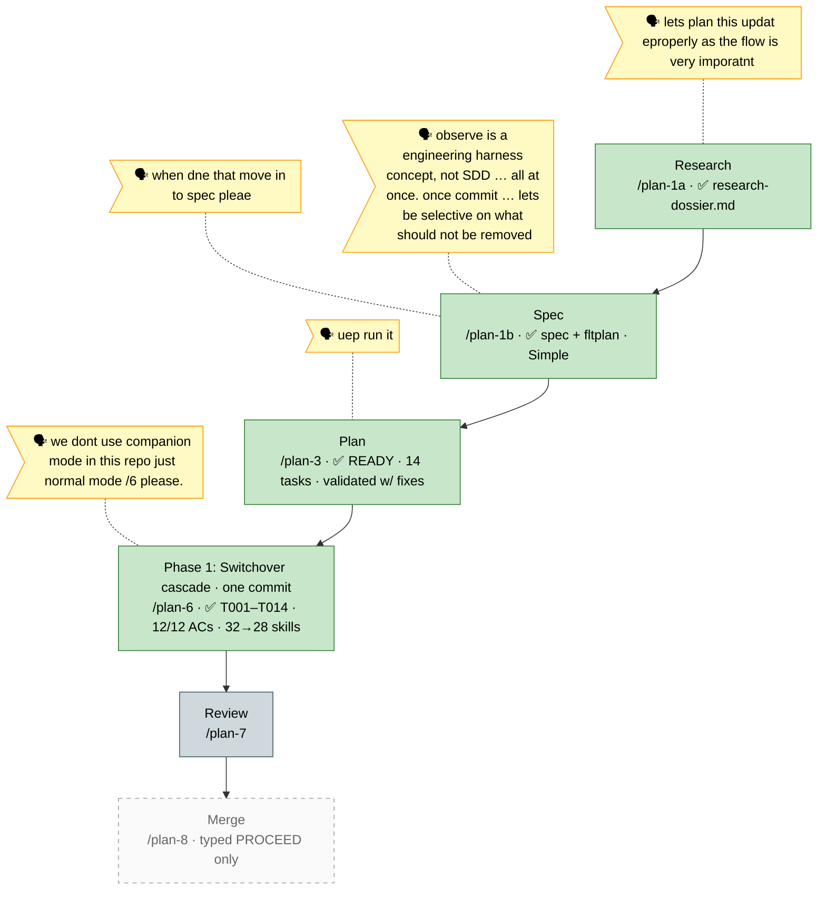

# Flight plan — eng-harness-switchover

> Generated from [`the-flow.json`](./the-flow.json) — never hand-edit this file.
> **Now**: Build done — T001–T014 complete, 12/12 ACs verified; one commit staged for the user · **Next**: Review (`/plan-7`), then user commits + merge (`/plan-8`, typed `PROCEED`)

**Legend**: 🟩 done · 🟧 in progress · 🟥 blocked · 🟦 known (designed future) · ⬜ dashed = assumed (speculative) · 🗣 verbatim user input

*(No harness nodes for this flow: the eng-harness router was absent at flow start — the live no-router fixture whose probe miss became AC7 evidence. The router was installed mid-build at T001, machine-level. Fitting: this plan's subject IS graceful no-harness degradation.)*
