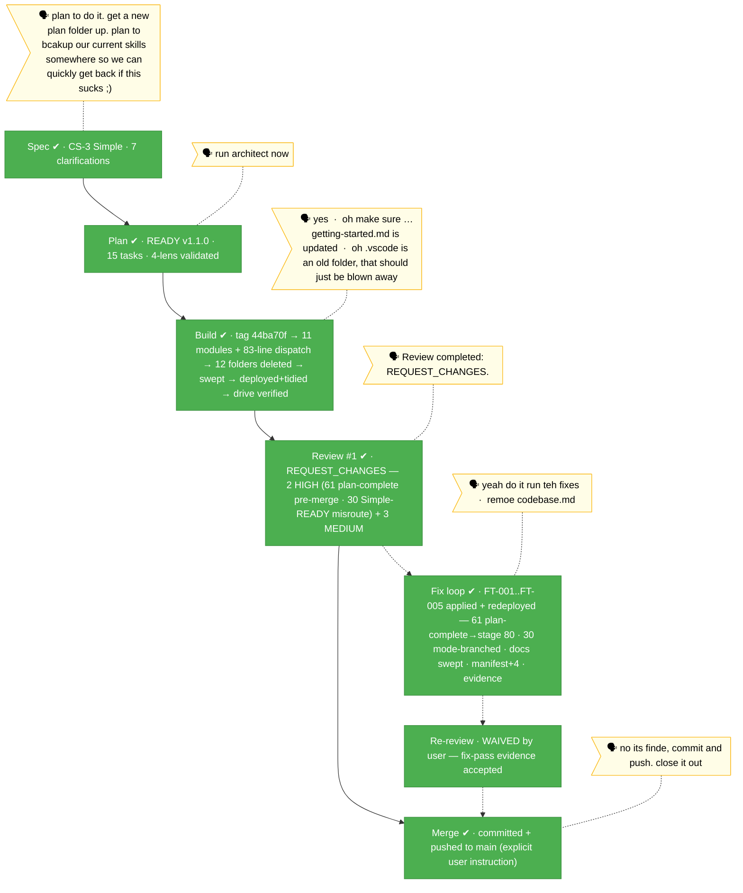

# the-flow · flow-skill-consolidation

**Plan**: flow-skill-consolidation · **Mode**: Simple · **Phases**: 1
**Rail**: `[the-flow] ◆─◆─◆─◆─◆─◆`   ·   **now**: COMPLETE — committed + pushed to main · **next**: — (flow complete)

**Legend**: 🟩 done · 🟧 in progress · 🟥 blocked · 🟦 known future (designed) · ⬜╴assumed future (dashed) · 🟨 🗣 verbatim user input · 🟪 harness seams (violet — routed via `/eng-harness-flow`)

_Generated from `the-flow.json` — never hand-edit this file as the primary. **Flow complete 2026-06-11**: the consolidated `the-flow` (83-line dispatch + 00-routing/coach + 11 stage modules) shipped — spec → plan → build → review (REQUEST_CHANGES) → fix pass (FT-001..FT-005, redeployed) → re-review waived by user → committed + pushed to main. Rollback anchor remains: git tag `pre-flow-consolidation` @ 44ba70f._
