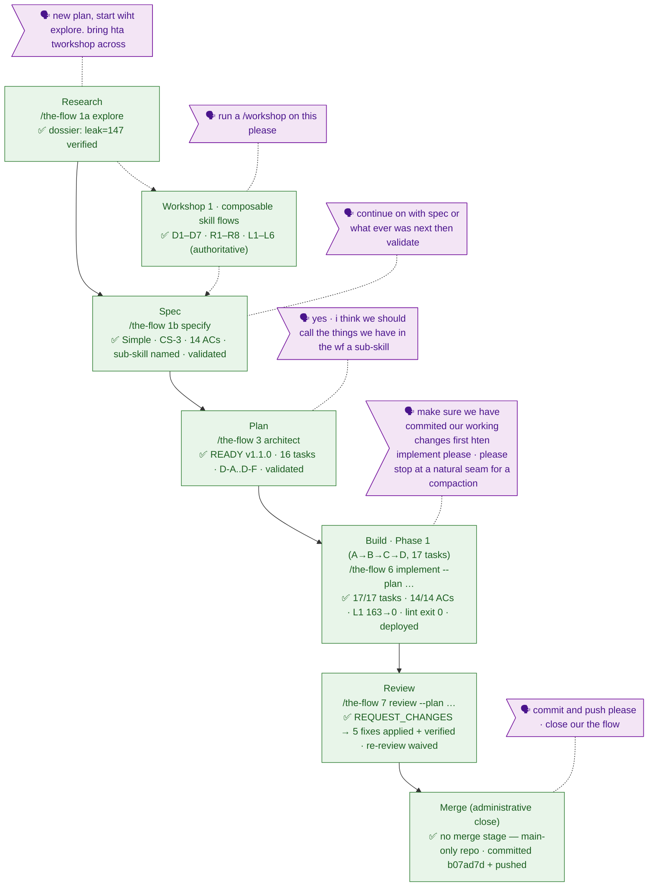

<!-- 🔄 GENERATED from the-flow.json — never hand-edit this file as the primary. -->
# the-flow · skills-flow-architecture — flight plan

**Legend**: 🟩 done · 🟧 in progress · 🟥 blocked · 🟦 known (designed) · ⬜ dashed = assumed (speculative) · 🗣 verbatim user input · 🟪 harness loop (omitted — repo not provisioned)

- **Now**: **Flow closed.** Review fixes applied + verified (re-review waived by user); all plan-031 work committed directly to `main` as `b07ad7d` (36 files, +5510/−1890) and pushed.
- Review verdict was REQUEST_CHANGES — 5 fix tasks (FT-001..FT-005), all applied + verified: lint's next-step family made case-insensitive + plural (true L1 baseline ≈165, two `## Next Steps` leaks fixed), L3 now catches verb-led + id-only view literals, stale 61/stage-numbering prose cleaned ×4, AC7/AC13 reconciled to the four authorized literal classes.
- No merge stage executed: this repo works on **main only** — there was no branch to merge; stage 8's PROCEED gate never applied.
- Mid-architect user decision (spec Clarification #5 / plan D-E): the reusable unit inside a flow is a **sub-skill** — named by a verb, composed by the flow's Registry+Graph.
- Harness: router installed, repo not provisioned — all five seams (session-start, post-spec, pre-implement T000, phase-end T0zz, plan-complete at close-out) noop'd calmly, exactly as the plan expected.
- Build paused once mid-phase for a user-requested `/compact` (after T012) and resumed at T013 — seam logged in `execution.log.md`.
