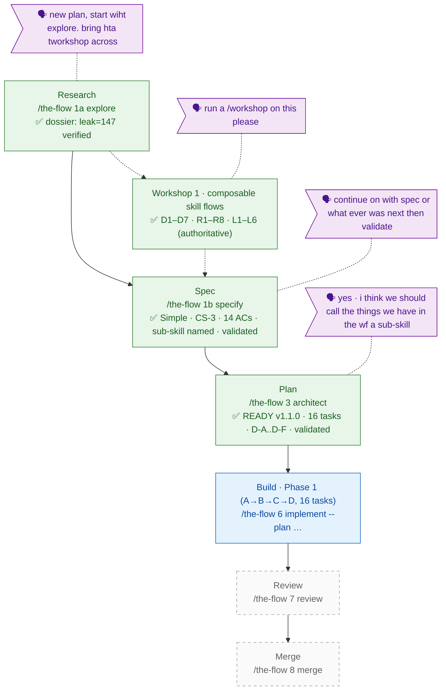

<!-- 🔄 GENERATED from the-flow.json — never hand-edit this file as the primary. -->
# the-flow · skills-flow-architecture — flight plan

**Legend**: 🟩 done · 🟧 in progress · 🟥 blocked · 🟦 known (designed) · ⬜ dashed = assumed (speculative) · 🗣 verbatim user input · 🟪 harness loop (omitted — repo not provisioned)

- **Now**: Plan · READY v1.1.0 (`skills-flow-architecture-plan.md` — 16 tasks, 14 ACs, decisions D-A…D-F; validate-v2 applied 2 CRITICAL + 5 HIGH fixes)
- **Next**: Build · `/the-flow 6 implement --plan "docs/plans/031-skills-flow-architecture/skills-flow-architecture-plan.md"`
- Mid-architect user decision (spec Clarification #5 / plan D-E): the reusable unit inside a flow is a **sub-skill** — named by a verb, composed by the flow's Registry+Graph.
- Harness: router installed, repo not provisioned — seams noop; the plan's T000/T0zz seam rows fire at build (expect calm noop).
