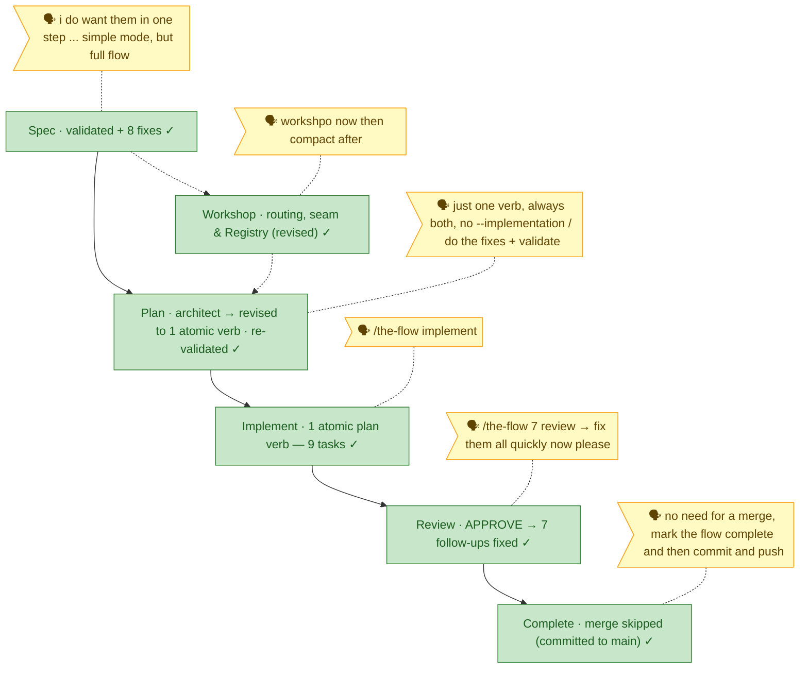

<!-- 🔄 GENERATED from the-flow.json — do not hand-edit; regenerated by /the-flow each turn. -->
# Flight plan — unified-planning-doc

**Legend**: 🟩 done · 🟧 in progress · 🟥 blocked · 🟦 known (designed) · ⬜ assumed (speculative, dashed) · 🗣 verbatim user input

_Mode: Simple · **FLOW COMPLETE** (5/5) · review APPROVE → all 7 follow-ups (F001–F007) fixed, lint + slug clean, redeployed · formal merge stage skipped by user; changes committed directly to main · harness: unprovisioned → seams noop._
