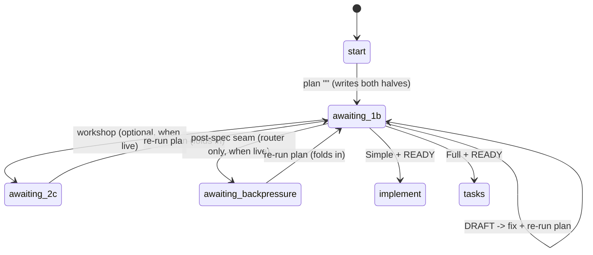

# Workshop: Two-halves-one-file routing, the conditional seam & the Registry/alias surface

**Type**: State Machine
**Plan**: 032-unified-planning-doc
**Spec**: [../unified-planning-doc-spec.md](../unified-planning-doc-spec.md)
**Created**: 2026-06-16
**Status**: Draft

**Value Thesis**: Freezes the load-bearing design the spec deliberately deferred — the verb/modes, the exact routing markers, the state re-map, adoption, stale-marking, and where the seam lives — so the architect writes the Registry/Graph from one authoritative source instead of guessing six interdependent decisions.
**Target Proof Level**: Contract Ready
**Current Proof Level**: Contract Ready (revised 2026-06-16 — single atomic `plan` verb per user; the 2 prior nods are now superseded/confirmed — see § Decisions confirmed by the user)

**Selected Value Axes**:
- **Implementation Readiness**: the architect + implementer can build the merged stage, the Graph, and the alias table directly from this doc.
- **Safety to Change**: the routing markers + state re-map are exact and back-compatible (old state files + legacy folders still resolve).
- **Knowability**: makes the hidden "how does one file encode two states" behaviour explicit.
- **Review Compression**: a reviewer checks the built stage against the state table + predicates here, not against intuition.

**Related Documents**:
- Spec § Workshop Opportunities, § Acceptance Criteria (AC-02, AC-05, AC-07, AC-09), OQ1/OQ2
- `docs/skills-pipeline/flow-architecture.md` § Seam placement, § Registry, § Graph
- Live flow: `skills/SDD/the-flow/SKILL.md` (Registry/alias), `references/00-routing.md` (Graph/adoption)

---

## Purpose

Resolve the six interdependent unknowns the validators surfaced, as one coherent state machine: (1) the verb + modes, (2) the exact routing/resume markers, (3) the Graph state re-map, (4) the Registry/alias surface incl. direct-jump, (5) adoption of unified vs legacy folders, (6) stale-marking on clarify re-entry — plus where the seam lives so the sub-skill stays flow-blind.

## Fresh Entrant Outcome

A fresh agent should be able to use this workshop to reach **Contract Ready** with no extra context — i.e. write the merged `20-plan.md` sub-skill, the new Graph rows, the Registry row, and the alias entries, and know exactly which byte-strings drive routing.

## Key Questions Addressed

1. One verb or two? What is its name/id and what are its modes?
2. What exact disk markers + status fields distinguish "business half written" from "implementation half written"?
3. How do `awaiting-1b` / `awaiting-3` collapse/re-map, and how does the rail change?
4. Where does the seam pause live so the sub-skill stays flow-blind, and how does a Simple/no-harness run flow straight through?
5. How does adoption infer state for a unified doc vs a legacy split folder?
6. How is the implementation half marked stale when the business half is re-opened?

---

## Value Frame

| Field | Selection | Why It Matters |
|-------|-----------|----------------|
| Target Proof Level | Contract Ready | The architect needs exact markers + Registry/Graph shapes, not prose |
| Primary Value Axis | Implementation Readiness | The whole point is to unblock the architect |
| Supporting Value Axes | Safety to Change, Knowability, Review Compression | Back-compat + legibility + checkability |
| Downstream Loop Improved | Architecture + Implementation | Removes 6 guesses from the plan stage and the build |

---

## Decision 1 — The verb (resolves OQ1) · **REVISED 2026-06-16 (user): single atomic verb, no modes**

### Decision Space

| Option | Description | Pros | Cons | Decision |
|--------|-------------|------|------|----------|
| A | Keep two verbs (`specify`, `architect`) both writing one file | Smallest module churn | **Two steps** — violates "one step"; two Registry rows | **Rejected** |
| B | One verb `plan`, id `1b`, two **modes** (`plan` business pass; `plan --implementation` impl pass) | Explicit two-beat, direct-jump per half | A user-facing flag + a half-written state to model (second state, between-seam, two-status, STALE) | **Rejected (was Selected; superseded by user 2026-06-16)** |
| C | **One verb `plan`, id `1b`, single atomic pass — always writes both halves** | Simplest surface; no flag, no half-state; one acceptance = whole document | Workshop-before-phases happens by iterate-then-re-plan, not a mid-verb pause | **Selected (user, 2026-06-16: "just one verb … always both … no need for --implementation")** |

**Selected: C.** One Registry row, one flag set, no `--implementation`:

```
| 1b | plan | references/stages/20-plan.md | intent, dossier?, workshops?, coverage? → <slug>-plan.md (one doc: business spec + impl plan, always both; gates G1–G7; auto-runs validate-v2) | "<intent>" [--simple] [--skip-clarify] |
```

- **`plan "<intent>" [--simple] [--skip-clarify]`** — *one atomic pass*: the front-loaded question set (Round-1 Mode/Testing/Mock/Docs + conditional Round-2 Domain Review / topic clarifications), then writes the **whole** `<slug>-plan.md` — top metadata + `## Business Specification` + `## Planning Seam` + `## Implementation Plan` (gates G1–G7, research subagents, phases/tasks, Acceptance Coverage Map) — and **auto-runs `/validate-v2`**. One invocation, both halves. Exit.
- **No `--implementation` flag, no business-only state.** "Always both, never one at a time" (user). The interactive question prompts happen *inside* the verb; they are not a flow seam.
- **Workshop/backpressure before phases** is preserved by **iteration, not a mid-verb pause**: run `plan` → if the surfaced `## Workshop Opportunities` warrant it, run `2c workshop` (or post-spec backpressure) → **re-run `plan`**, which regenerates *both* halves with the new decisions folded in. Re-running is always both (no stale half).
- **Accepted costs (named, not equivalence-washed)**: vs the old before-architect pause, the atomic verb (a) **wastes the first pass's phase design + its validate-v2** when the user workshops and re-plans, and (b) lands the workshop offer *after* a finished READY plan rather than *before* phases exist, which is a weaker prompt. Mitigation (not elimination): the seam-live coach beat is **assertive** when ≥1 Workshop Opportunity is unworkshopped — it names how many topics the phases were designed without and recommends workshop + re-plan before building. For the common Simple/no-harness case the seam is dormant and neither cost materialises. This is a deliberate, user-authorised trade (spec Non-Goals override).
- The module is **one file** `references/stages/20-plan.md` (rename of `20-specify.md`; `30-architect.md` folded in and deleted) — stays lint-visible at `maxdepth 1` (spec Non-Goal). Clarify re-entry stays as its § Re-entry section.

> **Module rename note**: `20-specify.md` → `20-plan.md`; the verb's contract block `**Verb**: plan`. Keep the file flow-blind: it knows "this verb writes the business half then the implementation half from it, in one pass" — nothing about stages or routing.

## Decision 2 — Exact routing/resume markers (resolves AC-05) · **REVISED: single status, no NOT PLANNED/STALE**

**Primary signal**: durable state (`.the-flow-state.json` `current_stage` + `pending_command`). **Disk fallback** (idempotent resume / adoption / post-`/compact`): exact-string `grep`, never fuzzy prose-scan.

Because `plan` is atomic (always both halves), there is **no "business written, impl pending" intermediate** to detect and **no STALE** — the only conditions are "no plan yet", "plan present (READY)", and "plan present but a gate FAILed (DRAFT)".

| Predicate | Exact disk check (case-sensitive) |
|-----------|-----------------------------------|
| **Plan written** | `<slug>-plan.md` exists AND a line matches `^## Implementation Plan$` |
| **Plan is unified (not legacy architect output)** | a line matches `^## Business Specification$` (legacy architect plans never do) |
| **Plan has unresolved gaps** | `^\*\*Status\*\*: DRAFT` |

Top metadata block (frozen shape — single status):

```markdown
# <Feature Title>
**Mode**: Simple | Full
**Created**: <ISO date>
**Status**: READY | DRAFT — UNRESOLVED GAPS
**Spec source**: unified (this file)
```

## Decision 3 — Graph state re-map + the rail collapse · **REVISED: one state, not two**

Old `awaiting-1b` (spec done) and `awaiting-3` (plan done) **both collapse into one** `awaiting-1b` (plan done — both halves written by the atomic `plan`):

| New state | Evidence (disk fallback) | Replaces | Edges (decorations preserved) |
|-----------|--------------------------|----------|-------------------------------|
| `awaiting-1b` | `<slug>-plan.md` with `## Implementation Plan` present | old `awaiting-1b` **and** old `awaiting-3` | DRAFT → fix + re-run `plan` (stay) · Simple+READY → **implement** · Full+READY → **tasks** · opt-when-live: **workshop** / post-spec backpressure → re-run `plan` to fold in; compact ✓; validate-v2 already auto-ran |

- The workshop excursion (`awaiting-2c`) and `awaiting-backpressure` hang off `awaiting-1b` as **post-plan refinements** — run one, then re-run `plan` (always both halves). When dormant (Simple/no-harness), they aren't offered and `awaiting-1b`+READY routes straight to implement/tasks.
- **Back-compat**: old state files keyed `awaiting-1b` **or** `awaiting-3` both translate at read time → the single `awaiting-1b`. An old `pending_command` targeting the architect (`/the-flow 3 architect`) rewrites to `/the-flow 1b plan`.



**Rail collapse (a direct win on "it's too large")**: the `Spec` and `Plan` macro-milestones merge into **one `plan` pip**. Full mode: `Research · Plan · Tasks · Build · Review · Merge` (**6**, was 7). Simple: `Plan · Build · Review · Merge` (~4). The pip fills when `plan` writes the document (both halves at once).

## Decision 4 — The seam is a post-plan refinement offer (resolves R5; keeps the sub-skill flow-blind) · **REVISED: no between-passes pause**

With one atomic `plan`, there is **no business→implementation join to pause at** — the verb writes both halves in one run. The workshop/backpressure seam therefore becomes an **optional post-plan refinement**, offered (when live) at `awaiting-1b` as a Graph edge decoration (flow-owned), never sub-skill logic. The `plan` verb stays flow-blind and never decides anything about routing.

**Seam-live predicate** (evaluated by the flow at `awaiting-1b`):
> LIVE when EITHER (a) the plan's `## Workshop Opportunities` table has ≥1 row with no corresponding `workshops/*.md` yet, OR (b) the harness is provisioned (governance doc present).

- **Seam LIVE** → the coach **offers** the refinement (workshop / backpressure / compact) before implement/tasks; taking it means running the excursion, then **re-running `plan`** to fold the decisions into both halves. Always an offer — the user may decline and proceed. Never gates.
- **Seam DORMANT** (no open workshop topics, no harness — the common Simple case) → no offer; `awaiting-1b`+READY routes straight to **implement** (Simple) / **tasks** (Full).

**No documented exception to "one accepted step per turn" is needed** — that exception only existed to auto-advance a second pass. The atomic verb already delivers "one acceptance = whole document"; the refinement excursions are ordinary optional steps.

The verb stays flow-blind: it is invoked once (`plan`) and writes both halves; whether to *offer* a post-plan refinement is the Graph's decision, not the verb's.

## Decision 5 — Adoption mapping (unified + legacy) · **REVISED: keyed on "impl half present?"**

Extend the coach.md adoption table. Detection hinges on the Decision-2 markers; all shapes infer the single `awaiting-1b` state, differing only in the pending verb:

| Artifacts present | Inferred state | pending verb (render at write time) |
|-------------------|----------------|-------------------------------------|
| `<slug>-plan.md` with `## Business Specification` + `## Implementation Plan` | `awaiting-1b` | `implement` (Simple) / `tasks` (Full) |
| `<slug>-plan.md` with `## Business Specification` but **no** `## Implementation Plan` (rare — interrupted run) | `awaiting-1b` | `plan` — re-run to complete (atomic, regenerates both) |
| **Legacy** `<slug>-spec.md` only (no plan) | `awaiting-1b` | `plan` — reads the legacy spec as the business source (AC-07 fallback), writes the unified plan |
| **Legacy** `<slug>-spec.md` + `<slug>-plan.md` (no `## Business Specification` in the plan) | `awaiting-1b` | `implement` / `tasks` — treat as a completed split plan; **do not migrate** |

A `<slug>-plan.md` is "unified" iff it contains `## Business Specification`; otherwise it is a legacy architect-only plan. Routing from `awaiting-1b` then keys on whether `## Implementation Plan` is present (→ implement/tasks) or not (→ re-run `plan`).

## Decision 6 — Clarify re-entry just re-runs `plan` (resolves OQ2) · **REVISED: STALE removed**

Because `plan` is atomic, there is **no stale-half problem and no STALE status**. Clarify re-entry (the § Re-entry path, formerly `plan-2-v2-clarify`) re-opens the business questions and then **re-runs `plan`**, which regenerates **both** halves together — the implementation half can never lag the business half.

1. Append a new `### Session` to `## Clarifications`; update affected business sections.
2. Re-run `plan` → both halves regenerated, `/validate-v2` re-runs, the single `**Status**` recomputed (READY/DRAFT).

No STALE banner, no separate stale-routing machinery — the always-both verb makes the intermediate impossible.

## Decision 7 — The in-document `## Planning Seam` section (adopts brief §4.3) · **REVISED: refinement record, not a pass divider**

`plan` writes a visible seam section so the optional refinements + the artifacts that informed the plan are legible in the file itself. It is a **record**, not a divider between passes:

```markdown
## Planning Seam
_Optional refinements — run any, then re-run `plan` to fold them in; none gate:_
- [ ] Workshop any still-fuzzy topic from § Workshop Opportunities (`/the-flow 2c workshop`)
- [ ] Post-spec backpressure: `/eng-harness-flow --event post-spec --spec <this file>` (router-installed only)
- [ ] `/compact` before a heavier re-plan

| Artifact | Present? | Effect on the plan |
|----------|----------|--------------------|
| research-dossier.md | y/n | informs Key Findings |
| workshops/*.md | y/n | authoritative design decisions |
| backpressure-coverage.md | y/n | optional Phase 0 sensors |
```

`plan` fills the table from the artifacts it consumed; the checkboxes record the refinements available before a re-plan.

## Decision 8 — Registry / alias / direct-jump surface (resolves OQ1 tail) · **REVISED: all aliases → `1b plan` (no flag)**

**Registry**: replace the two rows with the single `1b plan` row (Decision 1).

**Alias / old-slug table** (read-time; targets stored in id+flag form):

| retired slug / typed alias | → target (id + flags) |
|---|---|
| `plan-1b-v3-specify-and-clarify` | `1b plan` |
| `plan-2-v2-clarify` | `1b plan` (module § Re-entry) |
| `plan-3-v3-architect` | `1b plan` |
| typed `specify` | `1b plan` |
| typed `architect` / id `3` | `1b plan` |

- Direct-jump `/the-flow 3 architect` resolves at read time → `/the-flow 1b plan` (no user-visible break; the atomic verb writes both halves regardless of which alias you arrived through).
- Old `pending_command: /the-flow 3 architect` in any state file translates on read, rewrites on next state write.
- **Minor wart (open)**: id `3` retires but `3a adr` remains — `3a` is left as-is (renumbering churns more than it's worth). Noted, not blocking.

---

## Evidence Ledger

| Evidence | Location | Supports | Status |
|----------|----------|----------|--------|
| Exact marker predicates table | Decision 2 | AC-05 deterministic routing | Ready |
| State machine diagram + state table | Decision 3 | Graph re-map | Ready |
| Seam-live predicate + post-plan refinement offer | Decision 4 | AC-04, R5 (flow-blind) | Ready |
| Adoption mapping table (keyed on impl-present) | Decision 5 | AC-08 | Ready |
| Clarify re-runs `plan` (no STALE intermediate) | Decision 6 | OQ2 | Ready |
| Alias table | Decision 8 | AC-09, direct-jump back-compat | Ready |

## Attention Reduction

| Future Loop | Before Workshop | After Workshop |
|-------------|-----------------|----------------|
| Architecture | Guess verb/id, markers, state re-map, adoption, stale-marking | Copy the Registry row, Graph rows, predicates, alias table from here |
| Implementation | Infer how one file encodes two states | Exact `grep` predicates + status enum |
| Review | Reconstruct intended routing | Check built stage against the state table |

## Validation / Acceptance

This workshop reaches Contract Ready when:
- The architect can write the `1b plan` Registry row, the two new Graph rows, and the alias entries with no further design decisions. ✅ (provided here)
- Every spec OQ (OQ1, OQ2) and the deferred AC-05 marker have a frozen answer. ✅
- Back-compat is explicit for old state files **and** legacy split folders. ✅ (Decisions 3, 5, 8)

## Decisions confirmed by the user (2026-06-16)

1. **Verb name `plan`** (id `1b`) absorbing both `specify` and `architect`. ✅ Confirmed.
2. **One atomic verb, always both halves — no `--implementation` flag, no second pass.** ✅ Confirmed (user: "just one verb … always both … no need for --implementation"). This *supersedes* the earlier "two modes + auto-advance-when-dormant" design (old Decision 1 Option B / old Decision 4): there is no second pass to advance to — the verb writes both halves in one run. Downstream consequences folded into the revised Decisions 2 (single status), 3 (one state), 4 (no between-passes pause), 5 (adoption keyed on impl-present), 6 (STALE removed).

## Open Questions

### Q1: Does `3a adr` get renumbered now that `3` retires?
**OPEN (non-blocking)**: left as `3a` — renumbering churns the alias table + muscle memory for little gain. Revisit only if a future stage wants id `3`.

### Q2: Should a flagged-but-unworkshopped opportunity *force* the seam pause even in Simple mode?
**RESOLVED**: No — the seam is always an *offer*. "Live" means "offer a post-plan refinement"; the user may decline and continue straight to implement/tasks. Never gates (best-effort invariant).
