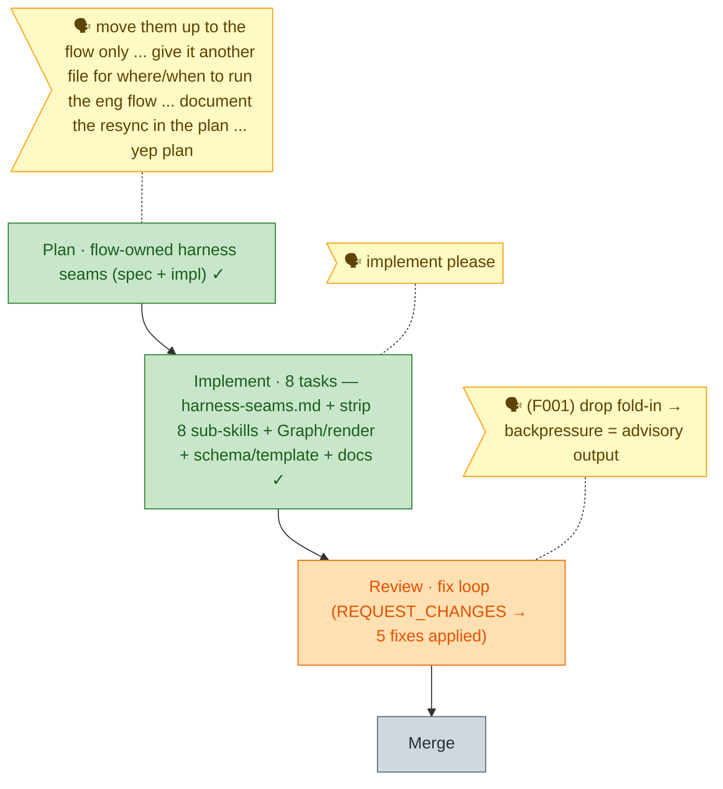

<!-- 🔄 GENERATED from the-flow.json — do not hand-edit; regenerated by /the-flow each turn. -->
# Flight plan — flow-owned-harness-seams

**Legend**: 🟩 done · 🟧 in progress · 🟥 blocked · 🟦 known (designed) · ⬜ assumed (speculative, dashed) · 🗣 verbatim user input

_Mode: Simple · 2/4 · Plan + Implement done; **Review in fix loop**. Review #1 = **REQUEST_CHANGES** (F001 HIGH: backpressure fold-in vs harness-blind `plan` verb; + F002–F005). All 5 fixed — **F001 resolved Option A** (the backpressure survey is now **advisory output**; the `plan` verb stays 100% harness-blind and the "fold the coverage in" promise was removed from every surface). F002 node-emission → installed-**and**-provisioned gate; F003 template `--json` + abbreviated note; F004 old-router = runtime-dependency gap (not auto-fallback); F005 coach intro. Re-verified (no fold-in language · concept-grep EMPTY · JSON ok · `just check-flow` L1–L6 clean) + redeployed. **Next: re-run review to confirm zero HIGH/CRITICAL.**_
