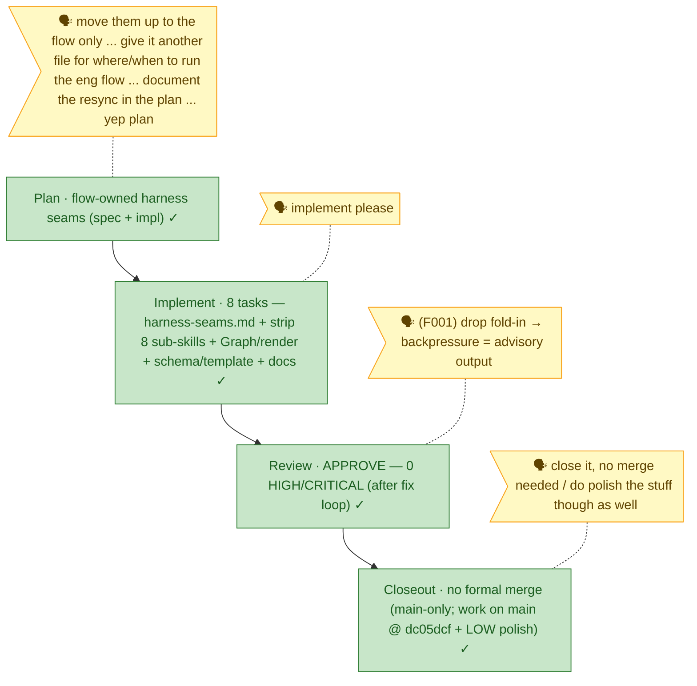

<!-- 🔄 GENERATED from the-flow.json — do not hand-edit; regenerated by /the-flow each turn. -->
# Flight plan — flow-owned-harness-seams

**Legend**: 🟩 done · 🟧 in progress · 🟥 blocked · 🟦 known (designed) · ⬜ assumed (speculative, dashed) · 🗣 verbatim user input

_Mode: Simple · 4/4 · **FLOW COMPLETE**. Plan → Implement → Review → Closeout all done. Review took two rounds: #1 **REQUEST_CHANGES** (F001 HIGH backpressure fold-in + F002–F005) → all 5 fixed (**F001 Option A**: backpressure = **advisory output**, `plan` verb stays harness-blind) → #2 **APPROVE** (0 HIGH/CRITICAL, coverage 95%). Residual **LOW** (`--event` "fallback" wording) **polished** at closeout — reworded to "back-compat understanding" in `harness-seams.md` + plan, reinstall/runtime-dependency kept as the only old-router rule. Closed at user request with **no formal stage-8 merge**: main-only repo, work already committed + pushed to `main` (**dc05dcf**) + the polish commit._
